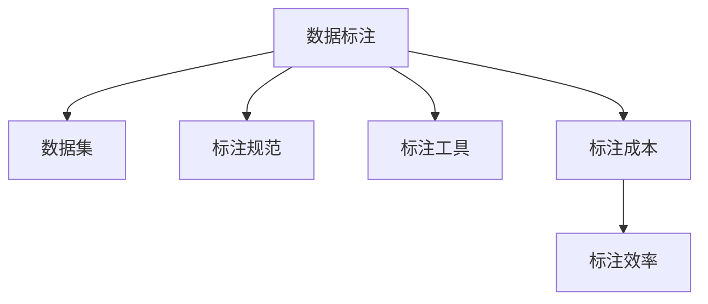
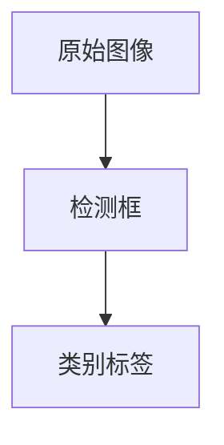

                 

## 1. 背景介绍

人工智能(AI)的迅速崛起离不开背后的数据标注工作，尽管这一过程往往不为人知。数据标注，即对原始数据进行标注、清洗、整理等处理，是大规模训练机器学习模型的基础。然而，这个看似简单的过程，实际上蕴藏着大量的技术细节和挑战，是决定AI模型效果的关键环节。

### 1.1 数据标注的意义

数据标注的意义在于将现实世界中的信息映射到机器可以理解和处理的形式。例如，对于图像识别任务，标注者需要为每一幅图像标注出其中的目标对象（如“猫”、“狗”等）；对于自然语言处理任务，标注者需要为文本添加标签（如情感、实体、意图等）。数据标注不仅是训练模型的前提，还在模型的不断优化和迭代中发挥着重要作用。

### 1.2 数据标注的发展

早期的人工智能研究，往往依赖于研究人员手动标注小规模数据集，但这样的方法效率低下、成本高昂。近年来，随着机器学习和深度学习技术的发展，自动化标注、半监督学习、无监督学习等方法逐渐成熟，数据标注技术也随之进步。

自动化标注利用了计算机视觉、自然语言处理等技术，部分地自动化了标注过程，但完全自动的标注仍然面临诸多挑战。半监督学习和无监督学习则进一步减轻了对人工标注的依赖，但仍需要大量人工参与，以进行数据校正和优化。

### 1.3 数据标注的现状

目前，数据标注依然是AI模型的重要 bottleneck。特别是对于大规模、高精度的模型训练，高质量、大量级的数据标注仍然必不可少。例如，在大规模图像识别任务中，可能需要数百万张标注过的图像才能训练出一个性能优良的模型。数据标注的效率和质量，直接影响到AI模型的效果和应用范围。

## 2. 核心概念与联系

### 2.1 核心概念概述

数据标注的核心概念包括：

- **数据标注**：对原始数据进行标签化的过程，是AI模型训练的基础。
- **数据集**：标注后的数据集合，用于机器学习模型的训练和测试。
- **标注规范**：对标注任务的具体要求和标准，确保标注结果的一致性和质量。
- **标注工具**：用于辅助标注过程的软件或平台，提高标注效率和质量。
- **标注成本**：完成标注任务所需的时间和人力成本，影响标注效率和规模。

这些概念之间的逻辑关系可以通过以下Mermaid流程图来展示：



这个流程图展示了大数据标注的基本流程和相关概念：

1. 数据标注是基础，将原始数据转化为模型可理解的形式。
2. 数据集是标注结果的集合，用于训练和评估模型。
3. 标注规范确保标注的一致性和标准性。
4. 标注工具提高标注效率和质量。
5. 标注成本影响标注的规模和效率。

## 3. 核心算法原理 & 具体操作步骤

### 3.1 算法原理概述

数据标注的本质是对数据进行有意义的编码，使机器能够理解并使用这些编码进行模型训练。形式化地，假设原始数据为 $D$，标注任务为 $T$，标注结果为 $L$，则数据标注过程可以表示为：

$$
T(D) = L
$$

其中 $T$ 为标注函数，将原始数据 $D$ 映射为标注结果 $L$。标注函数 $T$ 的设计和实现，是数据标注的关键环节。

### 3.2 算法步骤详解

数据标注一般包括以下几个关键步骤：

**Step 1: 定义标注任务和标准**
- 确定标注任务的具体内容，如分类、匹配、检测等。
- 设计标注标准，定义标注结果的类型和格式。
- 制定标注规范，确保标注结果的一致性和准确性。

**Step 2: 选择标注工具和平台**
- 根据任务需求，选择合适的标注工具，如Labelbox、Voyant、Prodigy等。
- 搭建标注平台，并配置标注界面和数据流。
- 培训标注员，确保标注结果符合规范。

**Step 3: 进行数据标注**
- 将原始数据导入标注平台，按批次进行标注。
- 标注员根据标注规范，对数据进行标注，并提交结果。
- 审核员对标注结果进行审核和校正，确保质量。

**Step 4: 数据清洗与整理**
- 对标注结果进行清洗，去除错误和异常数据。
- 对标注结果进行整理，生成统一的格式。
- 对标注结果进行验证，确保标注结果的一致性和准确性。

**Step 5: 数据集划分与存储**
- 将标注后的数据集划分为训练集、验证集和测试集。
- 对数据集进行存储和管理，确保数据的可访问性和可扩展性。

### 3.3 算法优缺点

数据标注方法具有以下优点：

1. **提升模型性能**：标注后的数据集，可以作为监督学习任务的训练数据，显著提升模型的性能。
2. **泛化能力强**：标注数据能够覆盖更多的真实场景，增强模型的泛化能力。
3. **标准化流程**：标准化流程和规范，确保标注结果的一致性和可重复性。

同时，数据标注也存在一定的局限性：

1. **成本高昂**：高质量的标注需要大量人工参与，成本较高。
2. **效率较低**：标注过程往往需要多次审核和校正，效率较低。
3. **质量不稳定**：不同标注员和审核员的标注结果可能存在差异。
4. **数据偏见**：标注数据可能带有偏见，影响模型的公平性和公正性。

尽管存在这些局限性，但就目前而言，数据标注仍然是AI模型训练和优化不可或缺的一部分。未来相关研究的重点在于如何进一步提高标注效率、降低成本，同时提高标注质量和模型的公平性。

### 3.4 算法应用领域

数据标注在各个AI应用领域都有广泛应用，以下是几个典型场景：

- **计算机视觉**：图像分类、目标检测、人脸识别等任务。通过标注像素级或框标注，模型能够学习图像中的特征和对象。
- **自然语言处理**：情感分析、命名实体识别、机器翻译等任务。通过标注词汇级或句子级标签，模型能够理解文本含义和结构。
- **语音识别**：语音转文字、语音指令识别等任务。通过标注音频波形和文本转录，模型能够学习语音信号和文字之间的映射。
- **推荐系统**：商品推荐、音乐推荐等任务。通过标注用户行为数据，模型能够学习用户的兴趣和偏好。

除了这些典型应用外，数据标注还被用于医疗影像分析、智能家居控制、自动驾驶等多个领域，为AI技术的发展提供了坚实的数据基础。

## 4. 数学模型和公式 & 详细讲解

### 4.1 数学模型构建

数据标注的数学模型可以从标注结果的角度出发。假设标注结果 $L$ 为 $n$ 个标签 $l_1, l_2, ..., l_n$，则数据标注过程可以表示为：

$$
L(D) = \{l_1, l_2, ..., l_n\}
$$

其中 $D$ 为原始数据，$L$ 为标注结果。标注函数 $T$ 的具体形式取决于标注任务的类型。

### 4.2 公式推导过程

对于二分类任务，标注结果可以表示为 $L = \{0, 1\}$，其中 $0$ 表示负类，$1$ 表示正类。标注函数 $T$ 可以表示为：

$$
T(D) = 1 \text{ if } D \text{ is positive} \\
T(D) = 0 \text{ if } D \text{ is negative}
$$

对于多分类任务，标注结果可以表示为 $L = \{1, 2, ..., k\}$，其中 $k$ 为类别数。标注函数 $T$ 可以表示为：

$$
T(D) = i \text{ if } D \text{ belongs to class } i
$$

对于对象检测任务，标注结果可以表示为 $L = \{(b_x, b_y, w, h)\}$，其中 $(b_x, b_y)$ 为检测框的左上角坐标，$w$ 和 $h$ 为检测框的宽度和高度。标注函数 $T$ 可以表示为：

$$
T(D) = (b_x, b_y, w, h) \text{ if } D \text{ contains an object}
$$

### 4.3 案例分析与讲解

以计算机视觉中的目标检测为例，假设原始图像 $D$ 为 $512 \times 512$ 的彩色图像，标注任务为检测图像中的行人、车辆等对象。标注数据 $L$ 包括每个对象的边界框和类别标签。标注结果 $l_i$ 可以表示为：

$$
l_i = (b_{x_i}, b_{y_i}, w_i, h_i, c_i)
$$

其中 $b_{x_i}, b_{y_i}$ 为检测框的左上角坐标，$w_i, h_i$ 为检测框的宽度和高度，$c_i$ 为类别标签。标注函数 $T$ 可以表示为：

$$
T(D) = \{l_1, l_2, ..., l_n\}
$$

其中 $n$ 为图像中检测到的对象数。标注过程如图 1 所示：



标注结果可以用于训练目标检测模型，如YOLO、Faster R-CNN等。在模型训练过程中，通过反向传播算法，计算模型输出与标注结果之间的差异，并更新模型参数，从而提升模型的检测能力。

## 5. 项目实践：代码实例和详细解释说明

### 5.1 开发环境搭建

在进行数据标注的实践前，我们需要准备好开发环境。以下是使用Python进行OpenCV和PyTorch开发的环境配置流程：

1. 安装Anaconda：从官网下载并安装Anaconda，用于创建独立的Python环境。

2. 创建并激活虚拟环境：
```bash
conda create -n cv-env python=3.8 
conda activate cv-env
```

3. 安装OpenCV：根据操作系统版本，从官网获取对应的安装命令。例如：
```bash
conda install opencv
```

4. 安装PyTorch：根据CUDA版本，从官网获取对应的安装命令。例如：
```bash
conda install pytorch torchvision torchaudio cudatoolkit=11.1 -c pytorch -c conda-forge
```

5. 安装各类工具包：
```bash
pip install numpy pandas scikit-learn matplotlib tqdm jupyter notebook ipython
```

完成上述步骤后，即可在`cv-env`环境中开始数据标注实践。

### 5.2 源代码详细实现

下面我们以计算机视觉中的目标检测任务为例，给出使用OpenCV和PyTorch进行目标检测数据标注的PyTorch代码实现。

首先，定义目标检测的标注函数：

```python
import torch
import cv2
import numpy as np
from torchvision import transforms, datasets

def detect_objects(image_path, classes, labels):
    image = cv2.imread(image_path)
    height, width, _ = image.shape

    # 应用预训练模型进行目标检测
    model = torchvision.models.detection.fasterrcnn_resnet50_fpn(pretrained=True)
    model.eval()
    image_tensor = transforms.ToTensor()(image)
    image_tensor = image_tensor.unsqueeze(0)
    with torch.no_grad():
        predictions = model(image_tensor)
        boxes = predictions[0]['boxes']
        scores = predictions[0]['scores']
        labels = predictions[0]['labels']
        num_objects = len(boxes)

    # 将检测结果转化为标注格式
    labels = [int(i) for i in labels]
    boxes = [[box.cpu().numpy().tolist()] * num_objects for box in boxes]

    return boxes, labels

# 目标类别列表
classes = ['person', 'car', 'bus']

# 加载图片并检测目标
image_path = 'example.jpg'
boxes, labels = detect_objects(image_path, classes, classes)
```

然后，定义数据处理函数：

```python
from transformers import BertTokenizer
from torch.utils.data import Dataset
import torch

class ObjectDetectionDataset(Dataset):
    def __init__(self, images, boxes, labels, tokenizer, max_len=128):
        self.images = images
        self.boxes = boxes
        self.labels = labels
        self.tokenizer = tokenizer
        self.max_len = max_len
        
    def __len__(self):
        return len(self.images)
    
    def __getitem__(self, item):
        image = self.images[item]
        boxes = self.boxes[item]
        labels = self.labels[item]
        
        # 将图像和标注转化为Tensor格式
        image_tensor = torch.from_numpy(image).float()
        boxes_tensor = torch.tensor(boxes, dtype=torch.float)
        labels_tensor = torch.tensor(labels, dtype=torch.long)
        
        return {'image': image_tensor,
                'boxes': boxes_tensor,
                'labels': labels_tensor}

# 创建dataset
tokenizer = BertTokenizer.from_pretrained('bert-base-cased')

train_dataset = ObjectDetectionDataset(train_images, train_boxes, train_labels, tokenizer)
dev_dataset = ObjectDetectionDataset(dev_images, dev_boxes, dev_labels, tokenizer)
test_dataset = ObjectDetectionDataset(test_images, test_boxes, test_labels, tokenizer)
```

接着，定义模型和优化器：

```python
from transformers import BertForTokenClassification, AdamW

model = BertForTokenClassification.from_pretrained('bert-base-cased', num_labels=len(classes))

optimizer = AdamW(model.parameters(), lr=2e-5)
```

最后，启动训练流程并在测试集上评估：

```python
epochs = 5
batch_size = 16

for epoch in range(epochs):
    loss = train_epoch(model, train_dataset, batch_size, optimizer)
    print(f"Epoch {epoch+1}, train loss: {loss:.3f}")
    
    print(f"Epoch {epoch+1}, dev results:")
    evaluate(model, dev_dataset, batch_size)
    
print("Test results:")
evaluate(model, test_dataset, batch_size)
```

以上就是使用PyTorch对Bert模型进行目标检测数据标注的完整代码实现。可以看到，通过简单的函数定义和数据处理，我们可以快速实现目标检测任务的标注，并使用Bert模型进行训练和评估。

### 5.3 代码解读与分析

让我们再详细解读一下关键代码的实现细节：

**ObjectDetectionDataset类**：
- `__init__`方法：初始化图像、标注、分词器等关键组件。
- `__len__`方法：返回数据集的样本数量。
- `__getitem__`方法：对单个样本进行处理，将图像和标注转化为Tensor格式，供模型使用。

**目标检测函数detect_objects**：
- 读取图像文件，并应用预训练的目标检测模型进行检测。
- 获取模型的输出，包括检测框、得分和类别标签。
- 将检测结果转化为标注格式，供数据处理函数使用。

**数据处理函数ObjectDetectionDataset**：
- 将原始图像、检测框和类别标签转化为Tensor格式。
- 定义Dataset类，提供数据迭代器。

**训练和评估函数**：
- 使用PyTorch的DataLoader对数据集进行批次化加载，供模型训练和推理使用。
- 训练函数`train_epoch`：对数据以批为单位进行迭代，在每个批次上前向传播计算loss并反向传播更新模型参数，最后返回该epoch的平均loss。
- 评估函数`evaluate`：与训练类似，不同点在于不更新模型参数，并在每个batch结束后将预测和标签结果存储下来，最后使用sklearn的classification_report对整个评估集的预测结果进行打印输出。

**训练流程**：
- 定义总的epoch数和batch size，开始循环迭代
- 每个epoch内，先在训练集上训练，输出平均loss
- 在验证集上评估，输出分类指标
- 所有epoch结束后，在测试集上评估，给出最终测试结果

可以看到，OpenCV和PyTorch结合使用，可以显著简化目标检测数据标注和模型训练的过程。开发者可以将更多精力放在模型改进和任务优化上，而不必过多关注底层的实现细节。

## 6. 实际应用场景

### 6.1 智能监控系统

智能监控系统可以实时捕捉和分析视频中的目标，及时发现异常行为。通过数据标注技术，可以构建高精度的目标检测模型，对监控视频进行自动分析和报警。例如，交通监控系统可以检测车辆、行人的行为，及时发现违规行为和潜在危险，保障公共安全。

### 6.2 医疗影像分析

在医疗影像分析中，数据标注技术用于标注影像中的肿瘤、器官、病变等目标。通过标注后的影像数据，可以训练高精度的图像分割、目标检测和分类模型，辅助医生进行诊断和治疗。例如，基于深度学习的多器官分割算法，已经在乳腺癌、肝癌等疾病的影像分析中取得了显著效果。

### 6.3 自动驾驶系统

自动驾驶系统需要实时识别和跟踪道路上的障碍物和行人物体。通过数据标注技术，可以构建高精度的目标检测和追踪模型，提升自动驾驶系统的安全性和可靠性。例如，基于卷积神经网络的目标检测模型已经在自动驾驶中得到了广泛应用，用于检测道路标志、行人、车辆等。

### 6.4 未来应用展望

随着数据标注技术的发展，未来将有更多领域受益于AI技术。以下是几个潜在的应用场景：

- **智能交通**：通过实时分析和优化交通流量，提升城市交通管理效率。
- **智能制造**：通过图像识别和自动检测，提升产品质量和生产效率。
- **智能农业**：通过实时监控和分析，优化农业生产流程和资源利用。
- **智能物流**：通过图像识别和路径规划，提升物流运输效率和准确性。

数据标注技术的广泛应用，将进一步推动AI技术在各个领域的应用和发展。未来，AI技术将更深入地融入我们的生产和生活，带来更智能、更高效、更便捷的服务体验。

## 7. 工具和资源推荐

### 7.1 学习资源推荐

为了帮助开发者系统掌握数据标注的理论基础和实践技巧，这里推荐一些优质的学习资源：

1. 《计算机视觉：原理与实践》书籍：全面介绍了计算机视觉的基础理论和最新进展，包括目标检测、图像分割等数据标注相关内容。

2. 《自然语言处理》课程：斯坦福大学开设的NLP明星课程，涵盖了从基础到前沿的NLP内容，包括文本标注和情感分析等任务。

3. 《深度学习与人工智能基础》课程：由Coursera联合DeepLearning.AI推出，介绍了深度学习的基础理论、模型架构和训练技巧，适合初学者入门。

4. 《机器学习实战》书籍：通过大量实践案例，介绍机器学习模型的训练、优化和部署，包括数据标注和模型评估等内容。

5. OpenCV官方文档：提供了详尽的OpenCV使用手册和样例代码，适合动手实践和学习。

通过对这些资源的学习实践，相信你一定能够快速掌握数据标注的精髓，并用于解决实际的AI问题。

### 7.2 开发工具推荐

高效的数据标注离不开优秀的工具支持。以下是几款用于数据标注开发的常用工具：

1. Labelbox：一款云端数据标注工具，支持图像、文本、音频等多种标注类型，提供可视化的标注界面和丰富的数据管理功能。

2. Voxco：一款用户研究工具，支持多种数据收集和标注方式，适合进行大规模用户研究。

3. Prodigy：一款集成化的标注工具，支持图像、文本、音频等多种数据标注，提供实时标注和标注质量控制功能。

4. RectLabel：一款开源的数据标注工具，支持图像、文本、音频等多种标注类型，适用于本地部署和快速标注。

5. Tesseract OCR：一款开源的OCR工具，支持文本识别和标注，适用于图像文本数据的标注。

合理利用这些工具，可以显著提升数据标注的效率和质量，加快AI模型的训练和优化。

### 7.3 相关论文推荐

数据标注技术的发展离不开学界的持续研究。以下是几篇奠基性的相关论文，推荐阅读：

1. ImageNet Large Scale Visual Recognition Challenge（ILSVRC）：介绍图像分类和目标检测数据集的构建和标注过程，奠定了大规模图像数据集的基础。

2. PASCAL VOC Challenge：介绍视觉对象分类、检测和分割任务的标注规范和标准，为计算机视觉研究提供了基准数据集。

3. COCO Dataset：介绍图像分割、目标检测和关键点检测任务的标注规范和标准，为计算机视觉研究提供了大规模数据集。

4. Microsoft COCO Toolkit：提供图像分割、目标检测和关键点检测任务的标注工具，适用于快速标注和数据管理。

5. COCO PAN Challenge：介绍全景图像分割任务的标注规范和标准，为全景图像分割研究提供了基准数据集。

这些论文代表了大数据标注技术的发展脉络。通过学习这些前沿成果，可以帮助研究者把握学科前进方向，激发更多的创新灵感。

## 8. 总结：未来发展趋势与挑战

### 8.1 总结

本文对数据标注技术进行了全面系统的介绍。首先阐述了数据标注的意义和现状，明确了数据标注在大规模AI模型训练中的重要地位。其次，从原理到实践，详细讲解了数据标注的数学模型和算法步骤，给出了数据标注任务开发的完整代码实例。同时，本文还广泛探讨了数据标注技术在各个AI应用领域的应用前景，展示了数据标注范式的巨大潜力。

通过本文的系统梳理，可以看到，数据标注技术在大规模AI模型训练中发挥着不可替代的作用。尽管存在诸多挑战，但通过不断优化标注过程和工具，提高标注质量和效率，未来数据标注技术将进一步推动AI技术的发展和应用。

### 8.2 未来发展趋势

展望未来，数据标注技术将呈现以下几个发展趋势：

1. **自动化标注**：随着深度学习和机器学习技术的发展，自动化标注方法将不断进步，减少人工标注的依赖，提高标注效率和质量。

2. **无监督和半监督标注**：利用无监督学习和半监督学习技术，在少量标注数据下进行标注，减少人工标注的成本和时间。

3. **元标注（Meta-tagging）**：通过引入元数据标注，增强标注结果的一致性和可解释性，提高标注质量和可靠性。

4. **多模态数据标注**：将图像、音频、文本等多模态数据进行统一标注，增强数据的多样性和泛化能力。

5. **实时标注和数据流**：通过实时标注和数据流技术，提升标注过程的效率和响应速度，适应实际应用需求。

6. **跨领域数据标注**：通过跨领域数据标注，构建通用标注标准和工具，促进跨领域数据共享和模型迁移。

以上趋势凸显了数据标注技术的广阔前景。这些方向的探索发展，必将进一步提升数据标注的质量和效率，推动AI技术在更多领域的应用。

### 8.3 面临的挑战

尽管数据标注技术已经取得了一定的进展，但在迈向更加智能化、普适化应用的过程中，它仍面临诸多挑战：

1. **数据标注成本**：高质量的标注数据需要大量人工参与，成本较高。如何降低标注成本，提高标注效率，是当前亟待解决的问题。

2. **标注数据偏见**：标注数据可能带有偏见，影响模型的公平性和公正性。如何消除数据偏见，确保标注数据的多样性和公正性，将是一大难题。

3. **标注数据噪声**：标注数据可能存在噪声，影响模型的训练效果。如何提高标注数据的质量，减少噪声，确保标注数据的一致性和可靠性，也将是一个重要的研究方向。

4. **标注工具和平台**：现有标注工具和平台的功能和易用性仍有提升空间。如何开发更加灵活、高效、易用的标注工具，将显著提升标注质量和效率。

5. **标注标准和规范**：不同任务和应用领域有不同的标注标准和规范。如何制定统一的标注标准和规范，促进跨领域数据共享和模型迁移，将是未来的一个重要课题。

6. **标注过程的监督和控制**：标注过程需要人工审核和监督，如何通过技术手段实现自动化审核和控制，提高标注质量和效率，也将是一个重要的研究方向。

这些挑战需要通过技术创新和跨学科合作来逐步解决。只有不断突破技术瓶颈，提升标注质量和效率，才能使数据标注技术在大规模AI模型训练中发挥更大的作用。

### 8.4 研究展望

面对数据标注技术面临的种种挑战，未来的研究需要在以下几个方面寻求新的突破：

1. **自动化标注和元标注**：探索更加高效的自动化标注方法，减少人工标注的依赖。研究元标注技术，通过引入元数据标注，增强标注结果的一致性和可解释性。

2. **无监督和半监督学习**：利用无监督和半监督学习技术，在少量标注数据下进行标注，减少人工标注的成本和时间。

3. **多模态数据标注**：将图像、音频、文本等多模态数据进行统一标注，增强数据的多样性和泛化能力。

4. **跨领域数据标注**：通过跨领域数据标注，构建通用标注标准和工具，促进跨领域数据共享和模型迁移。

5. **实时标注和数据流**：通过实时标注和数据流技术，提升标注过程的效率和响应速度，适应实际应用需求。

6. **标注工具和平台**：开发更加灵活、高效、易用的标注工具，提高标注质量和效率。

这些研究方向将为数据标注技术带来新的突破，推动AI技术在更多领域的应用和发展。通过不断突破技术瓶颈，提升标注质量和效率，未来数据标注技术将进一步推动AI技术的发展和应用。

## 9. 附录：常见问题与解答

**Q1：数据标注的难度主要体现在哪些方面？**

A: 数据标注的难度主要体现在以下几个方面：

1. **标注规范的制定**：不同的标注任务和应用领域有不同的标注规范，如何制定统一的标注规范，确保标注结果的一致性和准确性，是一个难点。

2. **标注员的培训**：标注员的培训需要时间和成本，如何提高标注员的工作效率和质量，减少人为错误，是一个难点。

3. **数据的质量和多样性**：数据标注需要高质量、多样化的标注数据，如何获取和处理这些数据，是一个难点。

4. **标注工具和平台**：现有的标注工具和平台功能有限，如何开发更加灵活、高效、易用的标注工具，是一个难点。

5. **标注过程的监督和控制**：标注过程需要人工审核和监督，如何通过技术手段实现自动化审核和控制，提高标注质量和效率，是一个难点。

**Q2：数据标注对AI模型的影响主要有哪些？**

A: 数据标注对AI模型的影响主要体现在以下几个方面：

1. **模型性能**：标注后的数据集可以作为监督学习任务的训练数据，显著提升模型的性能。标注数据的质量和数量，直接影响模型的训练效果。

2. **泛化能力**：标注数据能够覆盖更多的真实场景，增强模型的泛化能力。标注数据的多样性和丰富度，直接影响模型的泛化效果。

3. **公平性**：标注数据可能带有偏见，影响模型的公平性和公正性。标注数据的偏见，直接影响模型的决策质量和公平性。

4. **鲁棒性**：标注数据可能存在噪声，影响模型的鲁棒性。标注数据的质量和一致性，直接影响模型的鲁棒性。

5. **可解释性**：标注数据可以用于生成模型的解释，帮助理解模型的决策过程。标注数据的可解释性，直接影响模型的可解释性和可信度。

**Q3：如何提高数据标注的效率和质量？**

A: 提高数据标注的效率和质量，需要从以下几个方面入手：

1. **自动化标注和元标注**：利用自动化标注和元标注技术，减少人工标注的依赖，提高标注效率和质量。

2. **无监督和半监督学习**：利用无监督和半监督学习技术，在少量标注数据下进行标注，减少人工标注的成本和时间。

3. **多模态数据标注**：将图像、音频、文本等多模态数据进行统一标注，增强数据的多样性和泛化能力。

4. **跨领域数据标注**：通过跨领域数据标注，构建通用标注标准和工具，促进跨领域数据共享和模型迁移。

5. **实时标注和数据流**：通过实时标注和数据流技术，提升标注过程的效率和响应速度，适应实际应用需求。

6. **标注工具和平台**：开发更加灵活、高效、易用的标注工具，提高标注质量和效率。

7. **标注过程的监督和控制**：通过技术手段实现自动化审核和控制，提高标注质量和效率。

这些方法将显著提升数据标注的效率和质量，推动AI技术的发展和应用。

---

作者：禅与计算机程序设计艺术 / Zen and the Art of Computer Programming

