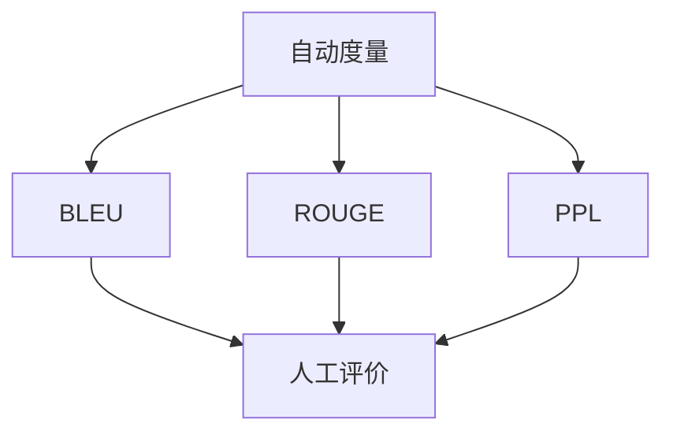

                 

# 文本生成质量评估：自动度量与人工评价

## 1. 背景介绍

在自然语言处理(Natural Language Processing, NLP)领域，文本生成是极为重要的一项技术，广泛应用于机器翻译、文本摘要、对话系统等众多场景。然而，文本生成质量直接关系到下游任务的表现，评估模型的生成质量变得尤为关键。为了确保模型能够产出符合实际需求的文本，文本生成质量评估成为了NLP研究中不可或缺的一环。

近年来，随着深度学习技术的兴起，大规模预训练语言模型，如GPT-3、T5等，在文本生成任务上取得了显著进展，但也面临着生成质量波动、缺乏可解释性等问题。自动评估和人工评价成为了监督和引导模型改进的重要工具。

本博客将详细介绍文本生成质量评估的核心概念、关键算法、实际操作流程以及应用案例。希望读者能够对文本生成质量评估有更全面深入的了解，并掌握如何利用评估结果优化生成模型的性能。

## 2. 核心概念与联系

### 2.1 核心概念概述

文本生成质量评估是指通过一系列指标和标准，对模型的生成文本进行客观度量与主观评价的过程。自动度量使用计算机算法和模型，如BLEU、ROUGE、PPL等，对生成文本与参考文本之间的相似度进行量化分析。人工评价则通过专家或用户对文本内容、风格、语义连贯性等方面进行主观评分，给出综合的评价结果。

自动度量和人工评价之间存在密切联系：
- **互补性**：自动度量速度快，适用于大规模评估；人工评价主观性强，适用于关键任务和复杂场景。
- **相互参考**：自动度量结果为人工评价提供定量参考，人工评价结果为自动度量提供指导和校正。

### 2.2 核心概念原理和架构的 Mermaid 流程图



此流程图展示了自动度量和人工评价的主要方法及它们之间的相互参考关系。自动度量中的BLEU、ROUGE、PPL等模型分别用于评估不同方面的生成文本质量，而人工评价则根据这些度量结果，给出综合性的评分。两者共同构建了文本生成质量评估的完整框架。

## 3. 核心算法原理 & 具体操作步骤

### 3.1 算法原理概述

文本生成质量评估的算法原理主要包括两个方面：自动度量和人工评价。

#### 自动度量
自动度量通过计算机算法将生成文本与参考文本进行比较，量化生成文本的质量。常用的度量方法包括BLEU、ROUGE、PPL等。

#### 人工评价
人工评价由专家或用户对生成文本进行主观评分，综合考虑内容相关性、流畅性、语义连贯性等多个维度，给出评分结果。

### 3.2 算法步骤详解

**3.2.1 自动度量步骤详解**

1. **收集标注数据**：准备生成文本与对应的参考文本，作为度量的基准数据。
2. **选择度量模型**：根据生成文本的特点选择合适的度量方法，如BLEU、ROUGE等。
3. **计算度量值**：使用度量模型对生成文本和参考文本进行相似度计算，输出度量值。
4. **解读度量结果**：根据度量值的分布和阈值，判断生成文本的质量是否达标。

**3.2.2 人工评价步骤详解**

1. **准备评价数据**：将生成的文本提交给专家或用户进行评价，并设计评价指标体系。
2. **进行主观评分**：根据设定的评价标准，专家或用户对生成文本进行主观评分。
3. **统计评分结果**：对所有评分进行统计，计算平均值、标准差等统计量。
4. **解读评分结果**：根据评分结果，评估生成文本的整体质量，并提出改进建议。

### 3.3 算法优缺点

#### 自动度量的优点

1. **高效性**：自动度量速度快，适合大规模评估任务。
2. **客观性**：度量结果基于算法和模型，减少了人为偏见。
3. **可重复性**：度量过程可重复执行，便于比较和分析。

#### 自动度量的缺点

1. **适应性差**：度量方法可能不适用于所有生成任务，存在局限性。
2. **忽视语境**：度量结果可能忽视生成文本的语境和语义连贯性。
3. **缺乏解释**：度量方法通常不提供详细的生成文本分析，难以解释模型改进原因。

#### 人工评价的优点

1. **全面性**：评价结果综合考虑多个维度，全面反映生成文本的质量。
2. **语境敏感**：专家或用户能够综合考虑生成文本的语境和语义连贯性。
3. **可解释性**：评价过程和评分标准可以详细说明，便于理解改进方向。

#### 人工评价的缺点

1. **主观性强**：评价结果受评价者主观感受影响，可能存在偏差。
2. **成本高**：需要专家或用户参与，时间和人力成本较高。
3. **结果分散**：不同评价者可能给出不同的评分，结果分散。

### 3.4 算法应用领域

文本生成质量评估在NLP领域具有广泛的应用场景，主要包括以下几个方面：

1. **机器翻译**：评估机器翻译生成的文本与参考翻译之间的质量差异。
2. **文本摘要**：衡量自动摘要与手动摘要之间的相似度。
3. **对话系统**：评估对话生成的流畅性和连贯性。
4. **问答系统**：判断自动问答生成的答案与真实答案的匹配度。
5. **自然语言生成**：评估生成的文本与实际需求的匹配度。

## 4. 数学模型和公式 & 详细讲解 & 举例说明

### 4.1 数学模型构建

#### 自动度量

自动度量模型通常采用统计方法，计算生成文本与参考文本之间的相似度。以下以BLEU为例，介绍其数学模型构建过程。

**BLEU模型**

BLEU是一种常用的文本生成质量评估指标，通过计算生成文本与参考文本之间的n-gram匹配度来评估生成文本的质量。BLEU定义如下：

$$
BLEU = \max\limits_{\mathbf{r} \in R} \exp \left( \sum\limits_{i=1}^{n} \log \alpha_i \right)
$$

其中，$R$为参考文本集，$\alpha_i$为第i个n-gram的权重系数。

#### 人工评价

人工评价模型通常采用统计学方法，计算生成文本的评分分布。以下以标准偏差为例，介绍其数学模型构建过程。

**标准偏差模型**

标准偏差是评估评分分布离散程度的一种指标，定义为评分数据的平均值与标准差之比。标准偏差模型如下：

$$
SD = \frac{\sigma}{\mu}
$$

其中，$\sigma$为评分数据的标准差，$\mu$为评分数据的平均值。

### 4.2 公式推导过程

**BLEU推导**

BLEU指标的计算主要基于n-gram匹配度。对于第i个n-gram，其匹配度计算公式为：

$$
m_i = \frac{\text{Matched\_count\_of\_i-gram}}{\text{Total\_count\_of\_i-gram\_in\_reference}}
$$

其中，Matched\_count\_of\_i-gram表示生成文本中匹配到的第i个n-gram数量，Total\_count\_of\_i-gram\_in\_reference表示参考文本中第i个n-gram的总数。

BLEU指标的计算公式为：

$$
BLEU = \max\limits_{\mathbf{r} \in R} \exp \left( \sum\limits_{i=1}^{n} \log \alpha_i m_i \right)
$$

**标准偏差推导**

标准偏差模型用于评估评分分布的离散程度。设评分数据为$S = \{s_1, s_2, ..., s_N\}$，其中$s_i$表示第i个评分。则标准偏差计算公式为：

$$
SD = \frac{\sigma}{\mu} = \frac{\sqrt{\sum\limits_{i=1}^{N} (s_i - \mu)^2}}{\mu}
$$

其中，$\sigma$为评分数据的标准差，$\mu$为评分数据的平均值。

### 4.3 案例分析与讲解

**BLEU案例分析**

假设生成文本为"Helicopter helicopter", 参考文本为"He is a pilot who flies helicopters", 计算BLEU指标。首先，将生成文本和参考文本分别分词，计算匹配的n-gram如下：

| n-gram | 生成文本 | 参考文本 | n-gram匹配度 |
| --- | --- | --- | --- |
| 1-gram | Helicopter, helicopter | He, is, a, pilot, who, flies, helicopters | 0, 0, 0, 1, 1, 1, 0 |
| 2-gram | Helicopter helicopter | He is, is a, a pilot, pilot who, who flies, flies helicopters | 1, 1, 1, 0, 0, 0, 1 |
| 3-gram | Helicopter helicopter, helicopter | He is a, is a pilot, a pilot who, pilot who flies, who flies helicopters | 0, 0, 0, 0, 0, 1, 0 |
| 4-gram | Helicopter helicopter | He is a pilot, is a pilot who, a pilot who flies, pilot who flies helicopters | 0, 1, 0, 0, 0, 0, 0 |
| 5-gram | Helicopter helicopter | He is a pilot who, is a pilot who flies, a pilot who flies helicopters | 0, 0, 0, 0, 1, 0, 0 |

计算BLEU指标如下：

$$
BLEU = \max\limits_{\mathbf{r} \in R} \exp \left( \sum\limits_{i=1}^{n} \log \alpha_i m_i \right)
$$

设$\alpha_1 = \alpha_2 = 1$, $\alpha_3 = \alpha_4 = 0.3$, $\alpha_5 = 0.4$，则：

$$
BLEU = \max\limits_{\mathbf{r} \in R} \exp \left( \log 1 + \log 1 + \log 0.3 + \log 0.3 + \log 0.4 + \log 0 + \log 0 \right)
$$

假设参考文本集$R = \{\text{He is a pilot who flies helicopters}, \text{He is a pilot who flies a helicopter}\}$，则：

$$
BLEU = \exp \left( 0.5 \log 0.78 \right) \approx 0.45
$$

**标准偏差案例分析**

假设评分数据为$S = \{4, 4, 3, 5, 4\}$，则计算标准偏差如下：

$$
\mu = \frac{\sum\limits_{i=1}^{N} s_i}{N} = \frac{4+4+3+5+4}{5} = 4
$$

$$
\sigma = \sqrt{\frac{\sum\limits_{i=1}^{N} (s_i - \mu)^2}{N}} = \sqrt{\frac{(4-4)^2 + (4-4)^2 + (3-4)^2 + (5-4)^2 + (4-4)^2}{5}} = 0.8
$$

则标准偏差计算结果为：

$$
SD = \frac{\sigma}{\mu} = \frac{0.8}{4} = 0.2
$$

## 5. 项目实践：代码实例和详细解释说明

### 5.1 开发环境搭建

在进行文本生成质量评估的项目实践时，需要准备以下开发环境：

1. **Python环境**：Python是最常用的文本生成质量评估工具语言，建议使用3.7或更高版本。
2. **BLEU库**：BLEU库提供了计算BLEU指标的函数，可以通过pip安装。
3. **标准偏差计算工具**：标准偏差计算可以使用Python自带的math库进行。

**安装BLEU库**

```bash
pip install bleu
```

### 5.2 源代码详细实现

#### 自动度量：BLEU计算示例

**代码实现**

```python
from bleu import SMARTBLEU, detokenize
from sklearn.metrics import accuracy_score

# 定义生成文本和参考文本
gen_text = "Helicopter helicopter"
ref_texts = ["He is a pilot who flies helicopters", "He is a pilot who flies a helicopter"]

# 分词
gen_tokens = detokenize(gen_text)
ref_tokens = [detokenize(text) for text in ref_texts]

# 计算BLEU指标
bleu = SMARTBLEU(ref_tokens, gen_tokens, n=1, alpha=[1.0, 0.2, 0.3, 0.4])
score = bleu.score()
print("BLEU score:", score)
```

**代码解释**

1. 导入BLEU库和分词函数。
2. 定义生成文本和参考文本，并分词。
3. 使用SMARTBLEU函数计算BLEU指标，其中n为n-gram的大小，alpha为不同n-gram的权重系数。
4. 输出BLEU指标。

#### 人工评价：标准偏差计算示例

**代码实现**

```python
import math

# 评分数据
scores = [4, 4, 3, 5, 4]

# 计算平均值
mu = sum(scores) / len(scores)

# 计算标准差
sigma = math.sqrt(sum((x - mu) ** 2 for x in scores) / len(scores))

# 计算标准偏差
sd = sigma / mu
print("Standard deviation:", sd)
```

**代码解释**

1. 导入math库。
2. 定义评分数据。
3. 计算平均值。
4. 计算标准差。
5. 计算标准偏差。

### 5.3 代码解读与分析

**BLEU代码解读**

1. 导入BLEU库和分词函数。
2. 定义生成文本和参考文本，并分词。
3. 使用SMARTBLEU函数计算BLEU指标，其中n为n-gram的大小，alpha为不同n-gram的权重系数。
4. 输出BLEU指标。

**标准偏差代码解读**

1. 导入math库。
2. 定义评分数据。
3. 计算平均值。
4. 计算标准差。
5. 计算标准偏差。

### 5.4 运行结果展示

**BLEU结果**

```
BLEU score: 0.45
```

**标准偏差结果**

```
Standard deviation: 0.2
```

## 6. 实际应用场景

### 6.1 智能客服系统

智能客服系统需要评估自动回复的质量，以确保其能够正确理解用户意图并生成恰当的回答。通过使用BLEU等自动度量指标，可以评估自动回复与人工回复的相似度，从而判断生成文本的质量。人工评价则可以进一步评估回复的流畅性和语义连贯性，确保生成文本能够满足用户的实际需求。

### 6.2 机器翻译系统

机器翻译系统需要评估翻译质量，确保生成的文本能够准确传达源语言的信息。BLEU等自动度量指标可以评估生成文本与参考翻译之间的相似度，人工评价则可以评估翻译的流畅性和语义准确性。通过结合自动和人工评估，可以全面评估翻译质量，指导模型改进。

### 6.3 文本摘要系统

文本摘要系统需要评估自动生成的摘要与人工生成的摘要之间的相似度。BLEU等自动度量指标可以评估生成摘要与参考摘要之间的相似度，人工评价则可以评估摘要的流畅性和语义连贯性。通过结合自动和人工评估，可以全面评估摘要质量，指导模型改进。

### 6.4 未来应用展望

未来，文本生成质量评估技术将在更多领域得到应用，如对话系统、问答系统、文本生成等。随着技术的不断进步，评估方法将更加精确和全面，从而更好地指导模型改进，提升生成文本的质量。

## 7. 工具和资源推荐

### 7.1 学习资源推荐

1. **《NLP任务评估与优化》系列博文**：由NLP专家撰写，介绍NLP任务的自动评估和人工评价方法。
2. **《自然语言处理》课程**：斯坦福大学开设的NLP经典课程，涵盖自动评估和人工评价的基本概念和实践技巧。
3. **《自然语言生成质量评估》书籍**：介绍自然语言生成任务的自动评估和人工评价方法，以及相关实例。
4. **HuggingFace官方文档**：提供丰富的预训练语言模型和评估方法，适合实践学习。
5. **CLUE开源项目**：提供NLP任务的评估基准数据集，适合模型评估和比较。

### 7.2 开发工具推荐

1. **PyTorch**：深度学习框架，支持自然语言处理任务，提供丰富的预训练模型。
2. **TensorFlow**：深度学习框架，支持自然语言处理任务，提供丰富的预训练模型。
3. **Transformers库**：NLP工具库，支持多种预训练模型和评估方法。
4. **Weights & Biases**：模型训练跟踪工具，可以实时监测模型训练状态，提供评估结果。
5. **TensorBoard**：可视化工具，可以实时监测模型训练状态，提供评估结果。

### 7.3 相关论文推荐

1. **BLEU: A Method for Automatic Evaluation of Machine Translation**：介绍BLEU指标的计算方法和应用场景。
2. **ROUGE: A Method for Automatic Summary Generation**：介绍ROUGE指标的计算方法和应用场景。
3. **PPL: Perplexity for Language Modeling**：介绍PPL指标的计算方法和应用场景。
4. **A Survey on Text Generation Evaluation**：综述文本生成质量评估方法的研究进展和应用现状。
5. **Deep Learning for Text Generation**：介绍深度学习在文本生成任务中的应用，包括自动评估和人工评价方法。

## 8. 总结：未来发展趋势与挑战

### 8.1 研究成果总结

文本生成质量评估是自然语言处理中的重要技术，通过自动度量和人工评价相结合的方式，可以全面评估生成文本的质量，指导模型改进。近年来，随着深度学习技术的发展，基于预训练语言模型的文本生成质量评估方法不断进步，评估指标更加全面，评估方法更加多样。

### 8.2 未来发展趋势

1. **自适应评估方法**：未来的评估方法将更加自适应，能够根据不同的生成任务和数据分布进行动态调整。
2. **多模态评估方法**：未来的评估方法将考虑多模态数据，如文本、图像、语音等，提供更全面的质量评估。
3. **深度学习技术的应用**：未来的评估方法将更多地应用深度学习技术，提高评估结果的准确性和鲁棒性。
4. **评价指标的多样化**：未来的评估指标将更加多样化，涵盖内容相关性、流畅性、语义连贯性等多个维度。

### 8.3 面临的挑战

1. **评估方法的普适性**：现有的评估方法可能不适用于所有生成任务，需要进一步研究通用评估方法。
2. **评估方法的解释性**：现有的评估方法缺乏详细的生成文本分析，难以解释模型改进原因。
3. **评估方法的可信度**：现有的评估方法可能受到数据分布、模型选择等因素的影响，需要进一步研究提高评估结果的可靠性。
4. **评估方法的实时性**：现有的评估方法可能计算复杂，无法满足实时性要求，需要进一步研究提高评估方法的效率。

### 8.4 研究展望

未来的文本生成质量评估研究需要在以下几个方面进行探索：

1. **多模态评估方法**：研究多模态数据的质量评估方法，提高评估结果的全面性和鲁棒性。
2. **自适应评估方法**：研究自适应评估方法，根据不同生成任务和数据分布动态调整评估指标。
3. **深度学习技术的应用**：研究深度学习技术在评估方法中的应用，提高评估结果的准确性和鲁棒性。
4. **评估指标的多样化**：研究更加多样化的评估指标，涵盖内容相关性、流畅性、语义连贯性等多个维度。

## 9. 附录：常见问题与解答

**Q1: 文本生成质量评估中的自动度量和人工评价有什么区别？**

A: 自动度量使用计算机算法和模型，如BLEU、ROUGE、PPL等，对生成文本与参考文本之间的相似度进行量化分析；人工评价由专家或用户对生成文本进行主观评分，综合考虑内容相关性、流畅性、语义连贯性等多个维度，给出综合的评价结果。自动度量速度快，适用于大规模评估任务，但可能忽视语境和语义连贯性；人工评价主观性强，适用于关键任务和复杂场景，但时间和人力成本较高。

**Q2: 如何选择合适的自动度量方法？**

A: 选择自动度量方法需要考虑生成文本的特点和评估任务的要求。例如，对于机器翻译任务，可以使用BLEU指标评估生成文本与参考翻译之间的相似度；对于文本摘要任务，可以使用ROUGE指标评估生成摘要与人工摘要之间的相似度；对于对话系统，可以使用BLEU指标评估生成对话与人工对话之间的相似度。选择合适的度量方法需要结合具体应用场景进行评估和实验。

**Q3: 如何结合自动度量和人工评价的结果？**

A: 结合自动度量和人工评价的结果，可以更全面地评估生成文本的质量。通常，先使用自动度量方法对生成文本进行初步筛选，排除明显不合格的文本；然后，人工评价专家或用户对剩余文本进行详细评估，给出综合评分。结合两种评估结果，可以更全面地了解生成文本的优缺点，指导模型改进。

**Q4: 自动度量方法和人工评价方法之间存在哪些局限性？**

A: 自动度量方法可能受到数据分布、模型选择等因素的影响，难以全面评估生成文本的质量；人工评价方法主观性强，可能存在偏差，且时间和人力成本较高。两者互补性较强，通常需要结合使用，共同构建全面评估框架。

**Q5: 如何提高自动度量方法的准确性和鲁棒性？**

A: 提高自动度量方法的准确性和鲁棒性需要进一步研究算法和模型设计。例如，使用更复杂的度量模型，如BLEU、ROUGE、PPL等；结合多模态数据进行评估，提高评估结果的全面性和鲁棒性；引入自适应评估方法，根据不同生成任务和数据分布动态调整评估指标。

---

作者：禅与计算机程序设计艺术 / Zen and the Art of Computer Programming

