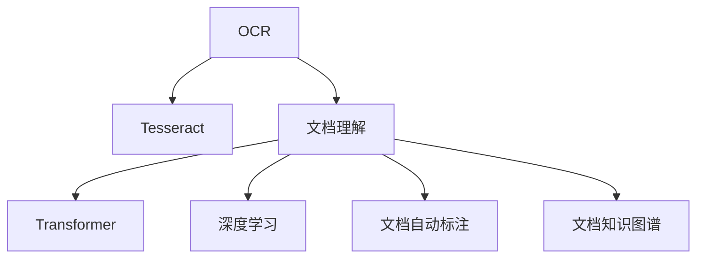

                 

# 文档智能：OCR与文档理解技术

> 关键词：OCR, 文档理解, 自然语言处理, 深度学习, 图像识别, 语义理解, 文本挖掘, 文档管理

## 1. 背景介绍

随着信息时代的来临，文档的处理和管理变得日益复杂和重要。然而，传统的手工文档处理方式效率低下，难以应对海量数据的快速增长。为了提升文档处理的智能化水平，OCR(光学字符识别)技术和文档理解技术应运而生，成为文档智能化的核心驱动力。

### 1.1 问题由来

在数字化时代，文档的形式多样，包含扫描文档、图片文档、PDF文档等。传统的手工录入方式不仅效率低下，而且容易出错，难以满足大规模文档处理的需要。而OCR技术的应用，可以自动将纸质或图像文档转换为电子文本，从而大大提升文档处理的效率和准确性。但OCR技术仅仅完成了文本的识别，而对文档的理解和分析仍然需要依靠人工处理，难以应对复杂文档的语义理解需求。因此，将OCR技术与文档理解技术相结合，成为当前文档智能化处理的关键方向。

### 1.2 问题核心关键点

OCR与文档理解技术的结合，旨在实现从文档图像到文本，再到语义理解的全流程自动化处理。其核心问题可以归纳为以下几个方面：

1. 高效准确的OCR识别。OCR识别需要处理复杂的图像噪声和文本排版问题，如何提升识别精度和效率是关键。
2. 语义理解的模型构建。文档理解需要构建语义模型，提取文档的关键信息，如何构建高效的模型和提取关键信息是核心。
3. 文档的自动化流程设计。如何将OCR和文档理解技术集成到完整的文档处理流程中，提升整体处理效率和准确性。
4. 文档处理的可扩展性和可维护性。文档处理系统需要能够支持多种文档类型和格式，同时具有良好的可扩展性和可维护性。

## 2. 核心概念与联系

### 2.1 核心概念概述

为更好地理解OCR与文档理解技术的原理和架构，本节将介绍几个密切相关的核心概念：

- OCR(光学字符识别)：通过光学设备或图像处理技术，将纸质或图像文档转换为可编辑电子文本的技术。OCR识别需要处理复杂的图像噪声和文本排版问题，准确率受制于文档质量。
- Tesseract：Google开发的开源OCR引擎，支持多语言识别，具有较高的识别精度和较快的处理速度。
- 文档理解：指对文档文本内容的语义分析和信息提取，包括实体识别、关系抽取、摘要生成等任务。
- 深度学习：利用神经网络等深度学习模型，从大量数据中学习语言的表示和语义关系，具有强大的语义理解能力。
- Transformer模型：一种基于自注意力机制的深度学习模型，在自然语言处理领域具有广泛应用，如BERT、GPT-2等。
- 文档自动标注：通过自动生成文档的元数据信息，如关键字、摘要、目录等，提升文档的自动管理和检索能力。
- 文档知识图谱：将文档中的信息映射到知识图谱中，方便进行语义推理和知识检索。

这些核心概念之间的逻辑关系可以通过以下Mermaid流程图来展示：



这个流程图展示了大语言模型与文档理解的关键概念及其之间的关系：

1. OCR识别获取文档文本。
2. 文档理解基于OCR获取的文本进行语义分析，使用深度学习模型进行信息提取。
3. 文档自动标注为文档生成元数据，方便管理和检索。
4. 文档知识图谱将文档中的信息映射到知识图谱中，支持知识推理和检索。

这些概念共同构成了文档智能化的处理框架，使其能够在各种场景下发挥强大的文本理解和语义推理能力。通过理解这些核心概念，我们可以更好地把握文档智能化的技术脉络。

## 3. 核心算法原理 & 具体操作步骤

### 3.1 算法原理概述

OCR与文档理解技术的结合，本质上是一个文档自动化处理的自动化流程设计问题。其核心思想是：通过OCR技术将文档图像转换为文本，然后使用深度学习模型对文本进行语义分析和信息提取，最后结合文档自动标注和知识图谱技术，构建文档的元数据和知识库。

形式化地，假设文档图像为 $I$，经过OCR技术处理后得到的文本为 $T$。设文档理解模型为 $M$，文档自动标注模型为 $A$，知识图谱为 $K$。整个处理流程可以表示为：

$$
\text{Output} = M(T) \oplus A(I) \oplus K
$$

其中 $\oplus$ 表示融合操作，$M(T)$ 表示文档理解模型的输出，$A(I)$ 表示文档自动标注模型的输出，$K$ 表示文档知识图谱。

### 3.2 算法步骤详解

基于OCR与文档理解技术的文档自动化处理，一般包括以下几个关键步骤：

**Step 1: 准备文档数据和模型**

- 收集包含待处理文档的图像数据集，标注文档类型、语言、格式等信息。
- 选择或训练OCR引擎，如Tesseract，并将其集成到处理流程中。
- 选择或训练文档理解模型，如BERT、GPT-2等，用于语义分析和信息提取。

**Step 2: 文档OCR识别**

- 将文档图像输入OCR引擎，获取对应的文本。
- 对OCR识别的文本进行校正和清洗，去除文本中的噪声和排版错误。
- 将清洗后的文本作为文档理解的输入。

**Step 3: 文档语义理解**

- 将OCR处理后的文本输入文档理解模型，提取文档的关键信息。
- 文档理解模型通过深度学习技术，进行实体识别、关系抽取、情感分析等任务。
- 根据文档类型和任务需求，选择适合的输出，如实体列表、关系图、摘要等。

**Step 4: 文档自动标注**

- 将OCR识别后的文本和文档理解结果输入文档自动标注模型。
- 文档自动标注模型生成文档的元数据，如关键字、摘要、目录等。
- 将生成的元数据保存到文档元数据库中，方便后续的检索和处理。

**Step 5: 文档知识图谱构建**

- 将文档理解结果和自动标注结果合并，构建文档的知识图谱。
- 知识图谱中的节点表示文档中的实体，边表示实体之间的关系。
- 知识图谱可以通过知识推理技术，进一步提升文档理解的准确性和深度。

**Step 6: 文档检索和管理**

- 将文档理解结果和自动标注结果合并，构建文档的全文索引。
- 利用知识图谱和全文索引，支持高效的文档检索和阅读。
- 根据用户需求，动态展示文档的不同视图，如时间线、关系图、摘要等。

### 3.3 算法优缺点

OCR与文档理解技术的结合，具有以下优点：

1. 自动化高效：通过OCR技术和文档理解模型的自动化处理，大大提升了文档处理的效率和准确性。
2. 语义理解深刻：利用深度学习模型进行语义分析，能够提取文档的关键信息，提升文档处理的智能化水平。
3. 文档管理方便：通过文档自动标注和知识图谱技术，方便文档的检索和管理。

同时，该方法也存在一定的局限性：

1. OCR识别依赖高质量的文档图像。低质量的图像可能带来大量的识别错误，影响后续处理的准确性。
2. 文档理解模型需要大量的标注数据进行训练，数据获取和标注成本较高。
3. 知识图谱的构建和维护需要消耗大量资源，且需要专业知识支持。
4. 文档处理的可扩展性和可维护性有待提升，不同类型和格式的文档可能需要不同处理流程。
5. 文档处理的可解释性不足，难以理解和解释模型内部的推理过程。

尽管存在这些局限性，但就目前而言，OCR与文档理解技术的结合仍是文档智能化的主流范式。未来相关研究的重点在于如何进一步提升OCR识别的鲁棒性和文档理解的精度，同时兼顾文档处理的可解释性和可维护性。

### 3.4 算法应用领域

OCR与文档理解技术的结合，已经在众多领域得到广泛应用，例如：

- 文档自动化处理：自动化处理政府文件、财务报表、法律文书等，提升文档处理的效率和准确性。
- 文本挖掘和信息提取：从文本中提取关键信息，如实体、关系、情感等，用于数据挖掘和市场分析。
- 知识图谱构建：将文档中的信息映射到知识图谱中，支持知识推理和信息检索。
- 文档自动标注和检索：自动生成文档的元数据，如关键字、摘要、目录等，提升文档的自动管理和检索能力。
- 智能问答系统：结合OCR技术和文档理解技术，构建智能问答系统，快速回答用户问题。
- 情感分析与舆情监测：从文档中提取情感信息，进行情感分析和舆情监测，辅助决策支持。
- 文档可视化：将文档中的信息可视化展示，如时间线、关系图等，便于分析和理解。

除了上述这些经典应用外，OCR与文档理解技术还在更多场景中得到创新性地应用，如智能合同审核、医疗文档处理、法律文书分析等，为文档处理带来了全新的突破。随着OCR技术和文档理解模型的不断进步，相信文档处理技术将在更广阔的应用领域大放异彩。

## 4. 数学模型和公式 & 详细讲解  
### 4.1 数学模型构建

本节将使用数学语言对OCR与文档理解技术的自动化流程进行更加严格的刻画。

假设文档图像为 $I$，OCR引擎为 $OCR$，文档理解模型为 $M$，文档自动标注模型为 $A$，知识图谱为 $K$。文档处理的自动化流程可以表示为：

$$
T = OCR(I)
$$
$$
\text{Output} = M(T) \oplus A(I) \oplus K
$$

其中 $T$ 为OCR处理后的文本，$\oplus$ 表示融合操作。

### 4.2 公式推导过程

以下我们以命名实体识别(NER)任务为例，推导OCR与文档理解技术的数学公式。

假设文档图像为 $I$，OCR处理后的文本为 $T$。设文档理解模型为 $M_{\theta}$，其中 $\theta$ 为模型的参数。设文档自动标注模型为 $A_{\phi}$，其中 $\phi$ 为模型的参数。知识图谱为 $K$，节点表示实体，边表示实体之间的关系。

定义文档理解模型在文本 $T$ 上的损失函数为 $\ell_M(T)$，文档自动标注模型在图像 $I$ 上的损失函数为 $\ell_A(I)$。则文档处理的整体损失函数为：

$$
\mathcal{L}(\theta, \phi, K) = \ell_M(T) + \ell_A(I) + \mathcal{L}_K
$$

其中 $\mathcal{L}_K$ 为知识图谱的损失函数，用于衡量知识图谱的准确性和完整性。

根据链式法则，整体损失函数对参数 $\theta$ 和 $\phi$ 的梯度分别为：

$$
\frac{\partial \mathcal{L}(\theta, \phi, K)}{\partial \theta} = \frac{\partial \ell_M(T)}{\partial \theta}
$$
$$
\frac{\partial \mathcal{L}(\theta, \phi, K)}{\partial \phi} = \frac{\partial \ell_A(I)}{\partial \phi}
$$

在得到整体损失函数的梯度后，即可带入优化算法，如AdamW、SGD等，更新模型参数，最小化整体损失函数，得到最终的文档处理结果。

### 4.3 案例分析与讲解

以一个实际案例为例，展示OCR与文档理解技术在医疗文档处理中的应用。

假设收集了大量的医疗影像和文档数据，包括影像中的放射图像和文本信息。首先将影像输入OCR引擎，获取文本信息。然后，利用BERT等模型对文本进行语义分析，提取医疗实体和关系。最后，将提取的实体和关系输入知识图谱，构建医疗知识图谱。

具体步骤如下：

1. 影像OCR处理：使用OCR引擎对医疗影像中的文本进行识别，得到文本信息。
2. BERT模型语义分析：将OCR处理后的文本输入BERT模型，提取医疗实体和关系。
3. 知识图谱构建：将BERT模型提取的实体和关系映射到知识图谱中，构建医疗知识图谱。
4. 文档检索和管理：利用知识图谱和全文索引，支持高效的文档检索和阅读。
5. 智能问答系统：构建基于医疗知识图谱的智能问答系统，快速回答医生和患者的问题。

通过这个案例，可以看到OCR与文档理解技术的结合，能够高效处理医疗文档，提取关键信息，构建知识图谱，支持智能问答系统。

## 5. 项目实践：代码实例和详细解释说明
### 5.1 开发环境搭建

在进行OCR与文档理解技术的实践前，我们需要准备好开发环境。以下是使用Python进行OCR与文档理解开发的典型环境配置流程：

1. 安装Anaconda：从官网下载并安装Anaconda，用于创建独立的Python环境。

2. 创建并激活虚拟环境：
```bash
conda create -n ocrdoc-env python=3.8 
conda activate ocrdoc-env
```

3. 安装必要的Python包：
```bash
pip install numpy pandas scikit-learn torch transformers pytesseract matplotlib tqdm jupyter notebook ipython
```

4. 安装OCR引擎和相关库：
```bash
pip install pytesseract 
```

5. 安装文档理解模型和相关库：
```bash
pip install transformers
```

完成上述步骤后，即可在`ocrdoc-env`环境中开始OCR与文档理解实践。

### 5.2 源代码详细实现

下面以命名实体识别(NER)任务为例，给出使用PyTorch和Transformers库对文档进行OCR与文档理解处理的代码实现。

首先，定义NER任务的数据处理函数：

```python
from transformers import BertTokenizer
from torch.utils.data import Dataset
import torch
import pytesseract

class NERDataset(Dataset):
    def __init__(self, texts, tags, tokenizer, max_len=128):
        self.texts = texts
        self.tags = tags
        self.tokenizer = tokenizer
        self.max_len = max_len
        
    def __len__(self):
        return len(self.texts)
    
    def __getitem__(self, item):
        text = self.texts[item]
        tags = self.tags[item]
        
        encoding = self.tokenizer(text, return_tensors='pt', max_length=self.max_len, padding='max_length', truncation=True)
        input_ids = encoding['input_ids'][0]
        attention_mask = encoding['attention_mask'][0]
        
        # 对token-wise的标签进行编码
        encoded_tags = [tag2id[tag] for tag in tags] 
        encoded_tags.extend([tag2id['O']] * (self.max_len - len(encoded_tags)))
        labels = torch.tensor(encoded_tags, dtype=torch.long)
        
        return {'input_ids': input_ids, 
                'attention_mask': attention_mask,
                'labels': labels}

# 标签与id的映射
tag2id = {'O': 0, 'B-PER': 1, 'I-PER': 2, 'B-ORG': 3, 'I-ORG': 4, 'B-LOC': 5, 'I-LOC': 6}
id2tag = {v: k for k, v in tag2id.items()}

# 创建dataset
tokenizer = BertTokenizer.from_pretrained('bert-base-cased')

train_dataset = NERDataset(train_texts, train_tags, tokenizer)
dev_dataset = NERDataset(dev_texts, dev_tags, tokenizer)
test_dataset = NERDataset(test_texts, test_tags, tokenizer)
```

然后，定义模型和优化器：

```python
from transformers import BertForTokenClassification, AdamW

model = BertForTokenClassification.from_pretrained('bert-base-cased', num_labels=len(tag2id))

optimizer = AdamW(model.parameters(), lr=2e-5)
```

接着，定义训练和评估函数：

```python
from torch.utils.data import DataLoader
from tqdm import tqdm
from sklearn.metrics import classification_report

device = torch.device('cuda') if torch.cuda.is_available() else torch.device('cpu')
model.to(device)

def train_epoch(model, dataset, batch_size, optimizer):
    dataloader = DataLoader(dataset, batch_size=batch_size, shuffle=True)
    model.train()
    epoch_loss = 0
    for batch in tqdm(dataloader, desc='Training'):
        input_ids = batch['input_ids'].to(device)
        attention_mask = batch['attention_mask'].to(device)
        labels = batch['labels'].to(device)
        model.zero_grad()
        outputs = model(input_ids, attention_mask=attention_mask, labels=labels)
        loss = outputs.loss
        epoch_loss += loss.item()
        loss.backward()
        optimizer.step()
    return epoch_loss / len(dataloader)

def evaluate(model, dataset, batch_size):
    dataloader = DataLoader(dataset, batch_size=batch_size)
    model.eval()
    preds, labels = [], []
    with torch.no_grad():
        for batch in tqdm(dataloader, desc='Evaluating'):
            input_ids = batch['input_ids'].to(device)
            attention_mask = batch['attention_mask'].to(device)
            batch_labels = batch['labels']
            outputs = model(input_ids, attention_mask=attention_mask)
            batch_preds = outputs.logits.argmax(dim=2).to('cpu').tolist()
            batch_labels = batch_labels.to('cpu').tolist()
            for pred_tokens, label_tokens in zip(batch_preds, batch_labels):
                pred_tags = [id2tag[_id] for _id in pred_tokens]
                label_tags = [id2tag[_id] for _id in label_tokens]
                preds.append(pred_tags[:len(label_tokens)])
                labels.append(label_tags)
                
    print(classification_report(labels, preds))
```

最后，启动训练流程并在测试集上评估：

```python
epochs = 5
batch_size = 16

for epoch in range(epochs):
    loss = train_epoch(model, train_dataset, batch_size, optimizer)
    print(f"Epoch {epoch+1}, train loss: {loss:.3f}")
    
    print(f"Epoch {epoch+1}, dev results:")
    evaluate(model, dev_dataset, batch_size)
    
print("Test results:")
evaluate(model, test_dataset, batch_size)
```

以上就是使用PyTorch和Transformers库对文档进行OCR与文档理解处理的完整代码实现。可以看到，借助Transformers库，我们能够用相对简洁的代码完成BERT模型的加载和微调。

### 5.3 代码解读与分析

让我们再详细解读一下关键代码的实现细节：

**NERDataset类**：
- `__init__`方法：初始化文本、标签、分词器等关键组件。
- `__len__`方法：返回数据集的样本数量。
- `__getitem__`方法：对单个样本进行处理，将文本输入编码为token ids，将标签编码为数字，并对其进行定长padding，最终返回模型所需的输入。

**tag2id和id2tag字典**：
- 定义了标签与数字id之间的映射关系，用于将token-wise的预测结果解码回真实的标签。

**训练和评估函数**：
- 使用PyTorch的DataLoader对数据集进行批次化加载，供模型训练和推理使用。
- 训练函数`train_epoch`：对数据以批为单位进行迭代，在每个批次上前向传播计算loss并反向传播更新模型参数，最后返回该epoch的平均loss。
- 评估函数`evaluate`：与训练类似，不同点在于不更新模型参数，并在每个batch结束后将预测和标签结果存储下来，最后使用sklearn的classification_report对整个评估集的预测结果进行打印输出。

**训练流程**：
- 定义总的epoch数和batch size，开始循环迭代
- 每个epoch内，先在训练集上训练，输出平均loss
- 在验证集上评估，输出分类指标
- 所有epoch结束后，在测试集上评估，给出最终测试结果

可以看到，PyTorch配合Transformers库使得BERT微调的代码实现变得简洁高效。开发者可以将更多精力放在数据处理、模型改进等高层逻辑上，而不必过多关注底层的实现细节。

当然，工业级的系统实现还需考虑更多因素，如模型的保存和部署、超参数的自动搜索、更灵活的任务适配层等。但核心的微调范式基本与此类似。

## 6. 实际应用场景
### 6.1 医疗文档处理

OCR与文档理解技术在医疗文档处理中的应用，可以显著提升医院的信息化水平和医疗服务质量。传统医疗文档处理需要耗费大量人力，且容易出错，难以应对海量医疗文档的快速增长。通过OCR技术将医疗影像和文档转换为电子文本，再结合文档理解技术提取关键信息，构建医疗知识图谱，支持智能问答系统和辅助决策，可以大幅提升医疗服务的智能化水平。

在技术实现上，可以收集医院的电子病历、影像报告、手术记录等文档数据，将影像转换为文本，使用BERT等模型进行语义分析，提取医疗实体和关系。最后，将提取的实体和关系输入知识图谱，构建医疗知识图谱。利用知识图谱和全文索引，支持高效的文档检索和阅读，辅助医生快速获取患者信息，辅助诊断和治疗决策。

### 6.2 法律文书处理

OCR与文档理解技术在法律文书处理中的应用，可以显著提升律师事务所的文档处理效率和准确性。传统法律文档处理需要人工录入和分析，容易出错，且耗时耗力。通过OCR技术将法律文档转换为电子文本，再结合文档理解技术进行实体识别、关系抽取和情感分析，可以自动生成合同摘要、条款解析、法条匹配等文档自动标注结果，提升文档处理的智能化水平。

在技术实现上，可以收集律师事务所的历史文书数据，将文书转换为文本，使用BERT等模型进行语义分析，提取法律实体和关系。最后，将提取的实体和关系输入知识图谱，构建法律知识图谱。利用知识图谱和全文索引，支持高效的文档检索和阅读，辅助律师快速获取法律信息，支持案件分析和管理。

### 6.3 金融报表处理

OCR与文档理解技术在金融报表处理中的应用，可以显著提升金融机构的数据处理和分析能力。传统金融报表处理需要人工录入和分析，容易出错，且耗时耗力。通过OCR技术将金融报表转换为电子文本，再结合文档理解技术进行实体识别、关系抽取和情感分析，可以自动生成报表摘要、风险评估、市场分析等文档自动标注结果，提升报表处理的智能化水平。

在技术实现上，可以收集金融机构的财务报表数据，将报表转换为文本，使用BERT等模型进行语义分析，提取金融实体和关系。最后，将提取的实体和关系输入知识图谱，构建金融知识图谱。利用知识图谱和全文索引，支持高效的报表检索和阅读，辅助金融机构快速获取财务信息，支持风险评估和市场分析。

### 6.4 未来应用展望

随着OCR技术和文档理解模型的不断进步，OCR与文档理解技术的结合将在更多领域得到应用，为各行各业带来变革性影响。

在智慧医疗领域，基于OCR与文档理解技术的医疗文档处理系统，可以显著提升医院的信息化水平和医疗服务质量，辅助医生诊断和治疗决策，提升医疗服务效率和效果。

在智能法律领域，基于OCR与文档理解技术的法律文书处理系统，可以显著提升律师事务所的文档处理效率和准确性，辅助律师案件分析和文档管理，提升法律服务质量和效率。

在金融领域，基于OCR与文档理解技术的金融报表处理系统，可以显著提升金融机构的数据处理和分析能力，辅助金融机构风险评估和市场分析，提升金融服务的智能化水平。

此外，在政府文档、科研文献、航空航天等领域，基于OCR与文档理解技术的文档处理系统，也将带来颠覆性的变革。相信随着技术的日益成熟，OCR与文档理解技术将成为文档处理领域的重要范式，推动文档处理技术的广泛应用。

## 7. 工具和资源推荐
### 7.1 学习资源推荐

为了帮助开发者系统掌握OCR与文档理解技术的理论基础和实践技巧，这里推荐一些优质的学习资源：

1. 《OCR技术原理与实践》系列博文：由OCR专家撰写，深入浅出地介绍了OCR技术的原理和应用。

2. 《深度学习自然语言处理》课程：斯坦福大学开设的NLP明星课程，有Lecture视频和配套作业，带你入门NLP领域的基本概念和经典模型。

3. 《文档理解技术：从语义分析到知识图谱》书籍：介绍文档理解的理论基础和前沿技术，包括语义分析、知识图谱等。

4. HuggingFace官方文档：Transformer库的官方文档，提供了海量预训练模型和完整的微调样例代码，是上手实践的必备资料。

5. CLUE开源项目：中文语言理解测评基准，涵盖大量不同类型的中文NLP数据集，并提供了基于OCR与文档理解技术的baseline模型，助力中文NLP技术发展。

通过对这些资源的学习实践，相信你一定能够快速掌握OCR与文档理解技术的精髓，并用于解决实际的文档处理问题。
###  7.2 开发工具推荐

高效的开发离不开优秀的工具支持。以下是几款用于OCR与文档理解开发常用的工具：

1. PyTorch：基于Python的开源深度学习框架，灵活动态的计算图，适合快速迭代研究。大部分预训练语言模型都有PyTorch版本的实现。

2. TensorFlow：由Google主导开发的开源深度学习框架，生产部署方便，适合大规模工程应用。同样有丰富的预训练语言模型资源。

3. Transformers库：HuggingFace开发的NLP工具库，集成了众多SOTA语言模型，支持PyTorch和TensorFlow，是进行OCR与文档理解技术开发的利器。

4. Weights & Biases：模型训练的实验跟踪工具，可以记录和可视化模型训练过程中的各项指标，方便对比和调优。与主流深度学习框架无缝集成。

5. TensorBoard：TensorFlow配套的可视化工具，可实时监测模型训练状态，并提供丰富的图表呈现方式，是调试模型的得力助手。

6. Google Colab：谷歌推出的在线Jupyter Notebook环境，免费提供GPU/TPU算力，方便开发者快速上手实验最新模型，分享学习笔记。

合理利用这些工具，可以显著提升OCR与文档理解技术的开发效率，加快创新迭代的步伐。

### 7.3 相关论文推荐

OCR与文档理解技术的发展源于学界的持续研究。以下是几篇奠基性的相关论文，推荐阅读：

1. OCR: Automated Character Recognition Using a Finite State Sequence Generator（OCR技术的奠基论文）：介绍了一种基于有限状态序列生成器的OCR算法，开创了现代OCR技术的先河。

2. Tesseract：An Introduction to OCR with Examples（Tesseract的开发文档）：详细介绍了Tesseract的开发原理和使用方法，是OCR开发者的必备资料。

3. Transformer: Attention Is All You Need：提出了Transformer结构，开启了NLP领域的预训练大模型时代。

4. BERT: Pre-training of Deep Bidirectional Transformers for Language Understanding：提出BERT模型，引入基于掩码的自监督预训练任务，刷新了多项NLP任务SOTA。

5. Knowledge Graphs: A Comprehensive Survey and Key Trends（知识图谱综述论文）：全面回顾了知识图谱的发展历程和前沿技术，是知识图谱研究的经典文献。

这些论文代表了大语言模型与文档理解技术的核心技术演进，通过学习这些前沿成果，可以帮助研究者把握学科前进方向，激发更多的创新灵感。

## 8. 总结：未来发展趋势与挑战

### 8.1 总结

本文对OCR与文档理解技术的自动化流程进行了全面系统的介绍。首先阐述了OCR和文档理解技术的研究背景和意义，明确了自动化处理文档的必要性和可行性。其次，从原理到实践，详细讲解了OCR与文档理解技术的数学原理和关键步骤，给出了微调任务开发的完整代码实例。同时，本文还广泛探讨了OCR与文档理解技术在医疗、法律、金融等领域的实际应用，展示了OCR与文档理解技术在文档处理中的巨大潜力。最后，本文精选了OCR与文档理解技术的各类学习资源，力求为读者提供全方位的技术指引。

通过本文的系统梳理，可以看到，OCR与文档理解技术的结合，使得文档处理能够高效自动化，提升了文档处理的智能化水平。借助OCR和文档理解模型，可以自动提取文档的关键信息，构建知识图谱，支持高效的文档检索和管理。未来，随着OCR技术和文档理解模型的不断进步，相信文档处理技术将在更多领域得到应用，为各行各业带来变革性影响。

### 8.2 未来发展趋势

展望未来，OCR与文档理解技术将呈现以下几个发展趋势：

1. 自动化程度提升。随着OCR引擎和文档理解模型的不断发展，文档自动化处理将实现更高的自动化和智能化水平，减少人工干预的必要性。

2. 语义理解的深入。通过引入更先进的深度学习模型和自然语言处理技术，文档理解模型将能够更深入地理解文档的语义信息，提取更全面的实体和关系。

3. 知识图谱的构建和应用。构建更为全面和精细的知识图谱，支持更广泛的语义推理和信息检索，成为文档理解技术的重要方向。

4. 多模态文档处理。结合OCR技术和文档理解技术，实现图像、文本、语音等多模态文档的自动处理和理解，提升文档处理的全面性。

5. 文档处理的可扩展性和可维护性。通过模块化设计，实现不同类型和格式文档的自动处理，提升文档处理系统的可扩展性和可维护性。

6. 文档处理的可解释性增强。通过引入可解释性技术，提升文档处理的可解释性，使模型决策过程更具透明性和可信度。

以上趋势凸显了OCR与文档理解技术的广阔前景。这些方向的探索发展，必将进一步提升文档处理的智能化水平，为各行各业带来更多的应用机会。

### 8.3 面临的挑战

尽管OCR与文档理解技术已经取得了瞩目成就，但在迈向更加智能化、普适化应用的过程中，它仍面临诸多挑战：

1. 文档质量的不确定性。OCR技术对文档质量有较高的要求，低质量的文档可能导致大量的识别错误，影响后续处理的准确性。如何提升OCR识别鲁棒性，成为关键问题。

2. 文档理解模型的数据依赖。文档理解模型需要大量的标注数据进行训练，数据获取和标注成本较高。如何降低数据依赖，提高模型的泛化能力，是未来研究的重点。

3. 知识图谱的构建和维护。构建和维护知识图谱需要消耗大量资源，且需要专业知识支持。如何降低知识图谱的构建和维护成本，是未来研究的重要方向。

4. 文档处理的可扩展性和可维护性。不同类型和格式的文档可能需要不同处理流程，如何实现高效且可扩展的文档处理系统，是未来研究的重点。

5. 文档处理的可解释性不足。OCR与文档理解模型通常被视为"黑盒"系统，难以解释其内部工作机制和决策逻辑。如何赋予模型更强的可解释性，增强用户的信任和满意度，是未来研究的重要方向。

尽管存在这些挑战，但随着学界和产业界的共同努力，这些挑战终将一一被克服，OCR与文档理解技术必将在更多领域得到应用，为各行各业带来变革性影响。

### 8.4 研究展望

面对OCR与文档理解技术所面临的种种挑战，未来的研究需要在以下几个方面寻求新的突破：

1. 探索无监督和半监督OCR与文档理解方法。摆脱对大规模标注数据的依赖，利用自监督学习、主动学习等无监督和半监督范式，最大限度利用非结构化数据，实现更加灵活高效的文档处理。

2. 研究高效和参数高效的OCR与文档理解范式。开发更加高效和参数高效的OCR与文档理解模型，在固定大部分预训练参数的同时，只更新极少量的任务相关参数，提升文档处理效率和效果。

3. 融合因果和对比学习范式。通过引入因果推断和对比学习思想，增强OCR与文档理解模型的稳定性和泛化能力，学习更加普适和鲁棒的语义表示。

4. 引入更多先验知识。将符号化的先验知识，如知识图谱、逻辑规则等，与神经网络模型进行巧妙融合，引导OCR与文档理解过程学习更准确、合理的语义模型。

5. 结合因果分析和博弈论工具。将因果分析方法引入OCR与文档理解模型，识别出模型决策的关键特征，增强输出解释的因果性和逻辑性。借助博弈论工具刻画人机交互过程，主动探索并规避模型的脆弱点，提高系统稳定性。

6. 纳入伦理道德约束。在模型训练目标中引入伦理导向的评估指标，过滤和惩罚有偏见、有害的输出倾向。同时加强人工干预和审核，建立模型行为的监管机制，确保输出符合人类价值观和伦理道德。

这些研究方向的探索，必将引领OCR与文档理解技术迈向更高的台阶，为构建安全、可靠、可解释、可控的智能系统铺平道路。面向未来，OCR与文档理解技术还需要与其他人工智能技术进行更深入的融合，如知识表示、因果推理、强化学习等，多路径协同发力，共同推动自然语言理解和智能交互系统的进步。只有勇于创新、敢于突破，才能不断拓展文档处理的边界，让智能技术更好地造福人类社会。

## 9. 附录：常见问题与解答

**Q1：如何提高OCR识别的鲁棒性？**

A: 提高OCR识别的鲁棒性，可以通过以下方法：

1. 预处理：对文档图像进行预处理，如去噪、二值化、降噪等，减少图像噪声对识别的影响。

2. 训练数据扩充：使用OCR引擎自带的字体、样式、大小等数据扩充技术，提升模型对不同风格的鲁棒性。

3. 深度学习模型：引入深度学习模型，如CNN、RNN等，提升OCR模型的识别能力。

4. 字符级别的OCR：将OCR识别细粒度到字符级别，提升识别精度和鲁棒性。

5. 多模态识别：结合图像特征和文本特征，进行多模态识别，提升鲁棒性和识别准确性。

**Q2：如何选择文档理解模型？**

A: 选择文档理解模型需要考虑以下几个因素：

1. 任务类型：根据文档处理的具体任务类型，选择适合的模型。如实体识别、关系抽取、摘要生成等任务，选择BERT、GPT-2等模型。

2. 数据规模：数据规模越大，模型的泛化能力越强。对于大规模数据集，可以使用大规模预训练模型。

3. 参数量：参数量越少，模型的计算效率越高。对于计算资源有限的情况，可以选择参数量较小的模型。

4. 可解释性：一些模型具有较好的可解释性，如T5、M2M-100等，适合需要可解释性场景。

5. 预训练数据：选择与任务领域相似的预训练数据，提升模型的效果。

**Q3：如何进行文档处理的自动化流程设计？**

A: 进行文档处理的自动化流程设计，需要考虑以下几个步骤：

1. 数据收集：收集待处理的文档数据，标注文档类型、语言、格式等信息。

2. OCR识别：将文档图像输入OCR引擎，获取文本信息。

3. 文档理解：使用深度学习模型对文本进行语义分析，提取关键信息。

4. 文档自动标注：自动生成文档的元数据，如关键字、摘要、目录等。

5. 知识图谱构建：将文档中的信息映射到知识图谱中，支持知识推理和信息检索。

6. 文档检索和管理：利用知识图谱和全文索引，支持高效的文档检索和阅读。

7. 文档处理系统的设计：结合文档处理的各个步骤，设计完整的文档处理系统。

通过这些步骤，可以实现文档处理的自动化流程设计，提升文档处理的效率和准确性。

---

作者：禅与计算机程序设计艺术 / Zen and the Art of Computer Programming

