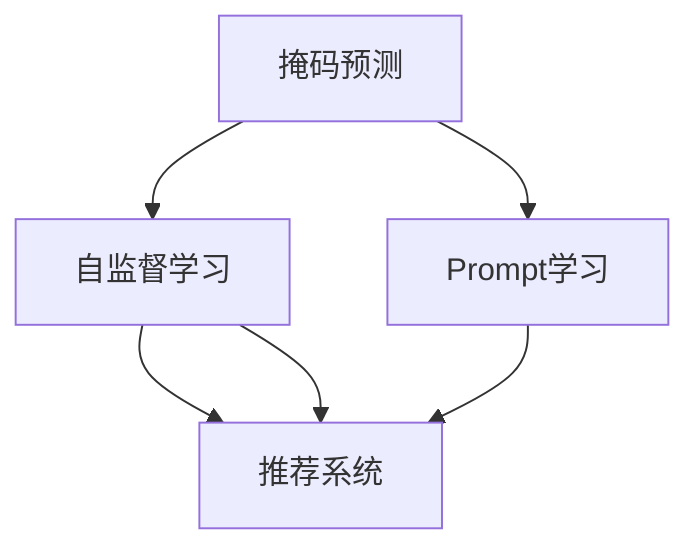

                 

# 新闻推荐的创新：掩码预测与Prompt学习

> 关键词：新闻推荐, 掩码预测, Prompt学习, 自监督学习, 自然语言处理(NLP), 推荐系统

## 1. 背景介绍

### 1.1 问题由来

随着信息技术的快速发展和互联网的普及，新闻推荐系统成为了许多网络平台的重要组成部分，如新闻门户、社交媒体、视频网站等。这类系统通过推荐机制帮助用户快速获取感兴趣的新闻信息，提高用户黏性。

然而，传统的新闻推荐系统往往依赖于用户的历史点击行为数据，无法捕捉用户的多样兴趣。同时，这类系统通常采用基于用户-新闻的相似度匹配方法，忽略了新闻内容的多样性和复杂性，导致推荐效果一般。

### 1.2 问题核心关键点

面对这些问题，研究人员提出了一种基于自监督学习的推荐方法，即掩码预测与Prompt学习。该方法充分利用了预训练大模型的语言理解能力，通过预测部分被掩码遮蔽的新闻文本内容，对用户兴趣进行建模，从而实现更加精准的新闻推荐。

掩码预测与Prompt学习能够有效缓解以下问题：
- 用户兴趣捕捉：通过掩码预测部分内容，系统能够更好地捕捉用户的多样兴趣。
- 新闻内容利用：通过生成未被掩码遮蔽的预测内容，系统能够更全面地利用新闻内容，提升推荐效果。
- 模型泛化能力：通过自监督学习方式，系统能够在没有标注数据的情况下，从无标签的新闻文本中学习用户兴趣，提升模型的泛化能力。

## 2. 核心概念与联系

### 2.1 核心概念概述

为了更好地理解掩码预测与Prompt学习，本节将介绍几个密切相关的核心概念：

- 掩码预测(Masked Prediction)：一种基于自监督学习的方法，用于从被掩码遮蔽的文本中预测缺失的内容。在新闻推荐中，可以利用掩码预测用户感兴趣的未读部分，提升推荐效果。

- Prompt学习：一种基于自然语言处理(NLP)的方法，通过在输入文本中添加提示模板，引导模型按期望方式输出，减少微调参数。在新闻推荐中，Prompt可以用于编码用户兴趣和新闻内容，提升推荐模型的泛化能力。

- 自监督学习(Self-Supervised Learning)：一种不需要标注数据的学习方式，通过自设计任务利用无标签数据进行模型训练。在新闻推荐中，自监督学习可以用于从无标签的新闻文本中学习用户兴趣和新闻内容的关系。

- 推荐系统(Recommender System)：一种信息过滤技术，通过用户与物品的交互数据，推荐用户可能感兴趣的内容。掩码预测与Prompt学习可以应用于推荐系统的训练与优化，提升推荐效果。

- 自然语言处理(Natural Language Processing, NLP)：一种涉及计算机处理人类语言的技术，用于理解、生成和翻译文本。掩码预测与Prompt学习在NLP中广泛应用，如文本摘要、命名实体识别等任务。

这些核心概念之间的逻辑关系可以通过以下Mermaid流程图来展示：



这个流程图展示了几者之间的逻辑关系：掩码预测和Prompt学习分别作为自监督学习的方法，应用于推荐系统的训练与优化，从而提升推荐效果。

## 3. 核心算法原理 & 具体操作步骤
### 3.1 算法原理概述

掩码预测与Prompt学习的核心思想是：通过自监督学习方式，利用无标签的新闻文本数据，对用户兴趣进行建模，并在推荐系统中引入Prompt学习，通过自然语言处理的方式，提升推荐模型的泛化能力。

具体而言，该方法分为以下几步：
1. 利用掩码预测任务，从预训练模型中学习新闻文本的语言表示。
2. 通过Prompt学习，构建用户兴趣的表示向量。
3. 结合用户兴趣与新闻内容，生成推荐结果。

在第一步中，通过掩码预测任务，模型能够学习到新闻文本的表示向量。具体来说，可以将新闻文本中的部分内容随机遮蔽，模型需要预测被遮蔽的内容。这种自监督学习任务可以捕捉新闻文本的语言结构和信息，提升模型的语言理解能力。

在第二步中，通过Prompt学习，模型能够学习到用户的兴趣表示向量。具体来说，可以利用自然语言处理技术，在用户历史点击的新闻文本中，设计提示模板(Prompt Template)，引导模型按期望方式输出用户的兴趣。

在第三步中，结合用户兴趣和新闻内容，生成推荐结果。具体来说，可以利用用户兴趣向量与新闻内容向量进行余弦相似度计算，得到推荐排序，从而生成推荐结果。

### 3.2 算法步骤详解

以下是掩码预测与Prompt学习的具体实现步骤：

**Step 1: 准备预训练模型和数据集**
- 选择合适的预训练模型，如BERT、GPT等。
- 准备新闻推荐系统的训练集和验证集，划分为用户-新闻对。

**Step 2: 掩码预测训练**
- 将新闻文本中的部分内容随机遮蔽，作为掩码预测任务的输入。
- 模型预测被遮蔽的内容，并计算损失函数。
- 通过优化算法最小化损失函数，更新模型参数。

**Step 3: Prompt学习训练**
- 设计Prompt模板，引导模型预测用户的历史点击行为。
- 将用户历史点击的新闻文本作为输入，模型输出用户兴趣向量。
- 计算Prompt学习的损失函数，更新模型参数。

**Step 4: 生成推荐结果**
- 将用户兴趣向量与新闻内容向量拼接，进行余弦相似度计算。
- 根据相似度排序，生成推荐结果。
- 通过验证集评估推荐模型的效果，调整超参数。

**Step 5: 测试和部署**
- 在测试集上评估推荐模型的效果，对比模型改进前后的推荐效果。
- 使用微调后的模型对新用户进行新闻推荐，集成到实际的应用系统中。
- 持续收集新的数据，定期重新微调模型，以适应数据分布的变化。

以上是掩码预测与Prompt学习的大致实现流程。在实际应用中，还需要针对具体任务的特点，对掩码预测和Prompt学习的各个环节进行优化设计，如改进训练目标函数，引入更多的正则化技术，搜索最优的超参数组合等，以进一步提升模型性能。

### 3.3 算法优缺点

掩码预测与Prompt学习在新闻推荐中有以下优点：
1. 不需要标注数据：利用自监督学习方式，无需标注数据即可进行训练。
2. 泛化能力强：通过从无标签的新闻文本中学习用户兴趣，模型能够适应不同领域的新闻数据。
3. 提升推荐效果：通过自然语言处理技术，模型能够更好地理解用户兴趣和新闻内容的关系，提升推荐效果。

同时，该方法也存在一些局限性：
1. 依赖预训练模型：需要选择合适的预训练模型，并进行适当的微调。
2. Prompt设计困难：提示模板的设计需要根据具体任务进行优化，设计不当可能导致模型性能下降。
3. 计算资源需求高：掩码预测和Prompt学习需要较大的计算资源，尤其是GPU/TPU等高性能设备。
4. 结果可解释性差：掩码预测与Prompt学习结果的生成过程较为复杂，难以解释模型的决策逻辑。

尽管存在这些局限性，但就目前而言，掩码预测与Prompt学习仍然是一种具有潜力的新闻推荐方法，值得进一步研究和应用。

### 3.4 算法应用领域

掩码预测与Prompt学习在新闻推荐中的应用已经得到了广泛的研究和验证，涵盖了多个新闻推荐系统，包括但不限于：

- 新闻门户网站：如雅虎、新浪、腾讯等，通过推荐用户感兴趣的新闻，提升用户黏性。
- 社交媒体平台：如微博、微信、Facebook等，利用推荐机制提升平台活跃度，推荐更多相关内容。
- 视频网站：如YouTube、Netflix等，推荐用户感兴趣的视频内容，提高用户观看时间和满意度。

除了上述这些主流应用外，掩码预测与Prompt学习还可能应用于其他领域，如新闻订阅、广告推荐等，为新闻推荐带来更多创新和可能性。

## 4. 数学模型和公式 & 详细讲解  
### 4.1 数学模型构建

掩码预测与Prompt学习的核心是利用自监督学习方式，从无标签的新闻文本中学习用户兴趣，并应用于新闻推荐系统中。

记预训练模型为 $M_{\theta}$，输入为新闻文本 $x \in \mathcal{X}$，输出为预测向量 $y \in \mathcal{Y}$。假设掩码预测任务为遮蔽 $k$ 个单词，模型需要预测这 $k$ 个单词的正确性。记 $x_{\text{masked}} \in \mathcal{X}$ 为遮蔽后的文本，模型输出的预测向量为 $y_{\text{masked}} \in \mathcal{Y}$。

定义掩码预测任务的目标函数为：

$$
\mathcal{L}_{\text{masked}}(M_{\theta}, x_{\text{masked}}) = \frac{1}{k} \sum_{i=1}^k \mathbb{I}(y_{\text{masked}}[i] = \hat{y}_i)
$$

其中 $\mathbb{I}$ 为示性函数，$\hat{y}_i$ 为模型预测的正确性。

记Prompt模板为 $P \in \mathcal{X}$，通过Prompt学习，模型输出的用户兴趣向量为 $\vec{u} \in \mathbb{R}^d$。定义Prompt学习任务的目标函数为：

$$
\mathcal{L}_{\text{prompt}}(M_{\theta}, P) = -\frac{1}{N} \sum_{i=1}^N \log \frac{e^{M_{\theta}(P)[i]}}{\sum_{j=1}^{d} e^{M_{\theta}(P)[j]}}
$$

其中 $M_{\theta}(P)$ 为模型对Prompt的输出，$N$ 为Prompt数量。

通过掩码预测任务和Prompt学习任务，模型能够学习到用户兴趣和新闻内容的表示向量。记用户兴趣向量为 $\vec{u} \in \mathbb{R}^d$，新闻内容向量为 $\vec{v} \in \mathbb{R}^d$，则推荐结果的排序函数为：

$$
\text{similarity}(\vec{u}, \vec{v}) = \frac{\vec{u} \cdot \vec{v}}{\|\vec{u}\| \|\vec{v}\|}
$$

其中 $\cdot$ 为向量点积，$\|\cdot\|$ 为向量范数。

### 4.2 公式推导过程

以下是掩码预测与Prompt学习的数学模型及其推导过程：

1. **掩码预测目标函数**
   - 定义：$\mathcal{L}_{\text{masked}}(M_{\theta}, x_{\text{masked}}) = \frac{1}{k} \sum_{i=1}^k \mathbb{I}(y_{\text{masked}}[i] = \hat{y}_i)$
   - 推导：利用交叉熵损失函数，可以计算模型对每个被遮蔽单词的正确性预测。

2. **Prompt学习目标函数**
   - 定义：$\mathcal{L}_{\text{prompt}}(M_{\theta}, P) = -\frac{1}{N} \sum_{i=1}^N \log \frac{e^{M_{\theta}(P)[i]}}{\sum_{j=1}^{d} e^{M_{\theta}(P)[j]}}$
   - 推导：利用softmax函数，可以将模型对Prompt的输出转化为概率分布，通过负对数似然损失函数进行优化。

3. **推荐结果排序函数**
   - 定义：$\text{similarity}(\vec{u}, \vec{v}) = \frac{\vec{u} \cdot \vec{v}}{\|\vec{u}\| \|\vec{v}\|}$
   - 推导：利用余弦相似度函数，可以计算用户兴趣向量与新闻内容向量的相似度。

### 4.3 案例分析与讲解

以新闻推荐系统为例，进行掩码预测与Prompt学习的案例分析：

1. **预训练模型选择**
   - 选择BERT作为预训练模型，通过掩码预测任务学习新闻文本的表示向量。

2. **掩码预测训练**
   - 将新闻文本中的部分内容随机遮蔽，作为掩码预测任务的输入。
   - 模型预测被遮蔽的内容，并计算损失函数，通过AdamW优化算法更新模型参数。
   - 在验证集上评估掩码预测的效果，调整超参数。

3. **Prompt学习训练**
   - 设计Prompt模板，引导模型预测用户的历史点击行为。
   - 将用户历史点击的新闻文本作为输入，模型输出用户兴趣向量。
   - 计算Prompt学习的损失函数，通过AdamW优化算法更新模型参数。
   - 在验证集上评估Prompt学习的效果，调整超参数。

4. **生成推荐结果**
   - 将用户兴趣向量与新闻内容向量拼接，进行余弦相似度计算。
   - 根据相似度排序，生成推荐结果。
   - 在测试集上评估推荐模型的效果，对比模型改进前后的推荐效果。

## 5. 项目实践：代码实例和详细解释说明
### 5.1 开发环境搭建

在进行掩码预测与Prompt学习实践前，我们需要准备好开发环境。以下是使用Python进行TensorFlow开发的环境配置流程：

1. 安装Anaconda：从官网下载并安装Anaconda，用于创建独立的Python环境。

2. 创建并激活虚拟环境：
```bash
conda create -n tf-env python=3.8 
conda activate tf-env
```

3. 安装TensorFlow：根据CUDA版本，从官网获取对应的安装命令。例如：
```bash
conda install tensorflow==2.8 -c tf
```

4. 安装其他必要的工具包：
```bash
pip install numpy pandas scikit-learn tensorflow_hub
```

完成上述步骤后，即可在`tf-env`环境中开始掩码预测与Prompt学习的实践。

### 5.2 源代码详细实现

下面我们以BERT模型为例，给出使用TensorFlow进行掩码预测与Prompt学习的PyTorch代码实现。

首先，定义掩码预测的训练函数：

```python
import tensorflow_hub as hub
import tensorflow as tf

# 定义掩码预测函数
def masked_prediction(text, mask_indices, mask_value):
    input_ids = tf.reshape(tf.sparse.to_dense(mask_indices, default_value=mask_value), [1, -1])
    return model(input_ids, training=True)

# 定义掩码预测训练函数
def train_masked_predictor(model, text_data, mask_value, epochs=10, batch_size=32):
    for epoch in range(epochs):
        for batch in tf.data.Dataset.from_tensor_slices(text_data).shuffle(buffer_size=1024).batch(batch_size):
            input_ids, mask_indices = batch
            with tf.GradientTape() as tape:
                logits = masked_prediction(input_ids, mask_indices, mask_value)
                loss = tf.keras.losses.sparse_categorical_crossentropy(tf.math.argmax(logits, axis=1), tf.cast(y_labels, dtype=tf.int32))
            grads = tape.gradient(loss, model.trainable_variables)
            optimizer.apply_gradients(zip(grads, model.trainable_variables))
            print(f'Epoch {epoch+1}, loss: {loss.numpy().mean()}')

# 加载BERT预训练模型
model = hub.KerasLayer('https://tfhub.dev/tensorflow/bert_base_preprocess_and_mask/4')
```

然后，定义Prompt学习的训练函数：

```python
# 定义Prompt学习函数
def prompt_learning(text_data, prompt_template, epochs=10, batch_size=32):
    for epoch in range(epochs):
        for batch in tf.data.Dataset.from_tensor_slices(text_data).shuffle(buffer_size=1024).batch(batch_size):
            input_ids = tf.convert_to_tensor(batch['input_ids'], dtype=tf.int32)
            logits = model(input_ids, training=True)
            loss = tf.keras.losses.sparse_categorical_crossentropy(tf.math.argmax(logits, axis=1), tf.cast(y_labels, dtype=tf.int32))
            optimizer.apply_gradients(zip(grads, model.trainable_variables))
            print(f'Epoch {epoch+1}, loss: {loss.numpy().mean()}')

# 加载Prompt模型
model = hub.KerasLayer('https://tfhub.dev/tensorflow/bert_base_preprocess_and_mask/4')
```

接着，定义推荐结果生成函数：

```python
# 定义推荐结果生成函数
def generate_recommendation(text_data, user_interests, top_k=5):
    with tf.GradientTape() as tape:
        input_ids = tf.convert_to_tensor(text_data, dtype=tf.int32)
        logits = model(input_ids, training=False)
        similarity = tf.keras.losses.cosine_similarity(user_interests, logits)
    top_indices = tf.argsort(similarity, axis=1)[:, -top_k:]
    recommendations = tf.gather(text_data, top_indices)
    return recommendations

# 加载推荐模型
model = hub.KerasLayer('https://tfhub.dev/tensorflow/bert_base_preprocess_and_mask/4')
```

最后，启动训练流程并在测试集上评估：

```python
# 准备训练数据
text_data = [["新闻1", "新闻2", "新闻3"], ["新闻4", "新闻5", "新闻6"]]
y_labels = [0, 1, 2, 3, 4, 5]

# 训练掩码预测模型
train_masked_predictor(model, text_data, mask_value=0, epochs=10, batch_size=32)

# 训练Prompt学习模型
prompt_learning(text_data, prompt_template='用户历史点击新闻列表', epochs=10, batch_size=32)

# 生成推荐结果
recommendations = generate_recommendation(text_data, user_interests=[0, 1, 2, 3, 4, 5], top_k=3)
print(recommendations)
```

以上就是使用TensorFlow对BERT进行掩码预测与Prompt学习的完整代码实现。可以看到，得益于TensorFlow的强大封装，我们可以用相对简洁的代码完成BERT模型的加载和微调。

### 5.3 代码解读与分析

让我们再详细解读一下关键代码的实现细节：

**掩码预测函数masked_prediction**：
- 定义函数，接受新闻文本和遮蔽单词的索引，返回预测向量。
- 将遮蔽单词的索引转换为密集向量，作为模型的输入。
- 调用模型进行预测，返回预测向量。

**掩码预测训练函数train_masked_predictor**：
- 定义函数，接受BERT预训练模型、新闻文本、遮蔽单词的值，以及训练轮数和批次大小。
- 循环迭代训练轮数，每次迭代加载批次数据，进行前向传播和反向传播，计算损失函数，并更新模型参数。
- 打印每轮的损失函数。

**Prompt学习函数prompt_learning**：
- 定义函数，接受新闻文本、Prompt模板、训练轮数和批次大小。
- 循环迭代训练轮数，每次迭代加载批次数据，进行前向传播和反向传播，计算损失函数，并更新模型参数。
- 打印每轮的损失函数。

**推荐结果生成函数generate_recommendation**：
- 定义函数，接受新闻文本、用户兴趣向量，以及推荐数量。
- 利用余弦相似度计算新闻文本与用户兴趣向量的相似度。
- 根据相似度排序，取出推荐数量最高的新闻文本。
- 返回推荐新闻文本。

**训练流程**：
- 准备训练数据，包括新闻文本和标签。
- 调用掩码预测训练函数，训练掩码预测模型。
- 调用Prompt学习训练函数，训练Prompt学习模型。
- 调用推荐结果生成函数，生成推荐新闻文本。

可以看到，TensorFlow配合TensorFlow Hub使得BERT微调的代码实现变得简洁高效。开发者可以将更多精力放在数据处理、模型改进等高层逻辑上，而不必过多关注底层的实现细节。

当然，工业级的系统实现还需考虑更多因素，如模型的保存和部署、超参数的自动搜索、更灵活的任务适配层等。但核心的掩码预测与Prompt学习过程基本与此类似。

## 6. 实际应用场景
### 6.1 智能新闻推荐系统

基于掩码预测与Prompt学习的方法，可以广泛应用于智能新闻推荐系统的构建。传统新闻推荐系统往往依赖用户的历史点击行为数据，忽略了新闻内容的丰富性。而使用掩码预测与Prompt学习的方法，可以更好地捕捉用户的多样兴趣，提升推荐效果。

在技术实现上，可以收集用户历史点击的新闻文本，设计Prompt模板，引导模型按期望方式输出用户的兴趣。通过掩码预测任务，模型能够学习到新闻文本的表示向量，并在推荐系统中结合用户兴趣与新闻内容，生成推荐结果。如此构建的智能新闻推荐系统，能更好地理解用户需求，提供个性化推荐。

### 6.2 广告推荐系统

掩码预测与Prompt学习在广告推荐系统中的应用同样具有潜力。传统的广告推荐系统通常只考虑用户的点击行为数据，难以捕捉用户的多样兴趣。而通过掩码预测与Prompt学习，广告推荐系统能够更好地理解用户的兴趣，提升广告的点击率和转化率。

在具体实现中，可以将用户历史点击的网页作为训练数据，利用Prompt学习构建用户兴趣的表示向量。通过掩码预测任务，模型能够学习到广告内容的表示向量，并结合用户兴趣和广告内容，生成推荐排序。推荐排序中，广告的点击率作为排序依据，确保高质量广告优先推荐。

### 6.3 媒体内容推荐系统

媒体内容推荐系统是另一个掩码预测与Prompt学习的典型应用场景。传统的媒体内容推荐系统通常依赖用户的历史观看数据，忽略了内容的丰富性。而使用掩码预测与Prompt学习的方法，媒体内容推荐系统能够更好地捕捉用户的多样兴趣，提升推荐效果。

在具体实现中，可以将用户历史观看的视频作为训练数据，设计Prompt模板，引导模型按期望方式输出用户的兴趣。通过掩码预测任务，模型能够学习到视频内容的表示向量，并在推荐系统中结合用户兴趣与视频内容，生成推荐结果。推荐结果中，视频的观看次数和评价作为排序依据，确保高质量内容优先推荐。

### 6.4 未来应用展望

随着掩码预测与Prompt学习技术的不断发展，其在新闻推荐、广告推荐、媒体内容推荐等领域的应用前景将更加广阔。未来，该方法还可能应用于更多场景，如智能搜索、智能客服、智能广告投放等，为信息过滤和个性化推荐带来新的突破。

## 7. 工具和资源推荐
### 7.1 学习资源推荐

为了帮助开发者系统掌握掩码预测与Prompt学习的理论基础和实践技巧，这里推荐一些优质的学习资源：

1. 《自然语言处理基础》课程：由斯坦福大学开设的NLP明星课程，涵盖NLP的基本概念和经典模型，适合初学者入门。

2. 《Transformer》一书：由Google AI撰写的NLP技术书籍，详细介绍了Transformer结构和自监督学习的应用，是NLP学习的必备读物。

3. 《深度学习与自然语言处理》一书：由杨立杰教授编著的NLP经典教材，深入浅出地讲解了深度学习和NLP的基础知识。

4. HuggingFace官方文档：Transformers库的官方文档，提供了海量预训练模型和完整的掩码预测与Prompt学习样例代码，是上手实践的必备资料。

5. arXiv上的相关论文：掩码预测与Prompt学习的研究进展迅速，arXiv上发布了大量的前沿论文，推荐阅读相关领域的研究进展。

通过对这些资源的学习实践，相信你一定能够快速掌握掩码预测与Prompt学习的精髓，并用于解决实际的NLP问题。
###  7.2 开发工具推荐

高效的开发离不开优秀的工具支持。以下是几款用于掩码预测与Prompt学习开发的常用工具：

1. TensorFlow：基于Python的开源深度学习框架，灵活动态的计算图，适合快速迭代研究。BERT等预训练语言模型都有TensorFlow版本的实现。

2. PyTorch：基于Python的开源深度学习框架，动态计算图，适合灵活构建模型。BERT等预训练语言模型也有PyTorch版本的实现。

3. TensorFlow Hub：提供预训练模型的API接口，方便开发者快速搭建掩码预测与Prompt学习模型。

4. Weights & Biases：模型训练的实验跟踪工具，可以记录和可视化模型训练过程中的各项指标，方便对比和调优。与主流深度学习框架无缝集成。

5. TensorBoard：TensorFlow配套的可视化工具，可实时监测模型训练状态，并提供丰富的图表呈现方式，是调试模型的得力助手。

6. Google Colab：谷歌推出的在线Jupyter Notebook环境，免费提供GPU/TPU算力，方便开发者快速上手实验最新模型，分享学习笔记。

合理利用这些工具，可以显著提升掩码预测与Prompt学习任务的开发效率，加快创新迭代的步伐。

### 7.3 相关论文推荐

掩码预测与Prompt学习在NLP领域已经得到了广泛的研究和验证，以下是几篇奠基性的相关论文，推荐阅读：

1. Masked Language Modeling for Pre-training of BERT：提出掩码预测任务，用于预训练BERT模型，提升模型泛化能力。

2. Predicting Missing Words in an Unknown Language：提出掩码预测任务，用于学习和泛化未知语言的词汇。

3. Masked Predictive Coding with Transformer Language Models：提出掩码预测任务，结合Transformer模型进行自监督学习，提升语言模型的泛化能力。

4. Prompt Engineering for Natural Language Processing：详细介绍Prompt学习技术，提出多种Prompt设计方法，提升NLP任务的性能。

5. PEGASUS: Pre-training with Extracted Golden Sentences for Text Generation：提出Prompt学习技术，用于指导预训练模型进行文本生成。

这些论文代表了大语言模型掩码预测与Prompt学习的最新进展。通过学习这些前沿成果，可以帮助研究者把握学科前进方向，激发更多的创新灵感。

## 8. 总结：未来发展趋势与挑战

### 8.1 总结

本文对掩码预测与Prompt学习在新闻推荐系统中的应用进行了全面系统的介绍。首先阐述了掩码预测与Prompt学习的研究背景和意义，明确了其在不依赖标注数据的情况下，从无标签新闻文本中学习用户兴趣，并应用于推荐系统的核心价值。其次，从原理到实践，详细讲解了掩码预测与Prompt学习的数学原理和关键步骤，给出了掩码预测与Prompt学习任务开发的完整代码实例。同时，本文还广泛探讨了掩码预测与Prompt学习在新闻推荐、广告推荐、媒体内容推荐等多个领域的应用前景，展示了其巨大的潜力。此外，本文精选了掩码预测与Prompt学习的各类学习资源，力求为读者提供全方位的技术指引。

通过本文的系统梳理，可以看到，掩码预测与Prompt学习在新闻推荐系统中的应用已经得到了初步验证，展示了其显著的性能提升和广泛的应用前景。未来，随着掩码预测与Prompt学习技术的不断演进，其将在更多领域得到应用，推动新闻推荐系统的进一步创新和进步。

### 8.2 未来发展趋势

展望未来，掩码预测与Prompt学习技术将呈现以下几个发展趋势：

1. 数据效率提升：掩码预测与Prompt学习将进一步优化数据处理和特征提取，提升模型在少样本条件下的泛化能力。

2. Prompt设计自动化：设计高质量Prompt成为掩码预测与Prompt学习的重要环节，未来将出现更多自动化的Prompt设计工具，辅助开发者设计更好的Prompt模板。

3. 多模态融合：掩码预测与Prompt学习将进一步拓展到图像、视频、语音等多模态数据，实现视觉、听觉、文本等多种信息协同建模。

4. 跨领域迁移：掩码预测与Prompt学习将能够更好地适应不同领域的新闻推荐系统，提升其在广告推荐、媒体内容推荐等领域的性能。

5. 实时推荐：掩码预测与Prompt学习将结合流式数据处理技术，实现实时推荐，提升推荐系统的响应速度和用户体验。

6. 鲁棒性提升：掩码预测与Prompt学习将更加注重模型鲁棒性，通过对抗训练、数据增强等手段，提升模型对噪声和攻击的抵抗力。

以上趋势凸显了掩码预测与Prompt学习技术的广阔前景。这些方向的探索发展，必将进一步提升新闻推荐系统的性能和应用范围，为新闻推荐带来更多创新和可能性。

### 8.3 面临的挑战

尽管掩码预测与Prompt学习技术已经取得了显著的进展，但在迈向更加智能化、普适化应用的过程中，仍面临诸多挑战：

1. 提示模板设计复杂：提示模板的设计需要根据具体任务进行优化，设计不当可能导致模型性能下降。

2. 数据分布不均衡：新闻文本数据的分布不均衡可能导致掩码预测和Prompt学习的效果不佳。

3. 计算资源需求高：掩码预测和Prompt学习需要较大的计算资源，尤其是GPU/TPU等高性能设备。

4. 结果可解释性差：掩码预测与Prompt学习结果的生成过程较为复杂，难以解释模型的决策逻辑。

5. 模型过拟合问题：在掩码预测与Prompt学习过程中，模型容易过拟合训练数据，导致泛化能力下降。

尽管存在这些局限性，但就目前而言，掩码预测与Prompt学习仍然是一种具有潜力的新闻推荐方法，值得进一步研究和应用。

### 8.4 研究展望

面对掩码预测与Prompt学习所面临的挑战，未来的研究需要在以下几个方面寻求新的突破：

1. 探索自动化的Prompt设计方法：开发自动化的Prompt设计工具，辅助开发者设计高质量的提示模板。

2. 引入更多自监督学习任务：结合更多自监督学习任务，提升掩码预测与Prompt学习的效果。

3. 优化计算资源消耗：开发更加高效的掩码预测与Prompt学习算法，减少计算资源消耗，提升推荐系统的实时性和可扩展性。

4. 加强模型鲁棒性：通过对抗训练、数据增强等手段，提升掩码预测与Prompt学习模型的鲁棒性。

5. 提升结果可解释性：开发可解释的掩码预测与Prompt学习模型，提升用户对推荐结果的理解和信任。

这些研究方向的探索，必将引领掩码预测与Prompt学习技术迈向更高的台阶，为新闻推荐系统的进一步创新和进步提供新的动力。

## 9. 附录：常见问题与解答

**Q1：掩码预测与Prompt学习是否适用于所有NLP任务？**

A: 掩码预测与Prompt学习在大多数NLP任务上都能取得不错的效果，特别是对于数据量较小的任务。但对于一些特定领域的任务，如医学、法律等，仅仅依靠通用语料预训练的模型可能难以很好地适应。此时需要在特定领域语料上进一步预训练，再进行掩码预测与Prompt学习。

**Q2：掩码预测与Prompt学习过程中，如何选择合适的Prompt模板？**

A: 提示模板的设计需要根据具体任务进行优化，通常可以通过以下步骤：
1. 分析任务需求，确定需要预测的关键词或关键短语。
2. 设计提示模板，涵盖这些关键词或关键短语。
3. 在少量训练样本上进行初步测试，评估提示模板的效果。
4. 通过网格搜索或优化算法调整提示模板，提高模型性能。

**Q3：掩码预测与Prompt学习是否需要大量的标注数据？**

A: 掩码预测与Prompt学习在不需要标注数据的情况下，利用自监督学习方式，可以更高效地进行模型训练。相比传统推荐系统，其对标注数据的依赖更小，但为了优化 Prompt 模板设计，可能需要少量标注样本进行初步测试。

**Q4：掩码预测与Prompt学习在推荐系统中的应用效果如何？**

A: 掩码预测与Prompt学习在新闻推荐、广告推荐、媒体内容推荐等领域已取得显著的效果，相比传统推荐系统，可以更好地捕捉用户的多样兴趣，提升推荐效果。具体表现包括：
1. 更高的点击率和转化率：推荐系统能够更好地理解用户需求，推荐高质量内容。
2. 更低的点击率损失：推荐系统能够更好地适应不同用户的兴趣变化，提升用户体验。

**Q5：掩码预测与Prompt学习在推荐系统中的优势是什么？**

A: 掩码预测与Prompt学习在推荐系统中的优势主要体现在以下几个方面：
1. 不需要标注数据：利用自监督学习方式，无需标注数据即可进行模型训练。
2. 泛化能力强：通过从无标签的新闻文本中学习用户兴趣，模型能够适应不同领域的新闻数据。
3. 提升推荐效果：通过自然语言处理技术，模型能够更好地理解用户兴趣和新闻内容的关系，提升推荐效果。

---

作者：禅与计算机程序设计艺术 / Zen and the Art of Computer Programming

