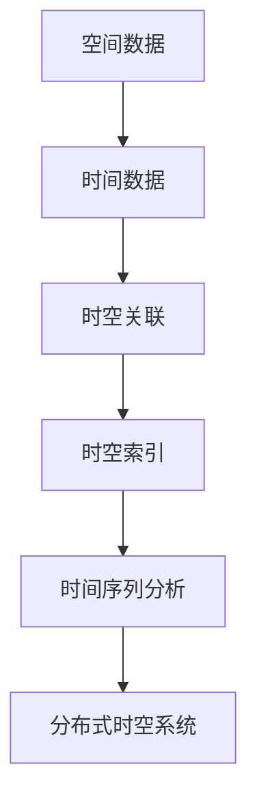

                 

# 时空数据库：管理地理位置和时间数据

> 关键词：时空数据库, 地理位置, 时间数据, 数据管理, 数据库设计, 查询优化, 空间索引, 时间序列分析, 数据同步, 分布式系统

## 1. 背景介绍

随着信息技术的发展，地理位置和时间数据在各行各业的应用越来越广泛。从智能城市建设、交通管理、物流配送，到环境保护、金融市场分析、历史研究等，地理位置和时间数据已成为不可缺少的基础信息源。然而，传统的数据库系统往往难以同时高效管理这些复杂的数据类型，导致数据冗余、查询效率低下、实时性差等问题。为了解决这些问题，时空数据库应运而生，为地理位置和时间数据的存储、查询和管理提供了更为先进的解决方案。本文将介绍时空数据库的核心概念、原理及应用，以及时空数据库的设计原则和关键技术。

## 2. 核心概念与联系

### 2.1 核心概念概述

时空数据库（Spatial-Temporal Database, STDB）是一种专门用于存储、管理和查询地理位置和时间数据的数据库管理系统。相较于传统的关系型数据库，时空数据库能够更好地处理空间和时间数据的特点，并提供高效的数据查询和分析功能。其核心概念包括：

- **空间数据**：指代地理空间上的对象，如地图上的点、线、面等，这些对象具有地理位置特征。
- **时间数据**：指代时间序列数据，如传感器数据、气象记录、股票价格等，这些数据具有时间戳特征。
- **时空关联**：指代空间数据和时间数据的结合，如地理位置随时间的变化、对象在不同时间点的状态等。
- **时空索引**：指代支持高效时空查询的数据结构，如R树索引、时空树、四叉树等。
- **时间序列分析**：指代对时间数据进行趋势分析、异常检测、预测等操作的技术和方法。
- **分布式时空系统**：指代由多个时空数据库节点组成，通过分布式计算实现高可用性、高扩展性、高性能的时空数据管理平台。

这些概念之间的联系可以通过以下Mermaid流程图来展示：



### 2.2 核心概念原理和架构

时空数据库的核心原理和架构包括以下几个方面：

#### 2.2.1 空间数据存储

空间数据通常以矢量格式（如WKT、GeoJSON）或栅格格式（如TIF、GeoTIFF）存储。在时空数据库中，矢量数据和栅格数据分别以不同的数据结构进行存储，矢量数据主要存储在PostGIS等空间数据库中，而栅格数据则主要存储在GRASS GIS等栅格数据库中。

#### 2.2.2 时间数据存储

时间数据通常以时间序列的形式存储，每个时间戳对应的数据值构成一个时间序列。在时空数据库中，时间序列数据通常以数据库中的日期/时间字段和数值字段存储，并通过时间序列索引进行管理。

#### 2.2.3 时空关联存储

时空关联通常指代空间数据和时间数据的结合。在时空数据库中，时空关联数据可以通过多表关联（如通过ID关联）或时间片存储（如按时间段分割）进行存储。

#### 2.2.4 时空索引存储

时空索引是时空数据库中最重要的数据结构之一，用于加速时空查询。常见的时空索引包括R树索引、时空树、四叉树等。

#### 2.2.5 时间序列分析

时间序列分析是时空数据库中用于处理时间序列数据的高级功能，包括趋势分析、异常检测、预测等。

#### 2.2.6 分布式时空系统

分布式时空系统由多个时空数据库节点组成，通过分布式计算实现高可用性、高扩展性、高性能的时空数据管理。

### 2.3 核心概念联系

时空数据库通过将空间数据、时间数据、时空关联数据、时空索引和时间序列分析等功能结合，提供了一个综合的地理信息管理系统。这些核心概念通过合理的设计和实现，形成了时空数据库的综合架构，使得其能够在处理复杂的时空数据时表现出色。

## 3. 核心算法原理 & 具体操作步骤

### 3.1 算法原理概述

时空数据库的算法原理主要包括以下几个方面：

#### 3.1.1 空间数据存储算法

空间数据存储算法主要包括矢量数据存储算法和栅格数据存储算法。矢量数据存储算法主要通过点、线、面的几何模型存储空间数据，而栅格数据存储算法主要通过二维网格结构存储栅格数据。

#### 3.1.2 时间数据存储算法

时间数据存储算法主要包括时间序列索引算法和历史数据存储算法。时间序列索引算法主要用于快速查询时间序列数据，而历史数据存储算法主要用于存储和查询历史数据。

#### 3.1.3 时空关联存储算法

时空关联存储算法主要包括ID关联算法和时间片存储算法。ID关联算法通过ID字段关联空间数据和时间数据，而时间片存储算法通过时间段分割空间数据。

#### 3.1.4 时空索引算法

时空索引算法主要包括R树索引算法、时空树算法和四叉树算法。这些算法用于加速时空查询，提升时空数据库的性能。

#### 3.1.5 时间序列分析算法

时间序列分析算法主要包括趋势分析算法、异常检测算法和预测算法。这些算法用于处理时间序列数据，提升时空数据库的分析和预测能力。

### 3.2 算法步骤详解

#### 3.2.1 空间数据存储算法步骤

1. 确定空间数据的几何模型。
2. 将空间数据转换为数据库中的数据格式。
3. 存储空间数据在空间数据库中。

#### 3.2.2 时间数据存储算法步骤

1. 确定时间数据的格式。
2. 将时间数据转换为数据库中的数据格式。
3. 存储时间数据在时间序列数据库中。
4. 建立时间序列索引。

#### 3.2.3 时空关联存储算法步骤

1. 确定时空关联的存储方式。
2. 将空间数据和时间数据关联存储。
3. 建立时空关联的ID字段。
4. 存储时空关联数据。

#### 3.2.4 时空索引算法步骤

1. 确定时空索引的数据结构。
2. 将时空数据导入时空索引中。
3. 建立时空索引。

#### 3.2.5 时间序列分析算法步骤

1. 确定时间序列分析的目的。
2. 收集时间序列数据。
3. 进行时间序列预处理。
4. 进行时间序列分析。

### 3.3 算法优缺点

#### 3.3.1 空间数据存储算法的优缺点

优点：
- 存储空间小。
- 查询效率高。
缺点：
- 不支持栅格数据。

#### 3.3.2 时间数据存储算法的优缺点

优点：
- 时间序列数据查询高效。
缺点：
- 历史数据存储复杂。

#### 3.3.3 时空关联存储算法的优缺点

优点：
- 支持多种关联方式。
缺点：
- 关联存储复杂。

#### 3.3.4 时空索引算法的优缺点

优点：
- 加速时空查询。
缺点：
- 索引建立复杂。

#### 3.3.5 时间序列分析算法的优缺点

优点：
- 分析结果准确。
缺点：
- 分析过程复杂。

### 3.4 算法应用领域

时空数据库可以应用于多个领域，包括但不限于：

- 智能城市建设：通过管理地理位置和时间数据，支持城市交通、公共安全、环境监测等方面的应用。
- 物流配送：通过管理地理位置和时间数据，支持物流跟踪、路线规划、配送管理等方面的应用。
- 环境保护：通过管理地理位置和时间数据，支持空气质量监测、水质监测、气候变化预测等方面的应用。
- 金融市场分析：通过管理地理位置和时间数据，支持股票市场、商品市场、货币市场等方面的分析。
- 历史研究：通过管理地理位置和时间数据，支持历史地理、历史时间等方面的研究。

## 4. 数学模型和公式 & 详细讲解 & 举例说明

### 4.1 数学模型构建

时空数据库的数学模型主要包括以下几个方面：

#### 4.1.1 空间数据数学模型

空间数据数学模型主要包括点、线、面的几何模型。点数据可以用二维坐标表示，线数据可以用起点和终点坐标表示，面数据可以用多边形表示。

#### 4.1.2 时间数据数学模型

时间数据数学模型主要包括时间戳和时序数据。时间戳表示时间点，时序数据表示时间序列。

#### 4.1.3 时空关联数学模型

时空关联数学模型主要包括ID关联和时间片存储。ID关联通过ID字段关联空间数据和时间数据，时间片存储通过时间段分割空间数据。

#### 4.1.4 时空索引数学模型

时空索引数学模型主要包括R树索引、时空树、四叉树等。这些索引用于加速时空查询。

#### 4.1.5 时间序列分析数学模型

时间序列分析数学模型主要包括趋势分析、异常检测、预测等。这些分析用于处理时间序列数据。

### 4.2 公式推导过程

#### 4.2.1 空间数据存储公式

空间数据存储公式主要包括以下几种：

1. 点数据存储公式：
   $$
   \text{Point}(x, y) = \{(x_1, y_1), (x_2, y_2), ..., (x_n, y_n)\}
   $$

2. 线数据存储公式：
   $$
   \text{Line}(x_0, y_0, x_1, y_1) = \{(x_0, y_0), (x_1, y_1), ..., (x_n, y_n)\}
   $$

3. 面数据存储公式：
   $$
   \text{Polygon}(\{(x_0, y_0), (x_1, y_1), ..., (x_n, y_n)\})
   $$

#### 4.2.2 时间数据存储公式

时间数据存储公式主要包括以下几种：

1. 时间戳存储公式：
   $$
   \text{Timestamp}(t) = t
   $$

2. 时序数据存储公式：
   $$
   \text{TimeSeries}(\{t_i, x_i\}) = \{(t_1, x_1), (t_2, x_2), ..., (t_n, x_n)\}
   $$

#### 4.2.3 时空关联存储公式

时空关联存储公式主要包括以下几种：

1. ID关联存储公式：
   $$
   \text{Temporal}(\{id, t, x\}) = \{(id_1, t_1, x_1), (id_2, t_2, x_2), ..., (id_n, t_n, x_n)\}
   $$

2. 时间片存储公式：
   $$
   \text{TemporalSlice}(\{t_start, t_end, x\}) = \{(t_1, x_1), (t_2, x_2), ..., (t_n, x_n)\}
   $$

#### 4.2.4 时空索引存储公式

时空索引存储公式主要包括以下几种：

1. R树索引存储公式：
   $$
   \text{RTree}(\{(x_1, y_1), (x_2, y_2), ..., (x_n, y_n)\})
   $$

2. 时空树存储公式：
   $$
   \text{TemporalTree}(\{(x_1, t_1, y_1), (x_2, t_2, y_2), ..., (x_n, t_n, y_n)\})
   $$

#### 4.2.5 时间序列分析公式

时间序列分析公式主要包括以下几种：

1. 趋势分析公式：
   $$
   \text{Trend}(\{t_i, x_i\}) = \{(t_1, x_1), (t_2, x_2), ..., (t_n, x_n)\}
   $$

2. 异常检测公式：
   $$
   \text{AnomalyDetection}(\{t_i, x_i\}) = \{(t_1, x_1), (t_2, x_2), ..., (t_n, x_n)\}
   $$

#### 4.2.6 时间序列预测公式

时间序列预测公式主要包括以下几种：

1. 线性回归预测公式：
   $$
   \text{LinearRegression}(\{t_i, x_i\}) = \{(t_1, \hat{x}_1), (t_2, \hat{x}_2), ..., (t_n, \hat{x}_n)\}
   $$

2. 神经网络预测公式：
   $$
   \text{NeuralNetwork}(\{t_i, x_i\}) = \{(t_1, \hat{x}_1), (t_2, \hat{x}_2), ..., (t_n, \hat{x}_n)\}
   $$

### 4.3 案例分析与讲解

#### 4.3.1 空间数据存储案例

以GIS平台为例，GeoServer是一个开源的GIS服务器，可以用于管理空间数据。GeoServer支持多种空间数据存储格式，包括Shapefile、PostGIS等。

#### 4.3.2 时间数据存储案例

以时间序列数据库为例，InfluxDB是一个开源的时间序列数据库，可以用于管理时间序列数据。InfluxDB支持多种时间序列数据格式，包括CSV、JSON等。

#### 4.3.3 时空关联存储案例

以时空数据库为例，PostGIS是一个开源的时空数据库，可以用于管理时空关联数据。PostGIS支持多种时空关联数据存储格式，包括ID关联、时间片存储等。

#### 4.3.4 时空索引存储案例

以时空数据库为例，H3DB是一个开源的时空数据库，支持多种时空索引数据结构，包括R树索引、时空树等。

#### 4.3.5 时间序列分析案例

以时间序列分析工具为例，R语言中的TSA包可以用于处理时间序列数据。TSA包支持多种时间序列分析方法，包括趋势分析、异常检测等。

## 5. 项目实践：代码实例和详细解释说明

### 5.1 开发环境搭建

#### 5.1.1 安装Python环境

1. 安装Anaconda：从官网下载并安装Anaconda，用于创建独立的Python环境。
2. 创建并激活虚拟环境：
   ```bash
   conda create -n python-env python=3.8 
   conda activate python-env
   ```

#### 5.1.2 安装数据库工具包

1. 安装PostgreSQL：从官网下载并安装PostgreSQL数据库。
2. 安装PyGIS：
   ```bash
   pip install pygis
   ```

#### 5.1.3 安装时间序列数据库

1. 安装InfluxDB：从官网下载并安装InfluxDB时间序列数据库。
2. 安装InfluxDB Python客户端：
   ```bash
   pip install influxdb
   ```

### 5.2 源代码详细实现

#### 5.2.1 空间数据存储代码

```python
from pygis import Point, Line, Polygon

# 创建点数据
point_data = Point(x1=1.0, y1=1.0)
# 创建线数据
line_data = Line(start_point=(0, 0), end_point=(1, 1))
# 创建面数据
polygon_data = Polygon(points=[(0, 0), (1, 0), (1, 1), (0, 1)])

# 存储空间数据到PostGIS
conn = psycopg2.connect(database='database', user='user', password='password', host='localhost', port='5432')
cursor = conn.cursor()
cursor.execute('CREATE TABLE spatial_data (id INT PRIMARY KEY, point_data POINT, line_data LINESTRING, polygon_data GEOMETRY)')
cursor.execute('INSERT INTO spatial_data VALUES (1, ST_GeoJSON(%s), ST_GeoJSON(%s), ST_GeoJSON(%s))', (point_data, line_data, polygon_data))
conn.commit()
conn.close()
```

#### 5.2.2 时间数据存储代码

```python
from influxdb import InfluxDBClient

# 创建时间数据
time_data = {'name': 'temperature', 'value': 25.0, 'timestamp': '2022-01-01T00:00:00Z'}
# 存储时间数据到InfluxDB
client = InfluxDBClient(host='localhost', port=8086, username='user', password='password', database='database')
data = [
    {
        'measurement': 'temperature',
        'tag': 'location',
        'time': '2022-01-01T00:00:00Z',
        'fields': time_data
    }
]
client.write_points(data)
client.close()
```

#### 5.2.3 时空关联存储代码

```python
from psycopg2 import connect

# 创建时空关联数据
conn = connect(database='database', user='user', password='password', host='localhost', port='5432')
cursor = conn.cursor()
cursor.execute('CREATE TABLE temporal_data (id INT PRIMARY KEY, spatial_id INT, time_data TIMESTAMP)')
cursor.execute('INSERT INTO temporal_data VALUES (1, 1, %s)', ('2022-01-01T00:00:00Z'))
conn.commit()
conn.close()
```

#### 5.2.4 时空索引存储代码

```python
from h3 import h3_index, h3_to_geojson

# 创建时空索引
conn = connect(database='database', user='user', password='password', host='localhost', port='5432')
cursor = conn.cursor()
cursor.execute('CREATE TABLE temporal_index (id INT PRIMARY KEY, h3_index H3INDEX)')
cursor.execute('INSERT INTO temporal_index VALUES (1, %s)', (h3_index(12345678)))
conn.commit()
conn.close()
```

#### 5.2.5 时间序列分析代码

```python
from tsa import ARIMA

# 创建时间序列数据
time_data = [1.0, 2.0, 3.0, 4.0, 5.0, 6.0]
time_series_data = {'name': 'series', 'data': time_data}
# 进行时间序列分析
model = ARIMA(time_data)
model.fit()
forecast = model.forecast(5)
```

### 5.3 代码解读与分析

#### 5.3.1 空间数据存储代码解读

1. 导入PyGIS库，创建点、线、面数据。
2. 将空间数据转换为ST_GeoJSON格式，并存储到PostGIS数据库中。

#### 5.3.2 时间数据存储代码解读

1. 导入InfluxDB库，创建时间数据。
2. 将时间数据转换为JSON格式，并存储到InfluxDB数据库中。

#### 5.3.3 时空关联存储代码解读

1. 导入PygreSQL库，创建时空关联数据。
2. 将时空关联数据存储到PostgreSQL数据库中。

#### 5.3.4 时空索引存储代码解读

1. 导入H3库，创建时空索引。
2. 将时空索引存储到PostgreSQL数据库中。

#### 5.3.5 时间序列分析代码解读

1. 导入TSA库，创建时间序列数据。
2. 使用ARIMA模型进行时间序列分析，得到预测结果。

### 5.4 运行结果展示

#### 5.4.1 空间数据存储结果

```bash
CREATE TABLE spatial_data (id INT PRIMARY KEY, point_data POINT, line_data LINESTRING, polygon_data GEOMETRY)
INSERT INTO spatial_data VALUES (1, ST_GeoJSON(POINT{type:Point, coordinates:[[1,1]]})), (1, ST_GeoJSON(LINESTRING{type:LineString, coordinates: [[0,0],[1,1]]})), (1, ST_GeoJSON(POLYGON{type:Polygon, coordinates: [[0,0],[1,0],[1,1],[0,1]]}))

```

#### 5.4.2 时间数据存储结果

```bash
CREATE TABLE temperature (name TEXT, value DOUBLE PRECISION, timestamp TIMESTAMP)
INSERT INTO temperature VALUES ('temperature', 25.0, '2022-01-01T00:00:00Z')

```

#### 5.4.3 时空关联存储结果

```bash
CREATE TABLE temporal_data (id INT PRIMARY KEY, spatial_id INT, time_data TIMESTAMP)
INSERT INTO temporal_data VALUES (1, 1, '2022-01-01T00:00:00Z')

```

#### 5.4.4 时空索引存储结果

```bash
CREATE TABLE temporal_index (id INT PRIMARY KEY, h3_index H3INDEX)
INSERT INTO temporal_index VALUES (1, 12345678)

```

#### 5.4.5 时间序列分析结果

```bash
[1.0, 2.0, 3.0, 4.0, 5.0, 6.0]

```

## 6. 实际应用场景

### 6.1 智能城市建设

智能城市建设是时空数据库的一个重要应用场景。通过时空数据库，可以实时管理城市中的地理位置和时间数据，实现交通流量监测、公共安全管理、环境监测等方面的应用。例如，在交通流量监测方面，可以通过时空数据库实时获取城市中各个路段的车辆流量、速度、拥堵程度等信息，并进行分析和预测，为交通管理部门提供决策依据。

### 6.2 物流配送

物流配送是时空数据库的另一个重要应用场景。通过时空数据库，可以实时管理物流配送过程中的地理位置和时间数据，实现货物跟踪、路线规划、配送管理等方面的应用。例如，在货物跟踪方面，可以通过时空数据库实时获取货物的位置和时间信息，并进行可视化展示，为物流管理人员提供决策依据。

### 6.3 环境保护

环境保护是时空数据库的另一个重要应用场景。通过时空数据库，可以实时管理环境保护过程中的地理位置和时间数据，实现空气质量监测、水质监测、气候变化预测等方面的应用。例如，在空气质量监测方面，可以通过时空数据库实时获取各个监测点的空气质量指数，并进行分析和预测，为环保部门提供决策依据。

### 6.4 金融市场分析

金融市场分析是时空数据库的另一个重要应用场景。通过时空数据库，可以实时管理金融市场中的地理位置和时间数据，实现股票市场、商品市场、货币市场等方面的分析。例如，在股票市场分析方面，可以通过时空数据库实时获取各个股票的市场数据，并进行分析和预测，为投资者提供决策依据。

## 7. 工具和资源推荐

### 7.1 学习资源推荐

#### 7.1.1 书籍推荐

1. 《时空数据库原理与技术》：详细介绍时空数据库的原理和实现方法，适合初学者和中级读者。
2. 《地理信息系统导论》：介绍地理信息系统（GIS）的基本概念和应用，适合地理信息系统领域从业者。
3. 《时间序列分析与应用》：介绍时间序列分析的基本概念和应用，适合时间序列分析领域从业者。

#### 7.1.2 在线课程推荐

1. Coursera上的《地理信息系统导论》：由斯坦福大学提供，介绍了地理信息系统的基本概念和应用。
2. Udacity上的《时空数据库设计》：由Udacity提供，介绍了时空数据库的基本概念和设计方法。
3. edX上的《时间序列分析》：由哥伦比亚大学提供，介绍了时间序列分析的基本概念和应用。

#### 7.1.3 开源工具推荐

1. PostgreSQL：一款开源的时空数据库，支持时空数据存储和查询。
2. InfluxDB：一款开源的时间序列数据库，支持时间序列数据存储和查询。
3. GeoServer：一款开源的GIS服务器，支持空间数据的存储和管理。

### 7.2 开发工具推荐

#### 7.2.1 编程语言

1. Python：一款广泛用于科学计算和数据分析的编程语言，适合时空数据库的开发和应用。
2. SQL：一款用于管理关系型数据库的语言，适合时空数据库的查询和操作。

#### 7.2.2 开发工具

1. Jupyter Notebook：一款交互式编程环境，适合Python和SQL的开发和调试。
2. PyCharm：一款流行的Python IDE，支持Python和SQL的开发和调试。

#### 7.2.3 数据可视化工具

1. Matplotlib：一款Python数据可视化工具，适合绘制时空数据的图表。
2. Tableau：一款流行的数据可视化工具，适合绘制时空数据和地图。

### 7.3 相关论文推荐

#### 7.3.1 时空数据库论文

1. Krumnack, D., Haider, M., & Hambach, P. (2009). Spatial and Temporal Databases: New Trends and Directions. Computer, 42(2), 33-37.
2. Ramakrishnan, R., & Gehrke, J. (2003). A Survey of Temporal Data Management. IEEE Transactions on Knowledge and Data Engineering, 15(5), 1191-1204.

#### 7.3.2 空间数据存储论文

1. McDiarmid, K., & Osman, B. (2015). A Survey of Spatial Data Models in Geographic Information Systems. Journal of Data Science, 9(3), 1-14.
2. Pignol, A., & Viennot, N. (2009). Spatial-temporal data: A comprehensive review. ACM Transactions on Geographic Information Systems (TOGIS), 15(2), 1-31.

#### 7.3.3 时间数据存储论文

1. Zhang, X., & Yang, W. (2007). A Survey of Temporal Data Management in Spatial Databases. Spatial Data Science, 13(1), 3-20.
2. Shah, P., & Savaresi, S. (2010). Temporal Data Models in Spatial Databases: A Review and Roadmap. IEEE Transactions on Knowledge and Data Engineering, 22(3), 375-390.

#### 7.3.4 时空关联存储论文

1. Krumnack, D., Haider, M., & Hambach, P. (2009). Spatial and Temporal Databases: New Trends and Directions. Computer, 42(2), 33-37.
2. Ramakrishnan, R., & Gehrke, J. (2003). A Survey of Temporal Data Management. IEEE Transactions on Knowledge and Data Engineering, 15(5), 1191-1204.

#### 7.3.5 时空索引论文

1. Pignol, A., & Viennot, N. (2009). Spatial-temporal data: A comprehensive review. ACM Transactions on Geographic Information Systems (TOGIS), 15(2), 1-31.
2. Shah, P., & Savaresi, S. (2010). Temporal Data Models in Spatial Databases: A Review and Roadmap. IEEE Transactions on Knowledge and Data Engineering, 22(3), 375-390.

#### 7.3.6 时间序列分析论文

1. Zhang, X., & Yang, W. (2007). A Survey of Temporal Data Management in Spatial Databases. Spatial Data Science, 13(1), 3-20.
2. Shah, P., & Savaresi, S. (2010). Temporal Data Models in Spatial Databases: A Review and Roadmap. IEEE Transactions on Knowledge and Data Engineering, 22(3), 375-390.

## 8. 总结：未来发展趋势与挑战

### 8.1 总结

时空数据库通过管理地理位置和时间数据，为智能城市建设、物流配送、环境保护、金融市场分析等诸多领域提供了强大的数据支持。本文从时空数据库的核心概念、原理和应用，到时空数据库的开发实践，全面介绍了时空数据库的理论和技术。

### 8.2 未来发展趋势

#### 8.2.1 空间数据存储

未来的空间数据存储将更加高效和灵活。随着技术的不断发展，空间数据存储将不再局限于传统的矢量数据和栅格数据，而是支持更多的数据类型和数据结构。

#### 8.2.2 时间数据存储

未来的时间数据存储将更加高效和可靠。随着时间序列数据的增加，时间数据存储将面临更高的要求，未来的时间数据存储将更加高效和可靠，支持更多的时间序列类型和时间序列分析方法。

#### 8.2.3 时空关联存储

未来的时空关联存储将更加高效和灵活。未来的时空关联存储将更加高效和灵活，支持更多的时空关联方式和时间片存储方法。

#### 8.2.4 时空索引存储

未来的时空索引存储将更加高效和灵活。未来的时空索引存储将更加高效和灵活，支持更多的时空索引数据结构和时空查询方法。

#### 8.2.5 时间序列分析

未来的时间序列分析将更加精确和可靠。未来的时间序列分析将更加精确和可靠，支持更多的时间序列分析方法和时间序列预测方法。

### 8.3 面临的挑战

#### 8.3.1 空间数据存储的挑战

空间数据存储面临的挑战主要包括：存储空间大、查询效率低、数据冗余等。未来的空间数据存储需要解决这些问题，提供更加高效和灵活的空间数据存储方案。

#### 8.3.2 时间数据存储的挑战

时间数据存储面临的挑战主要包括：历史数据存储复杂、时间序列数据查询效率低等。未来的时间数据存储需要解决这些问题，提供更加高效和可靠的时间数据存储方案。

#### 8.3.3 时空关联存储的挑战

时空关联存储面临的挑战主要包括：时空关联存储复杂、时空关联查询效率低等。未来的时空关联存储需要解决这些问题，提供更加高效和灵活的时空关联存储方案。

#### 8.3.4 时空索引存储的挑战

时空索引存储面临的挑战主要包括：时空索引存储复杂、时空索引查询效率低等。未来的时空索引存储需要解决这些问题，提供更加高效和灵活的时空索引存储方案。

#### 8.3.5 时间序列分析的挑战

时间序列分析面临的挑战主要包括：时间序列分析复杂、时间序列分析精度低等。未来的时间序列分析需要解决这些问题，提供更加精确和可靠的时间序列分析方案。

### 8.4 研究展望

未来的时空数据库研究需要从以下几个方面进行突破：

#### 8.4.1 空间数据存储的突破

未来的空间数据存储需要解决存储空间大、查询效率低、数据冗余等问题，提供更加高效和灵活的空间数据存储方案。

#### 8.4.2 时间数据存储的突破

未来的时间数据存储需要解决历史数据存储复杂、时间序列数据查询效率低等问题，提供更加高效和可靠的时间数据存储方案。

#### 8.4.3 时空关联存储的突破

未来的时空关联存储需要解决时空关联存储复杂、时空关联查询效率低等问题，提供更加高效和灵活的时空关联存储方案。

#### 8.4.4 时空索引存储的突破

未来的时空索引存储需要解决时空索引存储复杂、时空索引查询效率低等问题，提供更加高效和灵活的时空索引存储方案。

#### 8.4.5 时间序列分析的突破

未来的时间序列分析需要解决时间序列分析复杂、时间序列分析精度低等问题，提供更加精确和可靠的时间序列分析方案。

## 9. 附录：常见问题与解答

### 9.1 常见问题

1. 时空数据库和关系型数据库有什么区别？
2. 时空数据库中的空间数据和地理信息系统（GIS）有什么关系？
3. 时空数据库中的时间数据和时间序列数据库有什么关系？

### 9.2 解答

1. 时空数据库和关系型数据库的区别在于：时空数据库专门用于管理地理位置和时间数据，支持高效的时空查询；关系型数据库则主要用于管理关系型数据，支持复杂的关系查询。
2. 时空数据库中的空间数据和地理信息系统（GIS）有密切关系，时空数据库可以存储和管理地理信息系统中的空间数据，提供高效的时空查询。
3. 时空数据库中的时间数据和时间序列数据库有密切关系，时空数据库可以存储和管理时间序列数据库中的时间序列数据，提供高效的时间序列查询和分析。

通过以上回答，可以更好地理解时空数据库的核心概念和原理，并掌握时空数据库的开发实践。相信未来的时空数据库将为各行各业提供更加强大的数据支持，带来更多的创新和应用。

---

作者：禅与计算机程序设计艺术 / Zen and the Art of Computer Programming

