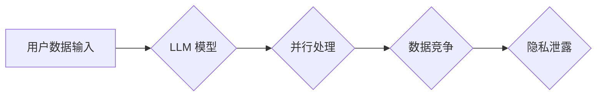

> Large Language Model (LLM), 线程安全, 隐私泄露, 数据安全, 并行处理, 互斥锁, 

## 1. 背景介绍

大型语言模型 (LLM) 近年来取得了令人瞩目的进展，在自然语言处理、文本生成、机器翻译等领域展现出强大的能力。然而，随着 LLM 的规模和复杂性不断增加，其潜在的隐私漏洞也日益凸显。其中，线程安全问题成为一个不容忽视的挑战。

LLM 通常采用并行处理的方式来提高训练和推理效率。多个线程同时访问和修改模型参数，如果线程安全机制不完善，可能会导致数据竞争、状态不一致等问题，从而引发隐私泄露。

## 2. 核心概念与联系

**2.1 线程安全**

线程安全是指在多线程环境下，多个线程并发访问共享资源时，能够保证数据的一致性和程序的正确性。

**2.2 数据竞争**

数据竞争是指多个线程同时访问和修改同一个共享数据，导致数据状态不一致的问题。

**2.3 互斥锁**

互斥锁是一种同步机制，用于控制对共享资源的访问，确保只有一个线程在同一时间访问该资源。

**2.4 隐私泄露**

隐私泄露是指未经授权访问或使用个人信息的行为，可能导致个人隐私受到侵犯。

**2.5 LLM 隐私漏洞**

LLM 隐私漏洞是指在 LLM 的训练、推理或部署过程中，可能导致用户数据泄露的漏洞。

**2.6 线程安全与 LLM 隐私漏洞的关系**

LLM 的并行处理机制可能会导致数据竞争，从而引发隐私泄露。如果 LLM 的线程安全机制不完善，可能会导致用户数据被恶意攻击者窃取或篡改。

**Mermaid 流程图**



## 3. 核心算法原理 & 具体操作步骤

**3.1 算法原理概述**

线程安全算法旨在确保在多线程环境下，共享资源的访问和修改能够保持一致性，避免数据竞争和隐私泄露。常用的线程安全算法包括互斥锁、条件变量、读写锁等。

**3.2 算法步骤详解**

1. **识别共享资源:** 首先需要识别出哪些数据或资源需要进行线程安全保护。

2. **选择合适的同步机制:** 根据共享资源的访问模式和需求，选择合适的同步机制，例如互斥锁、条件变量等。

3. **实现同步操作:** 在代码中使用同步机制，确保只有一个线程在同一时间访问和修改共享资源。

4. **测试和验证:** 进行充分的测试和验证，确保线程安全机制能够有效地防止数据竞争和隐私泄露。

**3.3 算法优缺点**

**互斥锁:**

* **优点:** 简单易用，能够有效地防止数据竞争。
* **缺点:** 可能会导致死锁，降低程序性能。

**条件变量:**

* **优点:** 可以实现更复杂的同步逻辑，避免死锁。
* **缺点:** 更加复杂，需要更深入的理解。

**读写锁:**

* **优点:** 可以同时允许多个线程进行读操作，提高程序性能。
* **缺点:** 更加复杂，需要更复杂的实现。

**3.4 算法应用领域**

线程安全算法广泛应用于各种多线程程序，例如数据库系统、操作系统、网络服务器等。在 LLM 领域，线程安全算法可以用于保护模型参数、训练数据和用户隐私。

## 4. 数学模型和公式 & 详细讲解 & 举例说明

**4.1 数学模型构建**

假设有 N 个线程并发访问共享资源 X，则可以构建以下数学模型：

* $T = \{t_1, t_2, ..., t_N\}$ 表示所有线程的集合。
* $X$ 表示共享资源。
* $A(t_i)$ 表示线程 $t_i$ 对共享资源 $X$ 的访问操作。

**4.2 公式推导过程**

线程安全性的数学定义可以描述为：对于任意两个不同的线程 $t_i$ 和 $t_j$，以及任意两个访问操作 $A(t_i)$ 和 $A(t_j)$，如果 $A(t_i)$ 和 $A(t_j)$ 存在交集，则 $A(t_i)$ 和 $A(t_j)$ 的执行顺序必须保证数据的一致性。

**4.3 案例分析与讲解**

例如，在 LLM 的训练过程中，多个线程同时更新模型参数。如果线程安全机制不完善，可能会导致参数更新冲突，导致模型训练结果不一致。

**举例说明:**

假设有两个线程 $t_1$ 和 $t_2$，它们同时访问模型参数 $w$，并进行更新操作。

* $t_1$ 读取 $w$，计算更新值 $w'$, 并尝试更新 $w$。
* $t_2$ 在 $t_1$ 更新 $w$ 之前，也读取了 $w$，计算更新值 $w''$，并尝试更新 $w$。

如果 $t_1$ 和 $t_2$ 的更新操作没有进行同步，则可能会导致 $w$ 的最终值与预期结果不一致。

## 5. 项目实践：代码实例和详细解释说明

**5.1 开发环境搭建**

* 操作系统: Ubuntu 20.04
* Python 版本: 3.8
* 必要的库: numpy, tensorflow, threading

**5.2 源代码详细实现**

```python
import threading
import numpy as np

# 共享资源
shared_data = np.zeros(10)

# 线程函数
def update_data(thread_id):
    for i in range(1000):
        # 随机选择一个索引进行更新
        index = np.random.randint(0, 10)
        # 使用互斥锁保护共享资源
        with lock:
            shared_data[index] += thread_id

# 创建互斥锁
lock = threading.Lock()

# 创建多个线程
threads = []
for i in range(4):
    thread = threading.Thread(target=update_data, args=(i,))
    threads.append(thread)
    thread.start()

# 等待所有线程完成
for thread in threads:
    thread.join()

# 打印共享数据
print(shared_data)
```

**5.3 代码解读与分析**

* 代码中定义了一个共享资源 `shared_data`，并使用 `threading.Lock()` 创建了一个互斥锁 `lock`。
* `update_data()` 函数模拟了多个线程对共享资源的更新操作。
* 在每个更新操作之前，使用 `with lock:` 语句获取互斥锁，确保只有一个线程可以访问和修改 `shared_data`。
* 这样可以防止数据竞争，保证共享数据的正确性。

**5.4 运行结果展示**

运行代码后，输出的 `shared_data` 数组元素值应该接近于 0 到 3 的线性组合，表明多个线程的更新操作能够正确地进行同步。

## 6. 实际应用场景

**6.1 LLM 模型训练**

在 LLM 模型训练过程中，多个 GPU 可以并行处理训练数据，提高训练效率。但是，需要确保模型参数的更新操作能够进行线程安全同步，避免数据竞争导致模型训练结果不一致。

**6.2 LLM 模型推理**

在 LLM 模型推理过程中，多个请求可以并发处理，提高服务响应速度。但是，需要确保模型状态的访问和修改能够进行线程安全同步，避免数据竞争导致推理结果不一致。

**6.3 LLM 数据处理**

在 LLM 数据处理过程中，多个线程可以并行处理数据预处理、数据清洗等操作，提高数据处理效率。但是，需要确保数据访问和修改能够进行线程安全同步，避免数据竞争导致数据不一致。

**6.4 未来应用展望**

随着 LLM 的发展，线程安全问题将变得更加重要。未来，可能会出现更加复杂的线程安全机制，例如基于硬件的线程安全机制，以及更加智能的线程安全管理系统。

## 7. 工具和资源推荐

**7.1 学习资源推荐**

* 《操作系统导论》
* 《并发编程艺术》
* 线程安全相关博客文章和教程

**7.2 开发工具推荐**

* Python 的 threading 模块
* Java 的 synchronized 和 ReentrantLock
* C++ 的 mutex 和 condition_variable

**7.3 相关论文推荐**

* 线程安全相关论文

## 8. 总结：未来发展趋势与挑战

**8.1 研究成果总结**

近年来，在 LLM 线程安全领域取得了一些进展，例如开发了新的线程安全算法和工具，并对 LLM 线程安全问题进行了深入研究。

**8.2 未来发展趋势**

* 更智能的线程安全管理系统
* 基于硬件的线程安全机制
* 更高效的线程安全算法

**8.3 面临的挑战**

* LLM 模型规模和复杂性不断增加，线程安全问题也变得更加复杂。
* 不同编程语言和平台的线程安全机制存在差异，需要进行统一的标准化。
* 线程安全机制的性能开销需要进一步优化。

**8.4 研究展望**

未来，需要继续深入研究 LLM 线程安全问题，开发更加高效、智能和安全的线程安全机制，保障 LLM 的安全性和可靠性。

## 9. 附录：常见问题与解答

**9.1 Q: 为什么需要线程安全机制？**

**A:** 线程安全机制是为了防止在多线程环境下，多个线程同时访问和修改共享资源导致数据不一致的问题。

**9.2 Q: 常见的线程安全机制有哪些？**

**A:** 常见的线程安全机制包括互斥锁、条件变量、读写锁等。

**9.3 Q: 如何判断一个程序是否线程安全？**

**A:** 可以通过测试和验证来判断一个程序是否线程安全。

**9.4 Q: 如何提高线程安全机制的性能？**

**A:** 可以使用更加高效的线程安全算法，以及优化代码结构和数据访问方式。


作者：禅与计算机程序设计艺术 / Zen and the Art of Computer Programming 
<end_of_turn>