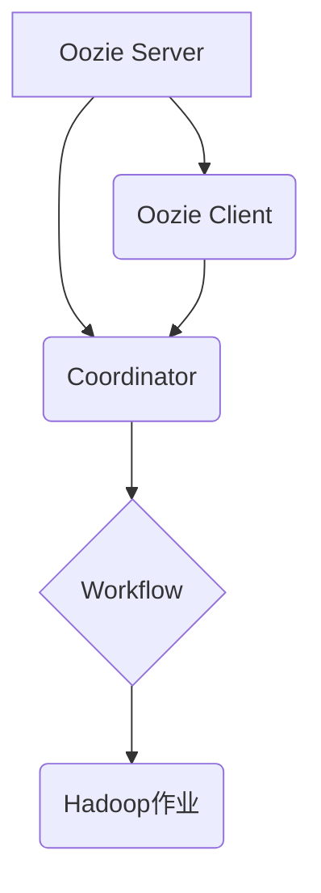

> Oozie, Coordinator, Workflow, Apache Hadoop, Big Data, Workflow Management

## 1. 背景介绍

在现代数据处理领域，大规模数据处理和分析任务越来越普遍。Apache Hadoop作为分布式存储和计算框架，为处理海量数据提供了强大的支持。然而，Hadoop本身并不具备对复杂数据处理流程的管理能力。为了解决这一问题，Apache Oozie应运而生。

Oozie是一个开源的Workflow调度系统，专门为Hadoop生态系统设计。它提供了一种统一的平台，用于定义、调度、监控和管理Hadoop作业的执行流程。Oozie支持多种类型的Hadoop作业，包括MapReduce、Pig、Hive、Spark等。

其中，Oozie Coordinator是Oozie中的一种特殊类型的Workflow，它用于管理重复性任务的执行。Coordinator可以根据预定义的调度策略，自动触发和管理一系列作业的执行，例如每天定时执行数据备份、每周定时执行数据分析等。

## 2. 核心概念与联系

Oozie Coordinator的核心概念是“Workflow”，它是一个由多个作业组成的执行流程。Coordinator负责管理Workflow的执行，包括调度、监控和错误处理。

**Oozie Coordinator与其他组件的关系：**



**Oozie Coordinator的工作流程：**

1. 用户通过Oozie Client定义Coordinator的配置信息，包括调度策略、作业列表等。
2. Oozie Server接收Coordinator配置信息，并将其存储在数据库中。
3. 根据调度策略，Oozie Server会定期检查Coordinator的状态，并触发相应的作业执行。
4. Coordinator会将作业提交到Hadoop集群执行。
5. Oozie Server会监控作业的执行状态，并记录执行结果。
6. 如果作业执行失败，Coordinator会根据配置信息进行错误处理，例如重新执行作业或发送告警信息。

## 3. 核心算法原理 & 具体操作步骤

### 3.1  算法原理概述

Oozie Coordinator的核心算法是基于状态机模型的调度算法。Coordinator的状态机包含多个状态，例如“初始状态”、“运行状态”、“暂停状态”和“结束状态”。根据调度策略和作业执行状态，Coordinator会自动切换到不同的状态，并执行相应的操作。

### 3.2  算法步骤详解

1. **初始化状态：**Coordinator创建时，处于“初始状态”。
2. **调度状态：**当Coordinator处于“调度状态”时，Oozie Server会根据调度策略检查Coordinator的状态，并触发相应的作业执行。
3. **运行状态：**当作业开始执行时，Coordinator会进入“运行状态”。
4. **暂停状态：**如果Coordinator处于“暂停状态”，则不会触发任何作业执行。
5. **结束状态：**当所有作业都执行完成或Coordinator被手动停止时，Coordinator会进入“结束状态”。

### 3.3  算法优缺点

**优点：**

* **简单易用：**Oozie Coordinator的调度算法相对简单，易于理解和配置。
* **灵活可配置：**Oozie Coordinator支持多种调度策略，可以根据实际需求进行灵活配置。
* **可靠性高：**Oozie Coordinator具有良好的错误处理机制，可以确保作业的可靠执行。

**缺点：**

* **功能有限：**Oozie Coordinator主要用于管理重复性任务，对于复杂的任务流程管理能力有限。
* **性能瓶颈：**Oozie Server需要处理大量的调度请求，可能会导致性能瓶颈。

### 3.4  算法应用领域

Oozie Coordinator广泛应用于各种大数据处理场景，例如：

* **数据备份和恢复：**定时备份数据到HDFS或其他存储系统。
* **数据清洗和转换：**定期执行数据清洗和转换任务，确保数据质量。
* **数据分析和报表：**定时执行数据分析和报表生成任务，提供数据洞察。
* **机器学习模型训练：**定时训练机器学习模型，并更新模型参数。

## 4. 数学模型和公式 & 详细讲解 & 举例说明

### 4.1  数学模型构建

Oozie Coordinator的调度策略可以抽象为一个数学模型，其中涉及到时间、频率、作业执行时间等因素。

**时间模型：**

* $t$：当前时间
* $t_s$：调度时间
* $t_e$：作业执行结束时间

**频率模型：**

* $f$：调度频率（例如，每天、每周）

**作业执行时间模型：**

* $e$：作业执行时间

**调度策略模型：**

* $S(t)$：调度策略函数，根据时间 $t$ 返回调度状态（例如，调度、暂停、结束）

### 4.2  公式推导过程

根据上述模型，可以推导出Oozie Coordinator的调度算法公式：

* **调度状态判断：**

$$
S(t) = \begin{cases}
调度 & \text{if } t \equiv t_s \pmod{f} \\
暂停 & \text{if } t \not\equiv t_s \pmod{f} \\
结束 & \text{if } t_e > t
\end{cases}
$$

* **作业执行时间计算：**

$$
t_e = t + e
$$

### 4.3  案例分析与讲解

**案例：**

假设我们需要每天定时执行一个数据备份作业，作业执行时间为30分钟。

**调度策略：**

* 调度频率 $f$ = 24小时
* 调度时间 $t_s$ = 00:00

**调度状态判断：**

当当前时间 $t$ 为00:00时，$t \equiv t_s \pmod{f}$ 为真，调度状态为“调度”。

**作业执行时间计算：**

作业执行时间 $e$ = 30分钟，因此作业执行结束时间 $t_e$ = 00:30。

## 5. 项目实践：代码实例和详细解释说明

### 5.1  开发环境搭建

* Java Development Kit (JDK) 8 或更高版本
* Apache Maven 3 或更高版本
* Hadoop 集群

### 5.2  源代码详细实现

```java
// Oozie Coordinator配置示例
<coordinator-app>
  <name>data-backup-coordinator</name>
  <description>数据备份Coordinator</description>
  <start>2023-10-27T00:00:00</start>
  <end>2023-11-03T00:00:00</end>
  <frequency>daily</frequency>
  <timeout>1</timeout>
  <action>
    <job-tracker>yarn</job-tracker>
    <name-node>hdfs://namenode:8020</name-node>
    <configuration>
      <property>
        <name>fs.defaultFS</name>
        <value>hdfs://namenode:8020</value>
      </property>
    </configuration>
    <job>
      <job-xml>hdfs://namenode:8020/user/hive/warehouse/data-backup.xml</job-xml>
    </job>
  </action>
</coordinator-app>
```

### 5.3  代码解读与分析

* **`<coordinator-app>`**: 定义Coordinator应用程序的根节点。
* **`<name>`**: Coordinator应用程序的名称。
* **`<description>`**: Coordinator应用程序的描述信息。
* **`<start>`**: Coordinator应用程序的开始时间。
* **`<end>`**: Coordinator应用程序的结束时间。
* **`<frequency>`**: Coordinator应用程序的调度频率。
* **`<timeout>`**: Coordinator应用程序的超时时间。
* **`<action>`**: Coordinator应用程序的动作，包括作业执行信息。
* **`<job-tracker>`**: Hadoop作业跟踪器的地址。
* **`<name-node>`**: Hadoop文件系统的名称节点地址。
* **`<configuration>`**: Hadoop作业的配置信息。
* **`<job-xml>`**: Hadoop作业的XML配置文件路径。

### 5.4  运行结果展示

Oozie Server会根据配置信息，自动调度和管理数据备份作业的执行。用户可以通过Oozie Web UI查看作业的执行状态、日志信息等。

## 6. 实际应用场景

### 6.1  数据备份和恢复

Oozie Coordinator可以用于定时备份数据到HDFS或其他存储系统，确保数据安全可靠。

### 6.2  数据清洗和转换

Oozie Coordinator可以用于定时执行数据清洗和转换任务，例如数据格式转换、数据去重、数据校验等，确保数据质量。

### 6.3  数据分析和报表

Oozie Coordinator可以用于定时执行数据分析和报表生成任务，例如统计数据、趋势分析、异常检测等，提供数据洞察。

### 6.4  未来应用展望

随着大数据处理技术的不断发展，Oozie Coordinator的应用场景将会更加广泛，例如：

* **机器学习模型训练：**定时训练机器学习模型，并更新模型参数。
* **实时数据处理：**结合流式处理技术，实现实时数据处理和分析。
* **云原生数据处理：**与云平台集成，实现弹性伸缩和资源管理。

## 7. 工具和资源推荐

### 7.1  学习资源推荐

* **Oozie官方文档：**https://oozie.apache.org/docs/
* **Hadoop官方文档：**https://hadoop.apache.org/docs/
* **Apache Oozie GitHub仓库：**https://github.com/apache/oozie

### 7.2  开发工具推荐

* **Apache Maven：**https://maven.apache.org/
* **Eclipse IDE：**https://www.eclipse.org/
* **IntelliJ IDEA：**https://www.jetbrains.com/idea/

### 7.3  相关论文推荐

* **Oozie: A Workflow Scheduler for Hadoop:** https://www.usenix.org/system/files/conference/osdi10/osdi10-paper-jain.pdf

## 8. 总结：未来发展趋势与挑战

### 8.1  研究成果总结

Oozie Coordinator作为Apache Hadoop生态系统中重要的Workflow调度工具，为大数据处理提供了强大的支持。它简化了复杂数据处理流程的管理，提高了数据处理效率和可靠性。

### 8.2  未来发展趋势

Oozie Coordinator未来将朝着以下方向发展：

* **更强大的功能：**支持更复杂的Workflow定义和管理，例如分支、循环、条件判断等。
* **更灵活的调度策略：**支持更灵活的调度策略，例如基于事件的调度、动态调度等。
* **更完善的监控和告警：**提供更完善的监控和告警机制，及时发现和解决问题。
* **更强的安全性：**加强Oozie Coordinator的安全性，防止数据泄露和攻击。

### 8.3  面临的挑战

Oozie Coordinator也面临一些挑战：

* **性能瓶颈：**随着数据规模的不断增长，Oozie Server可能会面临性能瓶颈。
* **复杂性增加：**随着功能的不断增强，Oozie Coordinator的复杂性也会增加，需要不断优化和改进。
* **生态系统整合：**需要与其他大数据工具和平台进行更好的整合，形成完整的生态系统。

### 8.4  研究展望

未来，我们将继续研究Oozie Coordinator的优化和改进，使其能够更好地满足大数据处理的需求。

## 9. 附录：常见问题与解答

### 9.1  Oozie Coordinator如何配置调度策略？

Oozie Coordinator的调度策略可以通过`<frequency>`、`<start>`和`<end>`标签配置。

### 9.2  Oozie Coordinator如何监控作业执行状态？

Oozie Server提供Web UI，可以查看作业的执行状态、日志信息等。

### 9.3  Oozie Coordinator如何处理作业失败？

Oozie Coordinator具有良好的错误处理机制，可以根据配置信息进行错误