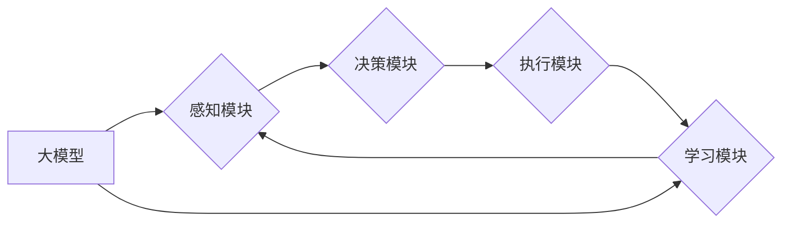

> 大模型、AI Agent、应用开发、四大要素、智能化、自动化、交互式

## 1. 背景介绍

近年来，大模型技术蓬勃发展，其强大的泛化能力和知识表示能力为人工智能领域带来了革命性的变革。大模型的应用场景日益广泛，从自然语言处理、图像识别到代码生成，无处不在。然而，单纯的模型训练并不能直接解决实际问题，我们需要将大模型与应用场景相结合，构建能够真正解决用户需求的智能化系统。

AI Agent（智能代理）作为一种能够感知环境、做出决策并与环境交互的智能体，成为了大模型应用的重要方向。AI Agent 可以理解为一个拥有自主学习和决策能力的软件程序，它可以根据预设的目标和环境信息，自主地执行任务、解决问题，并与用户进行交互。

## 2. 核心概念与联系

**2.1 AI Agent 的定义**

AI Agent 是一个能够感知环境、做出决策并与环境交互的智能体。它通常由以下几个核心要素组成：

* **感知模块:** 用于获取环境信息，例如传感器数据、文本、图像等。
* **决策模块:** 用于根据环境信息和目标，做出最优决策。
* **执行模块:** 用于执行决策，并与环境进行交互。
* **学习模块:** 用于根据经验不断学习和改进决策策略。

**2.2 AI Agent 与大模型的关系**

大模型可以为 AI Agent 提供强大的能力支持，例如：

* **知识表示:** 大模型可以学习和理解大量的文本数据，构建丰富的知识图谱，为 AI Agent 提供知识支持。
* **自然语言理解:** 大模型可以理解和处理自然语言，使 AI Agent 可以与用户进行自然流畅的对话。
* **决策推理:** 大模型可以进行复杂的逻辑推理和决策分析，帮助 AI Agent 做出更优的决策。

**2.3 AI Agent 的四大要素**

基于上述分析，我们可以将 AI Agent 的核心要素概括为四大要素：

* **感知:** 能够感知环境信息，例如传感器数据、文本、图像等。
* **决策:** 能够根据环境信息和目标，做出最优决策。
* **执行:** 能够执行决策，并与环境进行交互。
* **学习:** 能够根据经验不断学习和改进决策策略。

**2.4  Mermaid 流程图**



## 3. 核心算法原理 & 具体操作步骤

**3.1 算法原理概述**

AI Agent 的核心算法原理主要包括：

* **强化学习:** 通过与环境交互，学习最优的策略，以最大化奖励。
* **图神经网络:** 用于处理关系数据，例如知识图谱，帮助 AI Agent 理解复杂的关系和知识。
* **自然语言处理:** 用于理解和处理自然语言，使 AI Agent 可以与用户进行自然流畅的对话。

**3.2 算法步骤详解**

**3.2.1 强化学习**

1. **环境建模:** 建立一个模拟真实世界的环境模型。
2. **状态定义:** 定义环境中的状态，例如游戏中的棋盘状态、机器人的位置等。
3. **动作空间:** 定义 AI Agent 可以执行的动作，例如游戏中的棋步、机器人的运动方向等。
4. **奖励函数:** 定义一个奖励函数，用于评估 AI Agent 的行为是否符合目标。
5. **策略学习:** 使用强化学习算法，例如 Q 学习、SARSA 等，学习最优的策略，以最大化奖励。

**3.2.2 图神经网络**

1. **图构建:** 将知识表示为图结构，节点代表实体，边代表关系。
2. **特征提取:** 为每个节点和边提取特征，例如节点的属性、边的类型等。
3. **图卷积:** 使用图卷积网络，对图结构进行卷积操作，学习节点和边的表示。
4. **预测任务:** 根据学习到的节点和边表示，进行预测任务，例如知识问答、关系分类等。

**3.2.3 自然语言处理**

1. **文本预处理:** 对文本进行清洗、分词、词性标注等预处理操作。
2. **词向量表示:** 将单词映射到向量空间，例如 Word2Vec、GloVe 等。
3. **序列模型:** 使用序列模型，例如 RNN、Transformer 等，对文本序列进行建模。
4. **任务完成:** 根据学习到的文本表示，完成自然语言处理任务，例如文本分类、机器翻译等。

**3.3 算法优缺点**

* **强化学习:** 优点是能够学习最优策略，适应动态环境；缺点是训练过程复杂，需要大量的样本数据。
* **图神经网络:** 优点是能够处理关系数据，学习复杂知识；缺点是需要构建完整的图结构，对数据结构有要求。
* **自然语言处理:** 优点是能够理解和处理自然语言，与用户进行交互；缺点是需要大量的文本数据进行训练，对语言模型的复杂度要求高。

**3.4 算法应用领域**

* **强化学习:** 游戏 AI、机器人控制、自动驾驶等。
* **图神经网络:** 知识图谱构建、推荐系统、社交网络分析等。
* **自然语言处理:** 聊天机器人、文本摘要、机器翻译等。

## 4. 数学模型和公式 & 详细讲解 & 举例说明

**4.1 数学模型构建**

强化学习的数学模型主要包括状态空间、动作空间、奖励函数和价值函数。

* **状态空间:** 环境可能存在的全部状态集合。
* **动作空间:** AI Agent 在每个状态下可以执行的动作集合。
* **奖励函数:** 将状态和动作映射到奖励值，用于评估 AI Agent 的行为。
* **价值函数:** 将状态映射到期望的未来奖励总和，用于评估状态的好坏。

**4.2 公式推导过程**

**4.2.1 Q 学习算法**

Q 学习算法的目标是学习一个 Q 函数，该函数将状态-动作对映射到期望的未来奖励。

$$Q(s,a) = Q(s,a) + \alpha [r + \gamma \max_{a'} Q(s',a') - Q(s,a)]$$

其中：

* $Q(s,a)$ 是状态 $s$ 下执行动作 $a$ 的价值函数。
* $\alpha$ 是学习率，控制学习速度。
* $r$ 是从状态 $s$ 执行动作 $a$ 后获得的奖励。
* $\gamma$ 是折扣因子，控制未来奖励的权重。
* $s'$ 是执行动作 $a$ 后进入的状态。
* $a'$ 是在状态 $s'$ 下执行的动作。

**4.3 案例分析与讲解**

**4.3.1 贪婪策略**

贪婪策略是指在每个状态下选择价值函数最大的动作。

**4.3.2 探索-利用权衡**

在实际应用中，需要平衡探索新动作和利用已知好的动作。

**4.3.3 深度强化学习**

深度强化学习使用深度神经网络来学习价值函数和策略，能够解决更复杂的任务。

## 5. 项目实践：代码实例和详细解释说明

**5.1 开发环境搭建**

* Python 3.x
* TensorFlow 或 PyTorch
* OpenAI Gym

**5.2 源代码详细实现**

```python
import gym
import numpy as np

# 定义环境
env = gym.make('CartPole-v1')

# 定义学习率和折扣因子
alpha = 0.1
gamma = 0.99

# 定义 Q 函数
q_table = np.zeros((env.observation_space.n, env.action_space.n))

# 训练循环
for episode in range(1000):
    # 初始化状态
    state = env.reset()

    # 训练一个回合
    done = False
    while not done:
        # 选择动作
        action = np.argmax(q_table[state])

        # 执行动作
        next_state, reward, done, _ = env.step(action)

        # 更新 Q 函数
        q_table[state, action] = q_table[state, action] + alpha * (reward + gamma * np.max(q_table[next_state]) - q_table[state, action])

        # 更新状态
        state = next_state

    # 打印进度
    print(f"Episode {episode+1} done")

# 测试
state = env.reset()
while True:
    # 选择动作
    action = np.argmax(q_table[state])

    # 执行动作
    next_state, reward, done, _ = env.step(action)

    # 显示状态
    env.render()

    # 更新状态
    state = next_state

    # 如果回合结束，则退出循环
    if done:
        break

env.close()
```

**5.3 代码解读与分析**

* 该代码实现了一个简单的 Q 学习算法，用于训练一个 CartPole 问题中的 AI Agent。
* Q 函数是一个表格，用于存储每个状态-动作对的价值函数。
* 训练循环中，AI Agent 会根据 Q 函数选择动作，执行动作后更新 Q 函数。
* 测试循环中，AI Agent 会使用训练好的 Q 函数控制 CartPole，并显示游戏画面。

**5.4 运行结果展示**

运行该代码后，AI Agent 会逐渐学会控制 CartPole，使其保持平衡更长时间。

## 6. 实际应用场景

**6.1 智能客服**

AI Agent 可以作为智能客服，与用户进行自然语言对话，解答问题、提供服务。

**6.2 自动化办公**

AI Agent 可以自动化办公任务，例如邮件处理、日程安排、文档生成等。

**6.3 个性化推荐**

AI Agent 可以根据用户的行为和偏好，提供个性化的商品、内容或服务推荐。

**6.4 游戏 AI**

AI Agent 可以作为游戏中的对手或伙伴，提供更智能和有趣的游戏体验。

**6.5 未来应用展望**

AI Agent 的应用场景还在不断扩展，未来将应用于更多领域，例如医疗、教育、金融等。

## 7. 工具和资源推荐

**7.1 学习资源推荐**

* **书籍:**
    * 《Reinforcement Learning: An Introduction》
    * 《Deep Learning》
    * 《Natural Language Processing with Python》
* **在线课程:**
    * Coursera: Reinforcement Learning Specialization
    * Udacity: Deep Learning Nanodegree
    * fast.ai: Practical Deep Learning for Coders

**7.2 开发工具推荐**

* **TensorFlow:** 开源深度学习框架
* **PyTorch:** 开源深度学习框架
* **OpenAI Gym:** 强化学习环境库

**7.3 相关论文推荐**

* **Deep Reinforcement Learning with Double Q-Learning**
* **Attention Is All You Need**
* **BERT: Pre-training of Deep Bidirectional Transformers for Language Understanding**

## 8. 总结：未来发展趋势与挑战

**8.1 研究成果总结**

近年来，AI Agent 的研究取得了显著进展，例如：

* 强化学习算法取得了突破性进展，能够解决更复杂的任务。
* 图神经网络能够处理关系数据，学习更丰富的知识。
* 自然语言处理模型取得了巨大进步，能够理解和生成更自然流畅的文本。

**8.2 未来发展趋势**

* **更强大的模型:** 发展更强大的大模型，例如通用人工智能模型。
* **更有效的算法:** 开发更有效的强化学习算法，例如基于模型的强化学习。
* **更安全的系统:** 确保 AI Agent 的安全性、可靠性和可解释性。

**8.3 面临的挑战**

* **数据获取和标注:** 训练 AI Agent 需要大量的样本数据，获取和标注数据成本高。
* **算法复杂度:** 训练和部署大型 AI Agent 模型需要强大的计算