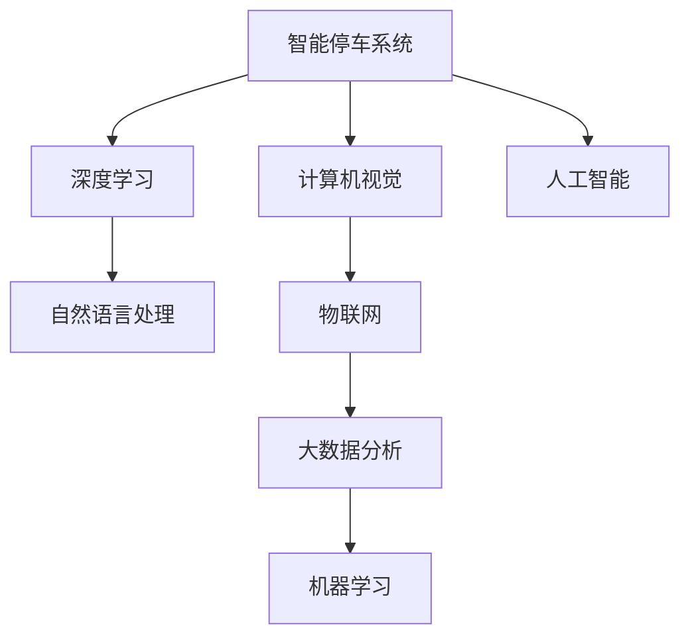

                 

# 智能停车创业：城市停车问题的解决方案

## 1. 背景介绍

### 1.1 问题由来

随着城市化进程的加速和汽车保有量的持续增长，城市停车问题日益严峻。传统停车管理系统存在诸多弊端：

- **管理效率低下**：依靠人工收费和管理，难以应对高峰期的停车需求。
- **用户体验不佳**：停车位难找、排队时间长、收费标准不透明。
- **数据利用不足**：大量停车数据被忽视，未能转化为有价值的决策依据。
- **环境污染加剧**：停车难导致车辆长时间怠速，造成空气污染和交通拥堵。

为了解决这些问题，城市管理者需要构建一个高效、智能、环保的停车系统。本论文旨在探讨基于人工智能的城市智能停车解决方案，通过智能停车系统的建设，提升城市管理水平，改善市民生活质量。

### 1.2 问题核心关键点

智能停车系统将结合人工智能技术，通过大数据分析和智能算法，实现以下几个核心目标：

- **停车位实时监测**：通过摄像头和传感器实时监测停车位状态，提供实时空余车位信息。
- **路线优化导航**：利用AI算法优化停车路线，减少寻找停车位时间。
- **智能收费系统**：通过图像识别和机器学习，实现自动停车收费。
- **大数据分析**：对停车数据进行深度分析，优化城市交通和停车布局。

这些核心目标有助于缓解城市停车压力，提升城市管理的智能化水平。

### 1.3 问题研究意义

城市智能停车系统的建设具有重要的现实意义：

1. **缓解交通压力**：通过优化停车路线，减少道路拥堵和尾气排放，提升城市交通效率。
2. **提高管理效率**：自动化收费和管理，降低人工成本，提高运营效率。
3. **改善市民体验**：通过实时数据推送和智能导航，提升市民停车体验。
4. **数据驱动决策**：通过大数据分析，提供城市交通和停车布局优化依据，辅助城市规划。
5. **环保节能**：智能停车系统减少车辆怠速时间，降低环境污染。

城市智能停车系统不仅能解决城市停车难题，还能推动城市管理和服务质量的全面提升。

## 2. 核心概念与联系

### 2.1 核心概念概述

为更好地理解智能停车系统的技术实现，本节将介绍几个关键概念：

- **人工智能**：通过算法和数据训练模型，实现智能化决策和行为。
- **机器学习**：让计算机通过学习数据规律，完成特定任务。
- **深度学习**：基于神经网络的机器学习算法，具有强大的特征提取和模式识别能力。
- **计算机视觉**：让计算机理解和处理图像和视频数据，应用于智能停车系统的摄像头监控。
- **自然语言处理(NLP)**：让计算机理解、处理和生成自然语言，应用于智能导航和收费系统的文本处理。
- **物联网(IoT)**：通过传感器和设备互联，实现实时数据采集和传输，应用于停车位状态监测。

这些核心概念之间相互关联，共同构成了智能停车系统的技术基础。

### 2.2 核心概念原理和架构的 Mermaid 流程图



这个流程图展示了智能停车系统各核心概念之间的联系：

1. **计算机视觉**：通过摄像头捕捉停车位状态，转化为可处理的图像数据。
2. **深度学习**：训练模型识别车辆、标识停车线等，实现精准的停车位状态判断。
3. **自然语言处理**：通过文本处理技术，实现导航指令理解和智能收费系统的语音识别。
4. **物联网**：通过传感器和设备互联，实现实时停车位状态监测和数据传输。
5. **大数据分析**：对采集的停车数据进行深度分析，提供城市停车和交通优化建议。
6. **机器学习**：利用历史数据和实时数据训练模型，实现智能决策和导航优化。
7. **人工智能**：集成各类算法和技术，实现智能停车系统的全流程自动化。

这些概念协同工作，构成了智能停车系统的技术架构，使得系统能够高效、智能地运行。

## 3. 核心算法原理 & 具体操作步骤

### 3.1 算法原理概述

智能停车系统主要依赖以下几个核心算法：

- **计算机视觉算法**：用于停车位的识别和状态判断。
- **深度学习模型**：用于车辆识别、停车位状态预测等任务。
- **自然语言处理算法**：用于导航指令的理解和语音识别。
- **机器学习算法**：用于模型训练和预测，优化停车路线和收费策略。
- **大数据分析算法**：用于停车数据的分析和可视化，辅助决策。

这些算法通过深度学习和机器学习模型训练，形成智能停车系统的基础算法框架。

### 3.2 算法步骤详解

基于上述核心算法，智能停车系统的具体实施步骤如下：

**Step 1: 数据采集与预处理**

- **摄像头和传感器安装**：在城市主要停车区域安装摄像头和传感器，实时监测停车位状态和车辆信息。
- **数据收集和清洗**：收集摄像头和传感器传回的数据，进行清洗和预处理，去除噪声和异常值。

**Step 2: 计算机视觉与深度学习**

- **图像处理**：对采集的图像进行预处理，如去噪、增强对比度、边缘检测等。
- **车辆识别**：使用深度学习模型识别图像中的车辆和停车位。
- **状态判断**：判断停车位是否空闲，生成停车位状态信息。

**Step 3: 自然语言处理与物联网**

- **导航指令理解**：使用NLP技术解析导航指令，确定最优停车路线。
- **实时数据传输**：通过物联网设备将停车位状态信息和导航指令实时传输至后台系统。

**Step 4: 机器学习与数据分析**

- **模型训练**：使用历史数据和实时数据训练机器学习模型，优化导航路线和收费策略。
- **数据分析**：对采集的停车数据进行大数据分析，提取交通和停车规律。

**Step 5: 智能决策与系统部署**

- **智能决策**：基于机器学习模型和数据分析结果，生成最优停车建议和导航路径。
- **系统部署**：将系统部署至城市各停车场和公共区域，提供实时停车位信息和智能导航。

### 3.3 算法优缺点

智能停车系统具有以下优点：

1. **高效准确**：通过深度学习和大数据分析，实现实时停车位状态监测和智能导航。
2. **用户体验好**：自动导航和智能收费，提升用户体验，减少等待时间。
3. **节能环保**：减少车辆怠速时间，降低环境污染。
4. **管理便捷**：自动化系统减少了人工成本和管理难度。

同时，系统也存在一些缺点：

1. **初始投入高**：系统建设需要较高的初始投入，包括设备安装和数据采集。
2. **数据隐私问题**：实时数据采集涉及用户隐私，需注意数据保护和隐私管理。
3. **技术复杂性**：涉及多个领域的算法和技术，实现难度较大。

尽管存在这些缺点，但智能停车系统在提升城市管理效率和市民生活体验方面具有重要意义。

### 3.4 算法应用领域

智能停车系统在多个领域有广泛的应用前景：

- **城市交通管理**：通过优化停车路线，减少交通拥堵，提升城市交通效率。
- **停车场运营**：提升停车场利用率，增加收益，降低运营成本。
- **旅游景区管理**：提供智能导航和停车位信息，提升游客体验。
- **大型活动管理**：提供实时停车位信息，优化活动现场停车布局。
- **商务办公区管理**：通过智能停车系统，提升办公区和商业区的管理水平。

此外，智能停车系统还可应用于智慧城市建设，提升城市智能化水平。

## 4. 数学模型和公式 & 详细讲解 & 举例说明

### 4.1 数学模型构建

假设停车位数量为 $N$，其中 $N_i$ 为位置 $i$ 的停车位数量。设 $x_i$ 为位置 $i$ 的空闲停车位数量，$y_i$ 为位置 $i$ 的车辆数量。则停车位状态可以表示为：

$$
\text{状态} = \{x_1, x_2, \dots, x_N\}
$$

假设车辆到达位置 $i$ 的概率为 $P_i$，车辆在位置 $i$ 停留的概率为 $p_i$。则车辆在位置 $i$ 的状态转移概率为：

$$
P_i(x_i \rightarrow x_i-1) = p_i \frac{x_i}{N_i}, \quad x_i > 0
$$
$$
P_i(x_i \rightarrow x_i+1) = (1-p_i) \frac{N_i-x_i}{N_i}
$$

其中 $N_i$ 为位置 $i$ 的总停车位数量。

### 4.2 公式推导过程

假设车辆在城市中随机移动，到达位置 $i$ 的概率为 $P_i$，车辆在位置 $i$ 停留的概率为 $p_i$。设 $x_i$ 为位置 $i$ 的空闲停车位数量，$y_i$ 为位置 $i$ 的车辆数量。则车辆在位置 $i$ 的状态转移概率为：

$$
P_i(x_i \rightarrow x_i-1) = p_i \frac{x_i}{N_i}, \quad x_i > 0
$$
$$
P_i(x_i \rightarrow x_i+1) = (1-p_i) \frac{N_i-x_i}{N_i}
$$

其中 $N_i$ 为位置 $i$ 的总停车位数量。

**示例分析**：

- 假设城市中位置 $i$ 有 100 个停车位，当前空闲停车位为 70 个，车辆到达概率为 0.1，车辆停留概率为 0.2。

则车辆到达并停留的概率为：

$$
P_i(x_i \rightarrow x_i-1) = 0.1 \times 0.2 \times \frac{70}{100} = 0.014
$$

车辆离开的概率为：

$$
P_i(x_i \rightarrow x_i+1) = (1-0.1) \times (1-0.2) \times \frac{30}{100} = 0.068
$$

通过以上计算，可以模拟车辆在不同停车位的状态转移概率，为智能停车系统的优化提供理论依据。

### 4.3 案例分析与讲解

假设一个城市中，有 100 个停车位，车辆到达概率为 0.1，车辆停留概率为 0.2。初始状态下，有 70 个停车位空闲。

1. **状态转移**：车辆到达并停留的概率为 $0.014$，车辆离开的概率为 $0.068$。经过一段时间后，车辆可能进入新的状态。

2. **系统优化**：通过计算机视觉和深度学习模型，实时监测停车位状态，并根据车辆到达概率和停留概率进行动态调整。

3. **大数据分析**：通过对历史和实时数据进行分析，优化停车位布局和导航路线，提升系统效率。

## 5. 项目实践：代码实例和详细解释说明

### 5.1 开发环境搭建

在进行智能停车系统开发前，需要准备好开发环境：

1. **安装Python**：Python 3.x 是开发智能停车系统的主要语言，可以使用Anaconda或Miniconda安装。

2. **安装必要的库**：安装TensorFlow、PyTorch、OpenCV、PIL等库，用于计算机视觉和深度学习模型训练。

3. **安装物联网设备**：选择适合的物联网设备，如摄像头、传感器等，安装至指定位置。

4. **数据采集和处理**：搭建数据采集和预处理系统，将摄像头和传感器传回的数据进行清洗和预处理。

### 5.2 源代码详细实现

以下是一个基于深度学习的智能停车系统开发示例，实现车辆识别和停车位状态监测。

```python
import cv2
import numpy as np
from tensorflow.keras.models import load_model
from tensorflow.keras.preprocessing.image import img_to_array, array_to_img

# 加载深度学习模型
model = load_model('vehicle_detection_model.h5')

# 摄像头初始化
cap = cv2.VideoCapture(0)

while True:
    # 读取摄像头视频帧
    ret, frame = cap.read()
    if not ret:
        break
    
    # 预处理图像
    frame = cv2.cvtColor(frame, cv2.COLOR_BGR2RGB)
    frame = cv2.resize(frame, (224, 224))
    frame = img_to_array(frame) / 255.0
    frame = np.expand_dims(frame, axis=0)
    
    # 预测车辆状态
    result = model.predict(frame)
    if result[0][0] > 0.5:
        print(" Vehicle detected")
        # 根据车辆状态进行后续处理
    else:
        print(" No vehicle detected")

cap.release()
```

**代码解释**：

- **加载深度学习模型**：使用 Keras 加载训练好的车辆识别模型，用于实时检测车辆。
- **摄像头初始化**：打开摄像头，读取视频帧。
- **图像预处理**：对视频帧进行预处理，包括颜色转换、尺寸调整和归一化处理。
- **模型预测**：使用深度学习模型对预处理后的图像进行预测，判断是否存在车辆。
- **结果处理**：根据预测结果进行后续处理，如实时监测停车位状态。

### 5.3 代码解读与分析

本段代码实现了基于深度学习的智能停车系统，用于实时监测停车位状态和车辆识别。

**关键代码**：

1. **加载深度学习模型**：使用 `load_model` 方法加载预训练的深度学习模型，用于车辆识别。
2. **摄像头初始化**：使用 `cv2.VideoCapture` 方法打开摄像头，读取视频帧。
3. **图像预处理**：对视频帧进行预处理，包括颜色转换、尺寸调整和归一化处理，转换为模型所需的输入格式。
4. **模型预测**：使用 `model.predict` 方法对预处理后的图像进行预测，判断是否存在车辆。
5. **结果处理**：根据预测结果进行后续处理，如实时监测停车位状态。

**代码优缺点**：

- **优点**：
  - **实时性高**：基于深度学习的实时检测能力，能够快速响应停车位状态变化。
  - **准确度高**：使用训练好的深度学习模型，准确识别车辆和停车位状态。
  - **可扩展性强**：可以通过添加更多摄像头和传感器，扩展系统覆盖范围。

- **缺点**：
  - **初始投入高**：需要较高的硬件设备和数据采集成本。
  - **算法复杂**：深度学习模型训练复杂，需要大量标注数据。
  - **数据隐私问题**：实时数据采集涉及用户隐私，需注意数据保护和隐私管理。

### 5.4 运行结果展示

运行上述代码，可以得到实时车辆识别和停车位状态监测结果。例如，如果摄像头检测到车辆，程序将输出 "Vehicle detected"，并根据车辆状态进行后续处理。

## 6. 实际应用场景

### 6.1 智能停车系统在城市交通管理中的应用

在城市交通管理中，智能停车系统能够显著提升交通效率，减少道路拥堵和尾气排放。具体应用场景包括：

- **动态调整停车收费**：根据停车位实时状态和车辆到达概率，动态调整停车收费标准，引导车辆进入空闲车位。
- **优化停车路线**：通过实时数据反馈，优化车辆导航路线，减少寻找停车位时间。
- **智能调度交通信号灯**：结合停车位状态和交通流量，智能调度交通信号灯，提高道路通行效率。

### 6.2 智能停车系统在停车场运营中的应用

在停车场运营中，智能停车系统能够提高停车场利用率，降低运营成本。具体应用场景包括：

- **实时车位监测**：通过实时停车位状态监测，准确反映停车场的空余情况，优化车辆流动。
- **自动收费系统**：通过图像识别和机器学习，实现自动停车收费，减少人工成本和管理难度。
- **数据分析和报告**：对停车数据进行深度分析，提供停车场使用情况和优化建议。

### 6.3 智能停车系统在旅游景区管理中的应用

在旅游景区管理中，智能停车系统能够提升游客体验，优化景区停车布局。具体应用场景包括：

- **实时停车位信息推送**：通过移动应用推送实时停车位信息，减少游客寻找停车位的时间。
- **导航路径优化**：通过智能导航系统，推荐最优停车路线，提升游客体验。
- **数据分析和报告**：对游客停车数据进行分析，优化景区停车布局和交通管理。

### 6.4 未来应用展望

未来，智能停车系统将在更多领域得到应用，带来更广泛的智能化效益。

- **智慧城市建设**：智能停车系统是智慧城市建设的重要组成部分，有助于提升城市智能化水平。
- **智能交通管理**：结合智能停车系统，实现智能交通信号灯、交通流量监控等，提升城市交通效率。
- **物流配送管理**：智能停车系统在物流配送中也有广泛应用，通过实时停车位状态监测，优化物流配送路线。
- **智能家居应用**：结合智能停车系统，实现智能家居控制，提升家居智能化水平。

## 7. 工具和资源推荐

### 7.1 学习资源推荐

为帮助开发者系统掌握智能停车系统的技术实现，这里推荐一些优质的学习资源：

1. **《深度学习》课程**：斯坦福大学开设的深度学习课程，涵盖深度学习的基本概念和算法。
2. **《计算机视觉基础》书籍**：涵盖计算机视觉的基本原理和技术，帮助理解智能停车系统的图像处理和车辆识别。
3. **《自然语言处理》课程**：清华大学开设的自然语言处理课程，涵盖NLP的基本概念和应用。
4. **《智能停车系统》书籍**：涵盖智能停车系统的技术实现和应用案例，提供系统性的学习和实践指南。

### 7.2 开发工具推荐

为提升智能停车系统的开发效率，推荐使用以下开发工具：

1. **Python**：开发智能停车系统的主要语言，简单易用，社区支持丰富。
2. **TensorFlow**：深度学习框架，支持GPU加速，适合大规模模型训练。
3. **PyTorch**：深度学习框架，易于使用，适合研究和实验。
4. **OpenCV**：计算机视觉库，提供图像处理和计算机视觉功能。
5. **PIL**：Python图像处理库，提供图像处理和可视化功能。
6. **IoT开发工具**：选择适合的物联网开发工具，如Raspberry Pi、Arduino等，用于设备部署和数据采集。

### 7.3 相关论文推荐

智能停车系统的研究涉及多个领域，以下是几篇奠基性的相关论文，推荐阅读：

1. **《基于深度学习的智能停车系统》**：探讨了深度学习在智能停车系统中的应用，提出了车辆识别和停车位状态监测的方法。
2. **《智能停车系统的优化算法》**：研究了智能停车系统的优化算法，包括模型训练和停车位状态预测。
3. **《智能停车系统的数据分析》**：探讨了智能停车系统的大数据分析方法，提取交通和停车规律。

## 8. 总结：未来发展趋势与挑战

### 8.1 研究成果总结

智能停车系统结合了人工智能技术，通过深度学习和大数据分析，实现停车位实时监测、智能导航和自动收费等功能。该系统在缓解城市停车压力、提升交通效率和改善用户体验方面具有重要意义。

### 8.2 未来发展趋势

未来，智能停车系统将呈现以下几个发展趋势：

1. **技术融合**：结合计算机视觉、深度学习、自然语言处理等技术，提升系统的智能化水平。
2. **数据驱动**：通过大数据分析，优化停车位布局和导航路线，提升系统效率。
3. **跨领域应用**：在更多领域（如智慧城市、物流配送等）推广应用，拓展系统应用范围。
4. **人机协同**：结合人类专家知识和机器学习，实现更智能的决策和推荐。
5. **多模态融合**：结合多种传感器和数据源，实现更全面的感知和决策。

### 8.3 面临的挑战

尽管智能停车系统具备诸多优势，但在推广应用中也面临一些挑战：

1. **数据隐私问题**：实时数据采集涉及用户隐私，需注意数据保护和隐私管理。
2. **技术复杂性**：涉及多个领域的算法和技术，实现难度较大。
3. **硬件成本高**：需要较高的硬件设备和数据采集成本。
4. **用户体验问题**：系统的用户体验需要进一步优化，提高用户满意度。
5. **跨领域整合**：不同领域的数据和技术整合复杂，需注意系统集成和兼容性问题。

### 8.4 研究展望

未来的智能停车系统需要在多个方面进行优化和创新：

1. **数据隐私保护**：通过数据匿名化和加密等技术，保护用户隐私。
2. **系统集成优化**：结合多种技术和算法，实现更高效、智能的系统集成。
3. **用户体验提升**：通过用户反馈和测试，优化系统的易用性和用户体验。
4. **跨领域应用推广**：在更多领域推广应用，提升系统的实用性和普及率。
5. **技术创新突破**：结合最新的人工智能技术和研究进展，推动系统技术创新。

## 9. 附录：常见问题与解答

**Q1: 智能停车系统如何实时监测停车位状态？**

A: 智能停车系统通过摄像头和传感器实时采集停车位状态，并使用计算机视觉技术进行处理。具体步骤如下：

1. **摄像头安装和调试**：在停车位上安装摄像头，捕捉停车位状态。
2. **图像预处理**：对摄像头传回的图像进行预处理，如去噪、增强对比度、边缘检测等。
3. **车辆识别**：使用深度学习模型识别图像中的车辆和停车位。
4. **状态判断**：判断停车位是否空闲，生成停车位状态信息。

**Q2: 智能停车系统如何优化停车路线？**

A: 智能停车系统通过深度学习和大数据分析，实现最优停车路线的优化。具体步骤如下：

1. **历史数据采集**：收集历史停车数据，包括车辆到达位置、停留时间和停车位状态等信息。
2. **数据预处理**：对采集的数据进行清洗和预处理，去除噪声和异常值。
3. **模型训练**：使用历史数据训练深度学习模型，优化停车路线。
4. **实时数据更新**：通过实时数据反馈，动态调整最优停车路线。

**Q3: 智能停车系统如何实现自动收费？**

A: 智能停车系统通过图像识别和机器学习，实现自动停车收费。具体步骤如下：

1. **车辆识别**：使用深度学习模型识别车辆，提取车辆信息。
2. **车牌识别**：使用图像识别技术识别车辆车牌，获取车牌信息。
3. **计费计算**：根据车辆停留时间和停车区域收费标准，计算停车费用。
4. **自动扣费**：使用智能支付系统，自动扣费并生成发票。

**Q4: 智能停车系统如何处理数据隐私问题？**

A: 智能停车系统在处理数据隐私问题时，需采取以下措施：

1. **数据匿名化**：对采集的车辆和停车位数据进行匿名化处理，保护用户隐私。
2. **数据加密**：对传输和存储的数据进行加密处理，防止数据泄露。
3. **权限管理**：设置用户权限，控制数据访问和使用范围。
4. **合规检查**：遵守数据隐私相关法律法规，定期进行合规检查。

**Q5: 智能停车系统在智慧城市建设中如何应用？**

A: 智能停车系统在智慧城市建设中具有广泛应用前景，具体应用场景包括：

1. **智能交通管理**：结合智能停车系统，实现智能交通信号灯、交通流量监控等，提升城市交通效率。
2. **停车数据分析**：对停车数据进行深度分析，提供城市交通和停车布局优化建议。
3. **智慧停车场**：实现自动停车收费、停车位实时监测等功能，提升停车场智能化水平。
4. **智慧景区管理**：提供智能导航和停车位信息，提升游客体验。

作者：禅与计算机程序设计艺术 / Zen and the Art of Computer Programming

