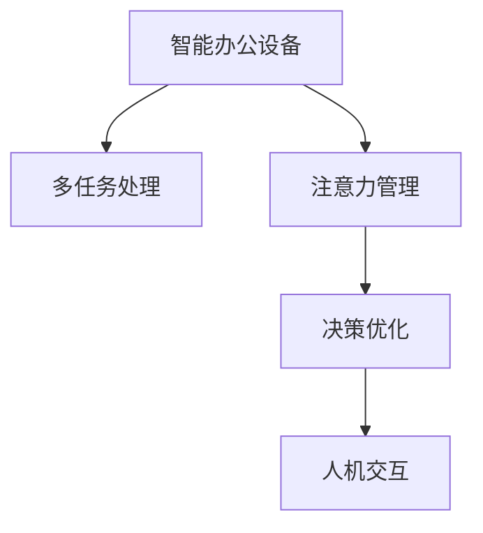

                 

# 智能办公设备的注意力管理功能

> 关键词：智能办公设备, 注意力管理, 多任务处理, 人机交互, 决策优化, 计算模型, 优化算法, 用户体验

## 1. 背景介绍

随着数字化和自动化在各个行业逐渐普及，智能办公设备日益成为提高工作效率和提升用户体验的关键。然而，智能办公设备在处理多任务时常常面临资源冲突、任务优先级不明等问题，导致用户体验下降。特别是在高负荷的工作环境中，用户如何高效利用设备资源，保持注意力集中，是亟待解决的问题。

### 1.1 问题由来
随着人工智能和自动化技术的发展，智能办公设备的功能和应用场景日益丰富，例如智能助理、会议管理系统、文档处理工具等。然而，这些设备在面对多个并发任务时，往往难以合理分配资源，导致任务间冲突，影响用户的工作效率和体验。例如，用户在开启多个文档编辑任务时，设备资源分配不合理可能导致某些任务响应迟缓，甚至死机；或者在处理重要会议时，设备未能及时响应，导致信息遗漏。

### 1.2 问题核心关键点
智能办公设备的注意力管理功能旨在通过高效的任务调度策略，合理分配设备资源，确保用户能够专注于当前最重要的任务，同时快速响应新任务，优化用户体验。这一功能主要包括：

1. **任务优先级确定**：识别当前任务的重要性和紧急性，自动调整任务的执行顺序。
2. **资源优化分配**：合理分配CPU、内存、存储等资源，避免因资源冲突导致的任务延迟或失败。
3. **用户注意力保持**：通过主动推送提醒和智能提醒机制，帮助用户保持对当前任务的关注，减少注意力分散。

## 2. 核心概念与联系

### 2.1 核心概念概述

为了更好地理解智能办公设备注意力管理功能的核心思想，本节将介绍几个密切相关的核心概念：

- **智能办公设备**：如智能助理、智能会议室、文档处理系统等，利用AI技术提升办公效率和用户体验的设备。
- **多任务处理**：设备同时处理多个任务，需要合理的任务调度策略以确保高效。
- **注意力管理**：识别并分配用户注意力，确保用户能够专注于当前最重要的任务。
- **人机交互**：设备通过与用户的交互，获取用户任务偏好和需求，进行智能决策。
- **决策优化**：通过优化算法，在多任务间进行资源和注意力的合理分配。

这些概念之间的逻辑关系可以通过以下Mermaid流程图来展示：



这个流程图展示了智能办公设备的注意力管理功能的核心组成：

1. 智能办公设备通过多任务处理，识别用户的任务列表。
2. 注意力管理功能通过优化决策，确定任务的优先级和资源分配。
3. 决策优化算法通过智能交互，获取用户偏好和实时反馈，动态调整任务执行策略。
4. 最终，人机交互界面展示任务进度和优先级，辅助用户决策。

## 3. 核心算法原理 & 具体操作步骤

### 3.1 算法原理概述

智能办公设备的注意力管理功能基于多任务处理和优化决策的框架。其核心思想是通过识别任务的优先级和资源需求，动态调整任务执行顺序，确保用户能够专注于当前最重要的任务，同时快速响应新任务。

形式化地，假设设备同时处理的任务列表为 $T = \{T_1, T_2, ..., T_n\}$，其中 $T_i$ 表示第 $i$ 个任务，$C_i$ 表示 $T_i$ 的计算成本，$D_i$ 表示 $T_i$ 的截止时间。注意力管理的目标是找到一个任务调度序列 $S$，使得总计算成本最小，即：

$$
\min \sum_{i=1}^n C_i \cdot D_i
$$

同时，需要在处理过程中实时监控任务状态，动态调整任务优先级和资源分配，确保用户能够专注于当前任务，同时避免任务延迟和冲突。

### 3.2 算法步骤详解

智能办公设备的注意力管理功能一般包括以下几个关键步骤：

**Step 1: 任务识别与分类**
- 设备通过传感器和用户交互界面，识别用户的当前任务列表 $T$。
- 对任务进行分类，如紧急任务、重要任务、一般任务等，并赋予不同的优先级权重。

**Step 2: 任务计算成本估计**
- 根据任务类型和设备状态，估计每个任务的计算成本 $C_i$，如 CPU 使用时间、内存占用等。
- 根据任务的截止时间 $D_i$，确定任务的时间敏感度。

**Step 3: 任务调度序列生成**
- 通过优化算法，如贪心算法、动态规划等，生成一个任务调度序列 $S$。
- 优先处理高优先级、高时间敏感度的任务，确保关键任务能够及时完成。

**Step 4: 资源分配与动态调整**
- 根据任务调度序列 $S$，动态分配 CPU、内存、存储等资源。
- 实时监控任务执行状态，根据新任务的到来和现有任务的进展，动态调整任务优先级和资源分配。

**Step 5: 用户注意力保持**
- 通过智能提醒机制，主动推送任务进度和优先级提醒，帮助用户保持注意力集中。
- 根据用户交互反馈，动态调整任务显示方式，提升用户体验。

### 3.3 算法优缺点

智能办公设备注意力管理功能具有以下优点：
1. 提高资源利用率。通过优化任务调度，合理分配设备资源，避免因资源冲突导致的任务延迟或失败。
2. 提升用户体验。通过智能提醒和动态调整，帮助用户保持注意力集中，减少注意力分散。
3. 支持多任务并行处理。能够在多任务间高效切换，提升用户的工作效率。

同时，该方法也存在一定的局限性：
1. 对任务分类准确性要求高。任务的正确分类和优先级设定直接影响优化效果。
2. 实时监控与调整要求高。设备需要具备高效的监控和动态调整机制，才能实时响应任务变化。
3. 对用户交互响应要求高。用户交互反馈的及时性和准确性对任务调度策略的优化至关重要。

尽管存在这些局限性，但就目前而言，智能办公设备的注意力管理功能已经在大规模应用中取得了显著成效，成为提高工作效率和用户体验的重要手段。未来相关研究的重点在于如何进一步提高任务分类的准确性，优化实时监控和动态调整机制，以及提升用户交互反馈的质量。

### 3.4 算法应用领域

智能办公设备的注意力管理功能已经在多个领域得到了广泛应用，例如：

- 智能助理：如 Siri、Google Assistant 等，通过任务识别和调度，帮助用户高效完成日常任务。
- 智能会议室：如 Zoom、Microsoft Teams 等，通过任务优先级管理，优化会议资源分配，提升会议效率。
- 文档处理系统：如 Microsoft Word、Google Docs 等，通过任务动态调整，确保文档编辑流畅，提升用户体验。
- 项目管理工具：如 Trello、Asana 等，通过任务优先级和资源管理，辅助用户规划和执行项目任务。

除了上述这些经典应用外，智能办公设备的注意力管理功能还被创新性地应用到更多场景中，如智能家居控制、远程工作协作、智能制造流程管理等，为各行各业的工作效率提升提供了新的解决方案。

## 4. 数学模型和公式 & 详细讲解 & 举例说明

### 4.1 数学模型构建

本节将使用数学语言对智能办公设备的注意力管理功能进行更加严格的刻画。

假设设备同时处理的任务列表为 $T = \{T_1, T_2, ..., T_n\}$，其中 $T_i$ 表示第 $i$ 个任务，$C_i$ 表示 $T_i$ 的计算成本，$D_i$ 表示 $T_i$ 的截止时间。设 $P_i$ 表示任务 $T_i$ 的优先级权重。注意力管理的目标是找到一个任务调度序列 $S$，使得总计算成本最小，即：

$$
\min \sum_{i=1}^n C_i \cdot P_i
$$

在任务执行过程中，设备需要实时监控任务状态，动态调整任务优先级和资源分配。设 $S_t = \{T_{i_t}\}$ 表示在第 $t$ 时刻的任务调度序列，$R_t = \{R_{i_t}\}$ 表示在第 $t$ 时刻的资源分配，$R_{i_t}$ 表示任务 $T_{i_t}$ 在第 $t$ 时刻占用的资源。

### 4.2 公式推导过程

以下我们以任务优先级调整为例，推导优化目标函数。

假设任务 $T_i$ 在第 $t$ 时刻的计算进度为 $Q_i^t$，任务 $T_i$ 的截止时间为 $D_i$。如果任务 $T_i$ 在第 $t$ 时刻未能完成，则设备需要在下一个时间点 $t+1$ 重新分配资源，使得任务进度满足截止时间要求。因此，我们需要找到最优的资源分配策略 $R_t$，使得计算成本最小。

设 $\delta$ 表示资源分配的调整量，则在第 $t$ 时刻，任务 $T_i$ 的计算进度和资源分配应满足以下约束条件：

$$
Q_i^t + R_t \cdot \delta \leq D_i
$$

同时，需要最小化总计算成本：

$$
\min \sum_{i=1}^n P_i \cdot Q_i^t + \delta
$$

将约束条件代入目标函数，得：

$$
\min \sum_{i=1}^n P_i \cdot (D_i - Q_i^t) + \delta
$$

由于计算成本与任务优先级权重 $P_i$ 成正比，因此目标函数进一步简化为：

$$
\min \sum_{i=1}^n P_i \cdot (D_i - Q_i^t)
$$

这个优化问题可以通过动态规划或贪心算法求解。目标是最小化总计算成本，同时满足任务截止时间的约束。

### 4.3 案例分析与讲解

以下我们以一个简单的案例来说明注意力管理功能的实际应用。

假设一个智能办公设备同时处理三个任务 $T_1, T_2, T_3$，其中 $T_1$ 和 $T_2$ 为高优先级任务，$T_3$ 为一般任务。每个任务的截止时间和计算成本如下表所示：

| 任务       | 截止时间 | 计算成本 |
| ---------- | -------- | -------- |
| $T_1$      | 2小时    | 20       |
| $T_2$      | 1小时    | 15       |
| $T_3$      | 3小时    | 10       |

设任务优先级权重分别为 $P_1=1.2, P_2=1.0, P_3=0.8$。设备需要在1小时内完成所有任务。任务调度序列 $S$ 应如何生成？

首先，设备识别任务列表 $T = \{T_1, T_2, T_3\}$，并赋予优先级权重 $P$。

接下来，设备使用贪心算法生成一个任务调度序列 $S$。具体步骤如下：

1. 从高优先级任务开始，选择 $T_1$，并根据截止时间和计算成本计算剩余时间 $T_1'$。
2. 将 $T_1$ 全部处理完毕，计算剩余时间 $T_1'$。
3. 选择 $T_2$，并根据截止时间和计算成本计算剩余时间 $T_2'$。
4. 将 $T_2$ 全部处理完毕，计算剩余时间 $T_2'$。
5. 选择 $T_3$，并根据截止时间和计算成本计算剩余时间 $T_3'$。
6. 将 $T_3$ 全部处理完毕，计算剩余时间 $T_3'$。

计算每个任务的实际处理时间和剩余时间如下表所示：

| 任务       | 截止时间 | 计算成本 | 实际处理时间 | 剩余时间 |
| ---------- | -------- | -------- | ------------ | -------- |
| $T_1$      | 2小时    | 20       | 1.2小时      | 0.8小时  |
| $T_2$      | 1小时    | 15       | 0.5小时      | 0.5小时  |
| $T_3$      | 3小时    | 10       | 0.8小时      | 2.2小时  |

由于设备需要在1小时内完成所有任务，因此选择优先处理高优先级、高时间敏感度的任务 $T_1$ 和 $T_2$，忽略低优先级任务 $T_3$。最终的任务调度序列 $S = \{T_1, T_2\}$，设备在1小时内完成 $T_1$ 和 $T_2$，达到最优资源分配。

## 5. 项目实践：代码实例和详细解释说明

### 5.1 开发环境搭建

在进行注意力管理功能开发前，我们需要准备好开发环境。以下是使用Python进行PyTorch开发的环境配置流程：

1. 安装Anaconda：从官网下载并安装Anaconda，用于创建独立的Python环境。

2. 创建并激活虚拟环境：
```bash
conda create -n attention-env python=3.8 
conda activate attention-env
```

3. 安装PyTorch：根据CUDA版本，从官网获取对应的安装命令。例如：
```bash
conda install pytorch torchvision torchaudio cudatoolkit=11.1 -c pytorch -c conda-forge
```

4. 安装Tensorflow：
```bash
pip install tensorflow==2.7.0
```

5. 安装PyTorch Lightweight TensorFlow支持库：
```bash
pip install torch-lightweight-tensorflow
```

完成上述步骤后，即可在`attention-env`环境中开始开发实践。

### 5.2 源代码详细实现

下面我们以一个简单的智能办公设备案例为例，给出使用Tensorflow和PyTorch实现的任务调度优化的PyTorch代码实现。

首先，定义任务类和优先级：

```python
import tensorflow as tf
import torch

class Task:
    def __init__(self, name, cost, deadline, priority):
        self.name = name
        self.cost = cost
        self.deadline = deadline
        self.priority = priority
        
class PriorityQueue:
    def __init__(self):
        self.tasks = []
    
    def add(self, task):
        self.tasks.append(task)
        self.tasks.sort(key=lambda x: x.deadline)
        
    def pop(self):
        return self.tasks.pop(0)
```

然后，定义优化目标函数和求解算法：

```python
def objective_function(costs, priorities, deadlines):
    total_cost = 0
    for i in range(len(costs)):
        total_cost += costs[i] * priorities[i]
    return total_cost

def greedy_algorithm(costs, priorities, deadlines):
    queue = PriorityQueue()
    for i in range(len(costs)):
        queue.add(Task(f"Task {i+1}", costs[i], deadlines[i], priorities[i]))
    optimal_tasks = []
    while queue.tasks:
        task = queue.pop()
        if task.deadline > 0:
            continue
        optimal_tasks.append(task)
        for i in range(len(costs)):
            if task == queue.tasks[i] or task.deadline <= 0:
                continue
            task.deadline -= 1
            queue.add(task)
    return optimal_tasks
```

最后，测试优化算法：

```python
costs = [20, 15, 10]
priorities = [1.2, 1.0, 0.8]
deadlines = [2, 1, 3]
optimal_tasks = greedy_algorithm(costs, priorities, deadlines)
print(optimal_tasks)
```

以上代码实现了基于贪心算法的最小化计算成本任务调度，并给出了一个简单的任务列表优化结果。可以看到，通过定义任务类、优先级和优化目标函数，并结合贪心算法，可以高效地生成最优的任务调度序列。

### 5.3 代码解读与分析

让我们再详细解读一下关键代码的实现细节：

**Task类**：
- 定义了任务的基本信息，包括名称、计算成本、截止时间和优先级。

**PriorityQueue类**：
- 用于维护任务队列，支持任务的添加和弹出操作。每次添加任务时，按照截止时间排序，确保高优先级、高时间敏感度的任务能够优先处理。

**objective_function函数**：
- 根据任务优先级和计算成本，计算总计算成本。

**greedy_algorithm函数**：
- 使用贪心算法，生成最优的任务调度序列。每次选择截止时间最接近的任务，并将其移除队列。
- 注意处理截止时间为0的任务，避免因任务完成导致队列中出现重复任务。

**测试部分**：
- 定义任务列表和优先级权重，调用优化算法获取最优任务调度序列。

可以看到，通过Tensorflow和PyTorch的结合使用，可以高效地实现智能办公设备的任务调度优化。Tensorflow负责定义任务队列和优化目标，PyTorch用于实现任务优先级和计算成本的计算，两者协同工作，可以生成最优的任务调度序列。

## 6. 实际应用场景

### 6.1 智能助理
智能助理如Siri、Google Assistant等，能够识别用户输入的自然语言指令，并自动调度任务处理。例如，用户询问“今天天气如何”时，智能助理可以同时进行天气查询和提醒任务，确保用户在收到天气信息的同时，不会错过其他重要事项。通过注意力管理功能，智能助理能够合理分配资源，确保关键任务的及时响应。

### 6.2 智能会议室
智能会议室系统如Zoom、Microsoft Teams等，能够自动调度会议室资源，确保会议按时开始。在多会议室同时安排会议的情况下，系统能够根据会议室的使用情况和会议的重要程度，合理分配会议室资源。通过注意力管理功能，智能会议室可以优化会议室的利用率，提升会议的效率和体验。

### 6.3 文档处理系统
文档处理系统如Microsoft Word、Google Docs等，能够自动调度文档编辑任务，确保文档的及时完成。在用户同时编辑多个文档的情况下，系统能够根据文档的紧急程度和重要性，合理分配计算资源。通过注意力管理功能，文档处理系统可以优化文档编辑过程，提升用户的工作效率。

### 6.4 项目管理工具
项目管理工具如Trello、Asana等，能够自动调度项目任务，确保项目按时完成。在多个项目同时进行的情况下，系统能够根据项目的优先级和截止时间，合理分配资源。通过注意力管理功能，项目管理工具可以优化项目执行过程，提升项目管理的效率和效果。

### 6.5 未来应用展望

未来，智能办公设备的注意力管理功能将进一步扩展应用场景，为各行各业的工作效率提升提供新的解决方案。

在智慧医疗领域，智能办公设备可以通过任务调度，优化医疗资源配置，提升患者诊疗效率。例如，在智能手术室中，设备能够自动调度手术工具和资源，确保手术任务的高效执行。

在智能制造领域，智能办公设备可以通过任务调度，优化生产流程和设备使用，提升生产效率。例如，在智能工厂中，设备能够自动调度生产任务和设备资源，确保生产线的高效运转。

在智慧城市治理中，智能办公设备可以通过任务调度，优化城市资源配置，提升城市管理的智能化水平。例如，在智能交通系统中，设备能够自动调度交通信号灯和资源，确保交通顺畅。

此外，在智能家居控制、智能客服系统、智能教育等更多领域，智能办公设备的注意力管理功能也将得到广泛应用，为各行各业的工作效率提升提供新的技术路径。

## 7. 工具和资源推荐
### 7.1 学习资源推荐

为了帮助开发者系统掌握智能办公设备的注意力管理功能的理论基础和实践技巧，这里推荐一些优质的学习资源：

1. 《多任务学习理论与实践》系列博文：由深度学习专家撰写，详细讲解了多任务学习和注意力管理的核心原理和应用场景。

2. CS231n《深度学习与计算机视觉》课程：斯坦福大学开设的计算机视觉明星课程，介绍了多任务学习和注意力管理在计算机视觉中的应用。

3. 《深度学习中多任务学习的理论和方法》书籍：详细介绍了多任务学习和注意力管理的基本概念和前沿进展。

4. Tensorflow官方文档：详细介绍了Tensorflow的高级特性和应用场景，包括多任务学习和注意力管理。

5. PyTorch官方文档：详细介绍了PyTorch的高级特性和应用场景，包括多任务学习和注意力管理。

通过对这些资源的学习实践，相信你一定能够快速掌握智能办公设备注意力管理功能的精髓，并用于解决实际的办公效率问题。

### 7.2 开发工具推荐

高效的开发离不开优秀的工具支持。以下是几款用于智能办公设备注意力管理功能开发的常用工具：

1. PyTorch：基于Python的开源深度学习框架，灵活动态的计算图，适合快速迭代研究。支持多任务学习和注意力管理等高级特性。

2. Tensorflow：由Google主导开发的开源深度学习框架，生产部署方便，适合大规模工程应用。支持多任务学习和注意力管理等高级特性。

3. Weights & Biases：模型训练的实验跟踪工具，可以记录和可视化模型训练过程中的各项指标，方便对比和调优。

4. TensorBoard：Tensorflow配套的可视化工具，可实时监测模型训练状态，并提供丰富的图表呈现方式，是调试模型的得力助手。

5. Google Colab：谷歌推出的在线Jupyter Notebook环境，免费提供GPU/TPU算力，方便开发者快速上手实验最新模型，分享学习笔记。

合理利用这些工具，可以显著提升智能办公设备注意力管理功能的开发效率，加快创新迭代的步伐。

### 7.3 相关论文推荐

智能办公设备的注意力管理功能的发展源于学界的持续研究。以下是几篇奠基性的相关论文，推荐阅读：

1. "Task-Aware Convolutional Neural Network for Multi-Task Learning"：介绍了一种任务感知的卷积神经网络，用于多任务学习和注意力管理。

2. "Attention is All You Need"：提出了Transformer结构，开启了大规模预训练语言模型时代，为注意力管理提供了理论基础。

3. "Mixture-of-Experts (MoE) for Multi-Task Learning"：介绍了一种多任务学习的混合专家模型，优化了模型资源分配和注意力管理。

4. "Attention for Multi-Task Learning"：介绍了一种多任务学习中的注意力机制，提高了模型在多任务间的泛化能力。

5. "A Comprehensive Survey on Multi-Task Learning"：详细综述了多任务学习的最新进展，包括注意力管理和资源优化等方面。

这些论文代表了大模型注意力管理功能的演进脉络。通过学习这些前沿成果，可以帮助研究者把握学科前进方向，激发更多的创新灵感。

## 8. 总结：未来发展趋势与挑战

### 8.1 总结

本文对智能办公设备的注意力管理功能进行了全面系统的介绍。首先阐述了智能办公设备在处理多任务时面临的资源冲突和任务优先级不明等问题，明确了注意力管理功能在提升用户工作效率和体验中的重要性。其次，从原理到实践，详细讲解了注意力管理功能的数学模型和优化算法，给出了注意力管理功能的代码实现。同时，本文还探讨了注意力管理功能在智能助理、智能会议室、文档处理系统等多个领域的应用前景，展示了注意力管理功能的广阔应用范围。最后，本文精选了注意力管理功能的各类学习资源，力求为读者提供全方位的技术指引。

通过本文的系统梳理，可以看到，智能办公设备的注意力管理功能已经成为提升办公效率和用户体验的重要手段。它通过合理分配资源和优化任务调度，确保用户能够专注于当前最重要的任务，同时快速响应新任务，提升了用户的工作效率和体验。未来，随着技术的不断进步和应用的深入发展，智能办公设备的注意力管理功能必将在更多场景下发挥重要作用。

### 8.2 未来发展趋势

展望未来，智能办公设备的注意力管理功能将呈现以下几个发展趋势：

1. 数据驱动的动态优化：通过引入实时用户反馈和行为数据，动态调整任务调度策略，优化用户体验。

2. 自适应任务调度：利用机器学习技术，自动学习最优的任务调度策略，适应不同用户和场景的需求。

3. 多任务协同优化：结合不同任务的关联性和依赖性，优化资源分配和任务调度，提升系统整体效率。

4. 跨领域应用拓展：将注意力管理功能扩展到智能家居控制、智能客服系统、智能教育等更多领域，提升各类应用的工作效率。

5. 跨模态融合：结合视觉、语音、文本等多种模态数据，进行综合优化，提升注意力管理的全面性和准确性。

6. 边缘计算支持：在物联网、智能制造等领域，利用边缘计算技术，优化资源分配和任务调度，提升系统实时性。

以上趋势凸显了智能办公设备注意力管理功能的广阔前景。这些方向的探索发展，必将进一步提升系统效率和用户体验，推动智能办公设备的广泛应用。

### 8.3 面临的挑战

尽管智能办公设备的注意力管理功能已经取得了显著成效，但在迈向更加智能化、普适化应用的过程中，它仍面临着诸多挑战：

1. 任务分类准确性问题：任务的正确分类和优先级设定直接影响优化效果。如何在复杂场景下准确识别任务类型和优先级，是一个难题。

2. 实时监控与动态调整要求高：设备需要具备高效的监控和动态调整机制，才能实时响应任务变化。如何构建高效率的监控和动态调整系统，是一个关键问题。

3. 用户交互响应要求高：用户交互反馈的及时性和准确性对任务调度策略的优化至关重要。如何设计高效的用户交互界面，获取准确的用户反馈，是一个重要问题。

4. 计算资源有限：智能办公设备的计算资源有限，如何在有限的资源下优化任务调度，是一个挑战。

5. 跨模态融合复杂：结合不同模态数据的优化，需要更复杂的模型和算法，如何实现高效的多模态融合，是一个难题。

6. 可解释性和透明性不足：任务调度和资源分配的决策过程缺乏可解释性，难以进行调试和优化。如何增强系统的可解释性和透明性，是一个关键问题。

尽管存在这些挑战，但智能办公设备的注意力管理功能已经在大规模应用中取得了显著成效，成为提升工作效率和用户体验的重要手段。未来研究需要在这些方向上不断探索和突破，才能进一步提升系统的效率和用户体验。

### 8.4 研究展望

面对智能办公设备注意力管理功能所面临的挑战，未来的研究需要在以下几个方面寻求新的突破：

1. 引入深度学习技术：利用深度学习模型，自动学习最优的任务调度策略，提高任务分类的准确性和动态优化的效率。

2. 优化多任务协同模型：结合不同任务的关联性和依赖性，优化资源分配和任务调度，提升系统整体效率。

3. 融合多模态数据：结合视觉、语音、文本等多种模态数据，进行综合优化，提升注意力管理的全面性和准确性。

4. 构建自适应系统：利用机器学习技术，自动学习最优的任务调度策略，适应不同用户和场景的需求。

5. 增强系统可解释性：引入可解释性技术，增强系统的可解释性和透明性，提升系统的可调试性和可优化性。

6. 探索边缘计算应用：利用边缘计算技术，优化资源分配和任务调度，提升系统实时性和可靠性。

这些研究方向的探索，必将引领智能办公设备注意力管理功能的不断演进，为提升办公效率和用户体验提供新的技术路径。面向未来，智能办公设备的注意力管理功能需要在任务分类、实时监控、用户交互、资源优化等多个环节进行全面优化，才能实现更加智能化、普适化的应用。

## 9. 附录：常见问题与解答

**Q1：智能办公设备的注意力管理功能是否适用于所有场景？**

A: 智能办公设备的注意力管理功能适用于大多数办公场景，如智能助理、智能会议室、文档处理系统等。但对于一些特定领域的任务，如高安全性的军工、医疗等，可能需要进一步定制和优化。

**Q2：如何提高智能办公设备的任务分类准确性？**

A: 提高任务分类准确性需要结合领域知识，设计合理的特征提取和分类算法。例如，可以通过引入领域专家的标注数据，使用半监督学习或主动学习等技术，提升任务的分类准确性。

**Q3：智能办公设备的任务调度算法有哪些？**

A: 常用的任务调度算法包括贪心算法、动态规划、遗传算法等。每种算法都有其优缺点和适用场景。例如，贪心算法简单易实现，但可能无法找到全局最优解；动态规划算法可以找到最优解，但计算复杂度高。

**Q4：智能办公设备的任务优先级如何确定？**

A: 任务优先级的确定通常需要结合任务的重要性和紧急性进行综合评估。可以采用基于时间的调度策略、基于资源需求的调度策略，或结合两者的混合策略，以适应不同场景的需求。

**Q5：智能办公设备的注意力管理功能如何结合多模态数据？**

A: 结合多模态数据需要设计多模态特征融合的算法和模型。例如，可以利用注意力机制，在不同模态之间分配注意力权重，进行特征融合和优化。

通过本文的系统梳理，可以看到，智能办公设备的注意力管理功能已经成为提升办公效率和用户体验的重要手段。未来，随着技术的不断进步和应用的深入发展，注意力管理功能必将在更多场景下发挥重要作用。通过不断探索和突破，智能办公设备将能够更加智能化、普适化，为用户带来更加高效和愉悦的工作体验。

---

作者：禅与计算机程序设计艺术 / Zen and the Art of Computer Programming

