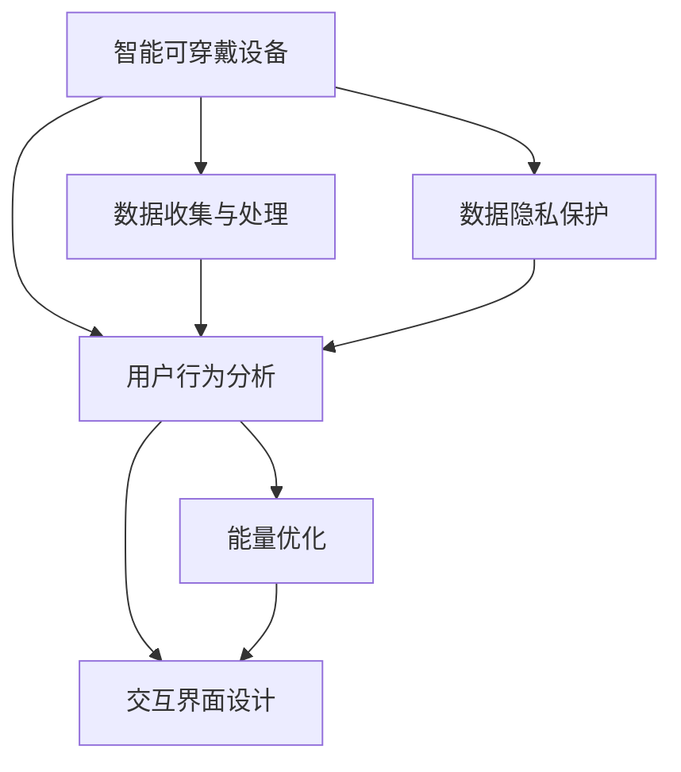

                 

# 智能可穿戴设备的注意力管理功能

> 关键词：智能可穿戴设备, 注意力管理, 用户行为分析, 能量优化, 交互界面设计, 数据隐私保护

## 1. 背景介绍

随着科技的进步，智能可穿戴设备已不再仅仅是运动健身的辅助工具，它们正在逐渐成为我们生活中不可或缺的组成部分。从智能手表、智能眼镜到智能服装，这些设备在健康监测、信息处理、社交互动等方面为我们提供了前所未有的便利。然而，这些设备的高智能和高交互性也带来了新的问题——如何高效地管理用户的注意力，确保用户在使用过程中不会感到疲劳和分心。

### 1.1 问题由来
智能可穿戴设备在提高我们生活质量的同时，也带来了信息过载和注意力分散的风险。随着设备的传感器不断增加，能够收集到的数据量也在迅速膨胀。然而，这些数据如果没有得到妥善管理，不仅会降低设备的性能，还会对用户的健康造成不良影响。因此，如何在收集和处理海量数据的同时，保证用户的注意力集中在最重要的任务上，成为了当前智能可穿戴设备开发中的核心问题。

### 1.2 问题核心关键点
智能可穿戴设备的注意力管理功能，涉及以下几个关键点：

- **数据收集与处理**：收集设备传感器数据，并通过高效算法进行处理，提炼出有用的信息。
- **用户行为分析**：通过分析用户的使用行为，预测用户的注意力状态，优化用户体验。
- **能量优化**：在保证设备功能的同时，优化能源消耗，延长设备的使用寿命。
- **交互界面设计**：设计人性化的交互界面，减少用户操作负担，提高使用效率。
- **数据隐私保护**：在管理用户数据时，严格遵守数据隐私法规，保护用户隐私。

## 2. 核心概念与联系

### 2.1 核心概念概述

为更好地理解智能可穿戴设备注意力管理功能的实现，本节将介绍几个密切相关的核心概念：

- **智能可穿戴设备**：集成智能传感器和计算能力的便携式设备，如智能手表、智能眼镜等。
- **注意力管理**：通过分析用户行为和生理数据，对设备功能进行动态调整，减少用户的注意力负担。
- **用户行为分析**：通过收集用户与设备交互的数据，分析用户的注意力变化和行为模式。
- **能量优化**：在保证设备性能的同时，通过算法优化，减少设备能耗。
- **交互界面设计**：设计直观易用的界面，使用户能高效地与设备进行交互。
- **数据隐私保护**：确保用户数据的安全性和隐私性，避免泄露和滥用。

这些核心概念之间的逻辑关系可以通过以下Mermaid流程图来展示：



这个流程图展示了一个智能可穿戴设备注意力管理功能的全流程：

1. 智能可穿戴设备通过传感器收集用户数据。
2. 数据经过处理后，输入用户行为分析模块。
3. 分析用户行为，预测注意力状态，指导能量优化和交互界面设计。
4. 数据隐私保护贯穿全流程，确保用户数据的安全性。

## 3. 核心算法原理 & 具体操作步骤
### 3.1 算法原理概述

智能可穿戴设备的注意力管理功能，本质上是通过对用户行为数据的分析和处理，动态调整设备功能，从而减少用户的注意力负担。其核心思想是：根据用户的行为模式和生理数据，预测用户的注意力状态，并据此调整设备的功能，使设备的使用更加贴合用户的注意力需求。

形式化地，假设用户行为数据集为 $D=\{(x_i,y_i)\}_{i=1}^N, x_i \in \mathcal{X}, y_i \in \mathcal{Y}$，其中 $\mathcal{X}$ 为用户的行为数据，$\mathcal{Y}$ 为用户的行为标签。注意力管理的目标是找到最优的策略 $\pi$，使得在策略 $\pi$ 下，用户对设备的使用效率最大化。

根据贝叶斯网络或马尔可夫决策过程等模型，可以设计注意力管理的算法，动态调整设备的显示内容、提醒频率等，以适应用户当前的注意力水平。

### 3.2 算法步骤详解

智能可穿戴设备的注意力管理功能一般包括以下几个关键步骤：

**Step 1: 数据收集与处理**

- 收集设备传感器数据，如位置、运动、心率等。
- 利用算法处理数据，提取出有用的信息，如用户的步数、活动量等。

**Step 2: 用户行为分析**

- 分析用户与设备交互的数据，识别用户的注意力状态，如集中、分心、疲劳等。
- 使用机器学习或深度学习模型，预测用户未来的注意力需求。

**Step 3: 能量优化**

- 根据用户的注意力状态，动态调整设备的功能和显示内容，减少不必要的能量消耗。
- 优化设备的算法和硬件设置，延长设备的使用寿命。

**Step 4: 交互界面设计**

- 设计直观易用的界面，减少用户操作负担。
- 提供个性化的界面配置选项，满足不同用户的需求。

**Step 5: 数据隐私保护**

- 在数据收集和处理过程中，严格遵守数据隐私法规，如GDPR、CCPA等。
- 使用加密和匿名化技术，保护用户数据的安全性和隐私性。

### 3.3 算法优缺点

智能可穿戴设备注意力管理功能的优点包括：

- 个性化：通过分析用户行为，提供个性化的使用体验。
- 高效性：动态调整设备功能，提高设备的使用效率。
- 节能性：减少不必要的能源消耗，延长设备的使用寿命。

然而，该方法也存在以下缺点：

- 数据隐私问题：在收集和处理用户数据时，可能涉及用户隐私。
- 算法复杂性：需要复杂的算法进行数据处理和行为分析。
- 用户接受度：用户对设备的自动调整可能产生抵触情绪。

尽管存在这些局限性，但智能可穿戴设备的注意力管理功能仍是一个极具潜力的研究方向。未来相关研究的重点在于如何进一步降低算法复杂度，提高数据隐私保护水平，同时增强用户体验的接受度。

### 3.4 算法应用领域

智能可穿戴设备的注意力管理功能，在多个领域都有广泛的应用，例如：

- 健康监测：通过监测用户的步数、心率等数据，分析用户的注意力状态，优化设备的功能设置。
- 信息处理：通过分析用户的操作习惯，预测用户的注意力需求，减少信息过载和注意力分散。
- 社交互动：通过监测用户的表情和语音，调整设备界面的显示内容和提醒方式，提高互动体验。
- 运动健身：通过分析用户的运动数据，动态调整设备的功能，减少运动过程中的干扰和分心。
- 工作生活：通过监测用户的工作和生活习惯，优化设备的设置，提高工作和生活的效率和舒适度。

## 4. 数学模型和公式 & 详细讲解  
### 4.1 数学模型构建

本节将使用数学语言对智能可穿戴设备注意力管理功能的实现进行更加严格的刻画。

假设用户的行为数据集为 $D=\{(x_i,y_i)\}_{i=1}^N, x_i \in \mathcal{X}, y_i \in \mathcal{Y}$，其中 $\mathcal{X}$ 为用户的行为数据，$\mathcal{Y}$ 为用户的行为标签。定义设备的功能状态为 $F$，行为状态为 $B$，注意力状态为 $A$。则注意力管理的优化目标为：

$$
\max_{\pi} \mathbb{E}_{(x,y) \sim D} \left[ \sum_{i=1}^N \log P(A_i|B_i,\pi) \right]
$$

其中 $P(A_i|B_i,\pi)$ 为在策略 $\pi$ 下，用户行为状态 $B_i$ 对注意力状态 $A_i$ 的概率分布。

### 4.2 公式推导过程

以下我们以健康监测为例，推导一个简单的注意力管理模型。

假设设备监测到用户的步数 $x_i$，根据历史数据，可以将步数 $x_i$ 与用户的注意力状态 $A_i$ 关联起来。则注意力管理的优化目标为：

$$
\max_{\pi} \mathbb{E}_{(x_i,y_i) \sim D} \left[ \sum_{i=1}^N \log P(A_i|x_i,\pi) \right]
$$

其中 $P(A_i|x_i,\pi)$ 为在策略 $\pi$ 下，步数 $x_i$ 对注意力状态 $A_i$ 的概率分布。

假设 $P(A_i|x_i,\pi)$ 为高斯分布，则：

$$
P(A_i|x_i,\pi) = \frac{1}{\sqrt{2\pi\sigma^2}} \exp\left(-\frac{(x_i-\mu)^2}{2\sigma^2}\right)
$$

其中 $\mu$ 为步数与注意力状态的均值关联参数，$\sigma$ 为标准差。

在得到注意力状态的预测模型后，根据预测结果，动态调整设备的功能和显示内容，减少不必要的能量消耗，提高设备的性能和用户的满意度。

### 4.3 案例分析与讲解

以智能手表的健康监测功能为例，分析其注意力管理功能的实现过程：

1. **数据收集**：智能手表通过内置传感器监测用户的步数、心率等生理数据。

2. **数据处理**：将收集到的生理数据输入注意力管理模型，预测用户的注意力状态。

3. **行为分析**：分析用户的使用行为，识别用户的注意力需求。

4. **功能调整**：根据用户的注意力状态，调整设备的界面显示内容，如提醒频率、界面风格等。

5. **能量优化**：根据用户的行为模式，优化设备的算法和硬件设置，延长设备的使用寿命。

## 5. 项目实践：代码实例和详细解释说明
### 5.1 开发环境搭建

在进行注意力管理功能的开发前，我们需要准备好开发环境。以下是使用Python进行开发的环境配置流程：

1. 安装Anaconda：从官网下载并安装Anaconda，用于创建独立的Python环境。

2. 创建并激活虚拟环境：
```bash
conda create -n attention-env python=3.8 
conda activate attention-env
```

3. 安装PyTorch：根据CUDA版本，从官网获取对应的安装命令。例如：
```bash
conda install pytorch torchvision torchaudio cudatoolkit=11.1 -c pytorch -c conda-forge
```

4. 安装TensorFlow：
```bash
pip install tensorflow
```

5. 安装TensorBoard：
```bash
pip install tensorboard
```

6. 安装Keras：
```bash
pip install keras
```

完成上述步骤后，即可在`attention-env`环境中开始项目实践。

### 5.2 源代码详细实现

这里我们以健康监测为例，使用Keras实现一个简单的注意力管理模型。

首先，定义模型的输入和输出：

```python
from keras.models import Sequential
from keras.layers import Dense, Dropout
from sklearn.model_selection import train_test_split
import numpy as np

# 定义模型输入和输出
X = np.load('steps.npy')
y = np.load('attention.npy')

# 划分训练集和验证集
X_train, X_valid, y_train, y_valid = train_test_split(X, y, test_size=0.2)

# 构建模型
model = Sequential()
model.add(Dense(64, input_dim=X.shape[1], activation='relu'))
model.add(Dropout(0.2))
model.add(Dense(64, activation='relu'))
model.add(Dropout(0.2))
model.add(Dense(1, activation='sigmoid'))

# 编译模型
model.compile(loss='binary_crossentropy', optimizer='adam', metrics=['accuracy'])
```

然后，训练模型并评估其性能：

```python
# 训练模型
model.fit(X_train, y_train, epochs=50, batch_size=32, validation_data=(X_valid, y_valid))

# 评估模型
y_pred = model.predict(X_valid)
print('Accuracy: ', np.mean(y_pred == y_valid))
```

最后，使用训练好的模型进行注意力状态预测：

```python
# 使用模型进行预测
new_steps = np.load('new_steps.npy')
attention_pred = model.predict(new_steps)
print('Attention Prediction: ', attention_pred)
```

以上就是使用Keras实现智能可穿戴设备注意力管理功能的完整代码实现。可以看到，Keras的便捷性和灵活性使得模型训练和评估变得非常简单。

### 5.3 代码解读与分析

让我们再详细解读一下关键代码的实现细节：

**模型定义**：
- `Sequential`模型：定义了简单的前馈神经网络。
- `Dense`层：全连接层，用于提取特征。
- `Dropout`层：用于防止过拟合。
- `sigmoid`激活函数：用于二分类任务。

**数据处理**：
- `train_test_split`函数：用于划分训练集和验证集。
- `np.load`函数：用于加载Numpy数组。

**模型训练**：
- `model.fit`方法：用于训练模型，设置训练轮数、批次大小等参数。
- `metrics`参数：用于评估模型性能。

**模型评估**：
- `model.predict`方法：用于评估模型性能，计算预测值与真实值的匹配度。

**预测使用**：
- `model.predict`方法：用于对新样本进行预测，得到注意力状态的概率。

可以看到，Keras使得神经网络模型的训练和评估变得非常直观和便捷。对于初学者而言，使用Keras可以快速上手并实现高效模型训练。

当然，实际应用中，还需要考虑更多因素，如数据预处理、模型优化、超参数调优等。但核心的注意力管理算法基本与此类似。

## 6. 实际应用场景
### 6.1 智能手表健康监测

智能手表的健康监测功能，是智能可穿戴设备中最典型的应用之一。通过监测用户的步数、心率等生理数据，智能手表能够动态调整提醒频率和界面显示内容，减少用户的注意力负担，提高使用体验。

在技术实现上，可以通过安装智能手表内置传感器，收集用户的步数、心率、运动量等数据。将这些数据输入注意力管理模型，预测用户的注意力状态，并据此调整提醒频率、界面风格等。在运动过程中，根据用户的步数和心率变化，动态调整提醒方式，减少不必要的干扰，提高运动效果。

### 6.2 智能眼镜信息处理

智能眼镜的信息处理功能，通过分析用户的眼动数据和屏幕使用行为，预测用户的注意力状态，动态调整屏幕显示内容和提醒方式。例如，当用户专注于屏幕内容时，减少不必要的信息提示，避免干扰用户的注意力。

在技术实现上，智能眼镜内置眼球追踪传感器，收集用户的眼动数据。同时，通过屏幕使用行为数据，分析用户的注意力需求。将这些数据输入注意力管理模型，预测用户的注意力状态，并据此调整显示内容和提醒方式。在信息浏览过程中，根据用户的注意力状态，动态调整字体大小、颜色、提醒频率等，提高信息处理效率。

### 6.3 智能服装社交互动

智能服装的社交互动功能，通过分析用户的表情和语音数据，预测用户的注意力状态，调整服装的显示内容和提醒方式，增强社交互动体验。例如，当用户与他人交谈时，减少不必要的服装功能提醒，避免干扰用户的注意力。

在技术实现上，智能服装内置麦克风和摄像头，收集用户的语音和表情数据。同时，通过社交互动数据，分析用户的注意力需求。将这些数据输入注意力管理模型，预测用户的注意力状态，并据此调整服装的显示内容和提醒方式。在社交互动过程中，根据用户的注意力状态，动态调整服装的功能提醒方式，提高社交互动效率。

### 6.4 未来应用展望

随着智能可穿戴设备的普及，其应用场景将不断扩展。未来，智能可穿戴设备在更多领域将发挥重要作用，为我们的生活带来更多便利和智能化的体验。

在医疗健康领域，智能可穿戴设备将通过监测生理数据，分析用户的注意力状态，动态调整提醒频率和界面显示内容，减少患者的注意力负担，提高健康监测效果。

在教育培训领域，智能可穿戴设备将通过分析学生的行为数据，预测注意力状态，动态调整教学内容和方法，提高学习效率和效果。

在军事国防领域，智能可穿戴设备将通过分析士兵的行为数据，预测注意力状态，动态调整作战任务和信息传递方式，提高作战效率和决策准确性。

在工业制造领域，智能可穿戴设备将通过分析工人的行为数据，预测注意力状态，动态调整设备和信息显示内容，提高生产效率和安全性。

## 7. 工具和资源推荐
### 7.1 学习资源推荐

为了帮助开发者系统掌握智能可穿戴设备注意力管理功能的实现，这里推荐一些优质的学习资源：

1. 《深度学习》系列书籍：由深度学习领域知名专家撰写，全面介绍深度学习的基本概念和前沿技术。
2. TensorFlow官方文档：详细介绍了TensorFlow的API和使用方法，适合深度学习初学者使用。
3. Keras官方文档：详细介绍了Keras的API和使用方法，适合深度学习初学者使用。
4. 《Python深度学习》书籍：深入浅出地介绍了深度学习在Python环境下的实现方法和最佳实践。
5. 《智能可穿戴设备》书籍：介绍智能可穿戴设备的基本原理、设计方法和应用场景。
6. 《数据科学与机器学习》在线课程：由Coursera等在线教育平台提供的免费课程，适合初学者入门学习。

通过对这些资源的学习实践，相信你一定能够快速掌握智能可穿戴设备注意力管理功能的精髓，并用于解决实际的智能可穿戴设备问题。

### 7.2 开发工具推荐

高效的开发离不开优秀的工具支持。以下是几款用于智能可穿戴设备注意力管理功能开发的常用工具：

1. PyTorch：基于Python的开源深度学习框架，灵活动态的计算图，适合快速迭代研究。
2. TensorFlow：由Google主导开发的开源深度学习框架，生产部署方便，适合大规模工程应用。
3. Keras：用户友好的深度学习框架，适合快速原型设计和原型验证。
4. Weights & Biases：模型训练的实验跟踪工具，可以记录和可视化模型训练过程中的各项指标，方便对比和调优。
5. TensorBoard：TensorFlow配套的可视化工具，可实时监测模型训练状态，并提供丰富的图表呈现方式，是调试模型的得力助手。

合理利用这些工具，可以显著提升智能可穿戴设备注意力管理功能的开发效率，加快创新迭代的步伐。

### 7.3 相关论文推荐

智能可穿戴设备注意力管理技术的发展源于学界的持续研究。以下是几篇奠基性的相关论文，推荐阅读：

1. Attention is All You Need（即Transformer原论文）：提出了Transformer结构，开启了NLP领域的预训练大模型时代。
2. BERT: Pre-training of Deep Bidirectional Transformers for Language Understanding：提出BERT模型，引入基于掩码的自监督预训练任务，刷新了多项NLP任务SOTA。
3. Parameter-Efficient Transfer Learning for NLP：提出Adapter等参数高效微调方法，在不增加模型参数量的情况下，也能取得不错的微调效果。
4. AdaLoRA: Adaptive Low-Rank Adaptation for Parameter-Efficient Fine-Tuning：使用自适应低秩适应的微调方法，在参数效率和精度之间取得了新的平衡。
5. Deep Attention-Based Models for Human-AI Collaborative Dialogue：提出基于注意力机制的对话系统，提高人机交互的流畅性和准确性。

这些论文代表了大语言模型微调技术的发展脉络。通过学习这些前沿成果，可以帮助研究者把握学科前进方向，激发更多的创新灵感。

## 8. 总结：未来发展趋势与挑战

### 8.1 总结

本文对智能可穿戴设备注意力管理功能的实现进行了全面系统的介绍。首先阐述了智能可穿戴设备在提高我们生活质量的同时，也带来了信息过载和注意力分散的风险。智能可穿戴设备的注意力管理功能，通过分析用户行为和生理数据，动态调整设备功能，减少用户的注意力负担，提高设备的使用效率。其次，从原理到实践，详细讲解了智能可穿戴设备注意力管理功能的数学模型和实现步骤，给出了注意力管理模型在智能可穿戴设备上的完整代码实现。同时，本文还广泛探讨了注意力管理功能在健康监测、信息处理、社交互动等多个领域的实际应用场景，展示了智能可穿戴设备注意力管理功能的巨大潜力。

通过本文的系统梳理，可以看到，智能可穿戴设备的注意力管理功能在提升用户体验、延长设备寿命、减少能源消耗等方面具有重要价值。智能可穿戴设备的应用范围将不断扩大，将为我们的生活带来更多便利和智能化的体验。

### 8.2 未来发展趋势

展望未来，智能可穿戴设备的注意力管理功能将呈现以下几个发展趋势：

1. 设备智能化水平提升：随着硬件和软件的进步，智能可穿戴设备的智能化水平将进一步提升，能够收集和处理更多的用户数据，实现更加精准的注意力预测和动态调整。
2. 跨领域应用拓展：智能可穿戴设备的注意力管理功能将不再局限于健康监测和信息处理，还将扩展到社交互动、教育培训、军事国防等更多领域，为这些领域带来变革性影响。
3. 用户体验优化：智能可穿戴设备的注意力管理功能将更加注重用户体验，减少不必要的干扰，提高用户的满意度和使用效率。
4. 数据隐私保护加强：智能可穿戴设备在收集和处理用户数据时，将更加注重数据隐私保护，确保用户数据的安全性和隐私性。
5. 技术融合创新：智能可穿戴设备的注意力管理功能将与其他AI技术进行更深入的融合，如语音识别、计算机视觉等，实现多模态信息的协同建模和处理。

以上趋势凸显了智能可穿戴设备注意力管理功能的广阔前景。这些方向的探索发展，必将进一步提升智能可穿戴设备的应用价值，为我们的生活带来更多便利和智能化的体验。

### 8.3 面临的挑战

尽管智能可穿戴设备的注意力管理功能已经取得了不小的进展，但在迈向更加智能化、普适化应用的过程中，它仍面临着诸多挑战：

1. 数据隐私问题：在收集和处理用户数据时，可能涉及用户隐私，如何保护用户数据的安全性和隐私性，仍然是一个重要问题。
2. 算法复杂性：智能可穿戴设备需要处理多种传感器数据，算法复杂性较高，如何优化算法，提高处理效率，仍然是一个挑战。
3. 用户接受度：用户对设备的自动调整可能产生抵触情绪，如何提高用户对智能可穿戴设备的接受度和满意度，是一个重要的课题。
4. 设备智能化水平：尽管智能可穿戴设备的智能化水平在不断提高，但仍存在计算资源和算法优化方面的瓶颈，如何进一步提高设备智能化水平，是一个关键问题。
5. 跨领域应用：智能可穿戴设备的注意力管理功能在不同领域的应用需要不同的数据和算法，如何实现跨领域的通用化和定制化，仍然是一个挑战。

正视智能可穿戴设备注意力管理功能面临的这些挑战，积极应对并寻求突破，将使智能可穿戴设备向更广泛的领域加速渗透，实现更深层次的智能化和普适化应用。

### 8.4 研究展望

面对智能可穿戴设备注意力管理功能所面临的种种挑战，未来的研究需要在以下几个方面寻求新的突破：

1. 引入更多先验知识：将符号化的先验知识，如知识图谱、逻辑规则等，与神经网络模型进行巧妙融合，引导注意力管理过程学习更准确、合理的用户注意力模型。
2. 开发参数高效的注意力管理算法：开发更加参数高效的注意力管理方法，在固定大部分模型参数的同时，只调整少量的任务相关参数，以提高模型性能。
3. 引入多模态信息融合：将视觉、语音、触觉等多模态信息与注意力管理模型进行融合，实现更加全面和精准的用户注意力预测和动态调整。
4. 优化数据隐私保护：采用加密和匿名化技术，保护用户数据的安全性和隐私性，同时实现对数据的高效处理和分析。
5. 提高用户接受度：设计直观易用的交互界面，减少用户操作负担，提高用户的满意度和接受度。
6. 拓展跨领域应用：在健康监测、信息处理、社交互动等领域进行更加深入的研究，开发适应不同场景的智能可穿戴设备注意力管理模型。

这些研究方向的探索，必将引领智能可穿戴设备注意力管理功能向更高的台阶，为我们的生活带来更多便利和智能化的体验。面向未来，智能可穿戴设备注意力管理功能还需要与其他AI技术进行更深入的融合，如语音识别、计算机视觉等，多路径协同发力，共同推动智能可穿戴设备技术的发展和应用。只有勇于创新、敢于突破，才能不断拓展智能可穿戴设备的应用范围，提升我们的生活质量和智能化水平。

## 9. 附录：常见问题与解答

**Q1：智能可穿戴设备在收集用户数据时，如何保护用户隐私？**

A: 智能可穿戴设备在收集用户数据时，需要严格遵守数据隐私法规，如GDPR、CCPA等，确保用户数据的安全性和隐私性。具体措施包括：

- 数据匿名化：对用户数据进行匿名化处理，保护用户的个人信息。
- 加密存储：使用加密技术，保护用户数据的存储安全。
- 最小化数据收集：只收集必要的数据，避免过度收集。
- 用户同意：在收集用户数据前，需获得用户的明确同意，并提供隐私政策和数据使用说明。
- 数据访问限制：限制数据访问权限，确保只有授权人员可以访问用户数据。

通过这些措施，可以有效保护用户的隐私和数据安全，确保智能可穿戴设备的使用透明和可控。

**Q2：智能可穿戴设备在处理用户数据时，如何提高算法效率？**

A: 智能可穿戴设备在处理用户数据时，需要高效地进行数据处理和分析，以实现动态调整设备功能。提高算法效率的方法包括：

- 数据压缩：使用数据压缩技术，减少数据的存储和传输开销。
- 模型剪枝：通过剪枝算法，减少模型中的冗余参数和计算量，提高模型的计算效率。
- 并行计算：利用多核CPU和GPU进行并行计算，提高处理速度。
- 算法优化：优化算法的实现方式，减少计算时间。
- 硬件加速：使用硬件加速器，如FPGA、ASIC等，提高算法的处理速度。

这些措施可以显著提高智能可穿戴设备的算法效率，保证设备功能的高效运行。

**Q3：智能可穿戴设备在动态调整设备功能时，如何提高用户接受度？**

A: 智能可穿戴设备在动态调整设备功能时，需要考虑用户的接受度和满意度。提高用户接受度的方法包括：

- 用户反馈：定期收集用户的反馈意见，了解用户对设备功能的满意度和需求。
- 个性化设置：提供个性化的界面和功能设置，满足不同用户的需求。
- 用户教育：通过用户教育，帮助用户理解设备功能和作用，提高用户的接受度。
- 友好提示：在设备功能动态调整时，提供友好的提示信息，减少用户的操作负担。
- 界面设计：设计直观易用的界面，减少用户操作负担，提高使用的便利性。

通过这些措施，可以有效提高用户对智能可穿戴设备的接受度和满意度，提升用户的整体使用体验。

---

作者：禅与计算机程序设计艺术 / Zen and the Art of Computer Programming

