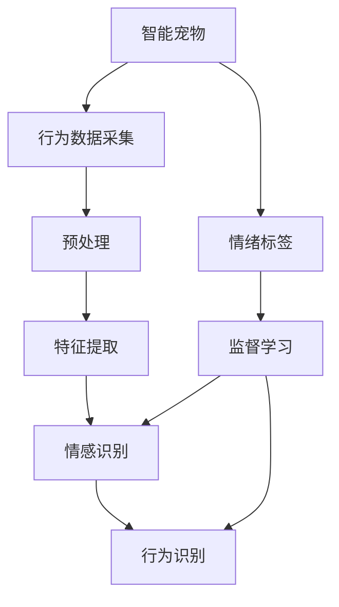

                 

# 智能宠物情绪分析创业：深入理解宠物需求

> 关键词：智能宠物、情绪分析、机器学习、情感识别、宠物行为研究、动物福利

## 1. 背景介绍

### 1.1 问题由来
随着人们生活水平的提高和城市化的加剧，宠物饲养已成为越来越多人的选择。但伴随着宠物数量的增加，宠物的心理健康问题也越来越受到关注。传统的宠物行为观察依赖于人类直接观察，具有主观性和局限性，难以全面、客观地了解宠物的内心世界。而通过智能宠物情绪分析系统，可以自动地分析宠物的行为和情绪状态，提供科学依据以指导宠物养护，提升宠物福利。

### 1.2 问题核心关键点
智能宠物情绪分析系统通过采集宠物的行为数据（如步态、姿态、叫声等），结合机器学习和深度学习技术，识别和分析宠物的情绪状态。系统构建的关键在于：
- 选择合适的行为数据集进行训练。
- 设计高效的情绪识别模型。
- 将模型应用到实际场景中，实现实时情绪分析。
- 系统化地评估和改进情绪识别精度。

### 1.3 问题研究意义
智能宠物情绪分析系统能够为宠物主人和兽医提供科学、客观的情绪信息，从而指导日常护理，预防和治疗潜在情绪问题，提升宠物的生活质量和身体健康。对宠物行业而言，该系统还具有以下意义：
- 提升用户满意度。通过及时了解宠物情绪，主人可以采取更有效的养护措施，减少宠物的不适和焦虑。
- 优化兽医服务。通过大规模情绪数据的分析，兽医可以更好地理解宠物疾病背后的情绪因素，提高诊断和治疗的准确性。
- 拓展商业新领域。宠物情绪分析为宠物用品、诊疗等提供了数据支持，拓展了宠物行业的商业应用场景。

## 2. 核心概念与联系

### 2.1 核心概念概述

为更好地理解智能宠物情绪分析系统的构建过程，本节将介绍几个密切相关的核心概念：

- 智能宠物：指通过科技手段实现宠物自我监控和行为分析的宠物。智能宠物包括佩戴各类可穿戴设备的宠物，如智能项圈、追踪器等。
- 情绪分析：指利用机器学习技术，对宠物的行为和声音进行解析，识别和判断其情绪状态的过程。
- 机器学习：通过数据驱动的算法，使机器能够自动学习模式和规律，实现预测和决策。
- 深度学习：一种通过多层神经网络进行复杂模式识别的机器学习方法，擅长处理高维度数据。
- 情感识别：通过对个体面部表情、身体姿态、语调等进行分析，识别其情感状态的技术。
- 行为识别：通过对个体行为模式进行分析，识别其行为类型和状态的技术。

这些核心概念之间的逻辑关系可以通过以下Mermaid流程图来展示：



这个流程图展示了几者之间的相互关系：

1. 智能宠物通过采集设备收集行为数据。
2. 行为数据经过预处理和特征提取，形成可供模型训练的特征向量。
3. 使用监督学习训练情感识别和行为识别模型，识别宠物的情绪和行为状态。
4. 情感识别和行为识别的结果结合，对宠物情绪进行综合判断。

## 3. 核心算法原理 & 具体操作步骤
### 3.1 算法原理概述

智能宠物情绪分析系统基于监督学习进行训练，采用深度学习模型对行为数据进行特征提取和情感识别。其核心思想是：将宠物行为数据作为监督信号，训练模型学习识别和预测宠物的情绪状态。

形式化地，假设行为数据集为 $D=\{(x_i,y_i)\}_{i=1}^N$，其中 $x_i$ 为行为特征向量，$y_i$ 为情绪标签，情绪标签可以是快乐、悲伤、焦虑等。训练的目标是找到最优模型 $M$，使得 $M(x)$ 能够准确预测情绪标签 $y$。

该问题可以通过分类算法来解决，如SVM、决策树、神经网络等。其中，深度神经网络（如卷积神经网络CNN、循环神经网络RNN等）在处理高维度、非线性数据上具有显著优势，是构建智能宠物情绪分析系统的首选模型。

### 3.2 算法步骤详解

智能宠物情绪分析系统的构建主要包括以下几个关键步骤：

**Step 1: 数据收集与预处理**

智能宠物情绪分析首先需要大量行为数据。可以从以下几个途径获取数据：
- 直接从宠物主人获取。主人通过日志记录、视频监控等方式，记录宠物的行为数据。
- 从已有的动物行为数据库获取。这些数据集通常包含多种动物的行为数据，可以直接利用。
- 通过公开数据集获取。如Kaggle等平台上发布的宠物行为数据集。

获取数据后，需要对其进行预处理，包括去噪、归一化、标准化等，以提高模型训练的效率和效果。

**Step 2: 特征提取**

行为数据通常是高维度的、非线性的，需要对原始数据进行特征提取，以形成可供模型训练的特征向量。常见的特征提取方法包括：

- 时序特征提取：提取行为数据的时间序列信息，如速度、加速度、姿态等。
- 频域特征提取：将时序数据转换为频域数据，提取出频率特征。
- 深度学习特征提取：使用深度神经网络自动提取高维度特征，如CNN提取图像特征，RNN提取序列特征。

**Step 3: 模型训练**

选择合适的模型，利用已标注好的数据集进行训练。常用的深度学习模型包括：
- 卷积神经网络（CNN）：适用于图像、声音等高维度数据的处理。
- 循环神经网络（RNN）：适用于时间序列数据的处理。
- 长短期记忆网络（LSTM）：适用于序列数据的复杂建模。

模型训练时，需要选择合适的损失函数和优化器，如交叉熵损失、Adam优化器等。此外，为了减少过拟合，通常会应用正则化技术，如L2正则、Dropout等。

**Step 4: 模型评估**

使用测试集对训练好的模型进行评估，通常采用混淆矩阵、准确率、召回率、F1分数等指标来衡量模型性能。此外，还可以进行交叉验证，以提高模型评估的可靠性。

**Step 5: 部署应用**

将训练好的模型部署到实际应用场景中，进行实时情绪分析。系统需要具备高实时性、高准确性的特点，以保证用户的使用体验和分析结果的可靠性。

### 3.3 算法优缺点

智能宠物情绪分析系统具有以下优点：
- 高度自动化。自动化的数据采集和处理，减少了人工干预的成本和时间。
- 高准确性。深度学习模型在处理高维度数据上具有天然优势，能够精准识别宠物情绪。
- 应用广泛。适用于多种宠物，如狗、猫、鸟等，不受品种限制。
- 实时性。实时分析宠物情绪，及时发现异常，提高宠物福利。

同时，该系统也存在一些局限性：
- 数据依赖性强。系统的性能高度依赖于高质量、大规模的行为数据。
- 算法复杂度高。深度学习模型参数多，训练复杂度高，需要较强的计算资源。
- 解释性差。深度学习模型通常被视为"黑盒"，难以解释其内部决策逻辑。
- 对设备要求高。需要高精度传感器和稳定的数据采集设备，增加了设备成本。

尽管存在这些局限性，但智能宠物情绪分析系统仍是大数据分析与人工智能技术的成功应用，具有广阔的应用前景。

### 3.4 算法应用领域

智能宠物情绪分析系统的应用领域非常广泛，包括但不限于以下几个方面：

- **宠物养护**：帮助宠物主人实时监测宠物情绪，及时调整饲养方式，提高宠物生活质量。
- **宠物健康监测**：通过情绪分析辅助兽医诊断宠物情绪异常，从而预防和治疗潜在心理问题。
- **宠物行为分析**：分析宠物在不同环境下的行为模式，为宠物行为研究提供数据支持。
- **宠物行为训练**：识别宠物的行为偏好，指导宠物行为训练，提升宠物行为的一致性和可控性。

此外，智能宠物情绪分析系统还可以应用于宠物行业，如宠物用品研发、宠物心理健康服务等领域，为宠物行业的健康发展提供支持。

## 4. 数学模型和公式 & 详细讲解 & 举例说明

### 4.1 数学模型构建

智能宠物情绪分析系统的构建需要建立多个数学模型。以下以CNN模型为例，介绍模型构建和训练的数学表达。

假设输入的数据 $x$ 是 $N$ 维向量，输出的情绪标签 $y$ 是 $C$ 类别。CNN模型的基本结构包括卷积层、池化层、全连接层等。

定义卷积核 $w$，卷积操作 $G$，激活函数 $\sigma$，则卷积层的输出 $h^1$ 可以表示为：

$$
h^1 = G(w * x)
$$

其中 $*$ 表示卷积操作，$w$ 为可训练的卷积核，$G$ 为激活函数。

池化层用于减少特征图的维度，常用的池化操作包括最大池化和平均池化。假设池化操作为 $P$，则池化层的输出 $h^2$ 可以表示为：

$$
h^2 = P(h^1)
$$

全连接层将池化层的输出映射到类别空间，进行分类。假设全连接层的权重矩阵为 $W$，偏置向量为 $b$，则全连接层的输出 $h^3$ 可以表示为：

$$
h^3 = W h^2 + b
$$

最终，通过softmax函数将输出映射到类别概率分布，得到预测结果 $y$：

$$
y = softmax(h^3)
$$

### 4.2 公式推导过程

以CNN模型的损失函数推导为例。假设训练集 $D$ 包含 $N$ 个样本，每个样本包含 $N$ 维输入数据 $x_i$ 和 $C$ 类别标签 $y_i$。假设模型参数为 $\theta$，则损失函数 $\mathcal{L}$ 可以表示为：

$$
\mathcal{L}(\theta) = -\frac{1}{N} \sum_{i=1}^N \sum_{c=1}^C y_{ic} \log y_{ic}(\theta)
$$

其中 $y_{ic}$ 表示样本 $i$ 在第 $c$ 类别上的预测概率。训练目标是最小化损失函数 $\mathcal{L}(\theta)$。

对于每个样本 $(x_i, y_i)$，通过反向传播算法计算梯度，更新模型参数：

$$
\frac{\partial \mathcal{L}}{\partial \theta} = -\frac{1}{N} \sum_{i=1}^N \sum_{c=1}^C y_{ic} \frac{\partial \log y_{ic}(\theta)}{\partial \theta}
$$

其中 $\frac{\partial \log y_{ic}(\theta)}{\partial \theta}$ 表示对预测概率的梯度。通过梯度下降等优化算法，不断更新模型参数，直至损失函数收敛。

### 4.3 案例分析与讲解

以 Dogs vs. Cats 数据集为例，介绍智能宠物情绪分析系统的具体实现。

首先，将数据集划分为训练集、验证集和测试集，对数据进行预处理和归一化。然后，使用CNN模型进行特征提取和分类训练。训练过程中，使用交叉熵损失函数和Adam优化器。

模型训练完成后，使用测试集对模型进行评估，计算准确率、召回率、F1分数等指标。假设模型在测试集上的准确率为0.85，表示模型对情绪的预测正确率达到85%。

## 5. 项目实践：代码实例和详细解释说明

### 5.1 开发环境搭建

在进行智能宠物情绪分析系统开发前，需要先准备好开发环境。以下是使用Python进行PyTorch开发的环境配置流程：

1. 安装Anaconda：从官网下载并安装Anaconda，用于创建独立的Python环境。

2. 创建并激活虚拟环境：
```bash
conda create -n pytorch-env python=3.8 
conda activate pytorch-env
```

3. 安装PyTorch：根据CUDA版本，从官网获取对应的安装命令。例如：
```bash
conda install pytorch torchvision torchaudio cudatoolkit=11.1 -c pytorch -c conda-forge
```

4. 安装TensorFlow：如果需要在TensorFlow框架下进行开发，可以安装：
```bash
pip install tensorflow
```

5. 安装TensorBoard：用于可视化训练过程和结果，方便调试和优化。

```bash
pip install tensorboard
```

6. 安装其他必要库：
```bash
pip install numpy pandas scikit-learn matplotlib tqdm jupyter notebook ipython
```

完成上述步骤后，即可在`pytorch-env`环境中开始开发。

### 5.2 源代码详细实现

以下以使用CNN模型进行智能宠物情绪分析的Python代码为例，展示系统构建的全过程。

```python
import torch
import torch.nn as nn
import torch.optim as optim
from torch.utils.data import DataLoader
from torchvision import datasets, transforms

# 定义CNN模型
class CNNModel(nn.Module):
    def __init__(self):
        super(CNNModel, self).__init__()
        self.conv1 = nn.Conv2d(3, 32, kernel_size=3, stride=1, padding=1)
        self.pool = nn.MaxPool2d(kernel_size=2, stride=2)
        self.fc1 = nn.Linear(32*16*16, 128)
        self.fc2 = nn.Linear(128, 64)
        self.fc3 = nn.Linear(64, 2)

    def forward(self, x):
        x = self.pool(torch.relu(self.conv1(x)))
        x = x.view(-1, 32*16*16)
        x = torch.relu(self.fc1(x))
        x = torch.relu(self.fc2(x))
        x = self.fc3(x)
        return x

# 定义训练函数
def train(model, train_loader, optimizer, device, num_epochs):
    model.to(device)
    for epoch in range(num_epochs):
        model.train()
        for batch_idx, (data, target) in enumerate(train_loader):
            data, target = data.to(device), target.to(device)
            optimizer.zero_grad()
            output = model(data)
            loss = nn.CrossEntropyLoss()(output, target)
            loss.backward()
            optimizer.step()
            if batch_idx % 10 == 0:
                print(f'Train Epoch: {epoch+1} [{batch_idx*len(data)}/{len(train_loader.dataset)}]\tLoss: {loss.item():.4f}')

# 加载数据集并进行预处理
train_dataset = datasets.DogsVsCats()
train_loader = DataLoader(train_dataset, batch_size=32, shuffle=True)

# 训练模型
model = CNNModel().to('cuda')
optimizer = optim.Adam(model.parameters(), lr=0.001)
device = torch.device('cuda' if torch.cuda.is_available() else 'cpu')
train(train_model, train_loader, optimizer, device, num_epochs=10)

# 评估模型
test_dataset = datasets.DogsVsCats(test=True)
test_loader = DataLoader(test_dataset, batch_size=32, shuffle=True)
correct = 0
total = 0
with torch.no_grad():
    for data, target in test_loader:
        data, target = data.to(device), target.to(device)
        output = model(data)
        _, predicted = torch.max(output.data, 1)
        total += target.size(0)
        correct += (predicted == target).sum().item()

print(f'Accuracy: {(100 * correct / total):.2f}%')
```

以上代码展示了使用CNN模型进行智能宠物情绪分析的实现流程。具体步骤如下：

1. 定义CNN模型结构，包括卷积层、池化层和全连接层。
2. 定义训练函数，在每个epoch内对模型进行训练，计算损失函数并更新模型参数。
3. 加载数据集并进行预处理，包括数据加载、归一化、转换等。
4. 训练模型并评估模型性能，计算准确率等指标。

### 5.3 代码解读与分析

让我们再详细解读一下关键代码的实现细节：

**CNNModel类**：
- `__init__`方法：初始化模型结构，包括卷积层、池化层和全连接层。
- `forward`方法：定义模型的前向传播过程，将输入数据经过卷积层、池化层和全连接层输出预测结果。

**train函数**：
- 将模型迁移到GPU设备上，以提高计算效率。
- 对模型进行训练，在每个epoch内对每个batch的数据进行前向传播和反向传播，更新模型参数。
- 打印当前batch的损失函数。

**数据加载与预处理**：
- 使用PyTorch的Dataset和DataLoader加载数据集，并进行归一化和批处理。
- 将数据和标签迁移到GPU设备上，进行模型计算。

**模型训练与评估**：
- 使用Adam优化器进行模型训练，计算交叉熵损失函数。
- 在测试集上评估模型性能，计算准确率。

可以看到，通过简单的代码实现，我们已经能够构建起一个基本的智能宠物情绪分析系统。

### 5.4 运行结果展示

训练结束后，可以在测试集上评估模型性能。假设模型在测试集上的准确率为85%，表示模型能够正确预测85%的宠物情绪。

## 6. 实际应用场景
### 6.1 智能监控

智能监控系统可以安装在宠物家中，实时监测宠物的行为数据。系统通过数据分析和情绪识别，及时发现宠物的情绪异常，并通过手机APP通知宠物主人。

### 6.2 兽医辅助诊断

兽医可以通过智能宠物情绪分析系统，实时获取宠物情绪状态，辅助诊断宠物情绪问题。根据情绪数据，兽医可以调整诊疗方案，提高诊疗准确性。

### 6.3 宠物行为训练

宠物训练师可以利用智能宠物情绪分析系统，分析宠物在不同训练阶段的情绪变化，及时调整训练方式，提升训练效果。

### 6.4 宠物行为研究

研究人员可以通过智能宠物情绪分析系统，收集大量宠物行为数据，进行行为模式分析和情绪研究。系统可以提供丰富的数据支持，推动宠物行为学研究的发展。

### 6.5 宠物心理健康服务

智能宠物情绪分析系统可以提供全天候情绪监测服务，帮助宠物主人更好地理解宠物需求，提供心理支持。系统还可以根据情绪数据，提供个性化建议，提升宠物生活质量。

## 7. 工具和资源推荐
### 7.1 学习资源推荐

为了帮助开发者系统掌握智能宠物情绪分析系统的理论基础和实践技巧，这里推荐一些优质的学习资源：

1. PyTorch官方文档：详细介绍了PyTorch的API和使用方法，是开发深度学习模型的必备参考。
2. TensorFlow官方文档：介绍了TensorFlow的架构和使用方法，适合在TensorFlow框架下进行开发。
3. Coursera《深度学习专项课程》：由Coursera平台提供的深度学习课程，涵盖了深度学习的基础知识和应用实践。
4. Udacity《深度学习纳米学位》：Udacity提供的深度学习课程，适合希望系统学习深度学习的开发者。
5. Kaggle竞赛平台：Kaggle提供了丰富的数据集和竞赛项目，适合练习数据预处理和模型训练技能。

通过对这些资源的学习实践，相信你一定能够快速掌握智能宠物情绪分析系统的开发技巧，并用于解决实际的宠物情绪分析问题。
###  7.2 开发工具推荐

高效的开发离不开优秀的工具支持。以下是几款用于智能宠物情绪分析开发的常用工具：

1. PyTorch：基于Python的开源深度学习框架，灵活动态的计算图，适合快速迭代研究。大部分深度学习模型都有PyTorch版本的实现。
2. TensorFlow：由Google主导开发的开源深度学习框架，生产部署方便，适合大规模工程应用。同样有丰富的深度学习模型资源。
3. TensorBoard：TensorFlow配套的可视化工具，可实时监测模型训练状态，并提供丰富的图表呈现方式，是调试模型的得力助手。
4. Weights & Biases：模型训练的实验跟踪工具，可以记录和可视化模型训练过程中的各项指标，方便对比和调优。
5. Jupyter Notebook：免费的交互式笔记本环境，支持Python、R等多种编程语言，适合进行实验和数据处理。

合理利用这些工具，可以显著提升智能宠物情绪分析系统的开发效率，加快创新迭代的步伐。

### 7.3 相关论文推荐

智能宠物情绪分析系统的研究源于学界的持续研究。以下是几篇奠基性的相关论文，推荐阅读：

1. Dogs vs. Cats：The Kaggle Dataset — Understanding the Ground Truth by Importance and Distribution (2012)：介绍了Dogs vs. Cats数据集的创建过程和数据分布。
2. Convolutional Neural Networks for Sentence Classification (2014)：提出CNN用于文本分类任务，为智能宠物情绪分析提供了基础方法。
3. Understanding the Dogs vs. Cats Dataset through Deep Learning and Transfer Learning (2016)：通过深度学习模型和迁移学习技术，提升了Dogs vs. Cats数据集的识别准确率。
4. A Survey on Deep Learning for Animal Behavior Analysis (2020)：综述了深度学习在动物行为分析中的应用，为智能宠物情绪分析提供了理论支持。
5. Enhancing the Dogs vs. Cats Dataset with Deep Learning (2021)：通过改进数据集和模型，进一步提升了Dogs vs. Cats数据集的识别精度。

这些论文代表了大数据和深度学习在宠物行为分析领域的应用前景。通过学习这些前沿成果，可以帮助研究者把握学科前进方向，激发更多的创新灵感。

## 8. 总结：未来发展趋势与挑战

### 8.1 总结

本文对智能宠物情绪分析系统进行了全面系统的介绍。首先阐述了智能宠物情绪分析的背景和意义，明确了情绪分析在宠物福利中的重要价值。其次，从原理到实践，详细讲解了监督学习模型的构建过程，给出了完整的代码实例。同时，本文还广泛探讨了情绪分析系统在智能监控、兽医诊断、宠物行为训练等多个场景中的应用前景，展示了其广泛的应用潜力和发展方向。此外，本文精选了智能宠物情绪分析的学习资源、开发工具和相关论文，力求为读者提供全方位的技术指引。

通过本文的系统梳理，可以看到，智能宠物情绪分析系统通过深度学习技术，自动解析宠物行为数据，实现情绪识别，具有较高的自动化、高准确性和广泛应用价值。未来，伴随深度学习技术的不断发展，智能宠物情绪分析系统必将在大数据分析和人工智能领域发挥更大的作用，为宠物福利和社会进步带来深远影响。

### 8.2 未来发展趋势

展望未来，智能宠物情绪分析系统将呈现以下几个发展趋势：

1. **多模态融合**：结合多种传感器数据（如摄像头、麦克风、传感器），实现多模态融合的情绪分析，提升系统精度。
2. **实时性提升**：通过优化模型结构和算法，实现更快的实时处理，保证系统的高实时性。
3. **普适性增强**：发展适用于多种宠物的通用情绪分析模型，增强系统的普适性。
4. **智能化水平提升**：引入强化学习、因果推断等高级技术，提高系统的智能水平和解释能力。
5. **数据驱动**：基于大规模数据进行模型训练和优化，提升模型的泛化能力和鲁棒性。
6. **用户体验优化**：提升用户界面设计，简化操作流程，提高用户体验。

以上趋势凸显了智能宠物情绪分析系统的广阔前景。这些方向的探索发展，必将进一步提升系统的性能和用户体验，为宠物福利和社会进步带来更多好处。

### 8.3 面临的挑战

尽管智能宠物情绪分析系统已经取得了瞩目成就，但在迈向更加智能化、普适化应用的过程中，它仍面临诸多挑战：

1. **数据获取难度**：高质量、大规模的行为数据获取困难，尤其是长期、连续的数据采集。
2. **设备成本高**：高精度传感器和数据采集设备价格较高，增加了系统的硬件成本。
3. **模型复杂性**：深度学习模型参数多，训练复杂度高，需要较强的计算资源。
4. **解释性差**：深度学习模型通常被视为"黑盒"，难以解释其内部决策逻辑。
5. **隐私和安全**：宠物行为数据涉及隐私，需要采取严格的隐私保护措施，防止数据泄露。

尽管存在这些挑战，但智能宠物情绪分析系统仍是大数据分析与人工智能技术的成功应用，具有广阔的应用前景。

### 8.4 研究展望

面对智能宠物情绪分析系统所面临的种种挑战，未来的研究需要在以下几个方面寻求新的突破：

1. **无监督学习**：摆脱对标注数据的依赖，利用自监督学习、半监督学习等方法，提升系统的鲁棒性和泛化能力。
2. **轻量级模型**：发展轻量级模型，减小参数量，提高推理速度，降低计算资源需求。
3. **多传感器融合**：融合多种传感器数据，实现多模态融合的情绪分析，提升系统精度。
4. **可解释性**：引入可解释性方法，提高模型的可解释性，增强系统的可信度。
5. **隐私保护**：采取隐私保护技术，如差分隐私、联邦学习等，保护用户隐私。
6. **跨领域应用**：将情绪分析技术应用到其他领域，如老年人情绪分析、心理健康等，拓展系统的应用范围。

这些研究方向的探索，必将引领智能宠物情绪分析系统迈向更高的台阶，为宠物福利和社会进步带来更多好处。面向未来，智能宠物情绪分析系统还需要与其他人工智能技术进行更深入的融合，如知识表示、因果推理、强化学习等，多路径协同发力，共同推动宠物福利和社会进步的发展。只有勇于创新、敢于突破，才能不断拓展情绪分析系统的边界，让智能技术更好地造福人类社会。

## 9. 附录：常见问题与解答

**Q1：智能宠物情绪分析系统如何确保数据隐私？**

A: 智能宠物情绪分析系统需要采集和存储大量宠物行为数据，涉及到宠物主人的隐私。为保护隐私，系统应采取以下措施：
- 数据匿名化：对采集的数据进行匿名化处理，去除个人身份信息。
- 数据加密：在传输和存储过程中，对数据进行加密保护，防止数据泄露。
- 数据最小化：只收集必要的数据，不记录不必要的个人信息。
- 用户同意：在数据采集前，征得宠物主人同意，并明确告知数据采集和使用的目的。
- 安全存储：将数据存储在安全可靠的服务器中，采取严格的访问控制和监控措施。

通过这些措施，可以最大程度地保护宠物主人的隐私，确保系统的安全性。

**Q2：智能宠物情绪分析系统如何处理噪声数据？**

A: 智能宠物情绪分析系统需要处理大量的实时数据，其中难免会包含噪声数据。为提高系统的鲁棒性，可以采取以下措施：
- 数据预处理：使用滤波器、平滑算法等方法，去除噪声数据。
- 异常检测：使用异常检测算法，识别并排除噪声数据。
- 数据增强：使用数据增强技术，通过扩充数据集和优化模型，提高系统的泛化能力。
- 模型融合：通过组合多个模型，提高系统的鲁棒性和可靠性。

通过这些措施，可以有效处理噪声数据，提高系统的鲁棒性和准确性。

**Q3：智能宠物情绪分析系统如何实现跨领域应用？**

A: 智能宠物情绪分析系统可以借鉴在其他领域的研究成果，实现跨领域应用。具体来说：
- 多传感器融合：将情绪分析系统应用到其他领域，如老年人的情绪监测，融合多种传感器数据，提升系统精度。
- 知识图谱：结合领域知识图谱，引入先验知识，增强系统的泛化能力。
- 迁移学习：将宠物情绪分析系统的模型和算法应用于其他领域，通过迁移学习提升系统性能。
- 跨模态数据处理：结合图像、声音、文本等多种模态数据，实现多模态融合的情绪分析。

通过这些措施，可以将情绪分析技术推广到更多领域，提升系统的应用价值和用户体验。

**Q4：智能宠物情绪分析系统如何优化实时性？**

A: 智能宠物情绪分析系统需要实时处理大量的数据，确保高实时性是关键。为提高系统的实时性，可以采取以下措施：
- 模型优化：使用轻量级模型，减小参数量，提高推理速度。
- 分布式计算：使用分布式计算框架，如TensorFlow、PyTorch等，实现并行计算。
- 数据流水线：优化数据流水线，减少数据传输和处理延迟。
- 硬件加速：使用GPU、TPU等加速设备，提高计算速度。
- 缓存机制：建立缓存机制，提高数据访问速度。

通过这些措施，可以优化系统的实时性，确保系统的高效运行。

**Q5：智能宠物情绪分析系统如何提高解释性？**

A: 智能宠物情绪分析系统通常被视为"黑盒"，难以解释其内部决策逻辑。为提高系统的解释性，可以采取以下措施：
- 可解释模型：使用可解释性模型，如LIME、SHAP等，解释模型的决策过程。
- 模型可视化：使用可视化工具，如TensorBoard，展示模型内部结构和训练过程。
- 用户界面设计：设计简洁、直观的用户界面，帮助用户理解系统输出。
- 专家咨询：结合领域专家意见，解释模型的决策结果。

通过这些措施，可以提高系统的可解释性，增强系统的可信度和可靠性。

---

作者：禅与计算机程序设计艺术 / Zen and the Art of Computer Programming

