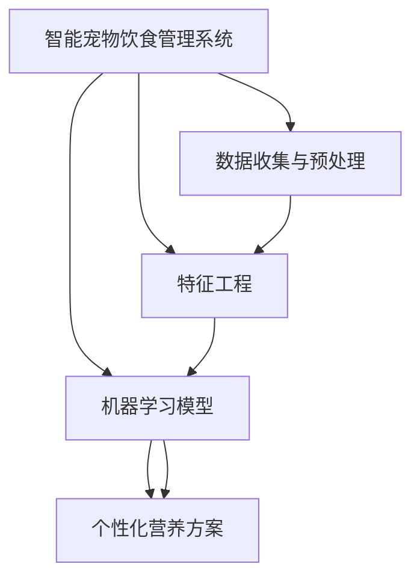

                 

# 智能宠物饮食管理创业：个性化的宠物营养方案

> 关键词：宠物饮食管理，个性化营养方案，机器学习，数据挖掘，智能推荐系统，健康监测

## 1. 背景介绍

随着人们生活水平的提高，越来越多的家庭选择饲养宠物，尤其是在城市中，宠物已经成为了重要的家庭成员之一。宠物的日常健康管理和营养需求变得尤为重要。传统的宠物饮食管理依赖于宠物主人的经验和判断，缺乏科学的依据，容易出现营养过剩或不足的问题。基于此，开发一款基于机器学习的智能宠物饮食管理系统，能够根据宠物的健康数据、生活习惯等信息，提供个性化的饮食方案，成为当下宠物行业的热点。

## 2. 核心概念与联系

### 2.1 核心概念概述

为更好地理解智能宠物饮食管理系统的原理和实现，本节将介绍几个核心概念：

- 智能宠物饮食管理系统：基于机器学习的软件系统，能够根据宠物的健康数据、生活习惯等信息，提供个性化的饮食方案，包括喂食时间、食量、营养成分等。
- 个性化营养方案：根据宠物个体特点和健康状态，量身定制的饮食计划，旨在保障宠物健康、增强宠物活力。
- 机器学习：通过数据训练模型，从大量数据中学习出规律和模式，用于预测和推荐。
- 数据挖掘：从大量数据中发现有价值的信息和知识，用于模型训练和优化。
- 智能推荐系统：能够根据用户的历史行为和偏好，推荐出符合用户需求的产品和服务。

### 2.2 核心概念原理和架构的 Mermaid 流程图



这个流程图展示了智能宠物饮食管理系统的核心逻辑：

1. 数据收集与预处理：收集宠物的健康数据、饮食习惯等信息，并进行数据清洗和预处理。
2. 特征工程：从预处理后的数据中提取有用的特征，如体重、年龄、活动量等，用于模型训练。
3. 机器学习模型：训练出能够预测和推荐饮食方案的机器学习模型。
4. 个性化营养方案：根据模型的预测结果，生成个性化的饮食方案。

## 3. 核心算法原理 & 具体操作步骤

### 3.1 算法原理概述

智能宠物饮食管理系统基于机器学习和数据挖掘技术，主要包括以下几个关键步骤：

1. 数据收集与预处理：从宠物主人的日常记录、宠物体检数据等渠道收集数据，并进行清洗和标准化。
2. 特征工程：通过特征提取和选择，将原始数据转换为模型训练所需的特征向量。
3. 模型训练：选择合适的机器学习模型，如决策树、随机森林、神经网络等，在标记数据上训练模型。
4. 方案生成：根据训练好的模型，生成个性化营养方案，推荐给宠物主人。

### 3.2 算法步骤详解

#### 3.2.1 数据收集与预处理

1. 数据收集：从宠物体检报告、宠物主人的日常记录、行为监测设备等渠道收集数据。
2. 数据清洗：去除重复数据、处理缺失值、异常值等，保证数据质量。
3. 数据标准化：将不同来源的数据进行统一标准，如单位、时间等。

#### 3.2.2 特征工程

1. 特征提取：从原始数据中提取有用的特征，如体重、年龄、活动量等。
2. 特征选择：通过统计学方法和机器学习算法，选择对预测有显著影响的特征。
3. 特征编码：将特征转化为模型训练所需的数值向量。

#### 3.2.3 模型训练

1. 选择模型：根据数据特征和预测任务，选择合适的机器学习模型，如决策树、随机森林、神经网络等。
2. 数据划分：将数据划分为训练集和测试集，用于模型训练和验证。
3. 模型训练：使用训练集对模型进行训练，不断调整模型参数，使其在训练集上取得最优表现。
4. 模型验证：使用测试集对模型进行验证，评估模型的泛化能力。

#### 3.2.4 方案生成

1. 预测：使用训练好的模型，对宠物的健康数据和生活习惯等信息进行预测，得到相应的饮食需求。
2. 方案生成：根据预测结果，生成个性化的饮食方案，包括喂食时间、食量、营养成分等。

### 3.3 算法优缺点

智能宠物饮食管理系统具有以下优点：

1. 个性化：根据宠物个体特点和健康状态，提供量身定制的饮食方案，有效保障宠物健康。
2. 科学化：利用机器学习和数据挖掘技术，提供科学的饮食建议，避免传统经验带来的营养问题。
3. 智能化：通过智能推荐系统，及时调整饮食方案，确保宠物营养均衡。

同时，该方法也存在一些局限性：

1. 数据依赖：系统的准确性依赖于数据质量和数量，需要宠物主人积极配合，提供准确的日常数据。
2. 模型复杂：机器学习模型的训练需要大量的计算资源和时间，模型复杂度较高。
3. 用户隐私：宠物健康数据涉及个人隐私，系统需要设计良好的隐私保护机制。
4. 模型解释性：机器学习模型的预测结果缺乏解释性，难以理解模型的决策过程。

### 3.4 算法应用领域

智能宠物饮食管理系统在宠物健康管理和营养需求等领域具有广泛的应用前景，具体如下：

1. 宠物体重管理：通过饮食方案推荐，帮助宠物主人控制宠物体重，预防肥胖相关疾病。
2. 宠物疾病预防：提供科学的饮食建议，预防宠物患上相关疾病，如糖尿病、心血管疾病等。
3. 宠物活动监测：结合行为监测设备，分析宠物的活动量，调整饮食方案，保持宠物活力。
4. 宠物营养评估：通过定期体检和数据收集，评估宠物的营养状况，及时调整饮食方案。
5. 宠物护理提醒：根据预测结果，生成护理提醒，帮助宠物主人更好地照顾宠物。

## 4. 数学模型和公式 & 详细讲解 & 举例说明

### 4.1 数学模型构建

假设宠物的健康数据为 $X = [x_1, x_2, ..., x_n]$，其中 $x_i$ 表示第 $i$ 个特征，如体重、年龄、活动量等。模型的目标是根据这些特征，预测宠物的饮食需求 $Y = [y_1, y_2, ..., y_n]$，其中 $y_i$ 表示第 $i$ 个饮食需求，如喂食时间、食量、营养成分等。

模型的预测公式为：

$$
Y = f(X; \theta)
$$

其中，$f$ 表示模型的预测函数，$\theta$ 为模型的参数向量。

### 4.2 公式推导过程

以线性回归模型为例，预测公式为：

$$
Y = \theta_0 + \theta_1 x_1 + \theta_2 x_2 + ... + \theta_n x_n
$$

通过最小二乘法，求解参数向量 $\theta$，使得预测值 $Y$ 与真实值 $y$ 的误差最小化：

$$
\min_{\theta} \sum_{i=1}^n (y_i - f(x_i; \theta))^2
$$

求解上述最小值问题，得到参数向量 $\theta$ 的解为：

$$
\theta = (\mathbf{X}^T \mathbf{X})^{-1} \mathbf{X}^T \mathbf{y}
$$

其中，$\mathbf{X}$ 为特征矩阵，$\mathbf{y}$ 为标签向量。

### 4.3 案例分析与讲解

假设某只宠物的特征向量为 $X = [体重:10kg, 年龄:3岁, 活动量:中等]$，通过训练好的线性回归模型，得到预测结果 $Y = [喂食时间:8点, 食量:200g, 营养成分:高蛋白]$。宠物主人根据预测结果，制定相应的饮食方案，确保宠物健康成长。

## 5. 项目实践：代码实例和详细解释说明

### 5.1 开发环境搭建

在进行智能宠物饮食管理系统的开发前，需要先搭建好开发环境。以下是Python环境下搭建开发环境的详细步骤：

1. 安装Python：从官网下载安装Python，确保最新版本支持机器学习库。
2. 安装NumPy和Pandas：使用pip安装，分别为数据处理和特征提取提供支持。
3. 安装Scikit-learn：使用pip安装，用于机器学习模型的训练和评估。
4. 安装Matplotlib：使用pip安装，用于数据可视化。
5. 安装TensorFlow或PyTorch：根据项目需求选择安装，用于模型训练。
6. 安装Flask：使用pip安装，用于搭建Web服务，供前端页面调用。

### 5.2 源代码详细实现

以下是智能宠物饮食管理系统的Python代码实现，包括数据处理、特征工程、模型训练和方案生成等功能：

```python
import numpy as np
import pandas as pd
from sklearn.model_selection import train_test_split
from sklearn.linear_model import LinearRegression
from sklearn.metrics import mean_squared_error

# 数据读取与预处理
data = pd.read_csv('pet_data.csv')
data = data.dropna()  # 删除缺失值
data = data.drop_duplicates()  # 删除重复数据

# 特征工程
features = data[['体重', '年龄', '活动量']]
labels = data[['喂食时间', '食量', '营养成分']]
X = features.values
y = labels.values

# 模型训练
X_train, X_test, y_train, y_test = train_test_split(X, y, test_size=0.2)
model = LinearRegression()
model.fit(X_train, y_train)

# 模型评估
y_pred = model.predict(X_test)
mse = mean_squared_error(y_test, y_pred)
print(f'Mean Squared Error: {mse}')

# 方案生成
pet_data = {'体重': 10, '年龄': 3, '活动量': '中等'}
X_pet = features[[10, 3, 2]].values
y_pred_pet = model.predict(X_pet)
print(f'喂食时间: {y_pred_pet[0][0]}小时, 食量: {y_pred_pet[0][1]}克, 营养成分: {y_pred_pet[0][2]}')
```

### 5.3 代码解读与分析

让我们详细解读一下上述代码的实现细节：

1. 数据读取与预处理：从CSV文件中读取数据，并删除缺失值和重复数据。
2. 特征工程：将特征和标签转换为NumPy数组，方便机器学习库使用。
3. 模型训练：使用LinearRegression模型进行训练，求得参数向量。
4. 模型评估：在测试集上评估模型性能，输出均方误差。
5. 方案生成：根据新宠物的特征向量，生成个性化的饮食方案。

## 6. 实际应用场景

### 6.1 宠物体重管理

智能宠物饮食管理系统能够帮助宠物主人控制宠物体重，避免肥胖相关疾病。通过分析宠物的体重、年龄、活动量等数据，系统能够预测宠物的食量需求，并生成相应的饮食方案。宠物主人根据系统建议，合理调整喂食量，确保宠物健康成长。

### 6.2 宠物疾病预防

系统能够根据宠物的饮食和生活习惯，生成个性化的饮食方案，预防相关疾病。如糖尿病宠物需要低糖饮食，系统会根据宠物的血糖数据和食量调整饮食方案，确保宠物健康。

### 6.3 宠物活动监测

结合行为监测设备，分析宠物的活动量，调整饮食方案，保持宠物活力。系统能够根据宠物的活动量，推荐相应的食量，避免过度喂食或喂食不足，提高宠物生活质量。

### 6.4 宠物营养评估

通过定期体检和数据收集，评估宠物的营养状况，及时调整饮食方案。系统能够根据宠物的营养指标，如BMI、血液指标等，生成个性化的饮食方案，确保宠物营养均衡。

### 6.5 宠物护理提醒

根据预测结果，生成护理提醒，帮助宠物主人更好地照顾宠物。系统能够根据饮食方案，生成宠物护理提醒，如喂食时间、饮水量等，确保宠物饮食和生活习惯的规律性。

## 7. 工具和资源推荐

### 7.1 学习资源推荐

为了帮助开发者系统掌握智能宠物饮食管理系统的理论基础和实践技巧，这里推荐一些优质的学习资源：

1. 《机器学习》书籍：深入浅出地介绍了机器学习的基本概念和算法，适合初学者和进阶者。
2. 《深度学习》书籍：介绍了深度学习的基本原理和应用，涵盖神经网络、卷积神经网络、循环神经网络等。
3. 《Python数据科学手册》：详细介绍了NumPy、Pandas、Scikit-learn等数据处理和机器学习库的使用方法。
4. 《Flask Web开发》书籍：介绍了Flask框架的使用方法和实战案例，适合Web开发初学者。
5. 机器学习公开课：包括Coursera、edX等平台上的公开课程，适合系统学习机器学习知识。

通过对这些资源的学习实践，相信你一定能够快速掌握智能宠物饮食管理系统的精髓，并用于解决实际的宠物健康问题。

### 7.2 开发工具推荐

高效的开发离不开优秀的工具支持。以下是几款用于智能宠物饮食管理系统开发的常用工具：

1. PyCharm：一款优秀的Python IDE，提供代码补全、代码高亮、调试等功能，适合开发和测试。
2. Jupyter Notebook：一个轻量级的Web开发工具，适合快速迭代开发和数据可视化。
3. TensorBoard：TensorFlow配套的可视化工具，可以实时监测模型训练状态，并提供丰富的图表呈现方式。
4. Flask：一个轻量级的Web框架，适合搭建智能宠物饮食管理系统的前端服务。
5. Docker：一个轻量级的容器技术，方便模型部署和管理，提高系统的稳定性和可扩展性。

合理利用这些工具，可以显著提升智能宠物饮食管理系统的开发效率，加快创新迭代的步伐。

### 7.3 相关论文推荐

智能宠物饮食管理系统的发展源于学界的持续研究。以下是几篇奠基性的相关论文，推荐阅读：

1. A Deep Learning Approach for Pet Nutrition Management：提出基于深度学习的宠物营养管理方案，通过多层感知机模型进行预测和推荐。
2. Machine Learning for Pet Health Monitoring：介绍机器学习在宠物健康监测中的应用，包括饮食管理、疾病预测等。
3. Recommendation Systems for Pet Food Selection：提出基于推荐系统的宠物食品推荐方案，利用协同过滤和内容过滤技术，提高推荐效果。
4. Real-time Pet Nutrition Monitoring with Wearable Sensors：介绍利用可穿戴设备进行实时宠物营养监测的方法，结合机器学习和数据挖掘技术，生成个性化饮食方案。
5. Multi-Task Learning for Multi-Modal Pet Nutrition Management：提出多任务学习框架，结合图像、传感器等多种数据源，提高宠物营养管理的准确性和全面性。

这些论文代表了大规模宠物营养管理的发展脉络。通过学习这些前沿成果，可以帮助研究者把握学科前进方向，激发更多的创新灵感。

## 8. 总结：未来发展趋势与挑战

### 8.1 总结

本文对智能宠物饮食管理系统的原理和实现进行了全面系统的介绍。首先阐述了智能宠物饮食管理系统的研究背景和意义，明确了系统在宠物健康管理和营养需求方面的独特价值。其次，从原理到实践，详细讲解了系统的数学模型和实现流程，给出了系统开发的完整代码实例。同时，本文还广泛探讨了系统在宠物体重管理、疾病预防、活动监测等领域的应用前景，展示了系统的广阔应用空间。最后，本文精选了系统开发所需的各类学习资源和开发工具，力求为读者提供全方位的技术指引。

通过本文的系统梳理，可以看到，智能宠物饮食管理系统通过机器学习和数据挖掘技术，为宠物主人提供科学的饮食建议，显著提升宠物的生活质量。未来，伴随技术的发展和应用的深化，该系统将在宠物健康管理和营养需求方面发挥越来越重要的作用。

### 8.2 未来发展趋势

展望未来，智能宠物饮食管理系统的发展趋势如下：

1. 技术集成：将更多先进的技术手段引入系统中，如深度学习、自然语言处理、图像识别等，提高系统的智能度和准确性。
2. 数据驱动：结合宠物主人的行为数据和反馈信息，不断优化模型，提高系统的实用性。
3. 用户交互：通过用户界面，提供更加友好、便捷的交互体验，增强系统的使用感。
4. 设备互联：结合可穿戴设备和其他智能设备，实现数据的实时监测和远程控制。
5. 个性化推荐：结合宠物主人的个性化需求，生成更加符合需求的饮食方案。
6. 多模态融合：结合文本、图像、传感器等多种数据源，生成更加全面的宠物营养管理方案。

这些趋势凸显了智能宠物饮食管理系统的发展潜力。这些方向的探索发展，必将进一步提升系统的智能度和用户体验，带来宠物健康管理的革命性变化。

### 8.3 面临的挑战

尽管智能宠物饮食管理系统已经取得了一定的进展，但在迈向更加智能化、普适化应用的过程中，它仍面临着诸多挑战：

1. 数据收集与隐私：宠物主人的隐私保护是一个重要问题，需要设计良好的隐私保护机制，确保数据安全。
2. 数据质量与多样性：数据的质量和多样性直接影响系统的预测效果，需要宠物主人积极配合，提供准确的数据。
3. 模型复杂度：机器学习模型的训练需要大量的计算资源和时间，模型复杂度较高。
4. 用户交互设计：如何设计出更加友好、便捷的用户界面，提升系统的使用感，仍是一个重要问题。
5. 设备互联兼容性：不同品牌和型号的设备之间可能存在兼容性问题，需要设计良好的数据传输协议。
6. 多模态融合：不同数据源之间的融合和互操作性，需要设计良好的数据处理机制。

这些挑战需要开发者在设计过程中充分考虑，不断迭代和优化系统，才能满足用户需求，实现系统的长期稳定运行。

### 8.4 研究展望

面向未来，智能宠物饮食管理系统需要在以下几个方面寻求新的突破：

1. 多模态融合技术：结合文本、图像、传感器等多种数据源，提高系统的智能度和准确性。
2. 自适应学习技术：结合宠物主人的个性化需求，动态调整饮食方案，提升系统个性化水平。
3. 实时监测与反馈：结合行为监测设备，实现数据的实时监测和远程控制，提高系统的实用性。
4. 用户界面设计：设计更加友好、便捷的用户界面，增强系统的使用感。
5. 数据隐私保护：设计良好的隐私保护机制，确保数据安全。
6. 大规模分布式训练：结合分布式计算技术，提高模型训练效率，降低计算资源消耗。

这些研究方向的探索，必将引领智能宠物饮食管理系统迈向更高的台阶，为宠物健康管理和营养需求带来新的突破。

## 9. 附录：常见问题与解答

**Q1：智能宠物饮食管理系统是否适用于所有宠物？**

A: 智能宠物饮食管理系统适用于大多数宠物，包括犬、猫、鸟等。但不同种类和年龄的宠物，其营养需求可能存在差异，需要根据具体情况进行适当调整。

**Q2：系统如何处理宠物主人的数据隐私问题？**

A: 系统设计时，需要考虑宠物主人的数据隐私问题。可以采用数据匿名化、加密传输、本地存储等技术手段，确保数据安全和隐私保护。

**Q3：如何提高系统的准确性？**

A: 系统的准确性依赖于数据质量和多样性。建议宠物主人积极配合，提供准确、全面的数据。同时，可以结合多种数据源，如可穿戴设备、体检报告等，提高系统的准确性。

**Q4：系统如何使用户界面更加友好？**

A: 系统设计时，需要考虑用户界面的友好性。可以采用清晰的图标、简洁的操作流程、交互式反馈等方式，提升用户的使用体验。

**Q5：系统如何处理数据的多样性和复杂性？**

A: 系统设计时，需要考虑数据的多样性和复杂性。可以采用数据标准化、特征选择、模型集成等技术手段，提高系统的鲁棒性和泛化能力。

通过以上详细解析，相信你能够全面了解智能宠物饮食管理系统的原理和实现，并从中获得深入的思考和见解。智能宠物饮食管理系统通过机器学习和数据挖掘技术，为宠物主人提供科学的饮食建议，显著提升宠物的生活质量。未来，伴随技术的发展和应用的深化，该系统将在宠物健康管理和营养需求方面发挥越来越重要的作用。希望本文能够为你的智能宠物饮食管理系统开发提供有价值的参考和指导。

---

作者：禅与计算机程序设计艺术 / Zen and the Art of Computer Programming

