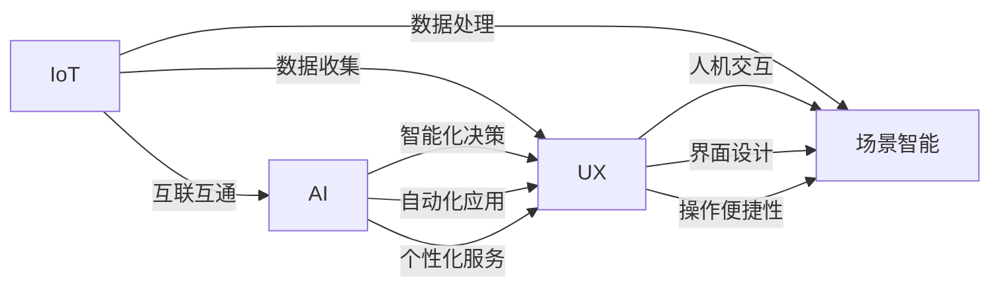

                 

# 智能家居创业：打造未来生活方式

> 关键词：智能家居,物联网(IoT),人工智能(AI),用户体验(UX),生态系统(Ecosystem),用户隐私,人机交互(Human-Computer Interaction),场景智能(Scene Intelligence)

## 1. 背景介绍

### 1.1 问题由来

智能家居作为一个跨学科领域，结合了物联网(IoT)、人工智能(AI)、人机交互(Human-Computer Interaction)等前沿技术，旨在通过智能设备间的协同工作，提升居住环境的安全性、舒适性和便捷性。近年来，随着科技的飞速发展，智能家居设备种类日益丰富，用户需求也日益多元化，创业机会由此而生。

然而，智能家居的创业并非易事。如何在产品设计中实现跨系统、跨设备的无缝协作，提升用户体验(UX)，同时确保用户隐私安全，这都是创业团队需要面对的挑战。本文将从技术、商业、用户等多个角度探讨智能家居创业的思路与实践，以期为有志于此领域的创业者提供参考。

### 1.2 问题核心关键点

智能家居创业的核心关键点包括：

1. 系统整合与互联互通：智能家居设备种类繁多，功能各异，实现这些设备间的互联互通是智能家居系统的基础。
2. 人工智能与用户体验：AI技术的应用能够提升设备的智能化水平，提供个性化服务，但同时也要保证良好的用户体验。
3. 数据隐私与安全：智能家居设备通常需要处理大量个人数据，如何保护用户隐私是重要的研究方向。
4. 生态系统的建设：智能家居创业不仅要关注单个设备，更需要构建一个完整的生态系统，包括硬件、软件和服务。
5. 场景智能与智能化应用：智能家居需要根据不同场景自动调整系统配置，实现真正的智能化。

这些关键点共同构成了智能家居创业的复杂图景，任何单一技术或单一解决方案都难以实现全面覆盖。

## 2. 核心概念与联系

### 2.1 核心概念概述

为更好地理解智能家居创业的技术框架，本节将介绍几个核心概念及其联系：

- **物联网(IoT)**：将物理设备通过互联网连接，实现数据互通和远程控制。
- **人工智能(AI)**：通过机器学习、自然语言处理等技术，实现设备的智能化决策和自动化。
- **用户体验(UX)**：专注于用户在使用产品时的感受，包括交互设计、界面设计、操作便捷性等。
- **生态系统(Ecosystem)**：包括硬件设备、软件平台、服务应用等，形成一个完整的智能家居解决方案。
- **用户隐私**：智能家居设备需要处理大量个人数据，如何保护用户隐私是系统建设的关键。
- **场景智能**：根据用户在不同场景下的行为和需求，智能调整家居环境，如睡眠模式、工作模式等。

这些概念之间相互关联，共同构成了智能家居创业的技术架构，如图示所示：



通过理解这些核心概念及其联系，我们可以更好地把握智能家居创业的技术方向和设计思路。

## 3. 核心算法原理 & 具体操作步骤
### 3.1 算法原理概述

智能家居创业的算法原理主要基于物联网、人工智能和用户体验三大领域。物联网通过传感器和通信技术实现设备间的互联，人工智能通过机器学习模型实现设备间的协同决策，用户体验则通过界面设计和用户反馈不断优化。

具体来说，智能家居系统的核心算法包括以下几个方面：

- **传感器数据处理算法**：将传感器采集到的数据进行预处理和特征提取，以便于后续的分析和决策。
- **机器学习算法**：利用监督学习、无监督学习和强化学习等算法，对用户行为进行建模和预测，实现设备间的智能化控制。
- **推荐系统算法**：根据用户的历史行为和偏好，推荐适合的服务或产品，提升用户体验。
- **用户界面交互算法**：通过语音、手势等自然语言处理技术，实现与用户的无障碍交互。

### 3.2 算法步骤详解

智能家居创业的算法步骤主要包括以下几个关键环节：

1. **系统设计与架构搭建**：根据智能家居应用场景，设计系统的整体架构，包括硬件选型、网络布局和数据流向。
2. **数据采集与预处理**：通过传感器和其他设备，采集环境数据和用户行为数据，并进行预处理，如去噪、归一化等。
3. **模型训练与优化**：使用机器学习算法对采集到的数据进行建模，并根据用户反馈不断优化模型，提升预测准确性。
4. **个性化服务推荐**：根据用户行为和偏好，推荐合适的服务和产品，如智能灯光调节、智能窗帘控制等。
5. **用户界面交互优化**：设计符合用户习惯的用户界面，并提供语音助手、手势识别等交互方式，提升用户体验。
6. **系统测试与部署**：在真实环境中测试系统的性能和稳定性，根据测试结果进行优化，并将系统部署到实际环境中。

### 3.3 算法优缺点

智能家居创业的算法具有以下优点：

- **智能化决策**：通过人工智能算法，智能家居设备能够自动判断用户需求，并提供合适的服务和控制。
- **个性化服务**：根据用户的行为和偏好，提供定制化的服务，提升用户体验。
- **多设备协同**：通过物联网技术，实现不同设备间的互联互通，提供一体化的家居解决方案。

同时，该算法也存在一些缺点：

- **数据处理复杂**：智能家居设备需要处理大量的传感器数据，数据处理和存储开销较大。
- **隐私保护难题**：智能家居设备通常需要收集和处理个人数据，如何保护用户隐私是重要的挑战。
- **系统复杂度高**：智能家居系统涉及多个子系统和多设备，系统设计和管理复杂度较高。

### 3.4 算法应用领域

智能家居创业的算法主要应用于以下几个领域：

- **智能照明系统**：通过传感器和机器学习算法，根据用户的行为和环境变化，自动调节照明亮度和色温。
- **智能温控系统**：根据用户的习惯和环境温度，自动调节室内温度和湿度，实现节能和舒适度双赢。
- **智能安防系统**：通过摄像头、传感器和机器学习算法，实现入侵检测和异常行为识别，提升家庭安全性。
- **智能娱乐系统**：利用语音助手和推荐系统，根据用户的喜好推荐电影、音乐等娱乐内容。
- **智能清洁系统**：通过传感器和自动化清洁设备，实现自动打扫和垃圾分类处理，提升家居环境整洁度。

这些应用领域展示了智能家居创业的广阔前景，技术发展的不断推进将为人们提供更加智能和便捷的家居生活。

## 4. 数学模型和公式 & 详细讲解 & 举例说明

### 4.1 数学模型构建

智能家居创业的数学模型主要基于机器学习、推荐系统和自然语言处理等技术。以下是几个常见的数学模型及其构建方法：

- **监督学习模型**：如线性回归、逻辑回归、支持向量机等，用于对用户行为进行建模和预测。
- **协同过滤推荐模型**：如基于用户的协同过滤、基于物品的协同过滤等，用于推荐系统。
- **自然语言处理模型**：如条件随机场、递归神经网络等，用于实现语音助手和用户界面交互。

### 4.2 公式推导过程

以下以协同过滤推荐系统为例，说明其数学模型和公式推导过程。

假设智能家居系统中用户和物品的评分矩阵为 $R \in \mathbb{R}^{U \times I}$，其中 $U$ 为用户数，$I$ 为物品数。协同过滤推荐系统通过计算用户和物品的相似度，来推荐用户可能感兴趣的物品。常用的相似度计算方法包括余弦相似度和皮尔逊相关系数等。

**余弦相似度计算公式**：

$$
sim(u,i) = \cos\left(\theta_u, \theta_i\right) = \frac{\theta_u \cdot \theta_i}{\lVert\theta_u\rVert \cdot \lVert\theta_i\rVert}
$$

其中 $\theta_u$ 和 $\theta_i$ 分别表示用户和物品的特征向量。

**推荐结果计算公式**：

$$
R_{u,i} = \text{pred}(u,i) = \sum_{j \in N(u)} \frac{\hat{R}_{u,j}R_{j,i}}{\sum_{k \in N(u)} \hat{R}_{u,k}^2}
$$

其中 $N(u)$ 表示用户 $u$ 的邻居集合，$\hat{R}_{u,j}$ 为对用户 $u$ 和物品 $j$ 的预测评分。

### 4.3 案例分析与讲解

以下以智能温控系统的设计为例，说明其数学模型和公式的应用。

智能温控系统需要对室内温度和用户行为进行建模，并根据用户偏好和环境变化，自动调节空调温度。假设房间温度、用户行为和空调状态分别表示为 $T_{t-1}$、$B_{t-1}$ 和 $S_{t-1}$，当前温度、用户行为和空调状态分别表示为 $T_t$、$B_t$ 和 $S_t$，机器学习模型预测空调状态的调整量 $dS_t$。

假设模型使用线性回归模型进行预测，模型参数为 $\theta = [a, b, c]^T$，模型表达式为：

$$
S_t = a + b \cdot T_t + c \cdot B_t
$$

模型训练过程中，使用当前室内温度 $T_{t-1}$、用户行为 $B_{t-1}$ 和空调状态 $S_{t-1}$ 进行拟合，得到模型参数 $\theta$。

在实际应用中，根据用户行为和偏好，模型可以预测出最合适的空调状态 $S_t$，进而自动调节室内温度，提升用户体验。

## 5. 项目实践：代码实例和详细解释说明
### 5.1 开发环境搭建

智能家居创业项目开发环境搭建主要包括以下几个步骤：

1. **硬件选型与布线**：根据智能家居系统设计，选择合适的硬件设备，并进行网络布线，确保设备间的互联互通。
2. **软件开发环境**：选择合适的编程语言和开发工具，如Python、Arduino等，进行软件开发。
3. **云平台搭建**：使用云服务提供者的API和SDK，搭建数据存储、处理和分析平台，实现数据的上传和下发。

### 5.2 源代码详细实现

以下以智能照明系统为例，说明其代码实现过程。

首先，需要选择合适的传感器设备，如光线传感器、温度传感器等，并进行硬件连接。然后，使用Python编写代码实现数据的采集和预处理。以下是一个简单的代码示例：

```python
import pyudev
import datetime
import RPi.GPIO as GPIO

# 初始化GPIO
GPIO.setmode(GPIO.BCM)
GPIO.setup(17, GPIO.IN)

# 数据采集
while True:
    light_intensity = GPIO.input(17)
    temperature = get_temperature()
    timestamp = datetime.datetime.now().strftime('%Y-%m-%d %H:%M:%S')
    print(f'{timestamp}, {light_intensity}, {temperature}')
```

在数据采集的基础上，可以使用机器学习算法对用户行为和环境变化进行建模和预测。以下是一个简单的机器学习代码示例：

```python
from sklearn.linear_model import LinearRegression
import numpy as np

# 加载数据
X = np.array([[1, 2], [3, 4], [5, 6]])
y = np.array([7, 8, 9])

# 训练模型
model = LinearRegression().fit(X, y)

# 预测
X_new = np.array([[10, 11]])
y_pred = model.predict(X_new)
print(y_pred)
```

### 5.3 代码解读与分析

以上代码展示了智能照明系统的数据采集和机器学习预测过程。其中，使用Python和sklearn库进行数据处理和模型训练，代码简洁高效。

具体来说，代码实现包括以下几个关键步骤：

- **数据采集**：使用Python的GPIO库，通过Raspberry Pi等硬件设备，实时采集光照强度和环境温度数据。
- **数据预处理**：对采集到的数据进行清洗和归一化处理，以便于后续的模型训练。
- **模型训练**：使用线性回归模型对用户行为和环境变化进行建模，预测光照强度对环境的影响。
- **预测输出**：根据用户行为和环境变化，模型预测出最合适的工作状态，用于自动调节光照强度。

## 6. 实际应用场景

### 6.1 智能安防系统

智能安防系统通过摄像头、传感器和人工智能算法，实现入侵检测和异常行为识别，提升家庭安全性。具体应用场景包括：

1. **实时监控**：智能摄像头能够实时监控家庭环境，识别异常行为，如非法入侵、火灾等。
2. **运动检测**：通过运动传感器，检测房间内的人体活动，自动触发报警。
3. **远程控制**：用户可以通过手机APP远程查看和控制摄像头，确保家庭安全。

### 6.2 智能温控系统

智能温控系统通过传感器和机器学习算法，自动调节室内温度和湿度，实现节能和舒适度双赢。具体应用场景包括：

1. **自动调节温度**：根据用户的行为和偏好，自动调节室内温度和湿度，提升居住舒适性。
2. **节能模式**：在用户离家时，自动进入节能模式，降低能源消耗。
3. **温湿度监测**：实时监测室内温湿度，避免室内空气质量问题。

### 6.3 智能娱乐系统

智能娱乐系统通过语音助手和推荐系统，根据用户的喜好推荐电影、音乐等娱乐内容。具体应用场景包括：

1. **语音控制**：用户可以通过语音助手，控制智能设备，如播放音乐、调节灯光等。
2. **内容推荐**：根据用户的历史行为和偏好，推荐适合的电影、音乐和电视剧。
3. **多设备协同**：通过统一的智能平台，实现不同设备间的协同控制，提升用户体验。

### 6.4 未来应用展望

未来，智能家居创业的发展方向包括：

1. **多模态数据融合**：结合视觉、听觉、触觉等多模态数据，实现更加全面和精准的环境感知和用户行为识别。
2. **深度学习应用**：使用深度学习算法，提升智能家居系统的决策能力和个性化服务水平。
3. **边缘计算**：在智能家居设备上进行数据处理和决策，减少云端服务器的负担，提高系统响应速度。
4. **联邦学习**：通过联邦学习技术，保护用户隐私，实现跨设备、跨系统的协同优化。
5. **用户体验优化**：通过交互设计、界面优化和用户反馈，提升用户体验，实现更加自然和无缝的人机交互。

## 7. 工具和资源推荐
### 7.1 学习资源推荐

为了帮助智能家居创业者系统掌握相关技术，以下是一些优质的学习资源：

1. **《智能家居技术手册》**：详细介绍智能家居系统的架构和设计，涵盖传感器、控制器、网络等多个方面。
2. **《Python机器学习实战》**：讲解机器学习算法在智能家居中的应用，包括数据处理、模型训练和预测等。
3. **《物联网技术与应用》**：介绍物联网技术的基础知识和应用案例，涵盖传感器、数据采集、网络通信等多个方面。
4. **《推荐系统实战》**：讲解推荐系统算法在智能家居中的应用，包括协同过滤、深度学习等。
5. **《人机交互设计》**：介绍人机交互设计的原理和实践，提升用户体验。

### 7.2 开发工具推荐

以下是几款用于智能家居开发常用的工具：

1. **Arduino**：开源的硬件平台，支持多种传感器和外围设备的连接，适用于智能家居硬件开发。
2. **TensorFlow**：谷歌开源的深度学习框架，支持多种模型和算法，适用于智能家居中的AI应用。
3. **Raspberry Pi**：廉价且功能强大的嵌入式系统，支持多种编程语言和传感器连接，适用于智能家居原型开发。
4. **AWS IoT**：亚马逊提供的物联网服务，支持设备连接和数据处理，适用于大规模智能家居系统部署。
5. **Home Assistant**：开源的智能家居自动化平台，支持多种设备和协议，适用于智能家居系统的开发和管理。

### 7.3 相关论文推荐

智能家居创业的学术研究包括：

1. **《智能家居系统设计》**：介绍智能家居系统的整体设计和架构，涵盖传感器、控制器、网络等多个方面。
2. **《基于机器学习的智能家居系统》**：讲解机器学习算法在智能家居中的应用，包括数据处理、模型训练和预测等。
3. **《物联网技术在智能家居中的应用》**：介绍物联网技术的基础知识和应用案例，涵盖传感器、数据采集、网络通信等多个方面。
4. **《推荐系统在智能家居中的应用》**：讲解推荐系统算法在智能家居中的应用，包括协同过滤、深度学习等。
5. **《人机交互设计在智能家居中的应用》**：介绍人机交互设计的原理和实践，提升用户体验。

## 8. 总结：未来发展趋势与挑战
### 8.1 研究成果总结

智能家居创业的学术研究主要集中在以下几个方面：

1. **系统设计与架构**：研究智能家居系统的整体设计和架构，涵盖传感器、控制器、网络等多个方面。
2. **数据处理与建模**：研究数据采集、预处理和建模方法，使用机器学习算法对用户行为和环境变化进行建模。
3. **用户体验优化**：研究人机交互设计和界面优化方法，提升用户体验。
4. **隐私保护与安全**：研究用户隐私保护和安全技术，确保数据安全和隐私。
5. **多模态数据融合**：研究视觉、听觉、触觉等多模态数据的融合方法，实现更加全面和精准的环境感知和用户行为识别。

### 8.2 未来发展趋势

智能家居创业的未来发展趋势包括：

1. **智能化水平提升**：智能家居系统将更加智能化，能够自动识别用户需求并提供个性化的服务。
2. **场景智能应用拓展**：智能家居系统将更加注重场景智能应用，如睡眠模式、工作模式等。
3. **数据融合与协同**：智能家居系统将更加注重数据融合与协同，实现跨设备、跨系统的协同优化。
4. **边缘计算与联邦学习**：智能家居系统将更加注重边缘计算与联邦学习，提升系统响应速度和用户隐私保护。
5. **用户体验优化**：智能家居系统将更加注重用户体验优化，实现更加自然和无缝的人机交互。

### 8.3 面临的挑战

智能家居创业面临的挑战主要包括：

1. **系统复杂度高**：智能家居系统涉及多个子系统和多设备，系统设计和管理复杂度较高。
2. **数据处理复杂**：智能家居设备需要处理大量的传感器数据，数据处理和存储开销较大。
3. **隐私保护难题**：智能家居设备通常需要收集和处理个人数据，如何保护用户隐私是重要的挑战。
4. **跨设备协同**：不同设备间的互联互通存在技术挑战，需要解决数据格式、协议等兼容性问题。
5. **用户体验优化**：如何提升用户体验，实现更加自然和无缝的人机交互，仍需进一步研究。

### 8.4 研究展望

智能家居创业的研究展望包括：

1. **多模态数据融合**：研究视觉、听觉、触觉等多模态数据的融合方法，实现更加全面和精准的环境感知和用户行为识别。
2. **深度学习应用**：使用深度学习算法，提升智能家居系统的决策能力和个性化服务水平。
3. **隐私保护与安全**：研究用户隐私保护和安全技术，确保数据安全和隐私。
4. **跨设备协同**：研究跨设备协同技术，实现不同设备间的无缝连接和数据共享。
5. **用户体验优化**：研究人机交互设计和界面优化方法，提升用户体验。

## 9. 附录：常见问题与解答

**Q1: 智能家居系统如何实现跨设备协同？**

A: 智能家居系统实现跨设备协同，通常需要以下步骤：

1. **设备标准化**：确保不同设备的接口和协议标准化，以便于设备间的通信。
2. **数据格式转换**：将不同设备的数据格式进行转换，实现数据的统一处理和存储。
3. **中央控制平台**：构建一个中央控制平台，实现设备间的互联互通和数据共享。
4. **云平台支持**：利用云平台的技术优势，实现设备的远程控制和数据处理。

**Q2: 智能家居系统如何保护用户隐私？**

A: 智能家居系统保护用户隐私，通常需要以下方法：

1. **数据加密**：对用户数据进行加密处理，防止数据泄露。
2. **匿名化处理**：对用户数据进行匿名化处理，保护用户隐私。
3. **访问控制**：设置严格的访问控制机制，确保只有授权用户能够访问数据。
4. **本地存储**：将数据存储在本地设备上，减少数据上传的频率。
5. **用户知情同意**：在数据处理前，告知用户数据处理的方式和目的，获取用户同意。

**Q3: 智能家居系统如何提升用户体验？**

A: 智能家居系统提升用户体验，通常需要以下方法：

1. **界面优化**：设计简洁、直观的用户界面，提升用户的操作便捷性。
2. **自然语言处理**：使用语音助手和手势识别等自然语言处理技术，实现无障碍的人机交互。
3. **个性化服务**：根据用户的历史行为和偏好，提供个性化的服务，提升用户体验。
4. **场景智能**：根据用户在不同场景下的行为和需求，智能调整家居环境，提升用户体验。

**Q4: 智能家居系统如何处理数据存储和传输？**

A: 智能家居系统处理数据存储和传输，通常需要以下方法：

1. **本地存储**：将数据存储在本地设备上，减少数据上传的频率。
2. **云平台支持**：利用云平台的技术优势，实现数据的远程存储和传输。
3. **数据压缩**：对数据进行压缩处理，减少数据存储和传输的带宽和存储开销。
4. **边缘计算**：在智能家居设备上进行数据处理和决策，减少云端服务器的负担，提高系统响应速度。

---

作者：禅与计算机程序设计艺术 / Zen and the Art of Computer Programming

