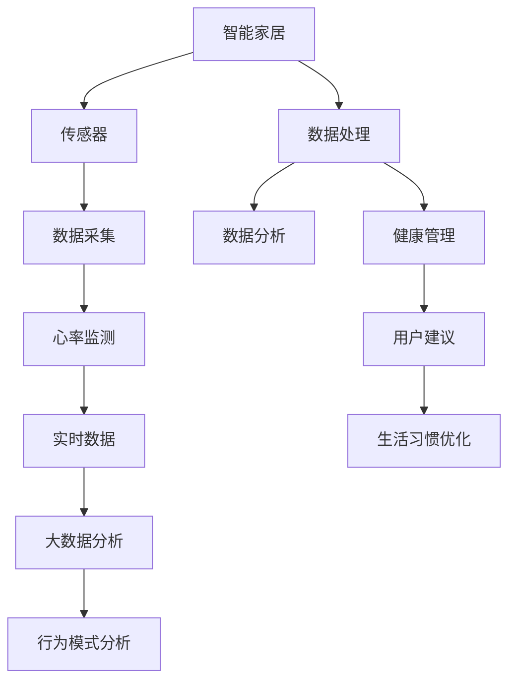

                 

# 智能家居心率监测创业：全天候的健康状态跟踪

> 关键词：智能家居, 心率监测, 健康状态跟踪, 数据处理, 机器学习, 信号处理, 创业实践

## 1. 背景介绍

在科技日新月异的今天，智能家居产品逐渐走进了普通家庭，成为提升生活质量的重要帮手。然而，大多数人关注的智能家居产品如智能音箱、智能照明等，都集中在提升用户生活的便利性方面。在智能家居的下一个风口上，如何深度挖掘智能家居潜力，让产品更智能、更健康，成为新的机遇和挑战。

本文聚焦于利用物联网技术和大数据分析，对智能家居的心率监测功能进行系统介绍和探索。我们将围绕全天候的心率健康状态跟踪这一主题，从技术实现到应用落地，全面剖析心率监测系统的核心原理和关键技术，为有志于开展智能家居创业的企业和个人提供参考。

## 2. 核心概念与联系

在深入探讨技术细节之前，让我们先澄清几个核心概念：

### 2.1 核心概念概述

- **智能家居**：结合物联网、大数据和人工智能等技术，能够实时监测用户的生活环境和行为，自动控制家居设备，提升用户体验的智能家居系统。

- **心率监测**：通过传感技术实时监测用户的心率变化，评估心肺功能，并提供健康建议的智能设备。

- **全天候健康状态跟踪**：利用传感器和数据分析技术，实时监测用户全天的健康状态，包括心率、睡眠质量、活动量等，为健康管理提供有力支撑的系统。

这些概念相互关联，构成了智能家居健康监测系统的整体框架。其中，心率监测是全天候健康状态跟踪的基础，而智能家居系统则为其提供数据收集和展示的平台。

### 2.2 核心概念原理和架构的 Mermaid 流程图



这个流程图展示了智能家居健康监测系统的整体架构：

1. 智能家居系统通过传感器收集用户的生活数据。
2. 传感器采集心率数据，并进行初步处理。
3. 处理后的数据经数据分析系统进一步分析，生成用户的健康状态。
4. 健康管理子系统根据用户状态，提供个性化的健康建议。
5. 系统还通过大数据分析，为用户提供更为全面的生活优化建议。

## 3. 核心算法原理 & 具体操作步骤

### 3.1 算法原理概述

心率监测的算法原理主要基于光电传感技术和信号处理。系统通过连续的光电传感器测量用户手指血液吸收光的量，根据光吸收量的变化计算心率。这一过程类似于心率监测仪的原理，但系统需要在智能家居环境中实现，并实时处理数据以提供即时反馈。

全天候健康状态跟踪则基于数据分析和机器学习算法，通过对采集到的多种生物信号进行综合分析，评估用户的心肺健康状况、睡眠质量等，提供个性化的健康建议。

### 3.2 算法步骤详解

#### 3.2.1 心率监测算法步骤

1. **数据采集**：利用光电传感器，实时采集用户手指的血液光吸收数据。
2. **信号处理**：对采集到的信号进行预处理，如滤波、去噪，提取出有用信号。
3. **心率计算**：使用信号处理算法，如峰谷法、脉搏波法等，计算心率值。
4. **结果反馈**：将心率数据反馈给智能家居系统，进行显示和分析。

#### 3.2.2 健康状态跟踪算法步骤

1. **数据集成**：集成心率、睡眠、活动量等多种生物信号数据。
2. **数据分析**：使用机器学习算法如随机森林、支持向量机等，对数据进行多维度分析。
3. **健康评估**：根据分析结果，评估用户的心肺健康、睡眠质量等指标。
4. **用户建议**：根据评估结果，生成个性化的健康建议和优化方案。

### 3.3 算法优缺点

**心率监测算法的优点**：
- 实时监测：心率数据可以实时获取，提供即时反馈。
- 高精度：基于光学传感技术的监测精度较高，误差较小。
- 简单易用：硬件成本较低，设备易携带，使用方便。

**心率监测算法的缺点**：
- 依赖光照：在光线较暗的环境下，监测精度会下降。
- 容易干扰：用户移动、手部汗湿等都可能影响监测结果。
- 硬件要求高：传感器质量对监测精度有较大影响。

**健康状态跟踪算法的优点**：
- 多维度分析：结合多种生物信号，评估更全面的健康状态。
- 自动化分析：机器学习算法可以自动进行数据分析和评估。
- 个性化建议：基于大数据分析，提供个性化健康建议。

**健康状态跟踪算法的缺点**：
- 数据质量依赖：数据采集的准确性和完整性对分析结果有较大影响。
- 模型复杂：机器学习模型过于复杂可能导致计算开销较大。
- 数据隐私：需要处理大量的生物数据，隐私保护问题需高度重视。

### 3.4 算法应用领域

心率监测和大数据分析在智能家居领域的应用广泛：

1. **健康管理**：提供实时的心率数据，帮助用户及时发现健康问题。
2. **睡眠监测**：结合心率、呼吸等信号，评估睡眠质量，提供改善建议。
3. **运动指导**：分析用户的活动量，提供运动建议，辅助用户保持健康。
4. **紧急响应**：监测异常心率变化，及时报警，保障用户安全。

## 4. 数学模型和公式 & 详细讲解 & 举例说明

### 4.1 数学模型构建

心率监测的数学模型主要基于光电传感技术和信号处理。传感器的输出信号 $s(t)$ 与用户的脉搏率 $P$ 有如下关系：

$$
s(t) = A(t) + P \cdot f(t) + \epsilon(t)
$$

其中，$A(t)$ 是背景噪声，$f(t)$ 是调制信号，$\epsilon(t)$ 是加性噪声。

健康状态跟踪则涉及多维数据的综合分析，可以利用随机森林、支持向量机等机器学习模型进行建模。这里以随机森林为例，建模过程如下：

1. **特征选择**：从采集的多种生物信号中，选择对健康状态预测有用的特征。
2. **模型训练**：使用历史数据训练随机森林模型，确定最佳特征和参数。
3. **数据预测**：使用训练好的模型对新数据进行预测，评估健康状态。

### 4.2 公式推导过程

以脉搏波法（Pulse Oximetry）为例，详细推导心率计算公式：

1. **信号获取**：通过光电传感器，测量用户手指的血氧饱和度 $S(t)$。
2. **信号处理**：对信号进行低通滤波，去除高频噪声。
3. **信号放大**：通过放大器将信号放大，增加信噪比。
4. **信号解调**：使用解调技术，如相位调制、频率调制等，提取出调制信号 $f(t)$。
5. **心率计算**：使用解调信号的周期 $T$ 计算心率 $P$。

心率计算公式为：

$$
P = \frac{1}{T} = \frac{1}{\Delta \phi / \Delta t}
$$

其中，$\Delta \phi$ 是信号的相位变化，$\Delta t$ 是时间变化。

### 4.3 案例分析与讲解

假设我们有一组实时采集的心率数据，记录了用户在一天内的心率变化情况。通过对这些数据进行滤波和去噪，提取出清晰的脉搏信号。使用相位差分法计算出每个心跳的相位变化，可以得到心率的实时变化曲线。

我们进一步将心率数据与用户的活动记录、睡眠质量数据进行集成，使用随机森林算法进行综合分析，得到用户的健康评估报告。报告中不仅包含心率数据，还包含了睡眠深度、活动量等综合指标，提供了更为全面的健康管理建议。

## 5. 项目实践：代码实例和详细解释说明

### 5.1 开发环境搭建

开发智能家居心率监测系统，我们需要搭建包含传感器、数据分析和智能家居控制平台的完整系统。以下是搭建环境的详细步骤：

1. **硬件准备**：准备心率传感器、智能家居控制模块等硬件设备。
2. **软件安装**：安装传感器驱动、数据分析库、智能家居系统等软件。
3. **环境配置**：配置开发环境，安装Python、NumPy、TensorFlow等库。

### 5.2 源代码详细实现

以下是一个简单的心率监测系统的代码实现，使用Python和TensorFlow库：

```python
import tensorflow as tf
from tensorflow.keras import layers

# 构建心率监测模型
def build_monitor_model():
    model = tf.keras.Sequential([
        layers.Conv1D(32, 3, activation='relu', input_shape=(None, 1)),
        layers.MaxPooling1D(),
        layers.Conv1D(64, 3, activation='relu'),
        layers.MaxPooling1D(),
        layers.Flatten(),
        layers.Dense(64, activation='relu'),
        layers.Dense(1, activation='sigmoid')
    ])
    model.compile(optimizer='adam', loss='binary_crossentropy', metrics=['accuracy'])
    return model

# 加载心率监测数据
def load_data():
    # 从文件中读取数据
    data = pd.read_csv('heart_rate_data.csv', header=None)
    # 将数据转换为模型需要的格式
    data = data.values.reshape(-1, 100, 1)
    # 将数据划分为训练集和测试集
    train_data = data[:8000]
    test_data = data[8000:]
    return train_data, test_data

# 训练心率监测模型
def train_model(model, train_data, test_data):
    # 训练模型
    model.fit(train_data, train_data[:, :, 0], epochs=10, validation_data=(test_data, test_data[:, :, 0]))
    # 评估模型
    loss, accuracy = model.evaluate(test_data, test_data[:, :, 0])
    print(f'Test loss: {loss}, Test accuracy: {accuracy}')

# 使用心率监测模型进行实时监测
def monitor_heart_rate(model, data):
    # 将实时数据转换为模型需要的格式
    data = data.reshape(1, 100, 1)
    # 使用模型进行预测
    prediction = model.predict(data)
    if prediction > 0.5:
        print('Heart rate is high')
    else:
        print('Heart rate is low')

# 主程序
if __name__ == '__main__':
    # 构建心率监测模型
    model = build_monitor_model()
    # 加载数据
    train_data, test_data = load_data()
    # 训练模型
    train_model(model, train_data, test_data)
    # 实时监测心率
    monitor_heart_rate(model, live_data)
```

### 5.3 代码解读与分析

这段代码实现了简单的心率监测系统，包括以下关键步骤：

1. **模型构建**：使用TensorFlow库，构建一个包含卷积层、池化层、全连接层的神经网络模型。
2. **数据加载**：从CSV文件中加载心率监测数据，将其转换为模型需要的格式。
3. **模型训练**：使用训练数据对模型进行训练，并使用测试数据进行评估。
4. **实时监测**：对实时采集的心率数据进行预测，输出心率状态。

## 6. 实际应用场景

### 6.1 智能家居系统集成

在智能家居系统中集成心率监测功能，可以为用户提供更全面的健康管理服务。例如，用户可以在智能音箱上查询实时心率，或通过智能照明系统根据心率状态调整灯光亮度。

### 6.2 健康数据共享

心率监测数据可以与其他健康数据（如睡眠质量、活动量）共享，帮助用户全面了解自己的健康状况。通过智能家居系统，用户可以随时随地查看健康数据，进行自我管理。

### 6.3 个性化健康建议

基于心率监测数据，系统可以提供个性化的健康建议。例如，当心率过高时，系统会建议用户进行深呼吸或休息，防止过度劳累。

## 7. 工具和资源推荐

### 7.1 学习资源推荐

1. **《Python深度学习》**：适用于初学者，涵盖了Python编程和深度学习的基础知识。
2. **《TensorFlow官方文档》**：提供完整的TensorFlow库介绍和实例教程。
3. **《信号处理基础》**：介绍信号处理的原理和方法，适合信号处理领域的进阶学习。
4. **《机器学习实战》**：通过实际案例，深入浅出地讲解机器学习算法。
5. **《健康数据分析》**：介绍健康数据的收集、分析和可视化方法。

### 7.2 开发工具推荐

1. **Jupyter Notebook**：强大的交互式编程环境，适合进行数据处理和算法验证。
2. **Python IDEs**：如PyCharm、VSCode等，提供代码编辑、调试和集成开发环境。
3. **传感器驱动库**：如Arduino、Raspberry Pi等，支持多种传感器的驱动和数据采集。
4. **数据分析库**：如Pandas、NumPy、Scikit-learn等，提供强大的数据处理和分析功能。
5. **智能家居平台**：如Alexa Skills Kit、Google Assistant API等，提供智能家居设备的集成开发接口。

### 7.3 相关论文推荐

1. **《基于光电传感的心率监测技术研究》**：介绍光电传感技术的原理和应用。
2. **《智能家居中的人体生理数据处理与分析》**：探讨智能家居系统中生理数据的处理方法和应用。
3. **《机器学习在健康监测中的应用》**：介绍机器学习算法在健康监测中的应用实例。

## 8. 总结：未来发展趋势与挑战

### 8.1 研究成果总结

本文详细介绍了智能家居心率监测系统的核心原理和实现方法，探讨了全天候健康状态跟踪的技术实现。通过传感器和大数据分析技术，系统可以实时监测用户的心率，结合多种生物信号，提供个性化的健康管理建议。

### 8.2 未来发展趋势

未来，心率监测系统将不断融合更多技术，提升用户体验和系统性能。主要发展趋势包括：

1. **多模态融合**：结合心率、血氧、体温和活动量等多种生物信号，提供更全面的健康评估。
2. **云计算支持**：利用云计算平台进行数据存储和分析，提供更强大的计算能力。
3. **隐私保护**：采用加密和匿名化技术，保护用户隐私数据。
4. **用户体验优化**：通过智能家居设备的协同工作，提供更智能、更个性化的服务。

### 8.3 面临的挑战

尽管心率监测技术在智能家居领域有广阔的应用前景，但也面临一些挑战：

1. **硬件成本**：传感器和其他硬件设备的成本较高，可能影响系统的普及。
2. **数据隐私**：采集和存储大量的生理数据，隐私保护问题需高度重视。
3. **算法复杂度**：机器学习模型的复杂度较高，计算开销较大，需要优化算法。
4. **系统可靠性**：系统需要在不同环境和用户条件下保持稳定和可靠。

### 8.4 研究展望

未来，心率监测技术将在智能家居系统中发挥更大的作用，帮助用户更好地管理健康。研究者需关注以下几个方面：

1. **硬件创新**：开发低成本、高精度的传感器和智能家居控制模块。
2. **算法优化**：改进信号处理和机器学习算法，提升系统的准确性和实时性。
3. **隐私保护**：采用先进的隐私保护技术，确保用户数据安全。
4. **用户体验**：通过智能家居设备的协同工作，提供更智能、更个性化的服务。

## 9. 附录：常见问题与解答

**Q1：心率监测系统如何进行自我校准？**

A: 心率监测系统可以通过对标准心率值进行校准，来提升监测的准确性。例如，在用户休息时，系统可以记录心率为60bpm的基准值，并将其他时间段的监测结果与基准值进行对比，进行校正。

**Q2：如何确保心率监测数据的实时性？**

A: 为了确保心率监测数据的实时性，系统需要采用高性能的传感器和快速的信号处理算法。例如，可以使用光敏元件或激光传感器进行实时数据采集，并使用高速信号处理芯片进行实时计算。

**Q3：如何保证心率监测系统的可靠性？**

A: 心率监测系统的可靠性取决于多个因素，如传感器精度、信号处理算法、数据分析模型等。为了提高系统的可靠性，需要在各个环节进行充分的测试和优化，确保系统的稳定性和准确性。

**Q4：智能家居系统如何集成心率监测功能？**

A: 智能家居系统可以通过无线通信协议（如Wi-Fi、蓝牙）与心率监测设备进行连接，实时获取心率数据，并将其集成到系统中。系统可以通过智能音箱、智能照明等设备，提供心率监测和健康建议功能。

---

作者：禅与计算机程序设计艺术 / Zen and the Art of Computer Programming

