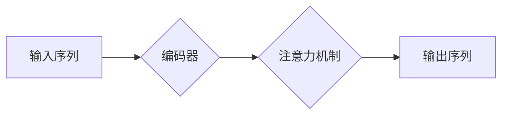

> 序列模型，注意力机制，自然语言处理，机器学习，深度学习，Transformer，BERT，GPT

## 1. 背景介绍

在当今数据爆炸的时代，处理和理解序列数据成为了一个至关重要的任务。从自然语言文本到时间序列数据，从基因序列到音乐旋律，各种各样的信息都以序列的形式存在。传统的机器学习方法在处理序列数据时往往面临着效率低下和表达能力不足的挑战。

序列模型的出现为处理序列数据提供了新的思路。它能够学习序列中元素之间的依赖关系，并根据上下文信息进行预测或生成。注意力机制作为序列模型的重要组成部分，进一步提升了模型的表达能力和准确性。

## 2. 核心概念与联系

### 2.1 序列模型

序列模型是一种专门用于处理顺序数据（如文本、音频、时间序列等）的机器学习模型。它通过学习序列中元素之间的依赖关系，来预测下一个元素或整个序列的输出。常见的序列模型包括：

* **循环神经网络（RNN）:** RNN 通过隐藏状态来记忆序列的历史信息，并将其传递到下一个时间步。
* **长短期记忆网络（LSTM）:** LSTM 是一种改进的 RNN，能够更好地处理长序列数据，因为它引入了门控机制来控制信息的流动。
* **双向循环神经网络（Bi-RNN）:** Bi-RNN 使用两个方向的 RNN 来处理序列，分别从左到右和从右到左，从而获得更全面的上下文信息。

### 2.2 注意力机制

注意力机制是一种用于学习序列中重要元素的机制。它允许模型关注序列中与当前任务最相关的部分，并根据这些部分的权重进行加权求和，从而获得更精细的表示。

注意力机制的引入可以解决 RNN 在处理长序列数据时容易出现梯度消失或爆炸的问题。它可以帮助模型更好地理解上下文信息，并提高模型的准确性。

### 2.3 序列模型与注意力机制的联系

注意力机制可以作为序列模型的扩展，用于提升模型的表达能力和准确性。例如，在机器翻译任务中，注意力机制可以帮助模型关注源语言中与目标语言单词相关的部分，从而提高翻译质量。

**Mermaid 流程图**



## 3. 核心算法原理 & 具体操作步骤

### 3.1 算法原理概述

注意力机制的核心思想是学习每个元素对当前任务的贡献度，并根据这些贡献度进行加权求和。

### 3.2 算法步骤详解

1. **计算查询（Query）、键（Key）和值（Value）:** 将输入序列映射到三个向量空间，分别为查询空间、键空间和值空间。
2. **计算注意力分数:** 计算查询向量与每个键向量的相似度，通常使用点积或余弦相似度。
3. **归一化注意力分数:** 使用 softmax 函数将注意力分数归一化，得到每个元素的注意力权重。
4. **加权求和:** 将每个元素的值向量与其对应的注意力权重相乘，并求和，得到最终的输出。

### 3.3 算法优缺点

**优点:**

* 能够学习序列中重要元素的权重，提高模型的表达能力。
* 可以处理长序列数据，并有效缓解梯度消失问题。

**缺点:**

* 计算复杂度较高，训练时间较长。
* 需要大量的训练数据才能达到最佳效果。

### 3.4 算法应用领域

注意力机制广泛应用于自然语言处理、计算机视觉、语音识别等领域，例如：

* **机器翻译:** 关注源语言中与目标语言单词相关的部分。
* **文本摘要:** 关注文本中最重要的句子或段落。
* **图像识别:** 关注图像中与目标物体相关的区域。

## 4. 数学模型和公式 & 详细讲解 & 举例说明

### 4.1 数学模型构建

设输入序列为 $X = \{x_1, x_2, ..., x_n\}$, 其中 $x_i$ 为序列中的第 $i$ 个元素。

* **查询向量:** $q_i = W_q x_i$
* **键向量:** $k_j = W_k x_j$
* **值向量:** $v_j = W_v x_j$

其中，$W_q$, $W_k$, $W_v$ 为可学习的权重矩阵。

### 4.2 公式推导过程

注意力分数计算公式:

$$
\alpha_{ij} = \frac{\exp(q_i \cdot k_j)}{\sum_{l=1}^{n} \exp(q_i \cdot k_l)}
$$

其中，$\alpha_{ij}$ 为查询向量 $q_i$ 与键向量 $k_j$ 的注意力分数。

最终输出计算公式:

$$
\hat{x}_i = \sum_{j=1}^{n} \alpha_{ij} v_j
$$

其中，$\hat{x}_i$ 为查询向量 $q_i$ 的注意力加权输出。

### 4.3 案例分析与讲解

假设我们有一个句子 "The cat sat on the mat."，我们想要使用注意力机制来理解每个单词对句子的贡献。

我们可以将每个单词作为序列中的元素，并计算每个单词与其他单词的注意力分数。例如，单词 "cat" 的注意力分数会较高，因为它与句子中的核心事件 "sat" 相关。

通过观察注意力分数的分布，我们可以更好地理解句子中的语义关系和重要信息。

## 5. 项目实践：代码实例和详细解释说明

### 5.1 开发环境搭建

* Python 3.6+
* TensorFlow 或 PyTorch

### 5.2 源代码详细实现

```python
import tensorflow as tf

# 定义注意力机制层
class Attention(tf.keras.layers.Layer):
    def __init__(self, units):
        super(Attention, self).__init__()
        self.Wq = tf.keras.layers.Dense(units)
        self.Wk = tf.keras.layers.Dense(units)
        self.Wv = tf.keras.layers.Dense(units)
        self.softmax = tf.keras.layers.Softmax()

    def call(self, query, key, value, mask=None):
        # 计算注意力分数
        scores = tf.matmul(self.Wq(query), self.Wk(key), transpose_b=True)
        if mask is not None:
            scores += (mask * -1e9)
        attention_weights = self.softmax(scores)

        # 计算加权求和
        context_vector = tf.matmul(attention_weights, value)
        return context_vector

# 定义序列模型
class Seq2Seq(tf.keras.Model):
    def __init__(self, encoder_units, decoder_units):
        super(Seq2Seq, self).__init__()
        self.encoder = tf.keras.layers.LSTM(encoder_units)
        self.decoder = tf.keras.layers.LSTM(decoder_units)
        self.attention = Attention(decoder_units)

    def call(self, inputs, targets, training=False):
        # 编码器
        encoder_outputs, _ = self.encoder(inputs)

        # 解码器
        decoder_outputs = []
        decoder_input = tf.zeros((1, self.decoder.units))
        for t in range(targets.shape[1]):
            context_vector = self.attention(decoder_input, encoder_outputs, encoder_outputs)
            decoder_input = tf.concat([context_vector, decoder_input], axis=-1)
            decoder_output = self.decoder(decoder_input, training=training)
            decoder_outputs.append(decoder_output)
        return tf.stack(decoder_outputs, axis=1)

# 实例化模型
model = Seq2Seq(encoder_units=128, decoder_units=64)

# 训练模型
model.compile(optimizer='adam', loss='mse')
model.fit(inputs, targets, epochs=10)
```

### 5.3 代码解读与分析

* **Attention 层:** 计算注意力分数并进行加权求和。
* **Seq2Seq 模型:** 包含编码器和解码器，使用注意力机制来处理序列数据。
* **训练模型:** 使用 Adam 优化器和均方误差损失函数训练模型。

### 5.4 运行结果展示

训练完成后，模型可以用于预测新的序列数据。例如，可以输入一个句子，模型可以预测下一个单词。

## 6. 实际应用场景

### 6.1 机器翻译

注意力机制可以帮助机器翻译模型更好地理解源语言和目标语言之间的语义关系，从而提高翻译质量。

### 6.2 文本摘要

注意力机制可以帮助文本摘要模型识别文本中最关键的信息，并生成简洁准确的摘要。

### 6.3 图像识别

注意力机制可以帮助图像识别模型关注图像中与目标物体相关的区域，从而提高识别准确率。

### 6.4 未来应用展望

注意力机制在未来将有更广泛的应用，例如：

* **对话系统:** 帮助对话系统更好地理解用户意图和上下文信息。
* **推荐系统:** 帮助推荐系统个性化推荐物品或内容。
* **药物研发:** 帮助药物研发人员发现新的药物靶点和候选药物。

## 7. 工具和资源推荐

### 7.1 学习资源推荐

* **书籍:**
    * "深度学习" by Ian Goodfellow, Yoshua Bengio, and Aaron Courville
    * "自然语言处理入门" by Jacob Eisenstein
* **在线课程:**
    * Coursera: "Deep Learning Specialization" by Andrew Ng
    * Udacity: "Deep Learning Nanodegree"

### 7.2 开发工具推荐

* **TensorFlow:** 开源深度学习框架
* **PyTorch:** 开源深度学习框架
* **Hugging Face Transformers:** 提供预训练的 Transformer 模型和工具

### 7.3 相关论文推荐

* "Attention Is All You Need" by Vaswani et al. (2017)
* "BERT: Pre-training of Deep Bidirectional Transformers for Language Understanding" by Devlin et al. (2018)
* "GPT-3: Language Models are Few-Shot Learners" by Brown et al. (2020)

## 8. 总结：未来发展趋势与挑战

### 8.1 研究成果总结

注意力机制在自然语言处理、计算机视觉等领域取得了显著的成果，显著提升了模型的性能。

### 8.2 未来发展趋势

* **更强大的注意力机制:** 研究更有效的注意力机制，例如自注意力机制、多头注意力机制等。
* **注意力机制的泛化:** 将注意力机制应用到更多领域，例如时间序列分析、药物研发等。
* **注意力机制的可解释性:** 研究如何解释注意力机制的决策过程，提高模型的可解释性。

### 8.3 面临的挑战

* **计算复杂度:** 复杂的注意力机制计算量较大，需要更高效的算法和硬件支持。
* **数据依赖性:** 注意力机制需要大量的训练数据才能达到最佳效果。
* **可解释性:** 注意力机制的决策过程往往难以解释，这限制了其在一些应用场景中的使用。

### 8.4 研究展望

未来，注意力机制将继续是人工智能领域的重要研究方向，并将在更多领域发挥重要作用。


## 9. 附录：常见问题与解答

**Q1: 注意力机制与RNN的区别是什么？**

**A1:** RNN 可以处理序列数据，但容易出现梯度消失或爆炸问题。注意力机制可以缓解这些问题，并提高模型的表达能力。

**Q2: 注意力机制的计算复杂度如何？**

**A2:** 注意力机制的计算复杂度较高，特别是对于长序列数据。

**Q3: 如何解释注意力机制的决策过程？**

**A3:** 注意力机制的决策过程往往难以解释，这是一个目前的研究热点。


作者：禅与计算机程序设计艺术 / Zen and the Art of Computer Programming