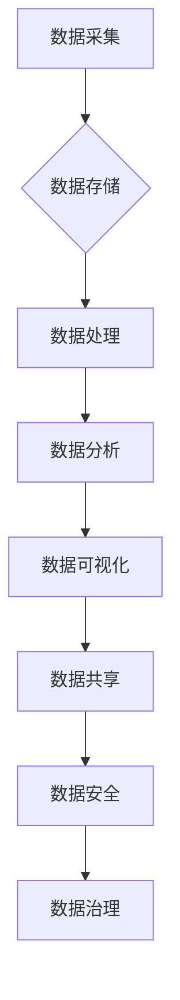

> 人工智能、数据管理、数据策略、数据安全、数据治理、数据可视化、数据分析

## 1. 背景介绍

人工智能（AI）技术近年来发展迅速，已渗透到各个行业，为企业带来了巨大的机遇和挑战。AI创业公司在发展过程中，数据成为了核心资产，数据管理的有效性直接关系到企业的成功与否。然而，许多AI创业公司在数据管理方面存在着诸多问题，例如数据孤岛、数据质量低、数据安全风险高等。

随着AI技术的不断发展，数据量呈指数级增长，数据管理的复杂性也随之增加。AI创业公司需要建立一套完善的数据管理体系，才能有效利用数据，推动业务发展。

## 2. 核心概念与联系

**2.1 数据管理的核心概念**

数据管理是指对数据的整个生命周期进行规划、组织、控制和维护的过程。它包括数据采集、存储、处理、分析、共享和安全等多个方面。

**2.2 数据管理与AI的关系**

AI技术依赖于海量数据进行训练和学习。数据管理是AI技术应用的基础，也是AI技术发展的重要保障。

**2.3 数据管理策略与措施**

数据管理策略是指企业在数据管理方面制定的总体目标、原则和方法。数据管理措施是指为实现数据管理策略而采取的具体行动。

**2.4 数据管理体系架构**



## 3. 核心算法原理 & 具体操作步骤

**3.1 算法原理概述**

数据管理中常用的算法包括数据清洗算法、数据归一化算法、数据聚类算法等。这些算法可以帮助企业提高数据质量、降低数据冗余、发现数据模式等。

**3.2 算法步骤详解**

以数据清洗算法为例，其步骤包括：

1. 数据收集：从各种数据源收集数据。
2. 数据预处理：对数据进行格式转换、缺失值处理等预处理操作。
3. 数据清洗：根据预设的规则，对数据进行错误值修正、重复值删除等操作。
4. 数据验证：对清洗后的数据进行验证，确保数据质量。
5. 数据存储：将清洗后的数据存储到数据库或其他存储系统中。

**3.3 算法优缺点**

不同的数据管理算法具有不同的优缺点，需要根据实际情况选择合适的算法。

**3.4 算法应用领域**

数据管理算法广泛应用于各个行业，例如金融、医疗、电商等。

## 4. 数学模型和公式 & 详细讲解 & 举例说明

**4.1 数学模型构建**

数据管理中常用的数学模型包括数据关联度模型、数据相似度模型等。这些模型可以帮助企业量化数据之间的关系，发现数据之间的潜在联系。

**4.2 公式推导过程**

以数据关联度模型为例，其公式如下：

$$
关联度 = \frac{支持度 * 置信度}{支持度}
$$

其中：

* 支持度：数据项同时出现的频率。
* 置信度：在给定一个数据项的情况下，另一个数据项出现的概率。

**4.3 案例分析与讲解**

假设我们有一个电商平台的数据集，其中包含用户购买商品的信息。我们可以使用数据关联度模型来发现用户购买商品的关联关系。例如，我们可以发现用户购买笔记本电脑的概率，在同时购买鼠标和键盘的情况下会显著提高。

## 5. 项目实践：代码实例和详细解释说明

**5.1 开发环境搭建**

可以使用Python语言和相关的库来实现数据管理功能。例如，可以使用Pandas库进行数据处理，Scikit-learn库进行数据分析，Matplotlib库进行数据可视化等。

**5.2 源代码详细实现**

```python
import pandas as pd

# 数据加载
data = pd.read_csv('data.csv')

# 数据清洗
data.dropna(inplace=True)
data.drop_duplicates(inplace=True)

# 数据分析
average_purchase = data['purchase_amount'].mean()
print(f'平均购买金额: {average_purchase}')

# 数据可视化
import matplotlib.pyplot as plt
plt.hist(data['purchase_amount'])
plt.show()
```

**5.3 代码解读与分析**

这段代码首先加载了数据，然后对数据进行了清洗，包括删除缺失值和重复值。接着，对数据进行了分析，计算了平均购买金额。最后，使用Matplotlib库绘制了购买金额的直方图。

**5.4 运行结果展示**

运行代码后，会输出平均购买金额，并显示购买金额的直方图。

## 6. 实际应用场景

**6.1 数据驱动决策**

AI创业公司可以利用数据分析结果，为决策提供数据支持，例如制定营销策略、优化产品设计等。

**6.2 个性化服务**

AI创业公司可以利用数据分析结果，为用户提供个性化服务，例如推荐商品、提供定制化服务等。

**6.3 风险控制**

AI创业公司可以利用数据分析结果，识别潜在风险，并采取措施进行风险控制。

**6.4 未来应用展望**

随着AI技术的不断发展，数据管理在AI创业公司中的应用场景将更加广泛。例如，可以利用数据分析预测用户行为，优化资源分配，提高运营效率等。

## 7. 工具和资源推荐

**7.1 学习资源推荐**

* 《数据科学实战》
* 《Python数据分析》
* 《机器学习》

**7.2 开发工具推荐**

* Python
* Pandas
* Scikit-learn
* Matplotlib

**7.3 相关论文推荐**

* 《数据管理在人工智能时代的角色》
* 《人工智能创业数据管理的策略与措施》

## 8. 总结：未来发展趋势与挑战

**8.1 研究成果总结**

本文分析了数据管理在AI创业公司中的重要性，介绍了数据管理的核心概念、算法、数学模型等，并通过代码实例展示了数据管理的具体操作步骤。

**8.2 未来发展趋势**

未来，数据管理将更加智能化、自动化，并与其他技术融合，例如云计算、大数据等。

**8.3 面临的挑战**

数据管理面临着数据量大、数据质量低、数据安全风险高等挑战。

**8.4 研究展望**

未来研究方向包括：

* 开发更智能的数据管理算法。
* 建立更完善的数据管理体系。
* 探索数据管理与其他技术的融合应用。

## 9. 附录：常见问题与解答

**9.1 如何提高数据质量？**

可以通过数据清洗、数据标准化等方法提高数据质量。

**9.2 如何保障数据安全？**

可以通过数据加密、访问控制等措施保障数据安全。

**9.3 如何进行数据分析？**

可以使用数据分析工具，例如Python、R等进行数据分析。


作者：禅与计算机程序设计艺术 / Zen and the Art of Computer Programming 
<end_of_turn>