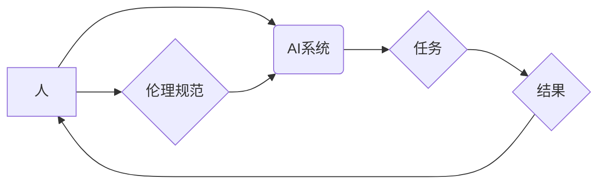

> 人机协作，伦理规范，人工智能，道德准则，责任分配，透明度，可解释性，公平性，安全保障

## 1. 背景介绍

随着人工智能（AI）技术的飞速发展，人机协作已成为一个不可避免的趋势。AI系统能够辅助人类完成复杂的任务，提高工作效率，并为人类创造新的价值。然而，人机协作也带来了新的伦理挑战，需要我们认真思考和探讨。

**1.1 人机协作的定义和类型**

人机协作是指人类和人工智能系统共同完成任务的过程。这种协作可以是人类主导，AI辅助完成任务；也可以是AI主导，人类监督和指导AI完成任务。

常见的协作类型包括：

* **监督式协作:** 人类提供指令和反馈，指导AI完成任务。
* **合作式协作:** 人类和AI共同制定目标和策略，并协同完成任务。
* **自主式协作:** AI系统能够独立完成任务，但仍需人类进行监督和评估。

**1.2 人机协作的优势和挑战**

人机协作具有许多优势，例如：

* **提高效率:** AI系统能够快速处理大量数据，并执行重复性任务，从而提高工作效率。
* **增强创造力:** 人类和AI可以互相补充，共同激发创造力，解决复杂问题。
* **拓展能力:** AI系统可以帮助人类扩展能力，例如识别图像、翻译语言、分析数据等。

然而，人机协作也面临一些挑战：

* **伦理问题:** AI系统可能会做出不可预知的决策，引发伦理争议。
* **责任分配:** 当AI系统出现错误时，责任应该由谁承担？
* **透明度和可解释性:** AI系统的决策过程往往难以理解，这可能会导致信任问题。
* **公平性:** AI系统可能会存在偏见，导致不公平的结果。
* **安全保障:** AI系统可能会被恶意利用，造成安全风险。

## 2. 核心概念与联系

**2.1 人机协作的伦理规范**

人机协作的伦理规范是指指导人机协作行为的道德准则和原则。这些规范旨在确保人机协作过程中的公平、透明、安全和可控性。

**2.2 核心概念关系图**



**2.3 伦理规范的制定原则**

制定人机协作的伦理规范应遵循以下原则：

* **尊重人类尊严:** 人类应始终是人机协作过程中的主体，AI系统应服务于人类，而不是取代人类。
* **公平公正:** 人机协作系统应公平对待所有用户，避免歧视和偏见。
* **透明可解释:** 人机协作系统的决策过程应透明可解释，以便人类能够理解和监督AI系统的行为。
* **安全可靠:** 人机协作系统应安全可靠，避免造成伤害或损失。
* **责任追究:** 人机协作过程中出现的错误或问题，应明确责任主体，并进行相应的追责。

## 3. 核心算法原理 & 具体操作步骤

**3.1 算法原理概述**

人机协作中的核心算法通常涉及机器学习、自然语言处理、强化学习等领域。这些算法旨在帮助AI系统理解人类意图，并与人类进行有效的交互。

**3.2 算法步骤详解**

具体算法步骤取决于具体的应用场景，但一般包括以下几个步骤：

1. **数据收集和预处理:** 收集与任务相关的训练数据，并进行预处理，例如清洗、格式化等。
2. **模型训练:** 使用训练数据训练AI模型，例如训练一个分类模型、一个生成模型或一个强化学习模型。
3. **模型评估:** 使用测试数据评估模型的性能，例如准确率、召回率、F1-score等。
4. **模型部署:** 将训练好的模型部署到实际应用环境中，例如部署到云平台、嵌入式设备等。
5. **用户交互:** 用户与AI系统进行交互，例如输入文本、语音指令、图像等。
6. **结果反馈:** AI系统根据用户输入和模型训练结果，生成相应的输出，例如文本、语音、图像等。

**3.3 算法优缺点**

不同的算法具有不同的优缺点，需要根据具体的应用场景选择合适的算法。

**3.4 算法应用领域**

人机协作算法广泛应用于各个领域，例如：

* **医疗保健:** AI辅助医生诊断疾病、制定治疗方案。
* **教育:** AI个性化教学，帮助学生提高学习效率。
* **金融:** AI辅助金融分析师进行风险评估、投资决策。
* **制造业:** AI辅助机器人进行生产操作，提高生产效率。

## 4. 数学模型和公式 & 详细讲解 & 举例说明

**4.1 数学模型构建**

人机协作中的数学模型通常用于描述人机交互过程、预测AI系统的行为、评估协作效果等。

例如，可以使用马尔可夫决策过程（MDP）模型来描述人机协作过程，其中状态表示人机协作系统的当前状态，动作表示人类或AI系统可以采取的行动，奖励表示协作过程中的收益。

**4.2 公式推导过程**

MDP模型的价值函数可以用来评估不同状态下的人机协作价值。价值函数的更新公式如下：

$$
V(s) = \max_{\alpha} \sum_{s' \in S} P(s' | s, \alpha) [R(s, \alpha, s') + \gamma V(s')]
$$

其中：

* $V(s)$ 表示状态 $s$ 的价值。
* $\alpha$ 表示AI系统采取的动作。
* $S$ 表示所有可能的系统状态。
* $P(s' | s, \alpha)$ 表示从状态 $s$ 到状态 $s'$ 的转移概率。
* $R(s, \alpha, s')$ 表示从状态 $s$ 执行动作 $\alpha$ 到状态 $s'$ 的奖励。
* $\gamma$ 表示折扣因子，控制未来奖励的权重。

**4.3 案例分析与讲解**

例如，在医疗诊断领域，可以使用MDP模型来描述医生和AI系统之间的协作过程。

状态可以表示患者的病情，动作可以表示医生或AI系统可以采取的诊断或治疗方案，奖励可以表示诊断或治疗的准确性。通过训练MDP模型，可以学习到最佳的诊断和治疗策略，提高医疗诊断的准确性。

## 5. 项目实践：代码实例和详细解释说明

**5.1 开发环境搭建**

人机协作项目开发环境通常需要包含以下软件：

* **编程语言:** Python、Java、C++等。
* **机器学习框架:** TensorFlow、PyTorch、Scikit-learn等。
* **自然语言处理库:** NLTK、spaCy、HuggingFace等。
* **数据库:** MySQL、MongoDB等。

**5.2 源代码详细实现**

以下是一个简单的基于Python和TensorFlow的人机协作聊天机器人代码示例：

```python
import tensorflow as tf

# 定义模型
model = tf.keras.Sequential([
    tf.keras.layers.Embedding(input_dim=10000, output_dim=128),
    tf.keras.layers.LSTM(128),
    tf.keras.layers.Dense(10000, activation='softmax')
])

# 训练模型
# ...

# 用户交互
while True:
    user_input = input("用户: ")
    # 将用户输入转换为模型输入格式
    # ...
    # 使用模型预测回复
    prediction = model.predict(user_input)
    # 将预测结果转换为文本回复
    # ...
    print("机器人: ", response)
```

**5.3 代码解读与分析**

该代码示例定义了一个简单的基于LSTM的聊天机器人模型。模型输入是用户输入的文本，输出是预测的回复文本。

**5.4 运行结果展示**

运行该代码后，用户可以与聊天机器人进行交互，聊天机器人会根据用户输入生成相应的回复。

## 6. 实际应用场景

**6.1 医疗保健**

* AI辅助医生诊断疾病，例如根据患者的症状和检查结果，预测疾病的可能性。
* AI辅助制定个性化治疗方案，根据患者的基因信息、生活习惯等因素，推荐最佳的治疗方案。

**6.2 教育**

* AI个性化教学，根据学生的学习进度和能力，提供个性化的学习内容和练习。
* AI辅助教师批改作业，节省教师的时间，提高批改效率。

**6.3 金融**

* AI辅助金融分析师进行风险评估，预测投资的收益和风险。
* AI辅助客户服务，例如回答客户的常见问题，处理简单的客户请求。

**6.4 未来应用展望**

人机协作技术将继续发展，并在更多领域得到应用，例如：

* **自动驾驶:** AI辅助驾驶员驾驶车辆，提高驾驶安全性和效率。
* **机器人服务:** AI赋予机器人更强的智能和交互能力，用于提供更便捷的服务。
* **科学研究:** AI辅助科学家进行数据分析和模型构建，加速科学研究的进程。

## 7. 工具和资源推荐

**7.1 学习资源推荐**

* **书籍:**
    * 人工智能：一种现代方法
    * 深度学习
    * 人机协作：理论与实践
* **在线课程:**
    * Coursera 人工智能课程
    * edX 深度学习课程
    * Udacity 人机协作课程

**7.2 开发工具推荐**

* **编程语言:** Python、Java、C++
* **机器学习框架:** TensorFlow、PyTorch、Scikit-learn
* **自然语言处理库:** NLTK、spaCy、HuggingFace

**7.3 相关论文推荐**

* 人机协作中的伦理问题
* 人机协作的未来发展趋势
* 人机协作的算法设计与实现

## 8. 总结：未来发展趋势与挑战

**8.1 研究成果总结**

近年来，人机协作领域取得了显著的进展，AI系统已经能够在许多领域与人类有效协作。

**8.2 未来发展趋势**

未来，人机协作技术将朝着以下方向发展：

* **更智能的AI系统:** AI系统将更加智能，能够更好地理解人类意图，并提供更精准的帮助。
* **更自然的交互方式:** 人机交互方式将更加自然，例如语音交互、手势交互等。
* **更广泛的应用场景:** 人机协作技术将应用于更多领域，例如医疗保健、教育、金融、制造业等。

**8.3 面临的挑战**

人机协作技术也面临一些挑战：

* **伦理问题:** 人机协作可能会引发伦理争议，例如AI系统是否应该拥有自主权？
* **安全问题:** AI系统可能会被恶意利用，造成安全风险。
* **公平问题:** AI系统可能会存在偏见，导致不公平的结果。

**8.4 研究展望**

未来，我们需要继续研究和探索人机协作的伦理规范、安全保障、公平性等问题，确保人机协作技术能够安全、有效、公平地服务于人类。

## 9. 附录：常见问题与解答

**9.1 AI系统是否会取代人类？**

AI系统可以辅助人类完成许多任务，但目前还无法完全取代人类。人类拥有创造力、想象力和情感等特质，这些特质是AI系统无法替代的。

**9.2 人机协作过程中，谁应该承担责任？**

人机协作过程中，责任应该由人类和AI系统共同承担。人类应该对AI系统的设计、训练和使用负责，而AI系统应该在人类的监督下安全、可靠地运行。

**9.3 如何确保AI系统的公平性？**

确保AI系统的公平性需要从多个方面入手，例如：

* 使用多元化的训练数据，避免AI系统学习到偏见