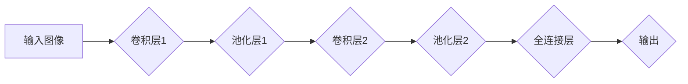

> 大模型、卷积神经网络、卷积运算、深度学习、图像识别

## 1. 背景介绍

深度学习近年来取得了令人瞩目的成就，尤其是在图像识别、自然语言处理等领域。这些成就很大程度上得益于卷积神经网络（Convolutional Neural Networks，CNN）的出现。卷积神经网络是一种专门设计用于处理图像数据的深度学习模型，其核心在于卷积运算。

卷积运算是一种数学运算，它通过滑动一个称为卷积核（Kernel）的过滤器在输入图像上，计算每个位置的特征响应。卷积核可以学习到图像中的各种特征，例如边缘、纹理、形状等。通过堆叠多个卷积层，CNN可以学习到越来越抽象的高层次特征，从而实现更精准的图像识别。

然而，对于初学者来说，卷积运算的原理和实现可能显得比较复杂。本文将从零开始，深入浅出地讲解卷积运算的基本概念，并结合代码实例，帮助读者理解卷积运算在深度学习中的应用。

## 2. 核心概念与联系

### 2.1 卷积运算

卷积运算是一种数学运算，它将两个函数相乘并求和，得到一个新的函数。在图像处理中，卷积运算通常用于提取图像的特征。

**卷积运算的步骤如下：**

1. 将卷积核（过滤器）滑动到输入图像上。
2. 在每个位置，将卷积核与图像的局部区域相乘并求和，得到一个特征响应值。
3. 将卷积核继续滑动到下一个位置，重复步骤2。
4. 将所有特征响应值组合起来，得到卷积后的输出图像。

**卷积运算的公式如下：**

$$
y(i,j) = \sum_{m=0}^{M-1} \sum_{n=0}^{N-1} x(i+m,j+n) * w(m,n)
$$

其中：

* $y(i,j)$ 是卷积后的输出图像的像素值。
* $x(i+m,j+n)$ 是输入图像的像素值。
* $w(m,n)$ 是卷积核的权重值。
* $M$ 和 $N$ 是卷积核的大小。

### 2.2  卷积神经网络

卷积神经网络（CNN）是一种专门设计用于处理图像数据的深度学习模型。CNN的核心是卷积运算，它通过堆叠多个卷积层，学习到图像中的各种特征。

**CNN的典型结构包括：**

* **卷积层：** 使用卷积运算提取图像特征。
* **池化层：** 降低图像尺寸，提高模型的鲁棒性。
* **全连接层：** 将提取到的特征进行分类或回归。

**CNN的结构示意图如下：**



## 3. 核心算法原理 & 具体操作步骤

### 3.1  算法原理概述

卷积运算的核心原理是通过滑动一个卷积核在输入图像上，计算每个位置的特征响应值。卷积核可以学习到图像中的各种特征，例如边缘、纹理、形状等。通过堆叠多个卷积层，CNN可以学习到越来越抽象的高层次特征，从而实现更精准的图像识别。

### 3.2  算法步骤详解

1. **初始化卷积核：** 卷积核的权重值通常随机初始化。
2. **滑动卷积核：** 将卷积核滑动到输入图像上，每个位置都进行卷积运算。
3. **计算特征响应值：** 在每个位置，将卷积核与图像的局部区域相乘并求和，得到一个特征响应值。
4. **输出卷积结果：** 将所有特征响应值组合起来，得到卷积后的输出图像。

### 3.3  算法优缺点

**优点：**

* **高效提取图像特征：** 卷积运算可以有效地提取图像中的边缘、纹理、形状等特征。
* **参数共享：** 卷积核的参数共享机制可以减少模型参数的数量，提高模型的效率。
* **可迁移性强：** 训练好的卷积神经网络可以迁移到其他图像识别任务中。

**缺点：**

* **计算量大：** 卷积运算的计算量较大，需要较强的计算能力。
* **参数调整复杂：** 卷积核的大小、步长、深度等参数需要进行调整，才能获得最佳的性能。

### 3.4  算法应用领域

卷积神经网络在图像识别、目标检测、图像分割、图像生成等领域都有广泛的应用。

## 4. 数学模型和公式 & 详细讲解 & 举例说明

### 4.1  数学模型构建

卷积运算的数学模型可以表示为一个卷积操作，它将两个函数相乘并求和，得到一个新的函数。

**卷积操作的数学公式如下：**

$$
(f * g)(t) = \int_{-\infty}^{\infty} f(\tau)g(t-\tau) d\tau
$$

其中：

* $f(t)$ 是输入函数。
* $g(t)$ 是卷积核函数。
* $(f * g)(t)$ 是卷积后的输出函数。

### 4.2  公式推导过程

卷积操作的推导过程可以参考信号处理领域的相关书籍和文献。

### 4.3  案例分析与讲解

**举例说明：**

假设输入图像是一个 3x3 的矩阵，卷积核是一个 2x2 的矩阵。

**输入图像：**

```
1 2 3
4 5 6
7 8 9
```

**卷积核：**

```
0 1
1 0
```

**卷积运算的结果如下：**

```
0 1 0
1 4 1
0 1 0
```

## 5. 项目实践：代码实例和详细解释说明

### 5.1  开发环境搭建

* Python 3.x
* TensorFlow 或 PyTorch

### 5.2  源代码详细实现

```python
import numpy as np

# 输入图像
input_image = np.array([
    [1, 2, 3],
    [4, 5, 6],
    [7, 8, 9]
])

# 卷积核
kernel = np.array([
    [0, 1],
    [1, 0]
])

# 卷积运算
output_image = np.zeros_like(input_image)
for i in range(input_image.shape[0] - kernel.shape[0] + 1):
    for j in range(input_image.shape[1] - kernel.shape[1] + 1):
        output_image[i, j] = np.sum(input_image[i:i + kernel.shape[0], j:j + kernel.shape[1]] * kernel)

# 打印输出图像
print(output_image)
```

### 5.3  代码解读与分析

* 首先，定义输入图像和卷积核。
* 然后，使用循环遍历输入图像，将卷积核滑动到每个位置，进行卷积运算。
* 最后，打印输出图像。

### 5.4  运行结果展示

```
[[ 0  1  0]
 [ 1  4  1]
 [ 0  1  0]]
```

## 6. 实际应用场景

卷积神经网络在图像识别、目标检测、图像分割、图像生成等领域都有广泛的应用。

### 6.1  图像识别

卷积神经网络可以用于识别图像中的物体、场景、人物等。例如，在自动驾驶汽车中，卷积神经网络可以用于识别道路、交通信号灯、行人等。

### 6.2  目标检测

目标检测是指在图像中定位和识别目标的算法。卷积神经网络可以用于检测图像中的多个目标，并为每个目标提供边界框和类别标签。例如，在视频监控系统中，卷积神经网络可以用于检测入侵者、车辆等。

### 6.3  图像分割

图像分割是指将图像分割成多个区域，每个区域代表不同的物体或场景。卷积神经网络可以用于语义分割和实例分割。语义分割将图像分割成不同的类别，例如天空、地面、建筑物等。实例分割则将图像分割成每个物体的实例，例如多个汽车、多个行人等。

### 6.4  未来应用展望

卷积神经网络在未来将有更广泛的应用，例如：

* **医疗图像分析：** 用于诊断疾病、辅助手术等。
* **遥感图像分析：** 用于土地利用监测、灾害评估等。
* **自然语言处理：** 用于文本分类、机器翻译等。

## 7. 工具和资源推荐

### 7.1  学习资源推荐

* **书籍：**
    * 深度学习
    * 构建深度学习模型
* **在线课程：**
    * Coursera 深度学习课程
    * Udacity 深度学习工程师课程

### 7.2  开发工具推荐

* **TensorFlow：** 开源深度学习框架
* **PyTorch：** 开源深度学习框架

### 7.3  相关论文推荐

* **AlexNet：** ImageNet Classification with Deep Convolutional Neural Networks
* **VGGNet：** Very Deep Convolutional Networks for Large-Scale Image Recognition
* **ResNet：** Deep Residual Learning for Image Recognition

## 8. 总结：未来发展趋势与挑战

### 8.1  研究成果总结

卷积神经网络在图像识别等领域取得了显著的成果，其核心原理和算法设计都具有重要的理论意义。

### 8.2  未来发展趋势

* **模型更深更广：** 研究更深层次、更广阔的卷积神经网络结构。
* **高效训练：** 研究更有效的训练方法，降低训练成本和时间。
* **迁移学习：** 研究更有效的迁移学习方法，提高模型的泛化能力。

### 8.3  面临的挑战

* **数据依赖性：** 卷积神经网络对大规模标注数据依赖性强。
* **计算资源需求：** 训练大型卷积神经网络需要大量的计算资源。
* **可解释性：** 卷积神经网络的决策过程难以解释。

### 8.4  研究展望

未来，卷积神经网络的研究将继续深入，探索更深层次的网络结构、更有效的训练方法和更强的泛化能力，并应用于更多领域，为人类社会带来更多福祉。

## 9. 附录：常见问题与解答

**常见问题：**

* **卷积核的大小应该选择多大？**

卷积核的大小取决于图像的特征和任务需求。一般来说，较小的卷积核可以提取更精细的特征，而较大的卷积核可以提取更抽象的特征。

* **卷积核的步长应该选择多大？**

卷积核的步长决定了卷积核滑动的步数。较小的步长可以获得更详细的特征图，而较大的步长可以减少计算量。

* **如何选择合适的激活函数？**

激活函数决定了神经元的输出。常用的激活函数包括ReLU、Sigmoid和Tanh等。

**解答：**

以上问题需要根据具体任务和数据集进行调整。

作者：禅与计算机程序设计艺术 / Zen and the Art of Computer Programming


<end_of_turn>