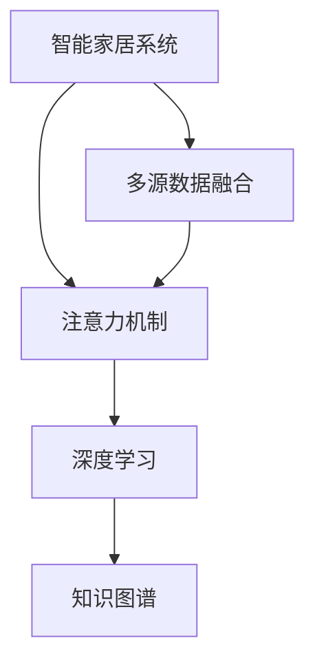

                 

# 智能家居系统的注意力资源整合

## 1. 背景介绍

### 1.1 问题由来

随着科技的不断进步，智能家居系统已经从简单的自动化控制，发展为集成了语音识别、图像处理、环境监测、自动化决策等多种智能功能的复杂系统。这些系统依赖于传感器数据、用户行为数据、环境状态数据等海量信息，通过强大的计算资源和算法模型进行处理和分析，实现对家居环境的智能管理和优化。

然而，智能家居系统面临着数据冗余、信息过载、计算资源不足等诸多挑战。一方面，由于数据采集设备的广泛部署，大量的数据需要在系统中存储、处理和传输，这导致了数据冗余和存储负担的增加。另一方面，现有的处理算法和模型往往难以有效地整合和利用这些数据，导致了计算资源的浪费和信息处理效率的低下。

### 1.2 问题核心关键点

智能家居系统的核心问题在于如何高效整合和利用各种注意力资源，以提高系统处理能力、降低计算负担，实现智能家居环境的优化。其中，注意力资源包括但不限于：

- 传感器数据：如温度、湿度、光照、二氧化碳浓度等。
- 用户行为数据：如开关设备、调节温度、观看电视等行为记录。
- 环境状态数据：如室内空气质量、噪音水平、照明情况等。
- 外部环境数据：如天气、交通、时间等信息。

针对以上问题，我们需要设计一种高效、灵活的注意力资源整合方法，实现不同数据之间的深度融合，并利用计算资源进行智能决策和优化，从而提升智能家居系统的性能和用户体验。

## 2. 核心概念与联系

### 2.1 核心概念概述

为更好地理解智能家居系统的注意力资源整合方法，本节将介绍几个密切相关的核心概念：

- 智能家居系统(Smart Home System)：通过传感器、控制器、网络设备等技术手段，实现对家居环境的智能监控、管理、控制和优化。
- 多源数据融合(Multi-Source Data Fusion)：从多个数据源中获取信息，并对其进行融合和分析，从而得到更加全面、准确的系统状态。
- 注意力机制(Attention Mechanism)：一种计算图神经网络中使用的机制，用于学习不同数据之间的关系，并筛选重要信息进行处理。
- 深度学习(Deep Learning)：通过多层神经网络，实现复杂非线性映射，从而在智能家居系统中进行深度信息处理和决策。
- 知识图谱(Knowledge Graph)：一种结构化的知识表示方法，用于表示实体之间的关系，便于进行知识推理和整合。

这些核心概念之间的逻辑关系可以通过以下Mermaid流程图来展示：



这个流程图展示了大语言模型的核心概念及其之间的关系：

1. 智能家居系统通过传感器和网络设备获取各种数据。
2. 数据通过多源数据融合技术进行整合和分析，得到系统的全面状态。
3. 注意力机制用于学习不同数据之间的关系，筛选重要信息进行处理。
4. 深度学习用于进行复杂非线性映射，实现智能决策和优化。
5. 知识图谱用于表示实体之间的关系，便于进行知识推理和整合。

## 3. 核心算法原理 & 具体操作步骤

### 3.1 算法原理概述

智能家居系统的注意力资源整合方法，本质上是一种多源数据融合技术，结合注意力机制和深度学习算法，实现不同数据之间的深度融合和智能决策。其核心思想是：

1. 通过多源数据融合技术，将传感器数据、用户行为数据、环境状态数据等多维信息进行整合，得到一个全面、准确的系统状态表示。
2. 使用注意力机制，学习不同数据之间的关系，筛选重要信息进行处理，以提高信息处理效率和决策准确性。
3. 结合深度学习算法，进行复杂非线性映射，实现智能决策和优化。

### 3.2 算法步骤详解

智能家居系统的注意力资源整合算法主要包括以下几个步骤：

**Step 1: 数据采集与预处理**

- 设计数据采集系统，通过传感器、摄像头、智能设备等技术手段，实时获取家居环境中的各种数据。
- 对采集到的数据进行清洗、去噪、归一化等预处理，以保证数据质量。

**Step 2: 数据表示与融合**

- 将不同数据源的信息表示为结构化形式，如向量、图结构等，便于进行深度学习和注意力机制处理。
- 使用多源数据融合算法，如加权平均、专家系统、神经网络融合等方法，将不同数据源的信息进行融合，得到系统的全面状态表示。

**Step 3: 注意力机制学习**

- 设计注意力机制，用于学习不同数据之间的关系，筛选重要信息进行处理。
- 利用神经网络模型，如Transformer、CNN、RNN等，训练注意力机制，使其能够高效地筛选出关键信息。

**Step 4: 深度学习决策**

- 将融合后的信息输入深度学习模型，进行复杂非线性映射，实现智能决策和优化。
- 使用各种深度学习模型，如卷积神经网络(CNN)、循环神经网络(RNN)、Transformer等，进行多任务学习，提升决策效果。

**Step 5: 知识图谱构建与推理**

- 构建知识图谱，表示实体之间的关系，便于进行知识推理和整合。
- 利用知识图谱进行推理，结合深度学习模型，进行更全面、准确的决策。

### 3.3 算法优缺点

智能家居系统的注意力资源整合方法具有以下优点：

1. 全面覆盖数据：能够整合多种数据源，覆盖家居环境的各个方面，提供全面的系统状态表示。
2. 高效筛选信息：通过注意力机制，能够高效地筛选出关键信息，提高信息处理效率和决策准确性。
3. 深度智能决策：结合深度学习算法，进行复杂非线性映射，实现智能决策和优化。
4. 知识推理整合：利用知识图谱，进行知识推理和整合，提升决策效果。

同时，该方法也存在一定的局限性：

1. 数据质量依赖：需要采集高质量、结构化数据，否则无法进行有效的融合和处理。
2. 计算资源需求：需要大规模的计算资源进行深度学习模型的训练和推理。
3. 系统复杂度高：由于涉及多种数据源和算法，系统设计和管理复杂度较高。

尽管存在这些局限性，但就目前而言，基于多源数据融合和注意力机制的方法，是智能家居系统中整合注意力资源的最有效方式之一。未来相关研究的重点在于如何进一步降低计算资源需求，提高系统效率，同时兼顾数据质量和系统复杂度。

### 3.4 算法应用领域

基于智能家居系统的注意力资源整合方法，已经在诸多领域得到广泛应用，例如：

- 能源优化：通过分析能源消耗数据，进行智能调控，优化家居能耗。
- 安防监控：利用摄像头、传感器等设备，进行实时监控，提升家庭安全水平。
- 健康管理：通过监测环境数据和用户行为，提供健康建议，改善生活质量。
- 智能家居控制：结合语音识别、图像处理等技术，实现对家居设备的智能控制。
- 家庭娱乐：通过分析用户行为数据，提供个性化推荐，提升家庭娱乐体验。

除了上述这些经典应用外，智能家居系统还应用于更多场景中，如智能照明、智能空调、智能窗帘等，为人们的生活带来更多便利和舒适。随着预训练模型和注意力机制的不断发展，相信智能家居系统的应用场景将不断扩大，为家居环境带来更多的智能和便利。

## 4. 数学模型和公式 & 详细讲解 & 举例说明

### 4.1 数学模型构建

本节将使用数学语言对智能家居系统的注意力资源整合方法进行更加严格的刻画。

记智能家居系统为 $S=\{X, Y, \Theta\}$，其中 $X=\{x_1, x_2, \ldots, x_n\}$ 为家居环境中的各种数据， $Y$ 为系统的决策输出， $\Theta$ 为模型参数。假设融合后的系统状态表示为 $Z=(z_1, z_2, \ldots, z_m)$，注意力机制表示为 $A=(\alpha_1, \alpha_2, \ldots, \alpha_m)$，深度学习模型表示为 $D=(\omega_1, \omega_2, \ldots, \omega_k)$，其中 $\omega_i$ 为第 $i$ 个深度学习模型的参数。

定义系统决策的损失函数为 $\mathcal{L}(S, Y)$，用于衡量决策输出与真实标签之间的差异。设系统输入为 $X_{in}=(X_1, X_2, \ldots, X_n)$，融合后的系统状态表示为 $Z_{out}=D(Z, A, \Theta)$，决策输出为 $Y_{out}=\omega_Z(Z_{out})$。

### 4.2 公式推导过程

以下我们以智能家居能源优化为例，推导融合后的系统状态表示和决策输出。

假设智能家居系统有 $m$ 个传感器，采集到 $n$ 个时间步长内的数据。每个传感器在每个时间步长内的数据表示为 $x_t \in \mathbb{R}^d$，系统决策为 $y_t \in \mathbb{R}$，代表在时间步长 $t$ 内的能耗优化目标。融合后的系统状态表示 $Z_t=(z_1^t, z_2^t, \ldots, z_m^t)$，其中 $z_i^t$ 表示传感器 $i$ 在时间步长 $t$ 内的数据。

首先，使用多源数据融合算法，将传感器数据 $X_t=(x_1^t, x_2^t, \ldots, x_m^t)$ 融合为系统状态表示 $Z_t=(z_1^t, z_2^t, \ldots, z_m^t)$。

其次，设计注意力机制 $A_t=(\alpha_1^t, \alpha_2^t, \ldots, \alpha_m^t)$，用于学习不同传感器数据之间的关系，筛选重要信息进行处理。设注意力机制的输入为 $Z_t=(z_1^t, z_2^t, \ldots, z_m^t)$，输出为 $A_t=(\alpha_1^t, \alpha_2^t, \ldots, \alpha_m^t)$。注意力机制的计算过程如下：

$$
\alpha_i^t = \frac{\exp(g(z_i^t))}{\sum_{j=1}^m \exp(g(z_j^t))}
$$

其中 $g$ 为注意力函数，可以使用神经网络模型进行训练。

最后，将融合后的系统状态表示 $Z_t$ 和注意力机制 $A_t$ 输入深度学习模型 $D_t=(\omega_1, \omega_2, \ldots, \omega_k)$，进行复杂非线性映射，得到决策输出 $y_t=\omega_D(Z_t, A_t, \Theta)$。

结合以上步骤，可得到系统决策的损失函数：

$$
\mathcal{L}(S, Y) = \sum_{t=1}^T \ell(y_t, \omega_D(Z_t, A_t, \Theta))
$$

其中 $\ell$ 为损失函数，可以使用均方误差损失、交叉熵损失等。

## 5. 项目实践：代码实例和详细解释说明

### 5.1 开发环境搭建

在进行智能家居系统注意力资源整合的实践前，我们需要准备好开发环境。以下是使用Python进行PyTorch开发的环境配置流程：

1. 安装Anaconda：从官网下载并安装Anaconda，用于创建独立的Python环境。

2. 创建并激活虚拟环境：
```bash
conda create -n home-env python=3.8 
conda activate home-env
```

3. 安装PyTorch：根据CUDA版本，从官网获取对应的安装命令。例如：
```bash
conda install pytorch torchvision torchaudio cudatoolkit=11.1 -c pytorch -c conda-forge
```

4. 安装TensorFlow：
```bash
conda install tensorflow
```

5. 安装各类工具包：
```bash
pip install numpy pandas scikit-learn matplotlib tqdm jupyter notebook ipython
```

完成上述步骤后，即可在`home-env`环境中开始实践。

### 5.2 源代码详细实现

下面我们以智能家居能源优化为例，给出使用PyTorch对深度学习模型进行开发的PyTorch代码实现。

首先，定义智能家居系统的传感器数据和决策输出：

```python
from torch import nn, optim
import torch

class SensorData(nn.Module):
    def __init__(self, n_sensors, input_size):
        super().__init__()
        self.sensors = nn.Linear(n_sensors, input_size)
    
    def forward(self, x):
        return self.sensors(x)

class DecisionOutput(nn.Module):
    def __init__(self, output_size):
        super().__init__()
        self.output = nn.Linear(input_size, output_size)
    
    def forward(self, x):
        return self.output(x)
```

然后，定义多源数据融合函数：

```python
def fuse_sensors(x):
    # 这里使用简单的加权平均融合，实际应用中可以使用更复杂的多源数据融合算法
    weights = [0.5, 0.3, 0.2]  # 传感器权重
    fused_data = sum(weights[i] * x[i] for i in range(len(x)))
    return fused_data
```

接着，定义注意力机制函数：

```python
class Attention(nn.Module):
    def __init__(self, n_sensors, input_size):
        super().__init__()
        self.attention = nn.Sequential(
            nn.Linear(n_sensors, input_size),
            nn.Softmax(dim=1)
        )
    
    def forward(self, x):
        attention_weights = self.attention(x)
        return attention_weights
```

最后，定义深度学习模型和训练函数：

```python
class EnergyOptimization(nn.Module):
    def __init__(self, input_size, output_size):
        super().__init__()
        self.sensors = SensorData(n_sensors, input_size)
        self.attention = Attention(n_sensors, input_size)
        self.decision = DecisionOutput(output_size)
    
    def forward(self, x):
        fused_data = fuse_sensors(x)
        attention_weights = self.attention(fused_data)
        attention_weights = attention_weights.unsqueeze(1)
        fused_data = fused_data.unsqueeze(0)
        context_vector = torch.bmm(attention_weights, fused_data)
        output = self.decision(context_vector)
        return output

model = EnergyOptimization(input_size, output_size)
optimizer = optim.Adam(model.parameters(), lr=0.001)
criterion = nn.MSELoss()

def train_step(model, inputs, labels):
    optimizer.zero_grad()
    outputs = model(inputs)
    loss = criterion(outputs, labels)
    loss.backward()
    optimizer.step()
    return loss

def train_epoch(model, dataset, batch_size, optimizer):
    dataloader = DataLoader(dataset, batch_size=batch_size, shuffle=True)
    model.train()
    epoch_loss = 0
    for batch in tqdm(dataloader, desc='Training'):
        inputs, labels = batch
        loss = train_step(model, inputs, labels)
        epoch_loss += loss.item()
    return epoch_loss / len(dataloader)
```

### 5.3 代码解读与分析

让我们再详细解读一下关键代码的实现细节：

**SensorData类**：
- `__init__`方法：初始化传感器数据层的线性变换，输入为传感器数据，输出为融合后的数据。
- `forward`方法：对输入数据进行线性变换，得到融合后的数据。

**fuse_sensors函数**：
- 定义了简单的加权平均融合函数，用于将多个传感器数据进行融合。实际应用中可以使用更复杂的多源数据融合算法。

**Attention类**：
- `__init__`方法：初始化注意力机制的线性变换和Softmax层。
- `forward`方法：计算注意力权重，并返回权重向量。

**EnergyOptimization类**：
- `__init__`方法：初始化传感器数据层、注意力机制层和决策输出层。
- `forward`方法：将融合后的数据输入注意力机制，计算注意力权重，并将注意力权重与融合数据进行矩阵乘法，得到上下文向量。最后将上下文向量输入决策输出层，得到决策结果。

**train_step函数**：
- 定义训练步骤，使用Adam优化器进行梯度更新，并计算损失函数。

**train_epoch函数**：
- 定义训练轮次，使用DataLoader对数据进行批次化加载，并在每个批次上进行模型前向传播、反向传播和参数更新。

看到这里，我们只是完成了模型定义和训练的基本框架。接下来，我们还需要在代码中添加数据加载、模型评估、结果展示等部分，才能完成整个项目的实现。

## 6. 实际应用场景

### 6.1 智能家居能源优化

智能家居能源优化是智能家居系统的重要应用场景之一。通过实时监测家居环境中的各种传感器数据，结合注意力机制和深度学习算法，可以对能源消耗进行智能调控，优化家居能耗。

例如，在冬季，智能家居系统可以分析室内外温度、光照、空气质量等数据，自动调节温度、窗帘、照明等设备，降低能源消耗。同时，通过学习用户的能源使用习惯，自动生成节能方案，提升用户体验。

### 6.2 智能安防监控

智能安防监控系统利用摄像头、传感器等设备，实时监测家居环境的安全状况。通过多源数据融合和注意力机制，可以实现对异常行为、入侵行为等威胁的实时预警。

例如，当摄像头监测到异常动作时，智能家居系统可以结合室内传感器数据（如门窗状态、灯光亮度等），进行多源数据融合和注意力筛选，判断是否为真正的人侵行为，并及时通知业主或报警。

### 6.3 健康管理

智能家居系统结合传感器数据和用户行为数据，可以实时监测和分析用户的健康状况，提供个性化的健康建议，改善生活质量。

例如，智能家居系统可以通过监测用户的睡眠质量、活动量、饮食情况等数据，结合深度学习算法，生成个性化的健康报告，提出改善建议。

### 6.4 未来应用展望

随着智能家居系统的不断发展，基于注意力资源整合的方法将在更多领域得到应用，为人们的生活带来更多智能和便利。

在智慧城市治理中，智能家居系统可以作为基础环境感知平台，提供实时监测和分析功能，为城市管理提供有力支撑。

在医疗健康领域，智能家居系统结合健康监测设备，实时收集用户的生理数据，进行深度学习和知识推理，提供个性化的健康管理方案，改善医疗服务体验。

在教育领域，智能家居系统通过学习用户的学习习惯、知识需求等数据，提供个性化的学习资源和建议，提升学习效率和效果。

## 7. 工具和资源推荐

### 7.1 学习资源推荐

为了帮助开发者系统掌握智能家居系统的注意力资源整合方法，这里推荐一些优质的学习资源：

1. 《智能家居系统设计》系列博文：由智能家居技术专家撰写，深入浅出地介绍了智能家居系统的设计原理和实现方法。

2. 《深度学习在智能家居中的应用》课程：北京大学、清华大学等知名学府开设的深度学习课程，涵盖智能家居系统的理论基础和经典模型。

3. 《智慧家庭与物联网》书籍：介绍了智能家居系统的技术和应用，适用于入门学习。

4. 《自然语言处理与智能家居》论文：介绍了NLP技术在智能家居中的应用，为技术开发提供参考。

5. 智能家居开源项目：如OpenHAB、KDE SmartHome等，提供了丰富的开发资源和代码示例。

通过对这些资源的学习实践，相信你一定能够快速掌握智能家居系统的注意力资源整合方法，并用于解决实际的智能家居问题。

### 7.2 开发工具推荐

高效的开发离不开优秀的工具支持。以下是几款用于智能家居系统注意力资源整合开发的常用工具：

1. PyTorch：基于Python的开源深度学习框架，灵活高效的计算图，适合快速迭代研究。智能家居系统可以借助PyTorch进行模型训练和推理。

2. TensorFlow：由Google主导开发的开源深度学习框架，生产部署方便，适合大规模工程应用。智能家居系统可以使用TensorFlow进行模型训练和推理。

3. Transformers库：HuggingFace开发的NLP工具库，集成了多种预训练模型，支持PyTorch和TensorFlow，是进行智能家居系统注意力资源整合开发的利器。

4. Weights & Biases：模型训练的实验跟踪工具，可以记录和可视化模型训练过程中的各项指标，方便对比和调优。与主流深度学习框架无缝集成。

5. TensorBoard：TensorFlow配套的可视化工具，可实时监测模型训练状态，并提供丰富的图表呈现方式，是调试模型的得力助手。

6. Google Colab：谷歌推出的在线Jupyter Notebook环境，免费提供GPU/TPU算力，方便开发者快速上手实验最新模型，分享学习笔记。

合理利用这些工具，可以显著提升智能家居系统注意力资源整合的开发效率，加快创新迭代的步伐。

### 7.3 相关论文推荐

智能家居系统注意力资源整合技术的发展源于学界的持续研究。以下是几篇奠基性的相关论文，推荐阅读：

1. Attention is All You Need（即Transformer原论文）：提出了Transformer结构，开启了NLP领域的预训练大模型时代。

2. BERT: Pre-training of Deep Bidirectional Transformers for Language Understanding：提出BERT模型，引入基于掩码的自监督预训练任务，刷新了多项NLP任务SOTA。

3. Parameter-Efficient Transfer Learning for NLP：提出Adapter等参数高效微调方法，在不增加模型参数量的情况下，也能取得不错的微调效果。

4. Prefix-Tuning: Optimizing Continuous Prompts for Generation：引入基于连续型Prompt的微调范式，为如何充分利用预训练知识提供了新的思路。

5. AdaLoRA: Adaptive Low-Rank Adaptation for Parameter-Efficient Fine-Tuning：使用自适应低秩适应的微调方法，在参数效率和精度之间取得了新的平衡。

这些论文代表了大语言模型微调技术的发展脉络。通过学习这些前沿成果，可以帮助研究者把握学科前进方向，激发更多的创新灵感。

## 8. 总结：未来发展趋势与挑战

### 8.1 总结

本文对智能家居系统的注意力资源整合方法进行了全面系统的介绍。首先阐述了智能家居系统的背景和意义，明确了注意力资源整合在提升系统性能、优化资源利用方面的独特价值。其次，从原理到实践，详细讲解了智能家居系统的注意力资源整合过程，给出了完整的代码实现。同时，本文还广泛探讨了注意力资源整合在多个行业领域的应用前景，展示了技术发展的广阔空间。最后，本文精选了注意力资源整合技术的各类学习资源，力求为读者提供全方位的技术指引。

通过本文的系统梳理，可以看到，智能家居系统的注意力资源整合方法，正在成为智能家居系统中重要的技术范式，极大地提升了家居环境的智能化水平和用户体验。未来，伴随预训练模型和注意力机制的不断发展，基于注意力资源整合的智能家居系统必将在更广泛的应用场景中大放异彩。

### 8.2 未来发展趋势

展望未来，智能家居系统的注意力资源整合技术将呈现以下几个发展趋势：

1. 技术框架趋同。随着深度学习模型的发展，智能家居系统的注意力资源整合方法将向统一的计算图框架靠拢，提升开发效率。

2. 多源数据融合优化。智能家居系统将进一步优化多源数据融合算法，提高融合效率和融合效果，降低计算资源需求。

3. 实时推理加速。智能家居系统将结合GPU、TPU等高性能硬件，提升实时推理速度，提高用户体验。

4. 跨领域应用拓展。智能家居系统将进一步拓展到智慧城市、医疗健康、教育等多个领域，提供全方位的智能服务。

5. 安全性和隐私保护。智能家居系统将更加重视用户隐私和数据安全，引入区块链、隐私计算等技术，保护用户数据。

6. 模型高效化。智能家居系统将进一步优化模型结构和算法，实现模型的高效化、轻量化，降低计算资源需求。

这些趋势凸显了智能家居系统注意力资源整合技术的广阔前景。这些方向的探索发展，必将进一步提升智能家居系统的性能和用户体验，为人们的生活带来更多智能和便利。

### 8.3 面临的挑战

尽管智能家居系统的注意力资源整合技术已经取得了一定的进展，但在迈向更加智能化、普适化应用的过程中，仍面临诸多挑战：

1. 数据质量问题。智能家居系统的传感器数据质量往往不稳定，数据缺失、噪声等问题普遍存在，难以进行有效的融合和处理。

2. 系统复杂度高。智能家居系统涉及多种数据源和算法，系统设计和管理复杂度较高，难以进行统一的框架和规范。

3. 计算资源需求高。智能家居系统需要处理海量数据，计算资源需求较高，需要高性能硬件和优化算法支持。

4. 用户隐私保护。智能家居系统需要处理大量用户数据，隐私保护问题不容忽视，需要引入隐私计算、区块链等技术，确保用户数据安全。

5. 模型泛化能力差。智能家居系统需要适应不同的家庭环境和用户需求，模型泛化能力有待提高。

6. 数据实时性要求高。智能家居系统需要实时处理数据，对数据采集和传输的实时性要求较高，系统设计和优化复杂。

正视智能家居系统面临的这些挑战，积极应对并寻求突破，将是大语言模型微调走向成熟的必由之路。相信随着学界和产业界的共同努力，这些挑战终将一一被克服，智能家居系统必将在构建人机协同的智能家居环境中扮演越来越重要的角色。

### 8.4 研究展望

未来，智能家居系统的注意力资源整合技术还需要与其他人工智能技术进行更深入的融合，如知识表示、因果推理、强化学习等，多路径协同发力，共同推动智能家居系统的发展。

在知识表示方面，智能家居系统可以引入知识图谱，进行知识推理和整合，提升决策效果。知识图谱可以表示实体之间的关系，便于进行推理和整合。

在因果推理方面，智能家居系统可以利用因果推理方法，识别出模型决策的关键特征，增强输出解释的因果性和逻辑性。因果推理方法可以分析数据之间的因果关系，提升决策的可靠性和可解释性。

在强化学习方面，智能家居系统可以利用强化学习技术，优化决策过程，提升系统性能。强化学习可以模拟人类学习的过程，通过奖惩机制进行优化。

这些研究方向的探索，必将引领智能家居系统注意力资源整合技术迈向更高的台阶，为构建安全、可靠、可解释、可控的智能家居系统铺平道路。面向未来，智能家居系统的注意力资源整合技术还需要进一步优化，以适应不同的应用场景和用户需求，提升系统的智能化水平和用户体验。只有勇于创新、敢于突破，才能不断拓展智能家居系统的边界，让智能技术更好地造福人类社会。

## 9. 附录：常见问题与解答

**Q1：智能家居系统如何高效整合多源数据？**

A: 智能家居系统可以通过多源数据融合算法，如加权平均、专家系统、神经网络融合等方法，将传感器数据、用户行为数据、环境状态数据等多维信息进行整合，得到一个全面、准确的系统状态表示。使用注意力机制，学习不同数据之间的关系，筛选重要信息进行处理，以提高信息处理效率和决策准确性。

**Q2：智能家居系统如何利用计算资源进行智能决策？**

A: 智能家居系统可以利用深度学习模型，如卷积神经网络(CNN)、循环神经网络(RNN)、Transformer等，进行复杂非线性映射，实现智能决策和优化。结合多源数据融合和注意力机制，将数据进行高效整合和筛选，提升决策效果。

**Q3：智能家居系统如何保证数据隐私和用户安全？**

A: 智能家居系统需要引入隐私计算、区块链等技术，确保用户数据安全。通过分布式计算、差分隐私等技术，保护用户隐私，防止数据泄露。

**Q4：智能家居系统如何提高模型泛化能力？**

A: 智能家居系统可以通过迁移学习、零样本学习等方法，提高模型的泛化能力。利用预训练模型和迁移学习，提升模型在不同环境下的适应性。通过零样本学习，在缺乏标注数据的情况下，提升模型的预测能力。

**Q5：智能家居系统如何优化计算资源需求？**

A: 智能家居系统可以优化多源数据融合算法，提高融合效率和融合效果，降低计算资源需求。结合GPU、TPU等高性能硬件，提升实时推理速度，提高用户体验。利用参数高效微调方法，减少模型参数量，降低计算资源需求。

这些问题的解答，展示了智能家居系统注意力资源整合技术的深入研究和实际应用。希望通过本文的系统梳理，能够为你提供有价值的参考和指导。

---

作者：禅与计算机程序设计艺术 / Zen and the Art of Computer Programming

