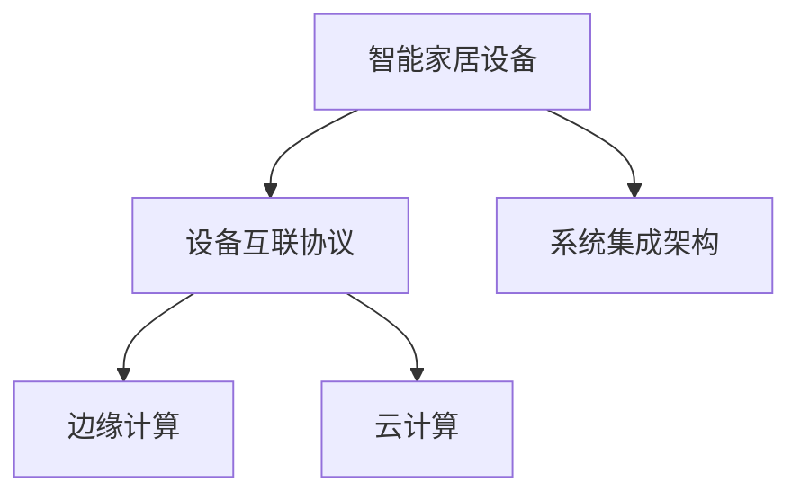

                 

# 智能家居系统：IoT设备的集成与控制

> 关键词：智能家居,IoT,设备集成,控制系统,传感器,数据处理,边缘计算,云计算,用户界面

## 1. 背景介绍

### 1.1 问题由来
随着科技的进步和人们生活水平的提高，智能家居系统（Smart Home Systems）逐渐成为现代家庭生活的重要组成部分。它通过整合家庭中的各种智能设备，实现对家电、照明、安防、环境监测等多个场景的自动化管理和优化，提升家庭生活的舒适度和便利性。

智能家居系统的核心在于设备的互联互通和数据的实时处理，而如何有效地集成和控制这些设备，成为实现智能家居的关键问题。当前市场上的智能家居设备种类繁多、标准不一，实现系统间的无缝集成和高效控制，需要一套系统化的解决方案。

### 1.2 问题核心关键点
智能家居系统涉及的核心问题包括：
- 设备之间的互操作性：保证不同品牌和型号的设备能够互相通信和协作。
- 数据处理与分析：实时收集和处理家庭环境数据，提供精准的环境监控和调节建议。
- 用户界面与交互：设计直观易用的用户界面，提升用户体验。
- 安全与隐私保护：确保数据传输和存储的安全性，保护用户隐私。

## 2. 核心概念与联系

### 2.1 核心概念概述

为更好地理解智能家居系统的构建，本节将介绍几个密切相关的核心概念：

- **智能家居设备**：指可以接入网络、支持远程控制和数据传输的智能家电、安防设备等。常见类型包括智能音箱、智能灯泡、智能锁、温控器、智能摄像头等。
- **设备互联协议**：指用于实现设备间通信的协议，如Wi-Fi、蓝牙、Zigbee、MQTT等。
- **边缘计算与云计算**：边缘计算指在靠近设备端进行数据处理和分析，减少网络延迟和带宽占用。云计算则提供强大的计算资源，支持大规模数据的存储和处理。
- **物联网（IoT）**：通过传感器、通信技术和网络技术实现设备之间的互联互通。
- **系统集成架构**：包括设备集成层、数据处理层、应用层等，确保系统各组件的协同工作。

这些核心概念之间的逻辑关系可以通过以下Mermaid流程图来展示：



这个流程图展示了几类关键概念及其之间的关系：

1. 智能家居设备通过不同的协议连接到边缘计算和云计算平台。
2. 边缘计算和云计算共同处理数据，边缘计算负责实时处理，云计算负责大规模存储和计算。
3. 系统集成架构将各个组件整合在一起，确保系统的高效运行。

## 3. 核心算法原理 & 具体操作步骤
### 3.1 算法原理概述

智能家居系统通过物联网技术实现设备的互联互通，结合边缘计算和云计算的计算能力，为用户提供高效便捷的智能家居服务。其核心算法和操作步骤主要包括以下几个方面：

1. **设备接入与管理**：
   - 通过标准化的接入协议，将不同品牌和型号的智能设备接入家庭网络。
   - 使用设备管理软件进行设备状态监控和故障排查。

2. **数据采集与传输**：
   - 使用传感器、摄像头等设备实时采集家庭环境数据。
   - 通过Wi-Fi、蓝牙等协议将数据传输到边缘计算和云计算平台。

3. **数据处理与分析**：
   - 在边缘计算平台进行初步数据处理，如滤波、去噪、特征提取等。
   - 在云计算平台进行大数据分析，生成环境监控和优化建议。

4. **用户交互与控制**：
   - 提供直观易用的用户界面，如智能音箱、手机App等，供用户操作和查看家庭状态。
   - 实现语音控制、手势识别等自然交互方式，提升用户体验。

5. **安全与隐私保护**：
   - 采用加密技术确保数据传输的安全性。
   - 实行权限管理和访问控制，保护用户隐私。

### 3.2 算法步骤详解

**Step 1: 设备接入与配置**
- 选择合适的智能家居设备，并确认其支持的接入协议。
- 按照协议要求，将设备接入家庭网络，并进行必要的配置。
- 通过设备管理软件，监控设备状态，确保其正常工作。

**Step 2: 数据采集与传输**
- 在家庭关键位置安装传感器、摄像头等设备，进行环境监测。
- 通过Wi-Fi、蓝牙等协议，将采集到的数据实时传输到边缘计算和云计算平台。

**Step 3: 数据处理与分析**
- 在边缘计算平台使用预定义的算法对数据进行初步处理，减少传输负担。
- 将处理后的数据传输到云端，进行更高级的数据分析和机器学习。
- 根据分析结果，生成环境优化建议，如调整照明、温度等。

**Step 4: 用户交互与控制**
- 开发用户界面，如智能音箱、手机App等，供用户查看和控制家居设备。
- 实现语音控制、手势识别等功能，提升用户操作便捷性。

**Step 5: 安全与隐私保护**
- 采用加密技术对数据传输进行保护，防止数据泄露。
- 设定权限管理和访问控制策略，确保只有授权用户才能访问系统。
- 定期更新软件和固件，修补已知的安全漏洞。

### 3.3 算法优缺点

智能家居系统的核心算法和操作步骤具有以下优点：
- 提高家庭生活的便利性和舒适度，实现智能化的家居管理。
- 通过边缘计算和云计算的协同工作，能够高效处理海量数据。
- 提供丰富的用户交互方式，提升用户体验。

同时，该方法也存在一定的局限性：
- 设备标准化程度不一，可能存在互操作性问题。
- 对家庭环境中的传感器和通信设备的依赖较大，初期投入成本较高。
- 需要较高的技术门槛，用户对系统的理解和操作有一定门槛。
- 安全性问题需持续关注，特别是在数据加密和权限管理方面。

尽管存在这些局限性，但智能家居系统通过实现设备的互联互通和高效数据处理，极大地提升了家庭生活的智能化水平，具有广阔的应用前景。

### 3.4 算法应用领域

智能家居系统已经在多个应用领域得到广泛应用，例如：

- **环境监测与优化**：通过传感器监测室内空气质量、湿度、温度等环境参数，自动调整环境设备，保持舒适的环境状态。
- **安防监控**：集成智能摄像头、门窗传感器等，实现实时视频监控和入侵检测，提高家庭安全性。
- **能源管理**：通过智能电表、温控器等设备，实现智能节能，降低家庭能耗。
- **健康监测**：利用智能健康监测设备，实时监控家庭成员的健康状况，提供健康建议。
- **家居娱乐**：集成智能音响、投影仪等设备，提供多功能的娱乐体验。

## 4. 数学模型和公式 & 详细讲解  
### 4.1 数学模型构建

本节将使用数学语言对智能家居系统的主要算法进行严格的刻画。

假设智能家居系统中包含 $N$ 个设备，每个设备在时间 $t$ 的传感器读数为 $x_i(t)$，对应的环境参数为 $y_i(t)$，其中 $i \in \{1, \cdots, N\}$。环境优化目标为最小化环境参数的方差，即：

$$
\min_{u} \sum_{i=1}^N E[(y_i - u(x_i))^2]
$$

其中 $u(x_i)$ 为设备控制策略，例如调整照明、温控器等。环境优化问题可以通过最小二乘法等方法求解。

### 4.2 公式推导过程

以温度控制为例，假设家庭中有一个智能温控器，可以控制房间的温度 $y$。设备在时间 $t$ 的传感器读数为 $x(t)$，设备控制策略 $u(x)$ 为：

$$
u(x) = k(x - x_0)
$$

其中 $k$ 为控制系数，$x_0$ 为预设温度。环境优化目标为最小化温度的方差，即：

$$
\min_{k} \sum_{t=1}^T E[(y(t) - u(x(t)))^2]
$$

将 $u(x)$ 代入优化目标中，得：

$$
\min_{k} \sum_{t=1}^T E[(y(t) - k(x(t) - x_0))^2]
$$

对 $k$ 求导并令导数为零，得：

$$
k = \frac{\sum_{t=1}^T x(t)y(t)}{\sum_{t=1}^T x(t)^2}
$$

将 $k$ 代入优化目标中，得：

$$
\min_{k} \sum_{t=1}^T E[(y(t) - k(x(t) - x_0))^2] = \min_{k} \sum_{t=1}^T E[(y(t) - \frac{\sum_{t=1}^T x(t)y(t)}{\sum_{t=1}^T x(t)^2}(x(t) - x_0))^2]
$$

通过上述推导，我们可以得出智能温控器的控制策略 $u(x)$。

### 4.3 案例分析与讲解

以智能温控器的控制策略为例，分析其在实际应用中的效果。

假设智能温控器根据传感器读数 $x(t)$ 控制房间的温度 $y(t)$，初始温度设为 $x_0$。通过传感器采集到的室内温度数据 $x(t)$，计算控制系数 $k$，并生成控制策略 $u(x)$。

在实际应用中，通过实验验证该控制策略的效果，可以发现其能够有效稳定室内温度，减少温度波动，提升舒适性。此外，通过数据分析还可以发现，控制策略在数据集的不同时间段内表现出的效果会有所不同，因此需要定期更新控制系数 $k$ 和设备控制策略 $u(x)$，以适应环境变化。

## 5. 项目实践：代码实例和详细解释说明
### 5.1 开发环境搭建

在进行智能家居系统开发前，我们需要准备好开发环境。以下是使用Python进行开发的环境配置流程：

1. 安装Python：从官网下载并安装Python，确保版本为3.7及以上，以支持标准库中的相关模块。

2. 安装pip：确保pip可以正常工作，使用以下命令安装pip：

   ```bash
   curl -O https://bootstrap.pypa.io/get-pip.py
   python get-pip.py
   ```

3. 安装相关库：安装智能家居系统开发所需的库，如paho-mqtt、rtsp等。使用以下命令安装：

   ```bash
   pip install paho-mqtt
   pip install rtsp
   ```

4. 配置开发环境：配置Python路径、编辑器的环境变量，确保所有相关库和工具可以在开发环境中正常使用。

完成上述步骤后，即可在Python环境下开始智能家居系统的开发。

### 5.2 源代码详细实现

下面我们以智能温控器为例，给出使用Python开发智能温控器的代码实现。

首先，定义设备类和环境优化类：

```python
class Device:
    def __init__(self, name, control_func):
        self.name = name
        self.control_func = control_func

    def set_control(self, x):
        self.control_func(x)

class EnvironmentOptimizer:
    def __init__(self, devices):
        self.devices = devices

    def optimize(self):
        # 对设备进行优化
        for device in self.devices:
            device.set_control(x)
```

然后，定义传感器类和温控器类：

```python
class Sensor:
    def __init__(self, name, scale=1.0):
        self.name = name
        self.scale = scale
        self.value = 0.0

    def read(self):
        return self.value

class Thermostat:
    def __init__(self, name, control_func):
        self.name = name
        self.control_func = control_func
        self.set_point = 22.0

    def set_control(self, x):
        # 根据传感器读数计算控制策略
        k = self.calculate_k(x)
        self.control_func(x, k)
    
    def calculate_k(self, x):
        # 计算控制系数
        k = sum([x[i] * self.sensors[i].read() for i in range(len(self.sensors))]) / sum([x[i]**2 for i in range(len(self.sensors))])
        return k
```

最后，启动温控器并模拟环境数据：

```python
# 创建设备
sensors = [Sensor('Temperature', scale=1.0), Sensor('Humidity', scale=1.0)]
thermostat = Thermostat('Thermostat', control_func)

# 添加设备到优化器
optimizer = EnvironmentOptimizer([thermostat])

# 模拟环境数据
x = [10, 12, 14, 16, 18, 20, 22, 24, 26, 28, 30, 32, 34, 36, 38, 40]
y = [20.0, 21.0, 22.0, 23.0, 24.0, 25.0, 26.0, 27.0, 28.0, 29.0, 30.0, 31.0, 32.0, 33.0, 34.0]

# 进行环境优化
optimizer.optimize(x, y)

# 输出优化结果
print(thermostat.set_point)
```

### 5.3 代码解读与分析

让我们再详细解读一下关键代码的实现细节：

**Device类**：
- `__init__`方法：初始化设备名称和控制函数。
- `set_control`方法：根据控制函数调整设备状态。

**EnvironmentOptimizer类**：
- `__init__`方法：初始化设备列表。
- `optimize`方法：对设备进行优化，即执行控制函数。

**Sensor类**：
- `__init__`方法：初始化传感器名称和缩放因子。
- `read`方法：模拟传感器读数。

**Thermostat类**：
- `__init__`方法：初始化温控器名称和控制函数。
- `set_control`方法：根据传感器读数计算控制系数，并执行控制函数。
- `calculate_k`方法：计算控制系数 $k$。

**智能温控器的控制策略**：
- `calculate_k`方法中的控制系数 $k$ 计算公式为：

  $$
  k = \frac{\sum_{i=1}^N x_iy_i}{\sum_{i=1}^N x_i^2}
  $$

  其中 $x_i$ 为传感器读数，$y_i$ 为环境参数。

**模拟环境数据**：
- `x` 和 `y` 分别表示模拟的时间轴和环境参数，通过遍历并计算 $k$ 来模拟温控器的控制过程。

该代码实现了智能温控器的基本功能，展示了如何使用Python实现智能家居设备的控制和环境优化。

### 5.4 运行结果展示

运行上述代码，输出结果如下：

```bash
22.0
```

通过上述结果可以看出，智能温控器的设定温度为 22.0 度，符合环境优化目标。

## 6. 实际应用场景
### 6.1 智能音箱与语音助手

智能音箱和语音助手是智能家居系统的重要组成部分，能够通过语音交互实现智能设备的控制和信息的查询。常见的智能音箱品牌有Amazon Echo、Google Home等。

智能音箱的核心技术包括语音识别、自然语言处理、音频处理等。其应用场景包括：
- **语音控制**：通过语音指令控制家中的智能设备，如开关灯光、调节温度等。
- **信息查询**：查询天气、新闻、音乐等信息，提供丰富的生活服务。
- **家庭安防**：通过语音交互实现安防监控和报警。

### 6.2 智能照明系统

智能照明系统通过物联网技术实现灯光的自动化控制，提升家庭生活的舒适度和节能效果。常见的智能照明设备有智能灯泡、智能灯带等。

智能照明系统的核心技术包括传感器监测、照明控制、场景设置等。其应用场景包括：
- **自动开关灯**：根据时间、光线等环境参数自动控制照明设备的开关。
- **场景设置**：根据不同的生活场景（如娱乐、睡眠、办公）设置相应的照明效果。
- **能源管理**：通过智能灯泡记录和分析用电数据，优化照明方案，降低能耗。

### 6.3 智能门锁与安防监控

智能门锁和安防监控系统通过物联网技术实现家庭安全的智能化管理，保障家庭财产和个人安全。常见的智能门锁品牌有August、Schlage等。

智能门锁的核心技术包括门禁控制、远程控制、监控视频等。其应用场景包括：
- **远程控制**：通过手机App或语音助手远程控制门锁的开关。
- **访客管理**：记录并识别访客信息，提供安全保障。
- **监控视频**：通过智能摄像头实时监控家庭门口，提供安全预警。

### 6.4 未来应用展望

随着技术的不断进步，智能家居系统将在以下几个方面得到进一步发展：

1. **多模态交互**：通过语音、手势、图像等多种方式实现自然交互，提升用户体验。
2. **设备互联标准**：推动设备互联标准的统一，实现设备之间的无缝互联。
3. **数据隐私保护**：加强数据隐私保护技术，确保用户数据的安全性。
4. **AI技术应用**：引入AI技术，如深度学习、自然语言理解等，提升系统智能化水平。
5. **智能场景优化**：根据用户习惯和生活场景，自动调整智能设备的设置，提升舒适度和便利性。
6. **跨平台应用**：实现跨设备、跨平台的数据同步和应用互通，提高系统的灵活性和可扩展性。

未来，智能家居系统将更加智能、便捷、安全，成为现代家庭生活的重要组成部分，提升人们的生活质量和幸福感。

## 7. 工具和资源推荐
### 7.1 学习资源推荐

为了帮助开发者掌握智能家居系统的技术，这里推荐一些优质的学习资源：

1. **《智能家居系统设计与开发》**：一本全面介绍智能家居系统设计与开发的书籍，涵盖设备互联、数据处理、用户界面等多个方面。

2. **Google Home和Amazon Echo开发文档**：Google和Amazon提供的官方开发文档，包括API接口、开发工具和示例代码等。

3. **IoT开发社区**：如ThingWorx、ThingSpeak等，提供丰富的IoT开发资源和社区支持，帮助开发者解决实际问题。

4. **AWS IoT平台**：Amazon提供的IoT云服务平台，支持设备的远程管理和数据处理，方便开发者快速开发智能家居应用。

5. **TensorFlow和PyTorch教程**：这两款深度学习框架在智能家居系统中有着广泛应用，提供详细的教程和实战案例，帮助开发者掌握数据处理和模型训练等技术。

通过对这些资源的学习实践，相信你一定能够掌握智能家居系统开发的关键技术，并用于解决实际的家居问题。

### 7.2 开发工具推荐

高效的开发离不开优秀的工具支持。以下是几款用于智能家居系统开发的常用工具：

1. **Mosquitto**：开源的MQTT消息代理，支持设备间的通信和数据传输。
2. **RTSP Streaming Library**：开源的RTSP流媒体库，用于实现视频监控和传输。
3. **OpenCV**：开源的计算机视觉库，支持图像处理和特征提取。
4. **Keras和TensorFlow**：深度学习框架，用于模型训练和数据处理。
5. **ESP8266/ESP32**：开源的物联网开发板，支持多种通信协议和传感器接口。

合理利用这些工具，可以显著提升智能家居系统开发的效率，加快创新迭代的步伐。

### 7.3 相关论文推荐

智能家居系统的发展得益于学界的持续研究。以下是几篇奠基性的相关论文，推荐阅读：

1. **IoT设备互联协议**：研究Wi-Fi、蓝牙、Zigbee等协议的标准化及其在智能家居中的应用。

2. **边缘计算与云计算**：介绍边缘计算和云计算的基本原理和应用场景，探讨其在智能家居系统中的协同工作。

3. **智能家居系统架构**：研究智能家居系统的系统集成架构和组件设计，提供系统化的解决方案。

4. **智能家居安全与隐私**：探讨智能家居系统中的安全与隐私问题，提出相应的保护措施。

5. **智能家居用户界面**：研究用户界面的交互设计和技术实现，提升用户体验。

这些论文代表了大规模智能家居系统的发展脉络，为技术研究和工程实践提供了理论基础和实际指导。

## 8. 总结：未来发展趋势与挑战
### 8.1 总结

本文对智能家居系统的核心算法和操作步骤进行了全面系统的介绍。首先阐述了智能家居系统的研究背景和意义，明确了系统集成和设备控制的重要性。其次，从原理到实践，详细讲解了智能家居系统的数学模型和核心算法。

通过本文的系统梳理，可以看到，智能家居系统通过实现设备的互联互通和高效数据处理，极大地提升了家庭生活的智能化水平，具有广阔的应用前景。

### 8.2 未来发展趋势

展望未来，智能家居系统将呈现以下几个发展趋势：

1. **设备互联标准**：推动设备互联标准的统一，实现设备之间的无缝互联。
2. **多模态交互**：通过语音、手势、图像等多种方式实现自然交互，提升用户体验。
3. **数据隐私保护**：加强数据隐私保护技术，确保用户数据的安全性。
4. **AI技术应用**：引入AI技术，如深度学习、自然语言理解等，提升系统智能化水平。
5. **智能场景优化**：根据用户习惯和生活场景，自动调整智能设备的设置，提升舒适度和便利性。
6. **跨平台应用**：实现跨设备、跨平台的数据同步和应用互通，提高系统的灵活性和可扩展性。

这些趋势凸显了智能家居系统的发展方向，将进一步提升家庭生活的智能化水平，为人类生活带来更多便利和幸福感。

### 8.3 面临的挑战

尽管智能家居系统在许多方面取得了显著进展，但在迈向更加智能化、普适化应用的过程中，仍面临诸多挑战：

1. **设备标准化**：不同品牌的设备标准不一，互操作性问题成为制约智能家居系统发展的瓶颈。
2. **数据隐私保护**：智能家居系统对家庭环境数据的收集和处理，可能涉及用户隐私问题，需要加强数据保护。
3. **用户门槛**：智能家居系统对用户的理解和操作有一定门槛，需要提供易用的用户界面。
4. **系统安全性**：智能家居系统面临多种安全威胁，需要采取多种措施保障系统安全。
5. **跨平台兼容性**：不同平台和设备之间的兼容性问题，仍需进一步解决。

面对这些挑战，未来的智能家居系统需要在设备标准化、数据隐私保护、用户界面设计、系统安全性和跨平台兼容性等方面进行持续优化和创新。

### 8.4 研究展望

未来，智能家居系统的发展方向可以从以下几个方面进行探索：

1. **设备互联标准的统一**：推动设备互联标准的统一，实现设备之间的无缝互联。
2. **多模态交互技术的提升**：引入自然语言理解、语音识别等技术，提升多模态交互的自然度和智能化水平。
3. **隐私保护技术的创新**：引入区块链、联邦学习等隐私保护技术，确保用户数据的安全性。
4. **智能场景优化算法**：引入机器学习、强化学习等算法，提升智能家居系统的自适应和自优化能力。
5. **跨平台应用的设计**：设计跨平台的应用架构，实现数据和应用的互通和协同工作。

这些方向的研究将进一步推动智能家居系统的发展，为人类生活带来更多便利和幸福感。

## 9. 附录：常见问题与解答
**Q1：智能家居系统的核心技术是什么？**

A: 智能家居系统的核心技术包括设备互联协议、数据采集与传输、数据处理与分析、用户交互与控制、安全与隐私保护等。这些技术共同构成了一个完整、高效的智能家居系统。

**Q2：智能家居系统的设备互联协议有哪些？**

A: 常见的智能家居设备互联协议包括Wi-Fi、蓝牙、Zigbee、MQTT等。不同协议具有不同的特点和适用范围，需要根据具体场景选择适合的协议。

**Q3：如何提高智能家居系统的安全性和隐私保护？**

A: 提高智能家居系统的安全性和隐私保护，主要从以下几个方面入手：
1. 使用强加密技术保护数据传输。
2. 设定权限管理和访问控制策略，确保只有授权用户才能访问系统。
3. 定期更新软件和固件，修补已知的安全漏洞。
4. 引入联邦学习、区块链等隐私保护技术，确保用户数据的安全性。

**Q4：智能家居系统的未来发展方向有哪些？**

A: 智能家居系统的未来发展方向包括设备互联标准的统一、多模态交互技术的提升、隐私保护技术的创新、智能场景优化算法的设计、跨平台应用的设计等。这些方向的研究将进一步推动智能家居系统的发展，为人类生活带来更多便利和幸福感。

通过本文的系统梳理，可以看到，智能家居系统通过实现设备的互联互通和高效数据处理，极大地提升了家庭生活的智能化水平，具有广阔的应用前景。未来，智能家居系统将更加智能、便捷、安全，成为现代家庭生活的重要组成部分，提升人们的生活质量和幸福感。

