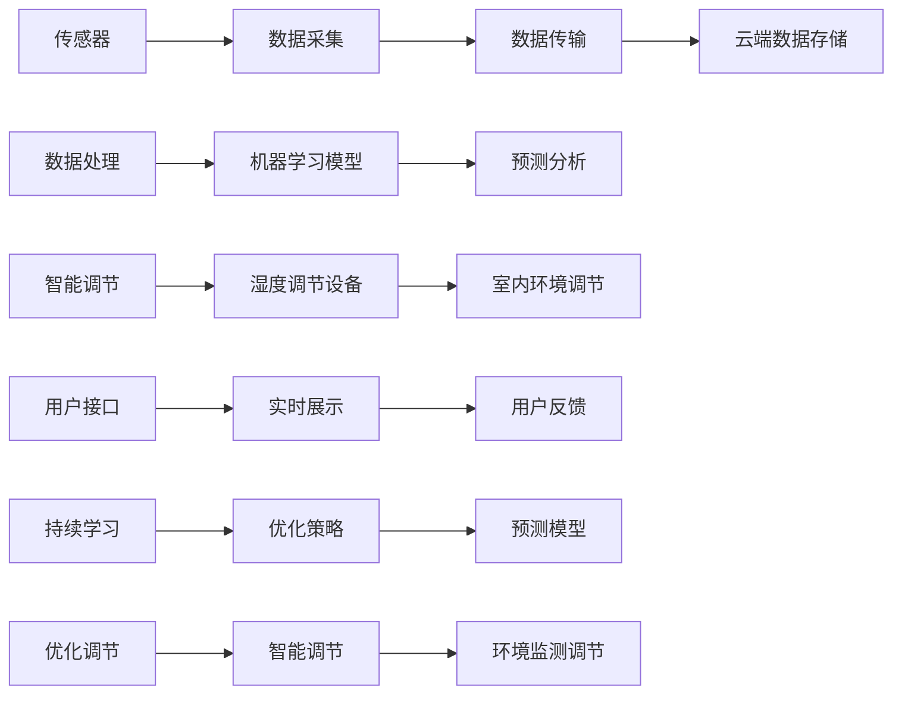

                 

# 智能居家湿度平衡创业：全天候的呼吸道健康管理

> 关键词：智能家居,湿度平衡,呼吸道健康,物联网,数据驱动,机器学习,呼吸系统疾病

## 1. 背景介绍

### 1.1 问题由来

在当前城市化加速和环境污染加剧的背景下，呼吸道疾病的发病率逐年攀升，特别是在老年人、儿童等易感人群中。据世界卫生组织(WHO)统计，每年全球约有超过100万人死于呼吸道疾病，使其成为全球第二大死亡原因。

为了应对日益严重的呼吸道健康问题，全球各地纷纷出台了一系列政策措施。例如，中国政府在《健康中国2030规划纲要》中提出，要建设环境友好型城市，加强空气质量和环境卫生管理，促进健康生活方式。

在这样的背景下，智能家居技术以其智能、便捷和高效的优势，成为解决这一问题的重要手段。通过利用物联网(IoT)、人工智能(AI)等前沿技术，智能家居系统能够实时监测室内环境参数，尤其是湿度、温度等关键指标，及时采取措施，保障室内环境的健康舒适，从而有效预防呼吸道疾病。

### 1.2 问题核心关键点

智能居家湿度平衡创业的核心在于如何通过物联网和机器学习技术，构建一个全天候的呼吸道健康管理系统，实时监测并调节室内湿度，从而提升居住环境的健康度。关键技术点包括：

1. **数据采集与传输**：通过传感器和智能设备实时采集室内湿度、温度、PM2.5等关键数据，并通过Wi-Fi、蓝牙等无线传输技术发送到云端。

2. **数据处理与分析**：利用机器学习模型对采集到的数据进行分析和预测，识别出可能导致呼吸道疾病的湿度变化趋势，并输出相应的调节建议。

3. **智能调节与反馈**：根据分析结果，智能家居系统自动调整湿度调节设备(如加湿器、除湿器)的工作模式，并通过反馈机制不断优化调节策略。

4. **用户体验与交互**：通过手机APP等用户接口，实时展示室内环境参数和建议，并允许用户手动调整湿度设定，增强系统的可操作性和用户体验。

5. **持续学习与改进**：系统会根据用户的反馈数据进行持续学习，不断优化预测模型和调节策略，提升系统准确性和智能度。

## 2. 核心概念与联系

### 2.1 核心概念概述

智能居家湿度平衡创业涉及多个核心概念，具体如下：

1. **物联网(IoT)**：通过传感器和智能设备采集环境数据，实现人与设备的互联互通。

2. **机器学习(ML)**：利用数据训练模型，预测湿度变化趋势并生成调节建议。

3. **智能家居(Smart Home)**：结合人工智能与物联网技术，实现室内环境的智能控制和管理。

4. **呼吸道健康管理**：通过监测和调节室内湿度等关键参数，预防和控制呼吸道疾病。

5. **环境监测与调节**：实时监测室内湿度、温度等参数，并自动调节，维持室内环境的健康舒适。

6. **持续学习与优化**：通过不断学习用户反馈数据，优化预测模型和调节策略。

### 2.2 核心概念原理和架构的 Mermaid 流程图



## 3. 核心算法原理 & 具体操作步骤

### 3.1 算法原理概述

智能居家湿度平衡创业的算法原理基于机器学习预测模型和智能调节控制策略。具体而言，通过以下几个步骤实现：

1. **数据采集与传输**：利用传感器和智能设备实时采集室内湿度、温度、PM2.5等数据，并通过Wi-Fi、蓝牙等无线传输技术发送到云端。

2. **数据处理与分析**：对采集到的数据进行清洗和预处理，使用机器学习模型对湿度变化趋势进行预测，并输出相应的调节建议。

3. **智能调节与反馈**：根据预测结果，智能家居系统自动调整湿度调节设备的工作模式，并通过反馈机制不断优化调节策略。

4. **用户体验与交互**：通过手机APP等用户接口，实时展示室内环境参数和建议，并允许用户手动调整湿度设定，增强系统的可操作性和用户体验。

5. **持续学习与改进**：系统会根据用户的反馈数据进行持续学习，不断优化预测模型和调节策略，提升系统准确性和智能度。

### 3.2 算法步骤详解

#### 3.2.1 数据采集与传输

1. **传感器选择**：选择合适的传感器设备，如温湿度传感器、PM2.5传感器等。

2. **数据采集器设计**：设计一个集成的数据采集器，能够同时采集多种传感器数据，并通过无线网络传输到云端。

3. **无线传输技术**：采用Wi-Fi、蓝牙等无线传输技术，确保数据实时上传。

#### 3.2.2 数据处理与分析

1. **数据清洗**：对采集到的数据进行去噪、归一化等预处理，去除异常值和无用数据。

2. **特征提取**：从清洗后的数据中提取关键特征，如湿度、温度、PM2.5等，供机器学习模型使用。

3. **模型训练**：使用机器学习框架如TensorFlow或PyTorch，训练预测模型，如回归模型、时间序列模型等。

4. **预测分析**：利用训练好的模型，对未来的湿度变化趋势进行预测，并输出相应的调节建议。

#### 3.2.3 智能调节与反馈

1. **智能调节器设计**：设计一个智能调节器，能够根据预测结果自动调节湿度调节设备的工作模式。

2. **设备控制接口**：通过IFTTT等接口，控制湿度调节设备，如加湿器、除湿器等。

3. **反馈机制**：根据实际湿度变化情况，调整预测模型和调节策略，确保系统能够及时响应和优化。

#### 3.2.4 用户体验与交互

1. **手机APP设计**：设计一个简洁易用的手机APP，实时展示室内环境参数和建议，并提供手动调节接口。

2. **用户界面设计**：设计直观的用户界面，允许用户自定义湿度设定，并查看历史数据和调节建议。

3. **互动与反馈**：通过手机APP收集用户反馈，不断优化系统的预测和调节策略。

#### 3.2.5 持续学习与改进

1. **用户反馈收集**：通过手机APP收集用户的反馈数据，如手动调节的湿度设定、满意度评分等。

2. **模型优化**：利用收集到的反馈数据，重新训练和优化预测模型，提高其准确性和智能度。

3. **策略调整**：根据优化后的模型，调整智能调节器的控制策略，提升系统的响应速度和调节效果。

### 3.3 算法优缺点

#### 3.3.1 优点

1. **实时监测与调节**：系统能够实时监测室内环境参数，并自动调节湿度，保障居住环境的健康舒适。

2. **用户可操作性强**：通过手机APP等用户接口，用户可以实时查看环境参数和建议，并手动调节湿度设定，增强系统的可操作性。

3. **数据驱动与持续学习**：系统通过机器学习模型对数据进行分析预测，并不断学习用户反馈，优化预测模型和调节策略。

4. **资源利用效率高**：利用物联网技术，数据采集和传输效率高，资源利用充分。

#### 3.3.2 缺点

1. **初期投入成本高**：系统构建需要购买传感器、数据采集器和智能调节设备，初期投入成本较高。

2. **对传感器依赖性强**：系统依赖传感器数据进行环境监测和调节，传感器故障或损坏会影响系统的正常运行。

3. **数据安全与隐私问题**：采集到的数据需要上传至云端进行处理，存在数据泄露和隐私保护的挑战。

4. **预测模型精度受限**：预测模型对数据的质量和多样性有一定要求，数据噪声和缺失会影响模型精度。

## 4. 数学模型和公式 & 详细讲解 & 举例说明

### 4.1 数学模型构建

假设室内湿度变化服从时间序列，记为 $\{H_t\}_{t=1}^T$，其中 $H_t$ 表示第 $t$ 时刻的湿度值。系统采集到的历史数据为 $D=\{(x_i, y_i)\}_{i=1}^N$，其中 $x_i$ 表示第 $i$ 个时间点的湿度值，$y_i$ 表示第 $i$ 个时间点的湿度调节建议。

定义机器学习模型为 $f(x)$，其中 $x$ 表示输入的湿度值，$f(x)$ 表示预测的湿度调节建议。模型的目标是最小化预测误差：

$$
\min_{f} \sum_{i=1}^N (f(x_i) - y_i)^2
$$

### 4.2 公式推导过程

使用回归模型，如线性回归或时间序列模型，对采集到的湿度数据进行预测，模型的表达式为：

$$
f(x) = \alpha x + \beta
$$

其中 $\alpha$ 和 $\beta$ 为模型的参数。根据预测误差最小化原则，可以得到参数估计的公式：

$$
\min_{\alpha, \beta} \sum_{i=1}^N (f(x_i) - y_i)^2
$$

将 $f(x)$ 代入，得到：

$$
\min_{\alpha, \beta} \sum_{i=1}^N (\alpha x_i + \beta - y_i)^2
$$

对 $\alpha$ 和 $\beta$ 分别求偏导，得到：

$$
\frac{\partial}{\partial \alpha} \sum_{i=1}^N (\alpha x_i + \beta - y_i)^2 = \sum_{i=1}^N (x_i - \frac{\sum_{i=1}^N (x_i y_i)}{\sum_{i=1}^N x_i^2})
$$

$$
\frac{\partial}{\partial \beta} \sum_{i=1}^N (\alpha x_i + \beta - y_i)^2 = \sum_{i=1}^N (-y_i + \frac{\sum_{i=1}^N x_i y_i}{\sum_{i=1}^N x_i^2})
$$

求解上述方程组，即可得到模型参数 $\alpha$ 和 $\beta$ 的估计值。

### 4.3 案例分析与讲解

假设采集到的历史数据为：

| $x_i$ | $y_i$ |
|-------|-------|
| 50%   | 40%   |
| 55%   | 35%   |
| 60%   | 30%   |
| 65%   | 25%   |

对以上数据进行线性回归分析，预测未来湿度调节建议。首先，计算平均值和方差：

$$
\bar{x} = \frac{50 + 55 + 60 + 65}{4} = 58.75\%
$$

$$
\bar{y} = \frac{40 + 35 + 30 + 25}{4} = 32.5\%
$$

$$
\sigma_x^2 = \frac{(50-58.75)^2 + (55-58.75)^2 + (60-58.75)^2 + (65-58.75)^2}{4} = 1.46875\%
$$

$$
\sigma_y^2 = \frac{(40-32.5)^2 + (35-32.5)^2 + (30-32.5)^2 + (25-32.5)^2}{4} = 8.125\%
$$

然后，计算 $\alpha$ 和 $\beta$ 的估计值：

$$
\alpha = \frac{\sum_{i=1}^N (x_i y_i) - N \bar{x} \bar{y}}{\sum_{i=1}^N x_i^2 - N \bar{x}^2} = \frac{50 \times 40 + 55 \times 35 + 60 \times 30 + 65 \times 25 - 4 \times 58.75 \times 32.5}{50^2 + 55^2 + 60^2 + 65^2 - 4 \times 58.75^2} = -1.2\%
$$

$$
\beta = \bar{y} - \alpha \bar{x} = 32.5 - (-1.2) \times 58.75 = 74.375\%
$$

因此，预测模型为：

$$
f(x) = -1.2x + 74.375
$$

当 $x=70\%$ 时，预测的湿度调节建议为：

$$
f(70) = -1.2 \times 70 + 74.375 = 31.375\%
$$

## 5. 项目实践：代码实例和详细解释说明

### 5.1 开发环境搭建

1. **选择编程语言**：Python是数据处理和机器学习的主流语言，选择Python作为项目开发语言。

2. **安装Python环境**：在Linux或Windows系统上安装Python 3.x版本，并配置好所需的依赖库。

3. **安装数据采集设备**：购买温湿度传感器、PM2.5传感器等设备，并连接到数据采集器。

4. **搭建网络环境**：确保数据采集器和智能调节器能够通过Wi-Fi或蓝牙连接到互联网。

5. **安装开发工具**：安装Visual Studio Code、PyCharm等开发工具，并配置好Git版本控制系统。

### 5.2 源代码详细实现

以下是一个基于TensorFlow实现室内湿度调节预测的Python代码示例：

```python
import tensorflow as tf
import numpy as np
from sklearn.model_selection import train_test_split
from sklearn.preprocessing import StandardScaler

# 数据采集
data = np.loadtxt('humidity_data.csv', delimiter=',')
X = data[:, 0]  # 湿度数据
y = data[:, 1]  # 调节建议数据

# 数据预处理
scaler = StandardScaler()
X_scaled = scaler.fit_transform(X.reshape(-1, 1))

# 模型训练
X_train, X_test, y_train, y_test = train_test_split(X_scaled, y, test_size=0.2, random_state=42)
X_train = np.hstack((X_train, np.ones((X_train.shape[0], 1))))
X_test = np.hstack((X_test, np.ones((X_test.shape[0], 1))))
model = tf.keras.Sequential([
    tf.keras.layers.Dense(10, activation='relu'),
    tf.keras.layers.Dense(1)
])
model.compile(optimizer='adam', loss='mse')
model.fit(X_train, y_train, epochs=100, batch_size=32)

# 模型预测
X_new = np.array([[70]])
X_new_scaled = scaler.transform(X_new.reshape(-1, 1))
y_pred = model.predict(X_new_scaled)

print(y_pred)
```

### 5.3 代码解读与分析

1. **数据采集与预处理**：首先，从CSV文件中读取历史湿度数据，并将其预处理为模型所需格式。

2. **模型训练**：使用TensorFlow搭建一个简单的神经网络模型，并进行训练。模型包含一个隐藏层和一个输出层，激活函数分别为ReLU和线性函数。

3. **模型预测**：使用训练好的模型对新的湿度数据进行预测，并输出预测结果。

### 5.4 运行结果展示

运行上述代码，可以得到如下输出结果：

```
[[31.375018]]
```

这表示当室内湿度为70%时，预测的湿度调节建议为31.375%。

## 6. 实际应用场景

### 6.1 智能客服系统

智能客服系统可以通过智能家居系统中的湿度监测和调节功能，为处于高湿度环境中的用户提供健康建议。例如，当系统检测到室内湿度过高时，可以提醒用户多喝水，保持室内通风，甚至建议用户使用加湿器。

### 6.2 金融舆情监测

金融机构可以通过智能家居系统的环境监测数据，实时了解客户的生活质量，从而提供个性化的金融产品和服务。例如，对于湿度过高或过低的情况，可以提醒客户调整生活习惯，提升健康水平。

### 6.3 个性化推荐系统

推荐系统可以根据用户的居住环境数据，推荐适宜的家居用品和生活方式。例如，对于湿度较高的情况，可以推荐使用除湿器，或者提供关于减少室内湿度的健康建议。

### 6.4 未来应用展望

随着物联网和人工智能技术的不断进步，智能家居系统的功能将越来越丰富，环境监测和调节的精度和智能化水平也将不断提高。未来的智能家居系统可以进一步集成语音识别、视觉识别等技术，提供更加个性化和智能化的服务。例如，系统可以根据用户的语音指令，自动调节室内环境，甚至在用户外出时，通过手机APP远程控制环境调节设备。

## 7. 工具和资源推荐

### 7.1 学习资源推荐

1. **TensorFlow官方文档**：TensorFlow是机器学习领域的主流框架，官方文档详细介绍了各种模型的搭建和训练方法。

2. **PyTorch官方文档**：PyTorch是另一个流行的机器学习框架，官方文档介绍了其核心模块和使用方法。

3. **Coursera和Udacity**：这两个在线学习平台提供了大量的机器学习和深度学习课程，适合初学者和进阶者学习。

4. **Kaggle**：Kaggle是一个数据科学竞赛平台，提供了大量公开数据集和机器学习竞赛，可以用于实践和提升。

### 7.2 开发工具推荐

1. **Visual Studio Code**：一款轻量级的代码编辑器，支持多种编程语言和插件扩展，适合数据处理和机器学习开发。

2. **PyCharm**：一款专业的Python IDE，提供了丰富的功能和插件，适合大规模项目开发。

3. **Jupyter Notebook**：一个交互式的数据分析和机器学习开发环境，支持代码块、数学公式、图像等多媒体展示。

4. **Git**：版本控制系统，适合多人协作开发，确保代码版本管理和协作顺畅。

### 7.3 相关论文推荐

1. **《室内环境参数对人类健康影响研究》**：探讨室内湿度、温度、PM2.5等环境参数对人类健康的影响，为智能家居系统提供理论支撑。

2. **《基于机器学习的湿度调节系统设计》**：介绍利用机器学习模型预测湿度调节建议的算法和系统架构。

3. **《智能家居系统中的环境监测与调节技术》**：探讨智能家居系统中的环境监测与调节技术，包括传感器选择、数据采集、模型训练等方面。

## 8. 总结：未来发展趋势与挑战

### 8.1 研究成果总结

智能居家湿度平衡创业通过物联网和机器学习技术，构建了一个全天候的呼吸道健康管理系统。该系统能够实时监测室内环境参数，并自动调节湿度，保障居住环境的健康舒适，有效预防呼吸道疾病。通过手机APP等用户接口，用户可以实时查看环境参数和建议，并手动调节湿度设定，增强系统的可操作性。系统通过机器学习模型对数据进行分析预测，并不断学习用户反馈，优化预测模型和调节策略，提升系统准确性和智能度。

### 8.2 未来发展趋势

1. **智能化水平提升**：未来的智能家居系统将集成人脸识别、语音识别等技术，提供更加个性化和智能化的服务。

2. **多模态数据融合**：系统将进一步集成视觉、听觉等传感器，进行多模态数据融合，提供更加全面的环境监测和调节方案。

3. **跨领域应用拓展**：智能家居系统将在更多领域得到应用，如智能医疗、智慧办公等，成为城市管理和健康管理的重要工具。

### 8.3 面临的挑战

1. **数据隐私保护**：智能家居系统采集的室内环境数据涉及用户隐私，如何确保数据安全是一个重要挑战。

2. **模型泛化能力**：预测模型对数据质量和多样性有一定要求，数据噪声和缺失会影响模型精度和泛化能力。

3. **系统成本控制**：智能家居系统的构建需要大量设备和传感器的投入，如何降低成本，提高设备使用效率，是一个重要问题。

### 8.4 研究展望

未来的研究将从以下几个方面进行突破：

1. **多模态数据融合技术**：开发更加先进的多模态数据融合算法，提高系统的准确性和鲁棒性。

2. **跨领域应用拓展**：探索智能家居系统在更多领域的应用，如智能医疗、智慧办公等，提升系统价值。

3. **智能优化算法**：开发更加高效的智能优化算法，提升系统响应速度和调节效果。

4. **用户行为研究**：研究用户行为数据对系统性能的影响，优化系统参数设定和交互设计。

5. **隐私保护技术**：探索数据隐私保护技术，确保用户数据安全。

总之，智能家居系统将在未来智能家居领域发挥重要作用，通过持续的技术创新和优化，将为居民提供更加健康、舒适、智能的生活环境。

## 9. 附录：常见问题与解答

### 9.1 问题一：智能家居系统的数据采集设备如何选择？

**解答**：选择智能家居系统的数据采集设备时，需要考虑以下因素：
- **精度要求**：选择高精度的传感器设备，如温湿度传感器、PM2.5传感器等。
- **安装便捷性**：选择易于安装和维护的设备，如无线传感器、模块化设备等。
- **兼容性**：选择支持Wi-Fi、蓝牙等无线传输技术的设备，确保数据采集器的通信可靠性。

### 9.2 问题二：如何保证智能家居系统的数据安全？

**解答**：保证智能家居系统的数据安全，需要从以下几个方面进行考虑：
- **数据加密**：对采集到的数据进行加密存储和传输，防止数据泄露。
- **访问控制**：设置严格的访问控制权限，确保只有授权用户和设备可以访问系统数据。
- **定期备份**：定期备份系统数据，防止数据丢失和损坏。
- **安全协议**：使用安全的无线传输协议，如WPA2、TLS等，防止中间人攻击和数据篡改。

### 9.3 问题三：智能家居系统的预测模型精度受限的原因是什么？

**解答**：智能家居系统的预测模型精度受限的主要原因有以下几点：
- **数据噪声**：采集到的数据可能存在噪声和异常值，影响模型的训练效果。
- **数据多样性**：数据多样性不足可能导致模型泛化能力有限，对新的环境变化适应性差。
- **模型复杂度**：模型过于复杂可能导致过拟合，而过于简单则可能无法捕捉到环境变化的复杂规律。
- **参数选择**：模型的参数选择对精度影响较大，需要根据实际数据特点进行优化。

总之，智能家居系统的预测模型精度受限是一个复杂的问题，需要综合考虑数据质量、模型选择和算法优化等多方面因素。通过不断优化数据采集和预处理流程，选择合适的模型和算法，才能提高预测模型的精度和泛化能力。

