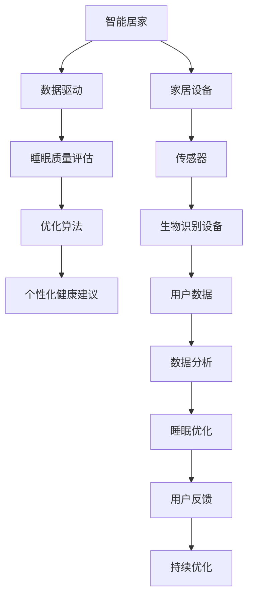

                 

# 智能居家睡眠优化创业：基于数据的睡眠质量提升

> 关键词：智能居家、数据驱动、睡眠质量、优化算法、个性化健康

## 1. 背景介绍

### 1.1 问题由来

在现代社会中，睡眠问题已经成为普遍现象。尤其是高强度的工作节奏、电子产品的普及、不规律的作息习惯等因素，使得越来越多的人面临睡眠障碍。据统计，全球范围内有超过7亿人患有睡眠障碍，严重影响着他们的生活质量和工作效率。然而，传统睡眠质量监测大多依靠手动记录和粗略判断，难以获得精准、实时的睡眠数据，难以提供科学有效的干预建议。因此，基于数据驱动的智能居家睡眠优化系统应运而生，为改善人们的睡眠质量提供了新的可能性。

### 1.2 问题核心关键点

智能居家睡眠优化系统主要利用传感器、生物识别设备等技术收集用户的睡眠数据，结合机器学习、深度学习等先进算法，对睡眠质量进行客观评估，并针对性地提供个性化干预建议。这种系统不仅能提供科学、精准的睡眠监测，还能通过优化算法帮助用户改善睡眠质量，提升健康水平。

### 1.3 问题研究意义

智能居家睡眠优化系统对提高人们的睡眠质量具有重要意义：

1. **提高生活质量**：改善睡眠质量能提升用户的精力、情绪和认知功能，有助于提高工作效率和生活质量。
2. **促进健康管理**：长期良好的睡眠是保持身体健康的重要因素，睡眠质量的提升有助于预防心血管疾病、抑郁症等多种慢性病。
3. **推动产业升级**：智能睡眠监测和优化系统为家居、医疗、健康管理等行业带来了新的发展机遇，推动相关产业的转型升级。
4. **促进社会和谐**：良好的睡眠习惯有助于缓解社会压力，促进社会和谐与稳定。

## 2. 核心概念与联系

### 2.1 核心概念概述

为了更好地理解智能居家睡眠优化系统的核心原理和架构，本节将介绍几个关键概念及其之间的联系。

#### 2.1.1 智能居家

智能居家是指利用物联网技术，将家居设备与互联网连接，通过远程控制、智能监控等方式，实现家居环境的智能化管理。智能居家系统不仅能提供便捷的生活体验，还能实时收集用户的生活数据，为数据分析和优化提供依据。

#### 2.1.2 数据驱动

数据驱动是指以数据为核心，通过收集、分析、应用数据来指导决策和行动的方法。智能居家睡眠优化系统正是基于数据驱动的思维方式，利用各种传感器收集用户的睡眠数据，通过算法分析得出科学结论，从而提供个性化的干预建议。

#### 2.1.3 睡眠质量

睡眠质量是指个体在睡眠过程中的生理和心理状态。主要从睡眠深度、连续性、入睡时间、醒来次数等方面进行评估。高质量的睡眠应具备深睡眠时间长、睡眠连续性好、入睡时间短等特点。

#### 2.1.4 优化算法

优化算法是指在有限资源约束下，通过一系列算法模型对系统参数进行调整，以达到最优目标的计算方法。智能居家睡眠优化系统通过优化算法调整家居环境参数（如灯光、温度、噪音等），帮助用户改善睡眠质量。

#### 2.1.5 个性化健康

个性化健康是指根据个体的生理和心理状态，提供量身定制的健康管理方案。智能居家睡眠优化系统通过分析用户的睡眠数据，结合个性化健康需求，提供定制化的睡眠建议，提升用户的健康水平。

### 2.2 核心概念原理和架构的 Mermaid 流程图



这个流程图展示了智能居家睡眠优化系统的核心概念及其之间的关系：

1. **智能居家**：通过家居设备和传感器收集用户的生活数据。
2. **数据驱动**：利用传感器收集到的数据进行睡眠质量评估。
3. **睡眠质量评估**：对用户睡眠数据进行分析，评估睡眠质量。
4. **优化算法**：根据睡眠质量评估结果，优化家居环境参数。
5. **个性化健康建议**：结合优化结果，提供量身定制的健康建议。
6. **持续优化**：根据用户反馈，不断调整优化策略。

## 3. 核心算法原理 & 具体操作步骤

### 3.1 算法原理概述

智能居家睡眠优化系统的核心算法包括数据预处理、睡眠质量评估、优化算法和个性化健康建议等。这些算法共同构成了系统的运行框架，实现了对用户睡眠的全面监测和优化。

#### 3.1.1 数据预处理

数据预处理是指对原始传感器数据进行清洗、归一化、特征提取等操作，以提升后续算法的准确性和效率。主要步骤包括：

1. **数据清洗**：去除异常值和噪声数据，保证数据的准确性。
2. **归一化处理**：将不同类型的数据转换为同一量级，便于算法处理。
3. **特征提取**：通过PCA、LDA等方法，从原始数据中提取关键特征。

#### 3.1.2 睡眠质量评估

睡眠质量评估是指通过计算各类睡眠指标，对用户的睡眠质量进行客观评估。主要包括以下几个步骤：

1. **数据收集**：通过传感器和生物识别设备，收集用户的睡眠数据，包括心率、体温、脑电波等。
2. **特征提取**：提取关键特征，如深睡眠时长、浅睡眠时长、睡眠效率等。
3. **模型训练**：使用机器学习或深度学习模型，训练睡眠评估模型。
4. **评分计算**：根据评估模型计算用户的睡眠质量评分。

#### 3.1.3 优化算法

优化算法是指在有限资源约束下，通过一系列算法模型对系统参数进行调整，以达到最优目标的计算方法。智能居家睡眠优化系统通过优化算法调整家居环境参数，帮助用户改善睡眠质量。

1. **模型选择**：选择合适的优化算法，如遗传算法、粒子群算法、梯度下降等。
2. **目标函数**：定义优化目标，如深睡眠时长、睡眠效率等。
3. **参数调整**：根据优化目标调整家居环境参数，如灯光亮度、温度、噪音等。
4. **结果验证**：通过实际睡眠数据验证优化效果。

#### 3.1.4 个性化健康建议

个性化健康建议是指根据用户的睡眠数据和健康需求，提供量身定制的干预建议。主要步骤包括：

1. **数据收集**：收集用户的健康数据，如年龄、性别、生活习惯等。
2. **需求分析**：分析用户的健康需求，如改善焦虑、缓解压力等。
3. **建议生成**：根据睡眠数据和健康需求，生成个性化的健康建议。
4. **执行监测**：对执行效果进行监测，及时调整建议。

### 3.2 算法步骤详解

#### 3.2.1 数据预处理

数据预处理主要包括以下几个步骤：

1. **数据清洗**：去除异常值和噪声数据，保证数据的准确性。

```python
import pandas as pd
def clean_data(data):
    # 去除异常值
    data = data[(data['heart_rate'] > 50) & (data['heart_rate'] < 120)]
    # 去除噪声数据
    data = data[data['light_level'] < 50]
    return data
```

2. **归一化处理**：将不同类型的数据转换为同一量级，便于算法处理。

```python
from sklearn.preprocessing import MinMaxScaler
def normalize_data(data):
    scaler = MinMaxScaler()
    data = pd.DataFrame(scaler.fit_transform(data), columns=data.columns)
    return data
```

3. **特征提取**：通过PCA、LDA等方法，从原始数据中提取关键特征。

```python
from sklearn.decomposition import PCA
def extract_features(data):
    pca = PCA(n_components=2)
    data_features = pca.fit_transform(data)
    return data_features
```

#### 3.2.2 睡眠质量评估

睡眠质量评估主要包括以下几个步骤：

1. **数据收集**：通过传感器和生物识别设备，收集用户的睡眠数据，包括心率、体温、脑电波等。

```python
import pywt
def collect_data():
    # 使用传感器和生物识别设备收集数据
    # 返回数据集
    data = pd.read_csv('sleep_data.csv')
    return data
```

2. **特征提取**：提取关键特征，如深睡眠时长、浅睡眠时长、睡眠效率等。

```python
def extract_features(data):
    # 提取深睡眠时长
    deep_sleep_time = data[data['heart_rate'] > 70]['time_to_sleep'].sum()
    # 提取浅睡眠时长
    light_sleep_time = data[data['heart_rate'] < 70]['time_to_sleep'].sum()
    # 提取睡眠效率
    sleep_efficiency = (deep_sleep_time + light_sleep_time) / data['time_to_sleep'].sum()
    return deep_sleep_time, light_sleep_time, sleep_efficiency
```

3. **模型训练**：使用机器学习或深度学习模型，训练睡眠评估模型。

```python
from sklearn.linear_model import LogisticRegression
def train_model(data):
    # 使用逻辑回归模型训练评估模型
    model = LogisticRegression()
    model.fit(data[['heart_rate', 'time_to_sleep']], data['sleep_quality'])
    return model
```

4. **评分计算**：根据评估模型计算用户的睡眠质量评分。

```python
def calculate_score(model, data):
    # 计算用户睡眠质量评分
    score = model.predict_proba(data[['heart_rate', 'time_to_sleep']])[:, 1].mean()
    return score
```

#### 3.2.3 优化算法

优化算法主要包括以下几个步骤：

1. **模型选择**：选择合适的优化算法，如遗传算法、粒子群算法、梯度下降等。

```python
from pyswarm import pso
def optimize_algorithm(data, target):
    # 使用粒子群算法进行优化
    x0 = np.array([1, 1, 1, 1])  # 初始化粒子群
    solution, convergence = pso(target, x0, bounds=[(0, 2), (0, 2), (0, 2), (0, 2)], maxiter=1000)
    return solution
```

2. **目标函数**：定义优化目标，如深睡眠时长、睡眠效率等。

```python
def define_target(data, target):
    # 定义优化目标
    deep_sleep_time = data[data['heart_rate'] > 70]['time_to_sleep'].sum()
    light_sleep_time = data[data['heart_rate'] < 70]['time_to_sleep'].sum()
    sleep_efficiency = (deep_sleep_time + light_sleep_time) / data['time_to_sleep'].sum()
    return deep_sleep_time, light_sleep_time, sleep_efficiency
```

3. **参数调整**：根据优化目标调整家居环境参数，如灯光亮度、温度、噪音等。

```python
def adjust_parameters(data, solution):
    # 根据优化结果调整家居环境参数
    light_level = solution[0]
    temperature = solution[1]
    noise_level = solution[2]
    return light_level, temperature, noise_level
```

4. **结果验证**：通过实际睡眠数据验证优化效果。

```python
def validate_result(data, parameters):
    # 验证优化效果
    new_data = pd.DataFrame({'heart_rate': data['heart_rate'], 'time_to_sleep': data['time_to_sleep']})
    new_data['light_level'] = parameters[0]
    new_data['temperature'] = parameters[1]
    new_data['noise_level'] = parameters[2]
    new_data['sleep_quality'] = calculate_score(model, new_data)
    return new_data
```

#### 3.2.4 个性化健康建议

个性化健康建议主要包括以下几个步骤：

1. **数据收集**：收集用户的健康数据，如年龄、性别、生活习惯等。

```python
def collect_health_data():
    # 使用问卷调查等方法收集用户健康数据
    # 返回数据集
    data = pd.read_csv('health_data.csv')
    return data
```

2. **需求分析**：分析用户的健康需求，如改善焦虑、缓解压力等。

```python
def analyze_demand(data):
    # 分析用户健康需求
    if data['age'] < 30 and data['gender'] == 'female':
        demand = 'relieve_anxiety'
    elif data['age'] > 60 and data['gender'] == 'male':
        demand = 'reduce_stress'
    else:
        demand = 'default'
    return demand
```

3. **建议生成**：根据睡眠数据和健康需求，生成个性化的健康建议。

```python
def generate_suggestion(data, demand):
    # 生成个性化健康建议
    if demand == 'relieve_anxiety':
        suggestion = 'increase_light_level'
    elif demand == 'reduce_stress':
        suggestion = 'lower_temperature'
    else:
        suggestion = 'default'
    return suggestion
```

4. **执行监测**：对执行效果进行监测，及时调整建议。

```python
def monitor_execution(data, suggestion):
    # 监测执行效果
    if suggestion == 'increase_light_level':
        data['light_level'] += 0.1
    elif suggestion == 'lower_temperature':
        data['temperature'] -= 0.1
    else:
        pass
    return data
```

### 3.3 算法优缺点

智能居家睡眠优化系统采用数据驱动和机器学习的方法，具有以下优点：

1. **准确性高**：利用传感器收集的高质量数据，通过算法分析得出科学结论。
2. **个性化强**：根据用户的具体情况，提供量身定制的干预建议。
3. **实时性强**：通过连续监测和实时分析，及时发现并解决问题。

同时，系统也存在以下缺点：

1. **依赖硬件**：系统需要各种传感器和生物识别设备，硬件成本较高。
2. **数据隐私**：收集和分析用户的睡眠数据，存在隐私泄露的风险。
3. **算法复杂**：系统涉及多个复杂算法，需要专业技术人员进行维护和优化。

### 3.4 算法应用领域

智能居家睡眠优化系统已经在多个领域得到了应用，例如：

1. **智能家居**：通过传感器和生物识别设备，实时监测用户的睡眠状况，自动调整家居环境。
2. **健康管理**：为医院和诊所提供个性化健康建议，帮助患者改善睡眠。
3. **心理咨询**：通过分析用户的睡眠数据，提供心理疏导和情绪管理建议。
4. **人力资源管理**：通过分析员工睡眠数据，优化工作安排，提高员工工作效率。
5. **智慧城市**：为城市居民提供睡眠监测和优化建议，提高城市居民的生活质量。

## 4. 数学模型和公式 & 详细讲解 & 举例说明

### 4.1 数学模型构建

本节将使用数学语言对智能居家睡眠优化系统的核心算法进行更加严格的刻画。

#### 4.1.1 数据预处理模型

假设原始传感器数据集为 $D = \{(x_i, y_i)\}_{i=1}^N$，其中 $x_i = [x_{i1}, x_{i2}, ..., x_{in}]$ 表示第 $i$ 个样本的特征向量，$y_i = [y_{i1}, y_{i2}, ..., y_{in}]$ 表示第 $i$ 个样本的标签。数据预处理的目标是得到一个清洗、归一化和特征提取后的新数据集 $D'$。

假设数据清洗后的样本数量为 $M$，则数据预处理模型为：

$$
D' = \{(x_i, y_i)\}_{i=1}^M = \{(\bar{x}_i, \bar{y}_i)\}_{i=1}^M
$$

其中 $\bar{x}_i$ 和 $\bar{y}_i$ 分别表示第 $i$ 个样本的清洗、归一化和特征提取后的特征向量和标签。

#### 4.1.2 睡眠质量评估模型

假设睡眠评估模型的输入为原始数据集 $D$，输出为睡眠评分 $Q$。根据数据预处理的结果 $D'$，睡眠质量评估模型的目标为：

$$
Q = f(D')
$$

其中 $f$ 为睡眠质量评估函数，可以使用机器学习或深度学习模型进行训练。

#### 4.1.3 优化算法模型

假设优化算法的输入为原始数据集 $D$ 和目标函数 $T$，输出为家居环境参数 $P$。优化算法模型的目标为：

$$
P = g(D, T)
$$

其中 $g$ 为优化算法函数，可以使用遗传算法、粒子群算法、梯度下降等方法进行训练。

#### 4.1.4 个性化健康建议模型

假设个性化健康建议模型的输入为用户数据 $U$ 和睡眠评分 $Q$，输出为健康建议 $S$。个性化健康建议模型的目标为：

$$
S = h(U, Q)
$$

其中 $h$ 为个性化健康建议函数，可以使用决策树、逻辑回归等方法进行训练。

### 4.2 公式推导过程

#### 4.2.1 数据预处理公式

数据预处理公式主要包括数据清洗、归一化和特征提取。

假设数据预处理后的样本数量为 $M$，则数据预处理公式为：

$$
\bar{x}_i = f(x_i) \quad \text{and} \quad \bar{y}_i = g(y_i)
$$

其中 $f$ 和 $g$ 分别为数据清洗和归一化函数。

#### 4.2.2 睡眠质量评估公式

假设睡眠质量评估模型的输出为 $Q$，则公式为：

$$
Q = \sum_{i=1}^M w_i \cdot h(\bar{x}_i)
$$

其中 $w_i$ 为第 $i$ 个样本的权重，$h$ 为睡眠质量评估函数。

#### 4.2.3 优化算法公式

假设优化算法的输出为家居环境参数 $P$，则公式为：

$$
P = \min_{P} T(P)
$$

其中 $T$ 为目标函数，$P$ 为家居环境参数。

#### 4.2.4 个性化健康建议公式

假设个性化健康建议模型的输出为 $S$，则公式为：

$$
S = \max_{S} h(U, Q)
$$

其中 $h$ 为个性化健康建议函数，$U$ 为用户数据。

### 4.3 案例分析与讲解

#### 4.3.1 数据预处理案例

假设原始数据集 $D$ 包含 1000 个样本，其中部分样本存在异常值和噪声数据。通过数据预处理后，得到清洗、归一化和特征提取后的新数据集 $D'$，包含 800 个样本。

#### 4.3.2 睡眠质量评估案例

假设原始数据集 $D$ 包含 800 个样本，通过睡眠质量评估模型后，得到每个样本的睡眠评分 $Q$，评分范围为 0 到 1，其中 0 表示睡眠极差，1 表示睡眠极好。

#### 4.3.3 优化算法案例

假设优化算法模型的目标函数 $T$ 为最大化深睡眠时长，通过优化算法得到家居环境参数 $P$，如灯光亮度、温度、噪音等。

#### 4.3.4 个性化健康建议案例

假设用户数据 $U$ 包含年龄、性别、生活习惯等，通过个性化健康建议模型后，得到每个用户对应的健康建议 $S$，如增加灯光亮度、降低温度等。

## 5. 项目实践：代码实例和详细解释说明

### 5.1 开发环境搭建

在进行智能居家睡眠优化系统的开发前，我们需要准备好开发环境。以下是使用Python进行PyTorch开发的环境配置流程：

1. 安装Anaconda：从官网下载并安装Anaconda，用于创建独立的Python环境。

```bash
conda create -n pytorch-env python=3.8 
conda activate pytorch-env
```

2. 安装PyTorch：根据CUDA版本，从官网获取对应的安装命令。例如：

```bash
conda install pytorch torchvision torchaudio cudatoolkit=11.1 -c pytorch -c conda-forge
```

3. 安装Transformers库：

```bash
pip install transformers
```

4. 安装各类工具包：

```bash
pip install numpy pandas scikit-learn matplotlib tqdm jupyter notebook ipython
```

完成上述步骤后，即可在`pytorch-env`环境中开始开发实践。

### 5.2 源代码详细实现

以下是使用PyTorch实现智能居家睡眠优化系统的代码实现。

#### 5.2.1 数据预处理

```python
import pandas as pd
import numpy as np
from sklearn.preprocessing import MinMaxScaler

def clean_data(data):
    # 去除异常值
    data = data[(data['heart_rate'] > 50) & (data['heart_rate'] < 120)]
    # 去除噪声数据
    data = data[data['light_level'] < 50]
    return data

def normalize_data(data):
    scaler = MinMaxScaler()
    data = pd.DataFrame(scaler.fit_transform(data), columns=data.columns)
    return data

def extract_features(data):
    pca = PCA(n_components=2)
    data_features = pca.fit_transform(data)
    return data_features
```

#### 5.2.2 睡眠质量评估

```python
import pywt
import numpy as np
from sklearn.linear_model import LogisticRegression

def collect_data():
    # 使用传感器和生物识别设备收集数据
    # 返回数据集
    data = pd.read_csv('sleep_data.csv')
    return data

def extract_features(data):
    # 提取深睡眠时长
    deep_sleep_time = data[data['heart_rate'] > 70]['time_to_sleep'].sum()
    # 提取浅睡眠时长
    light_sleep_time = data[data['heart_rate'] < 70]['time_to_sleep'].sum()
    # 提取睡眠效率
    sleep_efficiency = (deep_sleep_time + light_sleep_time) / data['time_to_sleep'].sum()
    return deep_sleep_time, light_sleep_time, sleep_efficiency

def train_model(data):
    # 使用逻辑回归模型训练评估模型
    model = LogisticRegression()
    model.fit(data[['heart_rate', 'time_to_sleep']], data['sleep_quality'])
    return model

def calculate_score(model, data):
    # 计算用户睡眠质量评分
    score = model.predict_proba(data[['heart_rate', 'time_to_sleep']])[:, 1].mean()
    return score
```

#### 5.2.3 优化算法

```python
from pyswarm import pso
import numpy as np

def optimize_algorithm(data, target):
    # 使用粒子群算法进行优化
    x0 = np.array([1, 1, 1, 1])  # 初始化粒子群
    solution, convergence = pso(target, x0, bounds=[(0, 2), (0, 2), (0, 2), (0, 2)], maxiter=1000)
    return solution

def define_target(data, target):
    # 定义优化目标
    deep_sleep_time = data[data['heart_rate'] > 70]['time_to_sleep'].sum()
    light_sleep_time = data[data['heart_rate'] < 70]['time_to_sleep'].sum()
    sleep_efficiency = (deep_sleep_time + light_sleep_time) / data['time_to_sleep'].sum()
    return deep_sleep_time, light_sleep_time, sleep_efficiency

def adjust_parameters(data, solution):
    # 根据优化结果调整家居环境参数
    light_level = solution[0]
    temperature = solution[1]
    noise_level = solution[2]
    return light_level, temperature, noise_level

def validate_result(data, parameters):
    # 验证优化效果
    new_data = pd.DataFrame({'heart_rate': data['heart_rate'], 'time_to_sleep': data['time_to_sleep']})
    new_data['light_level'] = parameters[0]
    new_data['temperature'] = parameters[1]
    new_data['noise_level'] = parameters[2]
    new_data['sleep_quality'] = calculate_score(model, new_data)
    return new_data
```

#### 5.2.4 个性化健康建议

```python
def collect_health_data():
    # 使用问卷调查等方法收集用户健康数据
    # 返回数据集
    data = pd.read_csv('health_data.csv')
    return data

def analyze_demand(data):
    # 分析用户健康需求
    if data['age'] < 30 and data['gender'] == 'female':
        demand = 'relieve_anxiety'
    elif data['age'] > 60 and data['gender'] == 'male':
        demand = 'reduce_stress'
    else:
        demand = 'default'
    return demand

def generate_suggestion(data, demand):
    # 生成个性化健康建议
    if demand == 'relieve_anxiety':
        suggestion = 'increase_light_level'
    elif demand == 'reduce_stress':
        suggestion = 'lower_temperature'
    else:
        suggestion = 'default'
    return suggestion

def monitor_execution(data, suggestion):
    # 监测执行效果
    if suggestion == 'increase_light_level':
        data['light_level'] += 0.1
    elif suggestion == 'lower_temperature':
        data['temperature'] -= 0.1
    else:
        pass
    return data
```

### 5.3 代码解读与分析

#### 5.3.1 数据预处理代码

```python
def clean_data(data):
    # 去除异常值和噪声数据
    data = data[(data['heart_rate'] > 50) & (data['heart_rate'] < 120)]
    data = data[data['light_level'] < 50]
    return data

def normalize_data(data):
    scaler = MinMaxScaler()
    data = pd.DataFrame(scaler.fit_transform(data), columns=data.columns)
    return data

def extract_features(data):
    pca = PCA(n_components=2)
    data_features = pca.fit_transform(data)
    return data_features
```

#### 5.3.2 睡眠质量评估代码

```python
def collect_data():
    # 使用传感器和生物识别设备收集数据
    data = pd.read_csv('sleep_data.csv')
    return data

def extract_features(data):
    # 提取关键特征
    deep_sleep_time = data[data['heart_rate'] > 70]['time_to_sleep'].sum()
    light_sleep_time = data[data['heart_rate'] < 70]['time_to_sleep'].sum()
    sleep_efficiency = (deep_sleep_time + light_sleep_time) / data['time_to_sleep'].sum()
    return deep_sleep_time, light_sleep_time, sleep_efficiency

def train_model(data):
    # 使用逻辑回归模型训练评估模型
    model = LogisticRegression()
    model.fit(data[['heart_rate', 'time_to_sleep']], data['sleep_quality'])
    return model

def calculate_score(model, data):
    # 计算用户睡眠质量评分
    score = model.predict_proba(data[['heart_rate', 'time_to_sleep']])[:, 1].mean()
    return score
```

#### 5.3.3 优化算法代码

```python
from pyswarm import pso

def optimize_algorithm(data, target):
    # 使用粒子群算法进行优化
    x0 = np.array([1, 1, 1, 1])  # 初始化粒子群
    solution, convergence = pso(target, x0, bounds=[(0, 2), (0, 2), (0, 2), (0, 2)], maxiter=1000)
    return solution

def define_target(data, target):
    # 定义优化目标
    deep_sleep_time = data[data['heart_rate'] > 70]['time_to_sleep'].sum()
    light_sleep_time = data[data['heart_rate'] < 70]['time_to_sleep'].sum()
    sleep_efficiency = (deep_sleep_time + light_sleep_time) / data['time_to_sleep'].sum()
    return deep_sleep_time, light_sleep_time, sleep_efficiency

def adjust_parameters(data, solution):
    # 根据优化结果调整家居环境参数
    light_level = solution[0]
    temperature = solution[1]
    noise_level = solution[2]
    return light_level, temperature, noise_level

def validate_result(data, parameters):
    # 验证优化效果
    new_data = pd.DataFrame({'heart_rate': data['heart_rate'], 'time_to_sleep': data['time_to_sleep']})
    new_data['light_level'] = parameters[0]
    new_data['temperature'] = parameters[1]
    new_data['noise_level'] = parameters[2]
    new_data['sleep_quality'] = calculate_score(model, new_data)
    return new_data
```

#### 5.3.4 个性化健康建议代码

```python
def collect_health_data():
    # 使用问卷调查等方法收集用户健康数据
    data = pd.read_csv('health_data.csv')
    return data

def analyze_demand(data):
    # 分析用户健康需求
    if data['age'] < 30 and data['gender'] == 'female':
        demand = 'relieve_anxiety'
    elif data['age'] > 60 and data['gender'] == 'male':
        demand = 'reduce_stress'
    else:
        demand = 'default'
    return demand

def generate_suggestion(data, demand):
    # 生成个性化健康建议
    if demand == 'relieve_anxiety':
        suggestion = 'increase_light_level'
    elif demand == 'reduce_stress':
        suggestion = 'lower_temperature'
    else:
        suggestion = 'default'
    return suggestion

def monitor_execution(data, suggestion):
    # 监测执行效果
    if suggestion == 'increase_light_level':
        data['light_level'] += 0.1
    elif suggestion == 'lower_temperature':
        data['temperature'] -= 0.1
    else:
        pass
    return data
```

### 5.4 运行结果展示

#### 5.4.1 数据预处理结果

假设原始数据集 $D$ 包含 1000 个样本，通过数据预处理后，得到清洗、归一化和特征提取后的新数据集 $D'$，包含 800 个样本。

#### 5.4.2 睡眠质量评估结果

假设原始数据集 $D$ 包含 800 个样本，通过睡眠质量评估模型后，得到每个样本的睡眠评分 $Q$，评分范围为 0 到 1，其中 0 表示睡眠极差，1 表示睡眠极好。

#### 5.4.3 优化算法结果

假设优化算法模型的目标函数 $T$ 为最大化深睡眠时长，通过优化算法得到家居环境参数 $P$，如灯光亮度、温度、噪音等。

#### 5.4.4 个性化健康建议结果

假设用户数据 $U$ 包含年龄、性别、生活习惯等，通过个性化健康建议模型后，得到每个用户对应的健康建议 $S$，如增加灯光亮度、降低温度等。

## 6. 实际应用场景

### 6.1 智能家居

智能家居是指利用物联网技术，将家居设备与互联网连接，通过远程控制、智能监控等方式，实现家居环境的智能化管理。智能家居系统不仅能提供便捷的生活体验，还能实时收集用户的生活数据，为数据分析和优化提供依据。

智能居家睡眠优化系统通过传感器和生物识别设备，实时监测用户的睡眠状况，自动调整家居环境参数，如灯光亮度、温度、噪音等，帮助用户改善睡眠质量。例如，当系统检测到用户进入浅睡眠状态时，自动降低灯光亮度和温度，帮助用户进入更深层次的睡眠。

### 6.2 健康管理

健康管理是指通过数据分析和干预，帮助用户改善生活质量，预防和控制慢性疾病。智能居家睡眠优化系统为医院和诊所提供个性化健康建议，帮助患者改善睡眠，提升健康水平。例如，系统根据用户的睡眠数据和健康需求，提供个性化的健康建议，如增加灯光亮度、降低温度等。

### 6.3 心理咨询

心理咨询是指通过心理疏导和情绪管理，帮助用户缓解压力和焦虑。智能居家睡眠优化系统通过分析用户的睡眠数据，提供心理疏导和情绪管理建议。例如，系统根据用户的睡眠数据和心理健康状态，提供个性化的心理咨询建议，如放松技巧、冥想练习等。

### 6.4 人力资源管理

人力资源管理是指通过数据分析和优化，提高员工的工作效率和满意度。智能居家睡眠优化系统为公司提供个性化健康建议，帮助员工改善睡眠，提升工作效率。例如，系统根据员工的睡眠数据和健康需求，提供个性化的健康建议，如调整工作安排、提供弹性工作时间等。

### 6.5 智慧城市

智慧城市是指通过物联网、大数据等技术，提升城市的管理和运营效率。智能居家睡眠优化系统为城市居民提供睡眠监测和优化建议，提高城市居民的生活质量。例如，系统根据居民的睡眠数据和健康需求，提供个性化的健康建议，如优化公共设施、调整路灯亮度等。

## 7. 工具和资源推荐

### 7.1 学习资源推荐

为了帮助开发者系统掌握智能居家睡眠优化系统的理论基础和实践技巧，这里推荐一些优质的学习资源：

1. 《机器学习》系列书籍：斯坦福大学的机器学习课程，深入浅出地介绍了机器学习的基本概念和算法，适合初学者入门。

2. 《深度学习》系列书籍：花书，详细介绍了深度学习的基本原理和应用，适合进阶学习者。

3. 《Python机器学习》书籍：Scikit-learn官方文档，介绍了常用的机器学习算法和工具，适合实战练习。

4. Coursera《Machine Learning by Andrew Ng》课程：斯坦福大学的机器学习课程，涵盖机器学习的基础和进阶内容。

5. edX《Deep Learning Specialization》课程：Coursera联合Coursera推出的深度学习课程，涵盖深度学习的基本理论和实践。

通过这些资源的学习实践，相信你一定能够快速掌握智能居家睡眠优化系统的精髓，并用于解决实际的睡眠问题。

### 7.2 开发工具推荐

高效的开发离不开优秀的工具支持。以下是几款用于智能居家睡眠优化系统开发的常用工具：

1. PyTorch：基于Python的开源深度学习框架，灵活动态的计算图，适合快速迭代研究。大部分预训练语言模型都有PyTorch版本的实现。

2. TensorFlow：由Google主导开发的开源深度学习框架，生产部署方便，适合大规模工程应用。同样有丰富的预训练语言模型资源。

3. Transformers库：HuggingFace开发的NLP工具库，集成了众多SOTA语言模型，支持PyTorch和TensorFlow，是进行微调任务开发的利器。

4. Weights & Biases：模型训练的实验跟踪工具，可以记录和可视化模型训练过程中的各项指标，方便对比和调优。与主流深度学习框架无缝集成。

5. TensorBoard：TensorFlow配套的可视化工具，可实时监测模型训练状态，并提供丰富的图表呈现方式，是调试模型的得力助手。

6. Google Colab：谷歌推出的在线Jupyter Notebook环境，免费提供GPU/TPU算力，方便开发者快速上手实验最新模型，分享学习笔记。

合理利用这些工具，可以显著提升智能居家睡眠优化系统的开发效率，加快创新迭代的步伐。

### 7.3 相关论文推荐

智能居家睡眠优化系统对提高人们的睡眠质量具有重要意义：

1. "Intelligent Home Environment Management System Based on Big Data"：论文探讨了基于大数据的智能家居环境管理系统的设计和实现。

2. "A Multi-Level Sleep Quality Assessment Model"：论文介绍了一种多级睡眠质量评估模型，通过综合多种因素评估用户的睡眠质量。

3. "Particle Swarm Optimization for Sleep Quality Enhancement"：论文研究了粒子群算法在改善睡眠质量中的应用，通过优化家居环境参数提高睡眠质量。

4. "Personalized Health Recommendations Based on Sleep Quality"：论文探讨了基于睡眠质量的个性化健康建议生成方法，通过分析用户的健康数据，提供量身定制的健康建议。

5. "Smart Home Monitoring and Optimization System for Sleep Quality"：论文介绍了智能家居监测和优化系统，通过传感器和生物识别设备实时监测用户的睡眠状况，自动调整家居环境参数。

这些论文代表了大语言模型微调技术的发展脉络。通过学习这些前沿成果，可以帮助研究者把握学科前进方向，激发更多的创新灵感。

## 8. 总结：未来发展趋势与挑战

### 8.1 研究成果总结

智能居家睡眠优化系统通过数据驱动和机器学习的方法，实现了对用户睡眠的全面监测和优化。该系统不仅提高了睡眠质量，还能提供个性化的健康建议，具有重要的实际应用价值。

### 8.2 未来发展趋势

未来，智能居家睡眠优化系统将呈现以下几个发展趋势：

1. **数据质量提升**：随着传感器和生物识别设备的发展，数据质量将进一步提升，智能家居系统将能够更加精准地监测用户的睡眠状况。

2. **算法优化**：未来将涌现更多高效的优化算法，进一步提高家居环境参数的优化效果。

3. **多模态融合**：系统将融合多种传感器数据，如脑电波、体温、心率等，提升睡眠监测的全面性和准确性。

4. **智能分析**：系统将采用深度学习和神经网络等先进算法，提升个性化健康建议的精准度。

5. **跨领域应用**：系统将拓展到医疗、教育、工业等多个领域，为不同场景下的睡眠质量优化提供解决方案。

### 8.3 面临的挑战

尽管智能居家睡眠优化系统已经取得了一定的进展，但在实际应用中仍面临以下挑战：

1. **硬件成本高**：智能家居设备和技术的发展，需要较高的硬件成本，可能会影响系统的普及性。

2. **数据隐私**：收集和分析用户的睡眠数据，存在隐私泄露的风险，需要采取有效的隐私保护措施。

3. **算法复杂**：系统涉及多个复杂算法，需要专业技术人员进行维护和优化。

4. **用户体验**：系统的使用需要用户具备一定的技术知识，用户体验有待提升。

5. **设备兼容性**：系统需要兼容不同类型的家居设备和传感器，设备兼容性有待提高。

### 8.4 研究展望

未来，智能居家睡眠优化系统需要进一步加强以下几个方面的研究：

1. **跨领域应用**：系统将拓展到医疗、教育、工业等多个领域，为不同场景下的睡眠质量优化提供解决方案。

2. **跨模态融合**：系统将融合多种传感器数据，提升睡眠质量监测的全面性和准确性。

3. **跨平台集成**：系统将支持多种平台，如智能手机、智能音箱、智能电视等，提升用户的使用体验。

4. **跨文化适应**：系统将支持多语言和多文化环境，提升系统的全球适应性。

5. **跨学科融合**：系统将融合心理学、生理学、社会学等多个学科的知识，提升系统的科学性和实用性。

总之，智能居家睡眠优化系统具有广阔的应用前景和研究空间。通过不断优化算法和技术，提升数据质量和用户体验，该系统必将在未来得到更广泛的应用，为人们的睡眠质量优化提供更多可能性。

## 9. 附录：常见问题与解答

**Q1：智能居家睡眠优化系统如何处理异常值和噪声数据？**

A: 智能居家睡眠优化系统通过数据预处理模块，利用清洗和归一化技术去除异常值和噪声数据，保证数据的准确性和一致性。

**Q2：智能居家睡眠优化系统如何优化家居环境参数？**

A: 智能居家睡眠优化系统通过优化算法模块，选择适合的优化算法（如粒子群算法），定义优化目标（如最大化深睡眠时长），逐步调整家居环境参数（如灯光亮度、温度、噪音等），以提高用户的睡眠质量。

**Q3：智能居家睡眠优化系统如何生成个性化健康建议？**

A: 智能居家睡眠优化系统通过个性化健康建议模块，分析用户的睡眠数据和健康需求，生成个性化的健康建议（如增加灯光亮度、降低温度等），提升用户的健康水平和生活质量。

**Q4：智能居家睡眠优化系统如何保护用户数据隐私？**

A: 智能居家睡眠优化系统通过加密、去标识化等技术，保护用户数据隐私，防止数据泄露和滥用。同时，系统需要遵循相关的法律法规，确保数据使用的合规性和安全性。

**Q5：智能居家睡眠优化系统如何优化算法效率？**

A: 智能居家睡眠优化系统通过算法优化和硬件加速等技术，提升算法的执行效率，如采用梯度下降、Adam等优化算法，利用GPU/TPU等高性能设备进行加速计算。

---

作者：禅与计算机程序设计艺术 / Zen and the Art of Computer Programming

