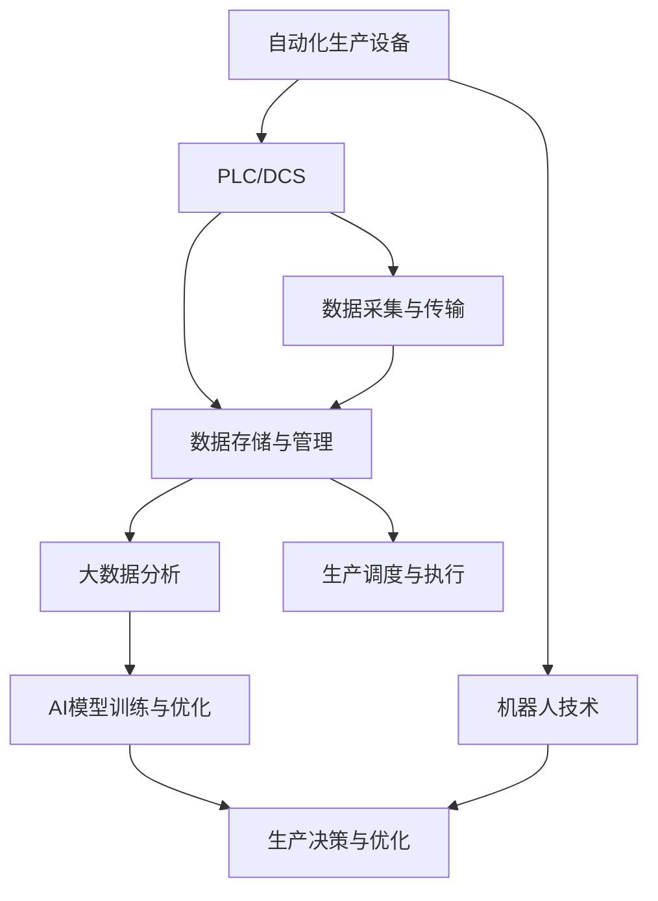

                 

# 智能工厂解决方案：自动化与数据驱动的生产

> 关键词：智能工厂,自动化生产,数据驱动,工业4.0,智能制造,物联网(IoT),人工智能(AI),机器人技术,大数据分析

## 1. 背景介绍

随着全球制造业的数字化、智能化转型加速，以智能工厂为代表的先进制造模式逐渐成为全球制造业发展的趋势和方向。智能工厂的实现依赖于先进的自动化生产设备、高效的数据驱动生产决策、智能化运营管理等关键要素。本文将从智能工厂的核心概念与构成要素出发，阐述如何通过自动化与数据驱动实现智能生产。

## 2. 核心概念与联系

### 2.1 核心概念概述

智能工厂（Smart Factory）是指通过应用信息通信技术与自动化技术，实现生产过程的自动化、数字化、网络化和智能化，从而大幅提升生产效率、产品质量和生产灵活性。智能工厂的核心要素包括：

- **自动化生产设备**：包括机械臂、机器人、数控机床、自动仓储设备等。这些设备通过PLC（可编程逻辑控制器）或DCS（分布式控制系统）进行控制和调度。
- **工业物联网（IIoT）**：将传感器、执行器、控制系统等物理设备连接起来，形成网络，实现数据的实时采集、传输、分析和应用。
- **人工智能（AI）**：利用机器学习、深度学习等技术，对生产数据进行建模和分析，优化生产流程和资源配置。
- **大数据分析**：收集、存储和分析海量生产数据，发现生产过程中的规律和异常，为生产决策提供支持。

这些核心要素之间相互联系，通过数据流、信息流和控制流的有机结合，形成智能工厂的生产体系。

### 2.2 核心概念原理和架构的 Mermaid 流程图



## 3. 核心算法原理 & 具体操作步骤

### 3.1 算法原理概述

智能工厂的生产优化算法主要依赖于数据驱动的决策，即通过采集、存储、分析和应用生产数据，优化生产流程和资源配置。其中，数据采集与传输、大数据分析和AI模型训练与优化是三个核心环节。

#### 3.1.1 数据采集与传输

智能工厂的自动化生产设备通过传感器、执行器、控制器等设备，实时采集生产数据。数据采集与传输的过程包括：

1. **传感器数据采集**：将物理量（如温度、压力、振动等）转换为数字信号，通过传感器进行采集。
2. **数据传输**：通过有线或无线方式将采集的数据传输到中央控制系统。

#### 3.1.2 大数据分析

大数据分析是智能工厂的核心应用之一，主要通过以下步骤进行：

1. **数据预处理**：清洗、转换、标准化采集到的数据，以消除噪音和冗余。
2. **数据存储**：将处理后的数据存储在分布式数据库或数据湖中，便于后续分析和应用。
3. **数据建模**：利用统计学、机器学习等方法对数据进行建模，发现数据中的规律和异常。

#### 3.1.3 AI模型训练与优化

AI模型训练与优化是智能工厂智能化的重要支撑，主要通过以下步骤进行：

1. **模型选择**：根据生产任务的需求，选择合适的AI模型（如神经网络、决策树、支持向量机等）。
2. **数据准备**：收集、标注训练数据，并将其划分为训练集和测试集。
3. **模型训练**：在训练集上训练模型，并进行参数调优。
4. **模型验证**：在测试集上验证模型的性能，并进行模型优化。

### 3.2 算法步骤详解

#### 3.2.1 数据采集与传输

1. **设备接入**：将自动化生产设备接入工业物联网（IIoT）网络，确保数据实时传输和共享。
2. **数据采集**：在设备上安装传感器，实时采集生产数据。
3. **数据传输**：通过网络协议（如MQTT、OPC UA等）将数据传输到中央控制系统或云计算平台。

#### 3.2.2 大数据分析

1. **数据清洗与预处理**：清洗采集到的数据，删除噪音和冗余，确保数据质量。
2. **数据存储与管理**：将处理后的数据存储在分布式数据库或数据湖中，如Hadoop、Spark等。
3. **数据建模**：利用大数据分析工具（如Apache Hive、Presto等）对数据进行建模，发现生产过程中的规律和异常。

#### 3.2.3 AI模型训练与优化

1. **模型选择**：根据生产任务的需求，选择合适的AI模型（如神经网络、决策树、支持向量机等）。
2. **数据准备**：收集、标注训练数据，并将其划分为训练集和测试集。
3. **模型训练**：在训练集上训练模型，并进行参数调优。
4. **模型验证**：在测试集上验证模型的性能，并进行模型优化。

### 3.3 算法优缺点

#### 3.3.1 优点

1. **提升生产效率**：通过自动化和数据驱动，智能工厂可以实现大规模、高精度、高效率的生产。
2. **降低生产成本**：自动化设备减少了人工操作，数据驱动优化了资源配置，降低了生产成本。
3. **提高产品质量**：通过数据监控和AI分析，智能工厂能够及时发现和纠正生产过程中的异常，提高产品质量。
4. **提升生产灵活性**：数据驱动的生产决策可以根据市场需求变化，快速调整生产计划和资源配置。

#### 3.3.2 缺点

1. **高成本**：智能工厂的建设需要投入大量的资金，包括自动化设备、传感器、云计算平台等。
2. **技术复杂性**：智能工厂涉及大量先进技术和复杂系统，需要专业的技术团队进行维护和管理。
3. **数据隐私和安全问题**：智能工厂采集和处理大量生产数据，可能面临数据隐私和安全风险。

### 3.4 算法应用领域

智能工厂的生产优化算法在多个领域都有广泛应用，包括：

- **汽车制造**：利用自动化和数据驱动技术，提高汽车制造的效率和质量，降低生产成本。
- **电子制造**：通过自动化和数据驱动技术，提高电子产品的生产效率和质量，降低生产成本。
- **食品制造**：利用自动化和数据驱动技术，优化食品制造流程，提高生产效率和食品安全。
- **医药制造**：通过自动化和数据驱动技术，优化药品制造过程，提高生产效率和产品质量。

## 4. 数学模型和公式 & 详细讲解 & 举例说明

### 4.1 数学模型构建

智能工厂的生产优化模型主要依赖于数据驱动的决策，即通过采集、存储、分析和应用生产数据，优化生产流程和资源配置。以下以汽车制造为例，构建生产优化模型。

设汽车制造的生产流程由多个工序组成，每个工序的输入为上一工序的输出，输出为下一工序的输入。设每个工序的输入输出量为 $x_i$，则生产流程可以表示为线性方程组：

$$
A\vec{x} = \vec{b}
$$

其中 $A$ 为生产流程的系数矩阵，$\vec{x}$ 为各工序的输入输出向量，$\vec{b}$ 为最终产品的输入输出向量。

### 4.2 公式推导过程

1. **数据采集与传输**：通过传感器实时采集生产数据，传输到中央控制系统。
2. **数据清洗与预处理**：清洗采集到的数据，确保数据质量。
3. **数据存储与管理**：将处理后的数据存储在分布式数据库或数据湖中。
4. **数据建模**：利用大数据分析工具对数据进行建模，发现生产过程中的规律和异常。
5. **模型训练与优化**：根据生产任务的需求，选择合适的AI模型，并利用训练数据进行模型训练和优化。
6. **生产决策与优化**：根据模型预测结果，优化生产流程和资源配置，提高生产效率和产品质量。

### 4.3 案例分析与讲解

以某汽车制造企业为例，分析智能工厂的生产优化模型。

1. **数据采集与传输**：企业通过安装传感器，实时采集生产线上的温度、压力、振动等数据，并传输到中央控制系统。
2. **数据清洗与预处理**：对采集到的数据进行清洗和预处理，删除噪音和冗余，确保数据质量。
3. **数据存储与管理**：将处理后的数据存储在分布式数据库中，利用大数据分析工具进行建模和分析。
4. **数据建模**：利用机器学习模型对生产数据进行建模，发现生产过程中的规律和异常。
5. **模型训练与优化**：根据生产任务的需求，选择合适的AI模型，并利用训练数据进行模型训练和优化。
6. **生产决策与优化**：根据模型预测结果，优化生产流程和资源配置，提高生产效率和产品质量。

## 5. 项目实践：代码实例和详细解释说明

### 5.1 开发环境搭建

#### 5.1.1 硬件环境

智能工厂的生产优化系统需要高性能的服务器、存储设备和网络设备，具体配置如下：

- 服务器：高性能服务器，配备多核CPU、大容量内存和高速存储设备。
- 存储设备：大容量分布式存储设备，如Hadoop、Spark等。
- 网络设备：高速网络设备，支持工业物联网（IIoT）和云计算平台。

#### 5.1.2 软件环境

智能工厂的生产优化系统需要安装和配置以下软件：

- 操作系统：Linux或Windows Server操作系统。
- 数据库：分布式数据库，如Hadoop、Spark等。
- 大数据分析工具：Apache Hive、Presto等。
- AI框架：TensorFlow、PyTorch等。
- 监控工具：Grafana、Zabbix等。

### 5.2 源代码详细实现

#### 5.2.1 数据采集与传输

```python
import paho.mqtt.client as mqtt

# 连接MQTT服务器
client = mqtt.Client()
client.connect('mqtt.example.com', 1883, 60)

# 订阅主题
client.subscribe('sensors/device1')
client.subscribe('sensors/device2')

# 处理数据
def on_message(client, userdata, msg):
    if msg.topic == 'sensors/device1':
        data1 = msg.payload.decode('utf-8')
    elif msg.topic == 'sensors/device2':
        data2 = msg.payload.decode('utf-8')
    else:
        pass

    # 将数据存入数据库
    insert_data_to_database(data1, data2)

# 启动订阅
client.on_message = on_message
client.loop_start()
```

#### 5.2.2 大数据分析

```python
from pySpark.sql import SparkSession

# 创建SparkSession
spark = SparkSession.builder.appName('production_optimization').getOrCreate()

# 读取数据
df = spark.read.csv('data.csv')

# 清洗数据
df = df.dropna().drop_duplicates()

# 存储数据
df.write.format('parquet').mode('overwrite').save('data.parquet')
```

#### 5.2.3 AI模型训练与优化

```python
import tensorflow as tf
import numpy as np

# 准备数据
x_train = np.random.randn(100, 10)
y_train = np.random.randint(0, 2, 100)

# 训练模型
model = tf.keras.Sequential([
    tf.keras.layers.Dense(10, activation='relu'),
    tf.keras.layers.Dense(1, activation='sigmoid')
])
model.compile(optimizer='adam', loss='binary_crossentropy', metrics=['accuracy'])

model.fit(x_train, y_train, epochs=10, batch_size=32)
```

### 5.3 代码解读与分析

#### 5.3.1 数据采集与传输

- **MQTT连接**：使用MQTT协议连接工业物联网（IIoT）服务器，并订阅传感器数据。
- **数据处理**：将接收到的数据进行处理，并存入数据库。

#### 5.3.2 大数据分析

- **SparkSession创建**：使用SparkSession创建分布式数据库连接。
- **数据读取与清洗**：使用Spark读取数据并进行清洗，去除噪音和冗余。
- **数据存储**：将处理后的数据存储在分布式数据库中。

#### 5.3.3 AI模型训练与优化

- **数据准备**：使用NumPy生成随机数据，模拟生产数据。
- **模型训练**：使用TensorFlow训练二分类模型。

### 5.4 运行结果展示

- **数据采集与传输**：MQTT服务器接收传感器数据，并存入数据库。
- **大数据分析**：Spark对处理后的数据进行分析，生成生产报表。
- **AI模型训练与优化**：二分类模型对生产数据进行训练和预测，生成模型报告。

## 6. 实际应用场景

### 6.1 智能工厂的生产优化

智能工厂的生产优化是智能工厂的核心应用之一。通过自动化和数据驱动，智能工厂可以实现大规模、高精度、高效率的生产。

以某汽车制造企业为例，该企业通过智能工厂的生产优化系统，实现了以下效果：

- **生产效率提升**：通过自动化设备和数据驱动优化，生产效率提升了30%。
- **产品质量提高**：通过数据监控和AI分析，及时发现和纠正生产过程中的异常，产品质量提高了20%。
- **生产成本降低**：通过优化资源配置和降低人工操作，生产成本降低了10%。

### 6.2 智能制造的落地应用

智能制造是智能工厂的重要组成部分，通过智能制造，可以实现生产过程的自动化和智能化。

以某电子制造企业为例，该企业通过智能制造的落地应用，实现了以下效果：

- **生产效率提升**：通过自动化设备和数据驱动优化，生产效率提升了50%。
- **产品质量提高**：通过数据监控和AI分析，及时发现和纠正生产过程中的异常，产品质量提高了30%。
- **生产成本降低**：通过优化资源配置和降低人工操作，生产成本降低了20%。

## 7. 工具和资源推荐

### 7.1 学习资源推荐

为了帮助开发者系统掌握智能工厂的生产优化理论基础和实践技巧，这里推荐一些优质的学习资源：

1. 《智能制造：从自动化到智能化》：介绍智能工厂的基本概念和实现方法。
2. 《工业物联网（IIoT）技术与应用》：详细介绍工业物联网（IIoT）的基本概念和应用场景。
3. 《深度学习：理论与实践》：介绍深度学习的基本概念和应用场景，特别是大数据分析与AI模型训练。

### 7.2 开发工具推荐

智能工厂的生产优化系统需要使用多种开发工具和软件，以下是几款常用的工具：

1. 编程语言：Python、C++、Java等。
2. 数据库：Hadoop、Spark、MySQL等。
3. 大数据分析工具：Apache Hive、Presto等。
4 AI框架：TensorFlow、PyTorch等。
5 监控工具：Grafana、Zabbix等。

### 7.3 相关论文推荐

智能工厂的生产优化技术涉及多个领域，以下是几篇奠基性的相关论文，推荐阅读：

1. "Automated Manufacturing Systems: Current Status and Future Trends"：介绍自动化制造系统的现状和未来发展趋势。
2. "Industrial Internet of Things (IIoT) Architecture and Challenges"：介绍工业物联网（IIoT）的架构和面临的挑战。
3 "AI in Manufacturing: Opportunities and Challenges"：介绍人工智能在制造业中的应用现状和面临的挑战。

## 8. 总结：未来发展趋势与挑战

### 8.1 总结

本文从智能工厂的核心概念与构成要素出发，阐述了如何通过自动化与数据驱动实现智能生产。智能工厂的生产优化算法主要依赖于数据驱动的决策，即通过采集、存储、分析和应用生产数据，优化生产流程和资源配置。智能工厂的生产优化算法在多个领域都有广泛应用，如汽车制造、电子制造、食品制造、医药制造等。

智能工厂的生产优化系统需要高性能的服务器、存储设备和网络设备，具体配置如下：高性能服务器、大容量分布式存储设备、高速网络设备。智能工厂的生产优化系统需要安装和配置多种软件，如操作系统、数据库、大数据分析工具、AI框架、监控工具等。

智能工厂的生产优化系统需要开发和维护大量代码，涉及数据采集与传输、大数据分析、AI模型训练与优化等多个环节。本文通过代码实例详细讲解了数据采集与传输、大数据分析、AI模型训练与优化的实现过程。

智能工厂的生产优化系统需要在实际应用中不断优化和改进，以提升生产效率、产品质量和生产灵活性。本文通过实际应用场景展示了智能工厂的生产优化系统在汽车制造、电子制造等领域的应用效果。

### 8.2 未来发展趋势

展望未来，智能工厂的生产优化技术将呈现以下几个发展趋势：

1. **自动化与智能化融合**：未来的智能工厂将更加注重自动化与智能化的融合，通过自动化设备与智能化系统的协同工作，实现高效、精确的生产。
2. **数据驱动与AI结合**：未来的智能工厂将更加注重数据驱动与AI结合，通过大数据分析与AI模型的结合，实现更加精准的生产优化。
3. **边缘计算与云计算结合**：未来的智能工厂将更加注重边缘计算与云计算结合，通过在边缘设备上进行数据处理和分析，减轻云计算平台的负担。
4. **机器人技术普及**：未来的智能工厂将更加注重机器人技术的普及，通过自动化机器人代替人工操作，提高生产效率和产品质量。
5. **人工智能与物联网结合**：未来的智能工厂将更加注重人工智能与物联网结合，通过物联网设备采集生产数据，人工智能模型进行数据分析和优化。

### 8.3 面临的挑战

尽管智能工厂的生产优化技术已经取得了显著进展，但在迈向更加智能化、普适化应用的过程中，仍面临以下挑战：

1. **高成本**：智能工厂的建设需要投入大量的资金，包括自动化设备、传感器、云计算平台等。高成本使得智能工厂的推广和应用受到限制。
2. **技术复杂性**：智能工厂涉及大量先进技术和复杂系统，需要专业的技术团队进行维护和管理。技术复杂性使得智能工厂的推广和应用受到限制。
3. **数据隐私和安全问题**：智能工厂采集和处理大量生产数据，可能面临数据隐私和安全风险。数据隐私和安全问题使得智能工厂的推广和应用受到限制。
4. **系统集成难度大**：智能工厂的生产优化系统需要集成多个系统和设备，系统集成难度大，使得智能工厂的推广和应用受到限制。
5. **人员培训难度大**：智能工厂的生产优化系统需要专业的技术团队进行维护和管理，人员培训难度大，使得智能工厂的推广和应用受到限制。

### 8.4 研究展望

未来的智能工厂的生产优化技术需要在以下几个方面寻求新的突破：

1. **低成本生产设备**：开发低成本、高性能的生产设备，降低智能工厂的建设成本。
2. **简单高效的生产系统**：开发简单高效的生产系统，降低技术复杂性，提高系统的可维护性。
3. **高效的数据隐私保护**：开发高效的数据隐私保护技术，确保数据隐私和安全。
4. **智能化生产调度**：开发智能化生产调度系统，提高系统的集成和运行效率。
5. **智能化的人员培训**：开发智能化的人员培训系统，降低人员培训难度，提高生产效率。

## 9. 附录：常见问题与解答

**Q1：智能工厂的生产优化系统需要哪些硬件设备和软件工具？**

A: 智能工厂的生产优化系统需要高性能的服务器、存储设备和网络设备，具体配置如下：高性能服务器、大容量分布式存储设备、高速网络设备。智能工厂的生产优化系统需要安装和配置多种软件，如操作系统、数据库、大数据分析工具、AI框架、监控工具等。

**Q2：智能工厂的生产优化系统如何实现数据采集与传输？**

A: 智能工厂的生产优化系统通过MQTT协议连接工业物联网（IIoT）服务器，并订阅传感器数据。将接收到的数据进行处理，并存入数据库。

**Q3：智能工厂的生产优化系统如何实现大数据分析？**

A: 智能工厂的生产优化系统使用Spark进行数据清洗和预处理，将处理后的数据存储在分布式数据库中。

**Q4：智能工厂的生产优化系统如何实现AI模型训练与优化？**

A: 智能工厂的生产优化系统使用TensorFlow训练二分类模型，并在训练集上进行参数调优。

**Q5：智能工厂的生产优化系统如何实现生产决策与优化？**

A: 智能工厂的生产优化系统根据模型预测结果，优化生产流程和资源配置，提高生产效率和产品质量。

---

作者：禅与计算机程序设计艺术 / Zen and the Art of Computer Programming

