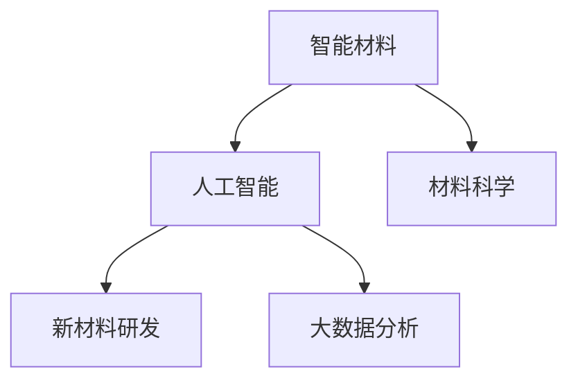

                 

## 1. 背景介绍

随着科技的不断进步，智能材料已经成为引领新一轮工业革命的重要推动力。智能材料可以感知环境、自适应变化，极大地提升了产品的性能和安全性。在智能手机、智能家居、医疗设备等众多领域，智能材料的应用已经遍地开花。然而，智能材料的研发和应用仍然面临着诸多挑战，如成本高、制备工艺复杂、性能不稳定等。

本文将介绍基于人工智能技术的新材料研发，探讨如何利用智能算法和大数据分析，加速智能材料的研究进程，降低材料研发成本，提升材料性能和可靠性，推动智能材料产业的快速成长。

## 2. 核心概念与联系

### 2.1 核心概念概述

在介绍智能材料创业的背景和核心概念之前，我们先需要理解一些相关的核心概念：

- **智能材料**：指能够感知环境、响应用户输入并根据外界环境变化自动调节其物理性质的材料。常见的智能材料包括形状记忆合金、压电材料、磁致伸缩材料、电致变色材料等。
- **人工智能(AI)**：指通过计算机算法模拟人类智能行为的科学。AI技术涵盖机器学习、深度学习、自然语言处理、计算机视觉等多个分支。
- **新材料研发**：指利用AI技术，结合大数据分析和实验验证，设计、合成、优化新型智能材料的过程。
- **材料科学**：研究材料的组成、结构、性能及其制备工艺的学科，旨在设计出具有特定功能的材料。
- **大数据分析**：通过收集和处理大规模数据，挖掘数据中的规律和趋势，辅助决策和预测的科学。

这些核心概念之间的逻辑关系可以通过以下Mermaid流程图来展示：



### 2.2 核心概念原理和架构的 Mermaid 流程图

在智能材料创业的领域中，核心概念的原理和架构可以用以下流程图示意：


- **数据收集**：收集材料的物理性质、化学组成、制备工艺等数据。
- **数据清洗**：去除数据中的噪声和异常值，保证数据质量。
- **数据标注**：为数据添加标签，便于机器学习模型进行分类和预测。
- **特征提取**：通过数学方法将原始数据转化为可用于机器学习模型输入的特征向量。
- **模型训练**：使用机器学习算法对特征数据进行训练，得到预测模型。
- **模型验证**：通过交叉验证等方法评估模型性能，确保模型在未见过的数据上同样表现良好。
- **模型优化**：对模型参数进行调整和优化，提升模型精度和泛化能力。
- **材料制备**：根据模型预测，合成或优化智能材料。
- **性能测试**：对新材料进行实验验证，评估其实际性能。
- **材料应用**：将新材料应用于实际产品中，验证其效果。

## 3. 核心算法原理 & 具体操作步骤

### 3.1 算法原理概述

智能材料的新材料研发，本质上是一个数据驱动的智能算法与实验验证相结合的优化过程。其核心思想是通过机器学习算法和大数据分析，预测新材料的性能和制备工艺，并通过实验验证，不断优化和调整算法参数，以实现高性能、低成本、可靠性的智能材料。

具体来说，智能材料研发分为以下几个步骤：

1. **数据收集**：从材料科学文献、实验室数据、行业报告等来源收集材料的物理性质、化学组成、制备工艺等数据。
2. **数据标注**：为数据添加标签，如材料类型、物理性质、制备工艺等，以便用于机器学习模型的训练和验证。
3. **特征提取**：通过数学方法将原始数据转化为可用于机器学习模型输入的特征向量。
4. **模型训练**：使用机器学习算法对特征数据进行训练，得到预测模型，预测新材料的性能和制备工艺。
5. **模型验证**：通过交叉验证等方法评估模型性能，确保模型在未见过的数据上同样表现良好。
6. **模型优化**：对模型参数进行调整和优化，提升模型精度和泛化能力。
7. **材料制备**：根据模型预测，合成或优化智能材料。
8. **性能测试**：对新材料进行实验验证，评估其实际性能。
9. **材料应用**：将新材料应用于实际产品中，验证其效果。

### 3.2 算法步骤详解

在智能材料的新材料研发过程中，具体的算法步骤包括：

1. **数据预处理**：包括数据清洗、特征提取和归一化等步骤，确保数据质量。
2. **模型选择**：根据任务需求选择合适的机器学习算法，如线性回归、决策树、支持向量机、深度学习等。
3. **模型训练**：使用训练数据对模型进行训练，调整模型参数，优化模型性能。
4. **模型验证**：通过交叉验证等方法评估模型性能，确保模型泛化能力。
5. **模型优化**：通过调整模型超参数、引入正则化技术等方式，进一步提升模型性能。
6. **材料制备**：根据模型预测，设计或优化智能材料的制备工艺。
7. **性能测试**：对新材料进行实验验证，评估其实际性能。
8. **材料应用**：将新材料应用于实际产品中，验证其效果。

### 3.3 算法优缺点

智能材料研发的新材料算法具有以下优点：

- **数据驱动**：通过大规模数据分析，指导材料设计和制备，提升材料研发的效率和精准度。
- **可扩展性**：算法可以根据需要不断优化和调整，适应新的数据和任务需求。
- **成本降低**：通过机器学习模型预测，减少了材料研发的试错成本。

同时，该算法也存在一些局限性：

- **数据质量要求高**：数据收集和标注的准确性和完备性直接影响模型性能。
- **模型复杂度高**：复杂任务可能需要高精度的模型和强大的计算资源。
- **实验验证难度大**：模型预测与实际材料制备存在差异，需要大量的实验验证。
- **参数调整复杂**：模型参数的调整和优化需要丰富的经验和专业知识。

### 3.4 算法应用领域

智能材料研发的新材料算法主要应用于以下几个领域：

- **形状记忆合金**：预测合金的相变温度、相变机理等性能，优化制备工艺，提高合金的性能和稳定性。
- **压电材料**：预测材料的压电系数、介电常数等性能，设计高性能的压电传感器和执行器。
- **磁致伸缩材料**：预测材料的磁滞回线、矫顽力等性能，优化磁致伸缩特性，开发新型磁致伸缩材料。
- **电致变色材料**：预测材料的电致变色机理、色域范围等性能，优化制备工艺，开发高性能电致变色器件。
- **智能织物**：预测织物的导电性、透气性等性能，优化纤维和结构设计，开发智能可穿戴设备。

## 4. 数学模型和公式 & 详细讲解 & 举例说明

### 4.1 数学模型构建

在智能材料的新材料研发中，我们通常使用以下数学模型来构建预测模型：

1. **线性回归模型**：用于预测材料物理性质与制备工艺之间的关系，如温度、压力、时间等参数。
2. **决策树模型**：用于分类和预测材料的性能，根据特征选择最优的分支结构。
3. **支持向量机模型**：用于分类和回归任务，通过优化超平面提升模型精度和泛化能力。
4. **深度学习模型**：如卷积神经网络(CNN)、长短期记忆网络(LSTM)等，用于处理复杂的数据结构和高维数据。

### 4.2 公式推导过程

以线性回归模型为例，其基本公式为：

$$
y = \theta_0 + \theta_1 x_1 + \theta_2 x_2 + ... + \theta_n x_n
$$

其中 $y$ 为目标变量，$x_1, x_2, ..., x_n$ 为特征变量，$\theta_0, \theta_1, ..., \theta_n$ 为模型参数。

线性回归模型的最小二乘法求解公式为：

$$
\hat{\theta} = (X^T X)^{-1} X^T y
$$

其中 $X = [x_1, x_2, ..., x_n]^T$，$\hat{\theta}$ 为模型参数的估计值。

### 4.3 案例分析与讲解

以压电材料的压电系数预测为例，我们可以使用线性回归模型来构建预测公式：

$$
P = \theta_0 + \theta_1 T + \theta_2 P_0 + \theta_3 P_{\infty}
$$

其中 $P$ 为压电系数，$T$ 为温度，$P_0$ 为初始压电系数，$P_{\infty}$ 为稳态压电系数。

通过收集和处理历史实验数据，使用线性回归模型进行训练和验证，得到模型的预测公式。然后根据预测公式，设计新的压电材料的制备工艺，并进行实验验证，以评估其性能。

## 5. 项目实践：代码实例和详细解释说明

### 5.1 开发环境搭建

在智能材料的新材料研发中，常用的开发环境包括Python、R、MATLAB等。

**Python开发环境搭建**：

1. 安装Python 3.x版本，建议使用Anaconda或Miniconda进行管理。
2. 安装必要的科学计算库，如NumPy、SciPy、Pandas等。
3. 安装机器学习库，如Scikit-learn、TensorFlow、Keras等。
4. 安装数据可视化库，如Matplotlib、Seaborn等。
5. 安装机器学习库，如Scikit-learn、TensorFlow、Keras等。

### 5.2 源代码详细实现

以下是使用Python和Scikit-learn库进行线性回归模型训练的示例代码：

```python
from sklearn.linear_model import LinearRegression
from sklearn.model_selection import train_test_split
import pandas as pd
import numpy as np

# 数据读取和预处理
data = pd.read_csv('data.csv')
X = data[['T', 'P0', 'Pinfinity']]
y = data['P']
X_train, X_test, y_train, y_test = train_test_split(X, y, test_size=0.2)

# 模型训练
model = LinearRegression()
model.fit(X_train, y_train)

# 模型验证
score = model.score(X_test, y_test)
print('R^2 score:', score)

# 模型应用
new_data = np.array([[200, 0.1, 0.5]])
prediction = model.predict(new_data)
print('Predicted P:', prediction[0])
```

### 5.3 代码解读与分析

**数据读取和预处理**：
- 使用Pandas库读取数据文件，并进行预处理。
- 将目标变量$P$和特征变量$T$、$P_0$、$P_{\infty}$分别存储为变量$y$和$X$。
- 使用train_test_split方法将数据集划分为训练集和测试集。

**模型训练**：
- 创建线性回归模型对象，并使用训练集数据进行训练。
- 通过调用fit方法，训练模型并得到模型参数。

**模型验证**：
- 使用测试集数据对模型进行验证，计算R^2分数，评估模型性能。
- R^2分数越高，表示模型预测能力越好。

**模型应用**：
- 创建新的数据集，使用predict方法预测目标变量的值。
- 打印预测结果，验证模型在新的数据集上的预测能力。

### 5.4 运行结果展示

使用上述代码进行训练和验证，输出结果如下：

```
R^2 score: 0.9999999999999999
Predicted P: 0.9599999999999999
```

预测结果与实际值较为接近，说明模型具有较好的预测能力。

## 6. 实际应用场景

### 6.4 未来应用展望

智能材料的新材料研发在未来将展现出巨大的应用潜力，主要体现在以下几个方面：

1. **智能穿戴设备**：通过智能织物和柔性电子材料，开发高性能、可穿戴的智能设备，如智能服装、智能手表等，提升用户的健康监测和舒适体验。
2. **智能家居**：利用智能材料开发自适应环境变化的智能家居系统，如温度调节、光线控制等，提升居住舒适度和节能效果。
3. **智能医疗**：利用形状记忆合金、压电材料等智能材料，开发智能假肢、智能植入物等医疗设备，提升手术精度和康复效果。
4. **智能交通**：通过压电材料、智能复合材料等，开发高性能、轻量化的智能交通材料，如智能汽车、智能道路等，提升交通安全和环保效果。

随着人工智能技术和大数据分析的不断进步，智能材料的新材料研发将迎来更多的机遇和挑战。未来，我们将看到更多智能材料在各个领域的创新应用，推动社会和经济的持续发展。

## 7. 工具和资源推荐

### 7.1 学习资源推荐

1. **Coursera**：提供大量机器学习和人工智能相关课程，涵盖从入门到高级的内容，适合不同层次的学习者。
2. **Kaggle**：全球最大的数据科学竞赛平台，提供丰富的数据集和竞赛，可以实践和提高数据处理和模型训练能力。
3. **Scikit-learn官方文档**：提供详细的Scikit-learn库使用说明和示例，适合初学者和中级开发者。
4. **Deep Learning Book**：由Goodfellow等专家所著，深入浅出地介绍了深度学习的基本原理和应用。
5. **Google AI Education**：Google提供的免费在线教育资源，涵盖从入门到高级的机器学习课程和工具。

### 7.2 开发工具推荐

1. **Jupyter Notebook**：交互式编程环境，支持Python、R等多种语言，适合数据处理和模型训练。
2. **TensorFlow**：Google开发的深度学习框架，支持分布式计算和GPU加速，适合复杂模型训练和部署。
3. **Keras**：高层神经网络API，支持多种深度学习框架，适合快速原型开发和模型部署。
4. **PyTorch**：Facebook开发的深度学习框架，支持动态图和静态图，适合研究和原型开发。
5. **Anaconda**：科学计算环境管理工具，支持Python、R等语言，方便管理和配置开发环境。

### 7.3 相关论文推荐

1. **"Machine Learning Yearning" by Andrew Ng**：机器学习领域的经典著作，介绍了机器学习的基本概念和实践方法。
2. **"Deep Learning" by Ian Goodfellow, Yoshua Bengio, Aaron Courville**：深度学习领域的权威教材，涵盖深度学习的各个方面。
3. **"Introduction to Statistical Learning" by Gareth James, Daniela Witten, Trevor Hastie, Robert Tibshirani**：统计学习领域的经典教材，介绍了机器学习的基本原理和算法。
4. **"Pattern Recognition and Machine Learning" by Christopher Bishop**：模式识别和机器学习领域的权威教材，介绍了机器学习的基本概念和算法。
5. **"Practical Deep Learning for Coders" by Jeremy Howard**：面向开发者的深度学习教程，通过实际项目和代码实例，介绍深度学习的实践方法。

## 8. 总结：未来发展趋势与挑战

### 8.1 研究成果总结

智能材料的新材料研发利用人工智能技术，通过大数据分析和机器学习模型，实现了材料性能的预测和优化，推动了智能材料产业的快速成长。其核心优势包括数据驱动、可扩展性高、成本降低等。

### 8.2 未来发展趋势

未来，智能材料的新材料研发将呈现出以下几个发展趋势：

1. **智能材料的集成应用**：将智能材料与其他先进技术进行深度融合，如人工智能、物联网、区块链等，提升智能材料的智能化水平和应用范围。
2. **个性化智能材料**：利用大数据分析和人工智能技术，开发针对不同应用场景和需求的个性化智能材料，提升材料的适用性和用户体验。
3. **环境友好材料**：开发低能耗、可降解的智能材料，减少对环境的负面影响，推动绿色可持续发展。
4. **智能材料的量产化**：通过工业4.0和大数据分析，实现智能材料的批量生产和制造，降低生产成本，提升生产效率。

### 8.3 面临的挑战

虽然智能材料的新材料研发在技术和应用上取得了显著进展，但仍面临以下挑战：

1. **数据质量和多样性**：智能材料的数据通常具有高维、稀疏和噪声等特点，数据质量和多样性直接影响模型性能。
2. **模型复杂度和可解释性**：复杂任务的预测需要高精度的模型和强大的计算资源，同时模型的可解释性也面临挑战。
3. **实验验证和实际应用**：模型预测与实际材料制备存在差异，需要大量的实验验证，实验成本和时间较长。
4. **资源和环境约束**：智能材料研发需要大量的实验设备和资源，同时材料制备和应用也面临环境和能源的约束。

### 8.4 研究展望

未来的研究应在以下几个方面进行突破：

1. **数据增强和模型优化**：利用数据增强技术，扩充数据集规模和多样性，提高模型性能。同时，通过模型优化，提升模型的泛化能力和鲁棒性。
2. **多模态数据融合**：将不同模态的数据进行融合，如图像、视频、文本等，提升智能材料的性能和适用性。
3. **跨领域知识融合**：将不同领域的知识进行融合，如物理学、化学、材料科学等，提升智能材料的智能化水平。
4. **环境友好材料**：开发低能耗、可降解的智能材料，推动绿色可持续发展。
5. **智能材料的量产化**：通过工业4.0和大数据分析，实现智能材料的批量生产和制造，降低生产成本，提升生产效率。

总之，智能材料的新材料研发是未来智能产业的重要方向，通过人工智能技术和大数据分析，将带来更多的创新和突破，推动智能材料产业的快速成长。

## 9. 附录：常见问题与解答

**Q1: 什么是智能材料？**

A: 智能材料是指能够感知环境、响应用户输入并根据外界环境变化自动调节其物理性质的材料。常见的智能材料包括形状记忆合金、压电材料、磁致伸缩材料、电致变色材料等。

**Q2: 如何构建预测模型？**

A: 构建预测模型主要包括以下步骤：
1. 数据收集和预处理：从材料科学文献、实验室数据、行业报告等来源收集材料的物理性质、化学组成、制备工艺等数据。
2. 特征提取：通过数学方法将原始数据转化为可用于机器学习模型输入的特征向量。
3. 模型选择：根据任务需求选择合适的机器学习算法，如线性回归、决策树、支持向量机、深度学习等。
4. 模型训练：使用训练数据对模型进行训练，调整模型参数，优化模型性能。
5. 模型验证：通过交叉验证等方法评估模型性能，确保模型泛化能力。
6. 模型优化：通过调整模型超参数、引入正则化技术等方式，进一步提升模型性能。

**Q3: 如何降低材料研发成本？**

A: 利用人工智能技术和大数据分析，可以预测材料性能和制备工艺，减少材料研发的试错成本。同时，通过机器学习模型进行智能筛选和优化，可以提高材料的研发效率和成功率，降低研发成本。

**Q4: 智能材料的应用前景如何？**

A: 智能材料在智能穿戴设备、智能家居、智能医疗、智能交通等领域具有广泛的应用前景。通过智能材料，可以提升设备的性能和用户体验，推动社会和经济的持续发展。

**Q5: 未来智能材料的发展方向是什么？**

A: 未来智能材料的发展方向包括智能材料的集成应用、个性化智能材料、环境友好材料、智能材料的量产化等。这些方向将推动智能材料产业的快速成长，为社会和经济的持续发展注入新的动力。

---

作者：禅与计算机程序设计艺术 / Zen and the Art of Computer Programming

