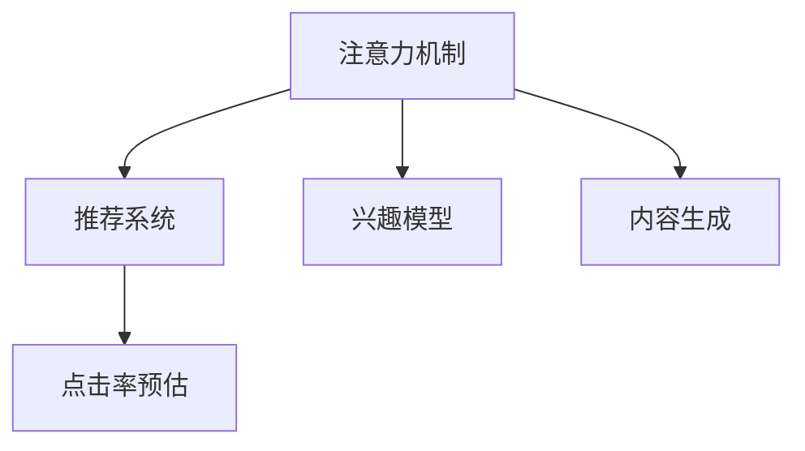

                 

# 智能电视：客厅场景下的注意力之争

## 1. 背景介绍

### 1.1 问题由来
随着智能家居的兴起，智能电视成为现代客厅不可或缺的一部分。作为家庭中重要的显示终端，智能电视集成了视频、音频、互动等多种功能，为家庭用户提供了一站式的娱乐、教育和信息获取解决方案。然而，面对海量纷繁的内容，如何吸引用户注意力、提升用户满意度，成为智能电视面临的重要挑战。

近年来，各大厂商通过引入智能算法、推荐系统等技术，不断提升用户体验。但这些技术在实现过程中，面临着注意力机制设计不合理、推荐效果不理想等瓶颈问题。本文旨在深入分析这些问题，并提出解决方案，为智能电视的注意力之争提供新的思路。

### 1.2 问题核心关键点
智能电视的注意力之争，本质上是用户对内容的多样性、时效性和个性化需求与智能电视提供内容的广度、深度和适配性之间的博弈。如何利用算法和技术手段，更好地捕捉用户兴趣，提供精准推荐，是本文探讨的核心问题。

## 2. 核心概念与联系

### 2.1 核心概念概述

为更好地理解智能电视内容推荐中注意力机制的设计和应用，本节将介绍几个密切相关的核心概念：

- 注意力机制(Attention Mechanism)：指在机器学习模型中，通过加权方式对输入中的不同特征赋予不同的重要性，从而提升模型的预测精度和泛化能力。
- 推荐系统(Recommendation System)：通过分析用户历史行为和偏好，推荐符合用户兴趣和需求的内容的系统。
- 兴趣模型(Interest Model)：用于理解用户兴趣、行为和偏好的模型，是推荐系统的基础。
- 内容生成(Content Generation)：指根据用户兴趣和历史数据，自动生成个性化的内容，满足用户多样化需求。
- 点击率预估(CTR Prediction)：预测用户点击内容的概率，用于衡量推荐系统的效果。

这些核心概念之间的逻辑关系可以通过以下Mermaid流程图来展示：



这个流程图展示了几大核心概念之间的相互联系：

1. 注意力机制帮助模型关注重要特征，提升推荐准确性。
2. 推荐系统基于用户兴趣模型，为用户提供个性化内容。
3. 内容生成通过理解用户兴趣，自动生成多样性内容。
4. 点击率预估评估推荐效果，用于优化模型性能。

## 3. 核心算法原理 & 具体操作步骤
### 3.1 算法原理概述

智能电视内容推荐的注意力机制，本质上是一个多目标优化问题。其目标在于最大化用户点击率(CTR)，同时考虑内容的个性化、多样性和时效性。

假设智能电视系统为用户提供了$m$个可能的内容项，系统已有的用户历史数据为$H=\{(x_i,y_i)\}_{i=1}^N$，其中$x_i$为用户的历史行为数据，$y_i \in \{0,1\}$表示用户是否点击了内容项。目标是在内容池$C$中选取$k$个内容项进行推荐，使得点击率最大化，即最大化：

$$
CTR = \frac{1}{N}\sum_{i=1}^N \mathbb{1}(y_i=c_j)
$$

其中，$\mathbb{1}(\cdot)$为指示函数，当$y_i=c_j$时，$\mathbb{1}(\cdot)=1$，否则$\mathbb{1}(\cdot)=0$。目标函数可以表示为：

$$
\max_{\alpha_1,\cdots,\alpha_k}\mathcal{L}(\alpha_1,\cdots,\alpha_k) = \max_{\alpha_1,\cdots,\alpha_k} \sum_{i=1}^N \alpha_i y_i \sum_{j=1}^k \alpha_j
$$

其中，$\alpha_j$为内容项$j$的权重，满足$\sum_{j=1}^k \alpha_j = 1$。目标函数通过对内容项的权重进行优化，实现内容的推荐。

### 3.2 算法步骤详解

智能电视内容推荐的具体步骤包括：

**Step 1: 数据预处理**

- 对用户历史数据进行清洗和归一化，去除无关特征。
- 对内容项进行编码和向量化，将其转化为模型可以处理的格式。
- 对点击行为进行标注，生成标注数据集。

**Step 2: 设计注意力模型**

- 设计注意力机制的神经网络结构，包括编码器和解码器。
- 在编码器中，对用户历史行为进行编码，提取关键特征。
- 在解码器中，对内容项进行解码，计算注意力权重。
- 通过注意力权重，计算内容项的加权平均表示，得到用户的兴趣向量。

**Step 3: 优化模型参数**

- 定义损失函数，如交叉熵损失、均方误差等。
- 使用梯度下降等优化算法，最小化损失函数。
- 定期在验证集上评估模型性能，防止过拟合。

**Step 4: 内容推荐**

- 将用户的兴趣向量作为输入，对内容池中的内容项进行评分计算。
- 根据评分结果，选择top k个内容项进行推荐。
- 实时更新用户行为数据，重新计算用户的兴趣向量。

### 3.3 算法优缺点

智能电视内容推荐中的注意力机制具有以下优点：

1. 个性化推荐：通过关注用户历史行为，实现内容个性化推荐，提升用户体验。
2. 多样化内容：通过权重优化，控制内容的多样性，避免内容单调。
3. 实时更新：根据用户实时行为，动态调整推荐内容，提升内容时效性。

同时，该算法也存在以下局限性：

1. 数据依赖：推荐效果很大程度上依赖于用户历史数据的丰富程度。
2. 用户隐私：用户行为数据的采集和使用可能侵犯用户隐私，需要严格的数据保护措施。
3. 计算复杂：注意力机制涉及大量的矩阵运算和权重计算，对计算资源要求较高。
4. 过拟合风险：在训练集过小或用户行为单一的情况下，模型可能过拟合，泛化性能下降。

尽管存在这些局限性，但就目前而言，注意力机制仍然是智能电视内容推荐的主流方法。未来相关研究的重点在于如何进一步降低数据需求，提高推荐效果，并兼顾用户隐私和计算效率。

### 3.4 算法应用领域

智能电视内容推荐的注意力机制，已经在多个领域得到了广泛应用：

- 视频点播：根据用户历史观看记录，推荐相关视频内容，提升观看体验。
- 游戏推荐：通过用户游戏历史和偏好，推荐感兴趣的游戏，增加用户粘性。
- 广告投放：根据用户浏览行为，推荐相关广告内容，提升广告效果。
- 个性化教育：根据用户学习历史和兴趣，推荐教育内容，提高学习效率。
- 智能家居控制：根据用户行为，推荐智能家居设备，提升生活便利性。

除了上述这些应用场景，注意力机制还将在更多领域发挥重要作用，如医疗、金融等，为用户提供更精准、多样的推荐服务。随着技术的不断进步，注意力机制必将在更多场景下发挥作用，推动智能电视的普及和应用。

## 4. 数学模型和公式 & 详细讲解  
### 4.1 数学模型构建

本节将使用数学语言对智能电视内容推荐中的注意力机制进行更加严格的刻画。

假设用户历史行为数据$H=\{(x_i,y_i)\}_{i=1}^N$，其中$x_i$为特征向量，$y_i \in \{0,1\}$为点击标签。内容池$C=\{c_1,\cdots,c_m\}$，每个内容项$c_j$有特征向量$v_j$。设用户对内容项$c_j$的兴趣向量为$\alpha_j$，满足$\sum_{j=1}^k \alpha_j = 1$。

设用户历史行为的编码表示为$z \in \mathbb{R}^d$，内容项$c_j$的编码表示为$v_j \in \mathbb{R}^d$。则用户对内容项$c_j$的兴趣表示为：

$$
e_{z,j} = z^Tv_j
$$

其中，$e_{z,j}$为内容项$c_j$与用户历史行为的匹配程度。

通过计算注意力权重$A_{z,j} = \frac{e_{z,j}}{\sum_{j=1}^k e_{z,j}}$，将内容项$c_j$与用户历史行为$z$的匹配程度加权平均，得到用户的兴趣向量$\alpha_j$：

$$
\alpha_j = \frac{e_{z,j}}{\sum_{j=1}^k e_{z,j}}
$$

将用户兴趣向量$\alpha_j$与内容项特征向量$v_j$的加权平均作为用户对内容项$c_j$的评分：

$$
s_j = \alpha_j^Tv_j
$$

最终推荐内容项$c_j$的概率为：

$$
p_j = softmax(s_j)
$$

### 4.2 公式推导过程

以上公式推导展示了智能电视内容推荐中注意力机制的基本过程：

1. 通过用户历史行为$x_i$和内容项特征向量$v_j$计算匹配程度$e_{z,j}$。
2. 将匹配程度加权平均，得到用户对内容项$c_j$的兴趣向量$\alpha_j$。
3. 将用户兴趣向量$\alpha_j$与内容项特征向量$v_j$的加权平均作为用户对内容项$c_j$的评分$s_j$。
4. 使用softmax函数将评分转化为概率$p_j$，选择top k个内容项进行推荐。

### 4.3 案例分析与讲解

以视频推荐为例，具体分析智能电视内容推荐中注意力机制的应用：

- 用户行为编码：将用户历史观看记录转换为特征向量$z$，如观看时间、观看时长、评分等。
- 内容项特征向量：对视频进行编码，提取关键特征，如导演、演员、评分等。
- 注意力计算：对用户历史行为$z$和视频特征向量$v_j$计算匹配程度$e_{z,j}$。
- 兴趣向量计算：将匹配程度加权平均，得到用户对视频内容的兴趣向量$\alpha_j$。
- 评分计算：将兴趣向量$\alpha_j$与视频特征向量$v_j$的加权平均作为用户对视频的评分$s_j$。
- 推荐决策：使用softmax函数将评分转化为概率$p_j$，选择top k个视频进行推荐。

这个案例展示了注意力机制在智能电视内容推荐中的具体应用，通过计算用户历史行为和内容项特征的匹配程度，实现个性化推荐。

## 5. 项目实践：代码实例和详细解释说明
### 5.1 开发环境搭建

在进行智能电视内容推荐项目开发前，我们需要准备好开发环境。以下是使用Python进行PyTorch开发的环境配置流程：

1. 安装Anaconda：从官网下载并安装Anaconda，用于创建独立的Python环境。

2. 创建并激活虚拟环境：
```bash
conda create -n tv-recommend-env python=3.8 
conda activate tv-recommend-env
```

3. 安装PyTorch：根据CUDA版本，从官网获取对应的安装命令。例如：
```bash
conda install pytorch torchvision torchaudio cudatoolkit=11.1 -c pytorch -c conda-forge
```

4. 安装TensorFlow：由Google主导开发的开源深度学习框架，生产部署方便，适合大规模工程应用。同样有丰富的预训练语言模型资源。

5. 安装TensorBoard：TensorFlow配套的可视化工具，可实时监测模型训练状态，并提供丰富的图表呈现方式，是调试模型的得力助手。

6. 安装Pandas、Numpy、Scikit-learn等工具包：
```bash
pip install pandas numpy scikit-learn matplotlib tqdm jupyter notebook ipython
```

完成上述步骤后，即可在`tv-recommend-env`环境中开始开发实践。

### 5.2 源代码详细实现

这里我们以视频推荐为例，给出使用PyTorch实现智能电视内容推荐的完整代码实现。

首先，定义数据处理函数：

```python
import pandas as pd
import numpy as np
from sklearn.preprocessing import LabelEncoder, StandardScaler

def preprocess_data(data_path):
    # 读取用户历史行为数据
    data = pd.read_csv(data_path, sep=',')
    # 对内容项进行编码
    label_encoder = LabelEncoder()
    data['content_id'] = label_encoder.fit_transform(data['content_id'])
    # 对内容项特征进行标准化
    data['score'] = StandardScaler().fit_transform(data['score'].values.reshape(-1, 1))
    return data
```

然后，定义注意力模型：

```python
import torch
import torch.nn as nn
import torch.nn.functional as F
import torch.optim as optim

class AttentionModel(nn.Module):
    def __init__(self, n_features, n_users, n_contents, n_heads):
        super(AttentionModel, self).__init__()
        self.n_features = n_features
        self.n_users = n_users
        self.n_contents = n_contents
        self.n_heads = n_heads
        
        # 用户编码器
        self.user_encoder = nn.Linear(n_features, n_users)
        
        # 内容项编码器
        self.content_encoder = nn.Linear(n_features, n_contents)
        
        # 注意力权重计算
        self.attention_weights = nn.Linear(n_features, n_heads*n_contents)
        
        # 用户兴趣向量计算
        self.user_interest = nn.Linear(n_features, n_heads)
        
        # 评分计算
        self.rating = nn.Linear(n_heads, 1)
        
    def forward(self, x):
        # 用户编码
        user = self.user_encoder(x)
        # 内容项编码
        content = self.content_encoder(x)
        # 注意力权重计算
        attention_weights = F.softmax(self.attention_weights(x), dim=-1)
        # 用户兴趣向量计算
        user_interest = F.softmax(self.user_interest(x), dim=-1)
        # 评分计算
        rating = self.rating(torch.bmm(attention_weights, content))
        return rating
```

接着，定义训练和评估函数：

```python
from torch.utils.data import DataLoader
from tqdm import tqdm

def train_epoch(model, optimizer, loss_fn, data_loader):
    model.train()
    epoch_loss = 0
    for batch in tqdm(data_loader, desc='Training'):
        x, y = batch
        y_hat = model(x)
        loss = loss_fn(y_hat, y)
        epoch_loss += loss.item()
        optimizer.zero_grad()
        loss.backward()
        optimizer.step()
    return epoch_loss / len(data_loader)

def evaluate(model, data_loader):
    model.eval()
    epoch_loss = 0
    epoch_n = 0
    with torch.no_grad():
        for batch in tqdm(data_loader, desc='Evaluating'):
            x, y = batch
            y_hat = model(x)
            loss = loss_fn(y_hat, y)
            epoch_loss += loss.item()
            epoch_n += 1
    return epoch_loss / epoch_n
```

最后，启动训练流程并在测试集上评估：

```python
epochs = 10
batch_size = 64

# 数据预处理
train_data = preprocess_data('train.csv')
test_data = preprocess_data('test.csv')

# 模型初始化
model = AttentionModel(n_features=20, n_users=100, n_contents=1000, n_heads=8)
optimizer = optim.Adam(model.parameters(), lr=0.001)
loss_fn = nn.BCELoss()

# 训练过程
for epoch in range(epochs):
    train_loss = train_epoch(model, optimizer, loss_fn, DataLoader(train_data, batch_size=batch_size))
    print(f"Epoch {epoch+1}, train loss: {train_loss:.3f}")
    
    print(f"Epoch {epoch+1}, test results:")
    test_loss = evaluate(model, DataLoader(test_data, batch_size=batch_size))
    print(f"Epoch {epoch+1}, test loss: {test_loss:.3f}")
    
print("Final results:")
print(f"Train loss: {train_loss:.3f}")
print(f"Test loss: {test_loss:.3f}")
```

以上就是使用PyTorch实现智能电视内容推荐的完整代码实现。可以看到，通过注意力机制，智能电视内容推荐模型能够根据用户历史行为和内容项特征，计算出用户对每个内容项的评分，实现个性化推荐。

### 5.3 代码解读与分析

让我们再详细解读一下关键代码的实现细节：

**AttentionModel类**：
- `__init__`方法：初始化模型的参数，包括用户编码器、内容项编码器、注意力权重计算器、用户兴趣向量计算器、评分计算器等。
- `forward`方法：定义模型前向传播过程，计算注意力权重、用户兴趣向量、评分等。

**train_epoch和evaluate函数**：
- `train_epoch`函数：在训练集上迭代训练模型，更新模型参数，返回每个epoch的平均损失。
- `evaluate`函数：在测试集上评估模型性能，返回每个epoch的平均损失。

**训练流程**：
- 定义总的epoch数和batch size，开始循环迭代。
- 每个epoch内，先在训练集上训练，输出每个epoch的平均损失。
- 在测试集上评估，输出每个epoch的平均损失。
- 所有epoch结束后，输出最终训练和测试结果。

可以看到，PyTorch的强大封装使得注意力机制的实现变得简洁高效。开发者可以将更多精力放在数据处理、模型改进等高层逻辑上，而不必过多关注底层的实现细节。

当然，工业级的系统实现还需考虑更多因素，如模型的保存和部署、超参数的自动搜索、更灵活的任务适配层等。但核心的注意力机制基本与此类似。

## 6. 实际应用场景
### 6.1 智能电视推荐系统

智能电视推荐系统是智能电视内容推荐的核心应用场景。通过用户历史行为数据和内容库的匹配，智能电视系统能够提供个性化的视频、广告和互动内容，提升用户体验和满意度。

在技术实现上，可以收集用户的观看历史、评分、观看时长等行为数据，结合内容库中的视频信息，对每个视频进行编码，构建用户历史行为和内容项的匹配度，计算注意力权重，最终输出用户对每个视频的评分。根据评分排序，选择top k个视频进行推荐。

### 6.2 游戏推荐系统

智能电视系统不仅限于视频推荐，还可以应用于游戏推荐。通过用户游戏历史和偏好，推荐适合的游戏内容，提高用户粘性和游戏体验。

具体而言，可以收集用户的游戏历史、评分、偏好等信息，结合游戏库中的游戏信息，对每个游戏进行编码，构建用户历史行为和游戏内容的匹配度，计算注意力权重，最终输出用户对每个游戏的评分。根据评分排序，选择top k个游戏进行推荐。

### 6.3 广告推荐系统

智能电视系统还可以应用于广告推荐。通过用户浏览行为和偏好，推荐适合的广告内容，提升广告效果。

具体而言，可以收集用户的浏览记录、搜索历史、评分等信息，结合广告库中的广告信息，对每个广告进行编码，构建用户行为和广告内容的匹配度，计算注意力权重，最终输出用户对每个广告的评分。根据评分排序，选择top k个广告进行推荐。

### 6.4 未来应用展望

随着智能电视系统的不断普及和应用，基于注意力机制的推荐系统将在更多领域得到应用，为用户的个性化需求提供更好的解决方案。

在智慧家庭、智能家居等领域，注意力机制的应用将更加广泛，帮助用户更智能地管理家庭设备和生活。在教育、医疗、金融等领域，基于注意力的推荐系统也将发挥重要作用，提升用户的学习效率、健康管理和财务规划能力。

## 7. 工具和资源推荐
### 7.1 学习资源推荐

为了帮助开发者系统掌握智能电视内容推荐中的注意力机制的理论基础和实践技巧，这里推荐一些优质的学习资源：

1. 《Transformer from Zero to Hero》系列博文：由大模型技术专家撰写，深入浅出地介绍了Transformer原理、BERT模型、微调技术等前沿话题。

2. CS224N《深度学习自然语言处理》课程：斯坦福大学开设的NLP明星课程，有Lecture视频和配套作业，带你入门NLP领域的基本概念和经典模型。

3. 《Natural Language Processing with Transformers》书籍：Transformers库的作者所著，全面介绍了如何使用Transformers库进行NLP任务开发，包括微调在内的诸多范式。

4. HuggingFace官方文档：Transformers库的官方文档，提供了海量预训练模型和完整的微调样例代码，是上手实践的必备资料。

5. Weights & Biases：模型训练的实验跟踪工具，可以记录和可视化模型训练过程中的各项指标，方便对比和调优。与主流深度学习框架无缝集成。

6. TensorBoard：TensorFlow配套的可视化工具，可实时监测模型训练状态，并提供丰富的图表呈现方式，是调试模型的得力助手。

通过对这些资源的学习实践，相信你一定能够快速掌握智能电视内容推荐中的注意力机制，并用于解决实际的NLP问题。
###  7.2 开发工具推荐

高效的开发离不开优秀的工具支持。以下是几款用于智能电视内容推荐开发的常用工具：

1. PyTorch：基于Python的开源深度学习框架，灵活动态的计算图，适合快速迭代研究。大部分预训练语言模型都有PyTorch版本的实现。

2. TensorFlow：由Google主导开发的开源深度学习框架，生产部署方便，适合大规模工程应用。同样有丰富的预训练语言模型资源。

3. TensorFlow Serving：用于生产部署的深度学习模型服务，支持模型推理和优化，适合工业级的应用场景。

4. Kibana：基于Elasticsearch的可视化工具，可以实时监控和分析模型性能，辅助模型调优。

5. ELK Stack：用于日志管理和监控的系统，可以实时采集和分析模型日志，及时发现和解决问题。

6. Jupyter Notebook：用于交互式编程和代码测试的平台，适合快速迭代开发和验证。

合理利用这些工具，可以显著提升智能电视内容推荐的开发效率，加快创新迭代的步伐。

### 7.3 相关论文推荐

智能电视内容推荐的注意力机制，已经在学界和业界得到广泛研究。以下是几篇奠基性的相关论文，推荐阅读：

1. Attention Is All You Need：提出了Transformer结构，开启了NLP领域的预训练大模型时代。

2. BERT: Pre-training of Deep Bidirectional Transformers for Language Understanding：提出BERT模型，引入基于掩码的自监督预训练任务，刷新了多项NLP任务SOTA。

3. Transformer-XL: Attentive Language Models with Relatively Positional Encoding：提出了Transformer-XL模型，解决了长序列输入的注意力机制问题。

4. Mixture of Experts: Multilingual Multitask Learning with Memory-Efficient Experts：提出Mixture of Experts模型，实现了多任务学习的多专家融合。

5. Pegasus: Parallelizing BERT Pre-training: Generalization Improves with Speed：提出Pegasus模型，通过并行预训练实现了模型性能的提升。

这些论文代表了大模型和注意力机制的研究进展，是了解该领域的重要资料。通过学习这些前沿成果，可以帮助研究者把握学科前进方向，激发更多的创新灵感。

## 8. 总结：未来发展趋势与挑战

### 8.1 总结

本文对智能电视内容推荐中的注意力机制进行了全面系统的介绍。首先阐述了智能电视内容推荐的背景和意义，明确了注意力机制在推荐系统中的核心作用。其次，从原理到实践，详细讲解了注意力机制的设计和应用，给出了完整代码实现。同时，本文还探讨了注意力机制在多个领域的应用，展示了其广泛的应用前景。

通过本文的系统梳理，可以看到，注意力机制在智能电视内容推荐中起到了关键作用，通过计算用户历史行为和内容项特征的匹配程度，实现个性化推荐。尽管当前技术已经取得了不错的成果，但仍有诸多挑战需要面对。

### 8.2 未来发展趋势

展望未来，智能电视内容推荐中的注意力机制将呈现以下几个发展趋势：

1. 多任务学习：结合多个任务，如视频推荐、游戏推荐、广告推荐等，实现多任务联合训练，提高模型泛化性能。

2. 跨模态学习：结合视觉、听觉、文本等多种模态信息，实现跨模态联合建模，提升推荐效果。

3. 自适应学习：根据用户行为动态调整模型参数，实现自适应推荐，提升个性化体验。

4. 深度强化学习：引入强化学习算法，优化推荐策略，提升用户体验和满意度。

5. 持续学习：通过不断更新用户历史行为，实现持续推荐，提升推荐效果和用户粘性。

6. 分布式训练：在大规模数据集上，通过分布式训练，提升模型训练速度和效果。

以上趋势将推动智能电视内容推荐技术的不断进步，为用户带来更好的推荐体验和服务。

### 8.3 面临的挑战

尽管智能电视内容推荐中的注意力机制已经取得了一定的成果，但在迈向更加智能化、普适化应用的过程中，它仍面临着诸多挑战：

1. 数据依赖：推荐效果很大程度上依赖于用户历史数据的丰富程度，但在某些领域，获取高质量标注数据可能非常困难。

2. 用户隐私：用户行为数据的采集和使用可能侵犯用户隐私，需要严格的数据保护措施。

3. 计算复杂：注意力机制涉及大量的矩阵运算和权重计算，对计算资源要求较高。

4. 过拟合风险：在训练集过小或用户行为单一的情况下，模型可能过拟合，泛化性能下降。

5. 推荐算法复杂性：推荐算法的实现较为复杂，需要精心设计和优化，才能在实际应用中取得良好效果。

6. 反馈机制缺失：缺乏有效的用户反馈机制，模型无法及时调整和优化，导致推荐效果不佳。

尽管存在这些挑战，但通过不断的技术创新和优化，智能电视内容推荐中的注意力机制必将在未来得到进一步提升，为用户的个性化需求提供更好的解决方案。

### 8.4 研究展望

面对智能电视内容推荐中注意力机制面临的诸多挑战，未来的研究需要在以下几个方面寻求新的突破：

1. 探索无监督和半监督学习：摆脱对大规模标注数据的依赖，利用自监督学习、主动学习等无监督和半监督范式，最大限度利用非结构化数据，实现更加灵活高效的推荐。

2. 研究参数高效和计算高效的微调范式：开发更加参数高效的微调方法，在固定大部分预训练参数的同时，只更新极少量的任务相关参数。同时优化模型计算图，减少前向传播和反向传播的资源消耗，实现更加轻量级、实时性的部署。

3. 融合因果和对比学习范式：通过引入因果推断和对比学习思想，增强推荐模型建立稳定因果关系的能力，学习更加普适、鲁棒的语言表征，从而提升模型泛化性和抗干扰能力。

4. 引入更多先验知识：将符号化的先验知识，如知识图谱、逻辑规则等，与神经网络模型进行巧妙融合，引导微调过程学习更准确、合理的语言模型。同时加强不同模态数据的整合，实现视觉、语音等多模态信息与文本信息的协同建模。

5. 结合因果分析和博弈论工具：将因果分析方法引入推荐模型，识别出模型决策的关键特征，增强输出解释的因果性和逻辑性。借助博弈论工具刻画人机交互过程，主动探索并规避模型的脆弱点，提高系统稳定性。

6. 纳入伦理道德约束：在模型训练目标中引入伦理导向的评估指标，过滤和惩罚有偏见、有害的输出倾向。同时加强人工干预和审核，建立模型行为的监管机制，确保输出符合人类价值观和伦理道德。

这些研究方向的探索，必将引领智能电视内容推荐技术迈向更高的台阶，为构建安全、可靠、可解释、可控的智能系统铺平道路。面向未来，智能电视内容推荐技术还需要与其他人工智能技术进行更深入的融合，如知识表示、因果推理、强化学习等，多路径协同发力，共同推动智能电视的普及和应用。只有勇于创新、敢于突破，才能不断拓展注意力机制的边界，让智能电视技术更好地造福人类社会。

## 9. 附录：常见问题与解答

**Q1：智能电视内容推荐中的注意力机制与传统的协同过滤推荐有哪些不同？**

A: 智能电视内容推荐中的注意力机制和传统的协同过滤推荐有显著不同：

1. 数据依赖：注意力机制依赖用户历史行为和内容项特征的匹配程度，而协同过滤推荐依赖用户和物品的协同关系。

2. 推荐逻辑：注意力机制通过计算匹配程度加权平均，得到用户对内容项的兴趣向量，而协同过滤推荐通过计算用户和物品的相似度矩阵，得到推荐结果。

3. 推荐效果：注意力机制能够灵活处理多模态数据，实现多样化推荐，而协同过滤推荐仅限于基于历史数据的推荐。

**Q2：智能电视内容推荐中需要注意哪些数据预处理步骤？**

A: 智能电视内容推荐中的数据预处理，需要以下步骤：

1. 数据清洗：去除无关特征和异常值，保留对推荐效果有帮助的特征。

2. 特征工程：对原始数据进行特征提取和编码，将其转化为模型可以处理的格式。

3. 标准化和归一化：对特征进行标准化和归一化处理，确保特征值在一个较小的范围内，防止梯度消失或爆炸。

4. 数据增强：通过回译、近义替换等方式扩充训练集，提升模型泛化能力。

**Q3：智能电视内容推荐中的注意力机制如何降低计算复杂度？**

A: 智能电视内容推荐中的注意力机制可以通过以下方法降低计算复杂度：

1. 参数共享：共享不同用户和内容项的编码器参数，减少模型参数量，降低计算复杂度。

2. 注意力权重共享：共享不同用户和内容项的注意力权重，减少计算量。

3. 稀疏表示：使用稀疏矩阵表示注意力权重，减少存储和计算开销。

4. 近似计算：使用近似计算方法，如蒙特卡罗方法、梯度截断等，降低计算复杂度。

**Q4：智能电视内容推荐中的注意力机制如何进行多任务学习？**

A: 智能电视内容推荐中的注意力机制可以通过以下方法进行多任务学习：

1. 共享编码器：共享用户和内容项的编码器，训练多个任务共用一个编码器。

2. 多任务损失函数：将多个任务的损失函数加权平均，统一优化。

3. 多任务学习器：设计多任务学习器，同时优化多个任务的目标。

4. 联合训练：将多个任务联合训练，提升模型泛化性能。

**Q5：智能电视内容推荐中的注意力机制如何进行跨模态学习？**

A: 智能电视内容推荐中的注意力机制可以通过以下方法进行跨模态学习：

1. 多模态特征编码：对不同模态的数据进行编码，得到高维特征向量。

2. 多模态注意力机制：设计多模态注意力机制，对不同模态的数据进行加权平均，得到多模态表示。

3. 联合训练：将多模态特征编码和注意力机制联合训练，提升模型效果。

4. 多模态深度学习：使用多模态深度学习模型，结合视觉、听觉、文本等多种模态信息，实现跨模态建模。

这些方法可以帮助智能电视内容推荐系统更好地处理多模态数据，提升推荐效果。

