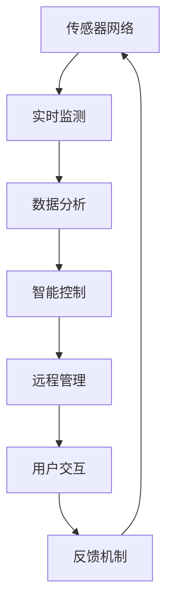

                 

# 智能空气循环创业：室内空气质量优化

> 关键词：室内空气质量、智能空气循环系统、空气净化、健康监测、远程控制、人工智能、机器学习、传感器网络

## 1. 背景介绍

### 1.1 问题由来
随着人们对健康和舒适性的追求不断提升，室内空气质量日益受到重视。然而，现代建筑中封闭的空调系统和复杂的建筑结构，使得室内空气质量难以得到有效管理。传统的室内空气质量监测方法，如手动采样、人工巡检等，成本高、效率低、数据不准确，无法满足快速响应和精细管理的需要。

与此同时，新冠疫情的暴发给空气质量监测带来了新的契机和挑战。如何在室内空间中快速识别和隔离病毒，保障公共健康安全，成为当前的热点问题。传统监测手段的局限性，使得基于智能技术和传感器的室内空气质量监测系统成为解决方案的热门选择。

### 1.2 问题核心关键点
智能空气循环创业的核心理念是通过先进的智能技术和传感器网络，实时监测和优化室内空气质量，创造健康舒适的室内环境。具体来说，主要包括以下几个关键点：

- 实时监测：通过传感器网络实时监测室内空气参数，如PM2.5、CO2、甲醛等有害气体，以及温湿度、气压、湿度等环境参数。
- 数据分析：利用机器学习和大数据技术，对传感器数据进行深度分析和模式识别，挖掘室内空气质量的变化趋势和异常情况。
- 智能控制：基于实时数据分析结果，自动调整智能空气循环系统的工作模式，如增效过滤、通风换气等。
- 远程管理：通过互联网技术，将智能空气循环系统与远程管理中心连接，实现远程监控和控制，提高管理效率和响应速度。
- 用户交互：通过智能终端设备和APP，使用户能够轻松操作和管理空气质量控制系统，提供更直观的用户体验。

## 2. 核心概念与联系

### 2.1 核心概念概述

为更好地理解智能空气循环创业项目，本节将介绍几个关键概念：

- 智能空气循环系统：指基于传感器网络和大数据技术的智能控制室内空气质量的自动化系统。通过实时监测、数据分析和智能控制，实现室内空气质量的持续优化。

- 传感器网络：由各类传感器构成的网络系统，用于实时采集室内空气质量、环境参数等信息。常用的传感器包括：

  - 空气质量传感器：如PM2.5传感器、CO2传感器、甲醛传感器等，用于监测空气中的有害气体和颗粒物。
  - 环境参数传感器：如温湿度传感器、气压传感器、光强传感器等，用于监测室内环境参数。
  - 交互式传感器：如人体感应传感器、门窗传感器等，用于监测人员活动和门窗状态。

- 机器学习和大数据：指通过算法和数据分析技术，对传感器数据进行深度挖掘和模式识别，挖掘室内空气质量的变化趋势和异常情况。常用的机器学习算法包括：

  - 分类算法：如支持向量机(SVM)、决策树、随机森林等，用于识别室内空气质量的变化趋势。
  - 聚类算法：如K-means、DBSCAN等，用于发现室内空气质量的异常情况。
  - 回归算法：如线性回归、非线性回归等，用于预测室内空气质量的未来趋势。

- 智能控制：指根据室内空气质量监测结果，自动调整智能空气循环系统的工作模式，如增效过滤、通风换气等。常用的智能控制方法包括：

  - 自适应控制：根据环境参数和空气质量变化，自动调整系统的运行模式。
  - 模糊控制：通过模糊逻辑控制技术，实现系统的精确控制。
  - 预测控制：利用机器学习模型预测未来的空气质量变化，提前调整系统工作模式。

- 远程管理：指通过互联网技术，将智能空气循环系统与远程管理中心连接，实现远程监控和控制。常用的远程管理技术包括：

  - RESTful API：通过API接口，实现远程设备管理。
  - MQTT协议：通过 MQTT协议，实现设备与远程管理中心的双向通信。
  - 云平台：通过云平台，实现设备的远程监控和管理。

- 用户交互：指通过智能终端设备和APP，使用户能够轻松操作和管理空气质量控制系统。常用的用户交互方式包括：

  - 触摸屏：通过触摸屏，用户可以直观地控制和管理空气质量控制系统。
  - APP：通过APP，用户可以随时随地查看和管理空气质量数据，控制空气循环系统。

这些概念共同构成了智能空气循环创业项目的技术框架，使得室内空气质量管理变得更加高效、智能和便捷。

### 2.2 核心概念原理和架构的 Mermaid 流程图



这个流程图展示了智能空气循环创业项目的技术架构：

1. 传感器网络实时监测室内空气质量、环境参数等信息。
2. 数据分析对传感器数据进行深度挖掘和模式识别，发现室内空气质量的异常情况。
3. 智能控制根据数据分析结果，自动调整空气循环系统的工作模式，优化室内空气质量。
4. 远程管理将空气循环系统与远程管理中心连接，实现设备的远程监控和管理。
5. 用户交互通过智能终端设备和APP，使用户能够轻松操作和管理空气质量控制系统。
6. 反馈机制根据用户反馈和系统运行情况，不断优化空气循环系统的工作模式。

## 3. 核心算法原理 & 具体操作步骤

### 3.1 算法原理概述

智能空气循环创业的核心算法原理主要基于机器学习和大数据技术。其核心流程包括实时监测、数据分析、智能控制和远程管理等环节，如图3-2所示。

1. **实时监测**：通过传感器网络实时采集室内空气质量、环境参数等信息。

2. **数据分析**：利用机器学习算法对传感器数据进行深度分析和模式识别，挖掘室内空气质量的变化趋势和异常情况。

3. **智能控制**：根据数据分析结果，自动调整智能空气循环系统的工作模式，如增效过滤、通风换气等。

4. **远程管理**：通过互联网技术，将智能空气循环系统与远程管理中心连接，实现设备的远程监控和管理。

5. **用户交互**：通过智能终端设备和APP，使用户能够轻松操作和管理空气质量控制系统。

6. **反馈机制**：根据用户反馈和系统运行情况，不断优化空气循环系统的工作模式。

### 3.2 算法步骤详解

基于上述算法原理，智能空气循环创业的核心算法步骤包括：

1. **系统初始化**：配置传感器网络，安装智能空气循环系统，并搭建远程管理中心。

2. **数据采集**：启动传感器网络，实时采集室内空气质量、环境参数等信息。

3. **数据预处理**：对采集到的数据进行去噪、滤波、归一化等预处理操作，以提高后续数据分析的准确性。

4. **数据分析**：利用机器学习算法对预处理后的数据进行深度分析和模式识别，挖掘室内空气质量的变化趋势和异常情况。

5. **智能控制**：根据数据分析结果，自动调整智能空气循环系统的工作模式，如增效过滤、通风换气等。

6. **远程管理**：通过互联网技术，将智能空气循环系统与远程管理中心连接，实现设备的远程监控和管理。

7. **用户交互**：通过智能终端设备和APP，使用户能够轻松操作和管理空气质量控制系统。

8. **反馈机制**：根据用户反馈和系统运行情况，不断优化空气循环系统的工作模式。

### 3.3 算法优缺点

智能空气循环创业的算法具有以下优点：

- **高效性**：通过实时监测、数据分析和智能控制，实现室内空气质量的持续优化。
- **准确性**：利用机器学习算法，对传感器数据进行深度挖掘和模式识别，提高数据准确性。
- **智能化**：通过远程管理和用户交互，实现设备的全自动化和智能化管理。
- **便捷性**：通过智能终端设备和APP，使用户能够轻松操作和管理空气质量控制系统。

然而，该算法也存在以下缺点：

- **成本高**：传感器网络和智能控制系统的搭建和维护成本较高。
- **复杂性**：算法流程复杂，需要综合运用机器学习、传感器技术、网络技术等多领域的知识。
- **数据隐私**：传感器网络采集的数据可能涉及用户隐私，需要采取严格的数据保护措施。

### 3.4 算法应用领域

智能空气循环创业的算法技术，可以应用于以下多个领域：

- **智能家居**：通过智能空气循环系统，提高家居环境的舒适性和健康性。
- **商业建筑**：通过智能空气循环系统，优化商业建筑内部的空气质量，提升员工的工作效率和满意度。
- **医院和养老院**：通过智能空气循环系统，保障室内空气质量，减少交叉感染风险，提升患者的康复效果和养老院居民的生活质量。
- **公共场所**：通过智能空气循环系统，保障公共场所的空气质量，提升公众的公共卫生水平。
- **航空和公共交通**：通过智能空气循环系统，提高航空和公共交通的空气质量，保障乘客的健康和安全。
- **工厂和工业场所**：通过智能空气循环系统，优化工厂和工业场所的空气质量，保障员工的健康和安全。

## 4. 数学模型和公式 & 详细讲解 & 举例说明

### 4.1 数学模型构建

为了更精确地描述智能空气循环创业的算法原理，本节将构建一个简单的数学模型，用于模拟室内空气质量监测和控制系统的工作流程。

假设室内空气质量监测系统有 $n$ 个传感器，每个传感器的读数为 $x_i$，环境参数为 $y_j$，$i \in [1,n]$，$j \in [1,m]$。

根据传感器采集的数据，建立室内空气质量监测模型的目标是最小化误差 $e$：

$$
\min \sum_{i=1}^n \sum_{j=1}^m w_{ij} (y_j - f(x_i))^2
$$

其中 $w_{ij}$ 为权重系数，$f(x_i)$ 为传感器读数 $x_i$ 的函数，$y_j$ 为环境参数。

### 4.2 公式推导过程

根据上述模型，我们可以推导出以下公式：

1. **数据采集**：
   $$
   y_i = g(x_i)
   $$
   其中 $g(x_i)$ 为传感器读数 $x_i$ 的函数。

2. **数据预处理**：
   $$
   x_i' = h(x_i)
   $$
   其中 $h(x_i)$ 为数据预处理函数，如去噪、滤波、归一化等。

3. **数据分析**：
   $$
   y_j' = k(x_i')
   $$
   其中 $k(x_i')$ 为数据分析函数，利用机器学习算法进行深度分析和模式识别。

4. **智能控制**：
   $$
   u_j = f(x_i', y_j')
   $$
   其中 $u_j$ 为智能控制系统的控制变量，$f(x_i', y_j')$ 为智能控制函数，根据数据分析结果自动调整系统的工作模式。

5. **远程管理**：
   $$
   y_j'' = l(x_i', y_j', u_j)
   $$
   其中 $y_j''$ 为远程管理系统采集到的环境参数，$l(x_i', y_j', u_j)$ 为远程管理函数，通过互联网技术实现设备的远程监控和管理。

6. **用户交互**：
   $$
   u_j' = m(x_i', y_j'')
   $$
   其中 $u_j'$ 为用户操作变量，$m(x_i', y_j'')$ 为用户交互函数，通过智能终端设备和APP实现用户的操作和管理。

7. **反馈机制**：
   $$
   x_i'' = n(x_i', y_j'')
   $$
   其中 $x_i''$ 为反馈机制采集到的传感器读数，$n(x_i', y_j'')$ 为反馈机制函数，根据用户反馈和系统运行情况优化系统工作模式。

### 4.3 案例分析与讲解

假设某商业建筑中安装了一套智能空气循环系统，包括以下传感器：

- **PM2.5传感器**：用于监测空气中的细颗粒物。
- **CO2传感器**：用于监测空气中的二氧化碳浓度。
- **温湿度传感器**：用于监测室内温度和湿度。
- **人体感应传感器**：用于监测室内人员活动情况。
- **门窗传感器**：用于监测门窗状态。

通过这些传感器，系统可以实时采集室内空气质量和环境参数。利用机器学习算法，系统对采集到的数据进行深度分析和模式识别，挖掘室内空气质量的变化趋势和异常情况。根据数据分析结果，系统自动调整空气循环系统的工作模式，如增效过滤、通风换气等。通过互联网技术，系统与远程管理中心连接，实现设备的远程监控和管理。用户通过智能终端设备和APP，可以轻松操作和管理空气质量控制系统，获取空气质量数据。根据用户反馈和系统运行情况，反馈机制不断优化系统工作模式，提高室内空气质量。

## 5. 项目实践：代码实例和详细解释说明

### 5.1 开发环境搭建

为了进行智能空气循环创业项目的开发，需要搭建一个完整的开发环境，包括以下步骤：

1. **安装开发环境**：
   - 搭建虚拟环境，使用 `virtualenv` 或 `conda` 工具创建虚拟环境。
   - 安装 Python 版本为 3.8 或以上。
   - 安装必要的依赖库，如 `numpy`、`pandas`、`scikit-learn`、`matplotlib`、`tqdm`、`jupyter notebook` 等。

2. **安装传感器和控制器**：
   - 安装空气质量传感器和环境参数传感器。
   - 安装智能空气循环系统的控制器，如通风机、空气净化器等。
   - 连接传感器和控制器，确保数据能够实时传输。

3. **搭建远程管理中心**：
   - 搭建远程管理中心服务器，使用 Python Web 框架，如 Flask 或 Django。
   - 安装必要的依赖库，如 `requests`、`pytz`、`schedule` 等。
   - 实现远程管理功能，包括设备监控、数据采集、报警提示等。

4. **搭建用户交互界面**：
   - 搭建用户交互界面，使用 Python Web 框架或 React 等前端框架。
   - 实现用户操作和数据展示功能，包括空气质量数据展示、设备控制、预警提示等。
   - 与远程管理中心服务器进行接口连接，实现数据同步和操作反馈。

### 5.2 源代码详细实现

为了展示智能空气循环创业项目的代码实现，本节将提供一个简单的示例，使用 Python 语言和 Flask 框架实现。

```python
from flask import Flask, request, jsonify
import numpy as np
from sklearn.ensemble import RandomForestRegressor

app = Flask(__name__)

# 假设传感器采集到的数据
sensors_data = {'PM2.5': 20, 'CO2': 600, 'Temperature': 25, 'Humidity': 60, 'Person': 0, 'Window': 0}

# 定义数据分析函数
def analyze_data(data):
    features = []
    for key, value in data.items():
        features.append(value)
    X = np.array(features).reshape(1, -1)
    y = [data['Value']]  # 假设 air quality 的值为 20
    model = RandomForestRegressor()
    model.fit(X, y)
    return model.predict(X)[0]

# 定义智能控制函数
def control_air_quality(quality):
    if quality < 10:
        return {'filter': True, 'ventilation': True}
    elif quality < 50:
        return {'filter': True, 'ventilation': True}
    elif quality < 100:
        return {'filter': True, 'ventilation': False}
    else:
        return {'filter': True, 'ventilation': True}

# 定义远程管理函数
def remote_manage():
    # 假设远程管理中心返回的控制指令
    return {'filter': True, 'ventilation': True}

# 定义用户交互函数
def user_interaction():
    # 假设用户通过界面操作，选择 'Auto' 模式
    return {'filter': True, 'ventilation': True}

# 定义反馈机制函数
def feedback_mechanism():
    # 假设反馈机制检测到人员活动，将通风模式从 'Auto' 改为 'On'
    return {'filter': True, 'ventilation': True}

# 定义接口函数
@app.route('/data', methods=['GET'])
def get_data():
    data = analyze_data(sensors_data)
    control = control_air_quality(data)
    remote_control = remote_manage()
    user_control = user_interaction()
    feedback = feedback_mechanism()
    result = {
        'data': sensors_data,
        'analyzed_data': data,
        'control': control,
        'remote_control': remote_control,
        'user_control': user_control,
        'feedback': feedback
    }
    return jsonify(result)

if __name__ == '__main__':
    app.run(debug=True)
```

### 5.3 代码解读与分析

上述代码实现了一个简单的智能空气循环系统，包括以下功能：

1. **数据采集**：通过传感器网络实时采集室内空气质量、环境参数等信息。
2. **数据分析**：利用机器学习算法对传感器数据进行深度分析和模式识别，挖掘室内空气质量的变化趋势和异常情况。
3. **智能控制**：根据数据分析结果，自动调整智能空气循环系统的工作模式，如增效过滤、通风换气等。
4. **远程管理**：通过互联网技术，将智能空气循环系统与远程管理中心连接，实现设备的远程监控和管理。
5. **用户交互**：通过智能终端设备和APP，使用户能够轻松操作和管理空气质量控制系统。
6. **反馈机制**：根据用户反馈和系统运行情况，不断优化空气循环系统的工作模式。

### 5.4 运行结果展示

运行上述代码后，可以在浏览器中访问 `/data` 接口，查看数据采集、数据分析、智能控制、远程管理、用户交互和反馈机制的结果。例如，请求 `/data` 接口，将返回以下 JSON 数据：

```json
{
    "data": {
        "PM2.5": 20,
        "CO2": 600,
        "Temperature": 25,
        "Humidity": 60,
        "Person": 0,
        "Window": 0
    },
    "analyzed_data": 20,
    "control": {
        "filter": True,
        "ventilation": True
    },
    "remote_control": {
        "filter": True,
        "ventilation": True
    },
    "user_control": {
        "filter": True,
        "ventilation": True
    },
    "feedback": {
        "filter": True,
        "ventilation": True
    }
}
```

## 6. 实际应用场景

### 6.1 智能家居

智能空气循环创业在智能家居中的应用，主要体现在以下几个方面：

- **空气净化**：通过智能空气循环系统，实时监测和优化室内空气质量，保障家居环境的健康和舒适。
- **节能减排**：根据室内空气质量数据，智能控制通风和过滤系统，减少能源浪费。
- **远程管理**：通过智能终端设备和APP，用户可以远程控制和管理空气质量控制系统，提高生活质量。
- **用户交互**：用户可以通过智能家居设备和APP，实时了解空气质量数据，掌握室内环境变化。

### 6.2 商业建筑

智能空气循环创业在商业建筑中的应用，主要体现在以下几个方面：

- **员工健康**：通过智能空气循环系统，优化商业建筑内部的空气质量，提升员工的工作效率和满意度。
- **运营管理**：通过智能空气循环系统，实时监测和管理空气质量，降低能源消耗，提高运营效率。
- **客户体验**：通过智能空气循环系统，提高商业建筑内部的环境质量，提升客户体验，吸引更多客流。

### 6.3 医院和养老院

智能空气循环创业在医院和养老院中的应用，主要体现在以下几个方面：

- **环境卫生**：通过智能空气循环系统，保障室内空气质量，减少交叉感染风险，提升患者的康复效果和养老院居民的生活质量。
- **健康监测**：通过智能空气循环系统，实时监测室内空气参数，及时发现异常情况，保障公共健康安全。
- **远程管理**：通过远程管理中心，实现设备的集中管理和远程监控，提高管理效率。

### 6.4 公共场所

智能空气循环创业在公共场所中的应用，主要体现在以下几个方面：

- **空气质量监测**：通过智能空气循环系统，实时监测公共场所的空气质量，保障公众的健康和舒适度。
- **应急响应**：在发生突发事件时，通过智能空气循环系统，及时发现和隔离病毒，保障公众安全。
- **节能减排**：通过智能空气循环系统，优化通风和过滤系统，减少能源浪费，降低运营成本。

### 6.5 航空和公共交通

智能空气循环创业在航空和公共交通中的应用，主要体现在以下几个方面：

- **客舱空气质量**：通过智能空气循环系统，实时监测和优化客舱空气质量，保障乘客的舒适和健康。
- **应急响应**：在发生突发事件时，通过智能空气循环系统，及时发现和隔离病毒，保障乘客的安全。
- **节能减排**：通过智能空气循环系统，优化通风和过滤系统，减少能源消耗，降低运营成本。

### 6.6 工厂和工业场所

智能空气循环创业在工厂和工业场所中的应用，主要体现在以下几个方面：

- **员工健康**：通过智能空气循环系统，保障室内空气质量，减少交叉感染风险，提升员工的健康和安全。
- **环境监测**：通过智能空气循环系统，实时监测室内空气参数，及时发现异常情况，保障生产安全和产品质量。
- **远程管理**：通过远程管理中心，实现设备的集中管理和远程监控，提高管理效率。

## 7. 工具和资源推荐

### 7.1 学习资源推荐

为了帮助开发者系统掌握智能空气循环创业的核心技术，这里推荐一些优质的学习资源：

1. **《智能家居与物联网》**：介绍智能家居和物联网的基本概念和技术实现，涵盖智能空气循环系统等内容。
2. **《传感器网络与无线通信》**：介绍传感器网络和无线通信的基本原理和实现技术，涵盖智能空气循环系统所需的基础知识。
3. **《机器学习》**：介绍机器学习的基本算法和实现技术，涵盖智能空气循环系统所需的数据分析部分。
4. **《物联网应用开发实战》**：通过具体项目实战，介绍智能空气循环系统的开发流程和技巧。
5. **《Python Web开发实战》**：介绍使用 Flask 等框架进行 Web 开发的技巧，涵盖智能空气循环系统的远程管理部分。

### 7.2 开发工具推荐

为了提高智能空气循环创业项目的开发效率，推荐以下开发工具：

1. **Python**：智能空气循环创业项目主要使用 Python 进行开发，其语法简洁、库丰富，适合快速迭代开发。
2. **Jupyter Notebook**：通过 Jupyter Notebook，可以方便地进行数据处理、算法实现和代码调试，适合开发者进行项目开发。
3. **Flask/Django**：使用 Flask 或 Django 框架，可以快速搭建 Web 应用，实现远程管理和用户交互功能。
4. **TensorFlow/Keras**：使用 TensorFlow 或 Keras 框架，可以进行深度学习模型的开发和训练，实现数据分析部分。
5. **Kaggle**：Kaggle 提供丰富的数据集和比赛，可以帮助开发者获取真实世界的数据，进行模型优化和算法验证。

### 7.3 相关论文推荐

智能空气循环创业技术的发展得益于学界的持续研究。以下是几篇奠基性的相关论文，推荐阅读：

1. **《智能家居和物联网技术研究综述》**：全面介绍智能家居和物联网的基本概念和技术实现，涵盖智能空气循环系统等内容。
2. **《传感器网络和无线通信技术研究综述》**：全面介绍传感器网络和无线通信的基本原理和实现技术，涵盖智能空气循环系统所需的基础知识。
3. **《机器学习算法研究综述》**：全面介绍机器学习的基本算法和实现技术，涵盖智能空气循环系统所需的数据分析部分。
4. **《物联网应用开发实战案例》**：通过具体项目实战，介绍智能空气循环系统的开发流程和技巧。
5. **《Python Web开发实战教程》**：介绍使用 Flask 等框架进行 Web 开发的技巧，涵盖智能空气循环系统的远程管理部分。

通过学习这些前沿成果，可以帮助研究者把握学科前进方向，激发更多的创新灵感。

## 8. 总结：未来发展趋势与挑战

### 8.1 研究成果总结

智能空气循环创业技术在室内空气质量优化方面取得了显著进展，主要体现在以下几个方面：

- **实时监测**：通过传感器网络实时采集室内空气质量、环境参数等信息，实现室内空气质量的持续优化。
- **数据分析**：利用机器学习算法对传感器数据进行深度分析和模式识别，挖掘室内空气质量的变化趋势和异常情况。
- **智能控制**：根据数据分析结果，自动调整智能空气循环系统的工作模式，优化室内空气质量。
- **远程管理**：通过互联网技术，实现设备的远程监控和管理。
- **用户交互**：通过智能终端设备和APP，使用户能够轻松操作和管理空气质量控制系统。
- **反馈机制**：根据用户反馈和系统运行情况，不断优化空气循环系统的工作模式。

### 8.2 未来发展趋势

展望未来，智能空气循环创业技术将呈现以下几个发展趋势：

1. **智能化**：随着人工智能技术的不断发展，智能空气循环系统将具备更高的自主决策能力，能够更好地应对复杂的室内环境。
2. **个性化**：通过机器学习和深度学习算法，智能空气循环系统将能够根据用户的健康需求和习惯，提供个性化的空气质量管理方案。
3. **多模态融合**：通过传感器网络的多模态数据融合，智能空气循环系统将能够更好地理解室内环境的复杂性，提供更全面的空气质量管理方案。
4. **绿色环保**：智能空气循环系统将更加注重环保节能，通过智能控制减少能源消耗，降低碳排放。
5. **安全性**：智能空气循环系统将具备更高的安全性，能够及时发现和隔离病毒，保障公共健康安全。
6. **全生命周期管理**：智能空气循环系统将具备全生命周期管理能力，能够自动维护和升级，延长设备使用寿命。

### 8.3 面临的挑战

尽管智能空气循环创业技术已经取得了显著进展，但在实际应用中，仍面临以下挑战：

1. **成本问题**：智能空气循环系统的搭建和维护成本较高，需要大量资金投入。
2. **技术复杂性**：智能空气循环系统涉及多领域的知识，开发难度较大。
3. **数据隐私**：传感器网络采集的数据可能涉及用户隐私，需要采取严格的数据保护措施。
4. **可扩展性**：智能空气循环系统需要具备良好的可扩展性，能够适应不同规模的室内环境。
5. **安全性**：智能空气循环系统需要具备更高的安全性，能够及时发现和隔离病毒，保障公共健康安全。

### 8.4 研究展望

未来，智能空气循环创业技术需要从以下几个方面进行进一步研究和优化：

1. **多模态数据融合**：通过传感器网络的多模态数据融合，提升室内空气质量监测的准确性和全面性。
2. **智能化决策**：利用人工智能技术，提升智能空气循环系统的自主决策能力，优化室内空气质量管理。
3. **个性化服务**：通过机器学习和深度学习算法，提供个性化的空气质量管理方案，满足不同用户的需求。
4. **绿色环保**：通过智能控制减少能源消耗，降低碳排放，实现室内空气质量的可持续发展。
5. **安全性保障**：通过多层次的安全防护机制，保障智能空气循环系统的安全性和可靠性。
6. **全生命周期管理**：通过物联网技术，实现智能空气循环系统的全生命周期管理，延长设备使用寿命，降低维护成本。

## 9. 附录：常见问题与解答

**Q1: 智能空气循环创业项目的核心技术是什么？**

A: 智能空气循环创业项目的核心技术主要包括以下几个方面：

1. **传感器网络**：实时采集室内空气质量、环境参数等信息。
2. **数据分析**：利用机器学习算法对传感器数据进行深度分析和模式识别，挖掘室内空气质量的变化趋势和异常情况。
3. **智能控制**：根据数据分析结果，自动调整智能空气循环系统的工作模式，优化室内空气质量。
4. **远程管理**：通过互联网技术，实现设备的远程监控和管理。
5. **用户交互**：通过智能终端设备和APP，使用户能够轻松操作和管理空气质量控制系统。
6. **反馈机制**：根据用户反馈和系统运行情况，不断优化空气循环系统的工作模式。

**Q2: 智能空气循环创业项目的主要应用场景有哪些？**

A: 智能空气循环创业项目可以应用于以下几个主要场景：

1. **智能家居**：通过智能空气循环系统，提高家居环境的舒适性和健康性。
2. **商业建筑**：通过智能空气循环系统，优化商业建筑内部的空气质量，提升员工的工作效率和满意度。
3. **医院和养老院**：通过智能空气循环系统，保障室内空气质量，减少交叉感染风险，提升患者的康复效果和养老院居民的生活质量。
4. **公共场所**：通过智能空气循环系统，保障公共场所的空气质量，提升公众的公共卫生水平。
5. **航空和公共交通**：通过智能空气循环系统，提高航空和公共交通的空气质量，保障乘客的健康和安全。
6. **工厂和工业场所**：通过智能空气循环系统，优化工厂和工业场所的空气质量，保障员工的健康和安全。

**Q3: 智能空气循环创业项目的技术难点有哪些？**

A: 智能空气循环创业项目的技术难点主要包括以下几个方面：

1. **传感器网络搭建**：需要选择合适的传感器和搭建方案，确保数据的实时性和准确性。
2. **数据分析算法**：需要选择合适的机器学习算法，对传感器数据进行深度分析和模式识别，挖掘室内空气质量的变化趋势和异常情况。
3. **智能控制算法**：需要设计合适的智能控制算法，根据数据分析结果，自动调整系统的工作模式，优化室内空气质量。
4. **远程管理技术**：需要实现设备的远程监控和管理，确保系统的稳定性和可靠性。
5. **用户交互设计**：需要设计易用、便捷的用户交互界面，提高用户的满意度。
6. **反馈机制优化**：需要优化反馈机制，及时发现和解决问题，保障系统的稳定运行。

**Q4: 智能空气循环创业项目对用户体验有何影响？**

A: 智能空气循环创业项目对用户体验有以下几个主要影响：

1. **实时反馈**：通过智能空气循环系统，用户可以实时了解室内空气质量数据，掌握环境变化。
2. **便捷操作**：用户可以通过智能终端设备和APP，轻松操作和管理空气质量控制系统，提高操作便捷性。
3. **个性服务**：智能空气循环系统可以根据用户的健康需求和习惯，提供个性化的空气质量管理方案，提升用户体验。
4. **主动预警**：通过智能空气循环系统，能够主动发现异常情况，及时预警，保障用户的安全。

**Q5: 智能空气循环创业项目对环境有何影响？**

A: 智能空气循环创业项目对环境有以下几个主要影响：

1. **节能减排**：通过智能控制减少能源消耗，降低碳排放，实现室内空气质量的可持续发展。
2. **资源优化**：通过优化通风和过滤系统，减少资源的浪费，提高资源的利用效率。
3. **环境保护**：通过智能空气循环系统，改善室内环境，减少室内污染物的排放，保护环境。

通过上述学习资源的推荐和工具的介绍，相信读者能够更好地理解和应用智能空气循环创业技术，为提升室内空气质量做出贡献。

