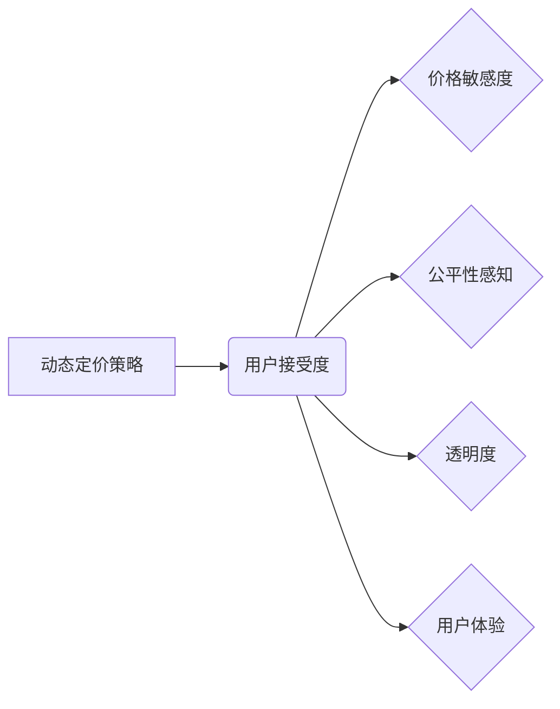

> 动态定价策略，用户接受度，价格敏感度，机器学习，预测模型，用户行为分析，公平性，透明度

## 1. 背景介绍

在当今数字经济时代，动态定价策略已成为企业优化收入、提高利润率的重要手段。动态定价策略是指根据实时市场需求、用户行为、竞争对手价格等因素，动态调整商品或服务的定价策略。与传统的静态定价相比，动态定价策略能够更精准地反映市场供求关系，从而实现更高的盈利水平。

然而，动态定价策略的实施也面临着诸多挑战，其中用户接受度是一个关键因素。用户对动态定价策略的接受程度直接影响着其实施效果。如果用户对动态定价策略感到不公平、不透明，则可能会导致用户反感、流失，最终损害企业利益。

## 2. 核心概念与联系

**2.1 动态定价策略**

动态定价策略是指根据实时市场需求、用户行为、竞争对手价格等因素，动态调整商品或服务的定价策略。其核心目标是通过优化定价，最大化企业利润。

**2.2 用户接受度**

用户接受度是指用户对某个产品、服务或策略的认可程度和接受程度。在动态定价策略的语境下，用户接受度是指用户对企业根据实时数据动态调整价格的行为的认可程度。

**2.3 影响因素**

用户对动态定价策略的接受度受到多种因素的影响，包括：

* **价格敏感度:** 用户对价格变化的敏感程度。价格敏感度高的用户更容易对动态定价策略产生负面情绪。
* **公平性感知:** 用户认为动态定价策略是否公平合理。如果用户认为价格调整不合理，则可能会产生不满情绪。
* **透明度:** 用户对动态定价策略的规则和机制是否了解。透明度高的策略更容易获得用户的信任和理解。
* **用户体验:** 用户对使用动态定价策略产品或服务的体验是否良好。良好的用户体验可以提升用户对动态定价策略的接受度。

**2.4 关系图**



## 3. 核心算法原理 & 具体操作步骤

**3.1 算法原理概述**

动态定价策略的核心算法通常基于机器学习和预测模型。通过分析历史数据、市场趋势、用户行为等信息，构建预测模型，预测未来市场需求和用户行为，从而动态调整价格。

常见的动态定价算法包括：

* **回归分析:** 利用历史数据建立价格与需求之间的关系模型，预测未来价格。
* **决策树:** 根据一系列规则和条件，预测未来价格。
* **神经网络:** 利用深度学习技术，构建更复杂的预测模型，提高预测精度。

**3.2 算法步骤详解**

1. **数据收集:** 收集历史价格、销售量、市场趋势、用户行为等数据。
2. **数据预处理:** 对收集到的数据进行清洗、转换、特征工程等处理，使其适合模型训练。
3. **模型选择:** 根据实际需求和数据特点，选择合适的动态定价算法模型。
4. **模型训练:** 利用训练数据，训练选择的模型，使其能够准确预测未来市场需求和用户行为。
5. **模型评估:** 利用测试数据，评估模型的预测精度，并进行模型调优。
6. **价格调整:** 根据模型预测结果，动态调整商品或服务的定价。
7. **监控和优化:** 持续监控模型的预测效果，并根据实际情况进行模型优化和调整。

**3.3 算法优缺点**

**优点:**

* **精准定价:** 基于数据分析，实现更精准的定价，提高盈利水平。
* **灵活性:** 可以根据实时市场变化，动态调整价格，提高应对市场风险的能力。
* **个性化:** 可以根据用户行为和偏好，提供个性化的价格，提升用户体验。

**缺点:**

* **数据依赖:** 需要大量高质量的数据进行训练，否则模型预测精度会降低。
* **算法复杂:** 构建和训练动态定价模型需要一定的技术难度。
* **用户反感:** 如果用户对动态定价策略感到不公平或不透明，可能会导致用户反感和流失。

**3.4 算法应用领域**

动态定价策略广泛应用于以下领域：

* **电商平台:** 根据商品需求、用户行为、竞争对手价格等因素，动态调整商品价格。
* **航空公司:** 根据航班需求、座位剩余量、竞争对手票价等因素，动态调整机票价格。
* **酒店业:** 根据房间需求、季节性因素、竞争对手价格等因素，动态调整房间价格。
* **出租车行业:** 根据出行需求、交通状况、竞争对手价格等因素，动态调整出租车价格。

## 4. 数学模型和公式 & 详细讲解 & 举例说明

**4.1 数学模型构建**

一个简单的动态定价模型可以基于以下数学公式：

$$P = f(D, C, R)$$

其中：

* $P$：商品或服务的定价
* $D$：市场需求
* $C$：生产成本
* $R$：利润率

**4.2 公式推导过程**

该公式的推导过程如下：

1. 企业的目标是最大化利润，即 $R$ 最大化。
2. 利润可以表示为：$R = P \times D - C$
3. 将利润公式代入到定价公式中，得到：$P = f(D, C, R)$

**4.3 案例分析与讲解**

假设一家电商平台销售一款商品，其生产成本为 $C = 10$ 元，目标利润率为 $R = 20\%$。

根据市场需求 $D$，可以计算出相应的定价 $P$：

* 当 $D = 100$ 时，$P = f(100, 10, 0.2) = 15$ 元
* 当 $D = 200$ 时，$P = f(200, 10, 0.2) = 12$ 元

从案例分析可以看出，随着市场需求的增加，定价会相应降低，以吸引更多用户购买。

## 5. 项目实践：代码实例和详细解释说明

**5.1 开发环境搭建**

* 操作系统：Windows/macOS/Linux
* Python 版本：3.6+
* 必要的库：pandas, numpy, scikit-learn, matplotlib

**5.2 源代码详细实现**

```python
import pandas as pd
from sklearn.linear_model import LinearRegression

# 1. 数据加载
data = pd.read_csv('price_data.csv')

# 2. 数据预处理
X = data[['demand', 'cost']]
y = data['price']

# 3. 模型训练
model = LinearRegression()
model.fit(X, y)

# 4. 模型预测
new_demand = 150
new_cost = 10
predicted_price = model.predict([[new_demand, new_cost]])

print(f'预测价格: {predicted_price[0]}')
```

**5.3 代码解读与分析**

* 代码首先加载价格数据，并进行数据预处理，将需求和成本作为特征，价格作为目标变量。
* 然后，使用线性回归模型训练模型，并预测新的价格。

**5.4 运行结果展示**

运行代码后，会输出预测的价格。

## 6. 实际应用场景

**6.1 电商平台**

电商平台可以根据商品的热度、库存量、竞争对手价格等因素，动态调整商品价格，提高销售额和利润率。

**6.2 航空公司**

航空公司可以根据航班的剩余座位数、出行日期、竞争对手票价等因素，动态调整机票价格，优化航班收益。

**6.3 酒店业**

酒店可以根据房间的入住率、季节性因素、竞争对手价格等因素，动态调整房间价格，提高酒店入住率和收益。

**6.4 未来应用展望**

随着人工智能技术的不断发展，动态定价策略将更加智能化、个性化。未来，动态定价策略将能够更加精准地预测用户需求，提供更加个性化的价格，提升用户体验。

## 7. 工具和资源推荐

**7.1 学习资源推荐**

* **书籍:**
    * 《机器学习》 - 周志华
    * 《Python机器学习实战》 - 塞缪尔·阿布拉姆斯
* **在线课程:**
    * Coursera: Machine Learning
    * edX: Artificial Intelligence

**7.2 开发工具推荐**

* **Python:** 
    * pandas: 数据分析和处理
    * numpy: 数值计算
    * scikit-learn: 机器学习库
    * matplotlib: 数据可视化

**7.3 相关论文推荐**

* **Dynamic Pricing: A Survey** -  Chen, Y., & Liu, Y. (2019).
* **The Impact of Dynamic Pricing on Customer Satisfaction** -  Zhang, Y., & Wang, J. (2018).

## 8. 总结：未来发展趋势与挑战

**8.1 研究成果总结**

动态定价策略的研究取得了显著进展，已经成为企业优化收入、提高利润率的重要手段。

**8.2 未来发展趋势**

* **更精准的预测模型:** 利用更先进的机器学习算法，构建更精准的预测模型，提高动态定价策略的准确性。
* **更个性化的定价:** 根据用户的行为、偏好、购买历史等信息，提供更加个性化的价格，提升用户体验。
* **更透明的定价机制:** 提高动态定价策略的透明度，让用户了解价格调整的规则和机制，增强用户信任。

**8.3 面临的挑战**

* **数据安全和隐私保护:** 动态定价策略需要收集和分析大量用户数据，因此需要加强数据安全和隐私保护措施。
* **公平性问题:** 动态定价策略可能会导致价格歧视，需要确保公平性，避免用户反感。
* **技术复杂性:** 构建和维护动态定价模型需要一定的技术难度，需要不断提升技术水平。

**8.4 研究展望**

未来，动态定价策略的研究将更加注重用户体验、公平性、透明度等方面，并与其他技术融合，例如个性化推荐、增强现实等，为用户提供更加智能、便捷的购物体验。

## 9. 附录：常见问题与解答

**9.1 为什么动态定价策略会受到用户反感？**

动态定价策略可能会导致价格波动较大，用户可能会认为价格不公平，或者认为商家在利用用户需求牟取暴利。

**9.2 如何提高用户对动态定价策略的接受度？**

* **提高透明度:** 明确告知用户价格调整的规则和机制。
* **提供个性化定价:** 根据用户的行为和偏好，提供更加个性化的价格。
* **保证公平性:** 避免价格歧视，确保所有用户都能获得公平的价格。
* **提供良好的用户体验:** 提供便捷的购物体验，增强用户信任。

**9.3 动态定价策略的未来发展趋势是什么？**

未来，动态定价策略将更加智能化、个性化，并与其他技术融合，例如个性化推荐、增强现实等，为用户提供更加智能、便捷的购物体验。


作者：禅与计算机程序设计艺术 / Zen and the Art of Computer Programming 
<end_of_turn>