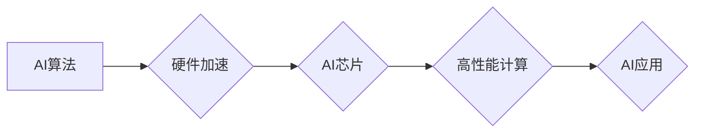

> 半导体、人工智能、深度学习、神经网络、摩尔定律、硬件加速、芯片设计、AI芯片

## 1. 背景介绍

人工智能（AI）正以惊人的速度发展，从语音识别到图像处理，再到自动驾驶，AI技术正在改变着我们的生活。然而，AI的发展离不开强大的计算能力，而半导体硬件技术是支撑AI发展的基石。

半导体技术的发展遵循着摩尔定律，即每隔一段时间，芯片上的晶体管数量就会增加一倍，性能也会相应提升。这种指数级的增长推动了计算能力的飞速发展，为AI的训练和推理提供了强大的硬件基础。

## 2. 核心概念与联系

**2.1 AI发展与硬件需求**

人工智能算法，特别是深度学习算法，对计算资源的需求非常高。训练一个大型的深度学习模型需要大量的计算量，通常需要数周甚至数月的训练时间。

**2.2 半导体技术与AI硬件**

半导体技术是构建AI硬件的基础。AI芯片的设计需要考虑以下几个关键因素：

* **计算能力:** AI芯片需要具备强大的计算能力，以支持深度学习算法的训练和推理。
* **内存带宽:** AI模型通常非常庞大，需要大量的内存来存储模型参数和数据。因此，AI芯片需要具备高带宽的内存接口，以保证数据传输效率。
* **功耗:** AI芯片的功耗是一个重要的考虑因素，特别是对于移动设备和嵌入式系统。

**2.3 硬件加速与AI性能提升**

硬件加速技术可以显著提升AI模型的训练和推理速度。常见的硬件加速技术包括：

* **GPU (图形处理单元):** GPU最初设计用于图形渲染，但其并行计算能力也适用于深度学习算法。
* **TPU (Tensor Processing Unit):** TPU是谷歌专门为深度学习设计的专用硬件加速器。
* **FPGA (现场可编程门阵列):** FPGA可以根据需要灵活地配置，可以用于定制AI硬件加速器。

**2.4 AI芯片架构**

AI芯片的架构通常包括以下几个部分：

* **计算单元:** 负责执行深度学习算法的计算。
* **内存控制器:** 管理芯片的内存访问。
* **通信接口:** 连接芯片与其他硬件设备。

**Mermaid 流程图**



## 3. 核心算法原理 & 具体操作步骤

**3.1 算法原理概述**

深度学习算法的核心是多层神经网络。神经网络由多个层组成，每层包含多个神经元。神经元之间通过连接进行信息传递，每个连接都有一个权重。通过训练，神经网络可以学习到这些权重的最佳值，从而实现对数据的学习和预测。

**3.2 算法步骤详解**

1. **数据预处理:** 将原始数据转换为深度学习算法可以理解的格式。
2. **网络结构设计:** 根据任务需求设计神经网络的结构，包括层数、神经元数量等。
3. **参数初始化:** 为神经网络的参数（权重和偏置）进行随机初始化。
4. **前向传播:** 将输入数据通过神经网络进行传递，得到输出结果。
5. **损失函数计算:** 计算模型输出与真实值的差异，即损失值。
6. **反向传播:** 根据损失值，调整神经网络的参数，使损失值最小化。
7. **训练迭代:** 重复前向传播、损失函数计算和反向传播的过程，直到模型达到预期的性能。

**3.3 算法优缺点**

**优点:**

* 表现力强: 深度学习算法能够学习到数据的复杂特征，从而实现高精度预测。
* 自动特征提取: 深度学习算法可以自动学习数据的特征，无需人工特征工程。
* 可扩展性强: 深度学习算法可以很容易地扩展到更大的数据集和更复杂的模型。

**缺点:**

* 数据依赖性强: 深度学习算法需要大量的训练数据才能达到良好的性能。
* 计算资源需求高: 深度学习算法的训练和推理需要大量的计算资源。
* 可解释性差: 深度学习模型的决策过程难以理解，缺乏可解释性。

**3.4 算法应用领域**

深度学习算法在各个领域都有广泛的应用，例如：

* **计算机视觉:** 图像识别、物体检测、图像分割等。
* **自然语言处理:** 语音识别、机器翻译、文本生成等。
* **医疗诊断:** 病理图像分析、疾病预测等。
* **金融分析:** 欺诈检测、风险评估等。

## 4. 数学模型和公式 & 详细讲解 & 举例说明

**4.1 数学模型构建**

深度学习模型可以看作是一个复杂的数学模型，其核心是神经网络的激活函数和权重更新规则。

**4.2 公式推导过程**

* **激活函数:** 激活函数用于将神经元的输入转换为输出，常见的激活函数包括 sigmoid 函数、ReLU 函数等。

* **损失函数:** 损失函数用于衡量模型预测结果与真实值的差异，常见的损失函数包括均方误差、交叉熵等。

* **梯度下降:** 梯度下降算法用于更新神经网络的参数，使其能够最小化损失函数。

**4.3 案例分析与讲解**

以线性回归为例，其数学模型可以表示为：

$$y = w_1x_1 + w_2x_2 + ... + w_nx_n + b$$

其中：

* $y$ 是预测结果
* $x_1, x_2, ..., x_n$ 是输入特征
* $w_1, w_2, ..., w_n$ 是权重
* $b$ 是偏置

损失函数可以选用均方误差：

$$Loss = \frac{1}{2}\sum_{i=1}^{N}(y_i - \hat{y}_i)^2$$

其中：

* $N$ 是样本数量
* $y_i$ 是真实值
* $\hat{y}_i$ 是预测值

通过梯度下降算法，可以更新权重和偏置，使损失函数最小化。

## 5. 项目实践：代码实例和详细解释说明

**5.1 开发环境搭建**

* 操作系统: Ubuntu 20.04
* Python 版本: 3.8
* 深度学习框架: TensorFlow 2.0

**5.2 源代码详细实现**

```python
import tensorflow as tf

# 定义模型
model = tf.keras.models.Sequential([
    tf.keras.layers.Dense(64, activation='relu', input_shape=(10,)),
    tf.keras.layers.Dense(10, activation='softmax')
])

# 编译模型
model.compile(optimizer='adam',
              loss='sparse_categorical_crossentropy',
              metrics=['accuracy'])

# 训练模型
model.fit(x_train, y_train, epochs=10)

# 评估模型
loss, accuracy = model.evaluate(x_test, y_test)
print('Loss:', loss)
print('Accuracy:', accuracy)
```

**5.3 代码解读与分析**

* 代码首先定义了一个简单的多层感知机模型，包含两个全连接层。
* 激活函数使用 ReLU 函数和 softmax 函数。
* 优化器使用 Adam 优化器，损失函数使用交叉熵损失函数，评估指标使用准确率。
* 代码使用 `model.fit()` 函数训练模型，使用 `model.evaluate()` 函数评估模型性能。

**5.4 运行结果展示**

训练完成后，可以查看模型的损失值和准确率。

## 6. 实际应用场景

**6.1 医疗诊断**

深度学习算法可以用于分析医学图像，例如 X 光片、CT 扫描和 MRI 图像，帮助医生诊断疾病。

**6.2 自动驾驶**

自动驾驶汽车需要使用深度学习算法来识别道路上的物体，例如车辆、行人、交通信号灯等，并做出相应的驾驶决策。

**6.3 语音助手**

语音助手，例如 Siri 和 Alexa，使用深度学习算法来识别用户的语音指令，并执行相应的操作。

**6.4 金融风险评估**

深度学习算法可以用于分析金融数据，例如股票价格、交易记录和客户信息，帮助金融机构评估风险并做出投资决策。

**6.5 未来应用展望**

随着半导体技术的不断发展，AI 芯片的性能将进一步提升，这将推动 AI 技术在更多领域得到应用，例如：

* **个性化教育:** 根据学生的学习情况，提供个性化的学习方案。
* **精准医疗:** 根据患者的基因信息和病史，提供个性化的治疗方案。
* **智能制造:** 利用 AI 技术提高生产效率和产品质量。

## 7. 工具和资源推荐

**7.1 学习资源推荐**

* **深度学习课程:** Coursera、edX、Udacity 等平台提供丰富的深度学习课程。
* **深度学习书籍:** 《深度学习》、《动手学深度学习》等书籍对深度学习原理和应用进行了详细介绍。
* **在线社区:** TensorFlow、PyTorch 等深度学习框架的官方网站和社区论坛可以帮助你解决学习和开发过程中遇到的问题。

**7.2 开发工具推荐**

* **TensorFlow:** Google 开发的开源深度学习框架。
* **PyTorch:** Facebook 开发的开源深度学习框架。
* **Keras:** TensorFlow 上的深度学习 API，易于使用。

**7.3 相关论文推荐**

* **ImageNet Classification with Deep Convolutional Neural Networks**
* **Attention Is All You Need**
* **BERT: Pre-training of Deep Bidirectional Transformers for Language Understanding**

## 8. 总结：未来发展趋势与挑战

**8.1 研究成果总结**

近年来，深度学习算法取得了显著的进展，在各个领域都取得了突破性的成果。半导体技术的发展也为深度学习算法的训练和推理提供了强大的硬件基础。

**8.2 未来发展趋势**

* **模型规模和复杂度提升:** 未来深度学习模型的规模和复杂度将进一步提升，从而实现更强大的学习能力。
* **硬件加速技术发展:** 硬件加速技术将继续发展，例如 TPU、FPGA 等，以满足深度学习算法对计算资源的需求。
* **边缘计算:** 深度学习算法将部署到边缘设备，实现更快速的响应和更低的延迟。

**8.3 面临的挑战**

* **数据隐私和安全:** 深度学习算法需要大量的训练数据，如何保护数据隐私和安全是一个重要的挑战。
* **算法可解释性:** 深度学习模型的决策过程难以理解，如何提高算法的可解释性是一个重要的研究方向。
* **能源消耗:** 深度学习算法的训练和推理消耗大量的能源，如何降低能源消耗是一个重要的挑战。

**8.4 研究展望**

未来，人工智能和半导体技术将继续相互促进发展，推动科技进步和社会发展。


## 9. 附录：常见问题与解答

**9.1 如何选择合适的深度学习框架？**

选择深度学习框架需要根据具体的应用场景和个人需求进行考虑。 TensorFlow 和 PyTorch 是目前最流行的深度学习框架，各有优缺点。

**9.2 如何训练一个深度学习模型？**

训练一个深度学习模型需要以下步骤：

1. 准备数据
2. 设计模型结构
3. 编译模型
4. 训练模型
5. 评估模型

**9.3 如何部署深度学习模型？**

深度学习模型可以部署到服务器、云端、边缘设备等平台。部署方式取决于具体的应用场景和硬件资源。


作者：禅与计算机程序设计艺术 / Zen and the Art of Computer Programming 
<end_of_turn>