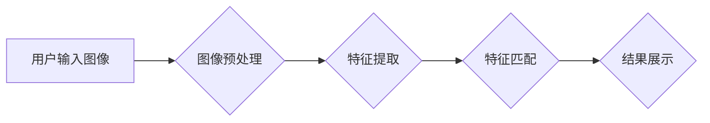

> 图像搜索，电商，计算机视觉，深度学习，卷积神经网络，目标检测，推荐系统

## 1. 背景介绍

随着互联网的快速发展和移动互联网的普及，电商行业呈现出蓬勃发展的态势。消费者购物方式也发生了巨大变化，越来越倾向于通过手机等移动设备进行在线购物。然而，传统的文本搜索方式在电商领域存在一些局限性，例如：

* **用户搜索习惯多样化:** 消费者在搜索商品时，往往会使用多种方式，例如文字描述、图片、语音等。
* **商品信息描述不完整:** 部分商品信息描述可能不完整或缺乏细节，难以满足用户的搜索需求。
* **用户搜索意图难以理解:**  传统的文本搜索引擎难以准确理解用户的搜索意图，导致搜索结果不精准。

为了解决这些问题，图像搜索技术逐渐成为电商领域的重要应用方向。图像搜索技术能够识别和理解图像中的内容，并根据用户的搜索需求返回相关商品信息，从而提升用户购物体验。

## 2. 核心概念与联系

图像搜索技术的核心是利用计算机视觉和深度学习技术，将图像转换为可理解的数字特征，并通过这些特征进行检索和匹配。

**2.1 核心概念**

* **图像特征提取:**  将图像转换为可供计算机理解的数字特征，例如颜色、纹理、形状等。
* **图像检索:** 根据用户提供的图像或图像特征，从数据库中检索出相关图像。
* **图像识别:**  识别图像中包含的物体、场景或文本信息。

**2.2 架构图**



## 3. 核心算法原理 & 具体操作步骤

### 3.1  算法原理概述

图像搜索算法的核心是利用深度学习技术，特别是卷积神经网络（CNN），来提取图像特征。CNN能够自动学习图像中的特征，并将其转换为可用于检索和匹配的数字向量。

### 3.2  算法步骤详解

1. **图像预处理:** 对输入图像进行预处理，例如调整大小、归一化等，以提高算法的性能。
2. **特征提取:** 使用预训练的CNN模型提取图像特征，例如 ResNet、VGG 等。
3. **特征匹配:** 使用距离度量方法，例如欧氏距离、余弦相似度等，比较用户输入图像的特征向量与数据库中图像特征向量的相似度。
4. **结果排序:** 根据相似度排序检索结果，并将排序后的结果展示给用户。

### 3.3  算法优缺点

**优点:**

* **准确率高:** 深度学习技术能够自动学习图像特征，提高图像搜索的准确率。
* **鲁棒性强:**  CNN模型对图像的旋转、缩放、光照等变化具有较强的鲁棒性。
* **可扩展性强:**  CNN模型可以处理大规模图像数据集。

**缺点:**

* **计算量大:**  训练和使用CNN模型需要大量的计算资源。
* **数据依赖性强:**  CNN模型的性能取决于训练数据的质量和数量。
* **解释性差:**  CNN模型的决策过程难以解释。

### 3.4  算法应用领域

图像搜索算法广泛应用于电商、搜索引擎、医疗、安防等领域。

## 4. 数学模型和公式 & 详细讲解 & 举例说明

### 4.1  数学模型构建

图像搜索算法的核心是利用数学模型来衡量图像之间的相似度。常用的相似度度量方法包括：

* **欧氏距离:**  计算两个图像特征向量之间的欧氏距离。

$$
d(x, y) = \sqrt{\sum_{i=1}^{n}(x_i - y_i)^2}
$$

* **余弦相似度:**  计算两个图像特征向量之间的余弦相似度。

$$
sim(x, y) = \frac{x \cdot y}{||x|| ||y||}
$$

其中，$x$ 和 $y$ 是两个图像特征向量，$n$ 是特征向量的维度，$x \cdot y$ 是两个向量之间的点积，$||x||$ 和 $||y||$ 是两个向量的模长。

### 4.2  公式推导过程

欧氏距离和余弦相似度的公式推导过程相对简单，可以参考相关数学教材。

### 4.3  案例分析与讲解

假设有两个图像特征向量，$x = [1, 2, 3]$ 和 $y = [4, 5, 6]$。

* **欧氏距离:**

$$
d(x, y) = \sqrt{(1-4)^2 + (2-5)^2 + (3-6)^2} = \sqrt{9 + 9 + 9} = 3\sqrt{3}
$$

* **余弦相似度:**

$$
sim(x, y) = \frac{1\cdot4 + 2\cdot5 + 3\cdot6}{\sqrt{1^2 + 2^2 + 3^2}\sqrt{4^2 + 5^2 + 6^2}} = \frac{4 + 10 + 18}{\sqrt{14}\sqrt{77}} = \frac{32}{\sqrt{1078}}
$$

## 5. 项目实践：代码实例和详细解释说明

### 5.1  开发环境搭建

* Python 3.x
* TensorFlow 或 PyTorch 深度学习框架
* OpenCV 图像处理库

### 5.2  源代码详细实现

```python
import tensorflow as tf
from tensorflow.keras.applications import ResNet50
from tensorflow.keras.preprocessing import image
from tensorflow.keras.applications.resnet50 import preprocess_input, decode_predictions

# 加载预训练的 ResNet50 模型
model = ResNet50(weights='imagenet')

# 预处理图像
img_path = 'image.jpg'
img = image.load_img(img_path, target_size=(224, 224))
x = image.img_to_array(img)
x = np.expand_dims(x, axis=0)
x = preprocess_input(x)

# 获取图像特征
features = model.predict(x)

# 将特征向量转换为可用于检索的格式
feature_vector = features.flatten()

# ... (后续代码用于图像检索和结果展示)
```

### 5.3  代码解读与分析

* 代码首先加载预训练的 ResNet50 模型，该模型已经训练好了图像特征提取能力。
* 然后，代码对输入图像进行预处理，包括调整大小、归一化等操作。
* 使用预处理后的图像作为输入，模型会输出图像特征向量。
* 最后，代码将特征向量转换为可用于检索的格式，并进行后续的图像检索和结果展示。

### 5.4  运行结果展示

运行代码后，将输出图像的特征向量，可以将其与数据库中的图像特征向量进行比较，并返回与输入图像最相似的图像。

## 6. 实际应用场景

### 6.1  电商商品搜索

* 用户可以通过上传图片搜索类似商品。
* 提升用户购物体验，提高商品发现率。

### 6.2  视觉推荐

* 根据用户的浏览历史或购买记录，推荐与用户兴趣相关的商品。
* 提供个性化商品推荐，提升用户转化率。

### 6.3  商品比价

* 用户可以通过上传图片比较不同电商平台的商品价格。
* 帮助用户找到最优惠的商品。

### 6.4  未来应用展望

* **多模态搜索:**  结合文本、语音、视频等多模态信息进行搜索，提升搜索结果的准确性和丰富度。
* **个性化搜索:**  根据用户的兴趣、偏好、购买历史等信息，提供个性化的搜索结果。
* **增强现实 (AR) 应用:**  将图像搜索与 AR 技术结合，实现虚拟试衣、家居摆设等应用。

## 7. 工具和资源推荐

### 7.1  学习资源推荐

* **书籍:**
    * 《深度学习》
    * 《计算机视觉:算法与应用》
* **在线课程:**
    * Coursera: 深度学习
    * Udacity: 计算机视觉

### 7.2  开发工具推荐

* **TensorFlow:**  开源深度学习框架
* **PyTorch:**  开源深度学习框架
* **OpenCV:**  开源图像处理库

### 7.3  相关论文推荐

* **ImageNet Classification with Deep Convolutional Neural Networks**
* **Deep Residual Learning for Image Recognition**
* **Faster R-CNN: Towards Real-Time Object Detection with Region Proposal Networks**

## 8. 总结：未来发展趋势与挑战

### 8.1  研究成果总结

图像搜索技术在电商领域取得了显著的进展，能够有效提升用户购物体验和商品发现率。深度学习技术为图像搜索算法的准确性和鲁棒性提供了强有力的支撑。

### 8.2  未来发展趋势

* **多模态搜索:**  结合文本、语音、视频等多模态信息进行搜索，提升搜索结果的准确性和丰富度。
* **个性化搜索:**  根据用户的兴趣、偏好、购买历史等信息，提供个性化的搜索结果。
* **增强现实 (AR) 应用:**  将图像搜索与 AR 技术结合，实现虚拟试衣、家居摆设等应用。

### 8.3  面临的挑战

* **数据标注:**  深度学习模型需要大量的标注数据进行训练，数据标注成本较高。
* **模型解释性:**  深度学习模型的决策过程难以解释，难以理解模型的决策依据。
* **计算资源:**  训练和使用深度学习模型需要大量的计算资源，成本较高。

### 8.4  研究展望

未来，图像搜索技术将继续朝着更准确、更智能、更个性化的方向发展。研究者将继续探索新的算法和技术，以解决图像搜索面临的挑战，并将其应用于更多领域。

## 9. 附录：常见问题与解答

* **Q: 图像搜索算法的准确率如何？**

* **A:** 图像搜索算法的准确率取决于多种因素，例如训练数据的质量、模型的复杂度、特征提取方法等。一般来说，深度学习技术能够显著提高图像搜索的准确率。

* **Q: 图像搜索算法的计算量大吗？**

* **A:**  是的，训练和使用深度学习模型需要大量的计算资源。

* **Q: 图像搜索算法的应用场景有哪些？**

* **A:**  图像搜索算法广泛应用于电商、搜索引擎、医疗、安防等领域。


作者：禅与计算机程序设计艺术 / Zen and the Art of Computer Programming 
<end_of_turn>