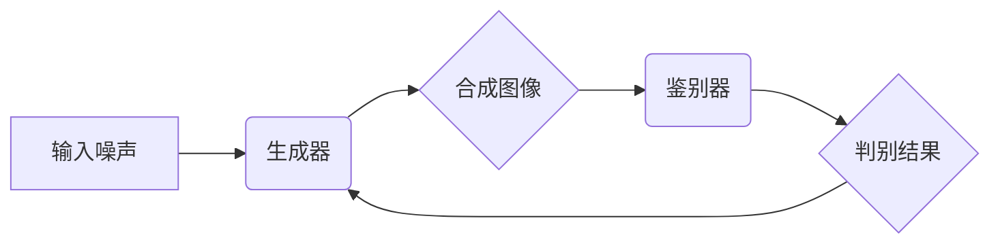
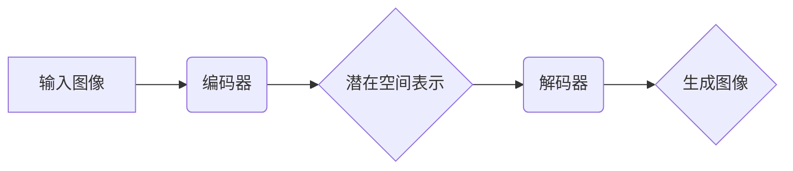

> 图像生成模型，深度学习，生成对抗网络(GAN)，变分自编码器(VAE)，Transformer，图像合成，艺术创作

## 1. 背景介绍

在人工智能领域，图像生成模型近年来取得了令人瞩目的进展，展现出强大的创造力和应用潜力。这些模型能够从文本描述、噪声数据或其他图像中生成逼真的图像，为艺术创作、设计、娱乐等领域带来了革命性的变革。

传统的图像生成方法主要依赖于规则和模板，缺乏灵活性。而深度学习技术的兴起，特别是卷积神经网络(CNN)和生成对抗网络(GAN)的出现，为图像生成领域带来了新的突破。深度学习模型能够从海量图像数据中学习图像的特征和结构，并生成具有相似特征的新图像。

## 2. 核心概念与联系

### 2.1 生成对抗网络 (GAN)

GAN由两个相互竞争的神经网络组成：生成器(Generator)和鉴别器(Discriminator)。生成器试图生成逼真的图像，而鉴别器则试图区分真实图像和生成图像。两者在不断对抗中相互学习，最终生成器能够生成与真实图像几乎 indistinguishable 的图像。

**Mermaid 流程图:**



### 2.2 变分自编码器 (VAE)

VAE是一种基于概率的生成模型，它将输入图像编码成一个低维的潜在空间表示，然后从这个潜在空间中解码生成新的图像。VAE通过最大化潜在空间表示的概率分布来训练模型，从而生成更符合数据分布的图像。

**Mermaid 流程图:**



## 3. 核心算法原理 & 具体操作步骤

### 3.1 算法原理概述

GAN和VAE都是基于深度学习的图像生成模型，它们利用神经网络学习图像的特征和结构，并生成新的图像。GAN通过对抗训练的方式，生成器和鉴别器相互竞争，最终生成逼真的图像。VAE通过概率编码和解码的方式，将图像映射到潜在空间，并从潜在空间中生成新的图像。

### 3.2 算法步骤详解

**GAN:**

1. 初始化生成器和鉴别器网络。
2. 从噪声数据中采样，生成器生成图像。
3. 鉴别器对真实图像和生成图像进行判别。
4. 根据鉴别器的判别结果，更新生成器和鉴别器的权重。
5. 重复步骤2-4，直到生成器能够生成逼真的图像。

**VAE:**

1. 初始化编码器和解码器网络。
2. 将输入图像输入编码器，得到潜在空间表示。
3. 从潜在空间中采样，输入解码器生成图像。
4. 计算重建图像与真实图像之间的损失函数。
5. 根据损失函数更新编码器和解码器的权重。
6. 重复步骤2-5，直到重建图像与真实图像的差异最小。

### 3.3 算法优缺点

**GAN:**

* **优点:** 可以生成高质量、逼真的图像。
* **缺点:** 训练过程不稳定，容易出现模式崩溃等问题。

**VAE:**

* **优点:** 训练过程相对稳定，能够生成符合数据分布的图像。
* **缺点:** 生成的图像质量可能不如GAN。

### 3.4 算法应用领域

图像生成模型在各个领域都有广泛的应用，例如：

* **艺术创作:** 生成新的艺术作品，例如绘画、雕塑、音乐等。
* **设计:** 生成产品设计、建筑设计、服装设计等。
* **娱乐:** 生成游戏场景、电影特效、动画等。
* **医疗:** 生成医学图像、辅助诊断等。

## 4. 数学模型和公式 & 详细讲解 & 举例说明

### 4.1 数学模型构建

GAN的数学模型主要包括生成器G和鉴别器D的损失函数。

* **生成器损失函数:**

$$
L_G = -E_{z \sim p_z(z)}[log(D(G(z)))]
$$

其中，$z$是噪声数据，$p_z(z)$是噪声数据的分布，$D(G(z))$是鉴别器对生成图像的判别结果。

* **鉴别器损失函数:**

$$
L_D = -E_{x \sim p_{data}(x)}[log(D(x))] - E_{z \sim p_z(z)}[log(1 - D(G(z)))]
$$

其中，$x$是真实图像，$p_{data}(x)$是真实图像的分布。

### 4.2 公式推导过程

生成器损失函数的目标是最大化鉴别器对生成图像的判别结果，即让鉴别器认为生成图像是真实图像。鉴别器损失函数的目标是区分真实图像和生成图像，即让鉴别器能够准确地判别图像的真实性。

### 4.3 案例分析与讲解

在实践中，GAN模型的训练过程需要不断调整生成器和鉴别器的参数，以达到最佳的生成效果。例如，可以采用不同的优化算法、学习率、批处理大小等参数来调整训练过程。

## 5. 项目实践：代码实例和详细解释说明

### 5.1 开发环境搭建

为了实现图像生成模型，需要搭建相应的开发环境。常用的开发环境包括：

* **操作系统:** Linux、macOS、Windows
* **编程语言:** Python
* **深度学习框架:** TensorFlow、PyTorch
* **GPU:** 加速训练过程

### 5.2 源代码详细实现

以下是一个使用PyTorch实现GAN图像生成模型的简单代码示例：

```python
import torch
import torch.nn as nn

# 定义生成器网络
class Generator(nn.Module):
    def __init__(self):
        super(Generator, self).__init__()
        # ...

    def forward(self, z):
        # ...

# 定义鉴别器网络
class Discriminator(nn.Module):
    def __init__(self):
        super(Discriminator, self).__init__()
        # ...

    def forward(self, x):
        # ...

# 实例化生成器和鉴别器
generator = Generator()
discriminator = Discriminator()

# 定义损失函数和优化器
criterion = nn.BCELoss()
optimizer_G = torch.optim.Adam(generator.parameters(), lr=0.0002, betas=(0.5, 0.999))
optimizer_D = torch.optim.Adam(discriminator.parameters(), lr=0.0002, betas=(0.5, 0.999))

# 训练循环
for epoch in range(num_epochs):
    for batch_idx, (data, _) in enumerate(train_loader):
        # ...
```

### 5.3 代码解读与分析

这段代码展示了GAN模型的基本结构和训练流程。生成器网络负责生成图像，鉴别器网络负责判别图像的真实性。训练过程通过最小化生成器损失函数和最大化鉴别器损失函数来进行。

### 5.4 运行结果展示

训练完成后，可以利用生成器网络生成新的图像。生成的图像可以保存为文件或显示在屏幕上。

## 6. 实际应用场景

### 6.1 艺术创作

图像生成模型可以帮助艺术家创作新的艺术作品，例如绘画、雕塑、音乐等。艺术家可以利用文本描述或其他图像作为输入，生成具有独特风格和创意的艺术作品。

### 6.2 设计

图像生成模型可以用于产品设计、建筑设计、服装设计等领域。设计师可以利用模型生成不同的设计方案，并根据需要进行修改和调整。

### 6.3 娱乐

图像生成模型可以用于游戏开发、电影特效、动画制作等娱乐领域。例如，可以生成游戏场景、电影角色、动画人物等。

### 6.4 未来应用展望

随着图像生成模型技术的不断发展，其应用场景将更加广泛。例如，可以用于医疗影像分析、自动驾驶、虚拟现实等领域。

## 7. 工具和资源推荐

### 7.1 学习资源推荐

* **书籍:**
    * 《深度学习》
    * 《生成对抗网络》
* **在线课程:**
    * Coursera: 深度学习
    * Udacity: 计算机视觉
* **博客和论坛:**
    * TensorFlow Blog
    * PyTorch Blog
    * Kaggle

### 7.2 开发工具推荐

* **深度学习框架:** TensorFlow、PyTorch
* **图像处理库:** OpenCV、Pillow
* **数据可视化工具:** Matplotlib、Seaborn

### 7.3 相关论文推荐

* 《Generative Adversarial Networks》
* 《Variational Autoencoders for Generation》
* 《StyleGAN2-ADA》

## 8. 总结：未来发展趋势与挑战

### 8.1 研究成果总结

图像生成模型在近年来取得了显著的进展，能够生成逼真的图像，并应用于多个领域。GAN和VAE是两种主要的图像生成模型，各有优缺点。

### 8.2 未来发展趋势

未来图像生成模型的发展趋势包括：

* **更高质量的图像生成:** 研究更强大的生成模型，能够生成更加逼真、细节丰富的图像。
* **更灵活的控制:** 研究能够更好地控制图像生成过程的方法，例如根据文本描述生成特定风格的图像。
* **更广泛的应用场景:** 将图像生成模型应用于更多领域，例如医疗、教育、科学研究等。

### 8.3 面临的挑战

图像生成模型还面临一些挑战，例如：

* **模式崩溃:** GAN模型容易出现模式崩溃问题，生成的图像缺乏多样性。
* **训练难度:** 训练大型图像生成模型需要大量的计算资源和时间。
* **伦理问题:** 图像生成模型可能被用于生成虚假信息，需要考虑其伦理问题。

### 8.4 研究展望

未来研究将继续探索更强大的图像生成模型，并解决现有模型的挑战。同时，也将关注图像生成模型的伦理问题，确保其安全和可控地应用于社会。

## 9. 附录：常见问题与解答

### 9.1 什么是图像生成模型？

图像生成模型是一种能够从噪声数据或其他图像中生成新图像的机器学习模型。

### 9.2 GAN和VAE的区别是什么？

GAN是一种生成对抗网络，通过两个相互竞争的神经网络来生成图像。VAE是一种变分自编码器，通过概率编码和解码的方式来生成图像。

### 9.3 如何训练图像生成模型？

训练图像生成模型需要大量的图像数据和计算资源。常用的训练方法包括对抗训练和变分贝叶斯训练。

### 9.4 图像生成模型有哪些应用场景？

图像生成模型应用于多个领域，例如艺术创作、设计、娱乐、医疗等。

### 9.5 图像生成模型有哪些伦理问题？

图像生成模型可能被用于生成虚假信息，需要考虑其伦理问题，例如如何防止其被用于恶意目的。


作者：禅与计算机程序设计艺术 / Zen and the Art of Computer Programming 
<end_of_turn>