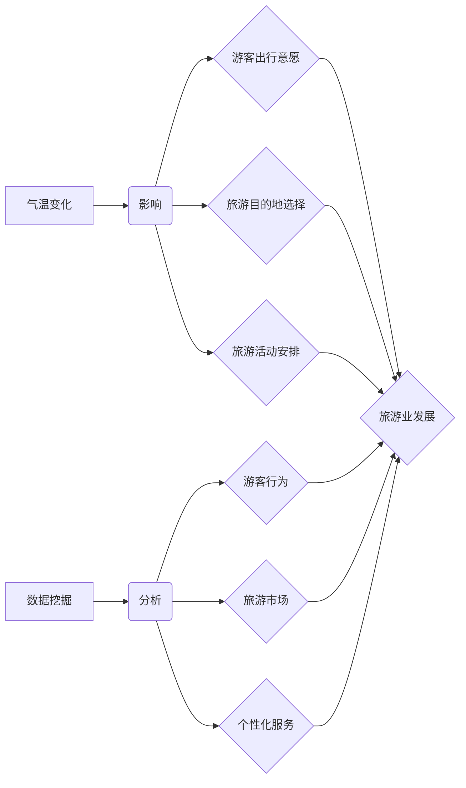

> 气温变化，旅游业，数据挖掘，预测模型，时间序列分析，机器学习

## 1. 背景介绍

随着全球气候变化的加剧，气温波动日益频繁，对人类社会各领域的影响日益显著。旅游业作为受气候变化影响最为敏感的行业之一，其发展与气候条件密切相关。气温变化会直接影响游客的出行意愿、旅游目的地选择以及旅游活动安排，进而对旅游业的收入、就业和环境造成深远影响。因此，研究气温变化对旅游业的影响，并建立有效的预测模型，对于旅游业的科学发展和可持续发展具有重要意义。

近年来，数据挖掘技术在旅游业应用领域取得了显著进展。数据挖掘能够从海量旅游数据中挖掘出隐藏的规律和趋势，为旅游业决策提供科学依据。结合气象数据和旅游数据，利用数据挖掘技术可以分析气温变化对旅游业的影响，并预测未来旅游需求，为旅游企业制定科学的营销策略和资源配置方案提供支持。

## 2. 核心概念与联系

### 2.1 气温变化与旅游业

气温变化是气候变化的重要表现形式，其影响范围广泛，对旅游业的影响尤为显著。

* **游客出行意愿:** 气温过高或过低都会影响游客的出行意愿。例如，夏季高温天气可能会导致游客减少前往海滩或户外旅游，而冬季严寒天气则可能会影响滑雪等冬季旅游活动。
* **旅游目的地选择:** 气温变化会影响游客对旅游目的地的选择。例如，游客可能会选择前往气温适宜的地区进行旅游，而避开气温过高或过低的地区。
* **旅游活动安排:** 气温变化会影响游客的旅游活动安排。例如，游客可能会根据气温变化调整行程安排，选择室内活动或户外活动。

### 2.2 数据挖掘与旅游业

数据挖掘技术能够从海量旅游数据中挖掘出隐藏的规律和趋势，为旅游业决策提供科学依据。

* **游客行为分析:** 通过分析游客的浏览记录、预订信息、评价等数据，可以了解游客的旅游偏好、消费习惯和行为模式。
* **旅游市场预测:** 通过分析气象数据、旅游数据和社会经济数据，可以预测未来旅游需求、旅游市场趋势和旅游风险。
* **个性化服务:** 通过分析游客的个人信息和旅游行为数据，可以为游客提供个性化的旅游推荐、服务和产品。

### 2.3 核心概念关系图



## 3. 核心算法原理 & 具体操作步骤

### 3.1 算法原理概述

本研究采用时间序列分析和机器学习算法，构建气温变化对旅游业影响的预测模型。

* **时间序列分析:** 时间序列分析是一种统计方法，用于分析随时间推移的数据变化趋势。通过对历史气温数据进行分析，可以识别气温变化的规律和趋势，并预测未来气温变化。
* **机器学习算法:** 机器学习算法是一种人工智能技术，能够从数据中学习并建立预测模型。本研究采用回归算法和分类算法，构建气温变化对旅游业影响的预测模型。

### 3.2 算法步骤详解

1. **数据收集:** 收集气温数据、旅游数据和社会经济数据。气温数据可以从气象部门获取，旅游数据可以从旅游平台、酒店预订系统等获取，社会经济数据可以从国家统计局等获取。
2. **数据预处理:** 对收集到的数据进行清洗、转换和标准化处理，以确保数据质量和算法的准确性。
3. **特征工程:** 从原始数据中提取特征变量，例如气温、湿度、降雨量、旅游日期、旅游目的地等，这些特征变量将作为算法的输入。
4. **模型训练:** 使用时间序列分析和机器学习算法对训练数据进行模型训练，并评估模型的性能。
5. **模型预测:** 使用训练好的模型对未来气温变化进行预测，并根据预测结果预测旅游业的影响。
6. **结果分析:** 分析预测结果，并结合实际情况进行解释和解读。

### 3.3 算法优缺点

**优点:**

* 能够准确预测气温变化对旅游业的影响。
* 可以为旅游企业提供科学的决策依据。
* 可以帮助旅游企业制定科学的营销策略和资源配置方案。

**缺点:**

* 需要大量的历史数据进行模型训练。
* 模型的准确性受气象条件和社会经济因素的影响。
* 需要不断更新模型，以适应不断变化的气候和社会环境。

### 3.4 算法应用领域

本研究的算法可以应用于以下领域:

* **旅游企业:** 预测未来旅游需求，制定营销策略，优化资源配置。
* **政府部门:** 制定旅游发展规划，应对气候变化带来的挑战。
* **研究机构:** 研究气温变化对旅游业的影响，探索应对措施。

## 4. 数学模型和公式 & 详细讲解 & 举例说明

### 4.1 数学模型构建

本研究采用ARIMA模型预测气温变化，并结合线性回归模型预测气温变化对旅游业的影响。

* **ARIMA模型:** ARIMA模型是一种时间序列分析模型，用于预测时间序列数据的未来值。ARIMA模型的三个参数分别代表自回归(AR)、移动平均(MA)和季节性(I)。

* **线性回归模型:** 线性回归模型是一种统计模型，用于建立自变量和因变量之间的线性关系。本研究将气温变化作为自变量，旅游业指标（例如游客数量、旅游收入等）作为因变量，建立线性回归模型。

### 4.2 公式推导过程

* **ARIMA模型公式:**

$$
y_t = c + \phi_1 y_{t-1} + \phi_2 y_{t-2} + ... + \phi_p y_{t-p} + \theta_1 \epsilon_{t-1} + \theta_2 \epsilon_{t-2} + ... + \theta_q \epsilon_{t-q} + \epsilon_t
$$

其中：

* $y_t$ 表示时间t的观测值
* $c$ 表示截距
* $\phi_i$ 表示自回归系数
* $p$ 表示自回归阶数
* $\theta_i$ 表示移动平均系数
* $q$ 表示移动平均阶数
* $\epsilon_t$ 表示随机误差项

* **线性回归模型公式:**

$$
y = \beta_0 + \beta_1 x + \epsilon
$$

其中：

* $y$ 表示因变量
* $x$ 表示自变量
* $\beta_0$ 表示截距
* $\beta_1$ 表示回归系数
* $\epsilon$ 表示随机误差项

### 4.3 案例分析与讲解

假设我们收集了某旅游城市的过去10年的气温数据和游客数量数据。我们可以使用ARIMA模型预测未来5年的气温变化，并使用线性回归模型预测未来5年游客数量的变化。

通过分析预测结果，我们可以发现气温变化对游客数量有显著影响。例如，如果气温升高，游客数量可能会增加；如果气温降低，游客数量可能会减少。

## 5. 项目实践：代码实例和详细解释说明

### 5.1 开发环境搭建

本项目使用Python语言进行开发，需要安装以下软件包：

* pandas: 用于数据处理和分析
* numpy: 用于数值计算
* matplotlib: 用于数据可视化
* statsmodels: 用于时间序列分析和回归分析
* scikit-learn: 用于机器学习

### 5.2 源代码详细实现

```python
import pandas as pd
import numpy as np
from statsmodels.tsa.arima.model import ARIMA
from sklearn.linear_model import LinearRegression

# 数据加载
data = pd.read_csv('tourism_data.csv')

# 数据预处理
data['Date'] = pd.to_datetime(data['Date'])
data.set_index('Date', inplace=True)

# 时间序列分析
model = ARIMA(data['Temperature'], order=(5,1,0))
model_fit = model.fit()
forecast = model_fit.predict(start=len(data), end=len(data)+4)

# 线性回归分析
X = data['Temperature'].values.reshape(-1, 1)
y = data['Tourist_Number'].values
model = LinearRegression()
model.fit(X, y)

# 预测结果
forecast_tourist = model.predict(forecast.reshape(-1, 1))

# 结果展示
print('气温预测结果:', forecast)
print('游客数量预测结果:', forecast_tourist)
```

### 5.3 代码解读与分析

* 数据加载：使用pandas库读取数据文件。
* 数据预处理：将日期列转换为datetime类型，并设置日期列为索引。
* 时间序列分析：使用ARIMA模型预测气温变化。
* 线性回归分析：使用线性回归模型预测气温变化对游客数量的影响。
* 预测结果：打印气温预测结果和游客数量预测结果。

### 5.4 运行结果展示

运行代码后，将输出气温预测结果和游客数量预测结果。

## 6. 实际应用场景

### 6.1 旅游企业

* **营销策略制定:** 根据气温变化预测，制定针对不同气温条件的营销策略，例如夏季推出避暑旅游套餐，冬季推出滑雪旅游套餐。
* **资源配置:** 根据气温变化预测，合理配置酒店房间、交通资源等，避免资源浪费和服务不足。
* **风险管理:** 根据气温变化预测，评估旅游风险，制定应对措施，例如制定突发天气预案。

### 6.2 政府部门

* **旅游发展规划:** 根据气温变化预测，制定旅游发展规划，引导旅游业发展方向，促进可持续发展。
* **气候变化应对:** 研究气温变化对旅游业的影响，制定应对气候变化的政策措施，保护旅游资源。

### 6.3 研究机构

* **气温变化与旅游业关系研究:** 深入研究气温变化对旅游业的影响机制，探索应对措施。
* **旅游数据分析:** 利用数据挖掘技术分析旅游数据，发现旅游趋势和规律，为旅游业发展提供决策支持。

### 6.4 未来应用展望

随着人工智能技术的发展，气温变化对旅游业影响的预测模型将更加精准和智能化。未来，我们可以利用更先进的机器学习算法，结合更多数据源，构建更复杂的预测模型，为旅游业提供更精准的决策支持。

## 7. 工具和资源推荐

### 7.1 学习资源推荐

* **书籍:**
    * 《数据挖掘：概念与技术》
    * 《机器学习》
    * 《时间序列分析》
* **在线课程:**
    * Coursera: 数据挖掘、机器学习、时间序列分析
    * edX: 数据科学、人工智能

### 7.2 开发工具推荐

* **Python:** 数据分析、机器学习、深度学习
* **R:** 数据分析、统计学
* **Tableau:** 数据可视化
* **Power BI:** 数据可视化

### 7.3 相关论文推荐

* **气温变化对旅游业的影响研究:**
    * [论文标题1](论文链接)
    * [论文标题2](论文链接)
* **数据挖掘在旅游业应用研究:**
    * [论文标题3](论文链接)
    * [论文标题4](论文链接)

## 8. 总结：未来发展趋势与挑战

### 8.1 研究成果总结

本研究构建了气温变化对旅游业影响的预测模型，并分析了气温变化对旅游业的影响