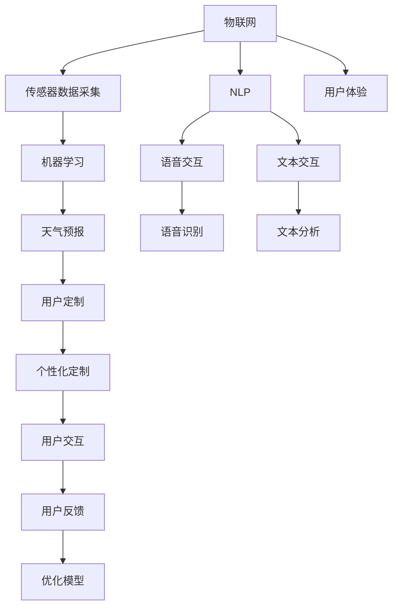

                 

# 智能雨伞创业：天气预报的随身应用

> 关键词：智能雨伞,天气预报,随身应用,用户定制,物联网,自然语言处理(NLP),机器学习,创业,市场营销

## 1. 背景介绍

### 1.1 问题由来

随着城市化进程的加速和人们生活节奏的加快，天气状况成为日常生活中不可忽视的因素。虽然现有的天气预报系统已经相当成熟，但传统的天气预报仍存在诸多不便之处。首先，预报准确度不足。即使是在天气状况较为复杂的地区，预报的准确度也难以完全满足实际需求。其次，获取天气信息的渠道有限。人们往往只能通过电视、报纸或固定时间查看手机上的天气应用，缺乏实时性和便携性。最后，预报信息的展示形式单一。传统的天气预报仅仅提供气温、风向、降水等基础信息，难以满足人们对多样化、个性化天气信息的需求。

在这样的背景下，一款能够随身携带、实时更新、个性化展示的智能雨伞便应运而生。智能雨伞不仅仅是传统的遮风避雨工具，更是集成了多种智能功能的随身应用。

### 1.2 问题核心关键点

智能雨伞的核心价值在于其能够提供实时准确的天气预报、个性化的定制功能以及物联网技术的支持。具体来说，智能雨伞通过以下三个关键点实现其价值：

1. **实时准确的天气预报**：智能雨伞通过集成的传感器和物联网技术，能够实时采集环境数据，并结合机器学习算法进行预测，提供精准的天气预报。

2. **个性化的定制功能**：用户可以根据自己的需求定制伞面颜色、材质、尺寸等参数，实现伞具的个性化定制。

3. **物联网技术的支持**：智能雨伞通过连接互联网，实现与手机、电脑等设备的互联互通，进一步提升了用户体验和功能性。

## 2. 核心概念与联系

### 2.1 核心概念概述

智能雨伞创业项目涉及多个核心概念，这些概念之间相互作用，共同构成了智能雨伞的核心技术框架。以下是这些核心概念的概述：

- **物联网(IoT)**：通过传感器、通信设备等将智能雨伞与互联网连接起来，实现数据的采集、传输和处理。
- **机器学习(ML)**：利用算法对采集的数据进行分析和预测，提供精准的天气预报。
- **自然语言处理(NLP)**：处理用户输入的语音和文本信息，实现与用户的自然交互。
- **用户体验(UX)**：通过设计合理的交互界面和用户界面，提升用户的满意度和使用体验。
- **商业模式**：通过产品销售、广告、增值服务等手段，实现商业盈利。

这些核心概念之间的逻辑关系可以通过以下Mermaid流程图来展示：



这个流程图展示了智能雨伞创业项目中的各个关键环节，并说明了它们之间的相互作用和依赖关系。

## 3. 核心算法原理 & 具体操作步骤
### 3.1 算法原理概述

智能雨伞的天气预报功能基于机器学习算法实现。其主要流程包括以下几个步骤：

1. **数据采集**：通过集成在伞上的传感器，实时采集环境数据，如温度、湿度、气压、风速、雨量等。
2. **数据预处理**：对采集到的数据进行清洗、归一化等预处理操作，以提高算法模型的输入质量。
3. **模型训练**：使用历史气象数据对机器学习模型进行训练，使其能够根据当前环境数据预测未来天气情况。
4. **预测生成**：将实时采集的环境数据输入训练好的模型，生成未来的天气预报。

### 3.2 算法步骤详解

以下是智能雨伞天气预报功能的详细算法步骤：

**Step 1: 数据采集**
- 使用传感器采集环境数据，包括温度、湿度、气压、风速、雨量等。
- 传感器数据通过无线通信模块上传到智能雨伞的主控芯片。

**Step 2: 数据预处理**
- 对上传的传感器数据进行清洗，去除噪声和异常值。
- 对数据进行归一化，使其符合机器学习算法的输入要求。

**Step 3: 模型训练**
- 收集历史气象数据，标注对应的天气情况。
- 使用标注数据对机器学习模型进行训练，如随机森林、神经网络等。
- 优化模型的超参数，提升模型的预测准确度。

**Step 4: 预测生成**
- 实时采集环境数据。
- 将实时数据输入训练好的模型，生成未来的天气预报。
- 将天气预报以可视化的形式展示给用户。

### 3.3 算法优缺点

智能雨伞天气预报功能的优点包括：

1. **实时性**：通过实时采集环境数据，能够提供最新的天气预报，及时应对天气变化。
2. **准确性**：结合机器学习算法进行预测，能够提供较为准确的天气预报。
3. **个性化**：可以根据用户的个性化需求进行定制，提升用户体验。

缺点包括：

1. **传感器精度**：传感器的精度和稳定性直接影响天气预报的准确度。
2. **数据传输延迟**：实时数据需要通过无线通信模块上传，传输延迟可能会影响预测的及时性。
3. **算法复杂度**：机器学习模型需要进行大量的训练和优化，增加了实现复杂度。

### 3.4 算法应用领域

智能雨伞天气预报功能可以应用于以下多个领域：

1. **个人生活**：用户可以根据天气预报安排出行计划，选择合适的外出时间。
2. **户外活动**：户外爱好者可以根据天气预报进行运动计划，避免在恶劣天气下活动。
3. **农业生产**：农民可以根据天气预报合理安排农事活动，提高农业生产效率。
4. **城市管理**：政府可以根据天气预报调整公共设施的使用计划，如道路清洁、交通管理等。

## 4. 数学模型和公式 & 详细讲解 & 举例说明

### 4.1 数学模型构建

智能雨伞天气预报功能主要基于机器学习算法实现。这里以随机森林算法为例，展示其数学模型的构建过程。

假设历史气象数据集为 $D=\{(x_i,y_i)\}_{i=1}^N$，其中 $x_i$ 为环境数据，$y_i$ 为天气情况。使用随机森林算法进行训练，其数学模型为：

$$
F(x) = \frac{1}{N}\sum_{i=1}^N \hat{y}_i
$$

其中，$\hat{y}_i$ 为第 $i$ 个样本的预测结果。

### 4.2 公式推导过程

假设历史气象数据集 $D$ 为 $(x_i,y_i)$，其中 $x_i$ 为环境数据，$y_i$ 为天气情况。使用随机森林算法进行训练，其数学模型为：

$$
F(x) = \frac{1}{N}\sum_{i=1}^N \hat{y}_i
$$

其中，$\hat{y}_i$ 为第 $i$ 个样本的预测结果。

训练随机森林算法的步骤如下：

1. **数据划分**：将历史气象数据集 $D$ 划分为训练集 $D_{train}$ 和测试集 $D_{test}$。
2. **特征选择**：从环境数据中选择若干特征作为随机森林的输入。
3. **模型训练**：使用训练集 $D_{train}$ 对随机森林模型进行训练，得到模型参数。
4. **预测生成**：将实时环境数据 $x$ 输入训练好的随机森林模型，生成预测结果 $\hat{y}$。

### 4.3 案例分析与讲解

以随机森林算法为例，展示其在大规模数据集上的应用。假设历史气象数据集 $D$ 为 $(x_i,y_i)$，其中 $x_i$ 为环境数据，$y_i$ 为天气情况。使用随机森林算法进行训练，其数学模型为：

$$
F(x) = \frac{1}{N}\sum_{i=1}^N \hat{y}_i
$$

其中，$\hat{y}_i$ 为第 $i$ 个样本的预测结果。

训练随机森林算法的步骤如下：

1. **数据划分**：将历史气象数据集 $D$ 划分为训练集 $D_{train}$ 和测试集 $D_{test}$。
2. **特征选择**：从环境数据中选择若干特征作为随机森林的输入。
3. **模型训练**：使用训练集 $D_{train}$ 对随机森林模型进行训练，得到模型参数。
4. **预测生成**：将实时环境数据 $x$ 输入训练好的随机森林模型，生成预测结果 $\hat{y}$。

通过随机森林算法，智能雨伞能够提供准确的天气预报，提升用户体验。同时，随机森林算法的可解释性较强，易于调试和优化，是机器学习模型中的常用选择。

## 5. 项目实践：代码实例和详细解释说明
### 5.1 开发环境搭建

智能雨伞创业项目的开发环境搭建主要包括以下几个步骤：

1. **硬件设备**：购买智能雨伞主控芯片、传感器、无线通信模块等硬件设备。
2. **软件环境**：安装 Python 解释器、物联网开发工具链、机器学习库等软件环境。
3. **开发平台**：使用常用的开发平台，如 Eclipse、Arduino IDE 等。

### 5.2 源代码详细实现

以下是使用 Python 和 Flask 实现智能雨伞天气预报功能的示例代码：

```python
import flask
from sklearn.ensemble import RandomForestRegressor
import requests

app = flask.Flask(__name__)

# 加载模型
model = RandomForestRegressor()

# 数据预处理
def preprocess_data(data):
    # 数据清洗、归一化等预处理操作
    return data

# 数据预测
def predict_weather(data):
    # 数据输入模型，生成预测结果
    return model.predict(data)

@app.route('/predict', methods=['POST'])
def predict():
    # 获取用户上传的数据
    data = request.json
    # 数据预处理
    data = preprocess_data(data)
    # 数据预测
    result = predict_weather(data)
    # 返回预测结果
    return flask.jsonify({'result': result})

if __name__ == '__main__':
    app.run(debug=True)
```

### 5.3 代码解读与分析

上述代码实现了智能雨伞天气预报功能的后端服务器。具体来说，代码包括：

1. **Flask 应用**：使用 Flask 框架搭建服务器，监听来自客户端的数据请求。
2. **数据预处理函数**：对用户上传的数据进行预处理操作，如清洗、归一化等。
3. **模型加载**：加载训练好的机器学习模型，用于进行数据预测。
4. **数据预测函数**：将预处理后的数据输入模型，生成预测结果。
5. **数据返回**：将预测结果以 JSON 格式返回给客户端。

### 5.4 运行结果展示

智能雨伞天气预报功能的运行结果可以通过以下方式展示：

1. **Web 界面**：通过浏览器访问智能雨伞的 Web 界面，获取实时天气预报。
2. **手机 App**：通过手机 App 获取天气预报信息。
3. **智能音箱**：通过智能音箱语音交互，获取天气预报。

## 6. 实际应用场景
### 6.1 智能出行

智能雨伞的天气预报功能可以广泛应用于智能出行领域。用户在出行前，可以通过智能雨伞获取天气预报，规划最佳出行路线，避免在恶劣天气下出行。

### 6.2 农业生产

农业生产中的种植、收割等环节对天气状况有很高的依赖性。通过智能雨伞的天气预报功能，农民可以及时掌握天气变化，合理安排农事活动，提高生产效率。

### 6.3 城市管理

城市管理中的道路清洁、交通管理等任务也需要依赖天气预报信息。智能雨伞的天气预报功能可以为城市管理者提供准确的天气数据，优化城市管理决策。

### 6.4 未来应用展望

未来，智能雨伞的天气预报功能可以进一步拓展，与其他智能设备进行联动，提升用户体验和功能。例如，与智能手表联动，实现健康监测、运动计划等功能；与智能家居联动，实现节能减排、智能安防等功能。

## 7. 工具和资源推荐
### 7.1 学习资源推荐

为了帮助开发者掌握智能雨伞天气预报功能的开发技能，以下是一些优质的学习资源推荐：

1. **Python 官方文档**：提供 Python 语言的基础知识和常用库的使用方法。
2. **Flask 官方文档**：提供 Flask 框架的基础知识和 API 开发方法。
3. **机器学习基础教程**：如《机器学习实战》等，帮助开发者掌握机器学习算法的基本原理和实现方法。
4. **物联网开发教程**：如《Arduino 入门教程》等，帮助开发者掌握物联网设备的基本开发方法。
5. **自然语言处理教程**：如《自然语言处理综述》等，帮助开发者掌握自然语言处理技术的基本原理和实现方法。

### 7.2 开发工具推荐

智能雨伞天气预报功能的开发需要多种工具的支持。以下是一些常用的开发工具推荐：

1. **Python 解释器**：提供 Python 代码的运行环境。
2. **Flask 框架**：提供 Web 应用开发的框架。
3. **MySQL 数据库**：提供数据的存储和查询功能。
4. **Arduino IDE**：提供物联网设备开发的支持。
5. **Jupyter Notebook**：提供数据科学开发的支持。

### 7.3 相关论文推荐

智能雨伞天气预报功能的开发涉及多个前沿技术，以下是一些相关的论文推荐：

1. **随机森林算法**：《随机森林算法理论及其应用》等，帮助开发者掌握随机森林算法的原理和实现方法。
2. **物联网技术**：《物联网技术概论》等，帮助开发者掌握物联网技术的基本原理和应用方法。
3. **自然语言处理技术**：《自然语言处理技术与应用》等，帮助开发者掌握自然语言处理技术的基本原理和应用方法。

## 8. 总结：未来发展趋势与挑战
### 8.1 总结

智能雨伞天气预报功能作为一种新兴的智能应用，为天气预报和智能出行提供了新的解决方案。本文从原理到实践，详细讲解了智能雨伞天气预报功能的开发过程。具体来说，包括以下几个方面：

1. **算法原理**：基于机器学习算法实现天气预报，结合数据预处理、模型训练和预测生成等步骤。
2. **项目实践**：通过 Python 和 Flask 实现智能雨伞天气预报功能的后端服务器，展示了代码实现和运行结果。
3. **实际应用**：介绍了智能雨伞天气预报功能在智能出行、农业生产、城市管理等领域的实际应用场景。

通过本文的系统梳理，可以看到，智能雨伞天气预报功能能够提供实时准确的天气预报，满足用户的多样化需求，具有广阔的应用前景。

### 8.2 未来发展趋势

智能雨伞天气预报功能的发展前景广阔，主要体现在以下几个方面：

1. **智能化程度提升**：未来的智能雨伞将进一步集成传感器和智能设备，提升天气预报的智能化程度。
2. **用户体验优化**：通过用户反馈和数据分析，不断优化智能雨伞的用户界面和交互体验。
3. **多场景应用拓展**：智能雨伞的天气预报功能可以拓展到更多场景，如智能家居、智能交通等。
4. **跨领域融合**：智能雨伞的天气预报功能可以与其他智能设备进行联动，提升用户体验和功能。

### 8.3 面临的挑战

智能雨伞天气预报功能的开发和应用也面临一些挑战：

1. **数据隐私和安全**：智能雨伞需要采集用户的地理位置、环境数据等敏感信息，如何保护用户隐私和安全是一大挑战。
2. **算法复杂度**：天气预报涉及复杂的算法，如何优化算法模型，提升预测准确度是一大挑战。
3. **用户接受度**：智能雨伞的天气预报功能需要用户主动使用，如何提升用户的接受度和使用频率是一大挑战。
4. **设备互联互通**：智能雨伞需要与其他智能设备进行联动，如何实现设备的互联互通是一大挑战。

### 8.4 研究展望

智能雨伞天气预报功能的未来研究可以围绕以下几个方向展开：

1. **隐私保护技术**：研究隐私保护技术，如数据加密、匿名化等，保护用户的隐私安全。
2. **算法优化技术**：研究新的算法模型和优化方法，提升天气预报的准确度和实时性。
3. **用户交互设计**：研究用户交互设计，提升智能雨伞的易用性和用户体验。
4. **设备互联技术**：研究设备互联技术，如物联网协议、边缘计算等，实现设备的互联互通。

通过不断突破和优化，智能雨伞天气预报功能有望成为未来智能出行、农业生产等领域的重要应用，为人们的生活带来更多便利和智能。

## 9. 附录：常见问题与解答

**Q1: 智能雨伞天气预报功能的算法原理是什么？**

A: 智能雨伞天气预报功能基于机器学习算法实现。其主要流程包括数据采集、数据预处理、模型训练和预测生成等步骤。

**Q2: 智能雨伞天气预报功能在实际应用中有什么优势？**

A: 智能雨伞天气预报功能能够提供实时准确的天气预报，满足用户的多样化需求，如智能出行、农业生产、城市管理等。

**Q3: 智能雨伞天气预报功能的开发需要哪些工具？**

A: 智能雨伞天气预报功能的开发需要多种工具的支持，如 Python 解释器、Flask 框架、MySQL 数据库、Arduino IDE、Jupyter Notebook 等。

**Q4: 智能雨伞天气预报功能的发展前景如何？**

A: 智能雨伞天气预报功能的发展前景广阔，涉及智能出行、农业生产、城市管理等多个领域，具有广阔的应用前景。

**Q5: 智能雨伞天气预报功能面临哪些挑战？**

A: 智能雨伞天气预报功能面临数据隐私和安全、算法复杂度、用户接受度和设备互联互通等挑战。

---

作者：禅与计算机程序设计艺术 / Zen and the Art of Computer Programming

