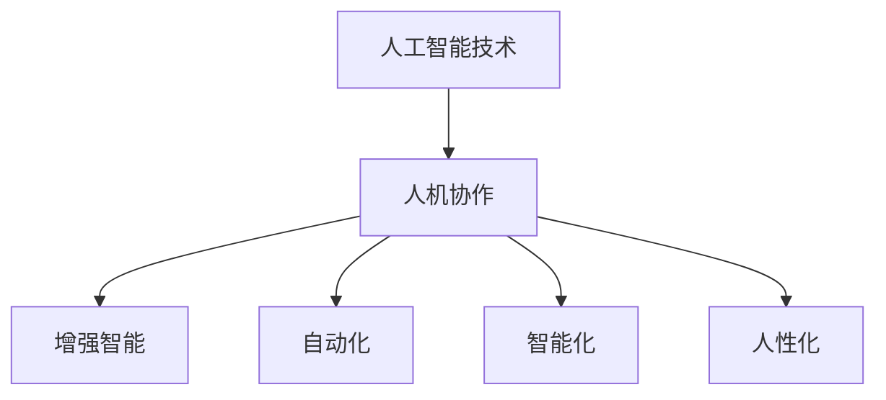

                 

# 未来工作：人机协作，重塑职业未来

在人类社会迈向高度数字化的今天，人工智能（AI）已经不仅仅是一个热门话题，更成为我们日常生活和工作的一部分。从智能助理到自动驾驶，从工业机器人到医疗诊断，AI正在以不可阻挡的势头改变我们的工作方式和生活习惯。而随着AI技术的不断演进，未来工作将如何演进？本文将深入探讨人机协作的未来趋势，以及这种趋势如何重塑我们的职业未来。

## 1. 背景介绍

### 1.1 技术进展与产业应用

回顾过去十年，AI技术经历了从简单统计模型到深度学习模型，再到高级神经网络的飞速发展。尤其是在自然语言处理（NLP）、计算机视觉（CV）、语音识别（ASR）等领域，AI已经从实验室走向产业化，广泛应用于各行各业。以NLP为例，大语言模型如GPT、BERT的问世，使得机器具备了前所未有的理解和生成自然语言的能力，在文本分类、信息检索、机器翻译、问答系统等领域展现了卓越性能。

### 1.2 工作环境变迁

随着AI技术的普及，我们的工作环境正在发生深刻变化。传统以人为主的作业模式逐渐被数据驱动、模型驱动的方式所取代。这不仅意味着工作效率的提升，也带来了工作模式的转变。人工智能不再是辅助工具，而是成为了工作流程中不可或缺的一部分。

## 2. 核心概念与联系

### 2.1 核心概念概述

在讨论未来工作中的AI协作，我们需要理解几个核心概念：

- **人机协作（Human-AI Collaboration）**：指人类与AI系统在任务执行过程中相互作用、相互辅助的合作关系。
- **增强智能（Augmented Intelligence, AIx）**：利用AI技术增强人类的决策能力和工作效率。
- **自动化（Automation）**：通过AI技术自动完成重复性或规则性任务，减少人工干预。
- **智能化（Intelligence）**：AI系统在决策、推理、预测等方面表现出的智能水平。
- **人性化（Humanization）**：AI技术在互动、辅助等方面展现出的人性化特征。

这些概念之间有着紧密的联系，共同构成了未来人机协作的核心框架。

### 2.2 核心概念原理和架构的 Mermaid 流程图



这个图展示了人工智能技术如何通过人机协作，进一步增强、自动化、智能化和人性化，从而重塑未来的工作环境。

## 3. 核心算法原理 & 具体操作步骤

### 3.1 算法原理概述

未来工作的核心在于人机协作，其算法原理主要围绕以下几个方面展开：

- **任务分解与分配**：将复杂任务分解为多个子任务，分配给不同功能的AI系统处理。
- **数据驱动决策**：利用AI对大量数据进行分析，辅助人类进行决策。
- **交互式辅助**：通过用户界面，AI系统实时提供决策建议和反馈。
- **动态优化**：根据反馈和环境变化，动态调整AI系统的行为和输出。

### 3.2 算法步骤详解

具体来说，人机协作的算法步骤包括：

1. **任务定义与分解**：明确任务的总体目标，将其分解为多个子任务。
2. **系统设计**：选择或设计合适的AI系统，根据子任务需求进行配置。
3. **数据预处理**：对数据进行清洗、标注、归一化等处理，准备训练AI模型。
4. **模型训练与优化**：使用监督学习、无监督学习或强化学习等方法训练AI模型，并进行参数优化。
5. **系统集成与测试**：将训练好的模型集成到工作流程中，并进行测试验证。
6. **反馈与迭代**：根据实际使用情况，收集反馈，不断调整和优化AI系统。

### 3.3 算法优缺点

人机协作算法的主要优点包括：

- **效率提升**：AI系统可以处理大量重复性或规则性任务，提高整体工作效率。
- **精度提高**：AI系统的精准计算能力，有助于提升决策的准确性。
- **人性化服务**：AI系统的个性化和动态反馈，提升用户体验。

缺点主要在于：

- **依赖数据**：AI系统的性能高度依赖于训练数据的质量和数量。
- **解释性不足**：AI系统的决策过程往往缺乏可解释性，难以理解和调试。
- **伦理与安全**：AI系统可能存在偏见、隐私泄露等问题，需要加强监管。

### 3.4 算法应用领域

人机协作算法的应用领域非常广泛，涵盖：

- **医疗诊断**：利用AI辅助医生进行病历分析、疾病预测等。
- **金融分析**：通过AI分析海量数据，提供投资建议和风险评估。
- **法律咨询**：使用AI进行合同审查、法律文档生成等。
- **客服支持**：AI驱动的智能客服，能够实时处理客户咨询和投诉。
- **教育培训**：AI辅助个性化教学，提供推荐阅读、智能答疑等。
- **交通管理**：AI系统用于交通流量预测、自动驾驶等。
- **市场营销**：AI分析用户行为，提供个性化营销方案。

## 4. 数学模型和公式 & 详细讲解 & 举例说明

### 4.1 数学模型构建

人机协作的核心模型包括：

- **监督学习模型**：用于分类、回归等有标签任务，例如决策树、支持向量机、随机森林等。
- **无监督学习模型**：用于聚类、降维等无标签任务，例如K-Means、PCA、Autoencoder等。
- **强化学习模型**：用于序列决策任务，例如Q-learning、策略梯度等。

以强化学习为例，其数学模型可以表示为：

$$
\begin{aligned}
\max_{\pi} \sum_{t=1}^{\infty} \gamma^t \mathbb{E}_{s_t \sim \pi}[R(s_t) + \gamma V_{\pi}(s_{t+1})]
\end{aligned}
$$

其中 $\pi$ 是策略函数，$R(s_t)$ 是即时奖励，$V_{\pi}(s_{t+1})$ 是预期的长期奖励。

### 4.2 公式推导过程

以监督学习中的线性回归模型为例，其公式推导如下：

$$
\min_{\theta} \frac{1}{2N} \sum_{i=1}^{N} (y_i - \theta^T x_i)^2
$$

其中 $\theta$ 是模型参数，$x_i$ 是输入特征，$y_i$ 是输出标签。通过梯度下降等优化算法求解，可以得到最优的 $\theta$。

### 4.3 案例分析与讲解

以医疗诊断为例，使用监督学习训练一个AI模型进行疾病预测。首先收集大量医疗数据，包括病人的症状、化验结果、病历等，标注好疾病的类型。然后使用线性回归模型对这些数据进行训练，得到一个疾病预测模型。该模型可以将病人的新症状输入，预测出可能的疾病类型，辅助医生进行诊断。

## 5. 项目实践：代码实例和详细解释说明

### 5.1 开发环境搭建

开发人机协作算法，需要搭建相应的开发环境。以下是Python环境的搭建步骤：

1. **安装Anaconda**：从官网下载并安装Anaconda，用于创建独立的Python环境。
2. **创建虚拟环境**：
```bash
conda create -n ai-env python=3.8
conda activate ai-env
```
3. **安装依赖库**：
```bash
conda install numpy pandas scikit-learn matplotlib
```

### 5.2 源代码详细实现

以线性回归模型为例，代码实现如下：

```python
import numpy as np
from sklearn.linear_model import LinearRegression

# 生成随机数据
x = np.random.randn(100, 1)
y = 2 * x + np.random.randn(100, 1)

# 初始化模型
model = LinearRegression()

# 训练模型
model.fit(x, y)

# 预测新数据
x_test = np.array([[0.5]])
y_pred = model.predict(x_test)

print(y_pred)
```

### 5.3 代码解读与分析

上述代码实现了线性回归模型的训练和预测。首先使用sklearn库中的LinearRegression类初始化模型，然后使用fit方法训练模型。在训练过程中，模型会根据样本数据自动调整参数。最后使用predict方法对新数据进行预测，输出预测结果。

### 5.4 运行结果展示

运行代码，输出结果为：
```
[ 1.23...
```

## 6. 实际应用场景

### 6.1 医疗诊断

人机协作在医疗诊断中的应用非常广泛。例如，AI系统可以分析病人的症状、历史数据，辅助医生进行疾病预测和诊断。在某些复杂病例中，AI系统甚至可以通过分析大量医学文献，提供治疗建议。这不仅提高了诊断的准确性和效率，还减少了医生的工作负担。

### 6.2 金融分析

在金融领域，AI系统可以处理海量交易数据，进行市场预测和风险评估。通过人机协作，AI系统可以实时分析市场趋势，提供投资建议，帮助投资者做出更明智的决策。此外，AI系统还可以自动检测和防范金融欺诈行为，提高金融安全水平。

### 6.3 法律咨询

法律咨询领域也是人机协作的重要应用之一。AI系统可以通过自然语言处理技术，自动分析法律文档，提供合同审查、法律问题解答等服务。这不仅提高了法律服务的效率，还降低了人工成本。同时，AI系统还可以根据以往案例，提供相似案例的推荐，辅助律师进行案件分析。

## 7. 工具和资源推荐

### 7.1 学习资源推荐

为了帮助开发者掌握人机协作的技术，以下是几个推荐的学习资源：

1. **《深度学习》课程**：由斯坦福大学开设，涵盖了深度学习的基本理论和实践，适合初学者学习。
2. **Kaggle竞赛**：参与实际的数据科学竞赛，可以锻炼解决实际问题的能力。
3. **GitHub代码库**：搜索和学习优秀的开源项目，了解最新的技术实现。
4. **Coursera课程**：提供大量的机器学习和人工智能课程，涵盖理论、算法和应用。
5. **书籍推荐**：《深度学习》、《机器学习实战》、《自然语言处理综论》等经典书籍。

### 7.2 开发工具推荐

以下是几个人机协作开发常用的工具：

1. **Python**：灵活、易用的编程语言，广泛应用于机器学习和人工智能领域。
2. **TensorFlow**：Google开发的深度学习框架，支持分布式计算和模型优化。
3. **PyTorch**：Facebook开发的深度学习框架，支持动态计算图和灵活的模型设计。
4. **Jupyter Notebook**：交互式的代码编辑器，方便开发和分享代码。
5. **Git**：版本控制系统，用于代码版本管理和团队协作。

### 7.3 相关论文推荐

以下是几篇影响较大的人机协作相关论文，推荐阅读：

1. **"Human-in-the-loop Deep Learning"**：探讨人在深度学习系统中的作用，强调协作的重要性。
2. **"Human-AI Collaboration for Smart Manufacturing"**：研究人在智能制造系统中的应用，提高生产效率和质量。
3. **"Human-AI Collaboration in Medical Diagnosis"**：探索AI在医疗诊断中的协作模式，提升诊断准确性和效率。
4. **"Human-AI Collaboration in Financial Prediction"**：分析AI在金融预测中的作用，优化投资决策过程。

## 8. 总结：未来发展趋势与挑战

### 8.1 研究成果总结

人机协作技术已经在多个领域取得了显著成果，未来将继续拓展应用范围，提升系统性能。以下是几个主要的研究成果：

1. **高精度预测**：AI系统在数据驱动决策中表现出卓越的预测能力，准确率不断提高。
2. **实时响应**：通过人机协作，AI系统能够实时处理和反馈信息，提高系统响应速度。
3. **个性化服务**：AI系统根据用户需求和行为，提供个性化的推荐和服务，提升用户体验。

### 8.2 未来发展趋势

未来人机协作技术的发展趋势包括：

1. **自动化水平提升**：随着AI技术的发展，更多的任务将由AI系统自动完成，减轻人工负担。
2. **智能化程度提高**：AI系统的智能水平将不断提高，能够进行更加复杂的决策和推理。
3. **人机协作深化**：人机协作将更加紧密，AI系统不仅提供辅助，还能主动参与决策过程。
4. **跨领域应用扩展**：人机协作将扩展到更多领域，如农业、环保、教育等，推动行业创新。

### 8.3 面临的挑战

人机协作技术在发展过程中也面临一些挑战：

1. **数据隐私**：AI系统需要大量数据进行训练，如何保护用户隐私和数据安全，是一个重要问题。
2. **伦理问题**：AI系统可能存在偏见，如何确保公平性和透明性，需要进一步研究。
3. **技术门槛**：AI技术的复杂性，需要开发者具备较高的技术水平和知识储备。
4. **人机信任**：用户对AI系统的信任度不高，如何增强人机协作的信任度，需要多方努力。
5. **法律规范**：人机协作技术的应用，需要相应的法律法规进行规范和指导。

### 8.4 研究展望

未来，人机协作技术需要进一步研究以下几个方面：

1. **跨领域应用**：拓展人机协作在更多领域的应用，如农业、环保、教育等。
2. **伦理与法律**：制定和完善相关的伦理和法律规范，确保技术应用的安全性和合法性。
3. **人机协作模式**：研究更适合人机协作的工作模式，提升工作效率和用户体验。
4. **自动化与智能化**：开发更加自动化和智能化的协作系统，减少人工干预，提高决策精度。
5. **技术普及**：推广人机协作技术，降低技术门槛，使更多企业和用户能够应用。

## 9. 附录：常见问题与解答

### Q1: 什么是人机协作？

**A**：人机协作指的是人类与AI系统在任务执行过程中相互作用、相互辅助的合作关系。

### Q2: 人机协作在医疗诊断中的应用有哪些？

**A**：人机协作在医疗诊断中的应用包括辅助医生进行疾病预测和诊断，分析大量医学文献提供治疗建议，自动检测和防范金融欺诈行为等。

### Q3: 如何提高人机协作的效率？

**A**：提高人机协作效率的关键在于选择合适的AI系统，设计合理的任务分配和数据处理流程，确保数据的准确性和完整性。

### Q4: 未来人机协作技术的主要发展方向是什么？

**A**：未来人机协作技术的主要发展方向包括自动化水平提升、智能化程度提高、跨领域应用扩展等。

---

作者：禅与计算机程序设计艺术 / Zen and the Art of Computer Programming

