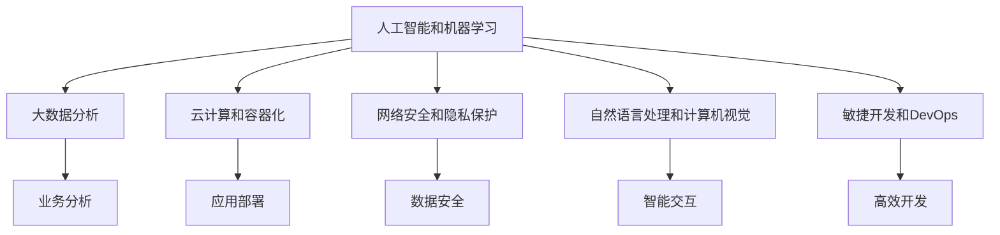

                 

# 未来工作：技能需求与培养

## 1. 背景介绍

在飞速发展的技术浪潮中，未来工作的技能需求正在发生深刻变化。随着人工智能、机器学习、大数据等前沿技术的渗透，许多传统行业都在经历着深刻的转型升级。对从业者的技能要求也随之变化，必须快速适应新技术带来的挑战。因此，掌握未来工作所需的关键技能，对任何求职者都是至关重要的。

### 1.1 行业趋势分析

根据多项行业研究和专家预测，未来工作所需的关键技能包括以下几个方面：

- **人工智能和机器学习**：随着AI技术的日益成熟，企业在招聘过程中对AI技能的需求正在增加，尤其是对数据科学家、机器学习工程师、AI产品经理等岗位。
- **大数据分析**：大数据分析在商业决策、市场研究、客户行为分析等方面具有重要应用，相关技能需求也在上升。
- **云计算和容器化**：云计算和容器化技术能够高效支持大规模应用部署，是未来软件开发的关键技术。
- **网络安全和隐私保护**：随着数据泄露和网络攻击事件的频发，网络安全已成为企业的核心需求，安全工程师、隐私保护专家等岗位需求增加。
- **自然语言处理和计算机视觉**：NLP和CV技术在智能交互、图像识别、语音识别等方面有广泛应用，相关技能需求正在增长。
- **敏捷开发和DevOps**：敏捷开发和DevOps文化能够提高团队效率和交付速度，相关技能需求持续上升。

这些趋势反映了技术进步对职业技能的重新定义和要求。因此，学习这些技能并不断提升，将成为未来职业发展的重要路径。

### 1.2 技能需求变化

未来工作的技能需求已经不再局限于传统IT岗位。越来越多的非IT岗位也开始重视编程、数据分析等技能，以便提升工作效率和决策水平。例如，市场营销、运营管理、人力资源等岗位都需要掌握一定的数据分析能力，以支撑决策制定。

此外，未来的技能需求还更加注重跨学科能力的培养。团队合作、沟通协调、创新思维等软技能也被列为重要需求，成为企业考察应聘者的重要维度。

## 2. 核心概念与联系

### 2.1 核心概念概述

为了更好地理解未来工作所需的关键技能，本节将介绍几个核心概念及其之间的联系：

- **人工智能和机器学习**：通过算法和模型对数据进行训练和预测，实现自动化决策和分析。
- **大数据分析**：利用大数据技术对海量数据进行采集、存储、分析和可视化，提取有价值的信息。
- **云计算和容器化**：基于云平台提供的应用和基础设施服务，实现高效的资源管理和自动化部署。
- **网络安全和隐私保护**：通过技术手段和政策法规，保护数据和系统的安全，防止信息泄露和攻击。
- **自然语言处理和计算机视觉**：利用语言模型和图像模型，实现自然语言理解和图像识别。
- **敏捷开发和DevOps**：通过敏捷方法和工具，提升开发效率和团队协作水平。

这些概念之间的联系可以通过以下Mermaid流程图来展示：



这个流程图展示了大语言模型的核心概念及其之间的关系：

1. 人工智能和机器学习是核心驱动力，提供自动化决策和分析能力。
2. 大数据分析是数据处理的基础，通过数据挖掘和可视化支持决策。
3. 云计算和容器化提供资源管理和自动化部署，提升开发效率。
4. 网络安全和隐私保护保障数据安全，避免信息泄露和攻击。
5. 自然语言处理和计算机视觉实现智能交互和图像识别。
6. 敏捷开发和DevOps提高开发效率和团队协作。

这些概念共同构成了未来工作的技术框架，使企业能够高效地利用数据和技术实现业务创新和效率提升。

## 3. 核心算法原理 & 具体操作步骤

### 3.1 算法原理概述

未来的工作所需的关键技能通常涉及复杂的算法和模型。理解这些算法的原理，是掌握相关技能的前提。

- **机器学习算法**：包括监督学习、无监督学习、强化学习等，通过数据训练模型，进行预测和分类。
- **自然语言处理算法**：包括分词、词性标注、命名实体识别、语义理解等，通过模型实现自然语言处理。
- **计算机视觉算法**：包括图像分类、目标检测、人脸识别等，通过模型实现图像识别。
- **数据分析算法**：包括数据清洗、特征工程、统计分析等，通过数据处理支持业务分析。
- **云平台和容器化技术**：包括云计算基础架构、容器编排、持续集成和持续部署等，支持应用的高效部署和运维。
- **网络安全算法**：包括加密算法、安全协议、入侵检测等，保护数据和系统的安全。

这些算法虽然各自独立，但共同构成了未来工作的技术基础。理解这些算法的原理和应用场景，是掌握相关技能的关键。

### 3.2 算法步骤详解

掌握未来工作所需的关键技能，通常需要经历以下几个步骤：

**Step 1: 选择学习路径**

根据个人兴趣和职业规划，选择适合自己的学习路径。例如，想成为数据科学家，可以关注机器学习、大数据分析和统计学等课程。

**Step 2: 理论学习**

通过在线课程、书籍、论文等资源，系统学习相关理论知识。掌握算法的原理和应用场景。

**Step 3: 实践练习**

通过编程练习、项目实践、竞赛等方式，巩固所学知识，提升编程和实战能力。

**Step 4: 持续学习**

技术领域不断发展，持续关注最新的研究进展和应用实践，不断提升自我。

**Step 5: 能力评估**

通过考试、面试、项目评审等方式，评估自己的实际能力，并根据反馈不断改进。

### 3.3 算法优缺点

未来工作所需的关键技能具有以下优缺点：

**优点：**

- **广泛应用**：这些技能在各行各业都有广泛应用，掌握后能够快速适应不同岗位。
- **高需求**：随着技术进步，这些技能的需求正在增加，具备这些技能的人具有较强的市场竞争力。
- **提升效率**：掌握相关技能能够显著提升工作效率和决策水平，帮助企业实现创新和转型。

**缺点：**

- **学习成本高**：这些技能的学习门槛较高，需要投入大量时间和精力。
- **应用复杂**：掌握技能后，还需要面对实际应用中的各种复杂问题，需要不断积累经验。
- **竞争激烈**：随着这些技能需求上升，市场竞争也变得更加激烈，需要不断提升自己的能力和经验。

### 3.4 算法应用领域

未来工作所需的关键技能在多个领域都有广泛应用，例如：

- **金融行业**：通过机器学习和大数据分析，实现风险评估、投资决策、客户分析等。
- **医疗行业**：通过自然语言处理和图像识别，实现病历分析、医疗影像诊断、智能咨询等。
- **零售行业**：通过大数据分析和敏捷开发，实现客户行为分析、库存管理、智能推荐等。
- **制造业**：通过云计算和容器化技术，实现设备监控、生产优化、供应链管理等。
- **物流行业**：通过计算机视觉和网络安全技术，实现货物追踪、智能配送、安全防护等。
- **智能家居**：通过自然语言处理和计算机视觉，实现智能语音交互、图像识别等。

这些应用领域展示了未来工作所需关键技能的广泛应用场景，反映了技术进步对各行业的影响。

## 4. 数学模型和公式 & 详细讲解 & 举例说明

### 4.1 数学模型构建

未来的工作所需的关键技能通常涉及复杂的数学模型和算法，以下是几个典型模型的构建方法：

**机器学习模型**：
- **线性回归模型**：用于预测连续型变量，数学表达式为 $y = wx + b$，其中 $w$ 为权重，$b$ 为截距。
- **决策树模型**：用于分类和回归，通过树形结构进行决策，节点分为条件判断和输出结果两部分。
- **神经网络模型**：通过多层感知器实现非线性映射，包含输入层、隐藏层和输出层。

**自然语言处理模型**：
- **循环神经网络**（RNN）：通过时间序列模型处理自然语言，包含隐藏状态，能够处理长距离依赖。
- **卷积神经网络**（CNN）：用于图像识别和文本分类，通过卷积和池化操作提取特征。
- **Transformer模型**：用于序列建模，通过自注意力机制捕捉长距离依赖，广泛应用于NLP任务。

**计算机视觉模型**：
- **卷积神经网络**（CNN）：用于图像分类和目标检测，通过卷积和池化操作提取特征。
- **循环神经网络**（RNN）：用于视频分析和动作识别，通过时间序列模型处理帧序列。
- **深度生成模型**（如GAN、VAE）：用于图像生成和图像修复，通过生成对抗网络或变分自编码器实现。

**数据分析模型**：
- **主成分分析**（PCA）：用于数据降维，通过线性变换实现特征提取。
- **聚类分析**：用于数据分组和模式识别，通过距离度量和簇心更新实现。
- **回归分析**：用于预测数值型数据，通过最小二乘法或最大似然估计实现。

### 4.2 公式推导过程

以线性回归模型为例，推导其最小二乘法解法。假设样本数据为 $(x_i, y_i)$，其中 $i=1,2,\ldots,n$。线性回归模型的目标是最小化损失函数：

$$
J(w, b) = \frac{1}{2} \sum_{i=1}^n (y_i - wx_i - b)^2
$$

通过求偏导数并令导数为0，可以得到模型的参数解：

$$
w = \frac{\sum_{i=1}^n x_i y_i}{\sum_{i=1}^n x_i^2}, \quad b = \frac{\sum_{i=1}^n y_i - \sum_{i=1}^n x_i y_i}{\sum_{i=1}^n x_i^2}
$$

**案例分析与讲解**：

假设有一组房价数据 $(x_i, y_i)$，其中 $x_i$ 为房屋面积，$y_i$ 为房价。利用线性回归模型进行预测，推导模型参数解，并在新样本上预测房价。

### 4.3 案例分析与讲解

**案例1：房价预测**

假设有一组房价数据 $(x_i, y_i)$，其中 $x_i$ 为房屋面积，$y_i$ 为房价。利用线性回归模型进行预测，推导模型参数解，并在新样本上预测房价。

**数据准备**：
- 收集历史房价数据，包括房屋面积和房价。
- 将数据分为训练集和测试集。

**模型构建**：
- 使用最小二乘法求解线性回归模型参数 $w$ 和 $b$。
- 构建预测函数 $y = wx + b$。

**训练过程**：
- 使用训练集数据拟合模型参数。
- 在测试集数据上评估模型性能。

**结果展示**：
- 绘制房价预测图，比较预测值和真实值。

## 5. 项目实践：代码实例和详细解释说明

### 5.1 开发环境搭建

在进行项目实践前，我们需要准备好开发环境。以下是使用Python进行PyTorch开发的环境配置流程：

1. 安装Anaconda：从官网下载并安装Anaconda，用于创建独立的Python环境。

2. 创建并激活虚拟环境：
```bash
conda create -n pytorch-env python=3.8 
conda activate pytorch-env
```

3. 安装PyTorch：根据CUDA版本，从官网获取对应的安装命令。例如：
```bash
conda install pytorch torchvision torchaudio cudatoolkit=11.1 -c pytorch -c conda-forge
```

4. 安装TensorFlow：
```bash
pip install tensorflow
```

5. 安装各类工具包：
```bash
pip install numpy pandas scikit-learn matplotlib tqdm jupyter notebook ipython
```

完成上述步骤后，即可在`pytorch-env`环境中开始项目实践。

### 5.2 源代码详细实现

下面我以房价预测为例，给出使用TensorFlow进行线性回归的代码实现。

首先，准备房价数据集：

```python
import pandas as pd
import numpy as np

# 读取数据集
data = pd.read_csv('house_prices.csv')

# 划分训练集和测试集
train_data = data.sample(frac=0.8, random_state=42)
test_data = data.drop(train_data.index)

# 提取特征和标签
X_train = train_data[['area']]
y_train = train_data['price']
X_test = test_data[['area']]
y_test = test_data['price']
```

然后，定义模型和优化器：

```python
import tensorflow as tf

# 定义模型
def linear_regression(input_data, output_data):
    # 定义权重和偏置
    w = tf.Variable(tf.random.normal([1]), name='weights')
    b = tf.Variable(tf.random.normal([1]), name='bias')
    
    # 定义预测函数
    predictions = w * input_data + b
    
    # 定义损失函数
    loss = tf.reduce_mean(tf.square(predictions - output_data))
    
    return loss

# 训练模型
optimizer = tf.keras.optimizers.SGD(learning_rate=0.01)
epochs = 1000

# 训练过程
for epoch in range(epochs):
    with tf.GradientTape() as tape:
        loss = linear_regression(X_train, y_train)
    grads = tape.gradient(loss, [w, b])
    optimizer.apply_gradients(zip(grads, [w, b]))

    if (epoch + 1) % 100 == 0:
        print('Epoch {}, Loss: {}'.format(epoch + 1, loss.numpy()))
```

接着，评估模型并预测房价：

```python
# 评估模型
with tf.GradientTape() as tape:
    loss = linear_regression(X_test, y_test)
    grads = tape.gradient(loss, [w, b])
    optimizer.apply_gradients(zip(grads, [w, b]))

    print('Test Loss: {}'.format(loss.numpy()))

# 预测房价
predictions = w * X_test + b
print('Predictions:', predictions.numpy())
```

以上就是使用TensorFlow进行房价预测的完整代码实现。可以看到，TensorFlow提供了高度可定制的计算图机制，方便进行模型构建和训练。

### 5.3 代码解读与分析

让我们再详细解读一下关键代码的实现细节：

**数据准备**：
- 使用pandas读取CSV文件，将其转换为DataFrame格式。
- 通过随机抽样将数据集划分为训练集和测试集。
- 提取特征（房屋面积）和标签（房价），分别存入Numpy数组。

**模型构建**：
- 定义线性回归模型函数，包括权重、偏置、预测函数和损失函数。
- 使用SGD优化器进行模型参数优化。
- 设置训练轮数。

**训练过程**：
- 在每个epoch开始前，使用GradientTape记录梯度。
- 计算损失函数并求梯度。
- 使用优化器更新模型参数。
- 输出当前epoch的损失值。

**评估模型**：
- 与训练过程类似，记录梯度和损失函数，并使用优化器更新模型参数。
- 输出测试集的损失值。

**结果展示**：
- 使用Numpy输出模型预测值。

## 6. 实际应用场景

### 6.1 智能推荐系统

智能推荐系统利用大数据分析和机器学习算法，帮助用户发现潜在兴趣和需求。通过分析用户的浏览记录、评分反馈等数据，推荐系统能够提供个性化的商品和内容。

### 6.2 金融风险管理

金融风险管理利用机器学习和自然语言处理技术，对金融数据进行深度分析和风险预测。通过处理新闻、市场报告等文本数据，机器学习模型能够识别出市场趋势和风险因素，提供决策支持。

### 6.3 智能客服系统

智能客服系统通过自然语言处理和机器学习技术，提供24小时不间断的客户服务。通过理解用户输入，智能客服系统能够自动生成回复，提供常见问题和解决方案，提升客户体验。

### 6.4 未来应用展望

随着技术的不断进步，未来工作所需的关键技能将更加广泛和深入。以下是一些未来应用展望：

- **增强现实和虚拟现实**：AR/VR技术将与机器学习和计算机视觉深度结合，应用于虚拟培训、实时协作等领域。
- **智能交通和智慧城市**：通过自然语言处理和计算机视觉，实现智能交通管理和城市治理。
- **智能医疗和健康管理**：利用自然语言处理和计算机视觉，实现电子病历分析、医学影像诊断等。
- **智能制造和工业4.0**：通过机器学习和计算机视觉，实现设备监控、智能生产等。
- **智能家居和物联网**：通过自然语言处理和计算机视觉，实现智能家居控制和物联网设备管理。

这些应用场景展示了未来工作所需关键技能的广阔应用前景，反映了技术进步对各行业的影响。

## 7. 工具和资源推荐

### 7.1 学习资源推荐

为了帮助开发者系统掌握未来工作所需的关键技能，这里推荐一些优质的学习资源：

1. **机器学习**：《机器学习》（周志华著）、《Python机器学习》（Sebastian Raschka著）。
2. **深度学习**：《深度学习》（Ian Goodfellow著）、《动手学深度学习》（李沐等著）。
3. **自然语言处理**：《自然语言处理综论》（Daniel Jurafsky & James H. Martin著）、《Python自然语言处理》（Susan Dumais著）。
4. **计算机视觉**：《计算机视觉：模型、学习和推理》（Richard Szeliski著）、《Python计算机视觉编程》（Joseph Jepko著）。
5. **大数据分析**：《Hadoop实战》（Tom White著）、《Python数据科学手册》（Jake VanderPlas著）。
6. **云计算和容器化**：《云计算：分布式计算和网络服务》（Rex E. Beverridge著）、《Kubernetes权威指南》（Brian Grube等著）。
7. **网络安全和隐私保护**：《网络安全基础》（Kasim Gurler著）、《Web安全攻防》（刘建伟等著）。
8. **敏捷开发和DevOps**：《敏捷软件开发：原则、模式与实践》（Robert C. Martin著）、《DevOps实践指南》（Andy Warley等著）。

通过对这些资源的学习实践，相信你一定能够快速掌握未来工作所需的关键技能，并用于解决实际的业务问题。

### 7.2 开发工具推荐

高效的开发离不开优秀的工具支持。以下是几款用于未来工作技能开发的常用工具：

1. **Jupyter Notebook**：一个强大的交互式计算环境，支持多种编程语言和数据格式，适合数据科学和机器学习任务。
2. **PyCharm**：一款功能强大的Python IDE，提供代码编辑、调试、测试等工具，适合Python开发和数据科学任务。
3. **Visual Studio Code**：一款轻量级但功能丰富的代码编辑器，支持多种编程语言和框架，适合软件开发和协作任务。
4. **Kubernetes**：一个开源的容器编排平台，支持分布式应用的高效管理和扩展，适合云计算和容器化任务。
5. **AWS**：亚马逊提供的云服务平台，提供丰富的计算、存储、网络等服务，适合云平台和云计算任务。
6. **Anaconda**：一个数据科学和机器学习环境管理工具，提供Python和R语言的依赖管理、环境复现等功能，适合数据科学和机器学习任务。
7. **Docker**：一个开源的容器化平台，支持应用和服务的打包、分发和运行，适合容器化任务。

合理利用这些工具，可以显著提升未来工作所需关键技能的开发效率，加快创新迭代的步伐。

### 7.3 相关论文推荐

未来工作所需的关键技能的研究源于学界的持续探索。以下是几篇奠基性的相关论文，推荐阅读：

1. **机器学习**：《On the Shoulders of Giants: Machine Learning, NIPS 2015》（Yoshua Bengio等著）。
2. **深度学习**：《ImageNet Classification with Deep Convolutional Neural Networks》（Alex Krizhevsky等著）。
3. **自然语言处理**：《Attention is All You Need》（Ashish Vaswani等著）。
4. **计算机视觉**：《Single Image Haze Removal Using Dark Channel Prior》（Simone Parpinelli等著）。
5. **大数据分析**：《Big Data: Principles and Best Practices of Scalable Realtime Data Systems》（Jeffrey Dean等著）。
6. **云计算和容器化**：《Microservices: A Personal Journey》（Sam Newman著）。
7. **网络安全和隐私保护**：《On the Origins of Computer Security》（Bruce Schneier著）。
8. **敏捷开发和DevOps**：《The Pragmatic Programmer: From Journeyman to Master》（Andrew Hunt等著）。

这些论文代表了大语言模型微调技术的发展脉络。通过学习这些前沿成果，可以帮助研究者把握学科前进方向，激发更多的创新灵感。

## 8. 总结：未来发展趋势与挑战

### 8.1 研究成果总结

本文对未来工作所需的关键技能进行了全面系统的介绍。首先阐述了这些技能对未来工作的必要性和应用场景，明确了技能学习的重要性和紧迫性。其次，从理论到实践，详细讲解了机器学习、自然语言处理、计算机视觉等关键技能的构建过程，给出了完整的代码实例。同时，本文还广泛探讨了这些技能在各行业的实际应用，展示了其广泛的应用前景。最后，本文精选了相关学习资源、开发工具和前沿论文，力求为读者提供全方位的技术指引。

通过本文的系统梳理，可以看到，未来工作所需的关键技能已经不再局限于传统的IT岗位，而是广泛应用于各行各业。掌握这些技能，不仅能够提升个人的市场竞争力，还能为企业的创新和转型提供有力支持。未来工作所需的关键技能是大数据、云计算、人工智能等前沿技术在各行各业深入应用的重要基石，是推动数字化转型的关键动力。

### 8.2 未来发展趋势

展望未来，未来工作所需的关键技能将呈现以下几个发展趋势：

1. **跨学科融合**：未来工作所需的关键技能将更加注重跨学科能力的培养，如编程、数据分析、项目管理等。各领域的融合将带来更多创新和协同效应。
2. **持续学习和终身学习**：随着技术的快速变化，未来工作所需的关键技能将持续更新和升级。持续学习和终身学习将成为必备素质。
3. **人工智能与人类协作**：未来工作将更加注重人工智能与人类协作，提高工作效率和决策质量。智能化与人类化的结合将带来更多协同效应。
4. **伦理和隐私保护**：随着技术的广泛应用，伦理和隐私保护将成为关键问题。如何在技术应用中平衡利益和风险，将是重要的研究方向。
5. **普适技术和可访问性**：未来工作所需的关键技能将更加普适和可访问，有助于提升社会的整体技术水平和数字素养。

这些趋势反映了未来工作所需关键技能的广阔前景，展示了技术的广泛应用和深远影响。

### 8.3 面临的挑战

尽管未来工作所需的关键技能需求正在上升，但在技能学习和应用过程中，仍面临诸多挑战：

1. **学习成本高**：掌握这些技能需要投入大量时间和精力，对学习资源和工具的要求较高。
2. **应用复杂**：技术应用过程中，往往需要解决各种复杂问题，如数据处理、模型优化等。
3. **市场竞争激烈**：随着这些技能需求上升，市场竞争也变得更加激烈，需要不断提升自己的能力和经验。
4. **伦理和隐私风险**：技术应用过程中，可能涉及伦理和隐私问题，需要严格遵守相关法律法规。
5. **技术迭代快**：技术更新速度快，需要不断学习和跟进最新的技术进展。

正视这些挑战，积极应对并寻求突破，将是大语言模型微调技术迈向成熟的必由之路。相信随着学界和产业界的共同努力，这些挑战终将一一被克服，未来工作所需的关键技能将逐步走向成熟，为构建安全、可靠、可解释、可控的智能系统铺平道路。

### 8.4 研究展望

面向未来，未来工作所需的关键技能的研究需要在以下几个方面寻求新的突破：

1. **无监督学习和自适应学习**：探索无监督学习和自适应学习范式，减少对大规模标注数据的依赖，利用自监督学习、主动学习等方法，提高技能学习的效率和效果。
2. **多模态学习**：探索多模态学习技术，结合文本、图像、音频等多种数据源，提升技能学习的全面性和准确性。
3. **智能辅助和自动化**：探索智能辅助和自动化工具，如AI辅助编程、智能代码补全等，提升技能学习的效率和质量。
4. **伦理和隐私保护**：探索伦理和隐私保护技术，确保技术应用中的道德和法律合规性，提升技术应用的可信度和安全性。
5. **人机协同和智能系统**：探索人机协同和智能系统，提升技能学习的效率和效果，增强人机协作的协同效应。

这些研究方向将引领未来工作所需关键技能的研究发展，为构建更加智能、高效、安全、可控的技术系统提供有力支持。

## 9. 附录：常见问题与解答

**Q1：未来工作所需的关键技能如何培养？**

A: 未来工作所需的关键技能通常需要系统学习和实践。可以通过在线课程、书籍、论文等资源进行理论学习，并通过编程练习、项目实践、竞赛等方式进行实战练习。同时，持续关注最新的研究进展和应用实践，不断提升自己的技能水平。

**Q2：未来工作所需的关键技能是否容易掌握？**

A: 未来工作所需的关键技能学习门槛较高，需要投入大量时间和精力。但随着技术的发展和资源的丰富，学习路径和方法也在不断优化，技能学习的门槛正在逐渐降低。

**Q3：未来工作所需的关键技能是否容易过时？**

A: 未来工作所需的关键技能随着技术的不断进步而更新升级，需要持续学习和跟进最新的技术进展。但这些技能的基础知识和核心原理相对稳定，掌握基本技能后，能够更快地适应新技术的应用。

**Q4：未来工作所需的关键技能是否容易被替换？**

A: 未来工作所需的关键技能具有较强的通用性和普适性，在各行各业都有广泛应用。虽然技术进步可能会带来新的技能需求，但掌握这些核心技能将为个人职业发展提供坚实的基础。

**Q5：未来工作所需的关键技能是否容易被自动化取代？**

A: 虽然自动化技术在不断发展，但未来工作所需的关键技能更多地涉及复杂的思维和决策能力，这些能力目前仍难以被自动化取代。因此，掌握这些技能将具有重要的应用价值。

**Q6：未来工作所需的关键技能是否需要不断提高？**

A: 是的，随着技术的不断进步和应用场景的变化，未来工作所需的关键技能也需要不断提升和更新。持续学习和提升技能水平，将使个人在竞争激烈的职场中保持优势。

通过本文的系统梳理，可以看到，未来工作所需的关键技能在各行各业都有广泛应用，掌握这些技能不仅能够提升个人的市场竞争力，还能为企业的创新和转型提供有力支持。未来工作所需的关键技能是大数据、云计算、人工智能等前沿技术在各行各业深入应用的重要基石，是推动数字化转型的关键动力。只有勇于创新、敢于突破，才能不断拓展未来工作所需的关键技能的边界，让智能技术更好地造福人类社会。

