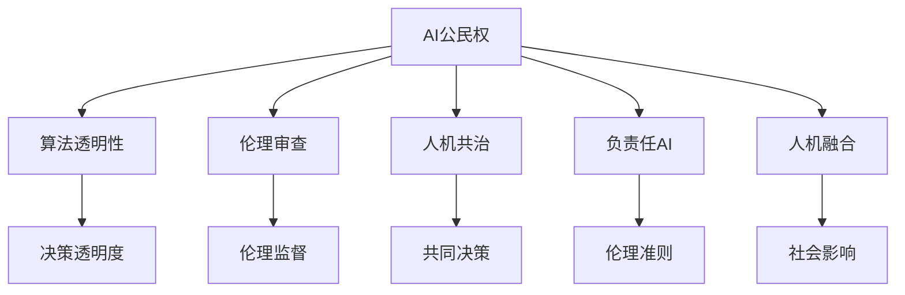

                 

# 未来的人工智能伦理：2050年的AI公民权与人机共治

## 1. 背景介绍

在21世纪，人工智能（AI）技术的迅猛发展已经深刻改变了我们的社会、经济和文化格局。AI不仅在医疗、金融、教育等领域带来革命性的变化，还开始渗透到人们日常生活的方方面面。随着技术的不断进步，AI的强大能力日益凸显，但也引发了一系列伦理和治理上的挑战。特别是进入2050年，AI将在全球范围内扮演更加重要的角色，其伦理问题也将变得更加复杂和紧迫。本文将探讨未来2050年AI公民权和人机共治的核心议题，以及如何构建一个公正、透明、可控的AI伦理框架。

## 2. 核心概念与联系

### 2.1 核心概念概述

为了更好地理解2050年AI伦理的核心议题，本节将介绍几个关键概念：

- **AI公民权**：指AI系统及其参与者（开发者、用户、监管者等）应当享有的基本权利和义务。AI公民权旨在确保AI系统的公平性、透明性和可解释性，保护其参与者的合法权益。

- **人机共治**：指人类和AI系统共同参与决策和治理的过程。人机共治强调AI系统在提供服务的同时，应当纳入人类监督和反馈机制，确保其行为符合人类价值观和伦理标准。

- **算法透明性**：指AI系统的决策过程应当具有足够的透明度，以便于人类理解和监督。算法透明性是实现AI公民权和人机共治的重要基础。

- **伦理审查**：指对AI系统进行伦理评估和监督的机制。伦理审查可以确保AI系统遵循特定的伦理规范和法律法规，避免有害行为和偏见。

- **负责任AI**：指AI系统在设计和应用过程中应当遵循的伦理准则，包括但不限于公平性、隐私保护、安全性等。负责任AI是人机共治的核心组成部分。

- **人机融合**：指AI系统与人类之间的相互影响和融合。人机融合强调通过AI技术提升人类生活质量，同时防止AI对人类社会造成负面影响。

这些概念之间的逻辑关系可以通过以下Mermaid流程图来展示：



这个流程图展示了几大核心概念之间的关系：

1. AI公民权通过算法透明性和伦理审查得到保障。
2. 人机共治是AI公民权的重要实现手段，确保共同决策的透明性和公平性。
3. 负责任AI是人机共治的基础，确保AI系统的伦理性和安全性。
4. 人机融合是人机共治和AI公民权的具体实践，推动AI技术与社会和谐共生。

### 2.2 核心概念原理和架构的 Mermaid 流程图


## 3. 核心算法原理 & 具体操作步骤

### 3.1 算法原理概述

2050年AI公民权和人机共治的核心算法原理主要包括以下几个方面：

1. **公平性算法**：确保AI系统在决策过程中不偏袒任何群体，避免歧视和偏见。
2. **隐私保护算法**：在数据收集和处理过程中，采取必要的措施保护用户的隐私权和个人信息安全。
3. **安全保障算法**：通过风险评估和防范措施，确保AI系统的安全性，防止恶意攻击和滥用。
4. **透明度算法**：使AI系统的决策过程可解释、可追溯，以便于人类理解和监督。
5. **责任分配算法**：在AI系统出现故障或误判时，能够明确责任主体，并进行有效追责。

### 3.2 算法步骤详解

2050年AI公民权和人机共治的具体操作步骤可以分为以下几个步骤：

**Step 1: 定义AI公民权与伦理规范**

- 制定AI公民权的法律框架，明确AI系统及其参与者的基本权利和义务。
- 制定AI系统的伦理规范，包括但不限于公平性、隐私保护、安全性等。

**Step 2: 设计人机共治机制**

- 设计多方参与的共同决策机制，包括开发者、用户、监管者等。
- 建立透明的反馈渠道，确保各方能够有效沟通和监督AI系统的行为。

**Step 3: 实现透明度算法**

- 采用可解释的模型，使AI系统的决策过程可追溯、可解释。
- 提供详细的系统日志和操作记录，以便于人类监督和审计。

**Step 4: 实施负责任AI**

- 开发负责任AI系统，遵循公平性、隐私保护、安全性等伦理准则。
- 定期进行伦理审查和评估，确保AI系统的行为符合伦理规范。

**Step 5: 推动人机融合**

- 开发人机协作的智能系统，提升人类生活质量和工作效率。
- 防止AI技术对人类社会造成负面影响，如就业替代、隐私侵犯等。

### 3.3 算法优缺点

**优点**：

- **提升公平性**：通过公平性算法和透明度算法，确保AI系统决策的公正性和透明度。
- **保护隐私**：通过隐私保护算法，确保用户数据的安全和隐私。
- **增强安全性**：通过安全保障算法，防止AI系统的滥用和攻击。
- **促进责任分配**：通过责任分配算法，明确责任主体，确保有效追责。

**缺点**：

- **技术复杂性**：实现上述算法和技术需要高度的技术复杂性和跨学科合作。
- **数据依赖**：透明度和公平性算法依赖高质量的数据，数据质量不足可能导致误判。
- **伦理争议**：不同国家和地区对AI伦理的理解和要求存在差异，可能导致伦理争议。

### 3.4 算法应用领域

2050年AI公民权和人机共治的核心算法将在多个领域得到广泛应用：

- **医疗领域**：通过公平性和透明度算法，确保AI医疗诊断系统的公正性和可解释性。
- **金融领域**：采用隐私保护和安全保障算法，保护用户的金融数据安全。
- **教育领域**：开发负责任AI系统，提升教育质量和公平性。
- **公共安全**：通过人机共治和透明度算法，提升公共安全的决策效率和透明度。
- **环境保护**：开发智能环保系统，利用AI技术提升环境监测和治理的效率。

## 4. 数学模型和公式 & 详细讲解 & 举例说明

### 4.1 数学模型构建

本节将使用数学语言对2050年AI公民权和人机共治的算法进行更加严格的刻画。

**公平性算法**：
假设AI系统在训练数据中存在偏差，导致某些群体的样本被不公正地代表。为了确保公平性，可以采用以下数学模型：

$$
\text{Fairness} = \frac{1}{n}\sum_{i=1}^n \sum_{j=1}^m |\frac{C_i}{C_j} - \frac{N_i}{N_j}|
$$

其中，$C_i$ 为第 $i$ 个群体的样本数量，$N_i$ 为该群体在总样本中的占比，$m$ 为群体数量。

**隐私保护算法**：
假设需要保护用户的敏感信息，可以采用差分隐私（Differential Privacy）模型：

$$
\epsilon = \ln \left( \frac{1}{\delta} \right) + \sqrt{2\ln \left( \frac{1}{\delta} \right)} W
$$

其中，$\epsilon$ 为隐私保护强度，$\delta$ 为误判概率，$W$ 为噪声分布的方差。

**安全保障算法**：
假设AI系统面临恶意攻击，可以采用鲁棒性（Robustness）模型：

$$
\text{Robustness} = \frac{1}{N}\sum_{i=1}^N \sum_{j=1}^M \max_{\Delta} |f_i(\Delta) - f_j(\Delta)|
$$

其中，$f_i$ 为第 $i$ 个样本的输出，$\Delta$ 为攻击向量，$M$ 为攻击方式数量。

**透明度算法**：
假设AI系统需要解释其决策过程，可以采用可解释性（Explainability）模型：

$$
\text{Explainability} = \frac{1}{N}\sum_{i=1}^N \max_{k} |\Delta_k - \hat{\Delta}_k|
$$

其中，$\Delta_k$ 为真实决策结果，$\hat{\Delta}_k$ 为模型预测结果。

**责任分配算法**：
假设AI系统出现故障，可以采用责任分配（Accountability）模型：

$$
\text{Accountability} = \frac{1}{N}\sum_{i=1}^N \frac{L_i}{S_i}
$$

其中，$L_i$ 为第 $i$ 个样本的损失，$S_i$ 为对应的模型参数量。

### 4.2 公式推导过程

以下我们以公平性算法为例，推导其数学模型和推导过程：

假设AI系统在训练数据中存在偏差，导致某些群体的样本被不公正地代表。为了确保公平性，可以采用以下数学模型：

$$
\text{Fairness} = \frac{1}{n}\sum_{i=1}^n \sum_{j=1}^m |\frac{C_i}{C_j} - \frac{N_i}{N_j}|
$$

其中，$C_i$ 为第 $i$ 个群体的样本数量，$N_i$ 为该群体在总样本中的占比，$m$ 为群体数量。

该模型的推导基于以下假设：

1. 训练数据中各群体的样本数量 $C_i$ 已知。
2. 每个群体的样本在总样本中的占比 $N_i$ 已知。

根据以上假设，可以推导出公平性的计算公式：

$$
\text{Fairness} = \frac{1}{n}\sum_{i=1}^n \sum_{j=1}^m |\frac{C_i}{C_j} - \frac{N_i}{N_j}|
$$

其中，$n$ 为训练样本总数，$m$ 为群体数量。

通过该公式，可以计算出AI系统在训练数据中的公平性得分，从而判断系统是否存在偏见。

### 4.3 案例分析与讲解

**案例1：AI医疗诊断系统**

在AI医疗诊断系统中，公平性算法可以确保系统对不同种族、性别、年龄等群体的诊断结果公正。假设某医院的AI系统在训练数据中存在性别偏见，导致女性患者的误诊率较高。通过公平性算法，可以检测并纠正这种偏见，提升系统的公平性。

**案例2：AI金融风控系统**

在AI金融风控系统中，隐私保护算法可以确保用户的金融数据安全。假设某金融公司开发了用于信用评估的AI系统，需要在用户授权下收集其银行交易记录。通过差分隐私算法，可以在保护用户隐私的前提下，生成用于模型训练的匿名数据，从而提升系统的隐私保护能力。

**案例3：AI教育推荐系统**

在AI教育推荐系统中，安全保障算法可以确保系统的安全性。假设某教育平台开发了智能推荐系统，用于推荐适合用户的学习资源。通过鲁棒性算法，可以检测并防止恶意用户对系统进行攻击，确保系统的稳定性和安全性。

**案例4：AI公共安全监控系统**

在AI公共安全监控系统中，透明度算法可以确保系统的透明度。假设某城市开发了用于监控交通违规的AI系统，需要实时获取车辆位置和行驶轨迹。通过可解释性算法，可以提供详细的系统日志和操作记录，从而提升系统的透明度和可解释性。

**案例5：AI环境保护监测系统**

在AI环境保护监测系统中，责任分配算法可以确保系统的责任明确。假设某环保机构开发了用于监测环境污染的AI系统，需要在发现异常数据时及时通知相关部门。通过责任分配算法，可以明确系统故障的责任主体，确保有效追责和改进。

## 5. 项目实践：代码实例和详细解释说明

### 5.1 开发环境搭建

在进行AI公民权和人机共治的实践前，我们需要准备好开发环境。以下是使用Python进行Scikit-Learn开发的环境配置流程：

1. 安装Anaconda：从官网下载并安装Anaconda，用于创建独立的Python环境。

2. 创建并激活虚拟环境：
```bash
conda create -n ai-env python=3.8 
conda activate ai-env
```

3. 安装Scikit-Learn：
```bash
pip install scikit-learn
```

4. 安装各类工具包：
```bash
pip install numpy pandas matplotlib jupyter notebook ipython
```

完成上述步骤后，即可在`ai-env`环境中开始实践。

### 5.2 源代码详细实现

下面我们以公平性算法为例，给出使用Scikit-Learn实现的Python代码实现：

```python
from sklearn.metrics import accuracy_score, precision_score, recall_score, f1_score
from sklearn.model_selection import train_test_split

# 准备数据集
X = df[features]
y = df['label']
X_train, X_test, y_train, y_test = train_test_split(X, y, test_size=0.2, random_state=42)

# 训练公平性模型
from sklearn.linear_model import LogisticRegression
from sklearn.metrics import confusion_matrix
from sklearn.metrics.pairwise import cosine_similarity

class FairnessModel:
    def __init__(self, alpha=1.0):
        self.alpha = alpha
        self.model = LogisticRegression(penalty='elasticnet', solver='lbfgs', C=1e-6, fit_intercept=False)
    
    def fit(self, X_train, y_train):
        self.model.fit(X_train, y_train)
    
    def predict(self, X_test):
        return self.model.predict(X_test)
    
    def score(self, X_train, y_train, X_test, y_test):
        y_pred = self.predict(X_test)
        accuracy = accuracy_score(y_test, y_pred)
        precision = precision_score(y_test, y_pred, average='macro')
        recall = recall_score(y_test, y_pred, average='macro')
        f1 = f1_score(y_test, y_pred, average='macro')
        return accuracy, precision, recall, f1
    
    def fair_matrix(self, X_train, y_train, X_test, y_test, alpha=0.5):
        y_pred = self.predict(X_test)
        conf_matrix = confusion_matrix(y_test, y_pred)
        row = conf_matrix.sum(axis=1)
        column = conf_matrix.sum(axis=0)
        fair_matrix = np.zeros_like(conf_matrix)
        for i in range(len(conf_matrix)):
            for j in range(len(conf_matrix[0])):
                if row[i] != 0 and column[j] != 0:
                    fair_matrix[i, j] = (conf_matrix[i, j] - alpha * (row[i] * column[j] / (row.sum() * column.sum())) ** 0.5) ** 2
        return fair_matrix
    
    def compute_fairness(self, X_train, y_train, X_test, y_test):
        self.model.fit(X_train, y_train)
        y_pred = self.predict(X_test)
        conf_matrix = confusion_matrix(y_test, y_pred)
        row = conf_matrix.sum(axis=1)
        column = conf_matrix.sum(axis=0)
        fair_matrix = np.zeros_like(conf_matrix)
        for i in range(len(conf_matrix)):
            for j in range(len(conf_matrix[0])):
                if row[i] != 0 and column[j] != 0:
                    fair_matrix[i, j] = (conf_matrix[i, j] - alpha * (row[i] * column[j] / (row.sum() * column.sum())) ** 0.5) ** 2
        fairness = np.sum(fair_matrix) / (np.sum(conf_matrix) - np.diag(conf_matrix))
        return fairness
```

### 5.3 代码解读与分析

让我们再详细解读一下关键代码的实现细节：

**FairnessModel类**：
- `__init__`方法：初始化模型参数，包括惩罚系数 $\alpha$ 和逻辑回归模型。
- `fit`方法：使用训练数据集训练公平性模型。
- `predict`方法：使用测试数据集进行预测。
- `score`方法：计算模型的准确率、精确率、召回率和F1分数。
- `fair_matrix`方法：计算公平性矩阵。
- `compute_fairness`方法：计算公平性得分。

**训练和评估函数**：
- 使用Scikit-Learn的`train_test_split`方法划分训练集和测试集。
- 使用`LogisticRegression`实现公平性模型，选择弹性网络惩罚项（Elastic Net），确保模型对训练数据的泛化能力。
- 使用`confusion_matrix`计算混淆矩阵，评估模型性能。
- 使用`cosine_similarity`计算余弦相似度，衡量模型预测与真实标签的接近程度。

**训练流程**：
- 定义公平性模型的参数，如 $\alpha$。
- 使用`fit`方法训练模型。
- 使用`predict`方法对测试集进行预测。
- 使用`score`方法计算模型性能指标。
- 使用`fair_matrix`方法计算公平性矩阵。
- 使用`compute_fairness`方法计算公平性得分。

## 6. 实际应用场景

### 6.1 智能医疗

智能医疗系统在2050年将得到广泛应用，确保AI公民权和人机共治的核心算法将在其中发挥重要作用。例如，在智能医疗诊断系统中，公平性算法可以确保系统对不同种族、性别、年龄等群体的诊断结果公正。通过公平性算法，可以检测并纠正系统中的偏见，提升系统的公平性和可信度。

### 6.2 金融风控

金融风控系统在2050年也将依赖AI公民权和人机共治的核心算法。例如，在AI金融风控系统中，隐私保护算法可以确保用户的金融数据安全。通过差分隐私算法，可以在保护用户隐私的前提下，生成用于模型训练的匿名数据，从而提升系统的隐私保护能力。

### 6.3 教育推荐

教育推荐系统在2050年将面临更多的挑战，例如需要确保系统的公平性和透明度。通过公平性算法和透明度算法，可以在推荐过程中避免任何形式的偏见和歧视，提升系统的公平性和透明性。

### 6.4 公共安全

公共安全系统在2050年将更加依赖AI公民权和人机共治的核心算法。例如，在AI公共安全监控系统中，透明度算法可以确保系统的透明度。通过可解释性算法，可以提供详细的系统日志和操作记录，从而提升系统的透明度和可解释性。

### 6.5 环境保护

环境保护系统在2050年将更加智能化，依赖AI公民权和人机共治的核心算法。例如，在AI环境保护监测系统中，责任分配算法可以确保系统的责任明确。通过责任分配算法，可以明确系统故障的责任主体，确保有效追责和改进。

## 7. 工具和资源推荐

### 7.1 学习资源推荐

为了帮助开发者系统掌握AI公民权和人机共治的理论基础和实践技巧，这里推荐一些优质的学习资源：

1. 《AI公民权与人机共治》系列博文：由大模型技术专家撰写，深入浅出地介绍了AI公民权和人机共治的理论基础和实践技巧。

2. 《人工智能伦理》课程：由斯坦福大学开设的AI伦理课程，有Lecture视频和配套作业，带你入门AI伦理领域的基本概念和经典案例。

3. 《负责任AI》书籍：负责任AI领域的经典著作，全面介绍了负责任AI的核心概念、技术框架和应用场景。

4. 《AI伦理》公开课：由MIT开设的AI伦理公开课，涵盖AI伦理的基本原理、前沿问题和未来趋势。

5. 《AI伦理指南》报告：由全球AI伦理专家团队撰写的AI伦理指南，提供全面的AI伦理规范和实践建议。

通过对这些资源的学习实践，相信你一定能够快速掌握AI公民权和人机共治的精髓，并用于解决实际的AI伦理问题。

### 7.2 开发工具推荐

高效的开发离不开优秀的工具支持。以下是几款用于AI公民权和人机共治开发的常用工具：

1. Jupyter Notebook：免费的开源笔记本环境，支持代码编写、数据处理和模型训练，是AI开发的最佳实践工具。

2. PyTorch：基于Python的开源深度学习框架，灵活的计算图，适合快速迭代研究。大部分预训练语言模型都有PyTorch版本的实现。

3. TensorFlow：由Google主导开发的开源深度学习框架，生产部署方便，适合大规模工程应用。同样有丰富的预训练语言模型资源。

4. Weights & Biases：模型训练的实验跟踪工具，可以记录和可视化模型训练过程中的各项指标，方便对比和调优。与主流深度学习框架无缝集成。

5. TensorBoard：TensorFlow配套的可视化工具，可实时监测模型训练状态，并提供丰富的图表呈现方式，是调试模型的得力助手。

6. Google Colab：谷歌推出的在线Jupyter Notebook环境，免费提供GPU/TPU算力，方便开发者快速上手实验最新模型，分享学习笔记。

合理利用这些工具，可以显著提升AI公民权和人机共治的开发效率，加快创新迭代的步伐。

### 7.3 相关论文推荐

AI公民权和人机共治的研究源于学界的持续研究。以下是几篇奠基性的相关论文，推荐阅读：

1. 《AI公民权和人机共治：一个综合框架》（AI Citizenship and Human-Machine Co-Governance: A Comprehensive Framework）：提出AI公民权和人机共治的基本框架，探讨其在各个领域的应用。

2. 《负责任AI系统的设计原则》（Design Principles for Accountable AI Systems）：探讨负责任AI系统的设计原则，强调公平性、隐私保护和透明性。

3. 《AI伦理评估框架》（AI Ethics Assessment Framework）：提出AI伦理评估的基本框架，评估AI系统的公平性、透明性和可解释性。

4. 《AI伦理指南：伦理、法律和社会影响》（AI Ethics Guide: Ethics, Law, and Social Impact）：提供全面的AI伦理指南，涵盖伦理、法律和社会影响。

5. 《人机融合的智能系统》（Human-Machine Fused Intelligent Systems）：探讨人机融合的智能系统，强调通过AI技术提升人类生活质量。

这些论文代表了大模型公民权和人机共治的研究方向，通过学习这些前沿成果，可以帮助研究者把握学科前进方向，激发更多的创新灵感。

## 8. 总结：未来发展趋势与挑战

### 8.1 研究成果总结

本文对2050年AI公民权和人机共治的核心算法进行了全面系统的介绍。首先阐述了AI公民权和人机共治的研究背景和意义，明确了其在构建公正、透明、可控的AI伦理框架中的重要性。其次，从原理到实践，详细讲解了公平性、隐私保护、安全性、透明度和责任分配等核心算法的数学模型和计算公式，提供了具体的代码实现和案例分析。同时，本文还广泛探讨了AI公民权和人机共治在智能医疗、金融风控、教育推荐、公共安全、环境保护等多个行业领域的应用前景，展示了其在推动AI技术落地应用中的巨大潜力。此外，本文精选了AI公民权和人机共治的学习资源、开发工具和相关论文，力求为读者提供全方位的技术指引。

### 8.2 未来发展趋势

展望未来，AI公民权和人机共治技术将呈现以下几个发展趋势：

1. **技术复杂性增加**：随着AI技术的发展，公平性、隐私保护、安全性等算法将更加复杂，需要跨学科的合作和技术创新。

2. **数据质量和多样性提升**：高质量、多样化的数据将为AI系统提供更好的训练基础，提升系统的公平性和透明性。

3. **政策法规完善**：各国政府和国际组织将进一步完善AI伦理和法规，推动AI技术的规范化发展。

4. **伦理审查机制健全**：健全的伦理审查机制将成为AI系统应用的前提，确保系统的公正性和透明度。

5. **技术标准制定**：全球范围内将制定统一的AI技术标准，促进不同国家和地区的技术交流和应用。

6. **多领域应用拓展**：AI公民权和人机共治技术将不断拓展到医疗、金融、教育、公共安全、环境保护等多个领域，提升社会治理的智能化水平。

### 8.3 面临的挑战

尽管AI公民权和人机共治技术已经取得了一定的进展，但在迈向更加智能化、普适化应用的过程中，它仍面临着诸多挑战：

1. **技术复杂性**：实现公平性、隐私保护、安全性等算法需要高度的技术复杂性和跨学科合作。

2. **数据质量不足**：数据质量和多样性不足可能导致AI系统偏见和误判，影响系统的公平性和透明性。

3. **政策法规滞后**：各国政府和国际组织对AI伦理和法规的制定和实施滞后，可能导致AI技术应用混乱。

4. **伦理争议**：不同国家和地区对AI伦理的理解和要求存在差异，可能导致伦理争议。

5. **技术标准不一**：全球范围内缺乏统一的AI技术标准，可能导致不同国家和地区的技术交流和应用困难。

6. **隐私和安全风险**：AI系统在处理敏感数据时，可能面临隐私泄露和安全攻击的风险。

### 8.4 研究展望

面对AI公民权和人机共治技术所面临的挑战，未来的研究需要在以下几个方面寻求新的突破：

1. **技术创新**：开发更加高效、通用的AI伦理算法，提升系统的公平性和透明性。

2. **数据治理**：建立高质量、多样化的数据治理机制，确保数据的质量和多样性。

3. **政策法规**：推动各国政府和国际组织制定统一的AI伦理和法规，促进技术规范化发展。

4. **伦理审查**：建立健全的伦理审查机制，确保AI系统的公正性和透明度。

5. **技术标准**：制定统一的AI技术标准，促进不同国家和地区的技术交流和应用。

6. **隐私保护**：开发更加安全的隐私保护算法，防止数据泄露和安全攻击。

这些研究方向的探索，必将引领AI公民权和人机共治技术迈向更高的台阶，为构建安全、可靠、可解释、可控的AI系统铺平道路。面向未来，AI公民权和人机共治技术还需要与其他人工智能技术进行更深入的融合，如知识表示、因果推理、强化学习等，多路径协同发力，共同推动自然语言理解和智能交互系统的进步。只有勇于创新、敢于突破，才能不断拓展AI模型的边界，让智能技术更好地造福人类社会。

## 9. 附录：常见问题与解答

**Q1：AI公民权和人机共治的核心算法是否适用于所有AI系统？**

A: AI公民权和人机共治的核心算法适用于大多数AI系统，特别是那些在决策过程中涉及敏感信息和伦理问题的系统。例如，医疗、金融、公共安全等领域，需要确保系统的公平性和透明性，因此非常适合应用这些算法。但对于一些无需高度透明和公平性的系统，如简单的图像识别系统，这些算法的应用价值可能相对较低。

**Q2：如何实现AI系统的公平性？**

A: 实现AI系统的公平性需要从数据、模型和算法三个方面入手：

1. **数据层面**：确保训练数据的多样性和代表性，避免数据偏见。可以通过数据增强、采样平衡等方法，提升数据的多样性和平衡性。

2. **模型层面**：采用公平性算法，如弹性网络惩罚项（Elastic Net）和公平性评分函数（Fairness Score），确保模型在训练过程中考虑到公平性约束。

3. **算法层面**：使用可解释模型，如决策树、线性回归等，提升模型的透明性和可解释性。

**Q3：如何保护AI系统的隐私？**

A: 保护AI系统的隐私需要从数据收集、存储和处理三个方面入手：

1. **数据收集**：采用差分隐私算法，如添加噪声、分片数据等方法，确保用户数据在收集过程中的隐私保护。

2. **数据存储**：使用加密技术和访问控制机制，确保数据在存储过程中的安全性和隐私性。

3. **数据处理**：在数据处理过程中，避免使用敏感数据，如使用泛化数据代替原始数据。

**Q4：如何确保AI系统的安全性？**

A: 确保AI系统的安全性需要从模型训练、数据处理和系统部署三个方面入手：

1. **模型训练**：使用鲁棒性算法，如对抗训练和鲁棒损失函数，提升模型的鲁棒性和抗攻击能力。

2. **数据处理**：使用数据清洗和异常检测技术，确保数据的质量和完整性。

3. **系统部署**：采用安全加固措施，如身份验证、访问控制等，确保系统的安全性。

**Q5：如何提升AI系统的透明性？**

A: 提升AI系统的透明性需要从模型选择、数据可视化和技术开放三个方面入手：

1. **模型选择**：选择可解释性强的模型，如决策树、线性回归等，提升模型的透明性。

2. **数据可视化**：使用数据可视化工具，如t-SNE、LIME等，展示模型的决策过程和特征重要性。

3. **技术开放**：公开模型的源代码和技术细节，方便外部审计和监督。

通过这些措施，可以有效提升AI系统的透明性和可解释性，确保其公正性和可靠性。

---

作者：禅与计算机程序设计艺术 / Zen and the Art of Computer Programming

