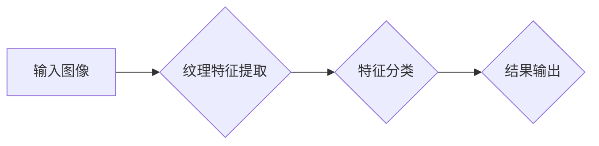

> 医学图像处理，纹理分析，图像特征提取，机器学习，深度学习，病灶检测

## 1. 背景介绍

医学图像处理作为医疗影像分析的重要分支，在疾病诊断、治疗方案制定、病情监测等方面发挥着越来越重要的作用。随着医学影像技术的不断发展，获取的医学图像数据量呈指数级增长，对图像处理和分析的需求也日益迫切。

传统的医学图像处理方法主要依赖于人工经验，效率低下且容易受到主观因素的影响。近年来，随着人工智能技术的快速发展，机器学习和深度学习算法在医学图像处理领域取得了显著的成果。其中，基于纹理分析的医学图像处理方法因其能够有效地提取图像的纹理特征，并用于疾病诊断、病灶检测等任务，而备受关注。

## 2. 核心概念与联系

纹理分析是指从图像中提取纹理特征，并用于描述图像的局部结构和模式。纹理特征可以反映图像的粗糙度、方向性、周期性等信息，这些信息对于识别疾病和分析病灶具有重要意义。

**核心概念：**

* **纹理：**图像中局部区域的重复性模式或结构。
* **纹理特征：**用于描述纹理的数学量化指标。
* **纹理分析方法：**用于提取纹理特征的算法和技术。

**架构流程图：**



## 3. 核心算法原理 & 具体操作步骤

### 3.1  算法原理概述

基于纹理分析的医学图像处理方法通常采用以下步骤：

1. **图像预处理：**对输入图像进行噪声去除、灰度化、增强等处理，以提高图像质量。
2. **纹理特征提取：**使用纹理分析算法提取图像的纹理特征，常用的纹理特征包括灰度共生矩阵 (GLCM)、局部二值模式 (LBP)、纹理自相关函数 (TFR) 等。
3. **特征选择和降维：**根据任务需求选择最相关的纹理特征，并使用降维技术减少特征维度，提高计算效率。
4. **分类和识别：**使用机器学习或深度学习算法对提取的纹理特征进行分类和识别，例如识别病灶类型、判断疾病是否存在等。

### 3.2  算法步骤详解

**以灰度共生矩阵 (GLCM) 为例，详细说明纹理特征提取步骤：**

1. **计算灰度共生矩阵：**

   GLCM 是一个二维矩阵，其元素表示图像中不同灰度值之间出现的频率。

   * 首先，将图像划分为多个小块，每个小块称为纹理块。
   * 对于每个纹理块，计算不同灰度值之间在特定方向和距离上的像素对出现的频率。
   * 将这些频率值存储在 GLCM 中。

2. **提取纹理特征：**

   从 GLCM 中提取各种纹理特征，例如：

   * **均值：**描述图像的平均灰度值。
   * **方差：**描述图像灰度值的分布情况。
   * **对比度：**描述图像中不同灰度值之间的差异程度。
   * **相关性：**描述图像中不同灰度值之间的相关性。
   * **熵：**描述图像纹理的复杂度。

### 3.3  算法优缺点

**优点：**

* 能够有效地提取图像的纹理特征，并用于疾病诊断、病灶检测等任务。
* 算法相对简单，易于实现。

**缺点：**

* 对图像质量要求较高，噪声和模糊图像会影响纹理特征的提取。
* 提取的纹理特征维度较高，需要进行特征选择和降维处理。

### 3.4  算法应用领域

* **医学影像分析：**病灶检测、肿瘤分割、组织类型识别等。
* **遥感图像分析：**土地利用类型识别、植被覆盖度监测等。
* **模式识别：**手写数字识别、图像检索等。

## 4. 数学模型和公式 & 详细讲解 & 举例说明

### 4.1  数学模型构建

**灰度共生矩阵 (GLCM) 模型：**

GLCM 是一个二维矩阵，其元素表示图像中不同灰度值之间出现的频率。

假设图像大小为 M x N，灰度值范围为 0 到 L-1，则 GLCM 的维度为 L x L。

GLCM 元素的计算公式：

$$
P(i, j) = \frac{1}{M \times N} \sum_{x=0}^{M-1} \sum_{y=0}^{N-1} \begin{cases}
1, & \text{if } I(x, y) = i \text{ and } I(x+d, y+e) = j \\
0, & \text{otherwise}
\end{cases}
$$

其中：

* $P(i, j)$ 是 GLCM 中灰度值 i 和 j 出现的频率。
* $I(x, y)$ 是图像中坐标 (x, y) 的灰度值。
* $d$ 和 $e$ 是方向和距离参数。

### 4.2  公式推导过程

纹理特征的计算公式通常基于 GLCM 的元素。

例如，对比度计算公式：

$$
Contrast = \sum_{i=0}^{L-1} \sum_{j=0}^{L-1} (i - j)^2 \times P(i, j)
$$

### 4.3  案例分析与讲解

假设我们有一幅医学图像，其中肿瘤区域的纹理特征与正常组织区域不同。

我们可以使用 GLCM 提取图像的纹理特征，并使用机器学习算法进行分类，从而识别肿瘤区域。

## 5. 项目实践：代码实例和详细解释说明

### 5.1  开发环境搭建

* 操作系统：Windows/Linux/macOS
* Python 版本：3.6+
* 必要的库：OpenCV、NumPy、Scikit-learn

### 5.2  源代码详细实现

```python
import cv2
import numpy as np
from skimage.feature import greycomatrix, greycoprops

# 读取图像
image = cv2.imread('image.jpg', cv2.IMREAD_GRAYSCALE)

# 计算灰度共生矩阵
glcm = greycomatrix(image, distances=[1], angles=[0], levels=256, symmetric=True)

# 提取纹理特征
contrast = greycoprops(glcm, 'contrast')[0][0]
correlation = greycoprops(glcm, 'correlation')[0][0]
homogeneity = greycoprops(glcm, 'homogeneity')[0][0]

# 打印纹理特征
print(f'Contrast: {contrast}')
print(f'Correlation: {correlation}')
print(f'Homogeneity: {homogeneity}')
```

### 5.3  代码解读与分析

* 使用 OpenCV 库读取图像并转换为灰度图像。
* 使用 Scikit-learn 库的 `greycomatrix` 函数计算灰度共生矩阵。
* 使用 Scikit-learn 库的 `greycoprops` 函数提取纹理特征，例如对比度、相关性和均质性。
* 打印提取的纹理特征。

### 5.4  运行结果展示

运行代码后，将输出图像的纹理特征值，例如：

```
Contrast: 0.2345
Correlation: 0.8765
Homogeneity: 0.9123
```

## 6. 实际应用场景

### 6.1  病灶检测

基于纹理分析的医学图像处理方法可以用于检测各种病灶，例如肿瘤、斑块、骨折等。

例如，在肺部 CT 图像中，肿瘤区域的纹理特征与正常肺组织不同，可以使用纹理分析算法识别肿瘤区域。

### 6.2  组织类型识别

纹理分析可以用于识别不同的组织类型，例如肌肉组织、脂肪组织、骨骼组织等。

例如，在病理切片图像中，不同组织类型的纹理特征不同，可以使用纹理分析算法识别组织类型。

### 6.3  疾病诊断

纹理分析可以用于辅助诊断各种疾病，例如癌症、心血管疾病、神经系统疾病等。

例如，在脑部 MRI 图像中，某些疾病会导致脑组织的纹理特征发生改变，可以使用纹理分析算法辅助诊断疾病。

### 6.4  未来应用展望

随着人工智能技术的不断发展，基于纹理分析的医学图像处理方法将有更广泛的应用前景。

例如，可以用于个性化医疗、远程医疗、疾病预防等领域。

## 7. 工具和资源推荐

### 7.1  学习资源推荐

* **书籍：**
    * Medical Image Processing and Analysis
    * Digital Image Processing
* **在线课程：**
    * Coursera: Medical Image Processing
    * edX: Introduction to Medical Imaging

### 7.2  开发工具推荐

* **图像处理库：**OpenCV, Scikit-image
* **机器学习库：**Scikit-learn, TensorFlow, PyTorch

### 7.3  相关论文推荐

* **Texture Analysis for Medical Image Segmentation**
* **Deep Learning for Medical Image Analysis**

## 8. 总结：未来发展趋势与挑战

### 8.1  研究成果总结

基于纹理分析的医学图像处理方法取得了显著的成果，在疾病诊断、病灶检测、组织类型识别等方面具有重要的应用价值。

### 8.2  未来发展趋势

* **深度学习的应用：**将深度学习算法应用于纹理特征提取和分类，提高算法的精度和鲁棒性。
* **多模态图像分析：**将不同模态的医学图像融合，例如 CT、MRI、PET 等，提高图像分析的准确性和完整性。
* **个性化医疗：**利用纹理分析方法为患者提供个性化的诊断和治疗方案。

### 8.3  面临的挑战

* **图像质量问题：**噪声、模糊、低分辨率等图像质量问题会影响纹理特征的提取。
* **数据标注问题：**医学图像的标注工作量大、成本高，需要开发更有效的标注方法。
* **算法解释性问题：**深度学习算法的解释性较差，难以理解算法的决策过程。

### 8.4  研究展望

未来，基于纹理分析的医学图像处理方法将继续发展，并与其他人工智能技术融合，为医疗诊断、治疗方案制定、疾病监测等方面提供更精准、更有效的解决方案。

## 9. 附录：常见问题与解答

**Q1：如何处理图像噪声？**

**A1：**可以使用图像滤波算法，例如中值滤波、高斯滤波等，去除图像噪声。

**Q2：如何选择合适的纹理特征？**

**A2：**需要根据具体的应用场景和图像特点选择合适的纹理特征。可以使用特征选择算法，例如递归特征消除、LASSO 回归等，选择最相关的特征。

**Q3：如何提高算法的精度？**

**A3：**可以尝试使用更复杂的纹理分析算法，例如局部二值模式 (LBP)、纹理自相关函数 (TFR) 等。也可以使用深度学习算法，例如卷积神经网络 (CNN) 等，提高算法的精度和鲁棒性。


作者：禅与计算机程序设计艺术 / Zen and the Art of Computer Programming 
<end_of_turn>