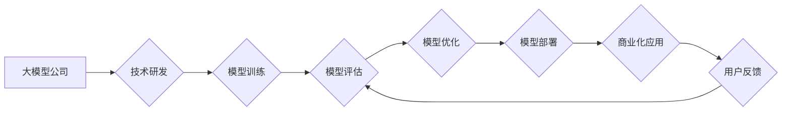

> 大模型、中国市场、市场策略、人工智能、深度学习、商业模式

## 1. 背景介绍

近年来，人工智能（AI）技术取得了飞速发展，其中大模型（Large Language Model，LLM）作为AI领域的重要突破口，展现出强大的学习和推理能力，在自然语言处理、图像识别、代码生成等领域取得了令人瞩目的成果。

中国作为全球最大的AI市场之一，在推动大模型技术发展和应用方面也展现出强大的实力。众多国内科技巨头和初创公司纷纷投入大模型的研发和应用，形成了蓬勃发展的生态系统。

然而，大模型公司在中国的市场竞争也日益激烈，如何制定有效的市场策略，才能在激烈的竞争中脱颖而出，成为关键问题。

## 2. 核心概念与联系

**2.1 大模型概述**

大模型是指参数规模庞大、训练数据海量的人工智能模型，通常拥有数十亿甚至数千亿个参数。其强大的学习能力使其能够处理复杂的任务，并生成高质量的输出。

**2.2 中国大模型发展现状**

中国在大模型领域取得了显著进展，涌现出许多优秀的代表性模型，例如：

* **百度文心一言（ERNIE Bot）:** 百度自主研发的通用AI，具备强大的对话能力和文本生成能力。
* **阿里达摩院的“帕米”:** 阿里巴巴旗下达摩院研发的通用AI，专注于多模态理解和生成。
* **华为的“盘古”:** 华为自主研发的通用AI，在自然语言理解、机器翻译等领域表现出色。

**2.3 市场竞争格局**

中国大模型市场竞争激烈，主要参与者包括：

* **科技巨头:** 百度、阿里巴巴、腾讯、华为等科技巨头拥有强大的技术实力和资源优势。
* **初创公司:** 一批专注于大模型研发的初创公司也涌现出来，例如：旷视科技、商汤科技等。
* **研究机构:** 高校和科研机构也在积极推动大模型技术发展。

**2.4 市场趋势**

* **垂直领域应用:** 大模型将逐渐向垂直领域应用拓展，例如医疗、教育、金融等。
* **模型开放化:** 大模型的开源和开放化趋势将更加明显，促进产业生态的繁荣发展。
* **监管政策:** 中国政府将加强对大模型的监管，确保其安全、可靠和伦理合规。

**2.5 Mermaid 流程图**



## 3. 核心算法原理 & 具体操作步骤

**3.1 算法原理概述**

大模型的训练主要基于深度学习算法，其中Transformer模型是目前最主流的架构。Transformer模型通过自注意力机制（Self-Attention）和多头注意力机制（Multi-Head Attention）来捕捉文本序列中的长距离依赖关系，从而实现更准确的理解和生成。

**3.2 算法步骤详解**

1. **数据预处理:** 将原始文本数据进行清洗、分词、标记等预处理操作，使其能够被模型理解。
2. **模型构建:** 根据Transformer模型架构，构建模型结构，包括编码器（Encoder）、解码器（Decoder）和注意力机制等模块。
3. **模型训练:** 使用大规模训练数据，通过反向传播算法（Backpropagation）和梯度下降算法（Gradient Descent）来训练模型参数，使其能够生成准确的输出。
4. **模型评估:** 使用测试数据对模型进行评估，衡量模型的性能，例如准确率、召回率、F1-score等指标。
5. **模型优化:** 根据评估结果，对模型结构、训练参数等进行优化，提高模型性能。

**3.3 算法优缺点**

**优点:**

* 强大的学习能力，能够处理复杂的任务。
* 能够捕捉文本序列中的长距离依赖关系。
* 在自然语言处理、图像识别、代码生成等领域取得了显著成果。

**缺点:**

* 训练成本高，需要大量的计算资源和训练数据。
* 模型参数量大，部署和推理效率较低。
* 存在潜在的偏差和风险，需要进行伦理和安全评估。

**3.4 算法应用领域**

* 自然语言处理：文本分类、情感分析、机器翻译、对话系统等。
* 图像识别：图像分类、目标检测、图像分割等。
* 代码生成：自动生成代码、代码修复等。
* 其他领域：药物研发、金融预测、科学研究等。

## 4. 数学模型和公式 & 详细讲解 & 举例说明

**4.1 数学模型构建**

Transformer模型的核心是自注意力机制，其数学模型可以表示为：

$$
Attention(Q, K, V) = softmax(\frac{QK^T}{\sqrt{d_k}})V
$$

其中：

* $Q$：查询矩阵
* $K$：键矩阵
* $V$：值矩阵
* $d_k$：键向量的维度
* $softmax$：softmax函数

**4.2 公式推导过程**

自注意力机制通过计算查询向量与键向量的点积，并使用softmax函数进行归一化，得到每个键向量的重要性权重。然后，将这些权重与值向量相乘，得到最终的注意力输出。

**4.3 案例分析与讲解**

假设我们有一个句子“我爱学习编程”，将其转换为词向量表示，则查询矩阵 $Q$、键矩阵 $K$ 和值矩阵 $V$ 如下所示：

* $Q$：[[0.1, 0.2, 0.3], [0.4, 0.5, 0.6], [0.7, 0.8, 0.9]]
* $K$：[[0.2, 0.3, 0.4], [0.5, 0.6, 0.7], [0.8, 0.9, 1.0]]
* $V$：[[0.9, 0.8, 0.7], [0.6, 0.5, 0.4], [0.3, 0.2, 0.1]]

通过计算 $QK^T$、softmax 函数和 $V$ 的乘积，可以得到每个词向量在句子中的注意力权重和最终的注意力输出。

## 5. 项目实践：代码实例和详细解释说明

**5.1 开发环境搭建**

* 操作系统：Ubuntu 20.04
* Python 版本：3.8
* 框架：PyTorch 1.8

**5.2 源代码详细实现**

```python
import torch
import torch.nn as nn

class Transformer(nn.Module):
    def __init__(self, vocab_size, embedding_dim, num_heads, num_layers):
        super(Transformer, self).__init__()
        self.embedding = nn.Embedding(vocab_size, embedding_dim)
        self.transformer_layers = nn.ModuleList([
            nn.TransformerEncoderLayer(embedding_dim, num_heads)
            for _ in range(num_layers)
        ])
        self.linear = nn.Linear(embedding_dim, vocab_size)

    def forward(self, x):
        x = self.embedding(x)
        for layer in self.transformer_layers:
            x = layer(x)
        x = self.linear(x)
        return x
```

**5.3 代码解读与分析**

* `__init__` 方法：初始化模型参数，包括词嵌入层、Transformer编码器层和线性输出层。
* `forward` 方法：定义模型的正向传播过程，将输入序列经过词嵌入层、Transformer编码器层和线性输出层，最终得到输出序列。

**5.4 运行结果展示**

通过训练和测试，可以评估模型的性能，例如准确率、困惑度等指标。

## 6. 实际应用场景

**6.1 文本生成**

大模型可以用于生成各种类型的文本，例如：

* **小说、诗歌、剧本等创意写作**
* **新闻报道、文章摘要、产品描述等内容创作**
* **聊天机器人、虚拟助手等对话系统**

**6.2 机器翻译**

大模型可以实现高质量的机器翻译，例如：

* **将中文翻译成英文、法文、日文等多种语言**
* **支持多种语言之间的翻译**
* **能够理解语境和文化差异，进行更准确的翻译**

**6.3 代码生成**

大模型可以自动生成代码，例如：

* **根据自然语言描述生成代码**
* **自动完成代码补全**
* **帮助程序员提高开发效率**

**6.4 未来应用展望**

大模型的应用场景还在不断拓展，未来将应用于更多领域，例如：

* **医疗诊断、药物研发**
* **金融预测、风险管理**
* **教育教学、个性化学习**

## 7. 工具和资源推荐

**7.1 学习资源推荐**

* **书籍:**
    * 《深度学习》
    * 《自然语言处理》
    * 《Transformer模型详解》
* **在线课程:**
    * Coursera: 深度学习
    * Udacity: 自然语言处理
    * fast.ai: 深度学习

**7.2 开发工具推荐**

* **框架:** PyTorch, TensorFlow
* **库:** HuggingFace Transformers, OpenAI API
* **平台:** Google Colab, Paperspace Gradient

**7.3 相关论文推荐**

* 《Attention Is All You Need》
* 《BERT: Pre-training of Deep Bidirectional Transformers for Language Understanding》
* 《GPT-3: Language Models are Few-Shot Learners》

## 8. 总结：未来发展趋势与挑战

**8.1 研究成果总结**

近年来，大模型技术取得了显著进展，在自然语言处理、图像识别、代码生成等领域取得了突破性成果。

**8.2 未来发展趋势**

* **模型规模进一步扩大:** 模型参数规模将继续增长，从而提升模型的性能。
* **多模态理解和生成:** 大模型将能够理解和生成多种模态数据，例如文本、图像、音频等。
* **个性化定制:** 大模型将能够根据用户的需求进行个性化定制，提供更精准的服务。

**8.3 面临的挑战**

* **训练成本高:** 大模型的训练需要大量的计算资源和时间，成本较高。
* **数据安全和隐私:** 大模型的训练需要大量数据，如何保证数据安全和隐私是一个重要挑战。
* **伦理和社会影响:** 大模型的应用可能带来伦理和社会问题，需要进行深入研究和探讨。

**8.4 研究展望**

未来，大模型技术将继续发展，并应用于更多领域，为人类社会带来更多福祉。

## 9. 附录：常见问题与解答

**9.1 如何选择合适的模型架构？**

选择合适的模型架构取决于具体的应用场景和数据特点。

**9.2 如何训练大模型？**

训练大模型需要强大的计算资源和大量数据。

**9.3 如何评估大模型的性能？**

可以使用准确率、困惑度等指标来评估大模型的性能。


作者：禅与计算机程序设计艺术 / Zen and the Art of Computer Programming 
<end_of_turn>