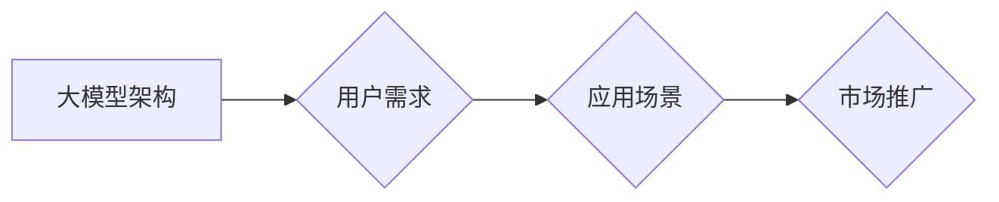

> 大模型、用户需求、市场推广、应用场景、技术挑战、未来趋势

## 1. 背景介绍

近年来，深度学习技术取得了飞速发展，大模型（Large Language Model，LLM）作为其重要分支，展现出强大的学习和推理能力，在自然语言处理、计算机视觉、代码生成等领域取得了突破性进展。从 GPT-3 到 LaMDA，再到近期火爆的 ChatGPT，大模型的应用场景不断拓展，也引发了广泛的关注和讨论。

然而，大模型的强大能力并不意味着其可以直接应用于所有场景。如何满足不同用户需求，并将其有效推广到市场，是当前大模型发展面临的重要挑战。

## 2. 核心概念与联系

大模型的核心概念在于其规模庞大，参数数量远超传统模型，能够学习更复杂的模式和关系。其架构通常基于 Transformer 网络，并通过海量数据进行预训练，从而获得强大的泛化能力。

**大模型的架构与用户需求之间的关系**



大模型的架构决定了其能力和应用范围，而用户需求则指明了大模型的应用场景和功能要求。通过理解用户需求，我们可以设计更合适的模型架构和训练策略，从而开发出更具价值的应用。

## 3. 核心算法原理 & 具体操作步骤

### 3.1  算法原理概述

大模型的核心算法是 Transformer 网络，其主要特点是利用注意力机制，能够捕捉文本序列中长距离依赖关系。

Transformer 网络由编码器和解码器两部分组成。编码器将输入文本序列编码成向量表示，解码器则根据编码后的向量生成输出文本序列。

### 3.2  算法步骤详解

1. **词嵌入:** 将输入文本中的每个词转换为向量表示。
2. **编码器:** 将词向量输入到编码器中，通过多层 Transformer 块进行处理，最终得到文本序列的隐藏状态表示。
3. **解码器:** 将隐藏状态表示输入到解码器中，通过多层 Transformer 块进行处理，并生成输出文本序列。
4. **输出层:** 将解码器输出的向量表示转换为概率分布，预测下一个词。

### 3.3  算法优缺点

**优点:**

* 能够捕捉长距离依赖关系，提升文本理解能力。
* 并行训练效率高，能够训练规模庞大的模型。

**缺点:**

* 计算量大，训练成本高。
* 对训练数据质量要求高。

### 3.4  算法应用领域

* 自然语言处理：文本生成、机器翻译、问答系统等。
* 计算机视觉：图像识别、目标检测等。
* 代码生成：自动生成代码、代码修复等。

## 4. 数学模型和公式 & 详细讲解 & 举例说明

### 4.1  数学模型构建

Transformer 网络的核心是注意力机制，其数学模型可以表示为：

$$
Attention(Q, K, V) = softmax(\frac{QK^T}{\sqrt{d_k}})V
$$

其中：

* $Q$：查询矩阵
* $K$：键矩阵
* $V$：值矩阵
* $d_k$：键向量的维度

### 4.2  公式推导过程

注意力机制的目的是计算每个查询词与所有键词之间的相关性，并根据相关性加权求和得到最终的输出。

softmax 函数将相关性分数转换为概率分布，使得每个键词的权重在 0 到 1 之间。

### 4.3  案例分析与讲解

例如，在机器翻译任务中，查询词为源语言中的词，键词和值词为目标语言中的词。注意力机制可以计算查询词与目标语言词之间的相关性，并根据相关性选择最合适的翻译词。

## 5. 项目实践：代码实例和详细解释说明

### 5.1  开发环境搭建

使用 Python 语言和 PyTorch 或 TensorFlow 深度学习框架进行开发。

### 5.2  源代码详细实现

```python
import torch
import torch.nn as nn

class Transformer(nn.Module):
    def __init__(self, vocab_size, embedding_dim, num_heads, num_layers):
        super(Transformer, self).__init__()
        self.embedding = nn.Embedding(vocab_size, embedding_dim)
        self.transformer_layers = nn.ModuleList([
            nn.TransformerEncoderLayer(embedding_dim, num_heads)
            for _ in range(num_layers)
        ])
        self.linear = nn.Linear(embedding_dim, vocab_size)

    def forward(self, x):
        x = self.embedding(x)
        for layer in self.transformer_layers:
            x = layer(x)
        x = self.linear(x)
        return x
```

### 5.3  代码解读与分析

代码实现了一个基本的 Transformer 模型，包含词嵌入层、Transformer 层和输出层。

词嵌入层将输入词转换为向量表示。

Transformer 层由多个 Transformer Encoder Layer 组成，每个 Encoder Layer 包含多头注意力机制和前馈神经网络。

输出层将 Transformer 层的输出转换为概率分布，预测下一个词。

### 5.4  运行结果展示

训练好的模型可以用于文本生成、机器翻译等任务。

## 6. 实际应用场景

### 6.1  自然语言处理

* **文本生成:** 大模型可以用于生成各种类型的文本，例如小说、诗歌、新闻报道等。
* **机器翻译:** 大模型可以实现高质量的机器翻译，跨越语言障碍。
* **问答系统:** 大模型可以理解用户的问题，并从知识库中找到答案。

### 6.2  计算机视觉

* **图像识别:** 大模型可以识别图像中的物体、场景和人物。
* **目标检测:** 大模型可以定位图像中的特定物体。

### 6.3  代码生成

* **自动代码生成:** 大模型可以根据自然语言描述自动生成代码。
* **代码修复:** 大模型可以识别代码中的错误并提供修复建议。

### 6.4  未来应用展望

大模型的应用场景还在不断拓展，未来可能应用于：

* **个性化教育:** 根据学生的学习情况提供个性化的学习内容和辅导。
* **医疗诊断:** 辅助医生进行疾病诊断和治疗方案制定。
* **科学研究:** 加速科学研究的进程，例如药物研发、材料科学等。

## 7. 工具和资源推荐

### 7.1  学习资源推荐

* **书籍:**
    * 《深度学习》
    * 《自然语言处理》
* **在线课程:**
    * Coursera
    * edX
* **博客和论坛:**
    * Hugging Face
    * TensorFlow Blog

### 7.2  开发工具推荐

* **Python:** 
* **PyTorch:** 
* **TensorFlow:** 
* **Hugging Face Transformers:**

### 7.3  相关论文推荐

* **Attention Is All You Need:** https://arxiv.org/abs/1706.03762
* **BERT: Pre-training of Deep Bidirectional Transformers for Language Understanding:** https://arxiv.org/abs/1810.04805

## 8. 总结：未来发展趋势与挑战

### 8.1  研究成果总结

大模型在自然语言处理、计算机视觉等领域取得了显著进展，展现出强大的学习和推理能力。

### 8.2  未来发展趋势

* **模型规模进一步扩大:** 随着计算能力的提升，大模型的规模将继续扩大，学习能力将进一步增强。
* **多模态学习:** 大模型将融合文本、图像、音频等多模态数据，实现更全面的理解和生成。
* **可解释性增强:** 研究如何提高大模型的可解释性，使其决策过程更加透明。

### 8.3  面临的挑战

* **训练成本高:** 训练大模型需要大量的计算资源和时间，成本较高。
* **数据安全和隐私:** 大模型的训练需要海量数据，如何保证数据安全和隐私是一个重要问题。
* **伦理问题:** 大模型的应用可能带来伦理问题，例如信息操纵、偏见放大等，需要谨慎对待。

### 8.4  研究展望

未来，大模型研究将继续深入，探索其更广泛的应用场景，并解决其面临的挑战，推动人工智能技术的发展。

## 9. 附录：常见问题与解答

### 9.1  常见问题

* **大模型的训练需要多少数据？**
* **如何评估大模型的性能？**
* **如何部署大模型？**

### 9.2  解答

* **大模型的训练需要海量数据，通常需要数十亿甚至上百亿个样本。**
* **大模型的性能可以评估指标，例如准确率、召回率、F1-score等。**
* **大模型的部署可以采用云计算、边缘计算等方式。**


作者：禅与计算机程序设计艺术 / Zen and the Art of Computer Programming 
<end_of_turn>