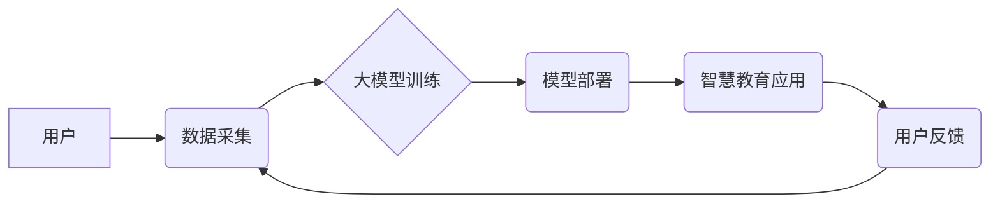

> 大模型、智慧教育、学习体验、人工智能、教育科技、创业机会

## 1. 背景介绍

教育，作为人类文明的基石，一直以来都扮演着至关重要的角色。随着科技的飞速发展，人工智能（AI）技术逐渐渗透到各个领域，教育领域也不例外。大模型，作为AI技术的代表，凭借其强大的学习能力和泛化能力，为智慧教育的建设提供了强大的技术支撑。

近年来，大模型在自然语言处理、图像识别、语音合成等领域取得了突破性进展，其应用场景也日益广泛。在教育领域，大模型可以被用于个性化学习、智能辅导、自动批改、教学资源生成等方面，极大地提升了学习效率和体验。

## 2. 核心概念与联系

**2.1 大模型概述**

大模型是指参数规模庞大、训练数据海量的人工智能模型。这些模型通过学习海量数据，能够掌握复杂的知识和模式，并应用于各种任务。

**2.2 智慧教育概述**

智慧教育是指利用信息技术和人工智能技术，构建智能化、个性化、高效化的教育体系。其目标是通过数据分析、智能推荐、个性化学习等手段，提升教育质量，满足不同学生的需求。

**2.3 核心概念联系**

大模型为智慧教育提供了强大的技术支撑。通过大模型的学习和推理能力，可以实现以下功能：

* **个性化学习:** 根据学生的学习进度、能力和兴趣，定制个性化的学习路径和内容。
* **智能辅导:** 提供实时在线辅导，解答学生疑问，帮助学生理解知识点。
* **自动批改:** 自动批改作业，提供反馈和建议，提高效率。
* **教学资源生成:** 生成个性化的学习材料，如习题、案例、视频等。

**2.4 核心架构**



## 3. 核心算法原理 & 具体操作步骤

**3.1 算法原理概述**

大模型的训练主要基于深度学习算法，其中Transformer模型是目前最流行的架构之一。Transformer模型通过自注意力机制，能够捕捉文本中的长距离依赖关系，从而实现更准确的理解和生成。

**3.2 算法步骤详解**

1. **数据预处理:** 将原始数据进行清洗、格式化和编码，使其适合模型训练。
2. **模型构建:** 根据任务需求，选择合适的Transformer模型架构，并设置模型参数。
3. **模型训练:** 使用训练数据，通过反向传播算法，调整模型参数，使其能够准确地完成任务。
4. **模型评估:** 使用测试数据，评估模型的性能，并根据评估结果进行模型调优。
5. **模型部署:** 将训练好的模型部署到服务器或云平台，使其能够提供服务。

**3.3 算法优缺点**

**优点:**

* 强大的学习能力，能够捕捉复杂的知识和模式。
* 泛化能力强，能够应用于多种任务。
* 持续改进，随着训练数据的增加，模型性能不断提升。

**缺点:**

* 训练成本高，需要大量的计算资源和时间。
* 数据依赖性强，模型性能受训练数据质量影响。
* 可解释性差，难以理解模型的决策过程。

**3.4 算法应用领域**

* 自然语言处理：文本分类、情感分析、机器翻译、对话系统等。
* 图像识别：物体检测、图像分类、图像生成等。
* 语音识别：语音转文本、语音合成等。
* 教育领域：个性化学习、智能辅导、自动批改等。

## 4. 数学模型和公式 & 详细讲解 & 举例说明

**4.1 数学模型构建**

Transformer模型的核心是自注意力机制，其数学模型可以表示为：

$$
Attention(Q, K, V) = \frac{exp(Q \cdot K^T / \sqrt{d_k})}{exp(Q \cdot K^T / \sqrt{d_k})} \cdot V
$$

其中：

* $Q$：查询矩阵
* $K$：键矩阵
* $V$：值矩阵
* $d_k$：键向量的维度

**4.2 公式推导过程**

自注意力机制通过计算查询向量与键向量的点积，来衡量它们之间的相关性。点积结果经过softmax归一化，得到每个键向量的权重，然后将权重与值向量相乘，得到最终的输出。

**4.3 案例分析与讲解**

假设我们有一个句子：“我爱学习编程”。

* $Q$：查询向量表示每个词语的含义。
* $K$：键向量表示每个词语的特征。
* $V$：值向量表示每个词语的语义信息。

通过自注意力机制，模型可以计算出每个词语与其他词语之间的相关性，例如，“学习”与“编程”之间的相关性较高。

## 5. 项目实践：代码实例和详细解释说明

**5.1 开发环境搭建**

* Python 3.7+
* TensorFlow/PyTorch
* CUDA/cuDNN

**5.2 源代码详细实现**

```python
import tensorflow as tf

# 定义Transformer模型
class Transformer(tf.keras.Model):
    def __init__(self, vocab_size, embedding_dim, num_heads, num_layers):
        super(Transformer, self).__init__()
        self.embedding = tf.keras.layers.Embedding(vocab_size, embedding_dim)
        self.transformer_layers = tf.keras.layers.StackedRNNCells([
            tf.keras.layers.MultiHeadAttention(num_heads=num_heads, key_dim=embedding_dim)
            for _ in range(num_layers)
        ])

    def call(self, inputs):
        embeddings = self.embedding(inputs)
        outputs = self.transformer_layers(embeddings)
        return outputs

# 实例化模型
model = Transformer(vocab_size=10000, embedding_dim=128, num_heads=8, num_layers=6)

# 训练模型
model.compile(optimizer='adam', loss='mse')
model.fit(train_data, train_labels, epochs=10)
```

**5.3 代码解读与分析**

* 模型定义：定义了一个Transformer模型，包含嵌入层、多头注意力层和堆叠的RNN单元。
* 训练模型：使用Adam优化器和均方误差损失函数训练模型。

**5.4 运行结果展示**

训练完成后，可以将模型应用于文本生成、机器翻译等任务，并评估模型的性能。

## 6. 实际应用场景

**6.1 个性化学习**

大模型可以根据学生的学习进度、能力和兴趣，定制个性化的学习路径和内容。例如，可以根据学生的数学水平，推荐不同的数学练习题，或者根据学生的阅读理解能力，推荐不同的阅读材料。

**6.2 智能辅导**

大模型可以提供实时在线辅导，解答学生疑问，帮助学生理解知识点。例如，学生在学习编程时遇到问题，可以向智能辅导系统提问，系统会根据学生的提问，提供相应的解释和代码示例。

**6.3 自动批改**

大模型可以自动批改作业，提供反馈和建议，提高效率。例如，可以利用大模型自动批改学生的作文，并给出具体的修改建议。

**6.4 教学资源生成**

大模型可以生成个性化的学习材料，如习题、案例、视频等。例如，可以利用大模型生成针对特定知识点的习题，或者生成针对特定主题的案例分析。

**6.5 未来应用展望**

随着大模型技术的不断发展，其在教育领域的应用将更加广泛和深入。例如，可以利用大模型构建虚拟老师，为学生提供个性化的教学服务；可以利用大模型分析学生的学习行为，预测学生的学习效果，并提供相应的干预措施；可以利用大模型生成更加生动有趣的学习内容，提高学生的学习兴趣。

## 7. 工具和资源推荐

**7.1 学习资源推荐**

* **书籍:**
    * 《深度学习》
    * 《自然语言处理》
    * 《Transformer模型详解》
* **在线课程:**
    * Coursera: 深度学习
    * edX: 自然语言处理
    * fast.ai: 深度学习

**7.2 开发工具推荐**

* **TensorFlow:** 开源深度学习框架
* **PyTorch:** 开源深度学习框架
* **HuggingFace:** 提供预训练模型和工具

**7.3 相关论文推荐**

* 《Attention Is All You Need》
* 《BERT: Pre-training of Deep Bidirectional Transformers for Language Understanding》
* 《GPT-3: Language Models are Few-Shot Learners》

## 8. 总结：未来发展趋势与挑战

**8.1 研究成果总结**

大模型在智慧教育领域取得了显著的成果，为个性化学习、智能辅导、自动批改等方面提供了强大的技术支撑。

**8.2 未来发展趋势**

* 模型规模和能力的进一步提升
* 模型的可解释性和安全性方面的研究
* 模型在更多教育场景的应用

**8.3 面临的挑战**

* 数据获取和隐私保护
* 计算资源和成本
* 模型的公平性和可访问性

**8.4 研究展望**

未来，大模型在智慧教育领域的应用将更加广泛和深入，需要进一步加强模型的安全性、可解释性和公平性研究，并探索更有效的模型训练和部署方法，以更好地服务于教育事业的发展。

## 9. 附录：常见问题与解答

**9.1 如何选择合适的模型架构？**

选择合适的模型架构取决于具体的应用场景和数据特点。对于文本生成任务，GPT模型效果较好；对于机器翻译任务，Transformer模型效果较好。

**9.2 如何训练大模型？**

训练大模型需要大量的计算资源和时间。可以使用云平台提供的GPU集群进行训练。

**9.3 如何评估大模型的性能？**

可以使用准确率、召回率、F1-score等指标评估大模型的性能。

**9.4 如何部署大模型？**

可以使用云平台提供的服务进行模型部署，也可以将模型部署到本地服务器。


作者：禅与计算机程序设计艺术 / Zen and the Art of Computer Programming 
<end_of_turn>