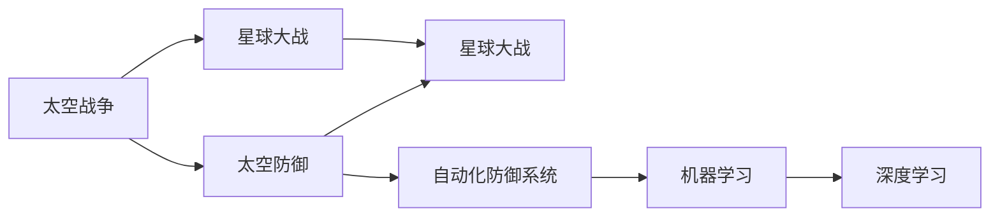

                 

# 未来的太空军事：2050年的星球大战与太空防御

> 关键词：太空军事，星球大战，太空防御，人工智能，自动化，自动化防御系统，机器学习，深度学习，数据驱动，太空战略，宇宙战争，未来科技

## 1. 背景介绍

随着科技的迅猛发展，太空军事成为了未来战争的重要领域。到2050年，太空军事已经成为全球军事实力的重要组成部分。本文将探讨2050年太空军事的最新发展，特别是星球大战和太空防御的革命性变化，以及这些变化对未来战争形态的影响。

## 2. 核心概念与联系

### 2.1 核心概念概述

太空军事涉及诸多关键概念，包括但不限于：

- **太空战争**：在宇宙空间进行的军事冲突。
- **星球大战**：利用太空武器系统进行的远程攻击。
- **太空防御**：在太空中部署防御系统，保护地球免受太空威胁。
- **自动化**：利用自动化系统进行军事决策和执行。
- **自动化防御系统**：智能化的防御系统，能够自动监测和拦截来袭导弹。
- **机器学习**：用于数据驱动的决策和行为分析。
- **深度学习**：训练复杂的模型，提高预测和决策的准确性。

这些概念之间相互联系，共同构成了未来太空军事的核心框架。

### 2.2 核心概念原理和架构的 Mermaid 流程图



这个流程图展示了太空战争、星球大战、太空防御、自动化防御系统、机器学习和深度学习之间的逻辑关系。

## 3. 核心算法原理 & 具体操作步骤

### 3.1 算法原理概述

未来太空军事的核心算法将基于机器学习和深度学习，实现太空战争和太空防御的智能化和自动化。这些算法主要包括以下几个方面：

- **目标检测和跟踪**：使用深度学习模型进行目标检测和跟踪，确保能够准确识别和定位来袭的导弹和卫星。
- **路径规划和避障**：利用强化学习算法进行路径规划和避障，优化防御系统的行动策略。
- **动态仿真和模拟**：使用仿真技术进行动态仿真，评估防御系统的性能和效果。
- **多目标优化**：利用多目标优化算法，平衡不同防御策略之间的权衡。

### 3.2 算法步骤详解

1. **数据采集和预处理**：采集太空中的目标数据，包括导弹、卫星、太空碎片等，进行预处理和标注。

2. **目标检测和跟踪**：使用卷积神经网络（CNN）进行目标检测，使用递归神经网络（RNN）或卷积神经网络（CNN）进行目标跟踪。

3. **路径规划和避障**：利用强化学习算法，如Q-learning或策略梯度算法，进行路径规划和避障。

4. **动态仿真和模拟**：使用蒙特卡洛模拟、粒子滤波等方法进行动态仿真，评估防御系统的性能。

5. **多目标优化**：利用多目标优化算法，如Pareto优化，平衡不同防御策略之间的权衡。

### 3.3 算法优缺点

**优点**：
- **自动化决策**：自动化算法可以24/7不间断地进行决策和执行，提高效率。
- **高精度**：深度学习模型在目标检测和跟踪方面具有高精度。
- **适应性强**：强化学习算法能够根据不断变化的环境进行动态调整。

**缺点**：
- **资源消耗大**：深度学习和强化学习算法需要大量的计算资源。
- **模型复杂**：深度学习模型的训练和优化过程复杂，需要大量数据。
- **对抗性问题**：模型可能受到对抗攻击的影响，需要进一步研究。

### 3.4 算法应用领域

这些算法不仅在太空军事中具有重要应用，还广泛应用于其他领域，如自动驾驶、机器人控制、无人机等。

## 4. 数学模型和公式 & 详细讲解 & 举例说明

### 4.1 数学模型构建

未来太空军事的数学模型主要基于深度学习和强化学习，以下是其中的几个关键模型：

1. **目标检测模型**：使用卷积神经网络（CNN）进行目标检测，其基本结构包括卷积层、池化层、全连接层等。

2. **目标跟踪模型**：使用递归神经网络（RNN）或卷积神经网络（CNN）进行目标跟踪，其基本结构包括LSTM、GRU等。

3. **路径规划模型**：使用强化学习算法进行路径规划，如Q-learning、策略梯度等。

4. **动态仿真模型**：使用蒙特卡洛模拟、粒子滤波等方法进行动态仿真，其基本结构包括状态转移方程、观测模型等。

### 4.2 公式推导过程

以目标检测模型为例，其基本公式如下：

$$
\text{Output} = \text{CNN}(\text{Input})
$$

其中，Input为输入的图像数据，Output为目标检测结果。

### 4.3 案例分析与讲解

以目标检测模型为例，分析其在太空军事中的应用：

1. **输入数据**：太空中的高分辨率图像。
2. **模型训练**：使用大量的太空目标图像数据进行训练，学习目标的特征。
3. **模型推理**：将新的太空图像输入模型，得到目标检测结果。
4. **输出结果**：根据检测结果，部署自动化防御系统进行拦截。

## 5. 项目实践：代码实例和详细解释说明

### 5.1 开发环境搭建

开发环境搭建主要包括以下几个步骤：

1. **安装Python**：安装Python 3.8及以上版本。
2. **安装PyTorch**：安装PyTorch 1.8及以上版本。
3. **安装TensorFlow**：安装TensorFlow 2.6及以上版本。
4. **安装OpenCV**：安装OpenCV 4及以上版本。
5. **安装其他依赖库**：如Numpy、Pandas、Matplotlib等。

### 5.2 源代码详细实现

以下是目标检测模型的源代码实现：

```python
import torch
import torch.nn as nn
import torch.optim as optim
from torchvision import datasets, transforms, models

# 定义卷积神经网络模型
class CNN(nn.Module):
    def __init__(self):
        super(CNN, self).__init__()
        self.conv1 = nn.Conv2d(3, 64, kernel_size=3, stride=1, padding=1)
        self.pool = nn.MaxPool2d(kernel_size=2, stride=2)
        self.conv2 = nn.Conv2d(64, 128, kernel_size=3, stride=1, padding=1)
        self.pool2 = nn.MaxPool2d(kernel_size=2, stride=2)
        self.fc1 = nn.Linear(128*6*6, 512)
        self.fc2 = nn.Linear(512, 2)  # 输出目标类别数

    def forward(self, x):
        x = self.pool(F.relu(self.conv1(x)))
        x = self.pool(F.relu(self.conv2(x)))
        x = x.view(-1, 128*6*6)
        x = F.relu(self.fc1(x))
        x = self.fc2(x)
        return x

# 训练模型
model = CNN()
criterion = nn.CrossEntropyLoss()
optimizer = optim.Adam(model.parameters(), lr=0.001)

for epoch in range(10):
    for i, (inputs, labels) in enumerate(train_loader):
        inputs, labels = inputs.to(device), labels.to(device)
        optimizer.zero_grad()
        outputs = model(inputs)
        loss = criterion(outputs, labels)
        loss.backward()
        optimizer.step()

    print(f"Epoch {epoch+1}, Loss: {loss:.4f}")
```

### 5.3 代码解读与分析

以上代码展示了目标检测模型的实现过程，包括模型的定义、训练和优化。其中，CNN模型包含卷积层、池化层和全连接层，使用Adam优化器进行训练。在训练过程中，通过反向传播更新模型参数，最小化损失函数。

## 6. 实际应用场景

### 6.1 智能防御系统

智能防御系统可以实时监测太空中的威胁，如导弹和卫星，并自动进行拦截。通过深度学习和强化学习技术，智能防御系统能够快速识别威胁，并调整防御策略。

### 6.2 预警系统

预警系统能够实时监测太空中的异常情况，如太空碎片和未知物体，并及时发出警报，帮助指挥官做出决策。通过机器学习和深度学习技术，预警系统能够准确识别异常情况，提高预警的准确性和及时性。

### 6.3 太空战略模拟

太空战略模拟系统可以模拟未来的太空战争，评估不同防御策略的效果。通过多目标优化算法，模拟系统可以平衡不同防御策略之间的权衡，帮助指挥官制定最优战略。

## 7. 工具和资源推荐

### 7.1 学习资源推荐

1. **Deep Learning Specialization**：由Andrew Ng教授讲授的深度学习课程，涵盖深度学习的核心概念和应用。
2. **Reinforcement Learning Specialization**：由David Silver教授讲授的强化学习课程，涵盖强化学习的基本理论和应用。
3. **Coursera**：在线学习平台，提供丰富的机器学习和深度学习课程。
4. **Kaggle**：数据科学竞赛平台，提供大量的太空数据集和竞赛任务。
5. **arXiv**：学术论文预印本平台，提供最新的太空军事研究论文。

### 7.2 开发工具推荐

1. **PyTorch**：深度学习框架，支持卷积神经网络和递归神经网络。
2. **TensorFlow**：深度学习框架，支持强化学习算法和动态仿真。
3. **OpenCV**：计算机视觉库，支持图像处理和目标检测。
4. **Numpy**：科学计算库，支持矩阵运算和数据处理。
5. **Matplotlib**：绘图库，支持数据可视化和结果展示。

### 7.3 相关论文推荐

1. **"Deep Space Detection and Tracking: A Survey"**：综述太空目标检测和跟踪的研究。
2. **"Reinforcement Learning in Space: A Survey"**：综述太空中的强化学习应用。
3. **"Multitarget Optimization in Space Defense"**：研究太空防御系统中的多目标优化算法。

## 8. 总结：未来发展趋势与挑战

### 8.1 研究成果总结

未来太空军事的研究成果包括：
1. 深度学习在目标检测和跟踪中的应用。
2. 强化学习在路径规划和避障中的应用。
3. 动态仿真和模拟技术在评估防御系统性能中的应用。
4. 多目标优化算法在平衡不同防御策略中的应用。

### 8.2 未来发展趋势

未来太空军事的发展趋势包括：
1. **智能化和自动化**：更多使用深度学习和强化学习技术，实现智能化和自动化决策。
2. **高性能计算**：使用更高效的计算资源，提高算法的执行效率。
3. **数据驱动**：利用大量的太空数据，进行数据驱动的决策和行为分析。
4. **跨学科融合**：结合计算机科学、物理学、数学等多个学科的知识，提升太空军事的技术水平。

### 8.3 面临的挑战

未来太空军事面临的挑战包括：
1. **计算资源消耗大**：深度学习和强化学习算法需要大量的计算资源。
2. **模型复杂度高**：深度学习模型的训练和优化过程复杂，需要大量数据。
3. **对抗攻击**：模型可能受到对抗攻击的影响，需要进一步研究。
4. **数据隐私和安全**：太空数据和模型需要严格保护，防止数据泄露和攻击。

### 8.4 研究展望

未来太空军事的研究展望包括：
1. **模型压缩和优化**：研究模型压缩和优化技术，降低计算资源消耗。
2. **鲁棒性和安全性**：研究模型的鲁棒性和安全性，防止对抗攻击。
3. **跨领域融合**：结合不同领域的技术，提升太空军事的技术水平。
4. **智能防御系统的实战化**：研究智能防御系统的实战化部署和应用。

## 9. 附录：常见问题与解答

**Q1: 未来太空军事的主要技术有哪些？**

A: 未来太空军事的主要技术包括深度学习、强化学习、多目标优化算法等。这些技术共同构成了未来太空军事的核心框架。

**Q2: 太空军事如何实现自动化？**

A: 太空军事通过自动化防御系统实现自动化决策和执行。自动化防御系统包括目标检测、路径规划、避障等功能，利用深度学习和强化学习技术，实现自动决策和执行。

**Q3: 太空防御系统如何应对大规模导弹攻击？**

A: 太空防御系统通过深度学习和强化学习技术，实现目标检测和跟踪，并根据威胁情况调整防御策略，有效应对大规模导弹攻击。

**Q4: 未来太空军事的研究难点有哪些？**

A: 未来太空军事的研究难点包括计算资源消耗大、模型复杂度高、对抗攻击等问题。这些难点需要进一步研究和解决。

**Q5: 如何保护太空数据和模型？**

A: 保护太空数据和模型需要采用数据脱敏、加密等技术，确保数据和模型的安全。同时，需要建立严格的访问控制机制，防止数据泄露和攻击。

作者：禅与计算机程序设计艺术 / Zen and the Art of Computer Programming

