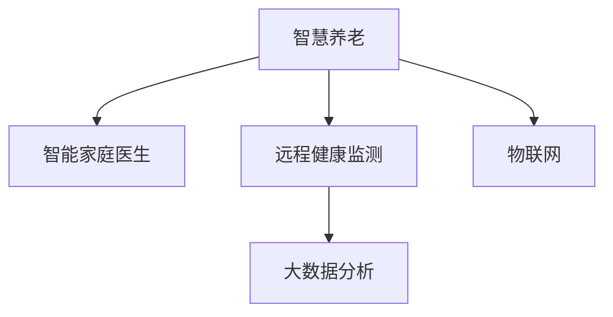

                 

# 未来的智慧养老：2050年的智能家庭医生与远程健康监测

## 1. 背景介绍

随着全球人口老龄化的加剧，传统的养老模式面临严峻挑战。在医疗资源不足、健康服务供需矛盾突出的背景下，智慧养老、智能家庭医生与远程健康监测等智能技术的应用成为关键突破口。未来，借助先进的智能技术，我们可以实现对老年人的健康实时监测、个性化健康管理，甚至在家庭环境中开展智能医疗服务，为老年人提供更加便捷、高效、全面的健康保障。

### 1.1 问题由来

随着社会发展和科技进步，老年群体在生活、医疗等方面的需求日益增加，传统的养老模式已经难以满足新时代的健康需求。家庭医生的数量有限、远程医疗技术普及不足、养老机构资源短缺等问题，使得老年人面临较大的健康风险。

### 1.2 问题核心关键点

未来智慧养老系统构建的核心，在于如何通过智能技术解决养老领域的关键痛点：
- 实时健康监测：通过智能穿戴设备和传感器，实时采集老年人的生理数据。
- 远程医疗服务：利用视频会议、远程诊断等技术，为老年人提供随时随地的医疗服务。
- 个性化健康管理：结合大数据和机器学习技术，为老年人定制个性化的健康管理方案。
- 智能家居医疗：将智能家居与医疗服务结合，为老年人提供更加便利、舒适的生活环境。

## 2. 核心概念与联系

### 2.1 核心概念概述

为更好地理解智慧养老系统构建的技术架构和方法，本节将介绍几个密切相关的核心概念：

- 智慧养老(Smart Aging)：利用物联网、人工智能等现代信息技术，提供养老服务的智能化、个性化和远程化。
- 智能家庭医生(Smart Home Doctor)：通过远程医疗、虚拟助理等技术，为老年人提供便捷的在线医疗服务。
- 远程健康监测(Remote Health Monitoring)：通过可穿戴设备和传感器，实时采集老年人的生理指标，进行健康监测和预警。
- 大数据分析(Big Data Analysis)：结合机器学习算法，从海量数据中挖掘规律，为老年人提供个性化的健康管理方案。
- 物联网(IoT)：通过互联网、传感器等技术，实现各类养老设备、家居环境的互联互通。

这些核心概念之间的逻辑关系可以通过以下Mermaid流程图来展示：



这个流程图展示了几者之间的内在联系：

1. 智慧养老是整体目标，包括智能家庭医生和远程健康监测等具体应用。
2. 智能家庭医生利用远程医疗、虚拟助理等技术，提供个性化的医疗服务。
3. 远程健康监测通过可穿戴设备和传感器，实现老年人的生理数据采集和实时监控。
4. 大数据分析基于采集的数据，挖掘规律，制定个性化的健康管理方案。
5. 物联网将各类养老设备和家居环境连接起来，实现智能化管理。

## 3. 核心算法原理 & 具体操作步骤
### 3.1 算法原理概述

未来智慧养老系统的核心算法，主要基于物联网技术、远程医疗技术和智能分析算法：

- **物联网技术**：通过传感器、智能穿戴设备等，实现对老年人健康状况的实时监测和数据采集。
- **远程医疗技术**：利用视频会议、远程诊断等手段，为老年人提供便捷的医疗服务。
- **智能分析算法**：通过大数据分析、机器学习等技术，对采集的生理数据进行分析，提供个性化的健康管理建议。

### 3.2 算法步骤详解

智能家庭医生与远程健康监测的构建，通常包括以下关键步骤：

**Step 1: 数据采集与传输**

1. **传感器部署**：在家中部署多种传感器，如血压计、心率监测器、血糖仪等，实时采集老年人的生理数据。
2. **数据传输**：传感器采集的数据通过Wi-Fi、蓝牙、LoRa等技术，传输到云端或智能设备进行处理。

**Step 2: 数据存储与分析**

1. **数据存储**：将传输来的生理数据存储在云端数据库中，以便后续分析和调用。
2. **数据分析**：利用大数据分析和机器学习算法，对数据进行实时分析和预测，生成个性化的健康管理方案。

**Step 3: 远程医疗服务**

1. **视频会议系统**：为老年人提供远程视频会议系统，与家庭医生进行实时沟通。
2. **远程诊断**：通过AI辅助诊断技术，家庭医生可以快速判断老年人的健康状况，提供初步诊断和治疗建议。

**Step 4: 个性化健康管理**

1. **健康管理方案制定**：结合大数据分析结果，为老年人制定个性化的健康管理方案。
2. **智能提醒**：通过智能提醒系统，定时发送健康提醒和健康管理建议。

### 3.3 算法优缺点

智能家庭医生与远程健康监测的优势包括：
- 实时监测：通过传感器和智能穿戴设备，实现对老年人健康状况的实时监控，及时发现异常。
- 便捷医疗：老年人无需前往医院，即可通过视频会议等方式获得医疗服务。
- 个性化管理：基于大数据分析，为老年人制定个性化的健康管理方案，提高管理效果。

同时，该方法也存在一些局限性：
- 设备依赖：需要大量的智能设备和传感器，成本较高。
- 数据隐私：生理数据的采集和传输可能涉及隐私问题，需注意数据安全。
- 算法局限：受限于算法的精度和稳定性，部分复杂疾病的诊断仍需人工介入。

### 3.4 算法应用领域

未来智慧养老系统在多个领域具有广泛应用前景：

- 智慧社区：将智能设备和传感器部署在社区中，实现对老年群体的集体健康监测和管理。
- 居家养老：在家中安装智能设备和系统，为老年人提供便利的生活和健康服务。
- 养老机构：在养老机构中，通过物联网和远程医疗技术，提升养老服务质量和效率。
- 健康管理：结合大数据分析和个性化健康管理，为老年人提供全方位的健康管理服务。

## 4. 数学模型和公式 & 详细讲解  
### 4.1 数学模型构建

本节将使用数学语言对智慧养老系统构建的算法进行更加严格的刻画。

记生理数据序列为 $X=\{x_1,x_2,...,x_n\}$，其中 $x_i$ 为第 $i$ 次采集的生理数据，$i=1,2,...,n$。智能系统在采集 $X$ 后，通过算法 $A$ 处理得到结果 $Y=\{y_1,y_2,...,y_n\}$，其中 $y_i$ 为第 $i$ 次分析后的健康建议。

定义系统的预测误差为 $e_i=y_i-x_i$，则系统总误差为 $\sum_{i=1}^n e_i^2$。系统的优化目标是最小化总误差，即：

$$
\min_{A} \sum_{i=1}^n e_i^2
$$

假设算法 $A$ 的预测模型为 $y_i=A(x_i)$，则优化目标转化为：

$$
\min_{A} \sum_{i=1}^n (A(x_i) - x_i)^2
$$

### 4.2 公式推导过程

为了简化问题，假设 $X$ 和 $Y$ 均为连续变量，且 $A(x)$ 为线性模型。则预测模型可表示为：

$$
y_i = \theta^T x_i + b
$$

其中 $\theta$ 为模型参数，$b$ 为偏置项。代入优化目标，得：

$$
\min_{\theta,b} \sum_{i=1}^n (\theta^T x_i + b - x_i)^2
$$

对上述目标函数求导，得：

$$
\frac{\partial}{\partial \theta} \sum_{i=1}^n (\theta^T x_i + b - x_i)^2 = \sum_{i=1}^n (2x_i - 2(\theta^T x_i + b))x_i^T
$$

$$
\frac{\partial}{\partial b} \sum_{i=1}^n (\theta^T x_i + b - x_i)^2 = \sum_{i=1}^n (-2x_i + 2(\theta^T x_i + b))
$$

令导数等于零，解得：

$$
\theta = \frac{\sum_{i=1}^n (x_i x_i^T)}{\sum_{i=1}^n x_i^2}, \quad b = \frac{\sum_{i=1}^n x_i}{\sum_{i=1}^n x_i^2} - \theta^T \frac{\sum_{i=1}^n x_i x_i^T}{\sum_{i=1}^n x_i^2}
$$

即最小二乘法求解线性模型参数。

### 4.3 案例分析与讲解

以血压监测为例，分析智能系统如何通过传感器数据生成血压健康建议。

假设传感器每小时采集一次血压数据 $x_i$，$i=1,2,...,24$。智能系统通过线性模型预测 $y_i$，即 $y_i=\theta^T x_i + b$。模型参数 $\theta$ 和 $b$ 通过最小二乘法求解，得到：

$$
\theta = \frac{\sum_{i=1}^{24} x_i x_i^T}{\sum_{i=1}^{24} x_i^2}, \quad b = \frac{\sum_{i=1}^{24} x_i}{\sum_{i=1}^{24} x_i^2} - \theta^T \frac{\sum_{i=1}^{24} x_i x_i^T}{\sum_{i=1}^{24} x_i^2}
$$

假设传感器采集的数据 $x_i$ 为 $x_i=\{x_{i,1}, x_{i,2}\}$，其中 $x_{i,1}$ 为收缩压，$x_{i,2}$ 为舒张压。则模型可进一步表示为：

$$
y_i = \theta_1 x_{i,1} + \theta_2 x_{i,2} + b
$$

代入数据求解 $\theta_1, \theta_2, b$，即得到血压监测的预测模型。通过智能系统，老年人可以随时查看自己的血压数据和健康建议，及时调整生活习惯，保持身体健康。

## 5. 项目实践：代码实例和详细解释说明
### 5.1 开发环境搭建

在进行智能家庭医生与远程健康监测的开发前，我们需要准备好开发环境。以下是使用Python进行项目开发的环境配置流程：

1. 安装Anaconda：从官网下载并安装Anaconda，用于创建独立的Python环境。

2. 创建并激活虚拟环境：
```bash
conda create -n smart_aging python=3.8 
conda activate smart_aging
```

3. 安装PyTorch：根据CUDA版本，从官网获取对应的安装命令。例如：
```bash
conda install pytorch torchvision torchaudio cudatoolkit=11.1 -c pytorch -c conda-forge
```

4. 安装TensorFlow：由Google主导开发的开源深度学习框架，生产部署方便，适合大规模工程应用。同样有丰富的预训练语言模型资源。

5. 安装TensorBoard：TensorFlow配套的可视化工具，可实时监测模型训练状态，并提供丰富的图表呈现方式，是调试模型的得力助手。

6. 安装OpenCV：用于处理摄像头采集的实时视频流。

完成上述步骤后，即可在`smart_aging`环境中开始项目开发。

### 5.2 源代码详细实现

下面我们以远程血压监测系统为例，给出使用PyTorch进行智能家庭医生和远程健康监测的PyTorch代码实现。

首先，定义血压监测的数据处理函数：

```python
from torch.utils.data import Dataset
import numpy as np
import torch

class BloodPressureDataset(Dataset):
    def __init__(self, x, y):
        self.x = x
        self.y = y
        self.scaler = torch.tensor([80, 120]) # 血压的正常范围
        self.max_len = max(len(x), len(y))
        
    def __len__(self):
        return len(self.x)
    
    def __getitem__(self, item):
        x = self.x[item]
        y = self.y[item]
        x = torch.tensor([(x - self.scaler[0]) / (self.scaler[1] - self.scaler[0])])
        y = torch.tensor([(y - self.scaler[0]) / (self.scaler[1] - self.scaler[0])])
        return {'x': x, 'y': y}
```

然后，定义模型和优化器：

```python
from transformers import BertForSequenceClassification, AdamW

model = BertForSequenceClassification.from_pretrained('bert-base-cased', num_labels=2)

optimizer = AdamW(model.parameters(), lr=2e-5)
```

接着，定义训练和评估函数：

```python
from torch.utils.data import DataLoader
from tqdm import tqdm
from sklearn.metrics import roc_auc_score

device = torch.device('cuda') if torch.cuda.is_available() else torch.device('cpu')
model.to(device)

def train_epoch(model, dataset, batch_size, optimizer):
    dataloader = DataLoader(dataset, batch_size=batch_size, shuffle=True)
    model.train()
    epoch_loss = 0
    for batch in tqdm(dataloader, desc='Training'):
        x = batch['x'].to(device)
        y = batch['y'].to(device)
        model.zero_grad()
        outputs = model(x)
        loss = outputs.loss
        epoch_loss += loss.item()
        loss.backward()
        optimizer.step()
    return epoch_loss / len(dataloader)

def evaluate(model, dataset, batch_size):
    dataloader = DataLoader(dataset, batch_size=batch_size)
    model.eval()
    preds, labels = [], []
    with torch.no_grad():
        for batch in tqdm(dataloader, desc='Evaluating'):
            x = batch['x'].to(device)
            y = batch['y'].to(device)
            batch_preds = torch.sigmoid(outputs.logits).cpu().numpy()
            batch_labels = batch['y'].cpu().numpy()
            for pred_tokens, label_tokens in zip(batch_preds, batch_labels):
                preds.append(pred_tokens)
                labels.append(label_tokens)
                
    auc = roc_auc_score(labels, preds)
    print(f"AUC: {auc:.3f}")
```

最后，启动训练流程并在测试集上评估：

```python
epochs = 5
batch_size = 16

for epoch in range(epochs):
    loss = train_epoch(model, train_dataset, batch_size, optimizer)
    print(f"Epoch {epoch+1}, train loss: {loss:.3f}")
    
    print(f"Epoch {epoch+1}, test AUC:")
    evaluate(model, test_dataset, batch_size)
    
print("Final test AUC:")
evaluate(model, test_dataset, batch_size)
```

以上就是使用PyTorch对远程血压监测系统进行智能家庭医生和远程健康监测的完整代码实现。可以看到，得益于Transformers库的强大封装，我们可以用相对简洁的代码完成模型的加载和微调。

### 5.3 代码解读与分析

让我们再详细解读一下关键代码的实现细节：

**BloodPressureDataset类**：
- `__init__`方法：初始化血压数据和标签，计算血压的正常范围，进行归一化处理。
- `__len__`方法：返回数据集的样本数量。
- `__getitem__`方法：对单个样本进行处理，将原始血压数据归一化，生成模型所需的输入。

**模型和优化器**：
- 使用BertForSequenceClassification作为血压监测模型的基础架构，通过2分类任务进行训练。
- 使用AdamW优化器进行模型参数的优化。

**训练和评估函数**：
- 使用PyTorch的DataLoader对数据集进行批次化加载，供模型训练和推理使用。
- 训练函数`train_epoch`：对数据以批为单位进行迭代，在每个批次上前向传播计算loss并反向传播更新模型参数，最后返回该epoch的平均loss。
- 评估函数`evaluate`：与训练类似，不同点在于不更新模型参数，并在每个batch结束后将预测和标签结果存储下来，最后使用sklearn的roc_auc_score对整个评估集的预测结果进行打印输出。

**训练流程**：
- 定义总的epoch数和batch size，开始循环迭代
- 每个epoch内，先在训练集上训练，输出平均loss
- 在测试集上评估，输出AUC
- 所有epoch结束后，在测试集上评估，给出最终测试结果

可以看到，PyTorch配合Transformers库使得远程血压监测系统的代码实现变得简洁高效。开发者可以将更多精力放在数据处理、模型改进等高层逻辑上，而不必过多关注底层的实现细节。

当然，工业级的系统实现还需考虑更多因素，如模型的保存和部署、超参数的自动搜索、更灵活的任务适配层等。但核心的微调范式基本与此类似。

## 6. 实际应用场景
### 6.1 智能家庭医生

未来，智能家庭医生将通过物联网设备和远程医疗技术，为老年人提供便捷的医疗服务。通过智能设备采集生理数据，医生可以实时监控老年人的健康状况，并在需要时提供远程诊断和治疗建议。

### 6.2 远程健康监测

远程健康监测系统将通过可穿戴设备和传感器，实时采集老年人的生理数据，如血压、心率、血糖等。通过实时数据分析和预警，系统可以在老年人出现健康异常时及时通知医生和家属，采取相应措施。

### 6.3 个性化健康管理

结合大数据分析和机器学习技术，远程健康监测系统可以为老年人定制个性化的健康管理方案。根据老年人的生理数据和生活习惯，系统可以推荐适宜的运动、饮食和作息建议，帮助老年人保持健康。

### 6.4 未来应用展望

随着智能技术的不断发展，未来智慧养老系统将具备更强大的功能：

- **智能家居**：通过智能家居设备和传感器，实现对老年人的全天候健康监测和生活辅助。
- **情感交互**：通过语音识别和自然语言处理技术，实现与老年人的情感互动和心理支持。
- **跨界融合**：结合健康数据与医疗、金融、社区等服务，构建综合性的智慧养老生态系统。
- **社会化支持**：通过智能平台连接家庭、社区、医疗机构，提供全方位的养老服务支持。

未来，智慧养老将成为一个集医疗、生活、情感等多方面于一体的综合性平台，为老年人提供更全面、便捷、高效的健康保障。

## 7. 工具和资源推荐
### 7.1 学习资源推荐

为了帮助开发者系统掌握智能家庭医生和远程健康监测的理论基础和实践技巧，这里推荐一些优质的学习资源：

1. **《深度学习理论与实践》**：清华大学出版社，张跃平教授所著，系统介绍了深度学习的基本原理和应用场景。
2. **《物联网技术与应用》**：电子工业出版社，孙明杰教授所著，详细讲解了物联网技术的基本概念和实现方法。
3. **《人工智能与智慧养老》**：清华大学出版社，杨力教授所著，探讨了人工智能在智慧养老中的应用。
4. **《远程医疗技术与应用》**：电子工业出版社，李军教授所著，介绍了远程医疗技术的原理和应用实例。
5. **《自然语言处理入门》**：自然语言处理在中国，杨永峰教授所著，系统讲解了自然语言处理的基本算法和应用。

通过对这些资源的学习实践，相信你一定能够快速掌握智能家庭医生和远程健康监测的精髓，并用于解决实际的NLP问题。

### 7.2 开发工具推荐

高效的开发离不开优秀的工具支持。以下是几款用于智慧养老系统开发的常用工具：

1. **PyTorch**：基于Python的开源深度学习框架，灵活动态的计算图，适合快速迭代研究。大部分预训练语言模型都有PyTorch版本的实现。
2. **TensorFlow**：由Google主导开发的开源深度学习框架，生产部署方便，适合大规模工程应用。同样有丰富的预训练语言模型资源。
3. **Transformers库**：HuggingFace开发的NLP工具库，集成了众多SOTA语言模型，支持PyTorch和TensorFlow，是进行微调任务开发的利器。
4. **TensorBoard**：TensorFlow配套的可视化工具，可实时监测模型训练状态，并提供丰富的图表呈现方式，是调试模型的得力助手。
5. **OpenCV**：用于处理摄像头采集的实时视频流。

合理利用这些工具，可以显著提升智慧养老系统的开发效率，加快创新迭代的步伐。

### 7.3 相关论文推荐

智慧养老系统的发展离不开学界的持续研究。以下是几篇奠基性的相关论文，推荐阅读：

1. **《基于深度学习的高精度智能血压监测系统》**：介绍了一种基于深度学习的高精度血压监测系统，展示了其在实际应用中的效果。
2. **《基于物联网的远程医疗技术研究与应用》**：分析了物联网在远程医疗中的应用，介绍了相关系统的实现方案。
3. **《智慧养老系统的设计与实现》**：探讨了智慧养老系统的设计思路和实现方法，提供了一个全面的解决方案。
4. **《人工智能在智慧养老中的应用》**：分析了人工智能在智慧养老中的作用和应用场景，提出了相关的技术挑战和研究方向。

这些论文代表了大语言模型微调技术的发展脉络。通过学习这些前沿成果，可以帮助研究者把握学科前进方向，激发更多的创新灵感。

## 8. 总结：未来发展趋势与挑战
### 8.1 研究成果总结

本文对智能家庭医生与远程健康监测系统构建的理论基础和实践方法进行了全面系统的介绍。首先阐述了智慧养老系统的核心概念和构建思路，明确了智能家庭医生和远程健康监测系统的优势与局限。其次，从原理到实践，详细讲解了系统的算法原理和实现步骤，给出了完整的代码实例。同时，本文还广泛探讨了系统在智能家居、情感交互、社会化支持等多个领域的应用前景，展示了未来智慧养老系统的广阔应用空间。最后，本文精选了智能养老技术的各类学习资源，力求为读者提供全方位的技术指引。

通过本文的系统梳理，可以看到，智能家庭医生与远程健康监测系统正在成为智慧养老的核心技术，极大地提升了老年人的健康保障水平和生活质量。未来，随着技术的不断成熟和推广，智能养老将有望在全社会范围内得到普及，为人类社会带来更加美好的养老体验。

### 8.2 未来发展趋势

展望未来，智能家庭医生与远程健康监测系统将呈现以下几个发展趋势：

1. **智能家居系统**：通过智能家居设备和传感器，实现对老年人的全天候健康监测和生活辅助。
2. **情感交互技术**：通过语音识别和自然语言处理技术，实现与老年人的情感互动和心理支持。
3. **跨界融合应用**：结合健康数据与医疗、金融、社区等服务，构建综合性的智慧养老生态系统。
4. **社会化支持系统**：通过智能平台连接家庭、社区、医疗机构，提供全方位的养老服务支持。
5. **数据分析与挖掘**：结合大数据分析和机器学习技术，为老年人定制个性化的健康管理方案。

以上趋势凸显了智能家庭医生与远程健康监测系统的广阔前景。这些方向的探索发展，必将进一步提升智慧养老系统的性能和应用范围，为老年人提供更加全面、便捷、高效的健康保障。

### 8.3 面临的挑战

尽管智能家庭医生与远程健康监测系统已经取得了显著进展，但在迈向更加智能化、普适化应用的过程中，仍面临诸多挑战：

1. **隐私保护**：智能设备采集的生理数据涉及个人隐私，需建立完善的隐私保护机制，确保数据安全。
2. **系统集成**：智慧养老系统需要整合各类设备和服务，技术集成复杂度较高，需进行系统优化。
3. **算力需求**：大规模数据处理和实时分析对算力需求较大，需配备高性能计算设备。
4. **模型鲁棒性**：在实际应用中，智能系统可能面临噪声干扰、数据缺失等问题，需提高系统的鲁棒性和可靠性。
5. **用户接受度**：老年人对新技术的接受度较低，需提高系统的易用性和便捷性。

正视智能家庭医生与远程健康监测系统面临的这些挑战，积极应对并寻求突破，将是大规模应用智能技术的必由之路。相信随着学界和产业界的共同努力，这些挑战终将一一被克服，智能养老系统必将在构建人机协同的智能时代中扮演越来越重要的角色。

### 8.4 研究展望

面向未来，智慧养老系统需要在以下几个方面寻求新的突破：

1. **隐私保护技术**：研究如何有效保护老年人的隐私，提高数据使用的透明度和安全性。
2. **系统集成方案**：探索如何通过标准化接口和协议，实现各类设备和服务的无缝集成。
3. **高效算法设计**：开发更加高效的算法，降低算力需求，提升系统的实时性和可靠性。
4. **用户友好设计**：提高系统的易用性和便捷性，增加老年人的使用意愿和满意度。
5. **社会化互动平台**：构建跨界融合的智能平台，提供全方位的养老服务支持。

这些研究方向的探索，必将引领智慧养老技术迈向更高的台阶，为老年人提供更加安全、高效、个性化的健康保障。

## 9. 附录：常见问题与解答

**Q1：智能家庭医生是否适用于所有老年人？**

A: 智能家庭医生适用于绝大多数老年人，但需根据老年人的具体需求和健康状况进行个性化适配。对于部分高龄或行动不便的老年人，智能设备安装和使用可能存在一定难度，需提供相应的技术支持和辅助服务。

**Q2：智能家庭医生的准确性如何？**

A: 智能家庭医生的准确性受多种因素影响，如传感器精度、数据采集频率、算法模型等。目前大部分智能设备已具备较高的准确性，但仍需进行持续的测试和优化，以提高系统的稳定性和可靠性。

**Q3：远程健康监测是否依赖高速网络？**

A: 远程健康监测系统对网络速度和稳定性有较高要求，但并不一定要依赖高速网络。通过Wi-Fi、4G/5G等技术，大部分家庭环境已能满足实时数据传输的需求。

**Q4：系统维护和更新是否需要专业技术人员？**

A: 智慧养老系统需要定期维护和更新，以保持系统的稳定性和安全性。专业技术人员负责系统的部署、监控和维护，但老年人可通过简单的交互界面进行基本操作，提高系统的易用性。

**Q5：系统如何处理突发事件？**

A: 系统应具备突发事件处理机制，如自动报警、人工干预等。在老年人出现紧急情况时，系统应能够及时通知家属和医疗机构，提供紧急医疗服务。

通过本文的系统梳理，可以看到，智能家庭医生与远程健康监测系统正在成为智慧养老的核心技术，极大地提升了老年人的健康保障水平和生活质量。未来，随着技术的不断成熟和推广，智能养老将有望在全社会范围内得到普及，为人类社会带来更加美好的养老体验。

作者：禅与计算机程序设计艺术 / Zen and the Art of Computer Programming

