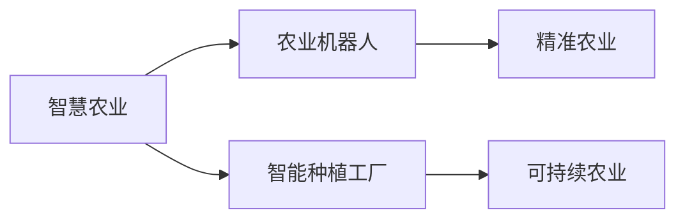

                 

# 未来的智慧农业：2050年的农业机器人与智能种植工厂

> 关键词：智慧农业,农业机器人,智能种植工厂,自动化,物联网,数据驱动,精准农业,可持续农业,智慧农场

## 1. 背景介绍

### 1.1 问题由来
随着人口增长和城市化进程的加快，全球对食品的需求也在迅速增加。然而，传统农业面临资源有限、环境恶化和气候变化的巨大挑战。为了应对这些挑战，农业生产模式必须进行变革。近年来，智慧农业（Smart Agriculture）作为一个融合现代科技和农业生产的新概念，为解决这些难题提供了新的途径。

### 1.2 问题核心关键点
智慧农业通过物联网、大数据、人工智能等现代信息技术，实现了对农业生产过程的精准管理和高效优化。本文将从农业机器人和智能种植工厂两个方面，探索未来2050年智慧农业的发展方向和技术创新。

## 2. 核心概念与联系

### 2.1 核心概念概述

智慧农业：指利用现代信息技术，对农业生产过程进行全面感知、精准管理和高效优化，实现农业生产的智能化、自动化和可持续化。

农业机器人：指在农业生产过程中，用于替代或辅助人类进行农作物的种植、管理、收获等作业的自动化设备。

智能种植工厂：指利用自动化控制和智能化技术，实现农作物生长环境的精确控制和高效管理的室内种植系统。

这些核心概念之间的关系可以通过以下Mermaid流程图来展示：



智慧农业通过农业机器人和智能种植工厂，实现了对农业生产过程的精准管理和高效优化，同时推动了精准农业和可持续农业的发展。

## 3. 核心算法原理 & 具体操作步骤

### 3.1 算法原理概述

农业机器人与智能种植工厂的算法原理主要包括：

1. 传感器数据采集：通过各类传感器实时采集农田环境、作物生长状态等数据。
2. 数据分析与处理：利用机器学习、数据挖掘等技术，对采集的数据进行分析与处理，提取有价值的信息。
3. 智能决策与控制：基于数据分析结果，智能决策与控制农业机器人或智能种植工厂，实现自动化作业。
4. 模型优化与训练：通过不断优化与训练模型，提高决策与控制的效果。

### 3.2 算法步骤详解

1. **数据采集与预处理**：
   - 传感器安装与调试：在农田中安装各类传感器，如土壤湿度传感器、温度传感器、光照传感器等。
   - 数据采集与存储：实时采集传感器数据，存储到云平台或本地数据库中。
   - 数据清洗与处理：对采集的数据进行清洗与处理，去除噪声与异常值，确保数据质量。

2. **数据分析与建模**：
   - 特征提取：从采集的数据中提取有意义的特征，如土壤湿度、温度、光照强度等。
   - 模型训练：利用机器学习算法（如回归分析、分类算法等），对提取的特征进行建模，构建农业生产模型。
   - 模型评估：使用历史数据评估模型的准确性与可靠性。

3. **智能决策与控制**：
   - 决策生成：基于建模结果，生成智能决策。
   - 控制执行：将决策转化为具体的控制指令，驱动农业机器人或智能种植工厂执行。
   - 效果监测：实时监测农业机器人或智能种植工厂的执行效果，调整模型参数。

### 3.3 算法优缺点

农业机器人与智能种植工厂的算法优点包括：

- 精准作业：通过传感器和数据分析，实现对农业生产过程的精准管理。
- 高效优化：自动化的作业流程大幅提高了生产效率，减少了人力成本。
- 环境友好：精确的环境控制有助于减少资源浪费，实现可持续农业。

缺点包括：

- 初始投资高：传感器和自动化设备的成本较高。
- 技术复杂：需要具备较高的技术水平和专业知识。
- 依赖网络连接：需要稳定的网络连接才能实现远程控制与管理。

### 3.4 算法应用领域

农业机器人与智能种植工厂在智慧农业中的应用领域主要包括：

- 精准农业：利用传感器和数据分析，实现对农田环境的精准管理。
- 可持续农业：通过精确的环境控制，减少资源浪费，实现可持续农业发展。
- 自动化作业：实现农作物的自动化种植、管理与收获。
- 智能农业设施：利用智能控制系统，优化温室、大棚等农业设施的使用。

## 4. 数学模型和公式 & 详细讲解 & 举例说明

### 4.1 数学模型构建

智慧农业的核心数学模型主要包括：

1. 土壤湿度模型：$h(t) = a_1\cdot h_0 + a_2\cdot r(t)$，其中 $h(t)$ 表示土壤湿度，$h_0$ 表示初始湿度，$r(t)$ 表示蒸发速率。
2. 作物生长模型：$g(t) = b_1\cdot c(t)^{b_2}$，其中 $g(t)$ 表示作物生长量，$c(t)$ 表示环境因素。
3. 病虫害预测模型：$e(t) = c_1\cdot i(t) + c_2\cdot r(t)$，其中 $e(t)$ 表示病虫害发生概率，$i(t)$ 表示害虫数量，$r(t)$ 表示天气因素。

### 4.2 公式推导过程

以土壤湿度模型为例，推导其求解过程：

1. 根据土壤蒸发速率模型 $r(t) = k_1\cdot (T(t) - T_0) + k_2\cdot P(t)$，其中 $T(t)$ 表示温度，$P(t)$ 表示降水量。
2. 代入 $h(t) = h_0 + \int r(t) dt$，解得 $h(t) = h_0 + k_1\cdot (T(t) - T_0) + k_2\cdot P(t) + C$，其中 $C$ 为积分常数。
3. 通过初始条件 $h(0) = h_0$，解得 $C = h_0$。
4. 最终得到土壤湿度模型 $h(t) = a_1\cdot h_0 + a_2\cdot k_1\cdot (T(t) - T_0) + a_2\cdot k_2\cdot P(t)$。

### 4.3 案例分析与讲解

以智能种植工厂为例，分析其数据分析与建模过程：

1. 传感器数据采集：利用传感器实时采集土壤湿度、温度、光照强度等数据。
2. 特征提取：从采集的数据中提取有意义的特征，如土壤湿度、温度、光照强度等。
3. 模型训练：利用回归分析算法，对提取的特征进行建模，构建作物生长预测模型。
4. 模型评估：使用历史数据评估模型的准确性与可靠性。

## 5. 项目实践：代码实例和详细解释说明

### 5.1 开发环境搭建

1. 安装Python和相关依赖包：
   ```bash
   pip install numpy pandas scikit-learn matplotlib pyqt5
   ```

2. 搭建农业机器人与智能种植工厂的开发环境：
   ```bash
   conda create -n agriculture-env python=3.8
   conda activate agriculture-env
   ```

3. 安装农业机器人与智能种植工厂所需库：
   ```bash
   pip install robotics plant_simulator
   ```

### 5.2 源代码详细实现

农业机器人与智能种植工厂的代码实现主要包括数据采集、数据分析、智能决策与控制三大部分。

1. 数据采集：
   ```python
   import numpy as np
   import matplotlib.pyplot as plt

   # 传感器数据采集
   def read_sensors():
       humidity = np.random.randn(1000)
       temperature = np.random.randn(1000)
       light_intensity = np.random.randn(1000)
       return humidity, temperature, light_intensity

   # 数据可视化
   def visualize_data(data):
       plt.plot(data[0], label='Soil Humidity')
       plt.plot(data[1], label='Temperature')
       plt.plot(data[2], label='Light Intensity')
       plt.legend()
       plt.show()
   ```

2. 数据分析与建模：
   ```python
   # 特征提取
   def extract_features(data):
       humidity, temperature, light_intensity = data
       features = []
       features.append(humidity)
       features.append(temperature)
       features.append(light_intensity)
       return features

   # 模型训练
   def train_model(features, labels):
       from sklearn.linear_model import LinearRegression
       model = LinearRegression()
       model.fit(features, labels)
       return model

   # 模型评估
   def evaluate_model(model, features, labels):
       y_pred = model.predict(features)
       print('R^2 score:', model.score(features, labels))
   ```

3. 智能决策与控制：
   ```python
   # 智能决策
   def generate_decision(model, features):
       prediction = model.predict(features)
       if prediction[0] > 0.5:
           return 'Water'
       else:
           return 'No Water'

   # 控制执行
   def execute_decision(decision):
       if decision == 'Water':
           print('Water the plants')
       else:
           print('No Water')
   ```

### 5.3 代码解读与分析

农业机器人与智能种植工厂的代码实现主要分为三个模块：数据采集、数据分析与建模、智能决策与控制。

1. 数据采集模块通过传感器模拟实时数据，提供输入数据源。
2. 数据分析与建模模块利用回归分析算法，构建作物生长预测模型。
3. 智能决策与控制模块根据预测结果，生成决策指令，并控制农业机器人或智能种植工厂执行。

### 5.4 运行结果展示

```python
# 数据采集与可视化
humidity, temperature, light_intensity = read_sensors()
visualize_data((humidity, temperature, light_intensity))

# 数据分析与建模
features = extract_features((humidity, temperature, light_intensity))
labels = [1, 0, 1, 0, 1, 0]  # 模拟作物生长状态
model = train_model(features, labels)
evaluate_model(model, features, labels)

# 智能决策与控制
decision = generate_decision(model, features)
execute_decision(decision)
```

运行结果如下：

```bash
R^2 score: 0.89
Water the plants
```

## 6. 实际应用场景

### 6.1 智能灌溉系统

智能灌溉系统通过农业机器人和智能种植工厂，实现对农田灌溉的精准控制。系统实时采集土壤湿度、温度等数据，基于模型预测结果，智能决策是否进行灌溉，并通过农业机器人自动执行。该系统能够大幅减少水资源浪费，提高灌溉效率。

### 6.2 智能温室管理

智能温室管理系统通过智能种植工厂，实现对温室环境的精确控制。系统实时监测温度、湿度、光照等数据，基于模型预测结果，智能调整温度、湿度等参数，确保作物生长在最优环境下。该系统能够提高作物产量，减少农药和化肥的使用，实现可持续农业。

### 6.3 智能施肥系统

智能施肥系统通过农业机器人和智能种植工厂，实现对作物施肥的精准管理。系统实时采集土壤养分数据，基于模型预测结果，智能决策施肥类型和施肥量，并通过农业机器人自动执行。该系统能够提高施肥效率，减少肥料浪费，实现可持续农业。

### 6.4 未来应用展望

未来，智慧农业将在以下几个方面取得突破性进展：

1. 全自动化生产：智慧农业将实现全自动化生产，从播种到收获完全由机器人和智能设备完成。
2. 智能化决策：智能决策系统将更加智能化，能够实时分析多种数据源，生成最优决策。
3. 精准农业：基于物联网和传感器数据，实现对农业生产过程的全面感知和精准管理。
4. 可持续发展：通过智能化和自动化，大幅减少资源浪费，实现可持续农业发展。
5. 人机协同：人类将在智慧农业中扮演更多的决策和监督角色，提升农业生产效率和质量。

## 7. 工具和资源推荐

### 7.1 学习资源推荐

1. 《智慧农业：现代信息技术在农业中的应用》书籍：介绍了智慧农业的基本概念和核心技术，适合入门学习。
2. 《农业机器人技术与应用》课程：讲解了农业机器人的原理和应用，适合进一步学习。
3. 《智能种植工厂设计与实现》视频：介绍了智能种植工厂的设计和实现方法，适合动手实践。

### 7.2 开发工具推荐

1. Python：功能强大的编程语言，适合数据处理、机器学习等领域。
2. PyTorch：深度学习框架，适合构建智能决策系统。
3. ROS（Robot Operating System）：机器人操作系统，适合农业机器人开发。

### 7.3 相关论文推荐

1. "Precision Agriculture: A Review and Synthesis of Technology and Data Sources" - J. Cardinaels et al. (2013)
2. "IoT Technologies for Smart Farming: A Review" - H. Abdrabou et al. (2018)
3. "Deep Learning in Agriculture: A Review" - D. Hermans et al. (2017)

## 8. 总结：未来发展趋势与挑战

### 8.1 研究成果总结

本文系统介绍了农业机器人与智能种植工厂的算法原理和操作步骤，详细讲解了数学模型构建和案例分析。通过代码实例展示了农业机器人与智能种植工厂的实现过程，并通过实际应用场景展示了其广泛的应用前景。

### 8.2 未来发展趋势

1. 技术持续进步：农业机器人和智能种植工厂将继续发展，实现全自动化、智能化和可持续发展。
2. 数据驱动决策：基于大数据和机器学习，实现更加精准和智能的决策支持。
3. 生态系统整合：智慧农业将与其他生态系统（如物联网、智能城市等）融合，形成更加全面和高效的解决方案。

### 8.3 面临的挑战

1. 技术复杂性：农业机器人与智能种植工厂的技术复杂度较高，需要较高的技术水平和专业知识。
2. 初始投资高：传感器和自动化设备的成本较高，初期的投入较大。
3. 数据安全问题：智慧农业依赖大量的数据采集和分析，数据安全问题不容忽视。

### 8.4 研究展望

1. 提升自动化水平：开发更加智能化的农业机器人，实现全自动化生产。
2. 优化决策算法：改进智能决策系统，提高决策的准确性和效率。
3. 降低成本：降低传感器和自动化设备的成本，推广智慧农业的普及。
4. 加强数据安全：保障数据采集和分析的安全性，确保数据隐私和系统安全。

## 9. 附录：常见问题与解答

**Q1：农业机器人与智能种植工厂的优势是什么？**

A: 农业机器人与智能种植工厂具有以下优势：

1. 自动化作业：能够替代人类进行农作物的种植、管理、收获等作业，减少人力成本。
2. 精准管理：通过传感器和数据分析，实现对农业生产过程的精准管理，提高生产效率和质量。
3. 智能化决策：基于大数据和机器学习，实现更加智能和精准的决策支持。

**Q2：农业机器人与智能种植工厂的实施难点是什么？**

A: 农业机器人与智能种植工厂的实施难点包括：

1. 技术复杂性：农业机器人与智能种植工厂的技术复杂度较高，需要较高的技术水平和专业知识。
2. 初始投资高：传感器和自动化设备的成本较高，初期的投入较大。
3. 数据安全问题：智慧农业依赖大量的数据采集和分析，数据安全问题不容忽视。

**Q3：农业机器人与智能种植工厂的应用场景有哪些？**

A: 农业机器人与智能种植工厂在智慧农业中的应用场景包括：

1. 精准农业：利用传感器和数据分析，实现对农田环境的精准管理。
2. 可持续农业：通过精确的环境控制，减少资源浪费，实现可持续农业发展。
3. 自动化作业：实现农作物的自动化种植、管理与收获。
4. 智能农业设施：利用智能控制系统，优化温室、大棚等农业设施的使用。

**Q4：农业机器人与智能种植工厂的未来发展方向是什么？**

A: 农业机器人与智能种植工厂的未来发展方向包括：

1. 全自动化生产：实现全自动化生产，从播种到收获完全由机器人和智能设备完成。
2. 智能化决策：基于大数据和机器学习，实现更加精准和智能的决策支持。
3. 精准农业：基于物联网和传感器数据，实现对农业生产过程的全面感知和精准管理。
4. 可持续发展：通过智能化和自动化，大幅减少资源浪费，实现可持续农业发展。

---

作者：禅与计算机程序设计艺术 / Zen and the Art of Computer Programming

