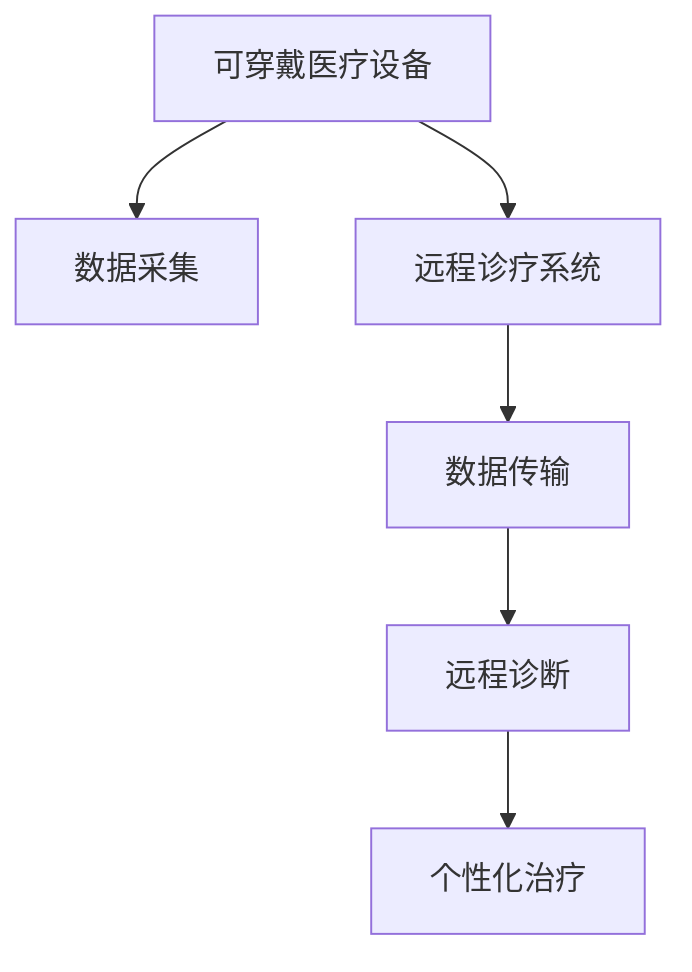

                 

# 未来的智慧医疗：2050年的可穿戴医疗设备与远程诊疗

## 1. 背景介绍

### 1.1 问题由来
随着现代科技的迅猛发展，尤其是人工智能和物联网技术的成熟，智慧医疗正成为全球关注的焦点。近年来，可穿戴医疗设备和远程诊疗技术的突破性进展，极大地提升了医疗服务的质量和效率，改变了传统医疗模式。然而，尽管取得了巨大进展，智慧医疗领域仍面临诸多挑战，如数据共享、隐私保护、医疗资源分配等问题。本文将探讨2050年可穿戴医疗设备和远程诊疗的发展前景，展望其对未来智慧医疗的深远影响。

### 1.2 问题核心关键点
未来智慧医疗的核心在于通过先进技术手段，实时监测和分析患者健康数据，提供精准医疗和个性化治疗方案。可穿戴医疗设备和远程诊疗技术将成为这一目标实现的关键支撑。

### 1.3 问题研究意义
研究未来智慧医疗的技术发展，对于提升医疗服务的智能化水平、推动医疗资源的合理分配、提高诊疗效率和患者满意度具有重要意义。通过深入了解未来智慧医疗的可行性和挑战，可以为相关技术研发、政策制定提供理论依据，加速医疗健康领域的数字化转型。

## 2. 核心概念与联系

### 2.1 核心概念概述

未来智慧医疗的关键概念包括可穿戴医疗设备和远程诊疗系统，其核心在于实时采集和分析患者的健康数据，实现医疗服务的智能化和个性化。

- 可穿戴医疗设备：如智能手表、可穿戴监测器等，能够实时监测患者的生理指标，如心率、血压、血糖等。
- 远程诊疗系统：通过互联网连接医生和患者，提供远程诊断、健康咨询等服务。

这些概念之间的逻辑关系可以通过以下Mermaid流程图来展示：



这个流程图展示了从可穿戴设备的数据采集，到远程诊疗系统的数据传输，再到远程诊断和个性化治疗的整个流程。

## 3. 核心算法原理 & 具体操作步骤
### 3.1 算法原理概述

未来智慧医疗的核心算法原理在于实时数据采集、分析和应用。其基本思路是：通过可穿戴设备实时监测患者的生理指标，并将数据传输到远程诊疗系统，经过专业算法分析，生成个性化的治疗方案。

### 3.2 算法步骤详解

**Step 1: 数据采集**
- 通过可穿戴设备实时采集患者的生理指标，如心率、血压、血糖等。
- 数据采集应具备高精度、低延迟、低功耗的特点，以提高患者的使用体验和数据的可靠性。

**Step 2: 数据传输**
- 将采集的数据通过互联网传输到远程诊疗系统。
- 为了保证数据传输的稳定性和安全性，应采用端到端加密和差错校验等技术。

**Step 3: 数据分析**
- 远程诊疗系统中的算法对传输来的数据进行实时分析，识别异常情况。
- 算法可采用机器学习、深度学习等技术，从海量的健康数据中提取有价值的健康信息。

**Step 4: 远程诊断**
- 根据算法分析结果，提供远程诊断服务，如初步诊断、病情评估等。
- 医生可以借助远程诊疗系统对患者进行实时咨询，并根据分析结果给出初步诊断意见。

**Step 5: 个性化治疗**
- 根据医生的初步诊断结果，结合患者的历史健康数据，生成个性化的治疗方案。
- 个性化治疗方案应涵盖药物、饮食、运动等多方面，并可根据患者的反馈进行调整。

### 3.3 算法优缺点

可穿戴医疗设备和远程诊疗系统在未来的智慧医疗中具有以下优点：
1. 实时监测：通过可穿戴设备，医生可以实时了解患者的健康状况，及时采取干预措施。
2. 个性化治疗：结合患者的历史数据和当前监测结果，提供精准的个性化治疗方案。
3. 节省资源：远程诊疗减少了患者的就医次数，节省了医疗资源。
4. 普及性强：可穿戴设备便携易用，远程诊疗系统覆盖面广，可推广至更多人群。

然而，这些技术也存在一定的局限性：
1. 数据隐私：患者健康数据涉及隐私，如何保护数据安全是重要问题。
2. 设备依赖：可穿戴设备的普及率和使用频率可能受限，影响系统的覆盖面。
3. 技术门槛：远程诊疗系统需要高精度的算法和稳定的网络环境，对技术要求较高。
4. 医疗监督：远程诊疗缺乏面对面的检查，可能影响诊断的准确性。

### 3.4 算法应用领域

可穿戴医疗设备和远程诊疗系统在未来的智慧医疗中，将广泛应用于以下几个领域：

1. 慢性病管理：通过连续监测患者生理指标，及时调整治疗方案，预防疾病恶化。
2. 远程医疗咨询：通过远程诊疗系统，医生可以为患者提供健康咨询和初步诊断，减少线下就医需求。
3. 急救与灾害应对：在灾难发生时，通过可穿戴设备实时监测受灾者健康状况，及时提供救援。
4. 养老健康管理：通过远程诊疗系统，为老年人提供健康监测和咨询服务，提升生活质量。
5. 疾病监测与预警：结合大数据分析，预测疾病流行趋势，提前采取防控措施。

## 4. 数学模型和公式 & 详细讲解  
### 4.1 数学模型构建

在数据分析和远程诊断中，常用的数学模型包括机器学习模型、深度学习模型等。以深度学习模型为例，常用的神经网络架构包括卷积神经网络（CNN）、循环神经网络（RNN）、长短时记忆网络（LSTM）等。

假设输入为$x$，输出为$y$，则常用的深度学习模型为$y=f(x; \theta)$，其中$\theta$为模型参数。常见的深度学习模型包括：

- 卷积神经网络（CNN）：用于图像处理、视频分析等领域。
- 循环神经网络（RNN）：用于时间序列数据分析、自然语言处理等领域。
- 长短时记忆网络（LSTM）：用于处理长序列数据，如语音识别、机器翻译等领域。

### 4.2 公式推导过程

以卷积神经网络为例，其基本架构包括卷积层、池化层、全连接层等。假设输入为$x \in \mathbb{R}^n$，卷积核为$k$，则卷积操作可以表示为：

$$
y_{conv}(x,k) = \sum_{i=1}^n \sum_{j=1}^n k_{ij}x_{ij}
$$

其中$k_{ij}$为卷积核的权重。通过多层卷积、池化、全连接层的操作，最终输出为$y \in \mathbb{R}^m$。

以长短时记忆网络（LSTM）为例，其基本架构包括输入门、遗忘门、输出门等。假设输入为$x \in \mathbb{R}^n$，输出为$y \in \mathbb{R}^m$，则LSTM模型可以表示为：

$$
y = f(x;\theta) = \sum_{i=1}^n \sum_{j=1}^m \theta_{ij}x_{ij}
$$

其中$\theta$为模型参数。

### 4.3 案例分析与讲解

以下以糖尿病患者为例，展示如何使用深度学习模型进行远程诊断和个性化治疗。

假设某糖尿病患者佩戴了可穿戴设备，实时监测其血糖数据。数据采集后，通过互联网传输到远程诊疗系统。系统中的LSTM模型对传输来的数据进行分析，识别异常血糖波动，生成初步诊断结果。医生通过远程诊疗系统查看初步诊断结果，结合患者的历史数据，生成个性化的治疗方案，如饮食调整、运动计划等。

## 5. 项目实践：代码实例和详细解释说明
### 5.1 开发环境搭建

在进行项目实践前，我们需要准备好开发环境。以下是使用Python进行TensorFlow开发的环境配置流程：

1. 安装Anaconda：从官网下载并安装Anaconda，用于创建独立的Python环境。

2. 创建并激活虚拟环境：
```bash
conda create -n tensorflow-env python=3.8 
conda activate tensorflow-env
```

3. 安装TensorFlow：根据CUDA版本，从官网获取对应的安装命令。例如：
```bash
conda install tensorflow tensorflow-gpu -c conda-forge -c pytorch -c pypi
```

4. 安装各类工具包：
```bash
pip install numpy pandas scikit-learn matplotlib tqdm jupyter notebook ipython
```

完成上述步骤后，即可在`tensorflow-env`环境中开始项目实践。

### 5.2 源代码详细实现

下面以糖尿病患者远程诊断和个性化治疗为例，给出使用TensorFlow进行深度学习模型的PyTorch代码实现。

首先，定义LSTM模型：

```python
import tensorflow as tf
from tensorflow.keras.layers import Input, LSTM, Dense, Dropout
from tensorflow.keras.models import Model

input_size = 12  # 血糖数据的时间步长
output_size = 3  # 初步诊断结果
hidden_size = 128  # 隐藏层神经元个数

inputs = Input(shape=(None, input_size))
x = LSTM(hidden_size, return_sequences=True)(inputs)
x = Dropout(0.2)(x)
x = LSTM(hidden_size)(x)
x = Dropout(0.2)(x)
x = Dense(output_size, activation='softmax')(x)

model = Model(inputs=inputs, outputs=x)
model.summary()
```

然后，定义数据处理函数：

```python
def load_data():
    # 加载糖尿病患者的血糖数据
    # ...

def preprocess_data():
    # 对数据进行归一化、增广等处理
    # ...

def split_data(train_ratio):
    # 划分训练集和测试集
    # ...

def generate_sequences(data, seq_len):
    # 将数据生成固定长度的序列
    # ...

def get_batches(data, seq_len, batch_size):
    # 将数据划分为批次
    # ...
```

接下来，定义模型训练函数：

```python
def train_model(model, data, batch_size, epochs):
    # 数据预处理
    train_data, test_data = load_data(), load_data()
    train_data, test_data = preprocess_data(), preprocess_data()
    train_data, test_data = split_data(train_ratio), split_data(train_ratio)
    train_data, test_data = generate_sequences(train_data, seq_len), generate_sequences(test_data, seq_len)

    # 数据加载
    train_batches = get_batches(train_data, seq_len, batch_size)
    test_batches = get_batches(test_data, seq_len, batch_size)

    # 训练模型
    model.compile(optimizer='adam', loss='categorical_crossentropy', metrics=['accuracy'])
    model.fit(train_batches, epochs=epochs, validation_data=test_batches)
```

最后，启动训练流程并在测试集上评估：

```python
train_model(model, data, batch_size=32, epochs=10)

# 在测试集上评估模型性能
test_loss, test_acc = model.evaluate(test_batches)
print(f'Test loss: {test_loss:.4f}, Test accuracy: {test_acc:.4f}')
```

以上就是使用TensorFlow进行深度学习模型的完整代码实现。可以看到，TensorFlow的高级API使得模型的构建和训练变得相对简单。开发者可以将更多精力放在数据处理和模型优化上，而不必过多关注底层的实现细节。

### 5.3 代码解读与分析

让我们再详细解读一下关键代码的实现细节：

**LSTM模型定义**：
- 使用Keras API定义LSTM模型，包含输入层、多个LSTM层和全连接层。
- `LSTM`层中`return_sequences=True`表示返回序列输出，以便在多层LSTM中使用。

**数据处理函数**：
- `load_data`函数用于加载数据集。
- `preprocess_data`函数对数据进行归一化、增广等预处理操作。
- `split_data`函数将数据划分为训练集和测试集。
- `generate_sequences`函数将数据生成固定长度的序列，以便模型处理。
- `get_batches`函数将数据划分为批次，用于模型训练。

**模型训练函数**：
- 通过`load_data`函数加载数据集，并进行预处理。
- 通过`split_data`函数将数据划分为训练集和测试集，并通过`generate_sequences`函数生成固定长度的序列。
- 使用`get_batches`函数将数据划分为批次，并使用`model.fit`函数训练模型。
- 在训练过程中，使用`eval`函数在测试集上评估模型性能。

## 6. 实际应用场景
### 6.1 智能手表与慢性病管理

智能手表在慢性病管理中的应用前景广阔。通过实时监测生理指标，智能手表可以及时发现异常情况，提醒患者和医生采取干预措施。

例如，某糖尿病患者佩戴智能手表，实时监测其血糖数据。系统中的LSTM模型对传输来的数据进行分析，识别异常血糖波动，生成初步诊断结果。医生通过远程诊疗系统查看初步诊断结果，结合患者的历史数据，生成个性化的治疗方案，如饮食调整、运动计划等。

### 6.2 远程医疗与应急救援

远程医疗系统通过互联网连接医生和患者，提供远程诊断、健康咨询等服务。在应急救援中，远程医疗系统可以发挥重要作用。

例如，在自然灾害发生时，通过可穿戴设备实时监测受灾者的健康状况，及时提供救援。系统中的LSTM模型对传输来的数据进行分析，识别异常情况，生成紧急救援方案。救援人员根据方案进行及时干预，提高救援效率和成功率。

### 6.3 健康管理与老龄社会

老龄社会对健康管理的需求日益增加，远程医疗系统可以提供便捷的健康监测和咨询服务，提升老年人的生活质量。

例如，某老年人佩戴智能手表，实时监测其生理指标，如心率、血压等。系统中的LSTM模型对传输来的数据进行分析，生成初步诊断结果。医生通过远程诊疗系统查看初步诊断结果，结合患者的历史数据，生成个性化的健康管理方案，如饮食调整、运动计划等。

## 7. 工具和资源推荐
### 7.1 学习资源推荐

为了帮助开发者系统掌握未来智慧医疗的技术基础和实践技巧，这里推荐一些优质的学习资源：

1. TensorFlow官方文档：TensorFlow的详细文档，涵盖模型构建、训练、评估等各个环节。
2. Keras官方文档：Keras的详细文档，提供简单易用的API，适合快速上手。
3. DeepLearning.ai课程：Andrew Ng教授的深度学习课程，深入浅出地介绍了深度学习原理和应用。
4. Coursera《AI for Healthcare》课程：哈佛大学开设的课程，介绍了AI在医疗领域的应用，包括远程诊疗、图像识别等。
5. NVIDIA医疗AI资源库：NVIDIA提供的医疗AI资源库，包括模型、数据集、论文等，适合学习研究。

通过对这些资源的学习实践，相信你一定能够快速掌握未来智慧医疗的关键技术，并用于解决实际的医疗问题。
### 7.2 开发工具推荐

高效的开发离不开优秀的工具支持。以下是几款用于未来智慧医疗开发的常用工具：

1. TensorFlow：由Google主导开发的开源深度学习框架，生产部署方便，适合大规模工程应用。
2. PyTorch：基于Python的开源深度学习框架，灵活动态的计算图，适合快速迭代研究。
3. Keras：高级深度学习API，基于TensorFlow和Theano实现，简单易用，适合快速原型开发。
4. Jupyter Notebook：交互式编程环境，支持多种语言和库，适合进行研究和实验。
5. Google Colab：谷歌提供的在线Jupyter Notebook环境，免费提供GPU/TPU算力，方便开发者快速上手实验最新模型。

合理利用这些工具，可以显著提升未来智慧医疗开发的效率，加快创新迭代的步伐。

### 7.3 相关论文推荐

未来智慧医疗的技术发展源于学界的持续研究。以下是几篇奠基性的相关论文，推荐阅读：

1. Remote Patient Monitoring via Wearable Devices: A Survey and Taxonomy: 综述文章，介绍了远程患者监测技术的发展现状和未来趋势。
2. Deep Learning in Healthcare: A Survey: 综述文章，介绍了深度学习在医疗领域的应用，包括图像识别、自然语言处理等。
3. AI in Healthcare: From Concepts to Current Applications: 综述文章，介绍了AI在医疗领域的具体应用，如疾病预测、治疗方案等。
4. Towards 3D MRI Computationally-Exploited Automatic Contours: 医学影像处理论文，介绍了3D MRI影像的自动分割技术。
5. A Survey on Adaptive Network for Healthcare Applications: 综述文章，介绍了自适应网络在医疗领域的应用，如预测模型、优化算法等。

这些论文代表了大规模智慧医疗的发展脉络。通过学习这些前沿成果，可以帮助研究者把握学科前进方向，激发更多的创新灵感。

## 8. 总结：未来发展趋势与挑战

### 8.1 总结

本文对未来智慧医疗的可穿戴设备与远程诊疗技术进行了全面系统的介绍。首先阐述了未来智慧医疗的发展背景和意义，明确了可穿戴设备和远程诊疗技术的应用前景。其次，从原理到实践，详细讲解了未来智慧医疗的数学模型和算法步骤，给出了项目实践的完整代码实例。同时，本文还广泛探讨了可穿戴设备和远程诊疗技术在实际应用中的各种场景，展示了其对未来智慧医疗的深远影响。此外，本文精选了未来智慧医疗的各类学习资源，力求为读者提供全方位的技术指引。

通过本文的系统梳理，可以看到，未来智慧医疗通过可穿戴设备和远程诊疗技术，将实时监测和分析患者的健康数据，提供精准医疗和个性化治疗方案，极大地提升了医疗服务的质量和效率。未来，伴随技术的不断进步，可穿戴设备和远程诊疗技术将会在更多领域得到应用，为医疗健康领域带来革命性变化。

### 8.2 未来发展趋势

展望未来，未来智慧医疗将呈现以下几个发展趋势：

1. 数据融合与集成：通过将各类医疗数据融合集成，形成全面的健康画像，提供更加个性化的治疗方案。
2. 模型优化与创新：深度学习模型将不断优化，结合更多的先验知识和临床经验，提高诊断和治疗的准确性。
3. 交互界面优化：通过自然语言处理和智能推荐，提升患者与医生的交互体验，提高诊疗效率。
4. 跨领域协作：未来智慧医疗将与物联网、云计算、大数据等领域深度融合，形成协同效应。
5. 隐私保护与伦理：未来智慧医疗将更加注重数据隐私和伦理问题，保护患者的个人信息安全。

以上趋势凸显了未来智慧医疗的广阔前景。这些方向的探索发展，必将进一步提升智慧医疗系统的性能和应用范围，为人类健康事业带来深远影响。

### 8.3 面临的挑战

尽管未来智慧医疗具有巨大的发展潜力，但在迈向更加智能化、普适化应用的过程中，它仍面临诸多挑战：

1. 数据质量与标准化：患者数据来源多样，数据质量参差不齐，标准化难度较大。
2. 隐私保护与伦理：患者健康数据涉及隐私，如何保护数据安全是重要问题。
3. 系统可靠性与鲁棒性：可穿戴设备和远程诊疗系统对数据传输和算法精度要求较高，系统可靠性需要进一步提升。
4. 医疗资源分配：远程诊疗系统需要高质量的医疗资源支持，如何实现资源合理分配是重要问题。
5. 用户接受度：可穿戴设备和远程诊疗系统需要用户高度依赖，如何提升用户接受度是重要问题。

这些挑战需要通过技术创新、政策制定和社会共识等多方面协同努力，才能逐步解决，推动未来智慧医疗的普及和应用。

### 8.4 研究展望

未来智慧医疗的研究需要在以下几个方面寻求新的突破：

1. 数据融合与集成技术：通过数据融合和集成，形成全面的健康画像，提供更加个性化的治疗方案。
2. 深度学习模型的优化：结合更多的先验知识和临床经验，提高诊断和治疗的准确性。
3. 隐私保护与伦理研究：通过隐私保护技术，保护患者的个人信息安全。
4. 跨领域协作研究：将未来智慧医疗与物联网、云计算、大数据等领域深度融合，形成协同效应。
5. 智能推荐系统：通过自然语言处理和智能推荐，提升患者与医生的交互体验，提高诊疗效率。

这些研究方向的探索，必将引领未来智慧医疗技术迈向更高的台阶，为医疗健康领域带来新的突破。

## 9. 附录：常见问题与解答

**Q1：未来智慧医疗是否需要所有患者都佩戴可穿戴设备？**

A: 未来智慧医疗并不需要所有患者都佩戴可穿戴设备。通过互联网连接，患者可以随时向系统上传其健康数据，包括心率、血压、血糖等。只要数据传输稳定，系统即可进行实时监测和分析。

**Q2：远程诊疗系统如何保障数据安全？**

A: 远程诊疗系统应采用端到端加密技术，确保数据传输的安全性。同时，系统应采用差错校验和异常检测技术，防止数据传输错误和恶意攻击。此外，系统还应遵守相关法律法规，保护患者隐私。

**Q3：未来智慧医疗是否需要医生进行实时干预？**

A: 未来智慧医疗系统应具备智能推荐和决策支持功能，医生只需进行简单干预即可。系统通过深度学习模型和医疗专家知识库，自动生成初步诊断和治疗方案，医生只需确认并优化即可。

**Q4：未来智慧医疗是否可以覆盖所有医疗领域？**

A: 未来智慧医疗可以覆盖大多数医疗领域，包括慢性病管理、远程医疗咨询、急救与灾害应对、养老健康管理等。但对于需要高度物理接触或特殊设备的医疗服务，如手术、康复等，仍需依赖传统的医疗手段。

**Q5：未来智慧医疗将如何影响医疗健康行业？**

A: 未来智慧医疗将推动医疗健康行业向智能化、普适化方向发展，提高医疗服务的质量和效率。通过实时监测和分析，未来智慧医疗将提供更加精准的诊断和治疗方案，提高患者满意度，降低医疗成本。

总之，未来智慧医疗通过可穿戴设备和远程诊疗技术，将实时监测和分析患者的健康数据，提供精准医疗和个性化治疗方案，极大地提升了医疗服务的质量和效率。未来，伴随技术的不断进步，可穿戴设备和远程诊疗技术将会在更多领域得到应用，为医疗健康领域带来革命性变化。

