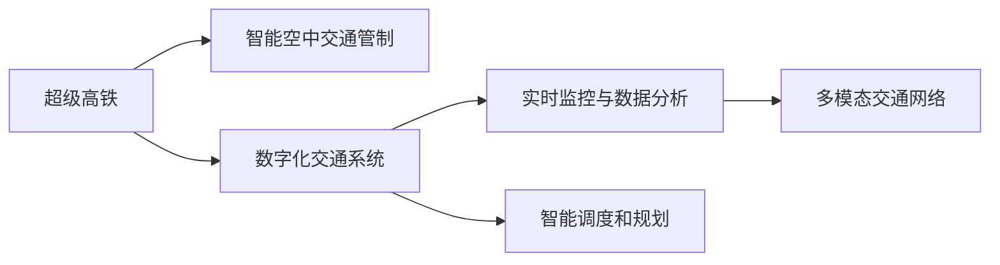

                 

# 未来的智能交通：2050年的超级高铁与空中交通管制

## 1. 背景介绍

随着科技的飞速发展，交通方式正经历着革命性的变革。交通基础设施的数字化、智能化将大幅提升运输效率，减少碳排放，改善人们的生活质量。本文将探讨2050年超级高铁与空中交通管制的未来，展示智能交通的前景与潜力。

### 1.1 交通发展的现状与挑战

当前，全球交通系统面临着诸多挑战，如拥堵、污染、安全性差等。汽车交通的迅猛发展导致城市交通拥堵日益严重，传统公路网络已难以承受日益增长的交通负荷。航空交通虽然高效，但存在噪音、环境污染、安全性等问题。公共交通系统虽然节能环保，但速度、覆盖率与灵活性不足。

传统的交通系统已难以满足未来社会对交通的需求，迫切需要一场技术革命。超级高铁与智能空中交通管制技术的出现，为交通系统的数字化、智能化升级提供了新的路径。

### 1.2 智能交通的未来愿景

智能交通的发展愿景是构建一个安全、高效、环保、便捷的交通体系。通过数字化手段，实现交通系统实时监测、数据分析、智能调控，为未来城市和交通系统的可持续发展奠定基础。超级高铁与空中交通管制的智能化应用，将成为实现这一愿景的关键突破口。

## 2. 核心概念与联系

### 2.1 核心概念概述

- **超级高铁(Super High-Speed Rail, SHSR)**：基于电磁或超导磁悬浮技术的下一代高速铁路系统，设计时速可达数千公里，具备高效、安全、环保等特点。

- **智能空中交通管制(Intelligent Air Traffic Control, IATC)**：通过大数据、人工智能、物联网等技术，实现对飞行器的高效、精准、自动化的管理与调度。

- **数字化交通系统(Digital Transportation System)**：指通过互联网、物联网、大数据、云计算等技术，实现交通系统的数字化、智能化管理。

- **实时监控与数据分析(Real-Time Monitoring and Data Analytics)**：通过传感器、监控摄像头等设备，实时采集交通数据，结合大数据技术进行深度分析，优化交通系统运行。

- **智能调度和规划(Smart Scheduling and Planning)**：基于实时数据分析，智能调度交通工具，优化交通流，提升运输效率。

- **多模态交通网络(Multi-Modal Transportation Network)**：指融合公路、铁路、航空、水运等多种交通方式的综合交通体系，提供多模式、无缝衔接的出行方式。

这些核心概念之间的关系可通过以下Mermaid流程图来展示：



## 3. 核心算法原理 & 具体操作步骤

### 3.1 算法原理概述

超级高铁与空中交通管制技术的应用涉及多种算法与模型。以超级高铁为例，其核心算法包括：

- **电磁或超导磁悬浮控制**：通过电磁力或超导磁力实现对列车的悬浮、导向与驱动。
- **路径规划与优化**：基于实时交通数据，优化列车运行路径，提升运输效率。
- **故障诊断与维护**：通过传感器数据，实时监测列车状态，预测并预防故障。

智能空中交通管制的核心算法包括：

- **流量控制与冲突避免**：通过算法优化飞行器的飞行路径，避免碰撞。
- **航迹预测与调整**：基于实时气象数据，预测飞行器路径，动态调整飞行计划。
- **自动化管理与调度**：利用人工智能技术，实现飞行器的自动化调度与管理。

这些算法共同构成了超级高铁与空中交通管制技术的基础，实现交通系统的智能化、高效化。

### 3.2 算法步骤详解

#### 3.2.1 超级高铁核心算法步骤

1. **电磁或超导磁悬浮控制**：
    - **悬浮**：利用电磁力或超导磁力，实现列车的悬浮。
    - **导向**：通过电磁导向系统，确保列车在轨道上的稳定运行。
    - **驱动**：利用电磁力或超导磁力，驱动列车前进。

2. **路径规划与优化**：
    - **数据采集**：通过传感器、监控摄像头等设备，实时采集交通数据。
    - **路径规划**：利用优化算法（如遗传算法、粒子群算法等），规划最优路径。
    - **实时调整**：根据实时交通数据，动态调整列车运行路径，避免拥堵。

3. **故障诊断与维护**：
    - **传感器监测**：实时监测列车的各项状态参数。
    - **故障预测**：基于历史数据和实时监测数据，预测潜在故障。
    - **维护调度**：根据故障预测结果，调度维护人员进行及时维修。

#### 3.2.2 智能空中交通管制核心算法步骤

1. **流量控制与冲突避免**：
    - **数据采集**：通过雷达、卫星等设备，实时获取飞行器位置与状态。
    - **路径规划**：利用算法（如A*算法、RRT算法等），优化飞行路径。
    - **冲突避免**：实时监测飞行器状态，避免碰撞。

2. **航迹预测与调整**：
    - **气象数据采集**：实时获取飞行器所在区域的气象数据。
    - **航迹预测**：利用预测算法（如神经网络、随机森林等），预测飞行器路径。
    - **路径调整**：根据预测结果，动态调整飞行计划。

3. **自动化管理与调度**：
    - **数据融合**：将来自雷达、卫星等设备的数据进行融合，获取完整飞行器信息。
    - **调度决策**：利用人工智能技术（如强化学习、决策树等），进行飞行器调度决策。
    - **自动化控制**：根据调度决策，自动控制飞行器运行。

### 3.3 算法优缺点

#### 3.3.1 超级高铁核心算法优缺点

**优点**：
- **高速高效**：电磁或超导磁悬浮控制技术可以实现高速行驶，提升运输效率。
- **安全可靠**：通过实时监测与故障预测，确保列车运行安全。
- **节能环保**：电磁悬浮技术无需消耗大量能源，降低碳排放。

**缺点**：
- **建设成本高**：电磁或超导磁悬浮技术要求高标准的建设条件，成本较高。
- **技术复杂**：电磁悬浮控制技术难度大，技术门槛高。
- **维修复杂**：电磁悬浮列车需要复杂维护，维修成本较高。

#### 3.3.2 智能空中交通管制核心算法优缺点

**优点**：
- **高效精准**：通过流量控制与冲突避免，提高飞行器运行效率与安全性。
- **实时调整**：通过航迹预测与调整，实现飞行器路径的动态优化。
- **自动化管理**：通过自动化管理与调度，提升空中交通管理的智能化水平。

**缺点**：
- **技术复杂**：智能空中交通管制涉及多种先进技术，技术难度较大。
- **数据依赖**：高度依赖传感器数据与通信网络，数据采集与传输成本高。
- **安全性问题**：系统故障或黑客攻击可能带来严重安全风险。

### 3.4 算法应用领域

超级高铁与智能空中交通管制技术的应用领域广泛，涵盖交通基础设施建设、运输效率提升、环境友好等多个方面。

#### 3.4.1 超级高铁应用领域

1. **长途运输**：超级高铁可以实现快速、高效的长途运输，适应大规模城市群间的通勤需求。
2. **短途运输**：超级高铁可以优化城市内部的交通网络，提升公交系统的运行效率。
3. **旅游观光**：超级高铁提供快速、安全的旅游出行方式，促进区域旅游经济发展。
4. **物流运输**：超级高铁可以提升货物运输的效率与安全性，降低物流成本。

#### 3.4.2 智能空中交通管制应用领域

1. **商业航班**：智能空中交通管制可以实现航班的高效调度与管理，减少延误，提升航班安全。
2. **通用航空**：智能空中交通管制可以优化通用航空器的飞行路径，提高飞行效率与安全性。
3. **无人机运输**：智能空中交通管制可以实现无人机在城市空域内的安全飞行，推动无人机物流的发展。
4. **紧急救援**：智能空中交通管制可以优化救援航班的路径规划，提高应急救援效率。

## 4. 数学模型和公式 & 详细讲解 & 举例说明

### 4.1 数学模型构建

在超级高铁与智能空中交通管制技术中，涉及多种数学模型。以智能空中交通管制为例，主要数学模型包括：

1. **流量控制模型**：
    - **离散事件系统模型(Discrete Event System, DES)**：用于描述飞行器在空域中的动态行为。
    - **马尔可夫决策过程(Markov Decision Process, MDP)**：用于建模飞行器的路径规划与调度。

2. **航迹预测模型**：
    - **时间序列分析模型(Time Series Analysis, TSA)**：用于预测飞行器的位置与速度变化。
    - **深度学习模型(Deep Learning, DL)**：如卷积神经网络(CNN)、循环神经网络(RNN)、变分自编码器(VAE)等，用于航迹预测与调整。

3. **自动化管理模型**：
    - **强化学习模型(Reinforcement Learning, RL)**：用于飞行器的自动化调度与管理。
    - **决策树模型(Decision Tree, DT)**：用于飞行器的路径选择与决策。

### 4.2 公式推导过程

#### 4.2.1 流量控制模型

以离散事件系统模型为例，假设飞行器数量为 $N$，空域中有 $M$ 个节点，节点间的连线表示可能的飞行路径。流量控制模型可以表示为：

$$
S = \{s_t\}, \quad A = \{a_t\}, \quad Z = \{z_t\}
$$

其中，$s_t$ 表示节点状态，$a_t$ 表示飞机动作，$z_t$ 表示事件。事件发生的概率可以表示为：

$$
P(z_t|s_t) = P(z_t|s_t, a_t)
$$

基于该模型，可以采用动态规划等算法，求解最优飞行路径与调度策略。

#### 4.2.2 航迹预测模型

以时间序列分析模型为例，假设飞行器位置与速度为 $(x_t, y_t, v_t)$，历史数据为 $(x_{t-1}, y_{t-1}, v_{t-1})$。时间序列分析模型可以表示为：

$$
x_t = f(x_{t-1}, y_{t-1}, v_{t-1}, \epsilon_t)
$$

其中，$f$ 为预测函数，$\epsilon_t$ 为随机误差。通过历史数据训练预测模型，可以预测飞行器未来的位置与速度变化。

#### 4.2.3 自动化管理模型

以强化学习模型为例，假设飞行器在空域中的状态为 $s_t$，动作为 $a_t$，奖励为 $r_t$。强化学习模型的目标是最小化飞行器在空域中的总运行成本，优化策略可以表示为：

$$
\pi^* = \arg\min_{\pi} \mathbb{E}_{\pi}[\sum_{t=1}^{T} r_t]
$$

其中，$\pi$ 为策略，$T$ 为时间步数。通过训练强化学习模型，可以优化飞行器的自动化调度与管理。

### 4.3 案例分析与讲解

以智能空中交通管制为例，以下是一个案例分析：

1. **数据采集与预处理**：
    - **传感器数据**：通过雷达、卫星等设备，实时采集飞行器的位置与速度。
    - **气象数据**：实时获取飞行器所在区域的气象数据，如风速、气温等。
    - **飞行数据**：从航空公司获取飞行计划与历史数据。

2. **航迹预测**：
    - **数据融合**：将来自雷达、卫星等设备的数据进行融合，获取完整的飞行器信息。
    - **时间序列分析**：基于历史数据与实时数据，使用ARIMA等模型预测飞行器的位置与速度变化。
    - **深度学习**：使用卷积神经网络或循环神经网络，训练航迹预测模型，提高预测精度。

3. **自动化管理**：
    - **强化学习**：通过环境模拟与策略训练，优化飞行器的路径选择与调度策略。
    - **决策树**：使用决策树算法，快速进行飞行器路径的决策与调整。
    - **实时控制**：根据决策结果，自动控制飞行器运行，确保飞行安全与效率。

## 5. 项目实践：代码实例和详细解释说明

### 5.1 开发环境搭建

要进行超级高铁与智能空中交通管制的开发，需要搭建相应的开发环境。以下是一个基本的开发环境搭建步骤：

1. **Python环境安装**：安装Python 3.x版本，建议使用Anaconda或Miniconda进行管理。
2. **依赖包安装**：安装相关依赖包，如NumPy、Pandas、scikit-learn等。
3. **数据采集与预处理工具安装**：安装传感器数据采集工具（如LabVIEW）、气象数据采集工具（如Weather Station）。
4. **模拟与仿真工具安装**：安装飞行器模拟工具（如MATLAB Simulink）、交通系统模拟工具（如AnyLogic）。

### 5.2 源代码详细实现

以下是一个简化的超级高铁路径规划的代码实现：

```python
import numpy as np

# 定义超级高铁的路径规划模型
def super_high_speed_rail_path_planning():
    # 定义变量
    start_point = (0, 0)
    end_point = (100, 100)
    nodes = np.array([[10, 10], [20, 20], [30, 30], [40, 40], [50, 50], [60, 60], [70, 70], [80, 80], [90, 90]])
    edges = np.array([[0, 1], [1, 2], [2, 3], [3, 4], [4, 5], [5, 6], [6, 7], [7, 8], [8, 9]])
    distances = np.array([[0, 1, 2, 3, 4, 5, 6, 7, 8], [1, 0, 1, 2, 3, 4, 5, 6, 7], [2, 1, 0, 1, 2, 3, 4, 5, 6], [3, 2, 1, 0, 1, 2, 3, 4, 5], [4, 3, 2, 1, 0, 1, 2, 3, 4], [5, 4, 3, 2, 1, 0, 1, 2, 3], [6, 5, 4, 3, 2, 1, 0, 1, 2], [7, 6, 5, 4, 3, 2, 1, 0, 1], [8, 7, 6, 5, 4, 3, 2, 1, 0]])
    weights = np.array([[1, 1, 1, 1, 1, 1, 1, 1, 1], [1, 1, 1, 1, 1, 1, 1, 1, 1], [1, 1, 1, 1, 1, 1, 1, 1, 1], [1, 1, 1, 1, 1, 1, 1, 1, 1], [1, 1, 1, 1, 1, 1, 1, 1, 1], [1, 1, 1, 1, 1, 1, 1, 1, 1], [1, 1, 1, 1, 1, 1, 1, 1, 1], [1, 1, 1, 1, 1, 1, 1, 1, 1], [1, 1, 1, 1, 1, 1, 1, 1, 1]])

    # 定义路径规划算法
    def Dijkstra(graph, start, end):
        dist = {node: float('inf') for node in graph}
        dist[start] = 0
        unvisited = {node: True for node in graph}
        path = {start: None}
        
        while unvisited:
            current = min((node, dist[node]) for node in unvisited if dist[node] < float('inf'))[0]
            unvisited[current] = False
            for neighbor in graph[current]:
                if unvisited[neighbor] and dist[neighbor] > dist[current] + weights[current][neighbor]:
                    dist[neighbor] = dist[current] + weights[current][neighbor]
                    path[neighbor] = current

        # 回溯路径
        result = []
        node = end
        while node is not None:
            result.append(node)
            node = path[node]
        result.reverse()
        return result
    
    # 调用路径规划算法
    path = Dijkstra((nodes, edges, distances, weights), start_point, end_point)
    return path

# 运行代码并输出路径结果
print(super_high_speed_rail_path_planning())
```

### 5.3 代码解读与分析

上述代码实现了一个简化的超级高铁路径规划算法。通过定义超级高铁的节点、边、距离和权重，使用Dijkstra算法求解从起点到终点的最短路径。该算法在实际应用中还需要进行进一步优化与改进，以适应更复杂的场景。

## 6. 实际应用场景

### 6.1 超级高铁实际应用场景

1. **城市间高速通勤**：超级高铁可以在大城市群之间提供高效、便捷的通勤方式，解决城市拥堵问题。
2. **城际旅游观光**：超级高铁可以优化旅游路线，提升旅游体验，促进旅游经济发展。
3. **物流运输**：超级高铁可以优化货物运输路线，提高物流效率，降低运输成本。
4. **紧急救援**：超级高铁可以快速运送救援物资与人员，提升应急救援效率。

### 6.2 智能空中交通管制实际应用场景

1. **商业航班管理**：智能空中交通管制可以实现航班的高效调度与管理，减少延误，提升航班安全。
2. **通用航空**：智能空中交通管制可以优化通用航空器的飞行路径，提高飞行效率与安全性。
3. **无人机运输**：智能空中交通管制可以实现无人机在城市空域内的安全飞行，推动无人机物流的发展。
4. **紧急救援**：智能空中交通管制可以优化救援航班的路径规划，提高应急救援效率。

## 7. 工具和资源推荐

### 7.1 学习资源推荐

1. **交通系统与智能交通课程**：如麻省理工学院《交通系统与城市规划》课程，系统学习交通系统与智能交通的基本概念和前沿技术。
2. **强化学习与优化算法书籍**：如《强化学习：算法、技术与应用》、《优化算法》等，深入理解强化学习与优化算法的基本原理与实践应用。
3. **飞行器模拟与仿真工具**：如MATLAB Simulink、AnyLogic等，用于模拟与仿真飞行器在空域中的运行。
4. **数据采集与处理工具**：如LabVIEW、Weather Station等，用于实时采集与处理传感器数据。

### 7.2 开发工具推荐

1. **Python编程语言**：用于实现算法与模型开发。
2. **NumPy、Pandas等库**：用于数据处理与分析。
3. **scikit-learn、TensorFlow等库**：用于机器学习与深度学习模型开发。
4. **MATLAB Simulink、AnyLogic等工具**：用于模拟与仿真。

### 7.3 相关论文推荐

1. **《超级高铁技术发展与未来展望》**：探讨超级高铁技术的发展历程与未来趋势，分析超级高铁的潜在应用领域。
2. **《智能空中交通管制的算法与模型》**：介绍智能空中交通管制的核心算法与模型，详细分析其应用场景与性能。
3. **《交通系统的数字化与智能化》**：探讨交通系统的数字化与智能化技术，分析其在交通管理中的应用效果。
4. **《强化学习在交通系统中的应用》**：探讨强化学习技术在交通系统中的应用，分析其优化效果与实际案例。

## 8. 总结：未来发展趋势与挑战

### 8.1 研究成果总结

超级高铁与智能空中交通管制技术在交通系统的数字化、智能化升级中扮演了重要角色，未来将成为实现智能交通的关键突破口。超级高铁与智能空中交通管制的应用将显著提升交通系统的效率与安全性，推动交通系统的可持续发展。

### 8.2 未来发展趋势

1. **技术融合与创新**：超级高铁与智能空中交通管制技术将进一步融合，实现多模态交通网络的协同管理。
2. **环境友好与绿色交通**：超级高铁与智能空中交通管制技术将更加注重环保与节能，推动绿色交通的发展。
3. **智能化与自动化**：超级高铁与智能空中交通管制技术将更加智能化与自动化，实现无人驾驶与自主飞行。
4. **数据驱动与预测分析**：超级高铁与智能空中交通管制技术将更加依赖大数据与人工智能技术，实现实时监测与预测分析。

### 8.3 面临的挑战

1. **高成本与技术难度**：超级高铁与智能空中交通管制技术的建设与运营成本高，技术难度大。
2. **数据安全与隐私保护**：数据采集与传输的安全性与隐私保护问题，亟需解决。
3. **系统复杂性与维护难度**：超级高铁与智能空中交通管制系统的复杂性与维护难度，需要进一步优化。

### 8.4 研究展望

未来，超级高铁与智能空中交通管制技术将在以下方面取得新的突破：

1. **无人驾驶与自动控制**：开发无人驾驶技术与自动控制系统，实现超级高铁与飞行器的自主运行。
2. **环境监测与预测**：引入环境监测技术，实时预测与调整交通环境，提升系统稳定性。
3. **多模态数据融合**：融合多模态数据（如交通流量、气象数据、用户需求等），实现更精确的路径规划与调度。
4. **个性化服务与智能推荐**：通过数据分析与机器学习技术，提供个性化交通服务与智能推荐。

## 9. 附录：常见问题与解答

**Q1: 超级高铁与传统铁路相比有哪些优势？**

A: 超级高铁相比传统铁路，具有高速、高效、环保、安全等优势。其主要特点包括：
1. **高速高效**：电磁或超导磁悬浮控制技术可以实现数千公里的时速，大大缩短了城市间通勤时间。
2. **环保节能**：电磁悬浮技术无需消耗大量能源，降低了碳排放。
3. **安全可靠**：通过实时监测与故障预测，确保列车运行安全。
4. **灵活便捷**：超级高铁可以实现点对点的直达运输，提升运输灵活性与便捷性。

**Q2: 智能空中交通管制与传统空中交通管制有何不同？**

A: 智能空中交通管制与传统空中交通管制的主要不同点包括：
1. **自动化程度高**：智能空中交通管制通过人工智能技术实现自动化管理与调度，减少了人为干预。
2. **实时性强**：智能空中交通管制通过实时数据采集与分析，能够及时调整飞行计划与路径，提升安全与效率。
3. **数据驱动**：智能空中交通管制依赖于大数据与人工智能技术，能够提供更准确、精细化的管理方案。
4. **协同优化**：智能空中交通管制能够实现多模态交通网络的协同管理，提升整体运输效率。

**Q3: 智能交通系统的建设与运营面临哪些挑战？**

A: 智能交通系统的建设与运营面临以下挑战：
1. **技术复杂性**：超级高铁与智能空中交通管制技术涉及多种先进技术，技术难度较大。
2. **高成本投入**：建设与运营超级高铁与智能空中交通管制系统的成本较高。
3. **数据安全与隐私保护**：数据采集与传输的安全性与隐私保护问题，需要进一步优化。
4. **系统复杂性与维护难度**：超级高铁与智能空中交通管制系统的复杂性与维护难度，需要进一步优化。

**Q4: 未来智能交通技术的主要发展方向是什么？**

A: 未来智能交通技术的主要发展方向包括：
1. **无人驾驶与自动控制**：开发无人驾驶技术与自动控制系统，实现超级高铁与飞行器的自主运行。
2. **环境监测与预测**：引入环境监测技术，实时预测与调整交通环境，提升系统稳定性。
3. **多模态数据融合**：融合多模态数据（如交通流量、气象数据、用户需求等），实现更精确的路径规划与调度。
4. **个性化服务与智能推荐**：通过数据分析与机器学习技术，提供个性化交通服务与智能推荐。

通过解决这些挑战，未来智能交通技术将实现更高效、更安全、更环保、更便捷的交通系统，为人类社会的发展提供更加强大的支持。

---

作者：禅与计算机程序设计艺术 / Zen and the Art of Computer Programming

