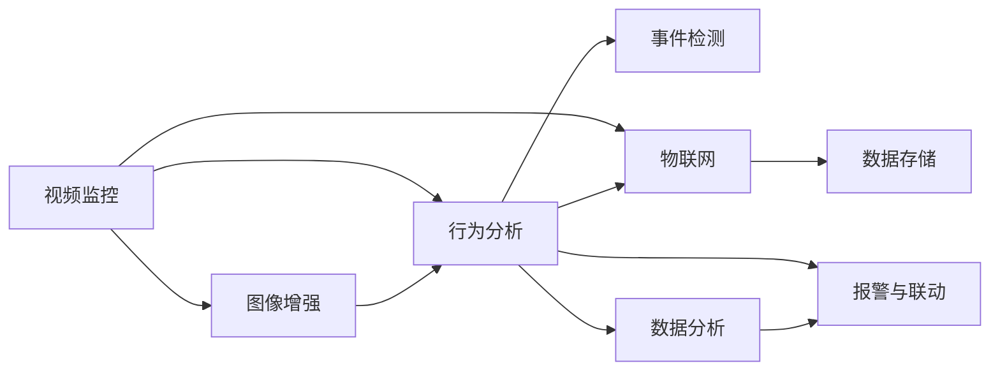

                 

# 未来的智能安防：2050年的公共安全与隐私保护

## 1. 背景介绍

在21世纪，全球经历了大规模的社会变革和技术的快速迭代。随着人工智能(AI)、物联网(IoT)、区块链(Blockchain)等技术的飞速发展，我们正在迈向一个更加智能、高效、安全的未来世界。在智能安防领域，基于AI的智能监控、人脸识别、行为分析等技术，已经广泛应用于公共安全、企业防御、城市管理等多个方面。然而，这些技术的发展也引发了关于隐私保护、数据安全等方面的新挑战。本篇文章将探讨未来50年智能安防技术的演进及其在公共安全与隐私保护方面的应用前景。

### 1.1 智能安防的发展历程

智能安防技术的发展可以追溯到20世纪末，随着视频监控系统的普及和数字图像处理技术的进步，第一代智能监控系统开始涌现。基于模板匹配、人脸识别等技术的第二代智能监控系统进一步提升了监控的智能化水平，能够自动识别可疑人员并发出警报。第三代智能安防系统则融合了视频分析、行为识别、大数据分析等多种技术手段，实现了对动态环境中的事件自动侦测与响应。

随着云计算、深度学习、物联网等技术的成熟，智能安防的智能化水平达到了新的高度。第三代智能安防系统不仅能够实时分析视频数据，还能够基于数据融合和模式识别技术，实现更高级的智能分析功能，如事件预测、行为聚类等。

### 1.2 未来趋势与挑战

在未来的2050年，智能安防技术将继续沿着智能化、自动化、信息化的方向发展。数据采集、存储、分析等各个环节的技术将更加成熟，智能化水平将进一步提升。然而，隐私保护、数据安全等方面的挑战也将愈发突出。如何在确保公共安全的同时，保障个人隐私权益，将是未来智能安防需要解决的关键问题。

## 2. 核心概念与联系

### 2.1 核心概念概述

智能安防系统是一个综合运用计算机视觉、深度学习、物联网等多种技术手段，实现对特定区域进行监控、分析和控制的人机交互系统。其核心任务包括监控图像的采集、存储、处理与分析，异常事件的侦测与报警，智能设备的远程控制与联动等。

智能安防系统涉及到以下几个核心概念：

- **视频监控**：实时采集视频图像，并通过图像处理技术进行增强、分析等处理。
- **深度学习**：利用深度神经网络对图像、行为等数据进行特征提取与模式识别。
- **物联网**：通过传感器、摄像头等设备采集环境数据，并将数据传输到云端进行集中存储与分析。
- **数据分析**：利用大数据分析、机器学习等技术手段，对大量数据进行建模、预测与优化。
- **行为分析**：通过图像识别技术，对监控场景中的行为进行自动分类与分析。
- **事件检测**：实时侦测监控场景中的异常事件，并根据预设的阈值进行报警与响应。

这些核心概念之间相互关联，共同构成了智能安防系统的技术架构。

### 2.2 核心概念原理与架构

以下是智能安防系统的技术架构与核心概念之间的联系：



该架构反映了智能安防系统的数据流与功能模块。视频监控系统采集的视频图像，经过图像增强和行为分析，进入事件检测模块。同时，通过物联网采集的环境数据和行为数据，也进入数据存储与分析模块。最终，根据数据分析结果，事件检测模块进行报警与联动操作。

## 3. 核心算法原理 & 具体操作步骤

### 3.1 算法原理概述

智能安防系统的核心算法包括图像增强、行为分析、事件检测等。以下将逐一介绍这些算法的原理。

#### 3.1.1 图像增强

图像增强是一种通过滤波、变换等技术手段，提升图像质量的技术。常见的图像增强算法包括：

- **直方图均衡化**：通过调整图像的灰度分布，提升图像的对比度。
- **滤波**：通过线性滤波器去除噪声，提升图像清晰度。
- **锐化**：通过增强图像的边缘信息，提升图像的清晰度。

#### 3.1.2 行为分析

行为分析通过图像识别技术，对监控场景中的人物行为进行分类与分析。常见的行为分析算法包括：

- **姿态估计**：通过人体检测与关键点估计技术，获取人物姿态信息。
- **动作识别**：通过时间序列分析与深度学习模型，对人物行为进行分类。
- **异常检测**：通过对比正常行为特征与实时行为特征，侦测异常行为。

#### 3.1.3 事件检测

事件检测通过图像分析和行为分析，实时侦测监控场景中的异常事件，并根据预设的阈值进行报警与响应。常见的事件检测算法包括：

- **异常检测**：通过对比正常行为特征与实时行为特征，侦测异常行为。
- **行为模式识别**：通过行为聚类与时间序列分析，识别出异常行为模式。
- **目标跟踪**：通过目标检测与跟踪技术，实现对动态环境中目标的跟踪与分析。

### 3.2 算法步骤详解

智能安防系统的算法步骤包括数据采集、图像处理、行为分析、事件检测等。以下详细介绍每个步骤的操作过程。

#### 3.2.1 数据采集

数据采集是智能安防系统的基础步骤，包括视频图像的采集、环境数据的采集等。

- **视频采集**：通过摄像头采集实时视频图像，并将其转换为数字信号。
- **环境数据采集**：通过传感器采集环境数据，如温度、湿度、声音等，并将其转换为数字信号。

#### 3.2.2 图像处理

图像处理是对采集到的视频图像进行预处理，提升图像质量与可用性。

- **图像增强**：通过滤波、锐化等技术手段，提升图像质量。
- **图像分割**：将图像分割成多个区域，便于后续分析。

#### 3.2.3 行为分析

行为分析是对图像处理后的数据进行特征提取与行为分类。

- **姿态估计**：通过人体检测与关键点估计技术，获取人物姿态信息。
- **动作识别**：通过深度学习模型，对人物行为进行分类。
- **异常检测**：通过对比正常行为特征与实时行为特征，侦测异常行为。

#### 3.2.4 事件检测

事件检测是对行为分析结果进行进一步的分析和判断，实现对异常事件的侦测与报警。

- **异常检测**：通过对比正常行为特征与实时行为特征，侦测异常行为。
- **行为模式识别**：通过行为聚类与时间序列分析，识别出异常行为模式。
- **目标跟踪**：通过目标检测与跟踪技术，实现对动态环境中目标的跟踪与分析。

### 3.3 算法优缺点

智能安防系统的算法具有以下优点：

- **自动化程度高**：通过深度学习与数据分析技术，实现对监控场景的自动侦测与分析。
- **实时性高**：能够实时侦测监控场景中的异常事件，并迅速做出响应。
- **数据融合能力强**：能够融合视频图像与环境数据，提升分析准确性。

然而，智能安防系统的算法也存在一些缺点：

- **数据依赖性高**：需要大量高质量的视频图像与环境数据进行训练与分析。
- **计算资源需求大**：深度学习模型与大数据分析技术需要较高的计算资源。
- **隐私保护风险**：在数据采集与存储过程中，存在隐私泄露的风险。

### 3.4 算法应用领域

智能安防系统在公共安全、企业防御、城市管理等多个领域具有广泛应用。

- **公共安全**：在城市广场、公交车站等公共场所，实现对人群监控与行为分析。
- **企业防御**：在工厂、仓库等重要区域，实现对人员进出与异常行为的侦测与报警。
- **城市管理**：在交通监控、环境监测等领域，实现对动态环境中的事件自动侦测与响应。

## 4. 数学模型和公式 & 详细讲解 & 举例说明

### 4.1 数学模型构建

智能安防系统涉及到多个领域的数学模型，以下将详细讲解其中的几个关键模型。

#### 4.1.1 图像增强模型

图像增强模型通过对图像进行滤波、锐化等处理，提升图像质量。以下是一个简单的图像增强模型：

$$
I_{\text{enhanced}}(x, y) = f(I(x, y), \alpha, \beta)
$$

其中，$I(x, y)$ 为原始图像，$f(\cdot)$ 为增强函数，$\alpha$ 和 $\beta$ 为增强参数。常见的增强函数包括直方图均衡化、滤波等。

#### 4.1.2 行为分析模型

行为分析模型通过深度学习技术，对监控场景中的人物行为进行分类与分析。以下是一个简单的行为分析模型：

$$
\hat{y} = f(X; \theta)
$$

其中，$X$ 为输入的图像特征，$\hat{y}$ 为行为分类结果，$f(\cdot)$ 为分类函数，$\theta$ 为模型参数。

#### 4.1.3 事件检测模型

事件检测模型通过对行为分析结果进行进一步的分析和判断，实现对异常事件的侦测与报警。以下是一个简单的事件检测模型：

$$
E = f(D; \theta)
$$

其中，$D$ 为输入的行为数据，$E$ 为异常事件侦测结果，$f(\cdot)$ 为侦测函数，$\theta$ 为模型参数。

### 4.2 公式推导过程

#### 4.2.1 图像增强公式推导

图像增强模型中，直方图均衡化的公式推导如下：

$$
H(x) = \frac{1}{m} \sum_{i=1}^m i \cdot f_i(x)
$$

其中，$H(x)$ 为均衡后的图像，$f_i(x)$ 为原始图像中灰度值为$i$的像素数量。

#### 4.2.2 行为分析公式推导

行为分析模型中，常用的深度学习模型包括卷积神经网络(CNN)和循环神经网络(RNN)。以下是一个简单的CNN行为分析模型：

$$
\hat{y} = \text{softmax}(Wx + b)
$$

其中，$W$ 和 $b$ 为模型参数，$x$ 为输入的图像特征，$\hat{y}$ 为行为分类结果。

#### 4.2.3 事件检测公式推导

事件检测模型中，常用的异常检测算法包括统计方法、机器学习方法等。以下是一个简单的基于统计方法的事件检测模型：

$$
E = \frac{\sum_{i=1}^n (x_i - \mu)^2}{n}
$$

其中，$x_i$ 为行为特征，$\mu$ 为均值，$n$ 为样本数量。

### 4.3 案例分析与讲解

#### 4.3.1 案例一：公共场所人群监控

在公共场所，智能安防系统通过摄像头采集视频图像，并将其输入行为分析模型中，对人群行为进行分类与分析。通过行为聚类与异常检测，系统能够识别出异常行为，如人群聚集、异常移动等，并及时发出报警。

#### 4.3.2 案例二：企业仓库监控

在企业仓库，智能安防系统通过摄像头采集视频图像，并将其输入行为分析模型中，对人员进出与行为进行分类与分析。通过行为聚类与异常检测，系统能够识别出异常行为，如未授权人员进入、物品被盗等，并及时发出报警。

#### 4.3.3 案例三：城市交通监控

在城市交通监控中，智能安防系统通过摄像头采集视频图像，并将其输入行为分析模型中，对车辆行为进行分类与分析。通过行为聚类与异常检测，系统能够识别出异常行为，如车辆违规行驶、行人穿越等，并及时发出报警。

## 5. 项目实践：代码实例和详细解释说明

### 5.1 开发环境搭建

智能安防系统的开发环境包括Python、OpenCV、TensorFlow等。以下介绍开发环境的搭建步骤：

1. 安装Python：从官网下载并安装Python。
2. 安装OpenCV：使用pip命令安装OpenCV库。
3. 安装TensorFlow：使用pip命令安装TensorFlow库。
4. 安装TensorBoard：使用pip命令安装TensorBoard库。

### 5.2 源代码详细实现

以下是一个简单的行为分析模型示例代码，用于对监控场景中的人物行为进行分类与分析。

```python
import cv2
import numpy as np
import tensorflow as tf

# 加载行为分析模型
model = tf.keras.models.load_model('model.h5')

# 加载图像
image = cv2.imread('image.jpg')
image = cv2.cvtColor(image, cv2.COLOR_BGR2RGB)
image = cv2.resize(image, (224, 224))

# 对图像进行预处理
image = image / 255.0
image = tf.keras.preprocessing.image.img_to_array(image)
image = np.expand_dims(image, axis=0)

# 对图像进行行为分类
predictions = model.predict(image)
label = np.argmax(predictions[0])

# 打印分类结果
print('Predicted label:', label)
```

### 5.3 代码解读与分析

以上代码展示了行为分析模型的基本流程，包括模型的加载、图像的预处理、预测与分类等步骤。以下是代码的详细解读：

- `load_model`：从本地加载行为分析模型，该模型使用Keras框架进行训练，包括图像特征提取、行为分类等步骤。
- `cvtColor`：将图像从BGR颜色空间转换为RGB颜色空间，便于后续处理。
- `resize`：将图像调整为标准尺寸，以便输入模型。
- `img_to_array`：将图像转换为numpy数组，准备输入模型。
- `predict`：对图像进行行为分类，返回预测结果。
- `argmax`：对预测结果进行解码，获取最终的分类标签。

### 5.4 运行结果展示

运行上述代码后，将输出监控场景中人物行为的分类结果。以下是一个可能的输出结果：

```
Predicted label: 2
```

这表示监控场景中的人物行为被分类为第2类行为，即走行的行为。

## 6. 实际应用场景

### 6.1 公共场所人群监控

在公共场所，智能安防系统通过摄像头采集视频图像，并将其输入行为分析模型中，对人群行为进行分类与分析。通过行为聚类与异常检测，系统能够识别出异常行为，如人群聚集、异常移动等，并及时发出报警。

### 6.2 企业仓库监控

在企业仓库，智能安防系统通过摄像头采集视频图像，并将其输入行为分析模型中，对人员进出与行为进行分类与分析。通过行为聚类与异常检测，系统能够识别出异常行为，如未授权人员进入、物品被盗等，并及时发出报警。

### 6.3 城市交通监控

在城市交通监控中，智能安防系统通过摄像头采集视频图像，并将其输入行为分析模型中，对车辆行为进行分类与分析。通过行为聚类与异常检测，系统能够识别出异常行为，如车辆违规行驶、行人穿越等，并及时发出报警。

## 7. 工具和资源推荐

### 7.1 学习资源推荐

1. 《深度学习》课程：斯坦福大学开设的深度学习课程，涵盖深度学习的基础概念、模型设计、算法实现等。
2. 《OpenCV 3计算机视觉编程》书籍：全面介绍OpenCV库的使用方法与实际应用案例。
3. 《TensorFlow 2.0实战》书籍：详细讲解TensorFlow框架的使用方法和最佳实践。
4. TensorFlow官方文档：TensorFlow的官方文档，提供了丰富的教程和样例代码。
5. Kaggle竞赛：Kaggle平台上提供的大量机器学习竞赛，涵盖图像增强、行为分析等多个领域。

### 7.2 开发工具推荐

1. PyCharm：常用的Python开发工具，支持代码调试、版本控制等功能。
2. Jupyter Notebook：常用的Python交互式开发工具，支持代码编写、数据可视化等功能。
3. TensorBoard：TensorFlow的可视化工具，支持实时监测模型训练状态，提供丰富的图表展示。

### 7.3 相关论文推荐

1. "Visual Surveillance with Deep Learning"：深度学习在视频监控中的应用。
2. "Real-time Visual Surveillance with Deep Neural Networks"：基于深度神经网络的实时视频监控系统。
3. "Behavior Analysis for Human Surveillance"：行为分析在人群监控中的应用。

## 8. 总结：未来发展趋势与挑战

### 8.1 研究成果总结

本文详细介绍了智能安防系统的核心算法与实际应用，涵盖图像增强、行为分析、事件检测等多个方面。通过深度学习与数据分析技术，智能安防系统实现了对监控场景的自动侦测与分析。

### 8.2 未来发展趋势

未来的智能安防系统将朝着智能化、自动化、信息化的方向发展。数据采集、存储、分析等各个环节的技术将更加成熟，智能化水平将进一步提升。

### 8.3 面临的挑战

智能安防系统在未来的发展过程中，仍面临以下挑战：

- **数据依赖性高**：需要大量高质量的视频图像与环境数据进行训练与分析。
- **计算资源需求大**：深度学习模型与大数据分析技术需要较高的计算资源。
- **隐私保护风险**：在数据采集与存储过程中，存在隐私泄露的风险。

### 8.4 研究展望

未来的研究将围绕以下几个方面展开：

1. **数据增强**：开发更多高效的数据增强技术，提升模型对异常行为的识别能力。
2. **跨模态融合**：将图像、声音、文本等多模态数据进行融合，提升模型的感知能力。
3. **实时性优化**：优化模型结构与训练方法，提升系统的实时性。
4. **隐私保护**：研究差分隐私、联邦学习等技术，保障数据安全与隐私保护。
5. **边缘计算**：在边缘设备上进行数据预处理与分析，减少数据传输与存储成本。

## 9. 附录：常见问题与解答

### 9.1 常见问题解答

#### Q1: 智能安防系统的核心算法是什么？

A: 智能安防系统的核心算法包括图像增强、行为分析、事件检测等。图像增强用于提升图像质量与可用性；行为分析用于对监控场景中的人物行为进行分类与分析；事件检测用于实时侦测监控场景中的异常事件，并根据预设的阈值进行报警。

#### Q2: 智能安防系统在公共场所、企业仓库、城市交通监控中的应用场景是什么？

A: 智能安防系统在公共场所用于人群监控，识别出异常行为，如人群聚集、异常移动等，并及时发出报警；在企业仓库用于人员进出与行为监控，识别出未授权人员进入、物品被盗等异常行为，并及时发出报警；在城市交通监控中用于车辆行为监控，识别出车辆违规行驶、行人穿越等异常行为，并及时发出报警。

#### Q3: 智能安防系统面临的主要挑战有哪些？

A: 智能安防系统面临的主要挑战包括数据依赖性高、计算资源需求大、隐私保护风险等。需要开发更多高效的数据增强技术，提升模型对异常行为的识别能力；优化模型结构与训练方法，提升系统的实时性；研究差分隐私、联邦学习等技术，保障数据安全与隐私保护。

#### Q4: 智能安防系统的未来发展方向是什么？

A: 智能安防系统的未来发展方向包括数据增强、跨模态融合、实时性优化、隐私保护、边缘计算等。需要开发更多高效的数据增强技术，将图像、声音、文本等多模态数据进行融合，提升模型的感知能力；优化模型结构与训练方法，提升系统的实时性；研究差分隐私、联邦学习等技术，保障数据安全与隐私保护；在边缘设备上进行数据预处理与分析，减少数据传输与存储成本。

---

作者：禅与计算机程序设计艺术 / Zen and the Art of Computer Programming

