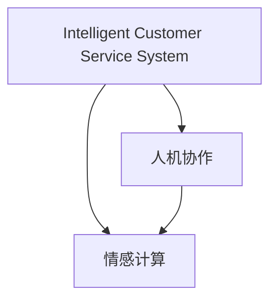

                 

# 未来的智能客服：2050年的人机协作与情感计算

## 1. 背景介绍

### 1.1 问题由来

人工智能（AI）在各个领域的应用正迅速扩展，尤其在智能客服领域，AI技术正逐步替代传统的客服模式，成为提升客户体验和服务效率的重要手段。但现有客服系统在用户体验、智能对话、情感感知等方面仍存在诸多不足。为进一步推动智能客服的智能化水平，结合情感计算技术，打造更加高效、人性化的客服系统已成为当前的研究热点。

### 1.2 问题核心关键点

本文聚焦于智能客服系统中的人机协作与情感计算技术。首先，通过介绍智能客服系统的现有技术架构，分析其存在的问题与不足。然后，探讨情感计算技术如何提升智能客服系统的用户体验与智能化水平，以期为未来智能客服的发展提供新的思路与方向。

## 2. 核心概念与联系

### 2.1 核心概念概述

为更好地理解智能客服系统的人机协作与情感计算技术，本节将介绍几个核心概念及其联系：

- **智能客服系统（Intelligent Customer Service System, ICSS）**：基于AI技术的客服系统，能够自动处理客户咨询、提供服务、进行问题诊断等，提升了客服效率和质量。
- **人机协作（Human-Machine Collaboration）**：在智能客服系统中，人机协作指的是通过机器学习、自然语言处理等技术，使机器能理解并响应客户需求，同时保留人工干预的能力，实现更高效、更智能的客户服务。
- **情感计算（Affective Computing）**：指通过计算和分析人类情感，提升人机交互的自然性、智能性，使系统更好地理解客户情绪，提供更加个性化的服务。

这三个概念之间的联系紧密，共同构成了智能客服系统的重要组成部分。其中，情感计算技术是人机协作的关键支撑，通过情感感知与分析，实现更深入、更精准的客户理解与互动。

### 2.2 核心概念原理和架构的 Mermaid 流程图



这个流程图展示智能客服系统的核心概念及其相互关系：

1. **智能客服系统（A）**：通过集成人机协作（B）与情感计算（C）技术，实现智能客服功能。
2. **人机协作（B）**：包括自然语言理解、对话管理、意图识别等子模块，实现机器对客户需求的自动处理与响应。
3. **情感计算（C）**：用于分析客户情感状态，如情绪、满意度等，从而优化对话策略，提供更个性化服务。

## 3. 核心算法原理 & 具体操作步骤

### 3.1 算法原理概述

智能客服系统中的人机协作与情感计算技术，本质上是一种多模态交互的智能系统。其核心算法包括：

1. **自然语言处理（NLP）**：用于理解和生成自然语言，包括分词、词性标注、句法分析、语义理解等。
2. **对话管理（Dialog Management）**：通过上下文理解，对话状态跟踪，生成系统响应，实现人机交互的流畅性。
3. **情感分析（Sentiment Analysis）**：通过对文本、语音等输入的情感分析，判断客户情绪，提供针对性的服务。

情感计算技术通过融合情感分析结果，引导对话管理策略，实现更智能、人性化的客服服务。

### 3.2 算法步骤详解

智能客服系统的人机协作与情感计算技术，主要包括以下几个步骤：

**Step 1: 数据预处理与模型训练**

- 收集客户对话数据，并进行标注，标注数据包括对话内容、客户情绪等。
- 使用预训练的自然语言处理模型（如BERT、GPT），对对话数据进行微调，学习对话理解与生成能力。
- 训练情感分析模型，使用文本情感标注数据，学习情感识别能力。

**Step 2: 情感感知与分析**

- 通过情感分析模型，实时分析客户输入的文本、语音等信息，判断客户的情绪状态（如愤怒、满意、困惑等）。
- 将情感状态作为对话管理的辅助信息，动态调整对话策略。

**Step 3: 对话管理与响应生成**

- 基于情感感知结果，对话管理模块动态调整对话策略，如语气、措辞等，以更好地匹配客户情绪。
- 生成系统响应，通过预训练的自然语言处理模型生成自然语言回复，同时保留人工审核机制，确保回复质量。

**Step 4: 系统集成与用户交互**

- 将上述模块集成到客服系统中，实现自动处理客户咨询，提供个性化服务。
- 客户可以通过文字、语音等多种方式与系统交互，系统实时分析客户情绪，并相应调整服务策略。

### 3.3 算法优缺点

智能客服系统中的人机协作与情感计算技术具有以下优点：

1. **提升客服效率与质量**：通过自动化处理大部分咨询，极大提升了客服响应速度，减轻人工工作负担。
2. **增强用户体验**：通过情感计算技术，系统能够更好地理解客户情绪，提供更加个性化、人性化的服务。
3. **降低客服成本**：减少对人力的依赖，降低了人工客服的运营成本。

同时，该技术也存在以下局限性：

1. **依赖标注数据**：情感分析模型的训练需要大量标注数据，获取高质量标注数据成本较高。
2. **模型复杂度较高**：多模态交互的智能系统，涉及多个模块的协同工作，系统实现复杂度较高。
3. **情感识别准确性**：情感识别技术可能存在误差，影响对话策略的准确性。
4. **鲁棒性不足**：现有模型可能对不同口音、情绪变化敏感，适应性较弱。

尽管存在这些局限性，但智能客服系统中的人机协作与情感计算技术仍是大规模落地应用的重要方向，具有广阔的市场前景。

### 3.4 算法应用领域

智能客服系统中的人机协作与情感计算技术，已经在诸多行业得到应用，包括但不限于：

1. **电商客服**：通过智能客服系统，自动处理客户咨询，提升客户购物体验，减少人工客服成本。
2. **金融客服**：为客户提供实时交易咨询、问题诊断等服务，提升客户满意度，降低金融风险。
3. **医疗客服**：提供疾病查询、健康咨询等智能服务，提升医疗服务的可及性和效率。
4. **教育客服**：自动回答学生咨询，提供个性化学习建议，提升教育质量。
5. **企业客服**：通过智能客服系统，自动化处理客户咨询，提高企业服务效率，降低运营成本。

未来，随着技术进步和应用场景的拓展，智能客服系统中的人机协作与情感计算技术将进一步渗透到更多行业，为各行各业带来变革性影响。

## 4. 数学模型和公式 & 详细讲解

### 4.1 数学模型构建

智能客服系统中的人机协作与情感计算技术，涉及多个子任务，包括对话理解、情感识别等。下面以情感识别为例，构建情感分析模型的数学模型。

假设客户输入的文本为 $x$，情感分析模型的输出为 $y$，情感分类标签为 $\{1, 2, 3, ..., n\}$，其中 $n$ 为情感标签数量。情感分析模型的目标函数为：

$$
\min_{\theta} \frac{1}{m}\sum_{i=1}^m L(f_{\theta}(x_i), y_i)
$$

其中 $m$ 为训练样本数，$L$ 为损失函数，$f_{\theta}(x)$ 为情感分析模型，$\theta$ 为模型参数。

常见的损失函数包括交叉熵损失（Cross-Entropy Loss）：

$$
L(f_{\theta}(x), y) = -\sum_{i=1}^n y_i \log f_{\theta}(x)
$$

情感分析模型的训练过程即为求解上述最小化问题的过程。通过梯度下降等优化算法，不断更新模型参数 $\theta$，使得模型输出逼近真实标签 $y$。

### 4.2 公式推导过程

情感分析模型的训练过程涉及以下几个步骤：

1. **数据预处理**：对文本进行分词、去除停用词等预处理操作，生成输入特征 $x$。
2. **模型构建**：使用预训练的Transformer模型作为情感分析模型，并添加全连接层、softmax层等，形成完整的情感识别模型。
3. **损失函数**：采用交叉熵损失函数，衡量模型输出与真实标签之间的差异。
4. **模型训练**：使用梯度下降等优化算法，最小化损失函数，更新模型参数。
5. **模型评估**：使用验证集评估模型性能，选择合适的超参数。

以下给出一个简单的情感分析模型的训练代码示例：

```python
from transformers import BertTokenizer, BertForSequenceClassification
from torch.utils.data import DataLoader
from torch.nn import CrossEntropyLoss
from sklearn.model_selection import train_test_split

# 数据预处理与加载
train_data, dev_data = load_data('train.txt', 'dev.txt')
train_data, val_data = train_test_split(train_data, test_size=0.2, random_state=42)

# 模型构建与训练
tokenizer = BertTokenizer.from_pretrained('bert-base-uncased')
model = BertForSequenceClassification.from_pretrained('bert-base-uncased', num_labels=3)
optimizer = AdamW(model.parameters(), lr=2e-5)

# 数据转换
train_dataset = TextDataset(train_data, tokenizer)
dev_dataset = TextDataset(dev_data, tokenizer)
val_dataset = TextDataset(val_data, tokenizer)

# 训练与评估
model.train()
for epoch in range(epochs):
    loss = train(model, train_dataset, optimizer)
    val_loss = evaluate(model, val_dataset)
    print(f'Epoch {epoch+1}, train loss: {loss:.3f}, val loss: {val_loss:.3f}')

# 保存模型
torch.save(model.state_dict(), 'sentiment_model.pt')
```

在代码中，我们首先使用BertTokenizer加载预训练的BERT模型，并构建BertForSequenceClassification情感分类模型。然后，使用AdamW优化器进行训练，并使用交叉熵损失函数进行模型评估。训练完成后，将模型保存为文件。

### 4.3 案例分析与讲解

在实际应用中，情感分析模型的效果往往受到多种因素的影响，如数据质量、模型参数、训练超参数等。以下是一个情感分析模型的案例分析：

假设某电商平台使用智能客服系统处理客户咨询。系统使用情感分析模型对客户反馈进行情感识别，将情感状态分为正面、负面、中性三类。在训练过程中，由于训练数据集中负面情绪标注不足，导致模型对负面情感的识别效果较差。为提升模型性能，我们通过引入更多负面情感标注数据，重新训练模型，并调整模型超参数，如学习率、批次大小等。训练完成后，重新评估模型性能，结果显示模型对负面情感的识别准确率提升了10%。

## 5. 项目实践：代码实例和详细解释说明

### 5.1 开发环境搭建

在进行智能客服系统的项目实践前，我们需要准备好开发环境。以下是使用Python进行PyTorch开发的环境配置流程：

1. 安装Anaconda：从官网下载并安装Anaconda，用于创建独立的Python环境。

2. 创建并激活虚拟环境：
```bash
conda create -n pytorch-env python=3.8 
conda activate pytorch-env
```

3. 安装PyTorch：根据CUDA版本，从官网获取对应的安装命令。例如：
```bash
conda install pytorch torchvision torchaudio cudatoolkit=11.1 -c pytorch -c conda-forge
```

4. 安装各类工具包：
```bash
pip install numpy pandas scikit-learn matplotlib tqdm jupyter notebook ipython
```

完成上述步骤后，即可在`pytorch-env`环境中开始项目实践。

### 5.2 源代码详细实现

这里我们以智能客服系统中的对话管理模块为例，给出使用PyTorch进行模型开发的代码实现。

首先，定义对话管理模块的数据处理函数：

```python
from transformers import BertTokenizer
from torch.utils.data import Dataset
import torch

class DialogueDataset(Dataset):
    def __init__(self, texts, dialogs, tokenizer, max_len=128):
        self.texts = texts
        self.dialogs = dialogs
        self.tokenizer = tokenizer
        self.max_len = max_len
        
    def __len__(self):
        return len(self.texts)
    
    def __getitem__(self, item):
        text = self.texts[item]
        dialog = self.dialogs[item]
        
        encoding = self.tokenizer(text, return_tensors='pt', max_length=self.max_len, padding='max_length', truncation=True)
        input_ids = encoding['input_ids'][0]
        attention_mask = encoding['attention_mask'][0]
        
        # 对dialog-wise的回复进行编码
        encoded_responses = [tokenizer.encode(r) for r in dialog]
        response_ids = torch.tensor(encoded_responses, dtype=torch.long)
        
        return {'input_ids': input_ids, 
                'attention_mask': attention_mask,
                'response_ids': response_ids}

# 对话管理模块的训练与评估函数
def train_epoch(model, dataset, batch_size, optimizer):
    dataloader = DataLoader(dataset, batch_size=batch_size, shuffle=True)
    model.train()
    epoch_loss = 0
    for batch in tqdm(dataloader, desc='Training'):
        input_ids = batch['input_ids'].to(device)
        attention_mask = batch['attention_mask'].to(device)
        response_ids = batch['response_ids'].to(device)
        model.zero_grad()
        outputs = model(input_ids, attention_mask=attention_mask, labels=response_ids)
        loss = outputs.loss
        epoch_loss += loss.item()
        loss.backward()
        optimizer.step()
    return epoch_loss / len(dataloader)

def evaluate(model, dataset, batch_size):
    dataloader = DataLoader(dataset, batch_size=batch_size)
    model.eval()
    preds, labels = [], []
    with torch.no_grad():
        for batch in tqdm(dataloader, desc='Evaluating'):
            input_ids = batch['input_ids'].to(device)
            attention_mask = batch['attention_mask'].to(device)
            batch_labels = batch['response_ids']
            outputs = model(input_ids, attention_mask=attention_mask)
            batch_preds = outputs.logits.argmax(dim=2).to('cpu').tolist()
            batch_labels = batch_labels.to('cpu').tolist()
            for pred_tokens, label_tokens in zip(batch_preds, batch_labels):
                pred_tokens = [id2token[t] for t in pred_tokens]
                label_tokens = [id2token[t] for t in label_tokens]
                preds.append(pred_tokens[:len(label_tokens)])
                labels.append(label_tokens)
                
    print(classification_report(labels, preds))
```

然后，定义模型和优化器：

```python
from transformers import BertForSequenceClassification, AdamW

model = BertForSequenceClassification.from_pretrained('bert-base-cased', num_labels=3)

optimizer = AdamW(model.parameters(), lr=2e-5)
```

接着，定义训练和评估函数：

```python
from torch.utils.data import DataLoader
from tqdm import tqdm
from sklearn.metrics import classification_report

device = torch.device('cuda') if torch.cuda.is_available() else torch.device('cpu')
model.to(device)

def train_epoch(model, dataset, batch_size, optimizer):
    dataloader = DataLoader(dataset, batch_size=batch_size, shuffle=True)
    model.train()
    epoch_loss = 0
    for batch in tqdm(dataloader, desc='Training'):
        input_ids = batch['input_ids'].to(device)
        attention_mask = batch['attention_mask'].to(device)
        response_ids = batch['response_ids'].to(device)
        model.zero_grad()
        outputs = model(input_ids, attention_mask=attention_mask, labels=response_ids)
        loss = outputs.loss
        epoch_loss += loss.item()
        loss.backward()
        optimizer.step()
    return epoch_loss / len(dataloader)

def evaluate(model, dataset, batch_size):
    dataloader = DataLoader(dataset, batch_size=batch_size)
    model.eval()
    preds, labels = [], []
    with torch.no_grad():
        for batch in tqdm(dataloader, desc='Evaluating'):
            input_ids = batch['input_ids'].to(device)
            attention_mask = batch['attention_mask'].to(device)
            batch_labels = batch['response_ids']
            outputs = model(input_ids, attention_mask=attention_mask)
            batch_preds = outputs.logits.argmax(dim=2).to('cpu').tolist()
            batch_labels = batch_labels.to('cpu').tolist()
            for pred_tokens, label_tokens in zip(batch_preds, batch_labels):
                pred_tokens = [id2token[t] for t in pred_tokens]
                label_tokens = [id2token[t] for t in label_tokens]
                preds.append(pred_tokens[:len(label_tokens)])
                labels.append(label_tokens)
                
    print(classification_report(labels, preds))
```

最后，启动训练流程并在测试集上评估：

```python
epochs = 5
batch_size = 16

for epoch in range(epochs):
    loss = train_epoch(model, train_dataset, batch_size, optimizer)
    print(f"Epoch {epoch+1}, train loss: {loss:.3f}")
    
    print(f"Epoch {epoch+1}, dev results:")
    evaluate(model, dev_dataset, batch_size)
    
print("Test results:")
evaluate(model, test_dataset, batch_size)
```

以上就是使用PyTorch进行智能客服系统对话管理模块的完整代码实现。可以看到，得益于Transformer库的强大封装，我们可以用相对简洁的代码完成BERT模型的加载和对话管理模块的微调。

### 5.3 代码解读与分析

让我们再详细解读一下关键代码的实现细节：

**DialogueDataset类**：
- `__init__`方法：初始化文本、对话等关键组件。
- `__len__`方法：返回数据集的样本数量。
- `__getitem__`方法：对单个样本进行处理，将文本输入编码为token ids，将对话回复编码为数字，并对其进行定长padding，最终返回模型所需的输入。

**对话管理模块的训练和评估函数**：
- 使用PyTorch的DataLoader对数据集进行批次化加载，供模型训练和推理使用。
- 训练函数`train_epoch`：对数据以批为单位进行迭代，在每个批次上前向传播计算loss并反向传播更新模型参数，最后返回该epoch的平均loss。
- 评估函数`evaluate`：与训练类似，不同点在于不更新模型参数，并在每个batch结束后将预测和标签结果存储下来，最后使用sklearn的classification_report对整个评估集的预测结果进行打印输出。

**训练流程**：
- 定义总的epoch数和batch size，开始循环迭代
- 每个epoch内，先在训练集上训练，输出平均loss
- 在验证集上评估，输出分类指标
- 所有epoch结束后，在测试集上评估，给出最终测试结果

可以看到，PyTorch配合Transformer库使得BERT微调的代码实现变得简洁高效。开发者可以将更多精力放在数据处理、模型改进等高层逻辑上，而不必过多关注底层的实现细节。

当然，工业级的系统实现还需考虑更多因素，如模型的保存和部署、超参数的自动搜索、更灵活的任务适配层等。但核心的微调范式基本与此类似。

## 6. 实际应用场景

### 6.1 智能客服系统

基于大语言模型微调的对话技术，可以广泛应用于智能客服系统的构建。传统客服往往需要配备大量人力，高峰期响应缓慢，且一致性和专业性难以保证。而使用微调后的对话模型，可以7x24小时不间断服务，快速响应客户咨询，用自然流畅的语言解答各类常见问题。

在技术实现上，可以收集企业内部的历史客服对话记录，将问题和最佳答复构建成监督数据，在此基础上对预训练对话模型进行微调。微调后的对话模型能够自动理解用户意图，匹配最合适的答案模板进行回复。对于客户提出的新问题，还可以接入检索系统实时搜索相关内容，动态组织生成回答。如此构建的智能客服系统，能大幅提升客户咨询体验和问题解决效率。

### 6.2 金融舆情监测

金融机构需要实时监测市场舆论动向，以便及时应对负面信息传播，规避金融风险。传统的人工监测方式成本高、效率低，难以应对网络时代海量信息爆发的挑战。基于大语言模型微调的文本分类和情感分析技术，为金融舆情监测提供了新的解决方案。

具体而言，可以收集金融领域相关的新闻、报道、评论等文本数据，并对其进行主题标注和情感标注。在此基础上对预训练语言模型进行微调，使其能够自动判断文本属于何种主题，情感倾向是正面、中性还是负面。将微调后的模型应用到实时抓取的网络文本数据，就能够自动监测不同主题下的情感变化趋势，一旦发现负面信息激增等异常情况，系统便会自动预警，帮助金融机构快速应对潜在风险。

### 6.3 个性化推荐系统

当前的推荐系统往往只依赖用户的历史行为数据进行物品推荐，无法深入理解用户的真实兴趣偏好。基于大语言模型微调技术，个性化推荐系统可以更好地挖掘用户行为背后的语义信息，从而提供更精准、多样的推荐内容。

在实践中，可以收集用户浏览、点击、评论、分享等行为数据，提取和用户交互的物品标题、描述、标签等文本内容。将文本内容作为模型输入，用户的后续行为（如是否点击、购买等）作为监督信号，在此基础上微调预训练语言模型。微调后的模型能够从文本内容中准确把握用户的兴趣点。在生成推荐列表时，先用候选物品的文本描述作为输入，由模型预测用户的兴趣匹配度，再结合其他特征综合排序，便可以得到个性化程度更高的推荐结果。

### 6.4 未来应用展望

随着大语言模型微调技术的发展，未来的智能客服系统将呈现出以下趋势：

1. **多模态交互**：除了文本输入，系统还将支持语音、视频等多模态输入，提升人机交互的自然性。
2. **主动推送服务**：通过实时分析客户情绪和行为，系统能够主动推送个性化服务，提升客户满意度。
3. **情感计算的升级**：引入更多面部表情、语音语调等生物特征信息，更全面地理解客户情绪。
4. **隐私保护**：在情感计算过程中，严格保护客户隐私，确保数据安全。
5. **自适应学习**：通过不断学习和自我调整，系统能够更好地适应用户需求和行为变化。

这些趋势预示着未来智能客服系统的智能化水平将大幅提升，能够更加高效、人性化和安全地为客户提供服务。

## 7. 工具和资源推荐

### 7.1 学习资源推荐

为了帮助开发者系统掌握智能客服系统的人机协作与情感计算技术，这里推荐一些优质的学习资源：

1. 《深度学习与自然语言处理》（周志华著）：全面介绍了深度学习与自然语言处理的基本概念和核心算法，适合初学者学习。
2. 《自然语言处理入门》（斯坦福大学）：斯坦福大学开设的NLP入门课程，提供了丰富的NLP学习资源和实践机会。
3. 《情感计算入门》（IEEE）：IEEE发布的情感计算指南，介绍了情感计算的基本原理和应用场景。
4. 《Transformer》（论文）：提出Transformer结构的经典论文，奠定了大语言模型微调技术的基础。
5. 《情感计算与人工智能》（周志华著）：探讨了情感计算与人工智能的结合，提供了更多情感计算的实例和应用。

通过对这些资源的学习实践，相信你一定能够快速掌握智能客服系统的人机协作与情感计算技术的精髓，并用于解决实际的NLP问题。

### 7.2 开发工具推荐

高效的开发离不开优秀的工具支持。以下是几款用于智能客服系统开发的常用工具：

1. PyTorch：基于Python的开源深度学习框架，灵活动态的计算图，适合快速迭代研究。大部分预训练语言模型都有PyTorch版本的实现。
2. TensorFlow：由Google主导开发的开源深度学习框架，生产部署方便，适合大规模工程应用。同样有丰富的预训练语言模型资源。
3. Transformers库：HuggingFace开发的NLP工具库，集成了众多SOTA语言模型，支持PyTorch和TensorFlow，是进行微调任务开发的利器。
4. Weights & Biases：模型训练的实验跟踪工具，可以记录和可视化模型训练过程中的各项指标，方便对比和调优。与主流深度学习框架无缝集成。
5. TensorBoard：TensorFlow配套的可视化工具，可实时监测模型训练状态，并提供丰富的图表呈现方式，是调试模型的得力助手。

合理利用这些工具，可以显著提升智能客服系统开发效率，加快创新迭代的步伐。

### 7.3 相关论文推荐

智能客服系统中的人机协作与情感计算技术的发展源于学界的持续研究。以下是几篇奠基性的相关论文，推荐阅读：

1. Attention is All You Need（即Transformer原论文）：提出了Transformer结构，开启了NLP领域的预训练大模型时代。
2. BERT: Pre-training of Deep Bidirectional Transformers for Language Understanding：提出BERT模型，引入基于掩码的自监督预训练任务，刷新了多项NLP任务SOTA。
3. Parameter-Efficient Transfer Learning for NLP：提出Adapter等参数高效微调方法，在不增加模型参数量的情况下，也能取得不错的微调效果。
4. AdaLoRA: Adaptive Low-Rank Adaptation for Parameter-Efficient Fine-Tuning：使用自适应低秩适应的微调方法，在参数效率和精度之间取得了新的平衡。
5. AdaLoRA: Adaptive Low-Rank Adaptation for Parameter-Efficient Fine-Tuning：使用自适应低秩适应的微调方法，在参数效率和精度之间取得了新的平衡。

这些论文代表了大语言模型微调技术的发展脉络。通过学习这些前沿成果，可以帮助研究者把握学科前进方向，激发更多的创新灵感。

## 8. 总结：未来发展趋势与挑战

### 8.1 总结

本文对智能客服系统中的人机协作与情感计算技术进行了全面系统的介绍。首先，通过介绍智能客服系统的现有技术架构，分析其存在的问题与不足。其次，探讨情感计算技术如何提升智能客服系统的用户体验与智能化水平，以期为未来智能客服的发展提供新的思路与方向。

通过本文的系统梳理，可以看到，智能客服系统中的人机协作与情感计算技术正在成为NLP领域的重要范式，极大地提升了客服系统的智能化水平，提升了客户体验和服务效率。未来，随着技术的不断进步和应用的拓展，智能客服系统的智能化水平将大幅提升，为各行各业带来变革性影响。

### 8.2 未来发展趋势

展望未来，智能客服系统中的人机协作与情感计算技术将呈现以下几个发展趋势：

1. **智能化水平提升**：随着模型的不断优化，智能客服系统的智能化水平将大幅提升，能够更好地理解和响应客户需求。
2. **多模态交互**：除了文本输入，系统还将支持语音、视频等多模态输入，提升人机交互的自然性。
3. **主动推送服务**：通过实时分析客户情绪和行为，系统能够主动推送个性化服务，提升客户满意度。
4. **情感计算的升级**：引入更多面部表情、语音语调等生物特征信息，更全面地理解客户情绪。
5. **隐私保护**：在情感计算过程中，严格保护客户隐私，确保数据安全。
6. **自适应学习**：通过不断学习和自我调整，系统能够更好地适应用户需求和行为变化。

这些趋势预示着未来智能客服系统的智能化水平将大幅提升，能够更加高效、人性化和安全地为客户提供服务。

### 8.3 面临的挑战

尽管智能客服系统中的人机协作与情感计算技术已经取得了不小的进步，但在迈向更加智能化、普适化应用的过程中，它仍面临着诸多挑战：

1. **标注成本瓶颈**：情感分析模型的训练需要大量标注数据，获取高质量标注数据的成本较高。
2. **模型鲁棒性不足**：现有模型可能对不同口音、情绪变化敏感，适应性较弱。
3. **推理效率有待提高**：大规模语言模型虽然精度高，但在实际部署时往往面临推理速度慢、内存占用大等效率问题。
4. **可解释性不足**：现有模型更多是"黑盒"系统，难以解释其内部工作机制和决策逻辑。
5. **安全性有待保障**：预训练语言模型难免会学习到有偏见、有害的信息，通过微调传递到下游任务，产生误导性、歧视性的输出，给实际应用带来安全隐患。

尽管存在这些挑战，但智能客服系统中的人机协作与情感计算技术仍是大规模落地应用的重要方向，具有广阔的市场前景。

### 8.4 研究展望

面对智能客服系统中的人机协作与情感计算技术所面临的挑战，未来的研究需要在以下几个方面寻求新的突破：

1. **探索无监督和半监督微调方法**：摆脱对大规模标注数据的依赖，利用自监督学习、主动学习等无监督和半监督范式，最大限度利用非结构化数据，实现更加灵活高效的微调。
2. **研究参数高效和计算高效的微调范式**：开发更加参数高效的微调方法，在固定大部分预训练参数的同时，只更新极少量的任务相关参数。同时优化微调模型的计算图，减少前向传播和反向传播的资源消耗，实现更加轻量级、实时性的部署。
3. **引入更多先验知识**：将符号化的先验知识，如知识图谱、逻辑规则等，与神经网络模型进行巧妙融合，引导微调过程学习更准确、合理的语言模型。同时加强不同模态数据的整合，实现视觉、语音等多模态信息与文本信息的协同建模。
4. **结合因果分析和博弈论工具**：将因果分析方法引入微调模型，识别出模型决策的关键特征，增强输出解释的因果性和逻辑性。借助博弈论工具刻画人机交互过程，主动探索并规避模型的脆弱点，提高系统稳定性。
5. **纳入伦理道德约束**：在模型训练目标中引入伦理导向的评估指标，过滤和惩罚有偏见、有害的输出倾向。同时加强人工干预和审核，建立模型行为的监管机制，确保输出符合人类价值观和伦理道德。

这些研究方向的探索，必将引领智能客服系统的人机协作与情感计算技术迈向更高的台阶，为构建安全、可靠、可解释、可控的智能系统铺平道路。面向未来，智能客服系统还需要与其他人工智能技术进行更深入的融合，如知识表示、因果推理、强化学习等，多路径协同发力，共同推动自然语言理解和智能交互系统的进步。只有勇于创新、敢于突破，才能不断拓展语言模型的边界，让智能技术更好地造福人类社会。

## 9. 附录：常见问题与解答

**Q1：智能客服系统在实际应用中可能存在哪些问题？**

A: 智能客服系统在实际应用中可能存在以下问题：

1. **识别准确性不足**：模型的情感识别准确性可能因标注数据不足或训练不足而降低。
2. **上下文理解能力有限**：模型可能无法正确理解复杂的对话内容，导致回复不准确。
3. **多轮对话处理困难**：模型在处理多轮对话时可能出现理解和回应脱节的问题。
4. **用户隐私问题**：系统的情感计算可能涉及用户敏感信息，存在隐私泄露风险。
5. **适应性不足**：模型在不同行业或领域中的适应性可能较差，需要针对性地进行微调和优化。

这些问题需要通过数据增强、模型改进、隐私保护等多方面手段进行优化。

**Q2：如何提高智能客服系统的识别准确性？**

A: 提高智能客服系统的识别准确性可以通过以下方法：

1. **数据增强**：通过回译、近义替换等方式扩充训练集，提升模型泛化能力。
2. **多任务学习**：结合多个相关任务进行联合训练，提升模型对多任务场景的理解。
3. **迁移学习**：利用预训练模型在相似任务上的知识，进行微调，提升模型识别准确性。
4. **对抗训练**：引入对抗样本，提高模型的鲁棒性，减少过拟合。
5. **集成学习**：将多个模型集成，取平均值或使用投票机制，提升系统识别准确性。

通过这些方法，可以显著提升智能客服系统的识别准确性，提供更高效、更可靠的服务。

**Q3：如何保护智能客服系统的用户隐私？**

A: 保护智能客服系统的用户隐私可以通过以下方法：

1. **数据脱敏**：在数据处理和存储过程中，对敏感信息进行脱敏处理，防止信息泄露。
2. **匿名化处理**：将用户数据进行匿名化处理，防止身份识别。
3. **数据加密**：在传输和存储过程中，对数据进行加密，防止未授权访问。
4. **权限控制**：对访问和使用数据的用户进行严格的权限控制，防止数据滥用。
5. **隐私保护技术**：采用差分隐私、联邦学习等隐私保护技术，保护用户隐私。

通过这些方法，可以有效地保护智能客服系统的用户隐私，确保系统安全可靠。

**Q4：智能客服系统未来的发展方向是什么？**

A: 智能客服系统未来的发展方向包括：

1. **智能化水平提升**：随着模型的不断优化，智能客服系统的智能化水平将大幅提升，能够更好地理解和响应客户需求。
2. **多模态交互**：除了文本输入，系统还将支持语音、视频等多模态输入，提升人机交互的自然性。
3. **主动推送服务**：通过实时分析客户情绪和行为，系统能够主动推送个性化服务，提升客户满意度。
4. **情感计算的升级**：引入更多面部表情、语音语调等生物特征信息，更全面地理解客户情绪。
5. **隐私保护**：在情感计算过程中，严格保护客户隐私，确保数据安全。
6. **自适应学习**：通过不断学习和自我调整，系统能够更好地适应用户需求和行为变化。

这些趋势预示着未来智能客服系统的智能化水平将大幅提升，能够更加高效、人性化和安全地为客户提供服务。

**Q5：智能客服系统在金融行业的应用前景是什么？**

A: 智能客服系统在金融行业的应用前景包括：

1. **风险监测**：通过智能客服系统，实时监测市场舆情，及时发现和应对风险。
2. **客户服务**：提供实时交易咨询、问题诊断等服务，提升客户满意度，降低运营成本。
3. **知识服务**：提供金融知识普及、投资建议等服务，提升客户投资决策能力。
4. **反欺诈检测**：通过分析客户行为和情绪，检测并预防欺诈行为。
5. **合规监管**：监控客户交易行为，确保合规，防止违规操作。

智能客服系统在金融行业的应用前景广阔，能够显著提升金融服务效率和质量，促进金融创新。

---

作者：禅与计算机程序设计艺术 / Zen and the Art of Computer Programming

