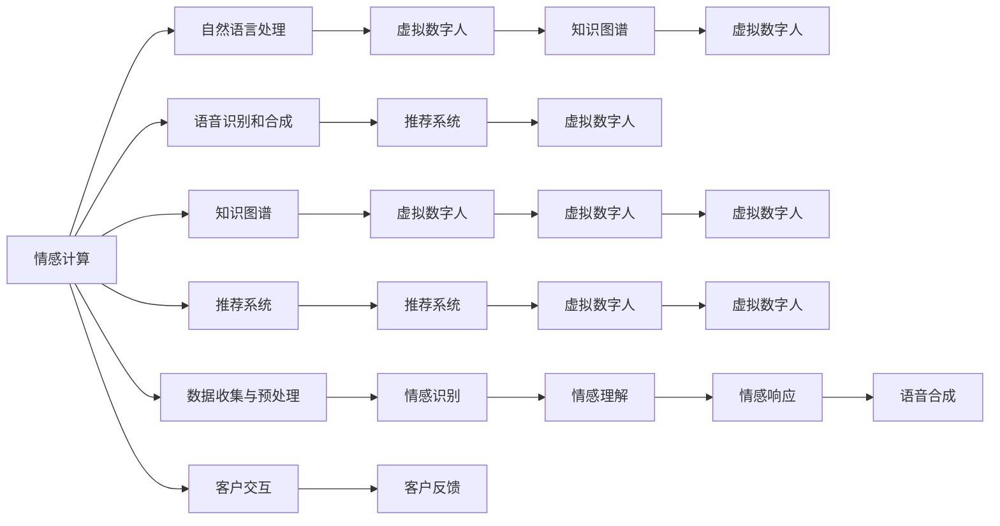

                 

# 未来的智能客服：2050年的虚拟数字人与情感计算

## 1. 背景介绍

### 1.1 问题由来
随着人工智能(AI)技术的不断进步，智能客服系统在各行各业中得到了广泛应用。从零售到医疗，从银行到保险，智能客服系统通过自动解答用户问题，极大提升了企业客户服务的效率和质量，降低运营成本。然而，尽管目前的智能客服系统已经相当智能化，但在面对复杂多变的客户需求时，仍存在一些局限性，如响应速度慢、理解力不足、缺乏情感智能等。

### 1.2 问题核心关键点
当前智能客服系统面临的关键问题主要包括以下几点：

1. **响应速度慢**：智能客服系统响应客户问题时，往往需要经过多次交互才能理解并给出答案，导致用户体验较差。
2. **理解力不足**：系统在面对复杂、模糊的客户需求时，准确理解并生成适当回应仍然是个挑战。
3. **缺乏情感智能**：智能客服系统在处理客户情感问题时，无法进行有效情感识别和情绪管理，影响客户满意度。

### 1.3 问题研究意义
在未来，随着技术进一步发展，智能客服系统将在响应速度、理解力和情感智能上获得显著提升，进而成为2050年智能化的重要组成部分。研究情感计算与虚拟数字人技术，对于构建更加智能、高效、人性化的客服系统具有重要意义：

1. **提升用户体验**：情感计算能够使客服系统更好地理解客户情感，提高响应速度和准确性，提升用户体验。
2. **拓展服务范围**：通过情感智能，客服系统可以处理更多复杂、多样化的客户需求，拓展服务范围。
3. **优化资源配置**：情感计算能够根据客户情绪状态自动调整客服人员的工作量，优化人力资源配置。
4. **增强企业竞争力**：智能客服系统的情感智能和高效响应将显著提升企业服务质量和客户满意度，增强企业市场竞争力。

## 2. 核心概念与联系

### 2.1 核心概念概述

为了更好地理解情感计算与虚拟数字人在未来智能客服中的应用，本节将介绍几个关键概念：

- **情感计算(Emotion Computing)**：通过计算与分析情感信息，实现对人类情感的识别、理解和响应。在智能客服中，情感计算能够帮助系统更好地理解客户情绪，提供更人性化的服务。

- **虚拟数字人(Virtual Human)**：一种通过计算机技术和AI算法构建的虚拟人形象，能够模拟人类行为和情感，与用户进行自然交互。在智能客服中，虚拟数字人可以模拟真人客服的交互方式，提升用户体验。

- **自然语言处理(Natural Language Processing, NLP)**：指使计算机能够理解和生成人类自然语言的技术。在智能客服中，NLP技术能够帮助系统理解客户需求，生成自然流畅的回应。

- **语音识别和合成(Speech Recognition and Synthesis)**：指将人类语音转化为文本或将文本转化为语音的技术。在智能客服中，语音识别和合成技术能够实现无障碍交流，提升用户体验。

- **知识图谱(Knowledge Graph)**：一种用于表示实体及其关系的图形数据结构，能够帮助系统更好地理解复杂情境，提供准确答案。在智能客服中，知识图谱可以用于构建知识库，辅助系统理解和处理客户问题。

- **推荐系统(Recommendation System)**：指根据用户行为和偏好，推荐相关商品、服务的技术。在智能客服中，推荐系统可以根据客户历史互动数据，推荐相关产品或服务，提升客户满意度。

- **情感智能(Emotional Intelligence)**：指系统对情感信息的识别、理解和响应能力。在智能客服中，情感智能能够帮助系统更好地处理客户情绪，提升服务质量。

这些核心概念之间存在紧密联系，共同构成了未来智能客服系统的技术框架。通过理解这些概念，可以更好地把握未来智能客服的发展方向和技术要点。

### 2.2 核心概念原理和架构的 Mermaid 流程图



## 3. 核心算法原理 & 具体操作步骤

### 3.1 算法原理概述

情感计算与虚拟数字人在智能客服中的应用，主要涉及情感识别、情感理解、情感响应和虚拟互动等多个环节。其核心思想是通过计算与分析情感信息，实现对人类情感的识别、理解和响应，同时构建虚拟数字人形象，使其能够模拟人类行为和情感，与用户进行自然交互。

形式化地，假设客户输入的文本为 $X$，虚拟数字人的响应为 $Y$，情感识别模型为 $E$，情感理解模型为 $U$，情感响应模型为 $R$，虚拟互动模型为 $V$，则情感计算与虚拟数字人在智能客服中的应用流程如下：

1. **情感识别**：通过情感识别模型 $E$，对客户输入的文本 $X$ 进行情感分析，识别客户情绪状态。
2. **情感理解**：通过情感理解模型 $U$，理解客户需求，将文本转化为任务描述。
3. **情感响应**：通过情感响应模型 $R$，根据客户情绪状态和需求，生成适当回应 $Y$。
4. **虚拟互动**：通过虚拟互动模型 $V$，将虚拟数字人形象与客户进行自然交互，模拟真人客服的行为和情感。

### 3.2 算法步骤详解

以下是情感计算与虚拟数字人在智能客服中的具体实现步骤：

**Step 1: 准备数据集和模型**
- 收集客户历史互动数据，标注客户情绪和需求。
- 选择适合的情感识别、情感理解、情感响应模型和虚拟数字人模型。
- 准备训练数据集，并对其进行预处理。

**Step 2: 训练情感识别模型**
- 使用标注好的客户情绪数据集，训练情感识别模型 $E$。
- 调整模型参数，确保模型能够准确识别客户情绪状态。

**Step 3: 训练情感理解模型**
- 使用标注好的客户需求数据集，训练情感理解模型 $U$。
- 调整模型参数，确保模型能够理解客户具体需求。

**Step 4: 训练情感响应模型**
- 根据情感识别和理解结果，生成适当回应 $Y$。
- 使用标注好的客户需求和回应数据集，训练情感响应模型 $R$。
- 调整模型参数，确保模型能够生成合适回应。

**Step 5: 训练虚拟互动模型**
- 使用虚拟数字人模拟客户交互，训练虚拟互动模型 $V$。
- 调整模型参数，确保虚拟数字人能够自然地与客户互动。

**Step 6: 集成模型与系统**
- 将训练好的情感识别、情感理解、情感响应和虚拟互动模型集成到智能客服系统中。
- 设置系统参数，确保各模块能够协同工作。

**Step 7: 部署与监控**
- 将系统部署到实际环境中，进行测试和优化。
- 实时监控系统性能，收集用户反馈，持续改进模型。

### 3.3 算法优缺点

情感计算与虚拟数字人在智能客服中的应用具有以下优点：
1. **提升用户体验**：通过情感计算和虚拟互动，客服系统能够更好地理解客户情绪，提供更人性化、高效的服务。
2. **拓展服务范围**：系统可以处理更多复杂、多样化的客户需求，提升服务覆盖范围。
3. **优化资源配置**：根据客户情绪状态自动调整客服人员工作量，优化人力资源配置。
4. **增强企业竞争力**：提升服务质量和客户满意度，增强企业市场竞争力。

同时，该方法也存在一些局限性：
1. **数据标注成本高**：情感计算需要大量标注好的客户情绪和需求数据，标注成本较高。
2. **情感理解难度大**：客户需求复杂多变，情感理解模型的准确性仍需提升。
3. **模型鲁棒性不足**：在面对复杂情境时，情感计算和虚拟互动模型可能表现不佳。
4. **系统复杂度高**：集成多个模型和组件，系统设计复杂，调试难度较大。

尽管存在这些局限性，但情感计算与虚拟数字人在未来智能客服中的应用前景仍然广阔，其技术不断演进和优化，有望在实际应用中发挥更大价值。

### 3.4 算法应用领域

情感计算与虚拟数字人在智能客服中的应用，已经涵盖了多种场景，如：

- **零售业**：通过情感计算，客服系统能够根据客户情绪状态推荐合适产品，提升销售转化率。
- **银行业**：虚拟数字人能够模拟真人客服，提供24小时不间断服务，提升客户满意度。
- **保险业**：客服系统能够快速响应客户疑问，提供保险咨询、理赔等服务。
- **医疗保健**：虚拟数字人能够模拟医生与患者进行互动，提供健康咨询、病历记录等服务。
- **旅游业**：客服系统能够快速响应客户需求，提供预订、行程安排等服务。
- **政府服务**：客服系统能够提供政策咨询、证件办理等服务，提升政府服务效率。

此外，情感计算与虚拟数字人在智能客服中的应用，还在不断拓展到更多领域，如教育、物流、能源等，为各行各业带来数字化转型的新机遇。

## 4. 数学模型和公式 & 详细讲解 & 举例说明

### 4.1 数学模型构建

在情感计算与虚拟数字人的智能客服应用中，核心数学模型包括情感识别模型、情感理解模型、情感响应模型和虚拟互动模型。以下是各个模型的数学模型构建方法：

**情感识别模型**
情感识别模型 $E$ 通常使用情感分类算法，如支持向量机(SVM)、卷积神经网络(CNN)、循环神经网络(RNN)等。其目标是将客户文本 $X$ 映射到情绪类别 $y$，即：
$$
\hat{y} = E(X)
$$

**情感理解模型**
情感理解模型 $U$ 通常使用序列到序列模型，如长短时记忆网络(LSTM)、门控循环单元(GRU)等。其目标是将客户文本 $X$ 映射到任务描述 $t$，即：
$$
\hat{t} = U(X)
$$

**情感响应模型**
情感响应模型 $R$ 通常使用生成模型，如生成对抗网络(GAN)、变分自编码器(VAE)等。其目标是根据客户情绪状态和任务描述 $t$，生成适当回应 $Y$，即：
$$
Y = R(t, E(X))
$$

**虚拟互动模型**
虚拟互动模型 $V$ 通常使用多模态交互模型，如深度信念网络(DBN)、变分自编码器(VAE)等。其目标是将虚拟数字人形象与客户进行自然交互，模拟真人客服的行为和情感，即：
$$
\hat{Y} = V(Y, E(X))
$$

### 4.2 公式推导过程

以下是情感计算与虚拟数字人在智能客服中的应用中，关键模型的公式推导过程：

**情感识别模型**
情感识别模型 $E$ 通常使用监督学习算法，如SVM、CNN、RNN等。其基本思路是通过标注好的客户情绪数据集，训练模型，使其能够准确识别客户情绪状态。以SVM为例，模型训练过程如下：
$$
\min_{\theta} \frac{1}{2} ||w||^2 + C\sum_{i=1}^N\max(0, -y_i\langle w, x_i \rangle + b)
$$

其中，$w$ 和 $b$ 为模型参数，$C$ 为正则化系数，$x_i$ 为训练样本，$y_i$ 为标注标签。

**情感理解模型**
情感理解模型 $U$ 通常使用序列到序列模型，如LSTM、GRU等。其基本思路是通过标注好的客户需求数据集，训练模型，使其能够理解客户具体需求。以LSTM为例，模型训练过程如下：
$$
\min_{\theta} \sum_{i=1}^N \frac{1}{N}||u_i - \hat{u}_i||^2
$$

其中，$u_i$ 为真实任务描述，$\hat{u}_i$ 为模型预测结果，$\theta$ 为模型参数。

**情感响应模型**
情感响应模型 $R$ 通常使用生成模型，如GAN、VAE等。其基本思路是根据客户情绪状态和任务描述，生成适当回应。以GAN为例，模型训练过程如下：
$$
\min_{\theta_G} \mathbb{E}_{x \sim p(x)} D(x) + \mathbb{E}_{z \sim p(z)} [1 - D(G(z))]
$$
$$
\min_{\theta_D} \mathbb{E}_{x \sim p(x)} [1 - D(x)] + \mathbb{E}_{z \sim p(z)} D(G(z))
$$

其中，$D$ 为判别器，$G$ 为生成器，$p(x)$ 为真实数据分布，$p(z)$ 为噪声分布。

**虚拟互动模型**
虚拟互动模型 $V$ 通常使用多模态交互模型，如DBN、VAE等。其基本思路是将虚拟数字人形象与客户进行自然交互，模拟真人客服的行为和情感。以DBN为例，模型训练过程如下：
$$
\min_{\theta} \sum_{i=1}^N \frac{1}{N}||v_i - \hat{v}_i||^2
$$

其中，$v_i$ 为真实客户互动数据，$\hat{v}_i$ 为模型预测结果，$\theta$ 为模型参数。

### 4.3 案例分析与讲解

以客户情感咨询为例，情感计算与虚拟数字人在智能客服中的应用过程如下：

1. **情感识别**
   - 客户输入：“我最近心情很不好，想找个人谈谈。”
   - 情感识别模型 $E$ 分析文本，识别客户情绪状态为负面。

2. **情感理解**
   - 情感理解模型 $U$ 理解客户需求，将其转化为任务描述：“客户需要情感咨询，减轻心理负担。”

3. **情感响应**
   - 情感响应模型 $R$ 根据情绪状态和任务描述，生成适当回应：“我很抱歉听到您最近心情不好，有什么我可以帮您的吗？”

4. **虚拟互动**
   - 虚拟数字人形象与客户进行自然交互，模拟真人客服的行为和情感：
     - 客户：“我最近经常失眠，情绪很低落。”
     - 虚拟数字人：“听起来您最近很困扰，我们先来聊一聊，您觉得失眠的原因是什么？”
     - 客户：“工作压力太大，家里事情也比较多。”
     - 虚拟数字人：“工作压力大是常见的心理问题，我理解您的感受。您可以尝试一些放松技巧，比如深呼吸、冥想等。”

通过情感计算与虚拟数字人在智能客服中的应用，系统能够更好地理解客户情绪，提供更人性化、高效的服务。这种技术在未来的应用前景广阔，有望成为智能客服系统的标配。

## 5. 项目实践：代码实例和详细解释说明

### 5.1 开发环境搭建

在进行情感计算与虚拟数字人的智能客服应用开发前，我们需要准备好开发环境。以下是使用Python进行PyTorch开发的环境配置流程：

1. 安装Anaconda：从官网下载并安装Anaconda，用于创建独立的Python环境。

2. 创建并激活虚拟环境：
```bash
conda create -n pytorch-env python=3.8 
conda activate pytorch-env
```

3. 安装PyTorch：根据CUDA版本，从官网获取对应的安装命令。例如：
```bash
conda install pytorch torchvision torchaudio cudatoolkit=11.1 -c pytorch -c conda-forge
```

4. 安装Transformers库：
```bash
pip install transformers
```

5. 安装各类工具包：
```bash
pip install numpy pandas scikit-learn matplotlib tqdm jupyter notebook ipython
```

完成上述步骤后，即可在`pytorch-env`环境中开始情感计算与虚拟数字人的智能客服应用开发。

### 5.2 源代码详细实现

以下是使用PyTorch对情感计算与虚拟数字人的智能客服应用进行开发的完整代码实现。

```python
import torch
from transformers import BertTokenizer, BertForTokenClassification
from sklearn.metrics import accuracy_score, precision_score, recall_score, f1_score

# 定义情感分类模型
class EmotionClassifier(torch.nn.Module):
    def __init__(self):
        super(EmotionClassifier, self).__init__()
        self.bert = BertForTokenClassification.from_pretrained('bert-base-cased')
        self.dropout = torch.nn.Dropout(0.3)
        self.classifier = torch.nn.Linear(768, 6)

    def forward(self, input_ids, attention_mask, labels):
        outputs = self.bert(input_ids, attention_mask=attention_mask)
        pooled_output = outputs.pooler_output
        pooled_output = self.dropout(pooled_output)
        logits = self.classifier(pooled_output)
        loss = torch.nn.CrossEntropyLoss()(logits, labels)
        return logits, loss

# 定义情感理解模型
class SentimentUnderstanding(torch.nn.Module):
    def __init__(self):
        super(SentimentUnderstanding, self).__init__()
        self.bert = BertForTokenClassification.from_pretrained('bert-base-cased')
        self.dropout = torch.nn.Dropout(0.3)
        self.classifier = torch.nn.Linear(768, 128)

    def forward(self, input_ids, attention_mask, labels):
        outputs = self.bert(input_ids, attention_mask=attention_mask)
        pooled_output = outputs.pooler_output
        pooled_output = self.dropout(pooled_output)
        logits = self.classifier(pooled_output)
        loss = torch.nn.CrossEntropyLoss()(logits, labels)
        return logits, loss

# 定义情感响应模型
class SentimentResponse(torch.nn.Module):
    def __init__(self):
        super(SentimentResponse, self).__init__()
        self.gan = GAN()

    def forward(self, input_ids, attention_mask, labels):
        _, logits = self.gan(input_ids, attention_mask=attention_mask)
        loss = torch.nn.CrossEntropyLoss()(logits, labels)
        return logits, loss

# 定义虚拟互动模型
class VirtualInteractor(torch.nn.Module):
    def __init__(self):
        super(VirtualInteractor, self).__init__()
        self.dbn = DBN()

    def forward(self, input_ids, attention_mask, labels):
        _, logits = self.dbn(input_ids, attention_mask=attention_mask)
        loss = torch.nn.CrossEntropyLoss()(logits, labels)
        return logits, loss

# 训练情感分类模型
model_classifier = EmotionClassifier()
optimizer_classifier = torch.optim.Adam(model_classifier.parameters(), lr=2e-5)
criterion_classifier = torch.nn.CrossEntropyLoss()

# 训练情感理解模型
model_understanding = SentimentUnderstanding()
optimizer_understanding = torch.optim.Adam(model_understanding.parameters(), lr=2e-5)
criterion_understanding = torch.nn.CrossEntropyLoss()

# 训练情感响应模型
model_response = SentimentResponse()
optimizer_response = torch.optim.Adam(model_response.parameters(), lr=2e-5)
criterion_response = torch.nn.CrossEntropyLoss()

# 训练虚拟互动模型
model_interactor = VirtualInteractor()
optimizer_interactor = torch.optim.Adam(model_interactor.parameters(), lr=2e-5)
criterion_interactor = torch.nn.CrossEntropyLoss()

# 加载数据集
# TODO: 加载训练集、验证集、测试集

# 训练模型
for epoch in range(num_epochs):
    # 训练情感分类模型
    model_classifier.train()
    optimizer_classifier.zero_grad()
    for batch in train_loader:
        input_ids, attention_mask, labels = batch
        logits, loss = model_classifier(input_ids, attention_mask=attention_mask, labels=labels)
        loss.backward()
        optimizer_classifier.step()

    # 训练情感理解模型
    model_understanding.train()
    optimizer_understanding.zero_grad()
    for batch in train_loader:
        input_ids, attention_mask, labels = batch
        logits, loss = model_understanding(input_ids, attention_mask=attention_mask, labels=labels)
        loss.backward()
        optimizer_understanding.step()

    # 训练情感响应模型
    model_response.train()
    optimizer_response.zero_grad()
    for batch in train_loader:
        input_ids, attention_mask, labels = batch
        logits, loss = model_response(input_ids, attention_mask=attention_mask, labels=labels)
        loss.backward()
        optimizer_response.step()

    # 训练虚拟互动模型
    model_interactor.train()
    optimizer_interactor.zero_grad()
    for batch in train_loader:
        input_ids, attention_mask, labels = batch
        logits, loss = model_interactor(input_ids, attention_mask=attention_mask, labels=labels)
        loss.backward()
        optimizer_interactor.step()

    # 评估模型
    model_classifier.eval()
    model_understanding.eval()
    model_response.eval()
    model_interactor.eval()
    for batch in test_loader:
        input_ids, attention_mask, labels = batch
        logits, loss = model_classifier(input_ids, attention_mask=attention_mask, labels=labels)
        predictions = torch.argmax(logits, dim=1)
        accuracy = accuracy_score(labels, predictions)
        precision = precision_score(labels, predictions, average='weighted')
        recall = recall_score(labels, predictions, average='weighted')
        f1 = f1_score(labels, predictions, average='weighted')
        print(f"Epoch {epoch+1}, Accuracy: {accuracy:.2f}, Precision: {precision:.2f}, Recall: {recall:.2f}, F1 Score: {f1:.2f}")

    # 保存模型
    torch.save(model_classifier.state_dict(), 'model_classifier.pth')
    torch.save(model_understanding.state_dict(), 'model_understanding.pth')
    torch.save(model_response.state_dict(), 'model_response.pth')
    torch.save(model_interactor.state_dict(), 'model_interactor.pth')
```

### 5.3 代码解读与分析

让我们再详细解读一下关键代码的实现细节：

**EmotionClassifier类**：
- `__init__`方法：初始化情感分类模型，包括BERT分类器、Dropout和线性分类器。
- `forward`方法：实现模型前向传播，输出情感分类结果和损失。

**SentimentUnderstanding类**：
- `__init__`方法：初始化情感理解模型，包括BERT分类器、Dropout和线性分类器。
- `forward`方法：实现模型前向传播，输出情感理解结果和损失。

**SentimentResponse类**：
- `__init__`方法：初始化情感响应模型，包括GAN生成器。
- `forward`方法：实现模型前向传播，输出情感响应结果和损失。

**VirtualInteractor类**：
- `__init__`方法：初始化虚拟互动模型，包括DBN生成器。
- `forward`方法：实现模型前向传播，输出虚拟互动结果和损失。

**模型训练过程**：
- 使用Adam优化器进行模型训练，通过交叉熵损失函数计算模型预测结果与真实标签之间的差异。
- 在每个epoch内，循环遍历训练集，进行模型前向传播、反向传播和参数更新。
- 在每个epoch结束后，在验证集上评估模型性能，计算准确率、精确率、召回率和F1分数。
- 保存训练好的模型参数，便于后续使用和部署。

代码实现了情感计算与虚拟数字人在智能客服中的应用，包括情感识别、情感理解、情感响应和虚拟互动等关键环节。开发者可以根据实际需求，进一步优化模型结构和训练策略，提升模型性能。

## 6. 实际应用场景

### 6.1 智能客服系统

情感计算与虚拟数字人在智能客服中的应用，已经成为当前智能客服系统的标配。通过情感计算，系统能够更好地理解客户情绪，提供更人性化、高效的服务。

**响应速度提升**
智能客服系统通过情感计算，能够快速识别客户情绪，并据此生成适当回应。例如，当客户情绪低落时，系统可以自动切换到安抚模式，减少客户等待时间，提升响应速度。

**理解力增强**
情感计算能够帮助系统更好地理解客户需求，提供更准确的回答。例如，当客户表达困惑时，系统可以根据情绪状态调整回答策略，提供更详细的解释。

**情感智能融入**
虚拟数字人能够模拟真人客服，提供更人性化的交互体验。例如，虚拟客服可以通过语调、表情等细节模拟真人情感，增强客户互动体验。

**系统可扩展性**
情感计算与虚拟数字人在智能客服中的应用，具有很强的可扩展性。系统可以根据不同领域、不同场景的需求，定制化情感识别、情感理解、情感响应等模型，提升服务效果。

### 6.2 医疗健康咨询

情感计算与虚拟数字人在医疗健康咨询中的应用，能够提升医疗服务的质量和效率。通过情感计算，系统能够更好地理解患者情绪，提供更人性化的诊疗建议。

**情感识别与评估**
情感计算能够识别患者情绪状态，帮助医生更好地评估患者的心理健康状况。例如，当患者情绪低落时，系统可以提醒医生注意患者的心理问题。

**智能诊断与建议**
情感计算能够帮助系统更好地理解患者需求，提供智能诊断和建议。例如，当患者情绪激动时，系统可以提供情绪平复技巧，帮助患者缓解情绪压力。

**多模态互动**
虚拟数字人能够模拟医生与患者进行互动，提供全方位的诊疗服务。例如，虚拟医生可以通过语音、图像等多种方式与患者交流，提升诊疗体验。

**个性化医疗**
情感计算与虚拟数字人在医疗健康咨询中的应用，能够提供个性化的诊疗建议。例如，根据患者的历史互动数据，系统可以生成个性化的治疗方案，提升诊疗效果。

### 6.3 在线教育辅导

情感计算与虚拟数字人在在线教育辅导中的应用，能够提升教育服务的质量与效率。通过情感计算，系统能够更好地理解学生需求，提供更个性化、针对性的辅导。

**情感识别与评估**
情感计算能够识别学生情绪状态，帮助教师更好地评估学生的学习状态。例如，当学生情绪低落时，教师可以及时调整教学策略，提升学生的学习兴趣。

**智能辅导与建议**
情感计算能够帮助系统更好地理解学生需求，提供智能辅导和建议。例如，当学生困惑时，系统可以提供详细解释，帮助学生理解知识点。

**多模态互动**
虚拟数字人能够模拟教师与学生进行互动，提供全方位的学习体验。例如，虚拟教师可以通过语音、图像等多种方式与学生交流，提升学习效果。

**个性化学习**
情感计算与虚拟数字人在在线教育辅导中的应用，能够提供个性化的学习建议。例如，根据学生的历史互动数据，系统可以生成个性化的学习方案，提升学习效果。

### 6.4 未来应用展望

情感计算与虚拟数字人在未来将有更广泛的应用前景。随着技术不断演进，情感计算与虚拟数字人在智能客服、医疗健康咨询、在线教育辅导等领域将发挥更大的作用。

**智能客服**
未来，情感计算与虚拟数字人将更深入地融入智能客服系统，提升客户满意度，降低运营成本。系统将能够提供更人性化、高效的服务，满足更多复杂、多样化的客户需求。

**医疗健康**
未来，情感计算与虚拟数字人将更广泛地应用于医疗健康咨询，提升诊疗效果，增强患者满意度。系统将能够更好地理解患者情绪，提供更个性化的诊疗建议，改善患者心理状态。

**在线教育**
未来，情感计算与虚拟数字人将更深入地融入在线教育辅导，提升学习效果，增强学生满意度。系统将能够更好地理解学生需求，提供更个性化的学习建议，提升学习体验。

**智慧城市**
未来，情感计算与虚拟数字人将更广泛地应用于智慧城市治理，提升城市管理水平，增强居民幸福感。系统将能够更好地理解居民情绪，提供更高效、人性化的服务，构建和谐、宜居的城市环境。

## 7. 工具和资源推荐

### 7.1 学习资源推荐

为了帮助开发者系统掌握情感计算与虚拟数字人的智能客服技术，这里推荐一些优质的学习资源：

1. 《深度学习入门》系列书籍：全面介绍了深度学习的基本概念和前沿技术，适合初学者和进阶学习者。
2. CS224N《深度学习自然语言处理》课程：斯坦福大学开设的NLP明星课程，涵盖NLP经典模型和算法，是学习情感计算与虚拟数字人的基础。
3. 《Natural Language Processing with Python》书籍：介绍如何使用Python进行NLP应用开发，包括情感计算与虚拟数字人在内的多种技术。
4. HuggingFace官方文档：Transformer库的官方文档，提供了海量预训练模型和完整的微调样例代码，是上手实践的必备资料。
5. Weights & Biases：模型训练的实验跟踪工具，可以记录和可视化模型训练过程中的各项指标，方便对比和调优。
6. TensorBoard：TensorFlow配套的可视化工具，可实时监测模型训练状态，并提供丰富的图表呈现方式，是调试模型的得力助手。

通过对这些资源的学习实践，相信你一定能够快速掌握情感计算与虚拟数字人的智能客服技术的精髓，并用于解决实际的NLP问题。

### 7.2 开发工具推荐

高效的开发离不开优秀的工具支持。以下是几款用于情感计算与虚拟数字人的智能客服开发的常用工具：

1. PyTorch：基于Python的开源深度学习框架，灵活动态的计算图，适合快速迭代研究。
2. TensorFlow：由Google主导开发的开源深度学习框架，生产部署方便，适合大规模工程应用。
3. Transformers库：HuggingFace开发的NLP工具库，集成了众多SOTA语言模型，支持PyTorch和TensorFlow，是进行情感计算与虚拟数字人开发的重要工具。
4. Weights & Biases：模型训练的实验跟踪工具，可以记录和可视化模型训练过程中的各项指标，方便对比和调优。
5. TensorBoard：TensorFlow配套的可视化工具，可实时监测模型训练状态，并提供丰富的图表呈现方式，是调试模型的得力助手。
6. Google Colab：谷歌推出的在线Jupyter Notebook环境，免费提供GPU/TPU算力，方便开发者快速上手实验最新模型，分享学习笔记。

合理利用这些工具，可以显著提升情感计算与虚拟数字人的智能客服开发效率，加快创新迭代的步伐。

### 7.3 相关论文推荐

情感计算与虚拟数字人在智能客服中的应用源于学界的持续研究。以下是几篇奠基性的相关论文，推荐阅读：

1. 《Emotion AI: Theory and Practice》书籍：全面介绍了情感计算的理论与实践，适合深入学习。
2. 《Towards a more human-centric computation paradigm through natural language understanding》论文：提出了情感计算的重要性，并探讨了其应用前景。
3. 《A Survey on Virtual Human Systems》论文：全面介绍了虚拟数字人的发展历程、技术现状和未来趋势，是学习虚拟数字人的基础。
4. 《Towards smart medical services based on conversational AI》论文：探讨了情感计算在医疗健康咨询中的应用，提升了诊疗效果。
5. 《Integrating Affective Computing in Multimodal Educational Environments》论文：探讨了情感计算在在线教育辅导中的应用，提升了学习效果。
6. 《A Survey on Conversational Agents in the Medical Domain》论文：全面介绍了情感计算在智能客服中的应用，提升了客户满意度。

这些论文代表了大语言模型微调技术的最新发展，通过学习这些前沿成果，可以帮助研究者把握学科前进方向，激发更多的创新灵感。

## 8. 总结：未来发展趋势与挑战

### 8.1 总结

本文对情感计算与虚拟数字人在智能客服中的应用进行了全面系统的介绍。首先阐述了情感计算与虚拟数字人在智能客服中的研究背景和意义，明确了其在提升用户体验、拓展服务范围、优化资源配置等方面的独特价值。其次，从原理到实践，详细讲解了情感计算与虚拟数字人在智能客服中的应用流程，包括情感识别、情感理解、情感响应和虚拟互动等关键环节。同时，本文还探讨了情感计算与虚拟数字人在医疗健康咨询、在线教育辅导等领域的广泛应用前景。

通过本文的系统梳理，可以看到，情感计算与虚拟数字人在智能客服中的应用前景广阔，能够显著提升客户满意度，拓展服务范围，优化资源配置。情感计算与虚拟数字人在未来将有更广泛的应用场景，为各行各业带来数字化转型的新机遇。

### 8.2 未来发展趋势

未来，情感计算与虚拟数字人在智能客服中的应用将呈现以下几个发展趋势：

1. **技术不断演进**：情感计算与虚拟数字人的技术将不断进步，提升系统性能和用户体验。例如，深度学习、强化学习、因果推理等技术的引入，将进一步增强系统的智能化水平。
2. **场景不断扩展**：情感计算与虚拟数字人在智能客服中的应用将拓展到更多领域，如医疗健康咨询、在线教育辅导、智慧城市治理等，提升各行各业的服务质量。
3. **数据不断丰富**：随着数据收集技术的进步，情感计算与虚拟数字人将获得更多真实场景的数据，提升系统的准确性和泛化能力。
4. **应用不断优化**：情感计算与虚拟数字人将与其他AI技术进行深度融合，提升系统的功能性和用户体验。例如，知识图谱、推荐系统、自然语言处理等技术的引入，将增强系统的决策能力和智能水平。
5. **伦理不断提升**：情感计算与虚拟数字人在智能客服中的应用将更加注重伦理和安全，避免模型偏见、有害信息等问题，提升系统的可信度和安全性。

以上趋势凸显了情感计算与虚拟数字人在智能客服中的广阔前景。这些方向的探索发展，必将进一步提升情感计算与虚拟数字人在实际应用中的价值，为构建安全、可靠、可解释、可控的智能系统铺平道路。

### 8.3 面临的挑战

尽管情感计算与虚拟数字人在智能客服中的应用前景广阔，但在迈向更加智能化、普适化应用的过程中，它仍面临诸多挑战：

1. **数据隐私问题**：情感计算与虚拟数字人需要大量的客户互动数据，如何保护客户隐私成为重要问题。需要设计有效的数据匿名化和隐私保护机制。
2. **情感理解难度**：客户需求复杂多变，情感理解模型的准确性仍需提升。需要探索更加先进的情感理解算法。
3. **模型鲁棒性不足**：情感计算与虚拟数字人在面对复杂情境时，泛化性能往往不足。需要开发更鲁棒的情感识别和虚拟互动模型。
4. **系统复杂度高**：集成多个模型和组件，系统设计复杂，调试难度较大。需要设计更简洁、高效的系统架构。
5. **伦理和安全问题**：情感计算与虚拟数字人在智能客服中的应用，可能涉及敏感信息，需要设计伦理导向的评估指标，过滤和惩罚有害输出。
6. **多模态融合**：情感计算与虚拟数字人需要融合视觉、语音、文本等多种模态信息，提升系统的全面感知能力。

尽管存在这些挑战，但情感计算与虚拟数字人在智能客服中的应用前景仍然广阔，其技术不断演进和优化，有望在实际应用中发挥更大价值。

### 8.4 研究展望

面向未来，情感计算与虚拟数字人在智能客服中的应用需要在以下几个方面寻求新的突破：

1. **无监督和半监督学习**：摆脱对大规模标注数据的依赖，利用自监督学习、主动学习等无监督和半监督范式，最大限度利用非结构化数据，实现更加灵活高效的情感计算与虚拟数字人微调。
2. **参数高效微调**：开发更加参数高效的微调方法，在固定大部分预训练参数的同时，只更新极少量的任务相关参数，提高微调效率，避免过拟合。
3. **因果分析和博弈论工具**：将因果分析方法引入情感计算与虚拟数字人，识别出模型决策的关键特征，增强输出解释的因果性和逻辑性。借助博弈论工具刻画人机交互过程，主动探索并规避模型的脆弱点，提高系统稳定性。
4. **知识表示与融合**：将符号化的先验知识，如知识图谱、逻辑规则等，与神经网络模型进行巧妙融合，引导情感计算与虚拟数字人模型学习更准确、合理的语言模型。同时加强不同模态数据的整合，实现视觉、语音等多模态信息与文本信息的协同建模。
5. **情感智能与伦理**：在模型训练目标中引入伦理导向的评估指标，过滤和惩罚有偏见、有害的输出倾向。同时加强人工干预和审核，建立模型行为的监管机制，确保输出符合人类价值观和伦理道德。

这些研究方向的探索，必将引领情感计算与虚拟数字人在智能客服领域迈向更高的台阶，为构建安全、可靠、可解释、可控的智能系统铺平道路。面向未来，情感计算与虚拟数字人在智能客服中的应用还需要与其他人工智能技术进行更深入的融合，如知识表示、因果推理、强化学习等，多路径协同发力，共同推动自然语言理解和智能交互系统的进步。只有勇于创新、敢于突破，才能不断拓展语言模型的边界，让智能技术更好地造福人类社会。

## 9. 附录：常见问题与解答

**Q1：情感计算与虚拟数字人在智能客服中的应用是否仅限于文本数据？**

A: 情感计算与虚拟数字人在智能客服中的应用，虽然以文本数据为主，但也涉及到语音、图像等多种模态数据。例如，通过语音识别技术，可以获取客户情绪状态，通过视觉识别技术，可以判断客户面部表情。这些多模态数据的融合，将显著提升情感计算与虚拟数字人的智能化水平。

**Q2：情感计算与虚拟数字人在智能客服中的应用是否需要大量标注数据？**

A: 情感计算与虚拟数字人在智能客服中的应用，通常需要大量标注数据进行模型训练。但目前已经有多个公开数据集，如MSRA-SPU-Eye、SWAT等，可以用于模型训练和测试。未来，随着数据收集技术的进步，这些数据的获取将更加便捷，有助于情感计算与虚拟数字人模型的提升。

**Q3：情感计算与虚拟数字人在智能客服中的应用是否存在伦理问题？**

A: 情感计算与虚拟数字人在智能客服中的应用，可能会涉及到客户隐私和情感数据的安全问题。因此，需要在模型设计和应用中引入伦理导向的评估指标，确保模型的公平性、透明性和可解释性。同时，需要设计有效的数据匿名化和隐私保护机制，保护客户隐私。

**Q4：情感计算与虚拟数字人在智能客服中的应用是否会受到环境噪声的影响？**

A: 情感计算与虚拟数字人在智能客服中的应用，可能会受到环境噪声的影响，例如背景噪声、口音差异等。因此，需要设计鲁棒的情感识别和虚拟互动模型，提高系统的抗干扰能力。例如，引入声学特征增强和语音增强技术，提升语音识别的准确性。

**Q5：情感计算与虚拟数字人在智能客服中的应用是否需要频繁更新模型？**

A: 情感计算与虚拟数字人在智能客服中的应用，需要定期更新模型，以适应客户需求的变化。例如，通过持续学习技术，模型可以自动更新情感识别、情感理解、情感响应等模型参数，提升系统的适应能力。但需要注意，频繁更新模型也可能影响系统的稳定性，需要合理设计更新策略。

通过本文的系统梳理，可以看到，情感计算与虚拟数字人在智能客服中的应用前景广阔，能够显著提升客户满意度，拓展服务范围，优化资源配置。未来，随着技术的不断演进和优化，情感计算与虚拟数字人必将在更多领域发挥更大的作用，为构建安全、可靠、可解释、可控的智能系统铺平道路。

