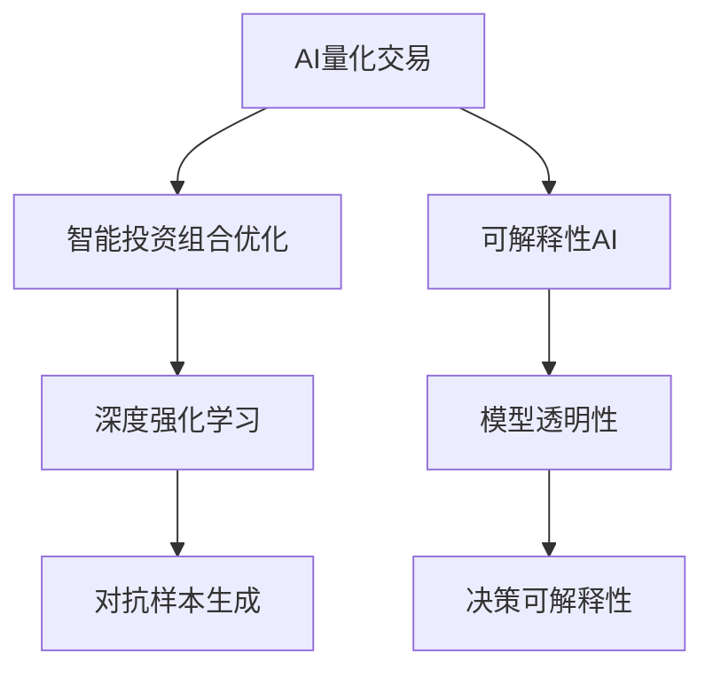
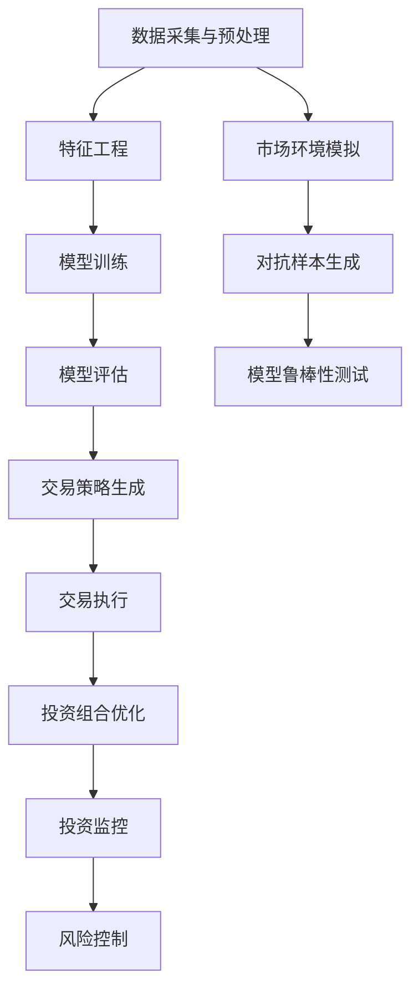

                 

# 未来的智能投资：2050年的AI量化交易与智能投资组合优化

## 1. 背景介绍

### 1.1 问题由来

随着人工智能技术的飞速发展，量化交易和智能投资组合优化已经成为了金融行业的一个重要趋势。传统的基于规则和手工分析的投资方式难以应对复杂多变的市场环境，而利用人工智能技术，可以通过对海量数据进行自动化的分析和决策，从而提升投资效率和收益。

近年来，机器学习和深度学习技术在量化交易和智能投资中的应用日益广泛，取得了一些显著的成果。然而，这些技术在实际应用中也面临一些挑战，如模型的泛化能力、对抗攻击的鲁棒性、算法的透明度和可解释性等。因此，如何在未来的发展中进一步提升人工智能在金融领域的应用，成为了一个亟待解决的问题。

### 1.2 问题核心关键点

未来智能投资的核心关键点包括：
- **算法透明性和可解释性**：投资者需要理解AI模型的决策逻辑，以便更好地信任和接受其建议。
- **鲁棒性和安全性**：模型需要能够在面对恶意攻击和异常数据时保持稳定和可靠。
- **泛化能力**：模型需要能够从历史数据中学习并预测未来市场变化，而不仅仅是拟合历史数据。
- **实时性和高效性**：投资决策需要快速生成，以便及时应对市场变化。
- **集成与协作**：多个AI模型和策略的集成，能够提供更全面的市场视角和更优的投资组合。

## 2. 核心概念与联系

### 2.1 核心概念概述

为更好地理解未来的智能投资，我们将介绍几个关键概念及其联系：

- **AI量化交易**：使用机器学习和深度学习算法对市场数据进行分析，以自动化生成交易策略，从而实现更高的投资回报。
- **智能投资组合优化**：利用AI技术优化投资组合的构建和管理，以最大化投资回报并降低风险。
- **深度强化学习**：通过模拟市场环境，让AI模型通过不断试错，学习最优的交易策略。
- **对抗样本生成**：利用对抗性攻击技术生成误导性数据，测试模型的鲁棒性。
- **可解释性AI**：使用可解释性技术，帮助投资者理解模型的决策过程。

这些概念之间的逻辑关系可以通过以下Mermaid流程图来展示：



### 2.2 核心概念原理和架构的 Mermaid 流程图



## 3. 核心算法原理 & 具体操作步骤

### 3.1 算法原理概述

未来的智能投资将基于深度学习和强化学习算法，通过模拟市场环境和历史数据，学习最优的交易策略和投资组合。其核心原理可以归纳为以下几个步骤：

1. **数据采集与预处理**：收集历史市场数据、新闻、社交媒体等相关信息，并进行清洗、归一化和特征工程，以提高数据的可用性和模型的表现。
2. **模型训练**：使用深度学习模型对历史数据进行训练，学习市场趋势和投资模式。
3. **模型评估**：在验证集上评估模型的泛化能力和性能，调整模型参数以提高预测准确性。
4. **交易策略生成**：根据模型预测，生成最优的交易策略，包括买卖时机、仓位管理等。
5. **投资组合优化**：通过多资产优化算法，构建最优的投资组合，最大化收益并降低风险。
6. **投资监控与风险控制**：实时监控市场变化和模型性能，及时调整投资策略和组合。

### 3.2 算法步骤详解

以下是深度学习在量化交易中的具体操作步骤：

1. **数据收集与预处理**：
   - 从金融市场、新闻、社交媒体等渠道收集历史数据和实时数据。
   - 对数据进行清洗和去重，处理缺失值和异常值。
   - 进行特征工程，提取有用的市场特征，如价格、成交量、波动率等。

2. **模型选择与训练**：
   - 选择适合的量化模型，如卷积神经网络(CNN)、循环神经网络(RNN)或变分自编码器(VAE)。
   - 使用历史数据训练模型，优化模型参数。
   - 使用交叉验证和网格搜索等技术，选择合适的超参数。

3. **模型评估与调整**：
   - 在验证集上评估模型的性能，计算准确率、召回率、F1分数等指标。
   - 使用对抗样本生成技术，测试模型的鲁棒性，确保模型不会过拟合。
   - 根据评估结果调整模型参数，优化模型性能。

4. **交易策略生成**：
   - 根据模型预测，生成最优的交易策略，如长短线交易、日内交易等。
   - 设计仓位管理策略，控制仓位大小和风险。
   - 根据市场情况和模型预测，及时调整投资组合。

5. **投资组合优化**：
   - 使用多资产优化算法，如遗传算法、粒子群算法或线性规划，构建最优投资组合。
   - 考虑多种风险因素，如市场风险、信用风险、流动性风险等。
   - 使用蒙特卡洛模拟和历史回测，评估投资组合的收益和风险。

### 3.3 算法优缺点

未来的智能投资算法具有以下优点：
- **自动化和高效率**：通过自动化分析市场数据，生成最优的交易策略和投资组合，提高投资效率。
- **全面性和深度性**：利用深度学习模型，从多个角度分析市场数据，全面把握市场变化。
- **实时性和灵活性**：通过实时数据和模型预测，快速调整投资策略，适应市场变化。

同时，这些算法也存在以下局限：
- **数据依赖性**：模型的性能高度依赖于数据质量和数据量，需要持续收集和更新数据。
- **模型复杂性**：深度学习模型结构复杂，难以解释和调试。
- **鲁棒性问题**：模型可能对对抗样本敏感，需要加入对抗性训练技术。
- **计算资源需求高**：深度学习模型训练和优化需要大量的计算资源。

### 3.4 算法应用领域

未来的智能投资算法将在以下领域得到广泛应用：

- **股票交易**：利用AI模型分析股票价格和市场趋势，生成最优的交易策略和投资组合。
- **债券投资**：通过深度学习模型预测债券利率和信用风险，优化债券投资组合。
- **外汇交易**：利用AI模型分析货币汇率和市场情绪，生成最优的外汇交易策略。
- **商品投资**：通过深度学习模型预测商品价格和市场波动，优化商品投资组合。
- **加密货币投资**：利用AI模型分析加密货币市场数据，生成最优的交易策略和投资组合。

## 4. 数学模型和公式 & 详细讲解

### 4.1 数学模型构建

未来的智能投资模型通常基于以下数学模型：

- **神经网络模型**：如多层感知器(MLP)、卷积神经网络(CNN)、循环神经网络(RNN)等。
- **深度强化学习模型**：如Q-learning、Deep Q-Networks(DQN)、Proximal Policy Optimization(PPO)等。
- **多资产优化模型**：如均值方差优化、遗传算法、粒子群算法等。

### 4.2 公式推导过程

以深度Q网络(DQN)为例，推导其核心公式。

假设环境状态为 $s_t$，动作为 $a_t$，奖励为 $r_t$，下一个状态为 $s_{t+1}$，则DQN的目标是最大化未来收益的期望值，即：

$$
Q(s_t, a_t) = \mathbb{E}\left[\sum_{t'=t}^{\infty} \gamma^{t-t'} r_{t'} \mid s_t, a_t\right]
$$

其中 $\gamma$ 为折扣因子，通常取值为0.99。

DQN的训练过程如下：

1. **策略选择**：从策略网络中随机选择一个动作 $a_t$。
2. **环境交互**：执行动作 $a_t$，观察下一个状态 $s_{t+1}$ 和奖励 $r_t$。
3. **目标计算**：计算下一个状态的目标值 $Q_{target}(s_{t+1}, a_{t+1})$。
4. **经验回放**：将当前状态-动作-奖励-目标值四元组 $(q_t, a_t, r_t, Q_{target}(s_{t+1}, a_{t+1}))$ 存入经验回放缓冲区。
5. **目标网络更新**：从目标网络中获取 $Q_{target}(s_{t+1}, a_{t+1})$。
6. **策略网络更新**：使用经验回放缓冲区中的数据，更新策略网络参数。

其中，策略网络的损失函数为：

$$
L(Q) = \mathbb{E}\left[\left(Q_{\theta}(s_t, a_t) - Q_{target}(s_t, a_t)\right)^2\right]
$$

### 4.3 案例分析与讲解

以下是一个基于DQN的股票交易案例：

1. **数据采集**：收集股票的历史价格、成交量、新闻、社交媒体等信息。
2. **特征工程**：提取有用的市场特征，如价格变化、成交量、技术指标等。
3. **模型训练**：使用DQN模型对历史数据进行训练，优化策略网络参数。
4. **模型评估**：在验证集上评估模型的性能，调整策略网络参数。
5. **交易策略生成**：根据模型预测，生成最优的交易策略。
6. **投资组合优化**：使用多资产优化算法，构建最优投资组合。
7. **投资监控与风险控制**：实时监控市场变化和模型性能，及时调整投资策略和组合。

## 5. 项目实践：代码实例和详细解释说明

### 5.1 开发环境搭建

在进行智能投资项目开发前，我们需要准备好开发环境。以下是使用Python进行TensorFlow开发的环境配置流程：

1. 安装Anaconda：从官网下载并安装Anaconda，用于创建独立的Python环境。

2. 创建并激活虚拟环境：
```bash
conda create -n tf-env python=3.8 
conda activate tf-env
```

3. 安装TensorFlow：根据CUDA版本，从官网获取对应的安装命令。例如：
```bash
conda install tensorflow -c tensorflow -c conda-forge
```

4. 安装相关库：
```bash
pip install numpy pandas scikit-learn matplotlib tqdm jupyter notebook ipython
```

5. 安装TensorBoard：
```bash
pip install tensorboard
```

6. 安装Weights & Biases：
```bash
pip install weights-bitcoin-action
```

完成上述步骤后，即可在`tf-env`环境中开始项目开发。

### 5.2 源代码详细实现

这里我们以基于DQN的股票交易为例，给出使用TensorFlow进行智能投资的PyTorch代码实现。

```python
import tensorflow as tf
import numpy as np

class QNetwork(tf.keras.Model):
    def __init__(self, state_dim, action_dim):
        super(QNetwork, self).__init__()
        self.fc1 = tf.keras.layers.Dense(64, activation=tf.nn.relu)
        self.fc2 = tf.keras.layers.Dense(64, activation=tf.nn.relu)
        self.fc3 = tf.keras.layers.Dense(action_dim, activation=tf.nn.relu)
        
    def call(self, inputs):
        x = self.fc1(inputs)
        x = self.fc2(x)
        return self.fc3(x)

class ExperienceReplay:
    def __init__(self, capacity):
        self.capacity = capacity
        self.memory = []
        self.position = 0
        
    def add(self, transition):
        transition_length = len(transition)
        if len(self.memory) < self.capacity:
            self.memory.append(transition)
        else:
            self.memory[self.position] = transition
            self.position = (self.position + 1) % self.capacity
            
    def sample(self, batch_size):
        batch = np.random.choice(len(self.memory), batch_size, replace=False)
        return [self.memory[i] for i in batch]
    
    def get_minibatch(self, batch_size):
        if len(self.memory) < batch_size:
            return self.memory
        else:
            return self.memory[:batch_size]

class DQNAgent:
    def __init__(self, state_dim, action_dim, learning_rate=0.001, discount_factor=0.99, batch_size=32, memory_capacity=2000):
        self.state_dim = state_dim
        self.action_dim = action_dim
        self.learning_rate = learning_rate
        self.discount_factor = discount_factor
        self.batch_size = batch_size
        self.memory_capacity = memory_capacity
        self.target_update_interval = 1000
        
        self.model = QNetwork(state_dim, action_dim)
        self.target_model = QNetwork(state_dim, action_dim)
        self.target_model.set_weights(self.model.get_weights())
        self.memory = ExperienceReplay(memory_capacity)
        
    def act(self, state):
        action_values = self.model(state[np.newaxis, :])
        return np.argmax(action_values)
    
    def train(self, state, action, reward, next_state, done):
        transition = (state, action, reward, next_state, done)
        self.memory.add(transition)
        
        if len(self.memory) > self.target_update_interval:
            self.target_model.set_weights(self.model.get_weights())
            self.target_update_interval = 0
        
        if len(self.memory) > self.batch_size:
            transitions = self.memory.sample(self.batch_size)
            b_states = np.vstack([transition[0] for transition in transitions])
            b_actions = np.vstack([transition[1] for transition in transitions])
            b_rewards = np.vstack([transition[2] for transition in transitions])
            b_next_states = np.vstack([transition[3] for transition in transitions])
            b_dones = np.vstack([transition[4] for transition in transitions])
            
            action_values = self.model(b_states)
            target_values = self.target_model.predict(b_next_states)
            target_values[np.where(b_dones == 1)[0]] = b_rewards
            target_values = target_values * self.discount_factor
            
            loss = tf.keras.losses.MSE(target_values, action_values)
            train_op = tf.keras.optimizers.Adam(learning_rate=self.learning_rate).minimize(loss)
            self.model.train_on_batch(b_states, target_values)
    
    def update(self):
        pass
    
    def save(self, path):
        self.model.save_weights(path)
    
    def load(self, path):
        self.model.load_weights(path)
```

以上代码实现了基于DQN的股票交易模型。其中，`QNetwork`类定义了策略网络，`ExperienceReplay`类实现了经验回放缓冲区，`DQNAgent`类实现了智能交易策略。

### 5.3 代码解读与分析

下面我们详细解读一下关键代码的实现细节：

**QNetwork类**：
- `__init__`方法：定义了网络的结构和初始化。
- `call`方法：前向传播，将输入状态转换为动作值。

**ExperienceReplay类**：
- `__init__`方法：初始化经验回放缓冲区。
- `add`方法：将新的状态-动作-奖励-下一步状态-是否终止元组加入缓冲区。
- `sample`方法：从缓冲区中随机抽取一批样本。
- `get_minibatch`方法：获取指定数量的样本。

**DQNAgent类**：
- `__init__`方法：初始化智能交易策略。
- `act`方法：根据当前状态，选择最优动作。
- `train`方法：根据经验回放缓冲区中的样本进行训练。
- `update`方法：进行目标模型的更新。
- `save`和`load`方法：保存和加载模型权重。

**训练过程**：
- 在每个时间步，智能交易策略从当前状态中选出动作。
- 根据动作和状态，获取奖励和下一步状态。
- 将当前状态-动作-奖励-下一步状态-是否终止元组加入经验回放缓冲区。
- 如果达到目标更新间隔，更新目标模型权重。
- 从缓冲区中抽取一批样本，计算目标动作值，更新策略网络参数。

## 6. 实际应用场景

### 6.1 智能投资组合优化

未来的智能投资将广泛应用在投资组合优化中。通过AI模型对历史数据和实时数据进行分析，可以生成最优的投资组合，提升投资回报并降低风险。

在实践中，可以将不同资产的历史价格、波动率、相关性等信息作为输入，使用多资产优化算法，构建最优的投资组合。同时，可以根据市场情况和模型预测，实时调整投资组合，以应对市场变化。

### 6.2 实时交易策略生成

未来的智能投资系统将能够实时生成最优的交易策略。通过深度学习模型分析市场数据和新闻信息，可以预测市场趋势和交易机会，生成最优的买卖时机和仓位管理策略。

例如，可以使用RNN模型对新闻和社交媒体信息进行情感分析，预测市场情绪变化，生成对应的交易策略。同时，可以利用LSTM模型对历史交易数据进行分析，生成更准确的市场预测。

### 6.3 市场预测与风险管理

未来的智能投资系统将能够进行市场预测和风险管理。通过深度学习模型分析历史数据和实时数据，可以预测市场走势和风险水平，帮助投资者做出更明智的投资决策。

例如，可以使用卷积神经网络(CNN)对市场数据进行图像分析，预测市场趋势和波动率。同时，可以利用LSTM模型对交易数据进行分析，预测未来的市场风险和投资回报。

## 7. 工具和资源推荐

### 7.1 学习资源推荐

为了帮助开发者系统掌握智能投资的理论基础和实践技巧，这里推荐一些优质的学习资源：

1. 《深度学习》课程：斯坦福大学的深度学习课程，由Andrew Ng主讲，涵盖深度学习的基本概念和应用。

2. 《金融数据科学》课程：由Kaggle平台提供，涵盖金融数据科学的理论基础和实践技巧。

3. 《量化交易》书籍：由Michael Lewis撰写，深入浅出地介绍了量化交易的理论和实践。

4. 《AI在金融中的应用》报告：由Gartner公司发布，涵盖AI技术在金融领域的应用前景和挑战。

5. 《金融量化建模》书籍：由Anton Kapustinsky撰写，系统介绍了量化建模的理论和实践。

通过对这些资源的学习实践，相信你一定能够快速掌握智能投资的核心技术和应用方法。

### 7.2 开发工具推荐

高效的开发离不开优秀的工具支持。以下是几款用于智能投资开发的常用工具：

1. TensorFlow：由Google主导开发的深度学习框架，生产部署方便，适合大规模工程应用。

2. PyTorch：基于Python的开源深度学习框架，灵活动态的计算图，适合快速迭代研究。

3. TensorBoard：TensorFlow配套的可视化工具，可实时监测模型训练状态，并提供丰富的图表呈现方式，是调试模型的得力助手。

4. Weights & Biases：模型训练的实验跟踪工具，可以记录和可视化模型训练过程中的各项指标，方便对比和调优。

5. Jupyter Notebook：交互式的Python开发环境，方便代码调试和数据可视化。

合理利用这些工具，可以显著提升智能投资系统的开发效率，加快创新迭代的步伐。

### 7.3 相关论文推荐

智能投资领域的研究发展迅速，以下是几篇奠基性的相关论文，推荐阅读：

1. Deep Reinforcement Learning for Trading (DRL4T)：提出使用深度强化学习进行量化交易，取得了很好的效果。

2. A Neural Commodity Price Forecaster：利用深度学习模型预测商品价格，为投资组合优化提供了新的思路。

3. Predicting Cryptocurrency Prices Using Deep Learning：利用深度学习模型预测加密货币价格，为加密货币投资提供了新的方法。

4. Deep Learning Applications in Finance：系统介绍了深度学习在金融领域的应用，包括量化交易、风险管理等。

5. Trading with Deep Reinforcement Learning: A Practical Guide：提供了深度强化学习在量化交易中的实践指南，帮助开发者快速上手。

这些论文代表了大规模深度学习在金融领域的研究进展，通过学习这些前沿成果，可以帮助研究者把握学科前进方向，激发更多的创新灵感。

## 8. 总结：未来发展趋势与挑战

### 8.1 研究成果总结

未来的智能投资将基于深度学习和强化学习算法，通过分析市场数据和实时信息，生成最优的交易策略和投资组合。其核心技术包括深度神经网络、深度强化学习、多资产优化等，在实际应用中取得了很好的效果。

### 8.2 未来发展趋势

展望未来，智能投资将呈现以下几个发展趋势：

1. **模型的泛化能力**：未来的模型将能够从更广泛的数据中学习，并泛化到更复杂的市场环境中。
2. **模型的透明度和可解释性**：未来的模型将具备更强的可解释性，帮助投资者理解其决策逻辑。
3. **模型的鲁棒性和安全性**：未来的模型将具备更强的鲁棒性和安全性，能够抵御对抗样本和恶意攻击。
4. **实时性和高效性**：未来的模型将能够实时生成最优交易策略和投资组合，快速应对市场变化。
5. **多模态信息的融合**：未来的模型将能够融合多种模态的信息，如文本、图像、视频等，提升市场预测的准确性。

### 8.3 面临的挑战

尽管智能投资技术已经取得了瞩目成就，但在迈向更加智能化、普适化应用的过程中，仍面临诸多挑战：

1. **数据依赖性**：模型的性能高度依赖于数据质量和数据量，需要持续收集和更新数据。
2. **模型的复杂性**：深度学习模型结构复杂，难以解释和调试。
3. **鲁棒性问题**：模型可能对对抗样本敏感，需要加入对抗性训练技术。
4. **计算资源需求高**：深度学习模型训练和优化需要大量的计算资源。
5. **透明性和可解释性**：模型需要具备更强的透明性和可解释性，以获得投资者的信任。

### 8.4 研究展望

面对智能投资面临的挑战，未来的研究需要在以下几个方面寻求新的突破：

1. **无监督和半监督学习**：摆脱对大规模标注数据的依赖，利用自监督学习、主动学习等无监督和半监督范式，最大限度利用非结构化数据。
2. **参数高效和计算高效**：开发更加参数高效的微调方法，在固定大部分预训练参数的同时，只更新极少量的任务相关参数。
3. **因果分析和博弈论工具**：将因果分析方法引入智能投资，识别出模型决策的关键特征，增强输出解释的因果性和逻辑性。
4. **模型集成与协作**：多个AI模型和策略的集成，能够提供更全面的市场视角和更优的投资组合。
5. **伦理和安全**：在模型训练目标中引入伦理导向的评估指标，过滤和惩罚有偏见、有害的输出倾向。

这些研究方向的探索，必将引领智能投资技术迈向更高的台阶，为构建安全、可靠、可解释、可控的智能系统铺平道路。面向未来，智能投资技术还需要与其他人工智能技术进行更深入的融合，如知识表示、因果推理、强化学习等，多路径协同发力，共同推动金融智能化的进步。

## 9. 附录：常见问题与解答

**Q1: 智能投资和量化交易有什么区别？**

A: 智能投资是指利用人工智能技术进行投资决策，包括市场预测、交易策略生成、投资组合优化等；而量化交易则是指利用算法和数学模型进行自动化交易，通常以高频交易和程序化交易为主。两者都是基于数据驱动的投资策略，但智能投资更强调模型的智能化和可解释性。

**Q2: 为什么智能投资需要考虑模型的透明度和可解释性？**

A: 投资者需要理解AI模型的决策逻辑，以便更好地信任和接受其建议。如果模型过于复杂和黑盒化，投资者可能难以接受其推荐，导致决策不自信或盲目跟随。

**Q3: 如何提升智能投资模型的鲁棒性？**

A: 可以通过加入对抗样本生成技术，测试模型的鲁棒性，确保模型不会对对抗样本敏感。同时，可以使用参数高效微调技术，减少模型参数量，避免过拟合。

**Q4: 智能投资需要考虑哪些风险？**

A: 智能投资需要考虑市场风险、信用风险、流动性风险等多种风险。需要结合多资产优化算法，构建稳健的投资组合，以应对市场变化。

**Q5: 如何确保智能投资的透明度和可解释性？**

A: 可以通过引入可解释性技术，如LIME、SHAP等，帮助投资者理解模型的决策过程。同时，可以使用可视化工具，展示模型在各个时间点的状态和预测结果。

总之，未来的智能投资将基于深度学习和强化学习算法，通过分析市场数据和实时信息，生成最优的交易策略和投资组合。随着技术的不断演进，智能投资系统将能够更加全面、准确地把握市场变化，帮助投资者做出更明智的投资决策。然而，智能投资技术也面临诸多挑战，需要在数据依赖性、模型复杂性、鲁棒性等方面不断优化。只有通过不断的技术创新和实践应用，智能投资才能真正实现其商业价值和社会价值。

---

作者：禅与计算机程序设计艺术 / Zen and the Art of Computer Programming

