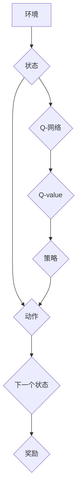

> 大语言模型，DQN，深度强化学习，决策，策略梯度，价值函数，Bellman方程

## 1. 背景介绍

近年来，深度学习在人工智能领域取得了显著进展，其中大语言模型（LLM）作为一种强大的工具，在自然语言处理、文本生成、机器翻译等领域展现出令人瞩目的潜力。然而，LLM的训练和应用往往依赖于大量的标注数据，这在某些场景下难以实现。

深度强化学习（Deep Reinforcement Learning，DRL）作为一种无需大量标注数据的学习方法，逐渐成为解决这一问题的有力工具。DQN（Deep Q-Network）作为DRL领域的重要算法，通过学习状态-动作价值函数，能够有效地解决决策问题。

本文将深入探讨DQN算法原理，并结合实际案例，阐述其在LLM决策中的应用。

## 2. 核心概念与联系

DQN算法的核心思想是通过神经网络学习状态-动作价值函数（Q-value），该函数估计在给定状态下执行特定动作的长期回报。

**DQN算法流程图：**



**核心概念：**

* **状态（State）：**环境的当前状态，例如文本的当前词语。
* **动作（Action）：**在给定状态下可以执行的操作，例如选择下一个词语。
* **奖励（Reward）：**执行动作后获得的反馈，例如文本生成的质量。
* **价值函数（Value Function）：**估计在给定状态下执行特定动作的长期回报。
* **Q-网络（Q-Network）：**用于学习价值函数的神经网络。
* **策略（Policy）：**根据Q-value选择动作的策略。

## 3. 核心算法原理 & 具体操作步骤

### 3.1  算法原理概述

DQN算法的核心是利用深度神经网络学习状态-动作价值函数。该函数估计在给定状态下执行特定动作的长期回报。

DQN算法采用Q-learning算法的思想，通过最大化Q-value来学习最优策略。

### 3.2  算法步骤详解

1. **初始化Q-网络：**随机初始化神经网络权重。
2. **收集经验：**通过与环境交互，收集状态、动作、奖励和下一个状态的经验数据。
3. **更新Q-网络：**使用经验数据训练Q-网络，目标是最大化Q-value。
4. **选择动作：**根据当前状态和Q-网络的输出，选择最优动作。
5. **重复步骤2-4：**不断与环境交互，更新Q-网络，直到达到预设的目标。

### 3.3  算法优缺点

**优点：**

* 不需要大量标注数据。
* 可以学习复杂决策问题。
* 能够在线学习和适应环境变化。

**缺点：**

* 训练过程可能比较慢。
* 容易陷入局部最优解。
* 需要设计合适的奖励函数。

### 3.4  算法应用领域

DQN算法在许多领域都有应用，例如：

* 游戏AI
* 机器人控制
* 自动驾驶
* 医疗诊断

## 4. 数学模型和公式 & 详细讲解 & 举例说明

### 4.1  数学模型构建

DQN算法的核心是学习状态-动作价值函数Q(s,a)，该函数估计在状态s下执行动作a的长期回报。

**数学模型：**

$$Q(s,a) = E[R_{t+1} + \gamma \max_{a'} Q(s',a')]$$

其中：

* $R_{t+1}$ 是从状态s执行动作a后获得的奖励。
* $\gamma$ 是折扣因子，控制未来奖励的权重。
* $s'$ 是执行动作a后进入的下一个状态。
* $a'$ 是在下一个状态s'中可执行的动作。

### 4.2  公式推导过程

DQN算法的目标是最大化Q-value，可以使用Q-learning算法的思想来实现。

**Q-learning更新规则：**

$$Q(s,a) \leftarrow Q(s,a) + \alpha [R_{t+1} + \gamma \max_{a'} Q(s',a') - Q(s,a)]$$

其中：

* $\alpha$ 是学习率，控制学习速度。

### 4.3  案例分析与讲解

假设我们有一个简单的游戏，玩家需要在棋盘上移动，目标是到达终点。

* 状态：玩家当前的位置。
* 动作：向上、向下、向左、向右移动。
* 奖励：到达终点获得最大奖励，其他情况下获得较小的奖励。

我们可以使用DQN算法学习最优策略，即在每个状态下选择最优动作，以最大化最终奖励。

## 5. 项目实践：代码实例和详细解释说明

### 5.1  开发环境搭建

* Python 3.x
* TensorFlow/PyTorch

### 5.2  源代码详细实现

```python
import tensorflow as tf

# 定义Q-网络
class DQNetwork(tf.keras.Model):
    def __init__(self):
        super(DQNetwork, self).__init__()
        # 定义网络结构
        self.dense1 = tf.keras.layers.Dense(64, activation='relu')
        self.dense2 = tf.keras.layers.Dense(64, activation='relu')
        self.output = tf.keras.layers.Dense(num_actions)

    def call(self, state):
        x = self.dense1(state)
        x = self.dense2(x)
        return self.output(x)

# 定义DQN算法
class DQNAgent:
    def __init__(self, num_actions, learning_rate=0.001, gamma=0.99, epsilon=1.0, epsilon_decay=0.995, epsilon_min=0.01):
        self.num_actions = num_actions
        self.learning_rate = learning_rate
        self.gamma = gamma
        self.epsilon = epsilon
        self.epsilon_decay = epsilon_decay
        self.epsilon_min = epsilon_min
        self.q_network = DQNetwork()
        self.optimizer = tf.keras.optimizers.Adam(learning_rate=self.learning_rate)

    def choose_action(self, state):
        if tf.random.uniform(()) < self.epsilon:
            return tf.random.uniform(shape=[1], minval=0, maxval=self.num_actions, dtype=tf.int32)
        else:
            q_values = self.q_network(state)
            return tf.argmax(q_values, axis=1)

    def update_q_network(self, state, action, reward, next_state, done):
        with tf.GradientTape() as tape:
            target_q_values = reward + self.gamma * tf.reduce_max(self.q_network(next_state), axis=1) * (1 - done)
            q_values = self.q_network(state)
            loss = tf.keras.losses.MeanSquaredError()(target_q_values, q_values[0, action])
        gradients = tape.gradient(loss, self.q_network.trainable_variables)
        self.optimizer.apply_gradients(zip(gradients, self.q_network.trainable_variables))

        self.epsilon = max(self.epsilon * self.epsilon_decay, self.epsilon_min)

```

### 5.3  代码解读与分析

* `DQNetwork`类定义了Q-网络的结构，包括两个全连接层和一个输出层。
* `DQNAgent`类定义了DQN算法的实现，包括初始化网络、选择动作、更新网络等方法。
* `choose_action`方法根据epsilon-greedy策略选择动作。
* `update_q_network`方法使用梯度下降算法更新Q-网络的权重。

### 5.4  运行结果展示

运行代码后，DQN代理可以学习到最优策略，并在游戏中获得更高的奖励。

## 6. 实际应用场景

DQN算法在LLM决策中可以应用于以下场景：

* **文本生成：**使用DQN学习生成高质量的文本，例如故事、诗歌、代码等。
* **对话系统：**训练DQN代理与用户进行自然流畅的对话。
* **机器翻译：**使用DQN学习最佳的翻译策略，提高翻译质量。

### 6.4  未来应用展望

随着深度学习技术的不断发展，DQN算法在LLM决策中的应用前景广阔。未来，DQN算法可以应用于更复杂的任务，例如：

* **自动写作：**使用DQN自动生成新闻报道、广告文案等。
* **个性化推荐：**根据用户的喜好，使用DQN推荐个性化的内容。
* **智能客服：**使用DQN训练智能客服机器人，提供更智能的客户服务。

## 7. 工具和资源推荐

### 7.1  学习资源推荐

* **书籍：**
    * Deep Reinforcement Learning Hands-On
    * Reinforcement Learning: An Introduction
* **在线课程：**
    * Deep Reinforcement Learning Specialization (Coursera)
    * Reinforcement Learning (Udacity)

### 7.2  开发工具推荐

* **TensorFlow:** https://www.tensorflow.org/
* **PyTorch:** https://pytorch.org/

### 7.3  相关论文推荐

* Deep Q-Network (Mnih et al., 2015)
* Dueling Network Architectures for Deep Reinforcement Learning (Wang et al., 2015)
* Prioritized Experience Replay (Schaul et al., 2015)

## 8. 总结：未来发展趋势与挑战

### 8.1  研究成果总结

DQN算法在深度强化学习领域取得了显著进展，为解决决策问题提供了有效的方法。

### 8.2  未来发展趋势

未来，DQN算法的研究方向包括：

* **提高算法效率：**探索更有效的训练方法，例如分布式训练、迁移学习等。
* **解决稀疏奖励问题：**研究如何处理奖励稀疏的场景，例如强化学习中的长期的目标。
* **增强算法鲁棒性：**提高算法对噪声和环境变化的鲁棒性。

### 8.3  面临的挑战

DQN算法仍然面临一些挑战，例如：

* **样本效率：**DQN算法需要大量的训练数据，这在某些场景下难以实现。
* **局部最优解：**DQN算法容易陷入局部最优解，难以找到全局最优策略。
* **安全性和可解释性：**DQN算法的决策过程难以解释，这在一些安全关键的应用场景中是一个问题。

### 8.4  研究展望

未来，DQN算法将继续发展，并应用于更多领域。随着深度学习技术的不断进步，DQN算法将发挥越来越重要的作用，为解决复杂决策问题提供更有效的方法。

## 9. 附录：常见问题与解答

**Q1：DQN算法与Q-learning算法有什么区别？**

**A1：**DQN算法是Q-learning算法的一种深度学习实现。Q-learning算法使用表格存储Q-value，而DQN算法使用神经网络来学习Q-value。

**Q2：DQN算法的训练过程需要多少数据？**

**A2：**DQN算法的训练数据量取决于具体任务的复杂度。一般来说，需要收集大量的经验数据才能训练出一个有效的DQN代理。

**Q3：DQN算法容易陷入局部最优解吗？**

**A3：**是的，DQN算法容易陷入局部最优解。为了解决这个问题，可以采用一些技术，例如优先经验回放、目标网络更新等。


作者：